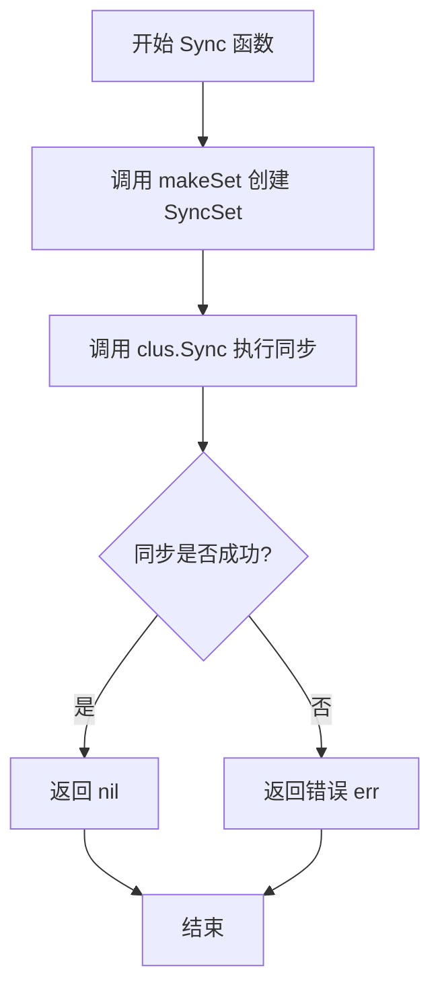
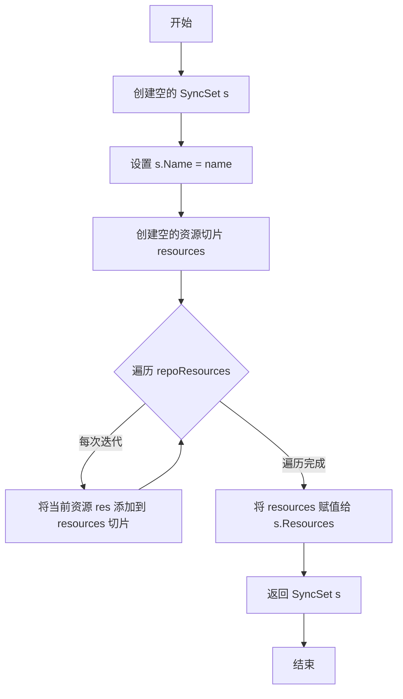
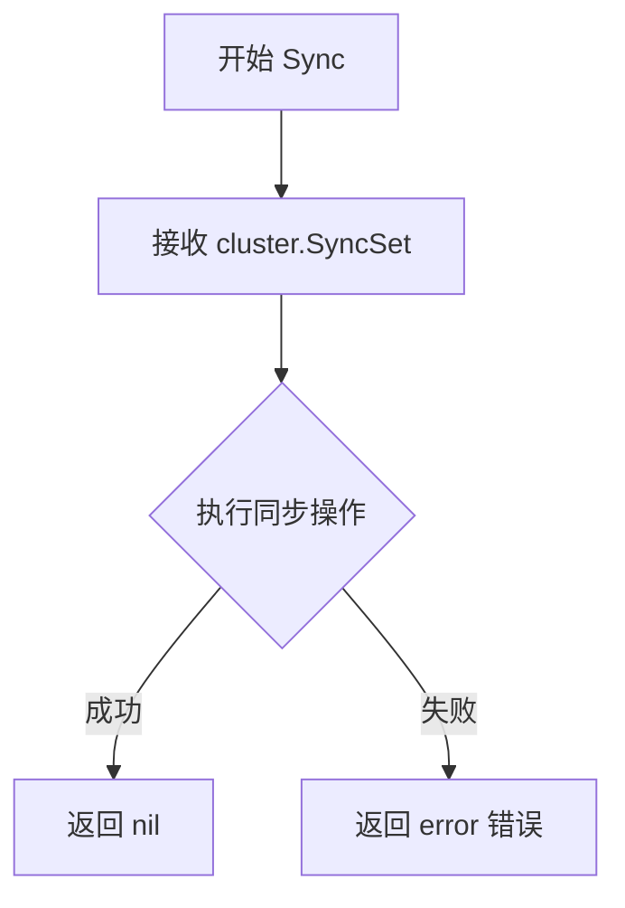

# `flux\pkg\sync\sync.go` 详细设计文档

该代码定义了一个Syncer接口和一个Sync函数，用于将集群资源同步到指定的目录，通过创建SyncSet并调用集群的Sync方法实现同步。

## 整体流程

```mermaid
graph TD
    A[开始 Sync 函数] --> B[调用 makeSet 创建 SyncSet]
    B --> C[调用 clus.Sync(set) 同步集群]
    C --> D{是否有错误}
    D -- 是 --> E[返回错误 err]
    D -- 否 --> F[返回 nil]
```

## 类结构

```
sync 包
├── Syncer 接口
│   └── Sync(cluster.SyncSet) error
├── Sync 函数 (公开)
└── makeSet 函数 (私有)
```

## 全局变量及字段


### `Syncer`
    
定义Sync方法的接口，用于编译和运行sync操作

类型：`interface`
    


### `Sync`
    
主同步函数，将本地资源同步到集群

类型：`function`
    


### `makeSet`
    
辅助函数，将资源映射转换为SyncSet结构

类型：`function`
    


### `setName`
    
SyncSet的名称参数

类型：`string`
    


### `repoResources`
    
本地资源文件映射表

类型：`map[string]resource.Resource`
    


### `clus`
    
集群同步器接口实现

类型：`Syncer`
    


### `set`
    
创建的SyncSet对象

类型：`cluster.SyncSet`
    


### `s`
    
用于构建的临时SyncSet变量

类型：`cluster.SyncSet`
    


### `resources`
    
资源列表切片

类型：`[]resource.Resource`
    


### `res`
    
遍历过程中的单个资源

类型：`resource.Resource`
    


    

## 全局函数及方法


### `Sync`

该函数是同步模块的核心入口函数，负责将仓库中的资源文件同步到集群中。它接收资源名称、仓库资源映射和集群同步器，创建一个SyncSet对象并调用集群同步器执行实际同步操作。

参数：

- `setName`：`string`，SyncSet的名称，用于标识本次同步操作
- `repoResources`：`map[string]resource.Resource`，从仓库中解析出的资源映射，键为资源ID，值为资源对象
- `clus`：`Syncer`，集群同步器接口实例，负责执行实际的集群同步操作

返回值：`error`，同步过程中发生的错误，如果有则返回错误，否则返回nil

#### 流程图



#### 带注释源码

```go
// Sync synchronises the cluster to the files under a directory.
// Sync函数将集群同步到指定目录下的文件
// 参数：
//   - setName: SyncSet的名称，用于标识同步集
//   - repoResources: 资源映射表，包含从仓库中读取的资源
//   - clus: 实现了Syncer接口的集群客户端，用于执行实际同步
//
// 返回值：
//   - error: 同步过程中发生的错误，如果成功则返回nil
func Sync(setName string, repoResources map[string]resource.Resource, clus Syncer) error {
    // 调用makeSet函数将仓库资源包装成SyncSet对象
    set := makeSet(setName, repoResources)
    
    // 调用集群同步器的Sync方法执行实际同步操作
    if err := clus.Sync(set); err != nil {
        // 如果同步失败，立即返回错误
        return err
    }
    
    // 同步成功，返回nil表示无错误
    return nil
}
```


### `makeSet`

该函数用于将资源映射（repoResources）转换为集群同步集（cluster.SyncSet），遍历资源映射并将所有资源收集到一个 SyncSet 结构体中返回。

参数：

- `name`：`string`，sync set 的名称
- `repoResources`：`map[string]resource.Resource`，资源名称到资源对象的映射

返回值：`cluster.SyncSet`，包含名称和资源列表的同步集对象

#### 流程图



#### 带注释源码

```go
// makeSet 将资源映射转换为集群同步集
// 参数:
//   - name: sync set 的名称
//   - repoResources: 资源名称到资源对象的映射
//
// 返回值:
//   - cluster.SyncSet: 包含名称和资源列表的同步集对象
func makeSet(name string, repoResources map[string]resource.Resource) cluster.SyncSet {
	// 1. 创建一个 SyncSet 结构体，并设置名称
	s := cluster.SyncSet{Name: name}
	
	// 2. 创建一个空的 Resource 切片用于收集所有资源
	var resources []resource.Resource
	
	// 3. 遍历资源映射，将每个资源添加到切片中
	// 注意：这里丢失了 map 的顺序，因为 map 遍历顺序是不确定的
	for _, res := range repoResources {
		resources = append(resources, res)
	}
	
	// 4. 将收集到的资源切片赋值给 SyncSet 的 Resources 字段
	s.Resources = resources
	
	// 5. 返回构建好的 SyncSet
	return s
}
```


### `Syncer.Sync`

这是 Syncer 接口中定义的同步方法，用于将给定的 cluster.SyncSet 同步到集群中。该方法接收一个 SyncSet 对象，其中包含要同步的资源列表，并尝试将这些资源应用到目标集群。

参数：

- `syncSet`：`cluster.SyncSet`，需要同步到集群的同步集，包含名称和资源列表

返回值：`error`，如果同步成功则返回 nil，如果发生错误则返回具体的错误信息

#### 流程图



#### 带注释源码

```go
// Syncer has the methods we need to be able to compile and run a sync
// Syncer 接口定义了编译和运行同步所需的方法
type Syncer interface {
	// Sync synchronises the cluster to the given SyncSet
	// Sync 方法将集群同步到给定的 SyncSet
	Sync(cluster.SyncSet) error
}

// Sync synchronises the cluster to the files under a directory.
// Sync 函数将集群同步到给定目录下的文件
// 参数：
//   - setName: string，同步集的名称
//   - repoResources: map[string]resource.Resource，资源仓库中的资源映射
//   - clus: Syncer，用于执行同步的 Syncer 实例
// 返回值：
//   - error，同步过程中发生的错误
func Sync(setName string, repoResources map[string]resource.Resource, clus Syncer) error {
	// 调用 makeSet 创建 SyncSet 对象
	set := makeSet(setName, repoResources)
	// 调用 Syncer 的 Sync 方法执行同步
	if err := clus.Sync(set); err != nil {
		// 如果发生错误，返回错误
		return err
	}
	// 同步成功，返回 nil
	return nil
}

// makeSet 是一个辅助函数，用于从资源映射创建 cluster.SyncSet
// 参数：
//   - name: string，SyncSet 的名称
//   - repoResources: map[string]resource.Resource，资源映射
// 返回值：
//   - cluster.SyncSet，创建的同步集对象
func makeSet(name string, repoResources map[string]resource.Resource) cluster.SyncSet {
	// 创建 SyncSet 并设置名称
	s := cluster.SyncSet{Name: name}
	var resources []resource.Resource
	// 将 map 中的所有资源添加到切片中
	for _, res := range repoResources {
		resources = append(resources, res)
	}
	// 设置 SyncSet 的资源列表
	s.Resources = resources
	return s
}
```

## 关键组件


### Syncer接口
定义同步操作的接口，包含Sync方法用于同步集群资源。

### Sync函数
主同步函数，将仓库资源同步到集群，接收setName、repoResources和clus参数。

### makeSet函数
辅助函数，用于将仓库资源转换为cluster.SyncSet结构。


## 问题及建议


### 已知问题

-   **编译错误**：`makeSet`函数定义中参数名为`repo`，但函数体内使用`repoResources`，导致变量未定义的编译错误
-   **缺少输入验证**：函数参数没有进行空值检查，`repoResources`为nil或空map时可能导致潜在问题
-   **缺乏日志记录**：关键操作（如同步开始、结束、错误）没有日志输出，难以追踪调试
-   **错误上下文不足**：返回的错误缺乏上下文信息，调用方难以判断具体失败原因

### 优化建议

-   **修复编译错误**：将`makeSet`函数参数名统一为`repoResources`
-   **添加参数校验**：在`Sync`函数入口添加参数空值检查，提升函数健壮性
-   **增强错误包装**：使用`fmt.Errorf`或专门的错误包装方式，为错误添加上下文信息（如包含setName等关键信息）
-   **优化资源复制逻辑**：可以使用`make([]resource.Resource, 0, len(repoResources))`预先分配容量，减少内存分配开销
-   **添加日志记录**：在关键路径添加日志记录，便于问题排查和运行监控
-   **考虑添加超时控制**：对于集群同步操作，建议添加上下文（context）参数支持超时控制和取消操作

## 其它


### 设计目标与约束

本模块的设计目标是提供一种将本地仓库中的资源文件同步到Kubernetes集群的机制。核心约束包括：依赖cluster.SyncSet和resource.Resource这两个核心数据结构；必须实现Syncer接口才能使用；同步过程是同步阻塞的，不支持异步操作；资源映射使用string作为键值对。

### 错误处理与异常设计

错误处理采用Go语言的错误返回机制。Sync函数直接返回clus.Sync(set)调用产生的错误，不进行额外的错误包装或重试逻辑。如果传入的repoResources为空映射，makeSet函数仍会创建空的SyncSet并尝试同步，这可能导致集群端的行为差异。缺乏参数校验（如name为空字符串的情况）是一个潜在的异常场景。

### 外部依赖与接口契约

本模块依赖两个外部包：github.com/fluxcd/flux/pkg/cluster提供SyncSet类型和相关集群操作接口；github.com/fluxcd/flux/pkg/resource提供Resource类型。Syncer接口是关键的抽象契约，实现该接口的类型必须能够接收cluster.SyncSet并执行同步操作。传入的repoResources映射的键（string类型）在此模块中未被使用，仅遍历其值。

### 性能考虑

在makeSet函数中，每次append操作可能导致底层切片重新分配，建议预先分配切片容量或使用make函数创建指定长度的切片。repoResources的遍历顺序是未定义的，如果资源同步顺序重要，需要考虑排序逻辑。当前实现逐个同步资源，未利用批量同步的潜在优化。

### 安全性考虑

代码本身不直接涉及敏感数据处理，但需要注意：repoResources来自外部输入（可能是用户提交的配置文件），需要在上层验证其内容合法性；同步操作可能涉及集群凭证，应确保clus实现正确处理认证信息；缺乏超时机制可能导致同步操作无限期阻塞。

### 测试策略

建议添加以下测试用例：测试repoResources为空时的行为；测试makeSet函数正确构建SyncSet；测试Sync函数正确调用clus.Sync；测试错误传播机制；测试边界情况如大量资源的处理性能。

### 使用示例

```go
// 创建资源映射
resources := make(map[string]resource.Resource)
resources["deployment.yaml"] = myResource

// 创建Syncer实现
clus := &myClusterClient{}

// 调用Sync
err := Sync("my-set", resources, clus)
```

### 并发考虑

当前实现不是线程安全的，如果多个goroutine同时调用Sync函数，可能产生竞态条件。repoResources映射的遍历在Go中是安全的，但如果有并发写入需求，需要在外层添加同步机制。

### 配置说明

本模块不包含配置参数，所有配置通过函数参数传递。setName参数用于标识同步集的唯一名称，repoResources包含需要同步的资源定义，clus参数封装了集群连接和操作逻辑。


    