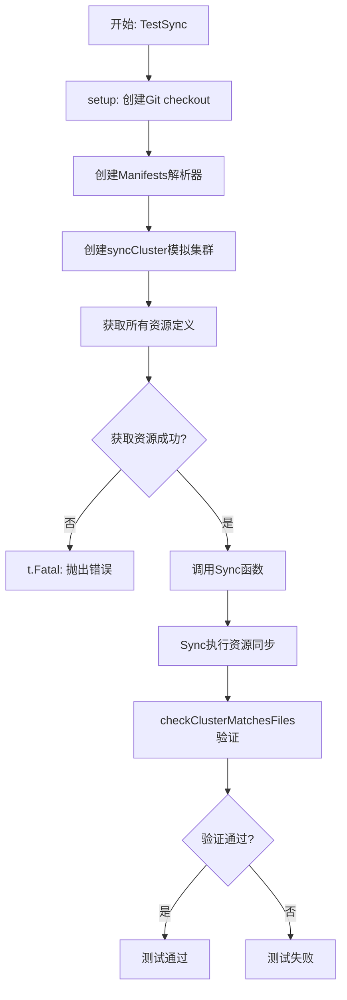
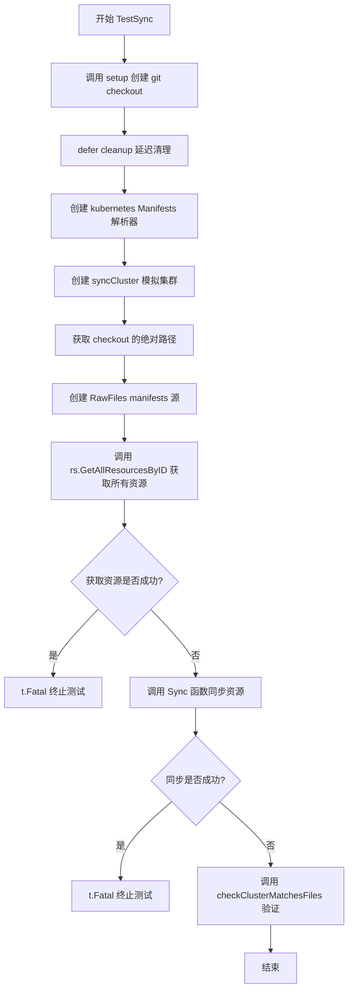
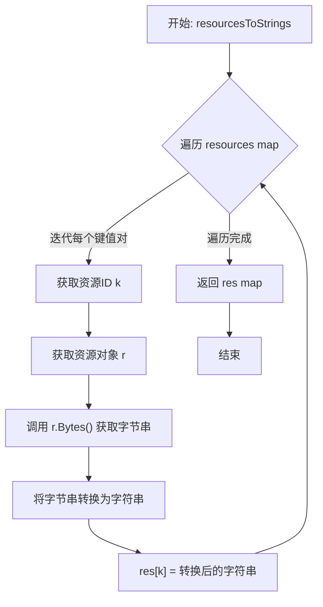
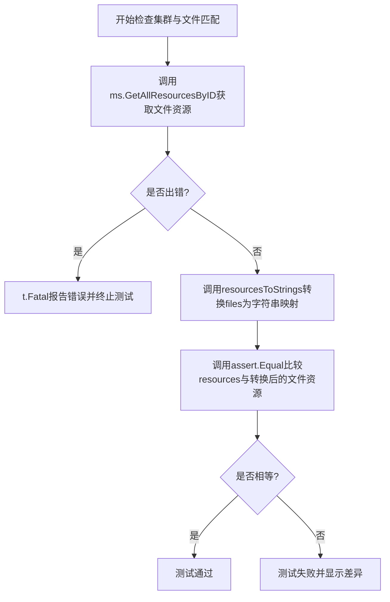
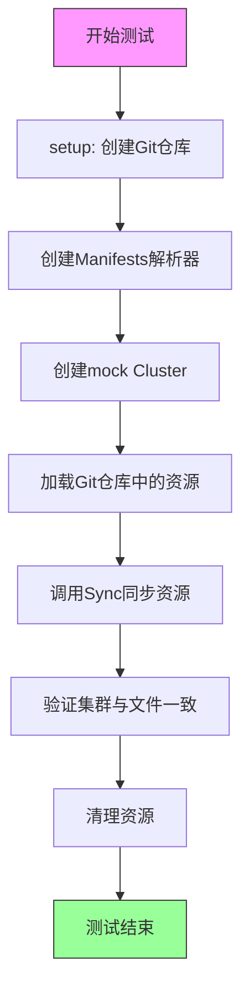

# `flux\pkg\sync\sync_test.go` 详细设计文档

这是一个Flux CD项目的同步功能测试文件，通过模拟Git仓库和Kubernetes集群的交互，验证Sync函数能否正确将Git中的资源定义同步到集群中，并确保集群状态与Git仓库保持一致。

## 整体流程



## 类结构

```
syncCluster (测试用模拟集群)
└── 实现 cluster.Sync 接口
```

## 全局变量及字段


### `gitconf`
    
Git configuration for test notes reference, user name and email

类型：`git.Config`
    


### `syncCluster.resources`
    
A map storing resource IDs (keys) to their byte representation (values) for tracking applied resources

类型：`map[string]string`
    
    

## 全局函数及方法


### `TestSync`

这是一个测试函数，用于验证集群同步功能。它创建测试环境、初始化 kubernetes manifests 解析器和模拟集群，获取 git 仓库中的资源，然后调用 Sync 函数进行同步，最后验证集群中的资源与文件系统中的资源是否一致。

参数：

- `t`：`testing.T`，Go 测试框架的测试对象，用于报告测试失败

返回值：无（Go 测试函数不返回值）

#### 流程图



#### 带注释源码

```go
// TestSync 测试集群同步功能
// 验证 cluster.Sync 是否在运行时正确调用
func TestSync(t *testing.T) {
	// 1. 设置测试环境，获取 git checkout 和清理函数
	checkout, cleanup := setup(t)
	// 2. 延迟执行清理函数，确保测试结束后资源被释放
	defer cleanup()

	// 3. 创建 manifest 解析器，使用 default 命名空间
	parser := kubernetes.NewManifests(kubernetes.ConstNamespacer("default"), log.NewLogfmtLogger(os.Stdout))
	// 4. 创建模拟集群，用于记录同步的资源
	clus := &syncCluster{map[string]string{}}

	// 5. 获取 git checkout 的绝对路径列表
	dirs := checkout.AbsolutePaths()
	// 6. 创建 manifest 源，从文件系统中读取资源
	rs := manifests.NewRawFiles(checkout.Dir(), dirs, parser)
	// 7. 获取所有资源
	resources, err := rs.GetAllResourcesByID(context.TODO())
	if err != nil {
		t.Fatal(err)
	}

	// 8. 调用 Sync 函数进行同步
	if err := Sync("synctest", resources, clus); err != nil {
		t.Fatal(err)
	}
	// 9. 验证集群中的资源与文件系统中的资源是否一致
	checkClusterMatchesFiles(t, rs, clus.resources, checkout.Dir(), dirs)
}
```


### `setup`

该函数是一个测试辅助函数，用于创建一个临时的Git仓库检出（checkout）对象，并返回一个清理函数以在测试完成后释放资源。

参数：

- `t`：`testing.T`，Go测试框架的测试对象，用于报告测试失败和控制测试行为

返回值：`*git.Checkout, func()`，返回Git仓库的检出对象指针，以及一个无参数无返回值的清理函数，用于在测试结束时清理临时资源

#### 流程图

```mermaid
flowchart TD
    A[开始 setup 函数] --> B[接收测试参数 t]
    B --> C[调用 gittest.Checkout(t)]
    C --> D[返回 git.Checkout 指针和清理函数]
    D --> E[测试函数使用 Checkout]
    E --> F[测试结束后调用清理函数]
    F --> G[结束]
```

#### 带注释源码

```go
// setup 是一个测试辅助函数，用于创建测试所需的Git仓库环境
// 参数 t 是Go标准库testing包的测试对象
// 返回值包含两个部分：
//   - *git.Checkout: Git仓库的检出对象，包含仓库路径等信息
//   - func(): 清理函数，用于删除测试创建的临时目录和资源
func setup(t *testing.T) (*git.Checkout, func()) {
	// 调用gittest.Checkout创建测试用的Git仓库检出
	// 该函数内部会：
	// 1. 创建临时目录
	// 2. 初始化Git仓库
	// 3. 创建一些测试用的文件和提交
	// 4. 返回Checkout对象和清理函数
	return gittest.Checkout(t)
}
```


### `resourcesToStrings`

该函数将 `resource.Resource` 类型的映射转换为字符串映射，通过遍历输入的资源映射，调用每个资源的 `Bytes()` 方法将其序列化为字节串，并以资源ID为键存储在返回的字符串映射中。此转换主要用于将资源对象与集群中已存储的字符串形式资源进行比对和验证。

参数：

- `resources`：`map[string]resource.Resource`，输入的资源映射，键为资源ID字符串，值为 resource.Resource 类型的资源对象

返回值：`map[string]string`，输出字符串映射，键为资源ID字符串，值为资源对象序列化后的字节串

#### 流程图



#### 带注释源码

```go
// resourcesToStrings 将 resource.Resource 类型的映射转换为字符串映射
// 参数 resources: 资源ID到资源对象的映射
// 返回值: 资源ID到资源序列化字符串的映射，用于后续的集群状态比对
func resourcesToStrings(resources map[string]resource.Resource) map[string]string {
	// 初始化结果映射，用于存储转换后的字符串资源
	res := map[string]string{}
	
	// 遍历输入的资源映射，逐个将资源对象转换为字节串
	for k, r := range resources {
		// k: 资源ID字符串（如 "default/deployment:my-app"）
		// r: resource.Resource 类型的资源对象
		
		// 调用资源的 Bytes() 方法获取资源的序列化字节表示
		// 该方法返回资源的 YAML/JSON 格式字节流
		res[k] = string(r.Bytes())
		// 将字节串转换为字符串并存储到结果映射中
	}
	
	// 返回转换完成的字符串资源映射
	return res
}
```


### `checkClusterMatchesFiles`

该函数是一个测试辅助函数，用于验证集群中同步的资源与Git仓库中的文件资源是否一致，确保数据模型的导出始终反映Git中的实际状态。

参数：

- `t`：`*testing.T`，Go测试框架的测试对象，用于报告测试失败
- `ms`：`manifests.Store`，manifest存储接口，提供获取所有资源的方法
- `resources`：`map[string]string`，表示当前集群中的资源映射，键为资源ID，值为资源内容
- `base`：`string`，文件检查的基础路径（当前未使用）
- `dirs`：`[]string`，要检查的目录列表（当前未使用）

返回值：无（函数通过`t.Fatal`报告错误，通过`assert.Equal`断言验证一致性）

#### 流程图



#### 带注释源码

```go
// checkClusterMatchesFiles 验证集群资源与Git仓库文件资源的一致性
// 这是一个测试辅助函数，确保我们从集群导出的模型始终反映Git中的实际状态
func checkClusterMatchesFiles(t *testing.T, ms manifests.Store, resources map[string]string, base string, dirs []string) {
	// 从manifest存储获取所有文件资源
	// ms.GetAllResourcesByID 返回所有已配置的Kubernetes资源
	files, err := ms.GetAllResourcesByID(context.Background())
	
	// 如果获取资源失败，终止测试并报告错误
	if err != nil {
		t.Fatal(err)
	}

	// 使用断言验证集群中的资源与文件中的资源是否完全匹配
	// 第一个参数t用于报告失败位置，第二个是期望值，第三个是实际值
	assert.Equal(t, resources, resourcesToStrings(files))
}
```


### `syncCluster.Sync`

该方法用于将 `cluster.SyncSet` 中定义的所有资源同步到集群中，遍历资源列表并将每个资源的ID和内容存储到内部映射中，同时打印同步进度信息。

参数：

- `def`：`cluster.SyncSet`，包含需要同步的资源集合，定义了需要应用或删除的资源列表

返回值：`error`，如果同步过程中发生错误则返回错误信息，否则返回 nil 表示同步成功

#### 流程图

```mermaid
flowchart TD
    A[开始 Sync] --> B[打印 "=== Syncing ==="]
    B --> C{遍历 def.Resources}
    C -->|每次迭代| D[获取当前资源]
    D --> E[打印 "Applying " + 资源ID]
    E --> F[将资源ID和内容存入 p.resources]
    F --> C
    C -->|遍历完成| G[打印 "=== Done syncing ==="]
    G --> H[返回 nil]
    H --> I[结束 Sync]
```

#### 带注释源码

```go
// Sync 方法实现了 cluster.Cluster 接口的 Sync 功能
// 参数 def 是一个 cluster.SyncSet，包含需要同步到集群的资源集合
// 返回 error 类型，如果同步成功返回 nil，否则返回具体错误信息
func (p *syncCluster) Sync(def cluster.SyncSet) error {
    // 打印同步开始标记，用于调试和日志记录
    println("=== Syncing ===")
    
    // 遍历 SyncSet 中的所有资源
    for _, resource := range def.Resources {
        // 打印正在应用的资源ID，便于追踪同步进度
        println("Applying " + resource.ResourceID().String())
        
        // 将资源的ID作为键，资源的原始字节内容作为值
        // 存储到 syncCluster 的 resources 映射中
        // 这里模拟了将资源应用到集群的过程
        p.resources[resource.ResourceID().String()] = string(resource.Bytes())
    }
    
    // 打印同步完成标记
    println("=== Done syncing ===")
    
    // 同步过程没有错误，返回 nil
    return nil
}
```

## 关键组件


### syncCluster（模拟集群）

用于测试的内存集群实现，实现了cluster.Sync接口。它维护一个资源map，记录所有被同步的资源，用于验证同步逻辑的正确性。

### manifests.Store（清单存储）

资源清单存储接口，负责从Git仓库读取资源定义。代码中使用RawFiles实现，通过parser解析YAML/JSON文件。

### cluster.SyncSet（同步集）

定义了需要同步的资源集合，包含资源列表和策略信息。Sync方法接收此参数进行资源应用。

### resourcesToStrings（资源转换工具）

将resource.Resource类型的map转换为string类型的map，用于测试中断言的对比。

### checkClusterMatchesFiles（验证函数）

测试辅助函数，验证从集群导出的资源与Git仓库中的文件完全一致，确保模型与Git状态始终同步。

### gitconf（Git配置）

全局变量，定义了测试使用的Git配置，包括notes引用、用户名和邮箱。


## 问题及建议


### 已知问题

-   **硬编码的调试输出**：使用 `println` 而非正式的日志框架（如代码中已导入的 `kit/log`），在生产环境中无法控制日志级别和输出格式
-   **未使用的全局变量**：`gitconf` 变量被定义但在整个测试文件中未被使用，造成代码冗余
-   **不恰当的上下文使用**：混用 `context.TODO()` 和 `context.Background()`，前者应仅作为临时占位符
-   **魔法字符串**：命名空间 "default" 被硬编码在 `kubernetes.ConstNamespacer("default")` 中，缺乏可配置性
- **错误处理粒度**：使用 `t.Fatal` 会立即终止测试，无法进行更细粒度的错误区分和清理
- **资源映射非线程安全**：`syncCluster` 的 `resources` map 在并发场景下存在竞态条件风险
- **测试辅助函数可见性**：`checkClusterMatchesFiles` 以小写开头但被其他测试函数调用，命名约定不够清晰
- **缺乏测试覆盖**：仅有一个核心测试用例 `TestSync`，未覆盖边界条件、错误路径和并发场景

### 优化建议

-   **标准化日志输出**：将 `println` 替换为 `log.NewLogfmtLogger(os.Stdout).Log(...)` 或其他结构化日志方式
-   **移除未使用代码**：删除未使用的 `gitconf` 全局变量，或在测试中合理使用
-   **统一上下文管理**：统一使用 `context.Background()` 或通过测试框架传入可取消的 context
-   **配置外部化**：将命名空间等硬编码值提取为测试参数或配置结构
-   **增强错误处理**：考虑使用 `t.Error` 配合错误信息而非立即 `t.Fatal`，保留更多测试上下文
-   **并发安全**：如需支持并发测试，为 `syncCluster.resources` 添加互斥锁（`sync.Mutex`）
-   **显式函数可见性**：如 `checkClusterMatchesFiles` 需跨文件共享，考虑重命名为 `CheckClusterMatchesFiles` 或移至同一文件内部
-   **扩展测试用例**：添加错误场景测试（如 Sync 返回错误）、空资源测试、重复同步测试等


## 其它


### 设计目标与约束

本代码的核心设计目标是通过测试验证 `Sync` 函数能够正确将 Git 仓库中的资源同步到 Kubernetes 集群。设计约束包括：使用内存模拟集群而非真实 Kubernetes 集群以保持测试轻量；确保测试的确定性和幂等性；验证集群导出的模型与 Git 中的内容始终一致。

### 错误处理与异常设计

测试中的错误处理采用 Go 标准模式：使用 `t.Fatal` 或 `t.Error` 报告测试失败。`Sync` 函数返回 error 时通过 `t.Fatal(err)` 立即终止测试。资源获取失败同样调用 `t.Fatal(err)`。测试设计遵循"快速失败"原则，任何错误都导致测试不可通过，不存在静默降级或重试逻辑。

### 数据流与状态机

数据流从 Git 仓库开始：gittest.Checkout 创建测试用 Git 仓库 → kubernetes.NewManifests 解析 manifests → manifests.NewRawFiles 加载资源 → rs.GetAllResourcesByID 获取所有资源 → 调用 Sync 同步到 mock 集群 → checkClusterMatchesFiles 验证结果。状态机包含三个状态：初始状态（空集群）、同步状态（资源已应用）、验证状态（已校验一致性）。

### 外部依赖与接口契约

本测试依赖以下外部包：github.com/go-kit/kit/log（日志）、github.com/stretchr/testify/assert（断言）、github.com/fluxcd/flux/pkg/cluster（集群接口）、github.com/fluxcd/flux/pkg/git（Git 操作）、github.com/fluxcd/flux/pkg/manifests（Manifests 存储）、github.com/fluxcd/flux/pkg/resource（资源对象）。接口契约方面：`cluster.Sync` 接受 `cluster.SyncSet` 参数并返回 error；`manifests.Store` 的 `GetAllResourcesByID` 返回 `map[string]resource.Resource` 和 error；`git.Checkout` 提供 `AbsolutePaths()` 和 `Dir()` 方法。

### 性能考虑与资源管理

测试性能关键点：Git 仓库初始化可能较慢，通过 gittest.Checkout 复用测试 fixtures；资源解析与加载在每次测试中执行，无缓存优化；mock 集群使用 map 存储资源，查找复杂度 O(1)。资源管理通过 defer cleanup() 确保 Git 仓库清理，使用 t.Cleanup()（Go 1.14+）是更现代的替代方案。

### 并发与线程安全分析

当前测试为串行执行，无并发场景。syncCluster 使用 map 存储资源，非并发安全，但测试环境为单线程因此无需锁。若未来需要并发测试 syncCluster，需添加 sync.RWMutex 保护 resources 字段。

### 测试覆盖与边界条件

测试覆盖了核心同步流程，边界条件包括：空资源场景（Start with nothing running）、资源存在但集群为空、manifest 解析异常场景。当前测试未覆盖：部分同步失败回滚、并发同步竞争、资源删除场景、Git 仓库与集群状态不一致的恢复。

### 安全考量

测试代码本身无安全敏感操作，但涉及安全相关配置：gitconf 包含测试用用户信息（UserName: "testuser", UserEmail: "test@example.com"），生产环境应使用独立 Git 凭证。测试不应在真实集群执行，避免意外修改生产资源。

### 配置与可扩展性

gitconf 作为全局配置变量定义了测试 Git 笔记引用、用户名称和邮箱。parser 使用 ConstNamespacer("default") 设置默认命名空间。集群和 manifests 实现可通过依赖注入替换，便于测试其他存储后端或集群实现。

### 依赖版本与兼容性

代码使用 Go 测试框架，依赖 fluxcd/flux 包的特定版本。kubernetes 包路径（github.com/fluxcd/flux/pkg/cluster/kubernetes）表明测试与 Flux v1 版本兼容。升级到 Flux v2 或其他 GitOps 工具链需要调整 import 路径和接口定义。

### 代码组织与模块化

测试代码遵循 Go 测试约定：测试文件以 `_test.go` 结尾，与主代码同包（package sync）以便访问未导出函数。辅助函数（resourcesToStrings, checkClusterMatchesFiles）独立于测试函数，便于复用和重构。setup 函数封装复杂初始化逻辑，保持测试函数简洁。

### 已知限制与未来改进

技术债务包括：使用 println 而非正式日志框架；syncCluster 实现简化，无真实集群状态管理；缺少对 Sync 函数返回值错误的显式测试（目前仅检查 err 是否为 nil）。优化方向：使用 t.Logf 替代 println；增加更多边界场景测试；添加性能基准测试；考虑使用 testify/require 替代 assert 提供更丰富的失败信息。

### Mermaid 流程图



### 全局变量详情

| 名称 | 类型 | 描述 |
|------|------|------|
| gitconf | git.Config | 测试用Git配置，包含笔记引用、用户名和邮箱 |

### 类结构详情

**syncCluster 结构体**

| 字段 | 类型 | 描述 |
|------|------|------|
| resources | map[string]string | 存储已同步资源的映射，键为资源ID，值为资源字节内容 |

### 函数与方法的源码注释

```go
// Sync 是被测试的同步函数，负责将资源同步到集群
// 参数：
//   - name: 同步任务名称
//   - resources: 要同步的资源映射
//   - clus: 目标集群实例
// 返回值：
//   - error: 同步过程中的错误
func Sync(name string, resources map[string]resource.Resource, clus cluster.Cluster) error

// setup 初始化测试环境，创建临时Git仓库
// 参数：
//   - t: testing.T 测试框架实例
// 返回值：
//   - *git.Checkout: Git仓库检出对象
//   - func(): 清理函数
func setup(t *testing.T) (*git.Checkout, func())

// Sync 实现cluster.Cluster接口的Sync方法
// 参数：
//   - def: cluster.SyncSet 同步集定义
// 返回值：
//   - error: 同步错误
func (p *syncCluster) Sync(def cluster.SyncSet) error

// resourcesToStrings 将资源映射转换为字符串映射
// 参数：
//   - resources: 资源映射
// 返回值：
//   - map[string]string: 字符串映射
func resourcesToStrings(resources map[string]resource.Resource) map[string]string

// checkClusterMatchesFiles 验证集群资源与Git文件一致
// 参数：
//   - t: testing.T
//   - ms: manifests.Store
//   - resources: 期望的资源映射
//   - base: 基础目录
//   - dirs: 目录列表
func checkClusterMatchesFiles(t *testing.T, ms manifests.Store, resources map[string]string, base string, dirs []string)
```


    