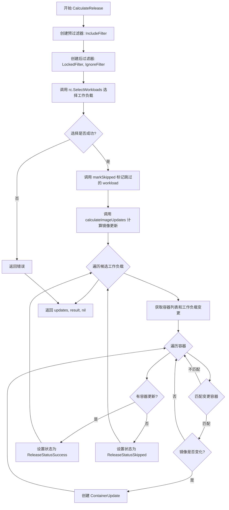
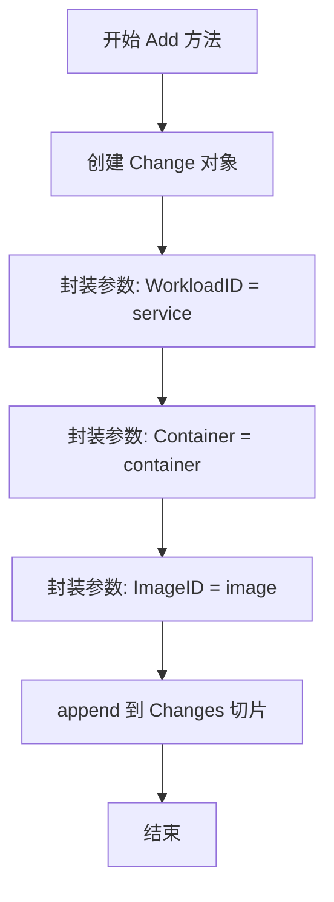
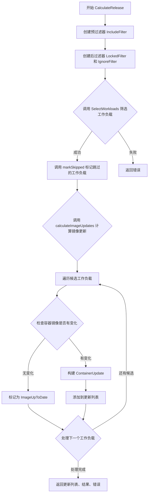
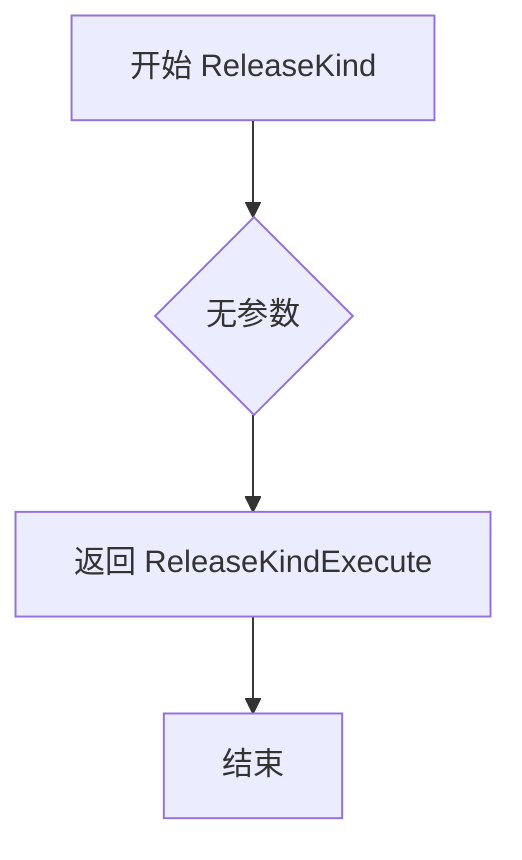
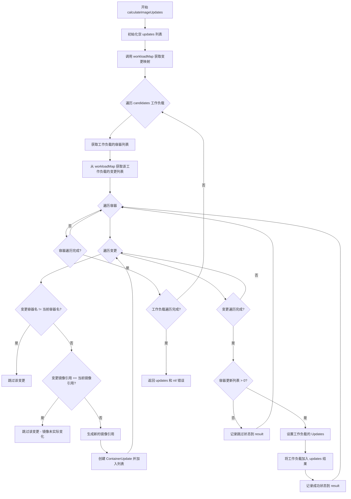
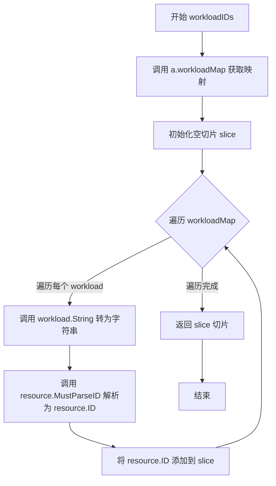

# `flux\pkg\update\automated.go` 详细设计文档

这是FluxCD自动化发布模块，核心功能是管理容器镜像的自动化更新，通过过滤器选择工作负载、计算镜像变更、生成发布结果和提交信息，实现无需人工干预的持续部署流程。

## 整体流程



## 类结构

```
ReleaseStrategy (接口/基类)
└── Automated (自动化发布实现)
    ├── Change (变更记录)
    ├── WorkloadFilter (过滤器接口)
    │   ├── IncludeFilter
    │   ├── LockedFilter
    │   └── IgnoreFilter
    └── Related: ReleaseContext, Result, WorkloadUpdate
```

## 全局变量及字段


### `Automated.Changes`
    
存储工作负载的镜像变更列表

类型：`[]Change`
    


### `Change.WorkloadID`
    
工作负载标识

类型：`resource.ID`
    


### `Change.Container`
    
容器配置

类型：`resource.Container`
    


### `Change.ImageID`
    
目标镜像引用

类型：`image.Ref`
    
    

## 全局函数及方法


### `Automated.Add`

该方法用于向 Automated 结构体的变更记录列表中添加一条容器镜像更新信息，将工作负载ID、容器配置和目标镜像封装为 Change 对象并追加到 Changes 切片中。

**参数：**

- `service`：`resource.ID`，目标工作负载的唯一标识符，用于指定需要更新的服务
- `container`：`resource.Container`，容器配置信息，包含容器名称和当前镜像等
- `image`：`image.Ref`，目标镜像引用，指定需要更新到的镜像版本

**返回值：** `void`（无返回值），该方法直接修改 Automated 实例的内部状态

#### 流程图



#### 带注释源码

```go
// Add 向 Automated 的变更列表中添加一条变更记录
// 参数：
//   - service: 工作负载 ID，标识需要更新的目标工作负载
//   - container: 容器配置，包含容器名称和当前镜像信息
//   - image: 镜像引用，指定需要更新到的目标镜像
func (a *Automated) Add(service resource.ID, container resource.Container, image image.Ref) {
    // 创建一个新的 Change 对象，包含工作负载ID、容器和镜像信息
    // 然后将其追加到 Automated 实例的 Changes 切片中
    a.Changes = append(a.Changes, Change{service, container, image})
}
```

---

#### 详细设计说明

**设计目标：**
该方法是 Flux CD 更新机制中的核心组件，用于收集需要自动化的镜像变更。Automated 类型代表自动化发布策略，通过 Add 方法累积变更记录，后续由 `CalculateRelease` 方法统一处理这些变更并生成更新指令。

**数据流：**
1. 外部调用者（通常是镜像自动化检测器）识别到某个工作负载的镜像需要更新
2. 调用 `Add` 方法，将（工作负载ID、容器、目标镜像）三元组记录到 Automated 实例的 Changes 切片中
3. 在适当的时机，调用 `CalculateRelease` 方法遍历所有累积的变更，计算出最终需要执行的工作负载更新列表

**潜在优化空间：**
- 当前实现每次调用都会触发切片扩容，建议在已知变更数量的情况下预先分配切片容量（使用 `make([]Change, 0, n)`）
- 缺少参数校验（如空值检查），可以在方法入口添加基本的合法性检查以提升健壮性


### `Automated.CalculateRelease`

该方法是自动化发布策略的核心计算逻辑，用于根据预定义的镜像变更列表计算需要更新的工作负载。它通过过滤器链筛选符合条件的工作负载，然后对每个工作负载的容器镜像进行比较，生成具体的更新清单。

参数：

- `ctx`：`context.Context`，用于控制请求的生命周期和取消操作
- `rc`：`ReleaseContext`，发布上下文，包含工作负载选择逻辑和策略配置
- `logger`：`log.Logger`，日志记录器，用于输出方法执行过程中的调试信息

返回值：

- `[]*WorkloadUpdate`，需要更新的工作负载列表，包含具体的容器镜像更新信息
- `Result`，发布结果，包含所有工作负载的处理状态和变更的镜像列表
- `error`，执行过程中的错误信息，如果有的话

#### 流程图



#### 带注释源码

```go
// CalculateRelease 计算自动化发布的更新
// 参数 ctx 用于控制请求生命周期，rc 包含发布上下文，logger 用于日志记录
// 返回需要更新的工作负载列表、发布结果和可能的错误
func (a *Automated) CalculateRelease(ctx context.Context, rc ReleaseContext, logger log.Logger) ([]*WorkloadUpdate, Result, error) {
	// 创建预过滤器：只包含在变更列表中的工作负载
	prefilters := []WorkloadFilter{
		&IncludeFilter{a.workloadIDs()},
	}
	// 创建后过滤器：排除被锁定和需要忽略的工作负载
	postfilters := []WorkloadFilter{
		&LockedFilter{},
		&IgnoreFilter{},
	}

	// 初始化结果对象
	result := Result{}
	// 使用过滤器链选择符合条件的工作负载
	updates, err := rc.SelectWorkloads(ctx, result, prefilters, postfilters)
	if err != nil {
		// 选择工作负载失败，返回错误
		return nil, nil, err
	}

	// 标记未在变更列表中的工作负载为跳过状态
	a.markSkipped(result)
	// 计算每个工作负载的镜像更新详情
	updates, err = a.calculateImageUpdates(rc, updates, result, logger)
	if err != nil {
		// 计算镜像更新失败，返回错误
		return nil, nil, err
	}

	// 返回更新列表、结果和错误（err 此时应为 nil）
	return updates, result, err
}
```


### Automated.ReleaseType()

该方法用于返回发布类型标识，表明当前发布操作采用自动化模式。ReleaseType 方法是策略模式的一部分，用于区分不同类型的发布策略（如手动发布、自动发布等）。

参数： 无

返回值：`ReleaseType`，返回发布类型为 'automated'，表示该发布操作会自动化执行镜像更新

#### 流程图

```mermaid
flowchart TD
    A[开始 ReleaseType] --> B{方法调用}
    B --> C[返回字符串 "automated"]
    C --> D[结束]
    
    style A fill:#f9f,color:#000
    style C fill:#9f9,color:#000
    style D fill:#9ff,color:#000
```

#### 带注释源码

```go
// ReleaseType 返回发布类型
// 该方法实现了某个接口（可能是 ReleaseTyper 或类似的策略接口）
// 返回值 "automated" 表示这是一种自动化发布类型
// 在发布策略选择时会被调用以确定发布模式
func (a *Automated) ReleaseType() ReleaseType {
	return "automated"
}
```

---

**补充说明**

从代码上下文中可以推断，`ReleaseType` 是一个类型定义（可能是 `type ReleaseType string`），用于标识不同的发布类型。该方法属于策略模式的一部分，`Automated` 结构体实现了发布策略接口，通过 `ReleaseType()` 方法返回当前策略的类型标识。调用方可以通过此方法判断当前使用的是哪种发布策略，并据此执行不同的业务逻辑。


### `Automated.ReleaseKind`

该方法用于返回发布操作的类型，标识这是一个执行（Execute）类型的发布操作，用于自动化发布流程。

参数： 无

返回值：`ReleaseKind`，返回 `ReleaseKindExecute` 常量，表示该发布操作类型为执行操作

#### 流程图



#### 带注释源码

```go
// ReleaseKind 返回发布操作的类型
// 在 Flux 的发布机制中，ReleaseKind 用于区分不同的发布操作模式
// 此处返回 ReleaseKindExecute 表示这是一个执行类型的发布操作
// 与其他发布类型（如 DryRun 试运行）相区分
func (a *Automated) ReleaseKind() ReleaseKind {
    // 直接返回预定义的常量 ReleaseKindExecute
    // 表示自动化发布将直接执行镜像更新操作
    return ReleaseKindExecute
}
```


### `Automated.CommitMessage`

该方法根据发布结果（变更的镜像列表）生成对应的 Git 提交信息字符串，支持零个、一个或多个镜像变更的场景。

参数：

- `result`：`Result`，发布结果对象，包含变更的镜像列表信息

返回值：`string`，生成的 Git 提交信息文本

#### 流程图

```mermaid
flowchart TD
    A[开始 CommitMessage] --> B[获取变更镜像列表 result.ChangedImages]
    B --> C{镜像数量}
    C -->|0个| D[生成 \"Auto-release (no images)\"]
    C -->|1个| E[生成 \"Auto-release {镜像名}\"]
    C -->|多个| F[生成 \"Auto-release multiple ({数量}) images\"]
    F --> G[遍历镜像列表]
    G --> H[生成 \" - {镜像名}\" 列表项]
    H --> I{是否还有更多镜像}
    I -->|是| G
    I -->|否| J[返回缓冲区字符串]
    D --> J
    E --> J
```

#### 带注释源码

```go
// CommitMessage 根据发布结果生成 Git 提交信息
// 参数 result: 包含变更镜像信息的 Result 对象
// 返回: 格式化的提交信息字符串
func (a *Automated) CommitMessage(result Result) string {
	// 从结果中获取所有变更的镜像列表
	images := result.ChangedImages()
	
	// 使用字节缓冲区构建提交信息字符串
	buf := &bytes.Buffer{}

	// 根据变更镜像数量生成不同格式的提交信息
	switch total := len(images); total {
	case 0: 
		// 零个镜像变更的情况（开发者标记了 FIXME 注释，表示不确定能否到达此分支）
		fmt.Fprintln(buf, "Auto-release (no images)")

	case 1: 
		// 单个镜像变更，生成简洁的提交信息
		fmt.Fprintf(buf, "Auto-release %s", images[0])

	default: 
		// 多个镜像变更，生成详细列表格式的提交信息
		fmt.Fprintf(buf, "Auto-release multiple (%d) images\n\n", total)
		// 逐个列出变更的镜像名称
		for _, im := range images {
			fmt.Fprintf(buf, " - %s\n", im)
		}
	}
	
	// 返回构建完成的提交信息字符串
	return buf.String()
}
```


### `Automated.markSkipped`

该方法用于将未包含在结果中的 workload 标记为跳过状态。遍历自动化发布配置中的所有 workload ID，检查每个 ID 是否存在于结果映射中，若不存在则为其添加状态为 `ReleaseStatusSkipped`、错误为 `NotInRepo` 的结果记录。

参数：

- `results`：`Result`，结果映射，用于存储 workload 的发布结果

返回值：无（`void`），该方法直接修改传入的 `results` 映射，不返回任何值

#### 流程图

```mermaid
flowchart TD
    A[开始 markSkipped] --> B[获取 a.workloadIDs]
    B --> C{遍历 workloadIDs}
    C -->|获取下一个 v| D{检查 v 是否在 results 中}
    D -->|存在| E[跳过当前, 继续下一个]
    D -->|不存在| F[创建 WorkloadResult]
    F --> G[设置 Status = ReleaseStatusSkipped]
    G --> H[设置 Error = NotInRepo]
    H --> I[results[v] = WorkloadResult]
    I --> C
    C -->|遍历完成| J[结束]
```

#### 带注释源码

```go
// markSkipped 将未包含的 workload 标记为跳过状态
// 参数 results: Result 类型的结果映射，用于存储各 workload 的发布结果
func (a *Automated) markSkipped(results Result) {
    // 遍历 Automated 结构体中的所有 workload ID
    for _, v := range a.workloadIDs() {
        // 检查当前 workload ID 是否已存在于结果映射中
        // 如果不存在（ok 为 false），则标记为跳过
        if _, ok := results[v]; !ok {
            // 为未包含的 workload 设置跳过状态
            results[v] = WorkloadResult{
                Status: ReleaseStatusSkipped, // 发布状态设为跳过
                Error:  NotInRepo,            // 错误原因设为不在仓库中
            }
        }
    }
}
```


### `Automated.calculateImageUpdates`

该函数是自动化发布策略的核心计算逻辑，用于计算需要更新的镜像及其容器信息。它遍历候选的工作负载，将预定义的镜像变更（Changes）映射到工作负载的容器上，筛选出实际发生变化的容器更新，并生成相应的更新结果。

参数：

- `rc`：`ReleaseContext`，发布上下文，提供工作负载选择等运行时上下文信息
- `candidates`：`[]*WorkloadUpdate`，待筛选的候选工作负载列表，来源于前置过滤器筛选后的结果
- `result`：`Result`，发布结果映射表，用于记录每个工作负载的发布状态和更新详情
- `logger`：`log.Logger`，日志记录器，用于输出调试或错误信息

返回值：`([]*WorkloadUpdate, error)`，返回实际需要进行镜像更新的工作负载列表，若执行过程中无错误则返回 nil 错误

#### 流程图



#### 带注释源码

```go
// calculateImageUpdates 计算需要更新的镜像信息
// 参数：
//   - rc: ReleaseContext 发布上下文
//   - candidates: []*WorkloadUpdate 候选工作负载列表
//   - result: Result 结果映射表
//   - logger: log.Logger 日志记录器
//
// 返回值：
//   - []*WorkloadUpdate 需要更新的工作负载列表
//   - error 执行过程中的错误信息
func (a *Automated) calculateImageUpdates(rc ReleaseContext, candidates []*WorkloadUpdate, result Result, logger log.Logger) ([]*WorkloadUpdate, error) {
	// 初始化返回的更新列表
	updates := []*WorkloadUpdate{}

	// 将 Changes 转换为以 WorkloadID 为 key 的映射，方便快速查找
	workloadMap := a.workloadMap()

	// 遍历所有候选工作负载
	for _, u := range candidates {
		// 获取当前工作负载定义的所有容器
		containers := u.Resource.Containers()
		// 获取该工作负载对应的镜像变更列表
		changes := workloadMap[u.ResourceID]

		// 初始化容器更新列表
		containerUpdates := []ContainerUpdate{}

		// 遍历工作负载中的每个容器
		for _, container := range containers {
			// 当前容器正在使用的镜像 ID
			currentImageID := container.Image

			// 遍历该工作负载的所有镜像变更
			for _, change := range changes {
				// 跳过不匹配容器名的变更
				if change.Container.Name != container.Name {
					continue
				}

				// 如果变更后的镜像与当前镜像相同，则无需更新
				// It turns out this isn't a change after all; skip this container
				if change.ImageID.CanonicalRef() == container.Image.CanonicalRef() {
					continue
				}

				// 保留原始镜像的标签格式，避免规范化处理
				// We transplant the tag here, to make sure we keep
				// the format of the image name as it is in the
				// resource (e.g., to avoid canonicalising it)
				newImageID := currentImageID.WithNewTag(change.ImageID.Tag)

				// 创建容器更新记录
				containerUpdates = append(containerUpdates, ContainerUpdate{
					Container: container.Name,
					Current:   currentImageID,
					Target:    newImageID,
				})
			}
		}

		// 如果存在容器更新，则添加到结果列表
		if len(containerUpdates) > 0 {
			// 将容器更新关联到工作负载
			u.Updates = containerUpdates
			// 添加到返回的更新列表
			updates = append(updates, u)
			// 记录成功状态
			result[u.ResourceID] = WorkloadResult{
				Status:       ReleaseStatusSuccess,
				PerContainer: containerUpdates,
			}
		} else {
			// 没有容器需要更新，记录跳过状态
			result[u.ResourceID] = WorkloadResult{
				Status: ReleaseStatusSkipped,
				Error:  ImageUpToDate,
			}
		}
	}

	// 返回更新列表（可能为空）和nil错误
	return updates, nil
}
```


### `Automated.workloadMap`

该方法将 `Automated` 结构体中的 `Changes` 切片转换为以 `resource.ID` 为键的 map 结构，实现快速查找对应工作负载的变更信息，便于后续的镜像更新计算。

参数：该方法无显式参数（`a *Automated` 为接收者参数）

返回值：`map[resource.ID][]Change`，返回一个以工作负载 ID 为键、变更切片为值的 map，用于高效查找特定工作负载的所有变更

#### 流程图

```mermaid
flowchart TD
    A[开始 workloadMap] --> B[创建空 map: set map[resource.ID][]Change]
    B --> C{遍历 Changes 切片}
    C -->|每个 change| D[获取 change.WorkloadID]
    D --> E[向 map 中追加 change]
    E --> F{Changes 遍历完毕?}
    F -->|否| C
    F -->|是| G[返回 map]
    G --> H[结束]
```

#### 带注释源码

```go
// workloadMap 将 Changes 切片转置为以 resource.ID 为键的 map，便于按工作负载 ID 快速查找变更
// 输入：无显式参数，使用接收者 a *Automated 中的 Changes 字段
// 输出：map[resource.ID][]Change - 以工作负载 ID 为键，关联的变更列表为值
func (a *Automated) workloadMap() map[resource.ID][]Change {
	// 初始化一个空的 map，用于存储按 WorkloadID 分组的变更
	set := map[resource.ID][]Change{}
	
	// 遍历自动化发布中的所有变更记录
	for _, change := range a.Changes {
		// 将当前变更追加到对应 WorkloadID 的变更列表中
		// 如果该 WorkloadID 不存在，会自动创建新的空切片
		set[change.WorkloadID] = append(set[change.WorkloadID], change)
	}
	
	// 返回构建好的 map，供调用方快速查找特定工作负载的变更
	return set
}
```

#### 技术说明

该方法的时间复杂度为 **O(n)**，其中 n 为 `Changes` 切片的长度。空间复杂度为 **O(k)**，k 为不同 `WorkloadID` 的数量。该实现使用了 Go 的 map 数据结构，提供了高效的键值查找能力，是连接变更数据与工作负载更新的关键桥梁。


### `Automated.workloadIDs()`

该方法用于从 Automated 实例中提取所有工作负载 ID 列表，通过调用 `workloadMap()` 获取变更映射，然后遍历映射的键并转换为 `resource.ID` 类型的切片返回。

参数： 无

返回值： `[]resource.ID`，返回包含所有工作负载 ID 的切片

#### 流程图



#### 带注释源码

```go
// workloadIDs 提取所有工作负载 ID 列表
// 返回值类型: []resource.ID - 工作负载 ID 切片
func (a *Automated) workloadIDs() []resource.ID {
    // 初始化空切片用于存放工作负载 ID
    slice := []resource.ID{}
    
    // 遍历 workloadMap 返回的映射，键为 resource.ID，值为 []Change
    // workloadMap 将 Changes 转换为以 WorkloadID 为键的映射
    for workload, _ := range a.workloadMap() {
        // 将 workload 转换为字符串后再解析为 resource.ID
        // MustParseID 是强制解析函数，会 panic 如果解析失败
        slice = append(slice, resource.MustParseID(workload.String()))
    }
    
    // 返回包含所有工作负载 ID 的切片
    return slice
}
```

## 关键组件


### Automated 结构体

自动化发布的核心控制器，负责管理工作负载的变更和发布流程

### Change 结构体

表示单个容器镜像变更，包含工作负载ID、容器信息和新的镜像引用

### CalculateRelease 方法

发布计算的主入口方法，通过预过滤和后过滤选择工作负载，协调计算镜像更新并返回更新结果

### calculateImageUpdates 方法

核心的镜像更新计算逻辑，遍历候选工作负载，比较当前镜像与变更中的镜像，生成容器更新列表

### workloadMap 方法

将变更列表转换为以工作负载ID为键的映射结构，便于快速查找和关联

### markSkipped 方法

标记未在变更列表中的工作负载为跳过状态，设置特定的错误码表示不在仓库中

### IncludeFilter 组件

工作负载包含过滤器，根据自动化变更中的工作负载ID列表过滤出需要处理的工作负载

### LockedFilter 组件

锁定状态过滤器，排除被锁定的 workloads，不对其进行自动化更新

### IgnoreFilter 组件

忽略状态过滤器，排除被标记为忽略的 workloads，不对其进行自动化更新

### ReleaseContext 接口

发布上下文接口，定义选择工作负载等核心操作能力

### Result 类型

发布结果映射表，记录每个工作负载的发布状态和详细信息

### WorkloadUpdate 类型

工作负载更新对象，包含资源ID、容器更新列表等发布所需的完整信息

### ContainerUpdate 类型

单个容器的更新描述，包含容器名称、当前镜像和目标镜像

### ReleaseStatusSkipped 状态

发布跳过的状态标记，表示工作负载不需要更新或无法更新

### ImageUpToDate 错误

镜像已是最新状态的错误标识，用于表示无需更新的情况

### NotInRepo 错误

不在仓库中的错误标识，用于标记无法在仓库中找到的工作负载

## 问题及建议


### 已知问题

- **重复计算 `workloadMap()`**：在 `CalculateRelease` 方法中，`workloadMap()` 被调用了两次（一次在 prefilters，一次在 `calculateImageUpdates` 中），每次调用都会创建新的 map，造成不必要的性能开销。
- **冗余的类型转换**：在 `workloadIDs()` 方法中，`resource.MustParseID(workload.String())` 是多余的，因为 `workload` 已经是 `resource.ID` 类型，无需再次解析。
- **未使用的上下文**：`CalculateRelease` 方法接收了 `ctx` 参数，但没有将其传递给 `rc.SelectWorkloads(ctx, ...)` 调用，导致上下文参数形同虚设。
- **未使用的变量**：在 `workloadIDs()` 方法的 `for workload, _ := range a.workloadMap()` 中，`_` 完全可以省略。
- **FIXME 注释表示不确定性**：代码中存在 `// FIXME(michael): can we get here?` 注释，表明对零图片情况的处理逻辑不明确，可能存在潜在 bug。
- **字符串拼接效率低**：`CommitMessage` 方法中使用 `fmt.Fprintf` 和 `fmt.Fprintln` 进行字符串拼接，对于简单场景可以使用 `strings.Builder` 或直接字符串拼接以提升性能。

### 优化建议

- **缓存 `workloadMap()` 结果**：将 `workloadMap()` 的结果缓存为结构体字段或局部变量，避免重复计算。
- **移除冗余类型转换**：直接返回 `workloadMap()` 的 key 即可，无需再次解析。
- **正确传递上下文**：将 `ctx` 参数传递给 `rc.SelectWorkloads` 调用。
- **清理未使用变量**：移除 `workloadIDs()` 方法中的空变量 `_`。
- **明确 FIXEME 逻辑**：调查并确定零图片情况是否可能发生，如果不可能则移除该分支，如果可能则添加适当的处理逻辑。
- **优化字符串拼接**：使用 `strings.Builder` 或 `strings.Join` 替代 `fmt` 包进行简单的字符串拼接操作。
- **考虑提取公共逻辑**：`markSkipped` 和 `calculateImageUpdates` 中都有对 `results` 的赋值操作，可以考虑提取公共的 result 构建逻辑。


## 其它


### 设计目标与约束

**设计目标**：Automated类型用于实现FluxCD中的自动化发布功能，其核心目标是将预定义的镜像变更应用到指定的工作负载上，并生成相应的发布结果和提交消息。该类型支持通过过滤器链筛选工作负载，计算需要更新的容器镜像，并生成人类可读的Git提交信息。

**约束条件**：
1. 所有变更必须在发布前通过Add方法添加到Changes切片中
2. 工作负载ID必须有效且可解析
3. 镜像引用必须符合image.Ref的定义规范
4. CalculateRelease方法依赖于提供的ReleaseContext实现来执行实际的工作负载筛选
5. 该类型不直接处理并发访问，调用方需要确保线程安全

### 错误处理与异常设计

**错误来源**：
1. `SelectWorkloads`调用失败时直接返回nil, nil, err
2. `calculateImageUpdates`中的镜像比较和更新计算异常
3. 资源ID解析失败（通过resource.MustParseID）

**异常情况处理**：
1. 当没有镜像变更时，CommitMessage会输出"Auto-release (no images)"并标注FIXME注释，表明此情况不应发生
2. 当工作负载不在仓库中时，标记为ReleaseStatusSkipped状态，错误为NotInRepo
3. 当镜像已是最新时，标记为ReleaseStatusSkipped状态，错误为ImageUpToDate

**错误传播机制**：通过Result字典存储每个工作负载的WorkloadResult，包含状态和错误信息，调用方可以通过检查Result来获取详细的错误信息。

### 数据流与状态机

**数据输入流**：
1. 外部通过Add方法注入Change对象（包含WorkloadID、Container、ImageID）
2. ReleaseContext提供工作负载查询能力
3. Logger用于记录计算过程

**数据处理流**：
1. CalculateRelease首先通过prefilters筛选工作负载（包括IncludeFilter）
2. 然后通过postfilters排除被锁定或忽略的工作负载（LockedFilter、IgnoreFilter）
3. markSkipped标记未出现在候选列表中的工作负载
4. calculateImageUpdates计算实际需要更新的容器

**工作负载状态机**：
- 初始状态：工作负载存在于系统中
- 筛选阶段：可能被IncludeFilter包含，被LockedFilter锁定，被IgnoreFilter忽略
- 计算阶段：可能状态为ReleaseStatusSuccess（需要更新）、ReleaseStatusSkipped（无需更新）
- 最终结果存储在Result map中，键为resource.ID，值为WorkloadResult

**状态转换**：
- 未处理 → IncludeFilter.include → 候选
- 候选 → LockedFilter.filter → 跳过（Locked）
- 候选 → IgnoreFilter.filter → 跳过（Ignored）
- 候选 → calculateImageUpdates → 成功更新或有镜像更新
- 未出现在候选中的工作负载 → markSkipped → 跳过（NotInRepo）

### 外部依赖与接口契约

**外部Go包依赖**：
1. `github.com/go-kit/kit/log`：日志记录接口，用于记录计算过程中的信息
2. `github.com/fluxcd/flux/pkg/image`：镜像引用类型（image.Ref），提供镜像比较和标签操作
3. `github.com/fluxcd/flux/pkg/resource`：资源ID类型（resource.ID）和容器定义（resource.Container）

**内部包依赖**：
1. 同包的ReleaseContext接口：提供SelectWorkloads方法
2. 同包的WorkloadFilter系列：IncludeFilter、LockedFilter、IgnoreFilter
3. 同包的Result类型：存储发布结果
4. 同包的WorkloadUpdate、ContainerUpdate等类型

**接口契约**：
- ReleaseContext必须实现SelectWorkloads方法，签名为`SelectWorkloads(ctx context.Context, result Result, prefilters, postfilters []WorkloadFilter) ([]*WorkloadUpdate, error)`
- image.Ref必须实现CanonicalRef方法返回规范化的镜像引用，WithNewTag方法返回带新标签的镜像引用
- resource.ID必须实现String方法用于日志输出，MustParseID用于解析ID字符串

### 日志与可观测性设计

**日志记录点**：
1. CalculateRelease方法接收logger参数，但当前未记录详细日志
2. calculateImageUpdates方法接收logger参数，但当前未记录详细日志

**建议增加的日志**：
1. 工作负载筛选阶段记录入选和排除的工作负载数量
2. 镜像更新计算阶段记录每个容器的更新详情
3. 最终结果统计（成功数、跳过数）

### 并发安全与性能考量

**并发安全**：
- Automated类型的Changes切片没有并发保护
- 在多goroutine场景下，Add方法和CalculateRelease方法可能产生数据竞争
- 建议使用sync.Mutex保护Changes切片，或要求调用方确保单线程访问

**性能考量**：
- workloadMap方法在每次调用时都会遍历Changes并构建map，考虑缓存结果
- workloadIDs方法内部调用workloadMap，存在重复计算
- calculateImageUpdates中使用了O(n*m)的嵌套循环遍历，当变更和工作负载数量大时可能影响性能
- 建议：缓存workloadMap结果，只有在Changes发生变化时才重新计算
</think>
    