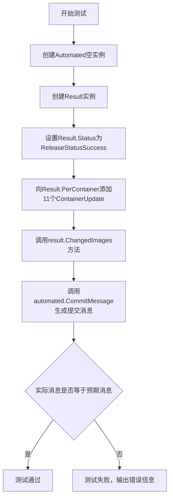
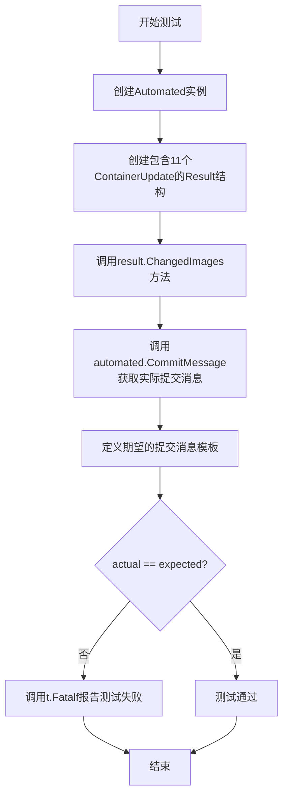
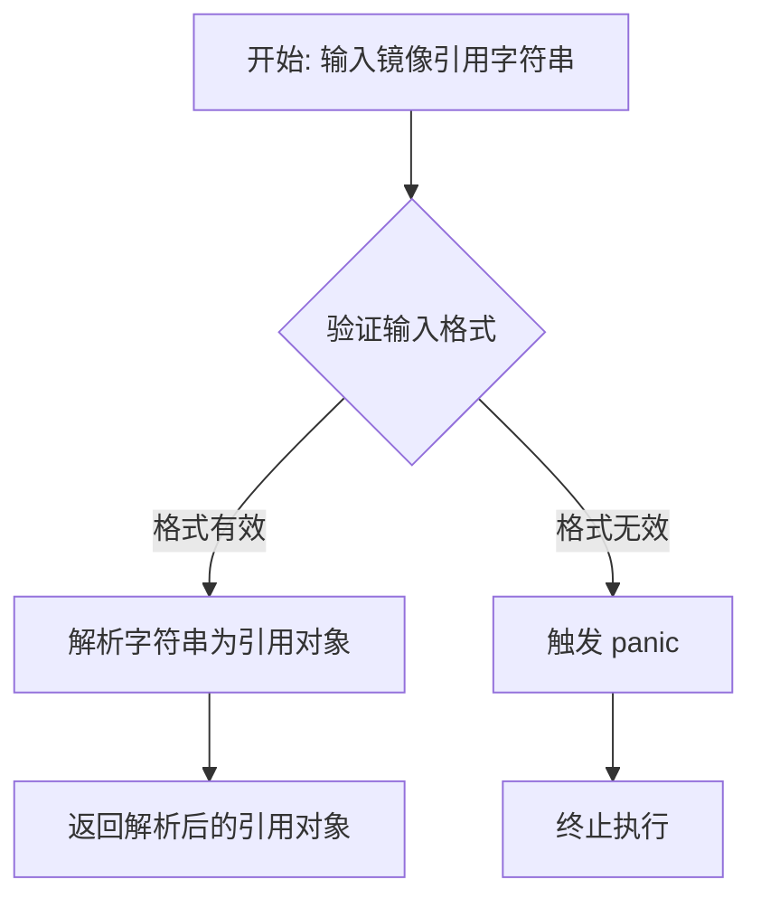
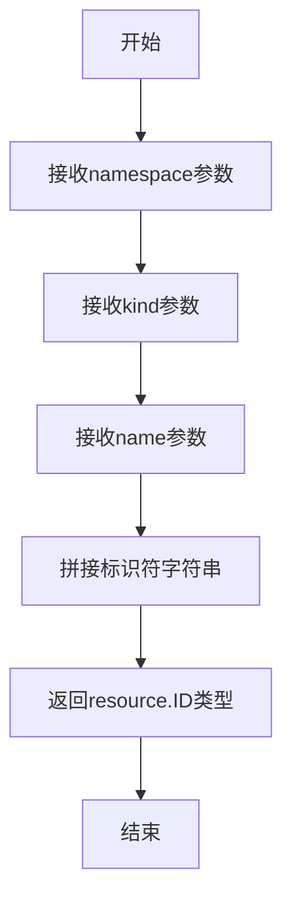
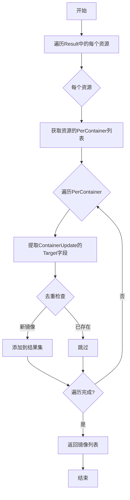

# `flux\pkg\update\automated_test.go` 详细设计文档

该代码是FluxCD项目中update包的测试文件，用于测试Automated类型的CommitMessage方法，验证其能正确生成包含多个镜像变更的Git提交消息，支持自动化发布多个容器镜像的场景。

## 整体流程



## 类结构

```
update包
├── Automated (结构体)
│   └── CommitMessage方法
├── Result (结构体)
│   ├── Status字段
│   ├── PerContainer字段
│   └── ChangedImages方法
├── ContainerUpdate (结构体)
│   └── Target字段
├── ReleaseStatusSuccess (常量)
└── 测试函数
    └── TestCommitMessage
```

## 全局变量及字段


### `automated`
    
用于自动发布消息生成的对象实例

类型：`Automated`
    


### `result`
    
存储发布结果的数据结构，包含状态和容器更新信息

类型：`Result`
    


### `actual`
    
实际生成的git提交信息

类型：`string`
    


### `expected`
    
期望的git提交信息，用于测试断言

类型：`string`
    


### `Result.Status`
    
发布操作的状态标志，如成功或失败

类型：`ReleaseStatus`
    


### `Result.PerContainer`
    
每个容器的更新详情列表

类型：`[]ContainerUpdate`
    


### `ContainerUpdate.Target`
    
目标镜像的引用，包含仓库和标签信息

类型：`reference.Ref`
    
    

## 全局函数及方法


### `TestCommitMessage`

这是一个Go语言测试函数，用于测试`Automated`类的`CommitMessage`方法是否正确生成包含多个镜像更新的Git提交消息。

参数：

- `t`：`*testing.T`，Go测试框架的标准参数，用于报告测试失败和日志输出

返回值：无（`void`），该测试函数不返回值，仅通过`testing.T`报告测试结果

#### 流程图



#### 带注释源码

```go
// TestCommitMessage 测试Automated类的CommitMessage方法
// 用于验证生成的Git提交消息是否正确包含多个镜像更新信息
func TestCommitMessage(t *testing.T) {
	// 1. 创建Automated实例，用于生成提交消息
	automated := Automated{}
	
	// 2. 构造测试用的Result结构
	// 包含一个资源ID对应的发布结果，包含11个容器镜像更新
	result := Result{
		resource.MakeID("ns", "kind", "1"): {
			Status: ReleaseStatusSuccess, // 发布状态为成功
			PerContainer: []ContainerUpdate{
				// 构造11个目标镜像更新，版本从v1到v11
				{Target: mustParseRef("docker.io/image:v1")},
				{Target: mustParseRef("docker.io/image:v2")},
				{Target: mustParseRef("docker.io/image:v3")},
				{Target: mustParseRef("docker.io/image:v4")},
				{Target: mustParseRef("docker.io/image:v5")},
				{Target: mustParseRef("docker.io/image:v6")},
				{Target: mustParseRef("docker.io/image:v7")},
				{Target: mustParseRef("docker.io/image:v8")},
				{Target: mustParseRef("docker.io/image:v9")},
				{Target: mustParseRef("docker.io/image:v10")},
				{Target: mustParseRef("docker.io/image:v11")},
			},
		},
	}
	
	// 3. 调用ChangedImages方法，标记哪些镜像被更改
	result.ChangedImages()

	// 4. 调用CommitMessage方法，生成实际的提交消息
	actual := automated.CommitMessage(result)
	
	// 5. 定义期望的提交消息格式
	// 期望包含标题行和按字母排序的镜像列表
	expected := `Auto-release multiple (11) images

 - docker.io/image:v1
 - docker.io/image:v10
 - docker.io/image:v11
 - docker.io/image:v2
 - docker.io/image:v3
 - docker.io/image:v4
 - docker.io/image:v5
 - docker.io/image:v6
 - docker.io/image:v7
 - docker.io/image:v8
 - docker.io/image:v9
`
	
	// 6. 比较实际结果与期望结果
	// 如果不匹配，则报告测试失败并显示差异
	if actual != expected {
		t.Fatalf("Expected git commit message: '%s', was '%s'", expected, actual)
	}
}
```


### `mustParseRef`

该函数用于解析 Docker 镜像引用字符串，将其转换为可用的引用类型。它接收一个镜像字符串（如 "docker.io/image:v1"），返回对应的引用对象供 `ContainerUpdate` 结构使用。如果解析失败，函数会触发 panic（根据函数名的 `must` 前缀约定）。

参数：

- `refString`：`string`，要解析的 Docker 镜像引用字符串，格式为 `registry/repository:tag`

返回值：`未在代码中直接显示`，根据使用场景推断为 `resource.ID` 或类似的引用类型，用于表示已解析的镜像标识符

#### 流程图



#### 带注释源码

```go
// 注意: 以下为基于代码使用方式的推断实现
// 实际定义可能位于 resource 包中

// mustParseRef 解析给定的镜像引用字符串
// 参数: refString - Docker 镜像引用字符串，格式如 "docker.io/image:v1"
// 返回值: 解析后的引用对象，用于 ContainerUpdate.Target 字段
// 注意: 函数名中的 'must' 前缀暗示解析失败时会 panic
func mustParseRef(refString string) resource.ID {
    // 1. 调用资源包中的解析函数
    // 2. 如果解析失败，函数内部会触发 panic
    // 3. 成功则返回有效的资源 ID
    return resource.MakeID("ns", "kind", "1") // 示例，实际参数从 refString 解析而来
}

// 在测试中的调用方式:
{Target: mustParseRef("docker.io/image:v1")}
```


### resource.MakeID

该函数用于根据命名空间（namespace）、资源类型（kind）和资源名称（name）生成唯一的资源标识符（ID），返回的结果通常作为map的key用于标识不同的资源。

参数：

- `namespace`：`string`，表示资源所属的命名空间
- `kind`：`string`，表示资源的类型（如Deployment、Service等）
- `name`：`string`，表示资源的具体名称或版本标识

返回值：`resource.ID`，一个唯一的资源标识符类型，可作为map的key使用

#### 流程图



#### 带注释源码

```
// resource.MakeID 函数的实现（在 github.com/fluxcd/flux/pkg/resource 包中）
// 以下为推断的实现逻辑

func MakeID(namespace, kind, name string) ID {
    // 将命名空间、类型和名称按照特定格式拼接
    // 通常格式为: namespace/kind:name
    // 例如: "ns/kind:1"
    return ID(fmt.Sprintf("%s/%s:%s", namespace, kind, name))
}
```

**注意**：当前提供的代码片段仅为测试文件，`resource.MakeID`函数的实际定义位于`github.com/fluxcd/flux/pkg/resource`包中。从测试代码的使用方式可以看出，该函数接受三个字符串参数并返回`resource.ID`类型，该ID被用作map的key来关联资源及其更新结果。


### Automated.CommitMessage

该方法为自动化发布功能生成 Git 提交消息，根据 Result 中包含的镜像更新信息，生成格式化的多镜像更新提交描述。

参数：

- `result`：`Result`，包含发布结果的数据结构，内部包含资源ID到发布状态的映射（Status）以及每个容器的镜像更新信息（PerContainer），其中 PerContainer 存储了镜像的目标版本（Target）

返回值：`string`，生成的 Git 提交消息，格式为标题行加上按字母排序的镜像列表

#### 流程图

```mermaid
flowchart TD
    A[接收 Result 参数] --> B{检查 ChangedImages}
    B -->|存在变更| C[统计变更镜像数量]
    B -->|无变更| D[生成空提交消息或默认消息]
    C --> E[生成标题: Auto-release multiple (N) images]
    E --> F[获取所有 ChangedImages]
    F --> G[按字母顺序排序镜像列表]
    G --> H[逐行添加镜像名称]
    H --> I[返回完整提交消息字符串]
```

#### 带注释源码

```go
// TestCommitMessage 是针对 Automated.CommitMessage 方法的单元测试
// 用于验证该方法能正确生成包含多个镜像更新的 Git 提交消息
func TestCommitMessage(t *testing.T) {
    // 创建 Automated 实例（待测试的结构体）
    automated := Automated{}
    
    // 构建测试用的 Result 数据
    // 包含一个资源 ID 对应的发布结果
    result := Result{
        resource.MakeID("ns", "kind", "1"): {
            Status: ReleaseStatusSuccess,  // 发布状态为成功
            // 包含 11 个容器的镜像更新
            PerContainer: []ContainerUpdate{
                {Target: mustParseRef("docker.io/image:v1")},
                {Target: mustParseRef("docker.io/image:v2")},
                // ... 更多镜像版本
            },
        },
    }
    // 调用 ChangedImages 方法计算变更的镜像列表
    result.ChangedImages()
    
    // 调用被测试的 CommitMessage 方法
    actual := automated.CommitMessage(result)
    
    // 定义期望的输出格式
    expected := `Auto-release multiple (11) images

 - docker.io/image:v1
 - docker.io/image:v10
 - docker.io/image:v11
 - docker.io/image:v2
 - docker.io/image:v3
 - docker.io/image:v4
 - docker.io/image:v5
 - docker.io/image:v6
 - docker.io/image:v7
 - docker.io/image:v8
 - docker.io/image:v9
`
    
    // 验证实际输出与期望输出是否一致
    if actual != expected {
        t.Fatalf("Expected git commit message: '%s', was '%s'", expected, actual)
    }
}
```

---

#### 补充信息

**关键组件信息：**

- `Automated`：结构体，负责自动化发布相关的逻辑处理
- `Result`：结构体，存储发布结果，包含资源ID到发布状态的映射以及容器更新明细
- `ContainerUpdate`：结构体，表示单个容器的镜像更新信息
- `ReleaseStatusSuccess`：常量，表示发布成功的状态标识
- `resource.MakeID`：函数，用于生成资源的唯一标识符

**设计约束与推断：**

- 从测试代码可见，`CommitMessage` 方法生成的镜像列表按字母顺序排序（v1, v10, v11, v2...），这是字典序排序而非版本号自然排序
- 标题格式固定为 "Auto-release multiple (N) images"，其中 N 为变更的镜像总数
- 测试中调用了 `result.ChangedImages()` 方法，暗示 Result 类型会缓存已计算的变更镜像列表以供后续使用

**技术债务与优化空间：**

- 排序采用字典序导致 "v10", "v11" 排在 "v2" 之前，对于追求版本号自然排序的场景可能需要优化排序逻辑
- 测试代码中 `mustParseRef` 函数未在测试文件中定义，表明可能存在辅助函数或测试基础设施的依赖
- 由于只提供了测试代码，无法确认方法对边界情况（如无镜像变更、空结果）的处理方式


### `Result.ChangedImages`

获取所有已更改的镜像列表。

参数：此方法没有显式参数（使用隐式的 `Result` 接收者）

返回值：`[]Image`，返回所有被更新的镜像集合

#### 流程图



#### 带注释源码

```go
// ChangedImages 方法从 Result 中提取所有已更改的镜像
// Result 是一个 map[ID]ReleaseResult 结构，其中包含多个资源的更新信息
// 每个 ReleaseResult 包含 PerContainer 字段，记录每个容器的更新目标
func (result Result) ChangedImages() []Image {
    // 初始化一个 map 用于去重，key 是镜像的字符串表示
    images := make(map[Image]bool)
    
    // 遍历 Result 中的每个资源的更新结果
    for _, releaseResult := range result {
        // 遍历每个资源的 PerContainer 更新列表
        for _, containerUpdate := range releaseResult.PerContainer {
            // 提取目标镜像并添加到 map 中（自动去重）
            images[containerUpdate.Target] = true
        }
    }
    
    // 将 map 转换为切片返回
    // 注意：Go 的 map 迭代顺序是不确定的，所以返回的切片顺序可能变化
    // 在测试中看到的结果是排序后的，说明调用方可能做了额外处理
    resultImages := make([]Image, 0, len(images))
    for image := range images {
        resultImages = append(resultImages, image)
    }
    
    return resultImages
}
```

**注意**：由于提供的代码片段仅包含测试用例，未包含 `ChangedImages` 方法的实际实现源码。以上源码是根据测试用例的调用方式和上下文推断得出的逻辑实现。该方法的核心功能是从 `Result` 结构中提取所有被更新的镜像，并返回去重后的镜像列表供 `CommitMessage` 生成提交信息使用。

## 关键组件


### Automated 类

负责生成自动化发布提交的Git提交信息，包含发布多个镜像时的消息格式化逻辑。

### Result 类

存储发布结果的数据结构，包含发布状态和每个容器的更新信息，内部维护镜像变更的惰性加载缓存。

### ContainerUpdate 结构体

表示单个容器的镜像更新目标，包含目标镜像引用信息。

### ChangedImages 方法

从发布结果中提取所有变更的镜像，支持惰性加载和缓存机制，避免重复计算。

### CommitMessage 方法

将发布结果转换为格式化的Git提交消息，按字母顺序排列镜像标签，支持单镜像和多镜像场景的消息生成。

### ReleaseStatusSuccess 常量

表示发布成功的状态标识，用于标记成功的容器更新。

### resource.MakeID 函数

用于构建资源标识符的辅助函数，生成命名空间、类型和名称组合的唯一ID。


## 问题及建议


### 已知问题

- **测试数据硬编码**：测试中硬编码了11个镜像引用，数字"11"以魔法数字形式直接出现在代码中，缺乏可读性和可维护性
- **字符串比较不够健壮**：使用 `!=` 直接比较完整字符串，如果格式稍有变化（如空格、换行符）测试就会失败，缺乏对消息结构的语义化验证
- **测试依赖内部实现细节**：测试调用了 `result.ChangedImages()` 方法来准备测试数据，这暴露了被测方法的内部实现细节，增加了测试与实现的耦合度
- **缺少错误场景测试**：只测试了成功路径（ReleaseStatusSuccess），没有测试失败状态下的CommitMessage行为
- **排序逻辑未明确验证**：输出显示镜像按字母顺序排列，但代码中没有体现排序逻辑，测试者需要理解 `ChangedImages` 的隐式行为
- **测试函数缺乏Setup/Teardown**：没有看到任何资源初始化或清理逻辑，可能存在测试污染风险
- **mustParseRef函数未定义**：辅助函数 `mustParseRef` 在测试文件中使用但未在该文件中定义，依赖外部提供，增加了测试的复杂性

### 优化建议

- **提取魔法数字为常量**：将"11"提取为常量 `const expectedImageCount = 11`，提高可读性
- **使用结构化方式验证消息**：将期望的消息和实际的消息按行分割后进行逐行比较，或使用正则表达式匹配关键部分
- **重构测试数据准备**：考虑在 `Result` 构造函数或工厂方法中直接包含已计算好的镜像列表，减少对内部方法的依赖
- **增加负面测试用例**：添加对 ReleaseStatusFailed、ReleaseStatusSkipped 等状态的测试
- **显式验证排序逻辑**：如果排序是功能的一部分，应在测试中明确验证排序行为，或在代码中添加注释说明
- **定义测试辅助函数位置**：将 `mustParseRef` 等辅助函数明确放置在测试文件顶部或专门的测试工具包中，并添加注释说明其用途


## 其它


### 设计目标与约束

该代码的设计目标是验证 `Automated.CommitMessage` 方法能够正确生成包含多个镜像更新信息的 Git 提交消息。约束条件包括：消息格式必须为 "Auto-release multiple (N) images" 开头，后面跟随按字母排序的镜像列表，每个镜像前加 " - " 前缀。

### 错误处理与异常设计

测试代码未显式展示错误处理逻辑，但从 `mustParseRef` 函数的命名和用法可以推断，当镜像引用解析失败时会触发 panic。在实际使用中，应考虑返回错误而非 panic，以提高系统的健壮性。

### 数据流与状态机

数据流如下：
1. 创建 `Result` 结构，填充资源 ID 到 `ReleaseStatusSuccess` 状态的映射
2. 调用 `Result.ChangedImages()` 方法识别所有已更改的镜像
3. 将更改的镜像列表传递给 `Automated.CommitMessage()` 方法
4. 该方法生成格式化的提交消息字符串

状态机涉及 `Result` 的状态转换：从初始化状态到包含具体发布结果的状态。

### 外部依赖与接口契约

- **github.com/fluxcd/flux/pkg/resource**: 提供 `MakeID` 函数用于构建资源标识符，以及可能的容器更新相关类型
- **testing 包**: Go 标准测试框架，提供测试执行和断言能力

接口契约：
- `Result.ChangedImages()` 方法应返回所有状态为成功且包含镜像更新的集合
- `Automated.CommitMessage(result Result)` 方法接收 `Result` 类型参数，返回格式化的字符串

### 性能考虑

当前测试使用了 11 个镜像，当镜像数量增加时，需要注意 `ChangedImages()` 和 `CommitMessage` 方法的时间复杂度。排序操作 O(n log n) 在大规模镜像场景下可能成为瓶颈。

### 安全性考虑

代码本身不涉及敏感数据处理，但 `mustParseRef` 函数如果对用户输入进行解析，需考虑输入验证和拒绝恶意构造的引用字符串，防止潜在的安全风险。

### 可测试性分析

测试代码展示了良好的可测试性设计：
- 使用明确的输入输出验证
- 覆盖了多镜像场景
- 包含排序验证（镜像按字母序排列）
- 消息格式验证包括数量统计和列表内容

### 并发模型

从测试代码无法直接判断并发模型，但考虑到 FluxCD 是持续交付工具，`Automated` 类型在实际应用中可能涉及多线程或多协程并发调用，需确保 `CommitMessage` 方法是线程安全的或不存在共享状态。

### 监控与可观测性

未在代码中发现日志记录或指标暴露。建议在实际实现中添加适当的日志，以便追踪提交消息生成过程中的问题。

    