# `flux\pkg\update\filter.go` 详细设计文档

该文件定义了一组过滤器（Filter）类型，用于在 Flux CD 持续交付工具中根据不同的策略（如特定镜像、排除/包含资源、锁定状态、忽略策略）来决定工作负载（Workload）是否需要更新以及更新结果。

## 整体流程

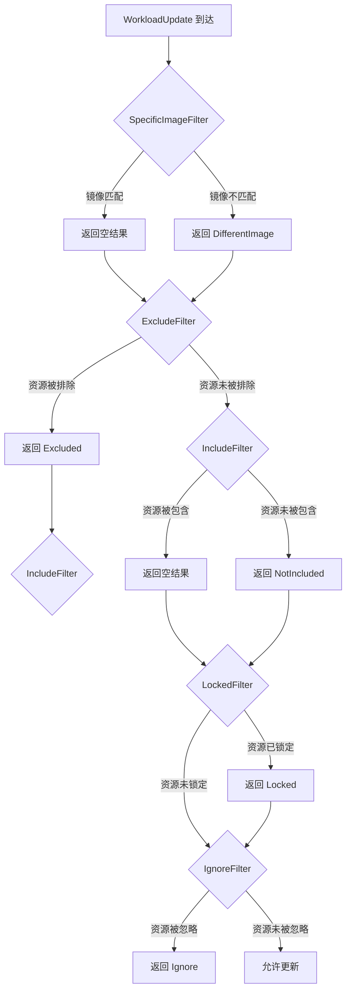

## 类结构

```
update (包)
├── SpecificImageFilter (结构体)
├── ExcludeFilter (结构体)
├── IncludeFilter (结构体)
├── LockedFilter (结构体)
└── IgnoreFilter (结构体)
```

## 全局变量及字段


### `SpecificImageFilter.Img`
    
指定要过滤的镜像引用，用于与工作负载容器镜像进行匹配

类型：`image.Ref`
    


### `ExcludeFilter.IDs`
    
要排除的资源ID列表，用于过滤掉指定资源的更新

类型：`[]resource.ID`
    


### `IncludeFilter.IDs`
    
要包含的资源ID列表，用于仅允许指定资源的更新

类型：`[]resource.ID`
    
    

## 全局函数及方法


### `SpecificImageFilter.Filter`

该方法用于过滤特定的镜像更新，检查工作负载更新中是否包含指定的镜像。如果工作负载中没有容器，则返回忽略状态；如果容器中的镜像与指定镜像匹配，则返回成功结果；否则返回忽略状态并标记为不同的镜像。

参数：

- `u`：`WorkloadUpdate`，要过滤的工作负载更新对象，包含工作负载和容器信息

返回值：`WorkloadResult`，过滤结果，包含状态和错误信息

#### 流程图

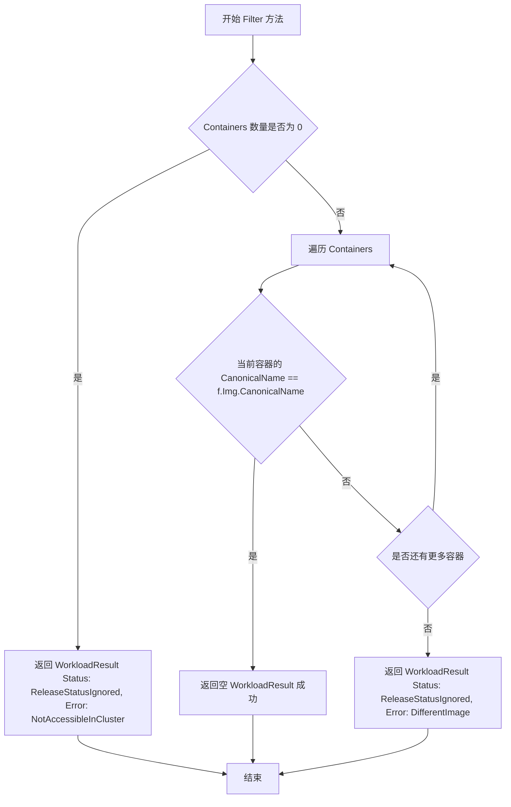

#### 带注释源码

```go
// Filter 检查工作负载更新中是否包含特定的镜像
// 参数 u: WorkloadUpdate 类型，包含工作负载及其容器信息
// 返回值: WorkloadResult 类型，表示过滤后的结果
func (f *SpecificImageFilter) Filter(u WorkloadUpdate) WorkloadResult {
    // 如果没有容器，则无法检查镜像，返回忽略状态
    // 这是因为没有容器意味着没有镜像可供比较
    if len(u.Workload.Containers.Containers) == 0 {
        return WorkloadResult{
            Status: ReleaseStatusIgnored,
            Error:  NotAccessibleInCluster,
        }
    }
    // 遍历更新中的每个容器
    for _, c := range u.Workload.Containers.Containers {
        // 检查容器镜像的规范名称是否与过滤器的镜像匹配
        // 如果匹配，说明我们想要更新此镜像
        if c.Image.CanonicalName() == f.Img.CanonicalName() {
            // 找到匹配的镜像，返回空的 WorkloadResult 表示成功
            return WorkloadResult{}
        }
    }
    // 遍历完所有容器后未找到匹配镜像
    // 返回忽略状态，错误信息表示这是不同的镜像
    return WorkloadResult{
        Status: ReleaseStatusIgnored,
        Error:  DifferentImage,
    }
}
```


### `ExcludeFilter.Filter`

该方法实现了过滤器的排除逻辑，用于检查要更新的工作负载资源是否在排除列表中，如果在排除列表中则返回忽略状态，否则放行该更新。

参数：

- `u`：`WorkloadUpdate`，包含工作负载更新信息，包含需要检查的资源ID（`ResourceID`）等字段

返回值：`WorkloadResult`，返回过滤后的结果，若资源在排除列表中则返回带有 `ReleaseStatusIgnored` 状态和 `Excluded` 错误的 `WorkloadResult`，否则返回空的 `WorkloadResult` 表示允许通过

#### 流程图

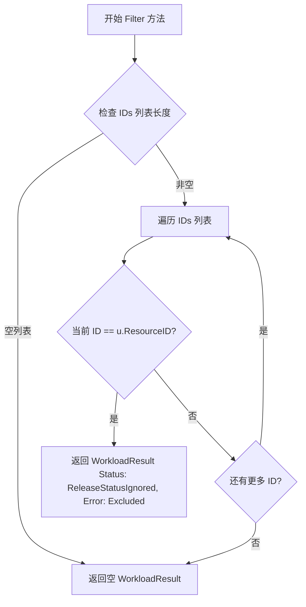

#### 带注释源码

```go
// ExcludeFilter 用于排除特定资源ID的过滤器
type ExcludeFilter struct {
    IDs []resource.ID // 需要排除的资源ID列表
}

// Filter 检查工作负载更新是否在排除列表中
// 参数 u: WorkloadUpdate 类型，包含工作负载的更新信息
// 返回值: WorkloadResult 类型，表示过滤结果
func (f *ExcludeFilter) Filter(u WorkloadUpdate) WorkloadResult {
    // 遍历排除列表中的每一个资源ID
    for _, id := range f.IDs {
        // 检查当前资源ID是否与要更新的资源ID匹配
        if u.ResourceID == id {
            // 如果在排除列表中，返回忽略状态的WorkloadResult
            // Status 为 ReleaseStatusIgnored 表示该更新被忽略
            // Error 为 Excluded 表示原因是资源被排除
            return WorkloadResult{
                Status: ReleaseStatusIgnored,
                Error:  Excluded,
            }
        }
    }
    // 如果遍历完整个列表都没有匹配，说明资源不在排除列表中
    // 返回空的 WorkloadResult，表示该更新可以通过过滤
    return WorkloadResult{}
}
```


### `IncludeFilter.Filter`

该方法用于过滤工作负载更新事件，只有当工作负载的资源ID匹配 IncludeFilter 中预先配置的 IDs 列表时，才允许通过过滤；否则返回忽略状态。

参数：

- `u`：`WorkloadUpdate`，表示需要过滤的工作负载更新对象，包含资源ID等更新信息

返回值：`WorkloadResult`，返回过滤后的结果，若资源ID匹配则返回空的 WorkloadResult（表示通过），若不匹配则返回包含 ReleaseStatusIgnored 状态和 NotIncluded 错误信息的 WorkloadResult

#### 流程图

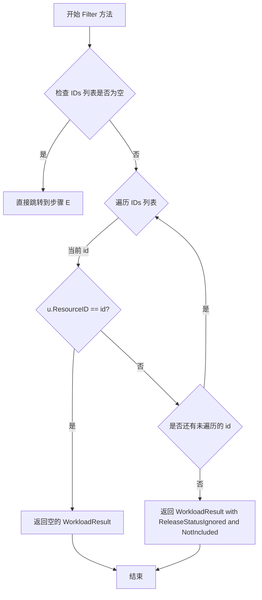

#### 带注释源码

```go
// IncludeFilter 结构体定义了一个包含资源ID列表的过滤器
type IncludeFilter struct {
	IDs []resource.ID // 需要包含的资源ID列表
}

// Filter 方法执行过滤逻辑，判断工作负载更新是否应该被包含
// 参数 u: WorkloadUpdate 类型，表示待过滤的工作负载更新对象
// 返回值: WorkloadResult 类型，表示过滤后的结果
func (f *IncludeFilter) Filter(u WorkloadUpdate) WorkloadResult {
	// 遍历 IncludeFilter 中预定义的 IDs 列表
	for _, id := range f.IDs {
		// 检查当前遍历的 ID 是否与工作负载更新的 ResourceID 匹配
		if u.ResourceID == id {
			// 如果匹配，返回空的 WorkloadResult，表示该更新通过过滤
			// 空结果通常表示成功且不需要特殊处理
			return WorkloadResult{}
		}
	}
	// 遍历完所有 IDs 仍未匹配，说明该资源不在包含列表中
	// 返回带有忽略状态的 WorkloadResult，Error 信息为 "not included"
	return WorkloadResult{
		Status: ReleaseStatusIgnored, // 设置状态为忽略
		Error:  NotIncluded,           // 设置错误信息为未包含
	}
}
```


### `LockedFilter.Filter`

该方法用于检查工作负载是否被锁定。如果工作负载具有"locked"策略标记，则返回跳过状态和锁定错误；否则返回空的WorkloadResult，表示该工作负载可以继续进行更新处理。

参数：

- `u`：`WorkloadUpdate`，包含工作负载更新信息，其中包含Resource字段用于检查策略

返回值：`WorkloadResult`，返回工作负载的过滤结果。如果工作负载被锁定，则Status为ReleaseStatusSkipped且Error为"locked"；否则返回空的WorkloadResult表示未被过滤。

#### 流程图

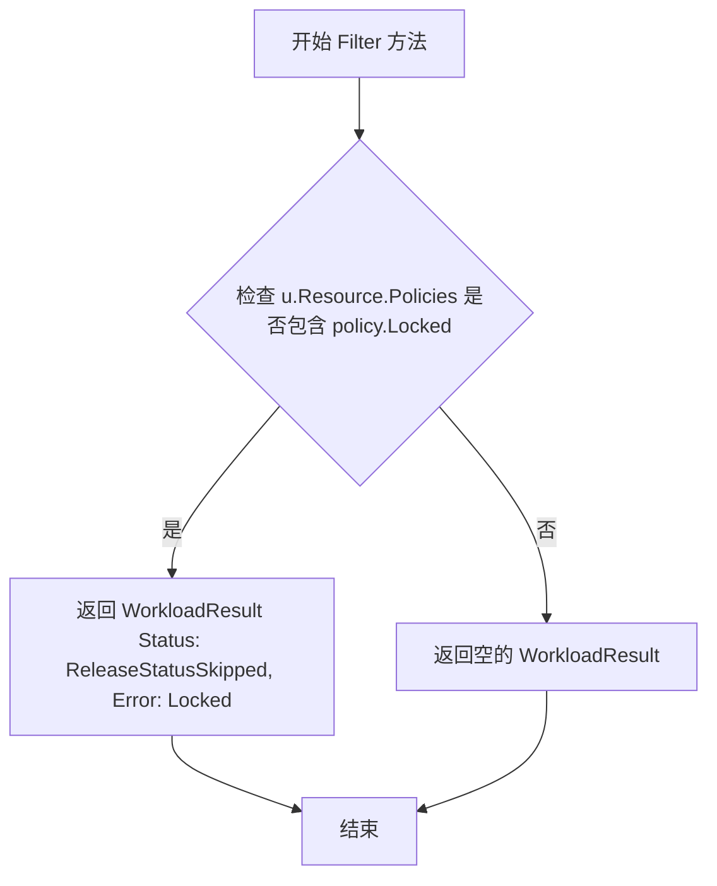

#### 带注释源码

```go
// LockedFilter 结构体用于过滤被锁定的资源
type LockedFilter struct {
}

// Filter 方法检查工作负载是否被锁定
// 参数 u: WorkloadUpdate 类型，包含工作负载更新信息
// 返回值: WorkloadResult 类型，包含过滤结果
func (f *LockedFilter) Filter(u WorkloadUpdate) WorkloadResult {
	// 检查工作负载的策略中是否包含 Locked 策略
	if u.Resource.Policies().Has(policy.Locked) {
		// 如果工作负载被锁定，返回跳过状态和锁定错误信息
		return WorkloadResult{
			Status: ReleaseStatusSkipped,
			Error:  Locked,
		}
	}
	// 如果工作负载未被锁定，返回空的WorkloadResult，表示可以继续处理
	return WorkloadResult{}
}
```


### `IgnoreFilter.Filter`

检查工作负载更新是否包含忽略策略。如果工作负载设置了忽略策略，则返回跳过状态和忽略错误；否则返回空的通过结果，允许工作负载进行更新。

参数：

- `u`：`WorkloadUpdate`，待过滤的工作负载更新对象，包含工作负载及其容器信息

返回值：`WorkloadResult`，过滤结果，包含状态和错误信息。如果工作负载被忽略，状态为 `ReleaseStatusSkipped` 且错误信息为 "ignore"；否则返回空结果表示允许更新。

#### 流程图

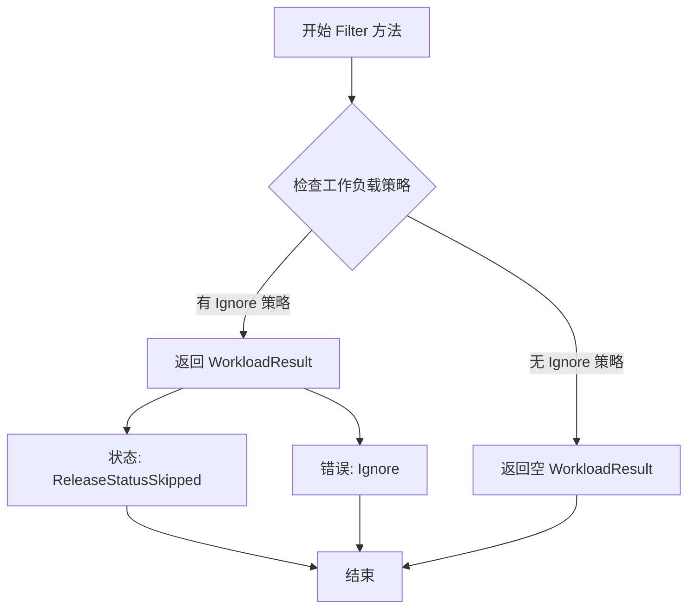

#### 带注释源码

```go
// IgnoreFilter 是一个用于过滤工作负载更新的过滤器
// 当工作负载设置了忽略策略时，将跳过该更新
type IgnoreFilter struct {
}

// Filter 检查给定的工作负载更新是否应该被忽略
// 参数 u WorkloadUpdate: 包含工作负载及其策略信息
// 返回值 WorkloadResult: 过滤结果，包含状态和错误信息
func (f *IgnoreFilter) Filter(u WorkloadUpdate) WorkloadResult {
    // 检查工作负载是否设置了忽略策略
    if u.Workload.Policies.Has(policy.Ignore) {
        // 如果设置了忽略策略，返回跳过状态和忽略错误
        return WorkloadResult{
            Status: ReleaseStatusSkipped,
            Error:  Ignore,
        }
    }
    // 未设置忽略策略，返回空结果表示允许更新
    return WorkloadResult{}
}
```

## 关键组件


### 核心功能概述

该代码模块实现了一套灵活的镜像更新过滤机制，通过五个独立的过滤器（SpecificImageFilter、ExcludeFilter、IncludeFilter、LockedFilter、IgnoreFilter）根据镜像、资源ID、策略标签等条件决定是否对工作负载进行更新，支持细粒度的发布控制。

### 文件运行流程

该模块作为Flux CD更新策略的执行层，运行流程如下：首先，系统创建各类Filter实例并组成过滤链；当收到WorkloadUpdate请求时，依次调用各Filter的Filter方法进行判断；若工作负载符合过滤条件则返回空的WorkloadResult（表示放行），否则返回带有特定Status和Error信息的WorkloadResult阻止更新。

### 类详细信息

#### 常量定义

| 名称 | 类型 | 描述 |
|------|------|------|
| Locked | string | 表示资源已被锁定不允许更新 |
| Ignore | string | 表示资源被标记为忽略 |
| NotIncluded | string | 表示资源不在包含列表中 |
| Excluded | string | 表示资源被排除在更新外 |
| DifferentImage | string | 表示镜像不匹配 |
| NotAccessibleInCluster | string | 表示集群中不可访问 |
| NotInRepo | string | 表示不在仓库中 |
| ImageNotFound | string | 表示镜像未找到 |
| ImageUpToDate | string | 表示镜像已是最新 |
| DoesNotUseImage | string | 表示不使用指定镜像 |
| ContainerNotFound | string | 表示容器未找到 |
| ContainerTagMismatch | string | 表示容器标签不匹配 |

#### SpecificImageFilter 结构体

| 字段名 | 类型 | 描述 |
|--------|------|------|
| Img | image.Ref | 要匹配的目标镜像引用 |

##### Filter方法

- **名称**: Filter
- **参数**: u WorkloadUpdate - 包含工作负载和更新信息
- **参数类型**: WorkloadUpdate
- **参数描述**: 待过滤的工作负载更新对象
- **返回值类型**: WorkloadResult
- **返回值描述**: 若容器镜像匹配返回空结果，否则返回忽略状态和错误信息
- **流程图**: 
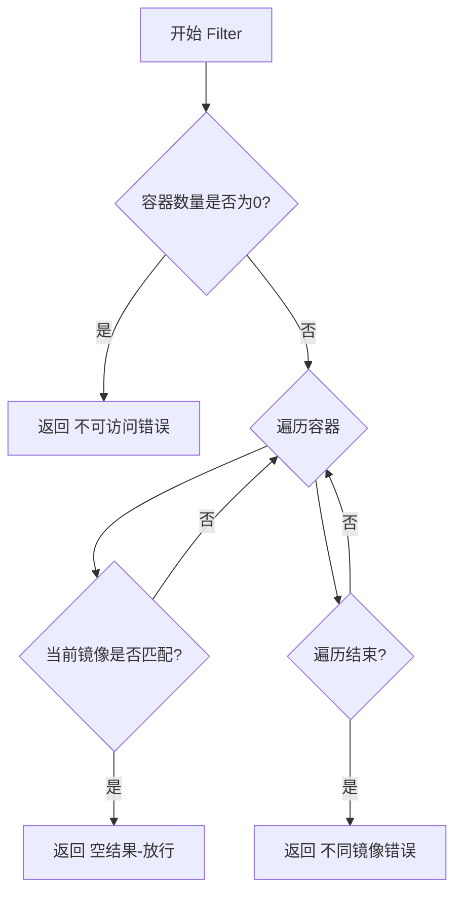
- **源码**:
```go
func (f *SpecificImageFilter) Filter(u WorkloadUpdate) WorkloadResult {
    // If there are no containers, then we can't check the image.
    if len(u.Workload.Containers.Containers) == 0 {
        return WorkloadResult{
            Status: ReleaseStatusIgnored,
            Error:  NotAccessibleInCluster,
        }
    }
    // For each container in update
    for _, c := range u.Workload.Containers.Containers {
        if c.Image.CanonicalName() == f.Img.CanonicalName() {
            // We want to update this
            return WorkloadResult{}
        }
    }
    return WorkloadResult{
        Status: ReleaseStatusIgnored,
        Error:  DifferentImage,
    }
}
```

#### ExcludeFilter 结构体

| 字段名 | 类型 | 描述 |
|--------|------|------|
| IDs | []resource.ID | 要排除的资源ID列表 |

##### Filter方法

- **名称**: Filter
- **参数**: u WorkloadUpdate - 包含工作负载和更新信息
- **参数类型**: WorkloadUpdate
- **参数描述**: 待过滤的工作负载更新对象
- **返回值类型**: WorkloadResult
- **返回值描述**: 若资源ID在排除列表中返回忽略状态，否则返回空结果
- **流程图**:
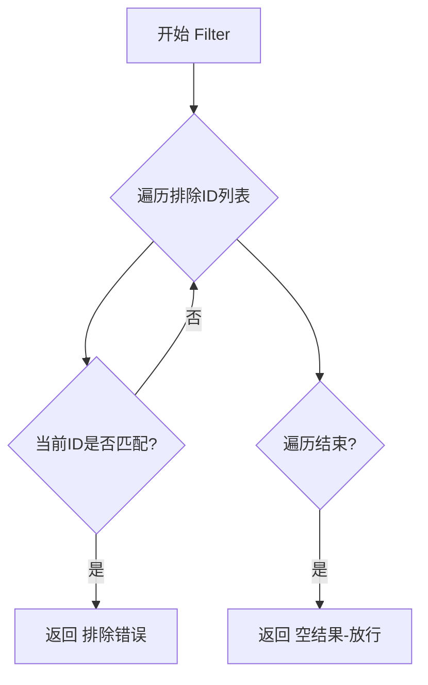
- **源码**:
```go
func (f *ExcludeFilter) Filter(u WorkloadUpdate) WorkloadResult {
    for _, id := range f.IDs {
        if u.ResourceID == id {
            return WorkloadResult{
                Status: ReleaseStatusIgnored,
                Error:  Excluded,
            }
        }
    }
    return WorkloadResult{}
}
```

#### IncludeFilter 结构体

| 字段名 | 类型 | 描述 |
|--------|------|------|
| IDs | []resource.ID | 要包含的资源ID列表 |

##### Filter方法

- **名称**: Filter
- **参数**: u WorkloadUpdate - 包含工作负载和更新信息
- **参数类型**: WorkloadUpdate
- **参数描述**: 待过滤的工作负载更新对象
- **返回值类型**: WorkloadResult
- **返回值描述**: 若资源ID在包含列表中返回空结果，否则返回忽略状态
- **流程图**:
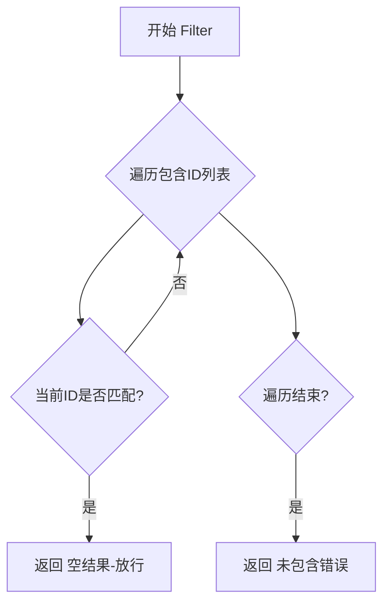
- **源码**:
```go
func (f *IncludeFilter) Filter(u WorkloadUpdate) WorkloadResult {
    for _, id := range f.IDs {
        if u.ResourceID == id {
            return WorkloadResult{}
        }
    }
    return WorkloadResult{
        Status: ReleaseStatusIgnored,
        Error:  NotIncluded,
    }
}
```

#### LockedFilter 结构体

| 字段名 | 类型 | 描述 |
|--------|------|------|
| (无字段) | - | 通过策略标签判断 |

##### Filter方法

- **名称**: Filter
- **参数**: u WorkloadUpdate - 包含工作负载和更新信息
- **参数类型**: WorkloadUpdate
- **参数描述**: 待过滤的工作负载更新对象
- **返回值类型**: WorkloadResult
- **返回值描述**: 若资源包含Locked策略返回跳过状态，否则返回空结果
- **流程图**:
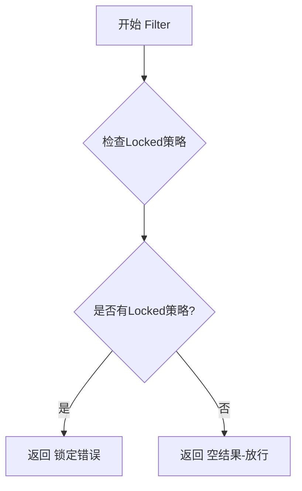
- **源码**:
```go
func (f *LockedFilter) Filter(u WorkloadUpdate) WorkloadResult {
    if u.Resource.Policies().Has(policy.Locked) {
        return WorkloadResult{
            Status: ReleaseStatusSkipped,
            Error:  Locked,
        }
    }
    return WorkloadResult{}
}
```

#### IgnoreFilter 结构体

| 字段名 | 类型 | 描述 |
|--------|------|------|
| (无字段) | - | 通过策略标签判断 |

##### Filter方法

- **名称**: Filter
- **参数**: u WorkloadUpdate - 包含工作负载和更新信息
- **参数类型**: WorkloadUpdate
- **参数描述**: 待过滤的工作负载更新对象
- **返回值类型**: WorkloadResult
- **返回值描述**: 若工作负载包含Ignore策略返回跳过状态，否则返回空结果
- **流程图**:
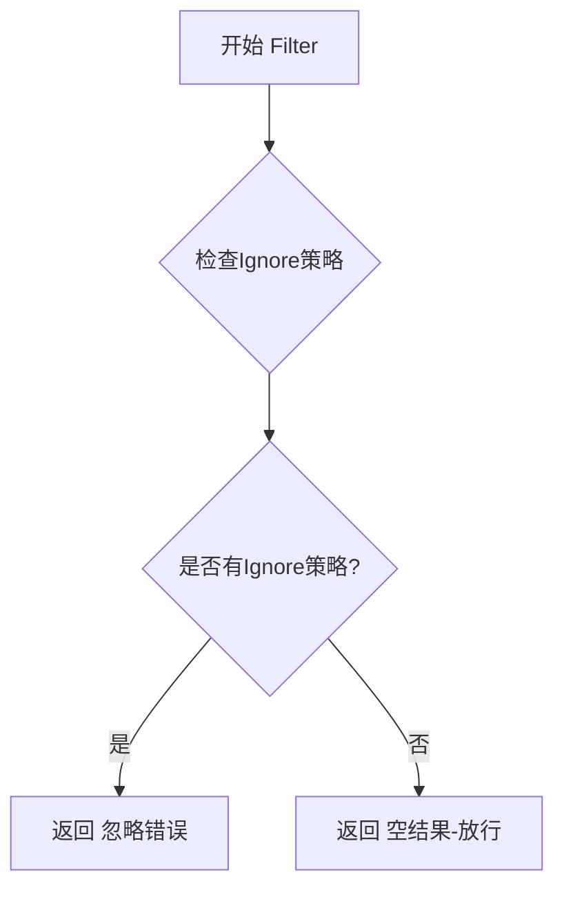
- **源码**:
```go
func (f *IgnoreFilter) Filter(u WorkloadUpdate) WorkloadResult {
    if u.Workload.Policies.Has(policy.Ignore) {
        return WorkloadResult{
            Status: ReleaseStatusSkipped,
            Error:  Ignore,
        }
    }
    return WorkloadResult{}
}
```

### 关键组件信息

#### 工作负载过滤器接口（隐式）

通过方法签名隐式定义，所有过滤器实现Filter(u WorkloadUpdate) WorkloadResult方法，支持责任链模式

#### 镜像过滤组件

SpecificImageFilter实现基于容器镜像名称的精确匹配，支持CanonicalName规范化比较

#### 策略标签过滤组件

LockedFilter和IgnoreFilter实现基于Flux策略标签的过滤，支持Kubernetes风格的政策执行

#### 资源ID过滤组件

IncludeFilter和ExcludeFilter实现基于资源标识符的包含/排除逻辑

### 潜在技术债务与优化空间

1. **空结构体浪费**: LockedFilter和IgnoreFilter为空结构体，可考虑使用sync.Pool或单例模式优化内存
2. **线性查找效率**: IncludeFilter和ExcludeFilter使用线性遍历，在ID列表较大时可考虑使用map替代
3. **镜像匹配粒度**: SpecificImageFilter仅比较CanonicalName，未考虑标签和版本的精确匹配
4. **错误处理单一**: 所有过滤器直接返回预定义错误，缺乏详细的调试信息
5. **接口抽象缺失**: 未定义明确的Filter接口，依赖隐式约定降低了代码可维护性

### 其它项目

#### 设计目标与约束

- 目标：提供细粒度的镜像更新控制能力
- 约束：过滤器需返回标准化的WorkloadResult对象
- 设计原则：单一职责，每个过滤器只处理一种过滤逻辑

#### 错误处理与异常设计

- 使用预定义常量作为错误消息，保证错误信息一致性
- 通过Status字段区分可恢复错误(ReleaseStatusIgnored)和需跳过错误(ReleaseStatusSkipped)
- 空WorkloadResult表示放行，这是一种隐式的成功状态

#### 数据流与状态机

- 输入：WorkloadUpdate对象（包含Workload、Resource、ResourceID等）
- 处理：依次通过各Filter进行条件判断
- 输出：WorkloadResult（包含Status和Error字段）
- 状态转换：Normal → Ignored/Skipped 或 Normal → Normal(放行)

#### 外部依赖与接口契约

- 依赖image包提供镜像引用比较
- 依赖policy包提供策略标签检查
- 依赖resource包提供资源ID类型
- 依赖WorkloadUpdate和WorkloadResult类型（未在此文件中定义）


## 问题及建议


### 已知问题

- 代码中存在重复的过滤逻辑：`ExcludeFilter` 和 `IncludeFilter` 的 `Filter` 方法结构几乎相同，仅返回错误不同，导致维护成本高。
- `LockedFilter` 和 `IgnoreFilter` 结构体定义为空，但方法实现类似，可考虑合并或抽象。
- `SpecificImageFilter` 的 `Filter` 方法在匹配镜像时返回空的 `WorkloadResult`，未明确设置成功状态，可能导致调用方处理不一致。
- 错误处理不够具体：`LockedFilter` 和 `IgnoreFilter` 返回 `ReleaseStatusSkipped`，而其他过滤器返回 `ReleaseStatusIgnored`，状态语义不清晰。
- 字段访问路径冗余：如 `u.Workload.Containers.Containers`，可能暴露内部数据结构设计不合理。
- 缺少对 `SpecificImageFilter` 中镜像比较的详细错误处理，例如当镜像格式无效时。
- 常量定义在包级别，但未进行分组或文档化，可读性一般。

### 优化建议

- 重构 `ExcludeFilter` 和 `IncludeFilter`，提取公共逻辑到辅助函数或接口中，减少代码重复。
- 将 `LockedFilter` 和 `IgnoreFilter` 合并为一个通用的策略过滤器，接受策略类型参数。
- 明确 `WorkloadResult` 的状态设置，确保所有过滤方法返回一致的状态语义。
- 简化字段访问，考虑在 `WorkloadUpdate` 中提供便捷方法，如 `Containers()` 直接返回容器列表。
- 增加镜像验证逻辑，在 `SpecificImageFilter` 中处理无效镜像的情况。
- 对常量进行分组注释，提高可读性和可维护性。
- 添加单元测试，覆盖所有过滤器的边界情况。


## 其它


### 设计目标与约束

本代码模块的主要设计目标是实现灵活的工作负载（Workload）更新过滤机制，支持多种过滤策略以控制哪些工作负载需要被更新。设计约束包括：1）所有过滤器必须实现统一的Filter接口；2）过滤逻辑必须是纯函数式的，无副作用；3）过滤结果通过WorkloadResult结构返回，包含状态和错误信息；4）支持链式组合多个过滤器以实现复杂的过滤规则。

### 错误处理与异常设计

代码中的错误处理采用枚举常量方式定义错误类型，主要通过返回WorkloadResult中的Error字段来传递错误信息。定义的错误常量包括：Locked（资源被锁定）、Ignore（资源被忽略）、NotIncluded（不在包含列表）、Excluded（在排除列表）、DifferentImage（镜像不同）、NotAccessibleInCluster（集群中不可访问）、NotInRepo（不在仓库中）、ImageNotFound（镜像未找到）、ImageNotUpToDate（镜像已过时）、DoesNotUseImage（未使用镜像）、ContainerNotFound（容器未找到）、ContainerTagMismatch（容器标签不匹配）。异常情况如空容器列表会被标记为NotAccessibleInCluster错误。

### 数据流与状态机

数据流从WorkloadUpdate输入开始流经各个Filter，每个Filter根据自身的过滤规则决定是否放行、跳过或标记错误。状态转换包括：正常状态（无Status字段或默认）→ ReleaseStatusIgnored（被忽略）→ ReleaseStatusSkipped（被跳过）。过滤器的执行顺序会影响最终结果，通常的顺序为：IncludeFilter → ExcludeFilter → SpecificImageFilter → LockedFilter → IgnoreFilter。

### 外部依赖与接口契约

本模块依赖以下外部包：github.com/fluxcd/flux/pkg/image（镜像引用类型）、github.com/fluxcd/flux/pkg/policy（策略检查）、github.com/fluxcd/flux/pkg/resource（资源ID类型）。接口契约方面：所有过滤器必须实现Filter方法签名`Filter(u WorkloadUpdate) WorkloadResult`；WorkloadUpdate必须包含Workload、Resource、ResourceID字段；Workload必须包含Containers和Policies字段；Resource必须实现Policies()方法返回策略集合。

### 性能考虑

当前实现中，所有过滤器均采用线性遍历方式进行匹配，时间复杂度为O(n)，其中n为容器或ID列表的长度。性能优化建议：1）对于IncludeFilter和ExcludeFilter，可以将IDs切片转换为map以降低查找复杂度至O(1)；2）对于SpecificImageFilter，可以预先构建镜像名称集合以避免重复调用CanonicalName()；3）在链式调用多个过滤器时，可以考虑短路逻辑以减少不必要的计算。

### 安全性考虑

代码本身不直接涉及敏感数据的处理，但需要注意：1）LockedFilter和IgnoreFilter依赖policy包中的策略判断，需确保策略来源可信；2）IncludeFilter和ExcludeFilter的资源ID列表来自外部输入时需进行校验，防止权限提升；3）镜像引用解析需验证其来源和完整性。

### 测试策略

建议的测试覆盖包括：1）单元测试：为每个Filter类型编写测试用例，覆盖匹配、不匹配、边界条件（如空列表）场景；2）集成测试：验证多个Filter链式调用的正确性；3）性能测试：模拟大规模容器列表和ID列表测试过滤性能；4）模糊测试：测试异常输入（如nil指针、空结构体）的处理。

### 配置说明

本模块无独立配置文件，过滤器的配置通过代码实例化时传入。实际使用中，IncludeFilter和ExcludeFilter需要预先配置资源ID列表；SpecificImageFilter需要配置目标镜像引用；LockedFilter和IgnoreFilter无需配置参数，使用空结构体即可。

### 使用示例

```go
// 创建过滤器链
filters := []WorkloadFilter{
    &IncludeFilter{IDs: []resource.ID{"flux-system/my-app"}},
    &ExcludeFilter{IDs: []resource.ID{"flux-system/excluded-app"}},
    &SpecificImageFilter{Img: image.Ref{Domain: "docker.io", Repository: "nginx", Tag: "latest"}},
    &LockedFilter{},
    &IgnoreFilter{},
}

// 应用过滤器
for _, filter := range filters {
    result := filter.Filter(workloadUpdate)
    if result.Status != "" {
        break
    }
}
```

    