# `flux\pkg\update\images.go` 详细设计文档

该文件是 Flux CD 项目中的 update 包，核心功能是管理和操作容器镜像仓库的元数据，提供图像过滤、排序、获取仓库信息以及验证图像存在性等功能，主要服务于自动化容器镜像更新流程。

## 整体流程

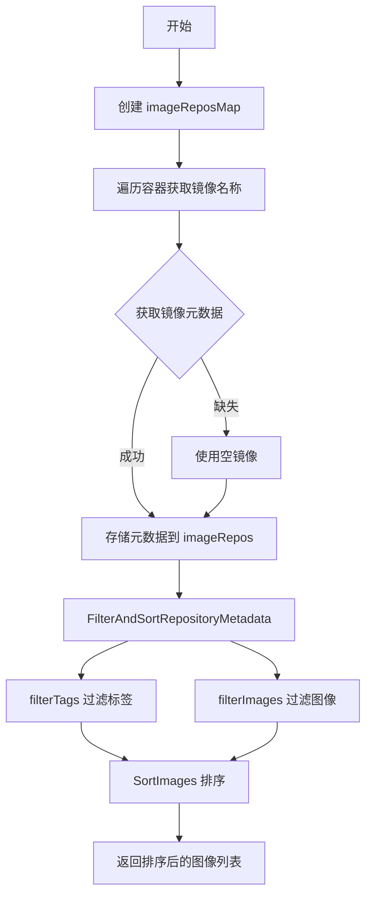

## 类结构

```
imageReposMap (类型别名/映射)
ImageRepos (结构体)
SortedImageInfos (类型别名)
containers (接口)
└── workloadContainers (实现类型)
```

## 全局变量及字段


### `imageReposMap`
    
A map type that stores image repository metadata, keyed by canonical image names

类型：`map[image.CanonicalName]image.RepositoryMetadata`
    


### `ImageRepos.imageRepos`
    
A map that stores image repositories keyed by their canonical name, containing the repository metadata such as tags and image information

类型：`imageReposMap`
    
    

## 全局函数及方法


### `FilterImages`

该函数用于根据指定的策略模式过滤图像列表，返回仅匹配该模式的图像组成的新列表。函数内部调用了私有的 `filterImages` 辅助函数完成实际的过滤逻辑，而过滤判断依赖于 `matchWithLatest` 函数来确定图像标签是否满足策略要求。

参数：

- `images`：`[]image.Info`，待过滤的图像信息列表
- `pattern`：`policy.Pattern`，用于匹配图像标签的策略模式

返回值：`[]image.Info`，过滤后的图像信息列表

#### 流程图

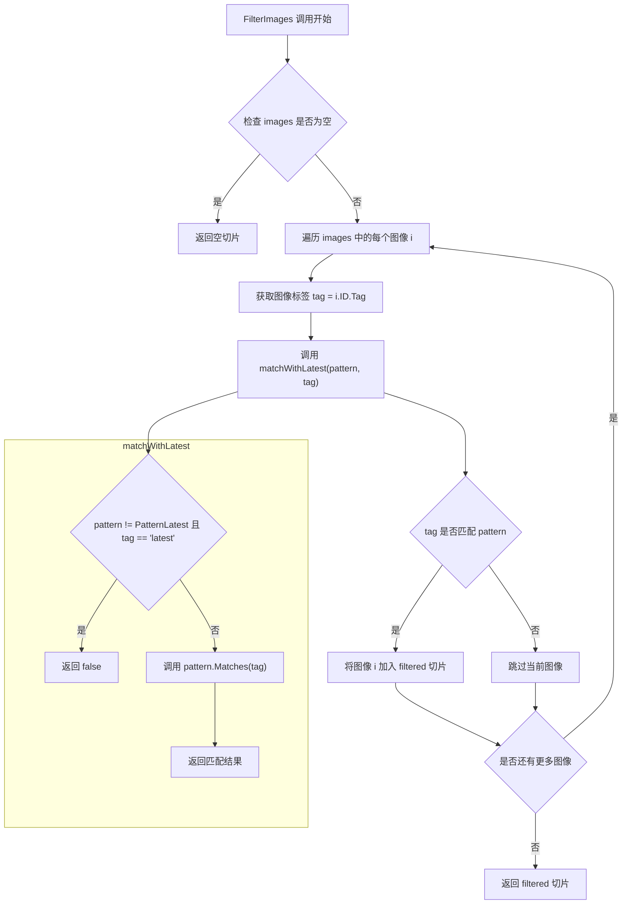

#### 带注释源码

```go
// FilterImages returns only the images that match the pattern, in a new list.
// 参数：
//   - images: 待过滤的图像信息列表
//   - pattern: 策略模式，用于判断哪些标签应该被保留
// 返回值：过滤后的图像信息切片
func FilterImages(images []image.Info, pattern policy.Pattern) []image.Info {
	return filterImages(images, pattern)
}

// filterImages 是实际的过滤实现函数
// 遍历所有图像，筛选出标签符合策略模式的图像
func filterImages(images []image.Info, pattern policy.Pattern) []image.Info {
	var filtered []image.Info
	// 逐个检查图像的标签是否匹配模式
	for _, i := range images {
		tag := i.ID.Tag // 获取图像的标签
		// 使用 matchWithLatest 判断是否匹配
		if matchWithLatest(pattern, tag) {
			filtered = append(filtered, i) // 匹配则加入结果集
		}
	}
	return filtered // 返回过滤后的图像列表
}

// matchWithLatest 判断给定的标签是否匹配策略模式
// 特殊处理：如果用户不想要 "latest" 标签，则忽略它
func matchWithLatest(pattern policy.Pattern, tag string) bool {
	// 如果用户没有明确指定要 "latest"，且当前标签是 "latest"，则返回 false
	if pattern != policy.PatternLatest && strings.EqualFold(tag, "latest") {
		return false
	}
	// 否则使用模式的 Matches 方法进行匹配
	return pattern.Matches(tag)
}
```


### `SortImages`

该函数是图像仓库管理模块中的公开排序接口，负责根据给定的策略模式对图像信息列表进行排序，返回一个包含排序后图像信息的 `SortedImageInfos` 类型切片。

参数：

- `images`：`[]image.Info`，待排序的图像信息列表
- `pattern`：`policy.Pattern`，用于确定排序规则（通常是按新旧程度排序）的策略模式对象

返回值：`SortedImageInfos`，排序后的图像信息列表

#### 流程图

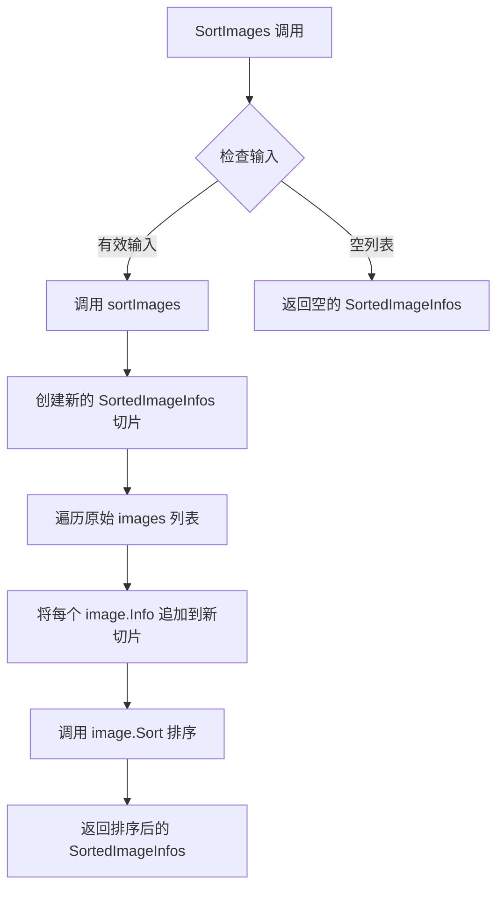

#### 带注释源码

```go
// SortImages orders the images according to the pattern order in a new list.
// 参数 images: 要排序的图像信息列表
// 参数 pattern: 排序策略模式，决定排序规则（如按新旧顺序）
// 返回值: 排序后的 SortedImageInfos 类型切片
func SortImages(images []image.Info, pattern policy.Pattern) SortedImageInfos {
	return sortImages(images, pattern)  // 委托给内部私有函数 sortImages 执行实际排序逻辑
}
```


### FilterAndSortRepositoryMetadata

该函数对镜像仓库元数据进行过滤和排序处理，通过直接对元数据中的标签进行过滤来最小化标签不一致问题（如标签没有匹配的镜像信息），然后对过滤后的镜像进行排序。

参数：

- `rm`：`image.RepositoryMetadata`，原始镜像仓库元数据，包含标签列表和镜像信息映射
- `pattern`：`policy.Pattern`，用于过滤和排序的策略模式，定义哪些标签需要保留以及排序规则

返回值：

- `SortedImageInfos`：排序后的镜像信息列表
- `error`：如果获取镜像标签信息时发生错误则返回错误

#### 流程图

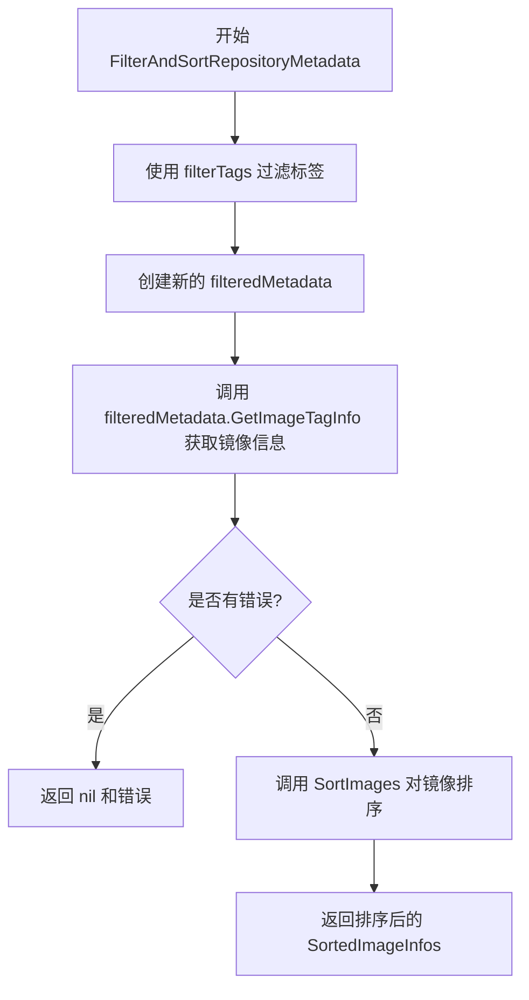

#### 带注释源码

```go
// FilterAndSortRepositoryMetadata obtains all the image information from the metadata
// after filtering and sorting. Filtering happens in the metadata directly to minimize
// problems with tag inconsistencies (i.e. tags without matching image information)
func FilterAndSortRepositoryMetadata(rm image.RepositoryMetadata, pattern policy.Pattern) (SortedImageInfos, error) {
	// Do the filtering: 创建过滤后的元数据，保留符合pattern规则的标签
	filteredMetadata := image.RepositoryMetadata{
		Tags:   filterTags(rm.Tags, pattern), // 调用filterTags函数过滤标签
		Images: rm.Images,                     // 保留原有的镜像信息映射
	}
	// 从过滤后的元数据中获取镜像标签信息
	filteredImages, err := filteredMetadata.GetImageTagInfo()
	if err != nil {
		return nil, err // 如果获取失败，返回nil和错误
	}
	// 对过滤后的镜像按照pattern规则进行排序后返回
	return SortImages(filteredImages, pattern), nil
}
```


### `fetchUpdatableImageRepos`

这是一个便捷的包装函数，用于将可更新的工作负载更新列表转换为容器接口，然后调用 `FetchImageRepos` 函数来获取这些工作负载中所有容器使用的镜像仓库元数据。

参数：

- `registry`：`registry.Registry`，用于获取镜像仓库元数据的注册表客户端
- `updateable`：`[]*WorkloadUpdate`，包含容器信息的可更新工作负载更新列表
- `logger`：`log.Logger`，用于记录错误和调试信息的日志记录器

返回值：`ImageRepos, error`，返回包含镜像仓库及其元数据的映射结构，以及可能的错误信息

#### 流程图

```mermaid
flowchart TD
    A[开始 fetchUpdatableImageRepos] --> B[接收参数: registry, updateable, logger]
    B --> C[将 []*WorkloadUpdate 转换为 workloadContainers 类型]
    C --> D[调用 FetchImageRepos 函数]
    D --> E{调用是否成功}
    E -->|成功| F[返回 ImageRepos 和 nil 错误]
    E -->|失败| G[返回空的 ImageRepos 和错误]
    F --> H[结束]
    G --> H
```

#### 带注释源码

```go
// fetchUpdatableImageRepos is a convenient shim to
// `FetchImageRepos`.
// fetchUpdatableImageRepos 是一个便捷的包装函数，用于将 WorkloadUpdate 切片
// 转换为容器接口，然后调用 FetchImageRepos 函数
func fetchUpdatableImageRepos(registry registry.Registry, updateable []*WorkloadUpdate, logger log.Logger) (ImageRepos, error) {
	// 将 updateable 参数（*WorkloadUpdate 切片）转换为 workloadContainers 类型
	// workloadContainers 实现了 containers 接口，能够为每个工作负载提供容器信息
	return FetchImageRepos(registry, workloadContainers(updateable), logger)
}
```


### `FetchImageRepos`

查找所有已知镜像仓库的元数据，用于更新给定容器控制器中的镜像。

参数：

- `reg`：`registry.Registry`，镜像注册表接口，用于获取镜像仓库的元数据
- `cs`：`containers`，容器集合接口，提供了获取容器信息的方法
- `logger`：`log.Logger`，日志记录器，用于记录错误信息

返回值：`ImageRepos, error`，返回包含镜像仓库元数据的 ImageRepos 对象，如果发生错误则返回错误

#### 流程图

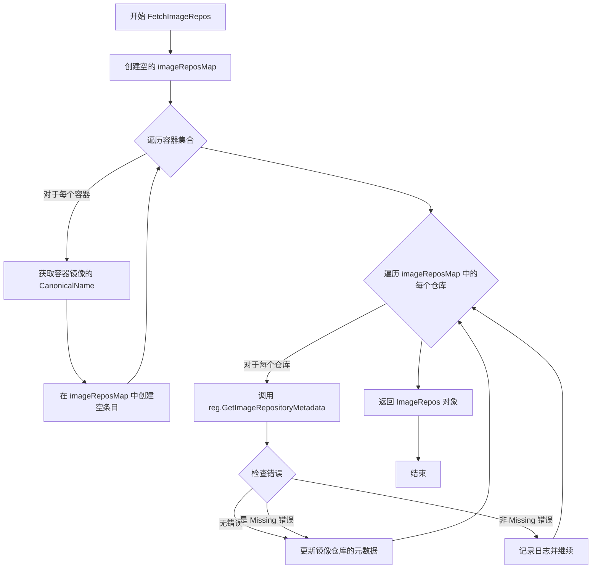

#### 带注释源码

```go
// FetchImageRepos finds all the known image metadata for
// containers in the controllers given.
func FetchImageRepos(reg registry.Registry, cs containers, logger log.Logger) (ImageRepos, error) {
	// 步骤1: 初始化一个空的 imageReposMap 用于存储镜像仓库元数据
	imageRepos := imageReposMap{}
	
	// 步骤2: 遍历所有容器，为每个容器的镜像在 map 中创建空条目
	//        这样可以避免重复查询相同的镜像
	for i := 0; i < cs.Len(); i++ {
		for _, container := range cs.Containers(i) {
			// 使用 CanonicalName 作为 key，确保相同镜像不会被重复添加
			imageRepos[container.Image.CanonicalName()] = image.RepositoryMetadata{}
		}
	}
	
	// 步骤3: 遍历所有唯一的镜像仓库，获取它们的元数据
	for repo := range imageRepos {
		// 调用注册表接口获取镜像仓库的元数据
		images, err := reg.GetImageRepositoryMetadata(repo.Name)
		if err != nil {
			// 如果镜像不存在（Missing 错误），使用空的镜像信息，这是正常情况
			if !fluxerr.IsMissing(err) {
				// 对于其他错误，记录日志但继续处理其他镜像
				logger.Log("err", errors.Wrapf(err, "fetching image metadata for %s", repo))
				continue
			}
		}
		// 更新 map 中对应仓库的元数据
		imageRepos[repo] = images
	}
	
	// 步骤4: 返回包装在 ImageRepos 结构中的结果
	return ImageRepos{imageRepos}, nil
}
```


### `exactImageRepos`

该函数用于创建镜像仓库与镜像信息的映射关系，并在创建映射前验证每个指定镜像是否真实存在于注册表中，以确保不会将无效镜像推送到 Git 仓库。

参数：

- `reg`：`registry.Registry`，注册表实例，用于查询镜像是否存在
- `images`：`[]image.Ref`，需要验证的镜像引用列表

返回值：`ImageRepos, error`，返回包含已验证镜像的仓库映射，如果验证失败则返回相应的错误信息

#### 流程图

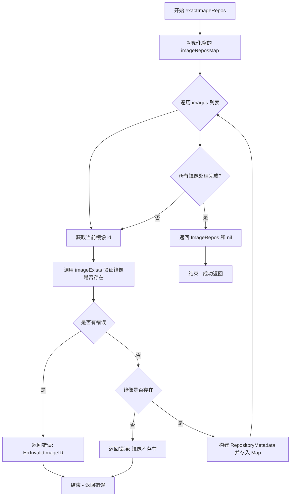

#### 带注释源码

```go
// exactImageRepos 创建镜像仓库到镜像信息的映射，并验证每个镜像确实存在于注册表中
// 参数：
//   - reg: registry.Registry 注册表客户端，用于查询镜像元数据
//   - images: []image.Ref 需要验证的镜像引用数组
//
// 返回值：
//   - ImageRepos: 包含所有有效镜像的仓库映射
//   - error: 验证失败或查询错误时返回
func exactImageRepos(reg registry.Registry, images []image.Ref) (ImageRepos, error) {
	// 初始化用于存储结果的 map，键为镜像的规范名称
	m := imageReposMap{}
	
	// 遍历所有需要验证的镜像
	for _, id := range images {
		// 验证镜像是否存在，防止将无效镜像推送到 Git
		exist, err := imageExists(reg, id)
		
		// 如果查询过程中发生错误（非缺失错误），包装错误并返回
		if err != nil {
			return ImageRepos{}, errors.Wrap(image.ErrInvalidImageID, err.Error())
		}
		
		// 如果镜像不存在，返回明确的错误信息
		if !exist {
			return ImageRepos{}, errors.Wrap(
				image.ErrInvalidImageID,
				fmt.Sprintf("image %q does not exist", id),
			)
		}
		
		// 镜像验证通过，构建 RepositoryMetadata 并存入 map
		// 使用镜像的规范名称作为键
		m[id.CanonicalName()] = image.RepositoryMetadata{
			// 镜像的标签列表
			Tags: []string{id.Tag},
			// 镜像详情映射，键为标签
			Images: map[string]image.Info{
				id.Tag: {ID: id},
			},
		}
	}
	
	// 所有镜像验证完成，返回构建好的 ImageRepos 对象
	return ImageRepos{m}, nil
}
```


### `imageExists`

检查指定的镜像是否存在于镜像仓库中。如果镜像存在返回 true，否则返回 false。

参数：

- `reg`：`registry.Registry`，镜像仓库注册表客户端，用于查询镜像元数据
- `imageID`：`image.Ref`，镜像引用对象，包含镜像的完整名称和标签信息

返回值：

- `bool`：镜像是否存在，true 表示存在，false 表示不存在
- `error`：错误信息（根据实现，当前始终返回 nil，参考 FIXME 注释表明设计上存在疑问）

#### 流程图

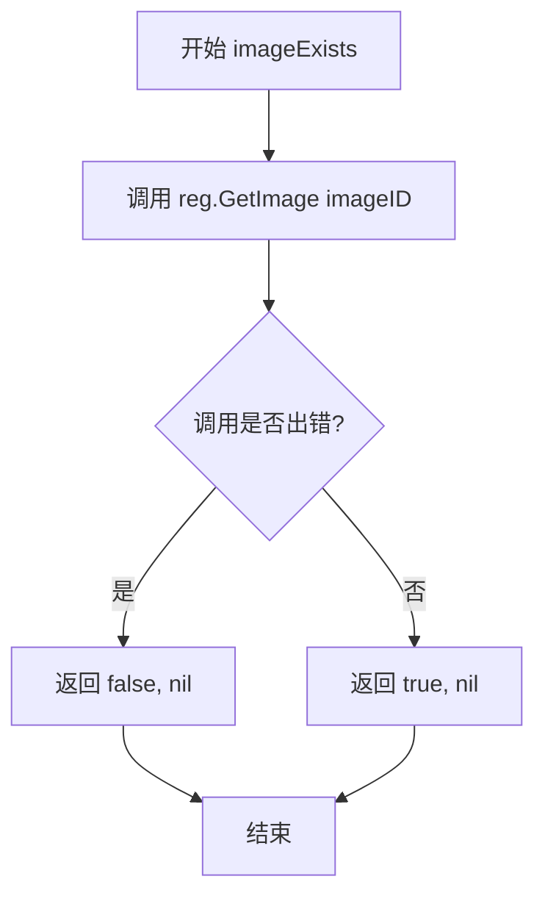

#### 带注释源码

```go
// Checks whether the given image exists in the repository.
// Return true if exist, false otherwise.
// FIXME(michael): never returns an error; should it?
func imageExists(reg registry.Registry, imageID image.Ref) (bool, error) {
	// 调用注册表的 GetImage 方法获取镜像信息
	_, err := reg.GetImage(imageID)
	// 如果获取过程中发生错误，说明镜像不存在
	if err != nil {
		// 返回 false 表示镜像不存在，错误信息被忽略（潜在技术债务）
		return false, nil
	}
	// 没有错误表示镜像存在，返回 true
	return true, nil
}
```


### `sortImages`

该函数用于根据指定的策略模式对镜像列表进行排序，返回一个包含排序后镜像信息的新切片。

参数：

- `images`：`[]image.Info`，待排序的镜像信息切片
- `pattern`：`policy.Pattern`，用于确定排序顺序的策略模式

返回值：`SortedImageInfos`，排序后的镜像信息列表

#### 流程图

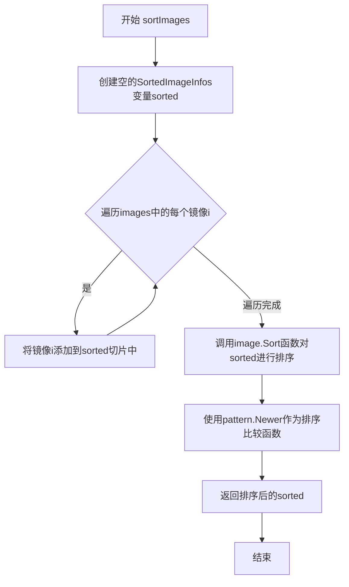

#### 带注释源码

```go
// sortImages 根据指定的策略模式对镜像列表进行排序
// 参数:
//   - images: 待排序的镜像信息切片
//   - pattern: 策略模式,用于确定排序规则(如按时间新旧)
// 返回值:
//   - SortedImageInfos: 排序后的镜像信息列表
func sortImages(images []image.Info, pattern policy.Pattern) SortedImageInfos {
	// 初始化一个空的SortedImageInfos切片用于存储排序结果
	var sorted SortedImageInfos
	
	// 遍历所有待排序的镜像,将它们添加到sorted切片中
	// 这里不直接修改原切片,而是创建新的切片来实现排序
	for _, i := range images {
		sorted = append(sorted, i)
	}
	
	// 调用image.Sort对sorted进行排序
	// pattern.Newer是一个比较函数,用于确定排序的先后顺序
	// 该函数会根据镜像的创建时间或其他属性判断新旧程度
	image.Sort(sorted, pattern.Newer)
	
	// 返回排序后的镜像信息列表
	return sorted
}
```


### `matchWithLatest`

该函数是一个辅助函数，用于在过滤镜像标签时判断给定的 tag 是否符合用户的匹配策略。其核心逻辑是：当用户没有明确要求获取 "latest" 标签时（pattern != policy.PatternLatest），自动过滤掉 "latest" 标签；否则按照标准的 pattern 匹配规则进行匹配。

参数：

- `pattern`：`policy.Pattern`，匹配策略模式，定义了如何匹配镜像标签（例如是否排除 latest、是否使用正则表达式等）
- `tag`：`string`，要匹配的镜像标签名称

返回值：`bool`，表示给定的 tag 是否符合匹配策略（true 为符合，false 为不符合）

#### 流程图

```mermaid
flowchart TD
    A[开始 matchWithLatest] --> B{pattern != policy.PatternLatest?}
    B -->|是| C{tag == 'latest'?}
    B -->|否| D[返回 pattern.Matches(tag)]
    C -->|是| E[返回 false]
    C -->|否| D
    F[结束] --> E
    F --> D
```

#### 带注释源码

```go
// matchWithLatest determines whether a given tag should be included
// based on the user's matching pattern preferences.
// It handles the special case of filtering out 'latest' tags unless
// explicitly requested by the user.
func matchWithLatest(pattern policy.Pattern, tag string) bool {
	// Ignore latest if and only if it's not what the user wants.
	// If the pattern is not PatternLatest (user doesn't want latest),
	// and the tag equals "latest" (case-insensitive), return false to filter it out.
	if pattern != policy.PatternLatest && strings.EqualFold(tag, "latest") {
		return false
	}
	// For all other cases (including when user wants latest),
	// use the standard pattern matching logic.
	return pattern.Matches(tag)
}
```


### `filterTags`

该函数用于根据指定的策略模式过滤图像标签列表，排除不需要的标签（如当用户不想要 "latest" 标签时）。

参数：

- `tags`：`[]string`，需要过滤的图像标签列表
- `pattern`：`policy.Pattern`，用于过滤标签的策略模式

返回值：`[]string`，过滤后的标签列表

#### 流程图

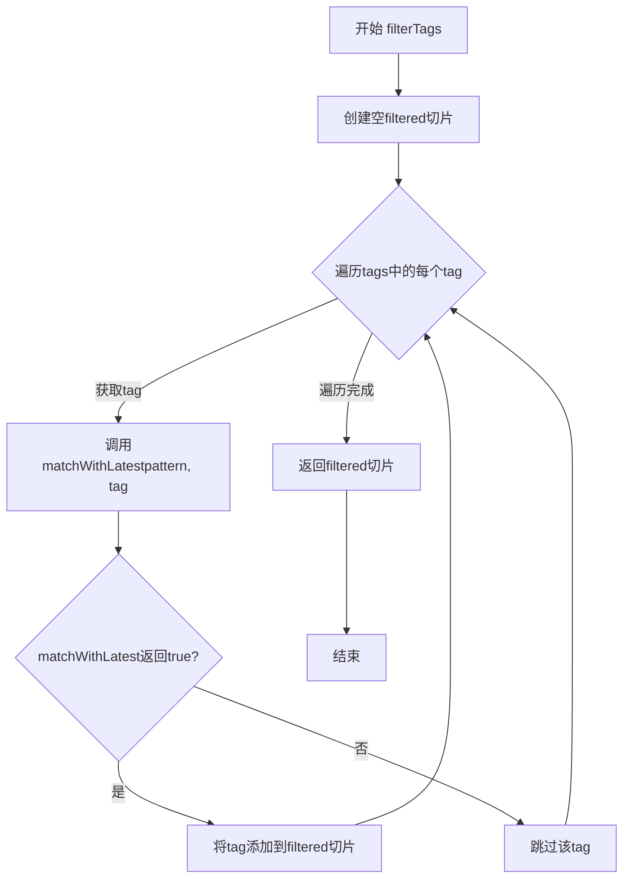

#### 带注释源码

```go
// filterTags 根据策略模式过滤标签列表
// 参数tags: 待过滤的标签数组
// 参数pattern: policy.Pattern类型，用于判断标签是否符合条件
// 返回值: 过滤后的标签数组
func filterTags(tags []string, pattern policy.Pattern) []string {
	// 初始化一个空切片用于存储过滤后的标签
	var filtered []string
	// 遍历输入的每一个标签
	for _, tag := range tags {
		// 调用matchWithLatest判断当前标签是否符合策略
		// 如果符合则添加到过滤结果中
		if matchWithLatest(pattern, tag) {
			filtered = append(filtered, tag)
		}
	}
	// 返回过滤后的标签列表
	return filtered
}
```

#### 相关依赖函数 `matchWithLatest`

```go
// matchWithLatest 判断标签是否匹配指定模式
// 如果用户不想要latest标签且当前标签是"latest"，则返回false
// 否则使用pattern.Matches进行匹配
func matchWithLatest(pattern policy.Pattern, tag string) bool {
	// Ignore latest if and only if it's not what the user wants.
	// 只有当pattern不是PatternLatest且tag等于"latest"时才忽略latest标签
	if pattern != policy.PatternLatest && strings.EqualFold(tag, "latest") {
		return false
	}
	// 使用策略模式的Matches方法进行匹配
	return pattern.Matches(tag)
}
```


### `filterImages`

该函数是一个私有辅助函数，用于根据指定的表情符号策略模式过滤图像列表。它遍历输入的图像集合，提取每个图像的标签，然后通过 `matchWithLatest` 函数判断该标签是否符合过滤条件，最终返回符合条件的新图像切片。

参数：

- `images`：`[]image.Info`，待过滤的图像信息列表
- `pattern`：`policy.Pattern`，用于过滤的策略模式

返回值：`[]image.Info`，过滤后的图像信息列表

#### 流程图

```mermaid
flowchart TD
    A[开始 filterImages] --> B[初始化空切片 filtered]
    B --> C{遍历 images 中的每个图像 i}
    C -->|还有图像| D[获取图像标签 tag = i.ID.Tag]
    D --> E{调用 matchWithLatest(pattern, tag)}
    E -->|匹配成功| F[将图像 i 添加到 filtered 切片]
    E -->|匹配失败| C
    F --> C
    C -->|遍历完成| G[返回 filtered 切片]
    G --> H[结束]
```

#### 带注释源码

```go
// filterImages 根据给定的策略模式过滤图像列表，返回符合条件的图像切片
// 参数：
//   - images: 待过滤的图像信息列表
//   - pattern: 策略模式，用于判断图像标签是否应该被保留
//
// 返回值：
//   - 过滤后的图像信息列表
func filterImages(images []image.Info, pattern policy.Pattern) []image.Info {
	// 1. 初始化一个空的图像切片用于存储过滤结果
	var filtered []image.Info
	
	// 2. 遍历输入的每个图像
	for _, i := range images {
		// 3. 从图像信息中提取标签（Tag）
		tag := i.ID.Tag
		
		// 4. 使用 matchWithLatest 检查标签是否匹配策略模式
		//    该函数会考虑是否忽略 'latest' 标签等因素
		if matchWithLatest(pattern, tag) {
			// 5. 如果匹配，则将该图像添加到过滤结果中
			filtered = append(filtered, i)
		}
	}
	
	// 6. 返回过滤后的图像列表
	return filtered
}
```


### `ImageRepos.GetRepositoryMetadata`

获取指定镜像仓库的元数据信息，并返回副本以防止内部状态被修改。该方法通过规范化名称查找镜像仓库的标签和镜像信息，同时将镜像ID重写为请求时使用的非规范化表示形式。

参数：

- `repo`：`image.Name`，目标镜像仓库的名称，用于查询其元数据

返回值：`image.RepositoryMetadata`，包含镜像仓库的标签列表和镜像信息字典，如果仓库不存在则返回空结构

#### 流程图

```mermaid
flowchart TD
    A[开始 GetRepositoryMetadata] --> B{根据 repo.CanonicalName() 查找 imageRepos}
    B -->|找到| C[创建 tagsCopy 副本]
    B -->|未找到| F[返回空的 RepositoryMetadata]
    C --> D[遍历 metadata.Images 创建 imagesCopy]
    D --> E[将 info.ID 重写为 repo.ToRef(info.ID.Tag)]
    E --> G[返回新的 RepositoryMetadata{tagsCopy, imagesCopy}]
    
    style C fill:#e1f5fe
    style D fill:#e1f5fe
    style E fill:#e1f5fe
    style F fill:#ffebee
    style G fill:#e8f5e9
```

#### 带注释源码

```go
// GetRepositoryMetadata returns the metadata for all the images in the
// named image repository.
// 获取指定镜像仓库的元数据，包括所有标签和镜像信息
func (r ImageRepos) GetRepositoryMetadata(repo image.Name) image.RepositoryMetadata {
	// 使用规范化名称查找镜像仓库元数据
	if metadata, ok := r.imageRepos[repo.CanonicalName()]; ok {
		// 复制标签列表，创建副本以避免外部修改内部状态
		tagsCopy := make([]string, len(metadata.Tags))
		copy(tagsCopy, metadata.Tags)
		
		// 复制镜像信息字典，创建副本以避免外部修改内部状态
		imagesCopy := make(map[string]image.Info, len(metadata.Images))
		for tag, info := range metadata.Images {
			// 注释：注册表（缓存）存储的元数据使用规范化镜像名称
			// 例如：`index.docker.io/library/alpine`。我们根据查询时使用的
			// 仓库名称（repo）重写镜像名称，可能是非规范化表示（例如 `alpine`）
			info.ID = repo.ToRef(info.ID.Tag)
			imagesCopy[tag] = info
		}
		// 返回新的元数据结构，包含副本数据
		return image.RepositoryMetadata{tagsCopy, imagesCopy}
	}
	// 如果未找到对应的镜像仓库，返回空结构
	return image.RepositoryMetadata{}
}
```


### `SortedImageInfos.Latest`

返回 SortedImageInfos 中的最新镜像。如果不存在这样的镜像，则返回零值和 `false`，调用者可以决定这是否算作错误。

参数：

- （无参数，该方法是绑定到 SortedImageInfos 类型的方法）

返回值：

- `image.Info`：最新的镜像信息
- `bool`：表示是否找到镜像（true 表示找到，false 表示未找到）

#### 流程图

```mermaid
flowchart TD
    A[开始 Latest] --> B{len > 0?}
    B -->|是| C[返回 sii[0], true]
    B -->|否| D[返回 image.Info{}, false]
    C --> E[结束]
    D --> E
```

#### 带注释源码

```go
// Latest 返回 SortedImageInfos 中的最新镜像。如果不存在这样的镜像，
// 则返回零值和 `false`，调用者可以决定这是否算作错误。
// 参数：无
// 返回值：
//   - image.Info: 最新的镜像信息
//   - bool: 是否成功找到镜像
func (sii SortedImageInfos) Latest() (image.Info, bool) {
	// 检查切片是否为空
	if len(sii) > 0 {
		// 如果不为空，返回第一个元素（最新镜像）和 true
		// 注意：SortedImageInfos 已按时间排序，第一个元素即为最新
		return sii[0], true
	}
	// 如果为空，返回零值 image.Info 和 false
	return image.Info{}, false
}
```


### `workloadContainers.Len`

该方法定义在 `workloadContainers` 类型上，用于返回容器集合（即 `[]*WorkloadUpdate` 切片）的长度，实现了 `containers` 接口的 `Len()` 方法。

参数： 无（仅包含接收者参数 `cs workloadContainers`）

返回值： `int`，返回底层切片的长度

#### 流程图

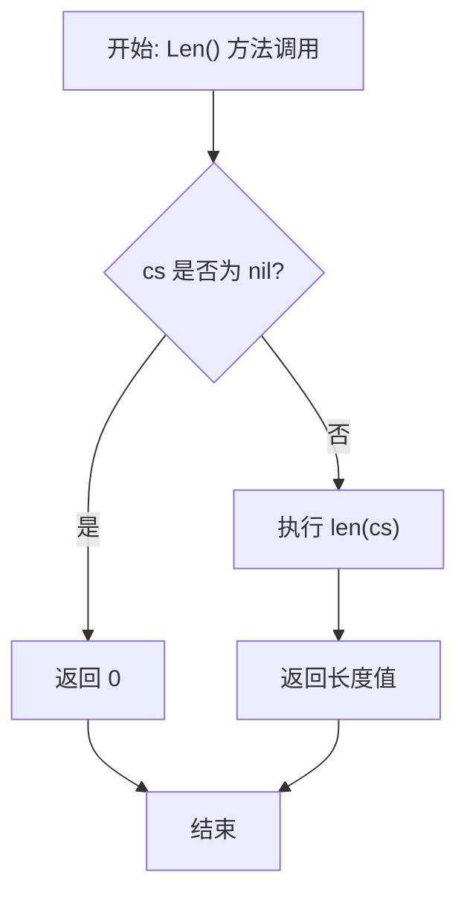

#### 带注释源码

```go
// Len 返回 workloadContainers 切片的长度
// 该方法实现了 containers 接口的 Len() 方法
// 参数: 无（接收者 cs 为 workloadContainers 类型）
// 返回值: int - 切片的长度
func (cs workloadContainers) Len() int {
	return len(cs) // 返回底层 []*WorkloadUpdate 切片的长度
}
```


### `workloadContainers.Containers`

该方法是 `workloadContainers` 类型的成员方法，用于根据给定索引返回对应工作负载更新中的容器列表。实现了 `containers` 接口的 `Containers` 方法，为 `FetchImageRepos` 函数提供遍历容器的基础能力。

参数：

- `i`：`int`，表示工作负载的索引位置，用于从 `workloadContainers` 切片中获取对应的 `WorkloadUpdate`

返回值：`[]resource.Container`，返回指定索引处工作负载所包含的容器列表，如果工作负载不存在容器则可能返回 nil

#### 流程图

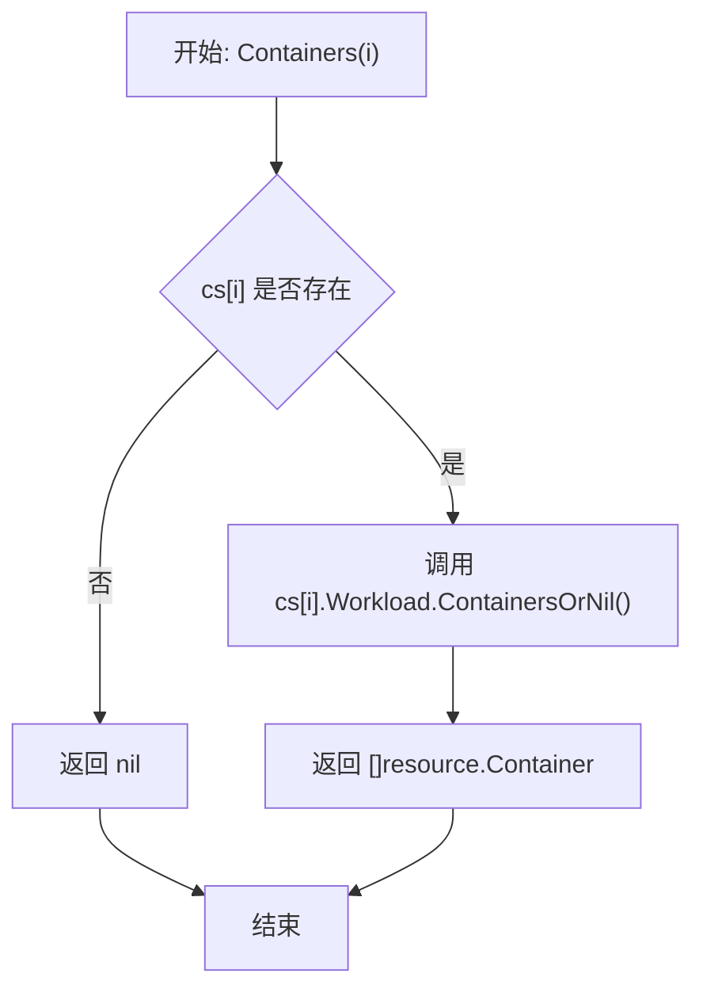

#### 带注释源码

```go
// Containers 返回指定索引位置的工作负载中的容器列表
// 参数 i: 整型索引，指向 workloadContainers 切片中的元素位置
// 返回: 该工作负载包含的容器数组，可能为空或 nil
func (cs workloadContainers) Containers(i int) []resource.Container {
	// 访问切片中第 i 个 WorkloadUpdate 元素
	// 调用其内部 Workload 对象的 ContainersOrNil 方法获取容器列表
	return cs[i].Workload.ContainersOrNil()
}
```

## 关键组件


### imageReposMap

映射类型，键为 image.CanonicalName，值为 image.RepositoryMetadata，用于存储镜像仓库名称到其元数据的映射关系。

### ImageRepos

结构体类型，包含一个 imageReposMap 类型的字段，用于封装镜像仓库元数据的集合，并提供查询和检索功能。

### GetRepositoryMetadata

方法，用于获取指定镜像仓库的元数据。参数为 image.Name 类型的 repo，返回值为 image.RepositoryMetadata。包含名称规范化处理逻辑，将canonical名称转换回查询时使用的表示形式。

### SortedImageInfos

类型别名，是 []image.Info 的切片类型，代表经过排序的镜像信息列表，用于按策略模式排序镜像。

### FilterImages

函数，根据 policy.Pattern 对镜像列表进行过滤，返回符合条件的镜像新列表。

### SortImages

函数，根据 policy.Pattern 对镜像列表进行排序，返回排序后的 SortedImageInfos。

### FilterAndSortRepositoryMetadata

函数，先过滤后排序镜像仓库元数据。参数为 image.RepositoryMetadata 和 policy.Pattern，返回 SortedImageInfos 和 error。

### Latest

方法，从 SortedImageInfos 中获取最新镜像，返回 image.Info 和布尔值表示是否存在。

### matchWithLatest

内部函数，判断标签是否匹配"latest"，处理用户明确需要"latest"标签时的特殊逻辑。

### filterTags

内部函数，根据模式过滤标签列表，返回符合条件的标签切片。

### filterImages

内部函数，根据模式过滤镜像列表，返回符合条件的镜像切片。

### containers

接口，定义容器集合的统一访问接口，包含 Len() 和 Containers(i int) 方法。

### workloadContainers

类型，实现 containers 接口，用于处理 WorkloadUpdate 切片。

### fetchUpdatableImageRepos

便捷封装函数，将 WorkloadUpdate 切片转换为 containers 接口后调用 FetchImageRepos。

### FetchImageRepos

核心函数，从注册表中获取所有控制器容器使用的镜像仓库元数据，初始化空映射并逐个查询填充。

### exactImageRepos

函数，验证指定镜像是否存在并构建镜像仓库映射，用于确保只有存在的镜像才会被处理。

### imageExists

函数，检查给定镜像是否在注册表中存在，返回布尔值。


## 问题及建议


### 已知问题

-   **imageExists函数错误处理不完整**：函数注释明确指出`FIXME(michael): never returns an error; should it?`，该函数捕获了所有错误但始终返回nil错误，丢失了有价值的错误信息，导致调用者无法区分"镜像不存在"和"发生内部错误"两种情况。

-   **FetchImageRepos错误处理不一致**：当获取镜像元数据失败且错误不是`fluxerr.IsMissing(err)`时，函数仅记录日志并继续执行，最终仍返回nil错误。这意味着调用者无法得知是否有部分镜像获取失败，可能导致后续操作基于不完整的数据做出错误决策。

-   **sortImages函数性能问题**：当前实现使用`image.Sort`进行排序，但未考虑预分配切片容量。每次append都可能导致内存重新分配，对于大量镜像场景存在性能优化空间。

-   **GetRepositoryMetadata存在不必要的数据拷贝**：每次调用都会创建tags和images的完整副本，在高频调用场景下会产生显著的内存开销和GC压力。

-   **缺少并发控制**：FetchImageRepos串行遍历所有镜像仓库获取元数据，当镜像数量较多时会导致较长的响应时间，可以考虑使用并发获取来优化。

-   **容器接口设计**：containers接口实现使用指针类型`*WorkloadUpdate`，但接口本身并未明确要求指针接收者，这种隐式依赖可能导致理解上的困惑。

### 优化建议

-   **修复imageExists函数**：返回具体的错误信息，或至少区分"镜像不存在"和"系统错误"两种情况，使调用者能够做出正确的错误处理决策。

-   **改进FetchImageRepos错误聚合**：使用一个errors列表收集所有非Missing错误，在函数结束时返回聚合的错误信息，或返回一个包含成功/失败结果的复合结构。

-   **优化内存分配**：使用make预分配切片和map的初始容量，如`make(imageReposMap, cs.Len())`和`sorted := make(SortedImageInfos, 0, len(images))`。

-   **添加可选的并发获取机制**：提供一个带有context和并发控制的版本，允许调用者根据实际需求权衡性能和资源消耗。

-   **考虑为GetRepositoryMetadata添加缓存或直接返回只读视图**：如果元数据不需要修改，直接返回内部数据的引用或使用copy-on-write策略，避免不必要的深拷贝。

## 其它


### 设计目标与约束

本代码包主要服务于FluxCD镜像更新机制，核心目标是为工作负载提供镜像仓库元数据的查询、过滤和排序能力。设计约束包括：仅处理有效的镜像引用；支持semver和非semver标签的过滤；对latest标签有特殊处理逻辑；必须处理镜像不存在的情况以避免推送到Git的无效镜像。

### 错误处理与异常设计

代码采用Go错误返回模式，主要错误场景包括：镜像仓库元数据获取失败（通过fluxerr.IsMissing判断是否为缺失错误）、镜像不存在错误（返回image.ErrInvalidImageID）、以及过滤过程中的错误传播。GetImageRepositoryMetadata返回的错误会被包装并记录但不中断流程；exactImageRepos中若镜像不存在会返回明确的错误信息。imageExists函数存在FIXME注释，表明其错误处理逻辑不完整。

### 数据流与状态机

数据流主要分为两条路径：FilterAndSortRepositoryMetadata路径用于从仓库元数据中过滤标签并排序镜像，返回SortedImageInfos；FetchImageRepos路径用于从注册表批量获取镜像仓库元数据并构建ImageRepos结构。状态转换方面，原始镜像数据经过过滤（filterTags/filterImages）后进入排序阶段（sortImages），最终通过Latest方法获取最新版本。

### 外部依赖与接口契约

主要依赖包括：github.com/fluxcd/flux/pkg/image提供镜像类型定义；github.com/fluxcd/flux/pkg/policy提供过滤策略；github.com/fluxcd/flux/pkg/registry提供镜像仓库注册表接口；github.com/fluxcd/flux/pkg/resource提供容器资源类型。containers接口定义了Len()和Containers(i int)方法，用于抽象不同类型的容器集合。registry.Registry接口需实现GetImageRepositoryMetadata和GetImage方法。

### 性能考虑与资源使用

FetchImageRepos方法遍历所有容器构建镜像仓库映射后，串行从注册表获取元数据，可能存在性能瓶颈。代码中使用copy方式复制Tags和Images map以避免外部修改，但未进行深度复制。镜像排序使用自定义排序算法，时间复杂度为O(n log n)。大镜像仓库场景下imagesCopy map的构建可能消耗较多内存。

### 并发与线程安全

ImageRepos结构体本身不包含并发控制机制，imageReposMap为非线程安全类型。在实际使用中，ImageRepos通过值传递或指针传递共享，需要调用方保证并发访问安全。FetchImageRepos函数中imageRepos映射的构建过程存在潜在的竞态条件风险（先写入后读取）。

### 安全考虑

代码主要处理镜像元数据，不直接涉及敏感凭证操作。镜像名称和标签的验证依赖image包实现。错误消息中可能暴露镜像名称信息，但不会暴露凭据或内部架构细节。

### 测试策略建议

建议补充单元测试覆盖：filterTags和filterImages对各种pattern的过滤逻辑；SortImages的排序正确性；matchWithLatest对latest标签的特殊处理；ImageRepos.GetRepositoryMetadata的副本创建逻辑；exactImageRepos对不存在镜像的错误处理。集成测试应覆盖真实registry交互。

### 配置与参数

无显式配置项，所有行为通过函数参数控制：policy.Pattern控制过滤和排序规则；logger用于结构化日志记录；registry.Registry接口实现决定具体注册表行为。

### 边界条件处理

代码对边界条件的处理包括：SortedImageInfos.Latest()对空列表返回零值和false；FetchImageRepos对元数据获取失败使用空镜像而非中断；filterTags和filterImages返回nil切片而非空切片；GetRepositoryMetadata对不存在的仓库返回空RepositoryMetadata。

    