# `flux\pkg\update\images_test.go` 详细设计文档

这是一个Go语言测试文件，测试了Flux CD中镜像仓库的过滤、排序和非规范化名称转换功能，验证了镜像元数据的语义版本过滤和一致性容忍能力。

## 整体流程

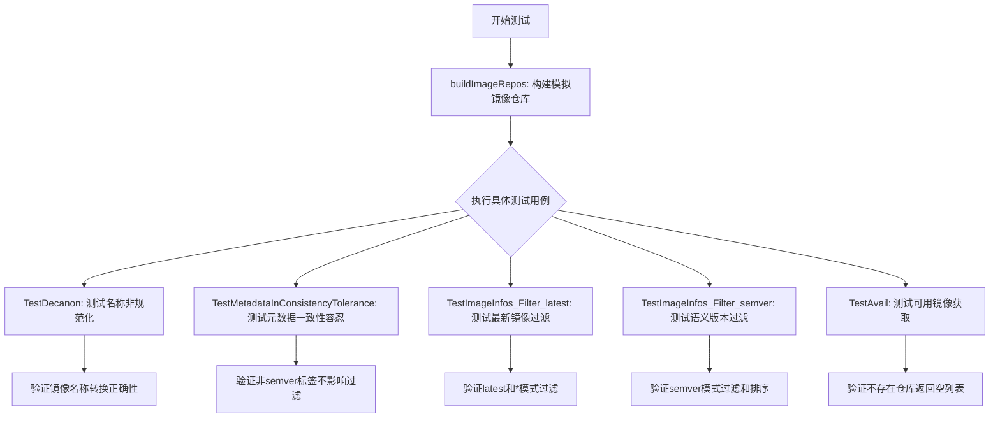

## 类结构

```
update 包
├── ImageRepos (类型，在同包其他文件)
│   ├── imageReposMap (字段)
│   ├── GetRepositoryMetadata() (方法)
├── SortedImageInfos (类型，在同包其他文件)
│   ├── Latest() (方法)
├── FilterAndSortRepositoryMetadata() (函数)
├── FilterImages() (函数)
├── SortImages() (函数)
└── filterImages() (内部函数)
image.Info (外部依赖: github.com/fluxcd/flux/pkg/image)
policy.Pattern (外部依赖: github.com/fluxcd/flux/pkg/policy)
mock.Registry (外部依赖: github.com/fluxcd/flux/pkg/registry/mock)
```

## 全局变量及字段


### `name`
    
规范化的镜像名称

类型：`image.CanonicalName`
    


### `infos`
    
镜像信息列表

类型：`[]image.Info`
    


### `ImageRepos.imageReposMap`
    
镜像仓库映射表

类型：`imageReposMap`
    


### `mock.Registry.Images`
    
镜像列表

类型：`[]image.Info`
    
    

## 全局函数及方法


### `buildImageRepos`

该函数用于构建测试用的 ImageRepos 对象，通过创建模拟的 Registry 并获取指定镜像仓库的元数据，初始化并返回一个包含镜像仓库信息的 ImageRepos 结构体，供测试用例使用。

参数：

- `t`：`*testing.T`，Go 测试框架的测试对象，用于断言和错误检查

返回值：`ImageRepos`，包含镜像仓库元数据的结构体，用于后续的镜像过滤和排序测试

#### 流程图

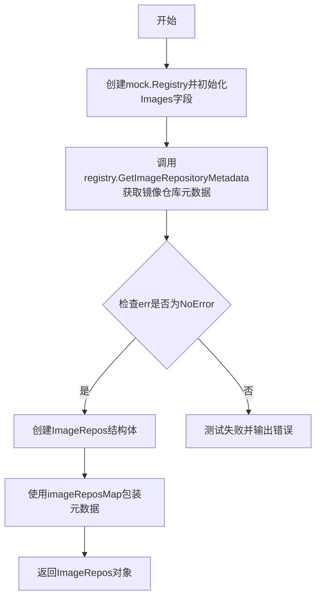

#### 带注释源码

```go
// buildImageRepos 构建一个用于测试的 ImageRepos 对象
// 参数 t 是 Go 测试框架的 testing.T 类型，用于测试中断言和错误报告
func buildImageRepos(t *testing.T) ImageRepos {
	// 步骤1: 创建模拟的 Registry，使用预定义的镜像信息列表 infos 初始化
	// infos 是全局变量，包含了两个测试镜像（v1 和 v2）
	registry := mock.Registry{Images: infos}
	
	// 步骤2: 从模拟注册表中获取指定镜像仓库的元数据
	// name 是全局变量，解析自 "index.docker.io/weaveworks/helloworld"
	// GetImageRepositoryMetadata 返回该镜像仓库的元数据信息
	repoMetadata, err := registry.GetImageRepositoryMetadata(name.Name)
	
	// 步骤3: 断言确保获取元数据操作没有错误
	// 如果有错误，测试将失败并显示错误信息
	assert.NoError(t, err)
	
	// 步骤4: 构建并返回 ImageRepos 对象
	// 使用镜像仓库的规范名称作为 key，元数据作为 value
	// imageReposMap 是 ImageRepos 内部的底层存储结构
	return ImageRepos{
		imageRepos: imageReposMap{name.Name.CanonicalName(): repoMetadata},
	}
}
```


### `getFilteredAndSortedImagesFromRepos`

该函数用于从给定的镜像仓库中获取符合过滤条件（使用 `policy.PatternAll` 策略）并排序后的镜像列表，常用于测试场景中验证镜像的反规范化处理逻辑。

参数：

- `t`：`testing.T`，测试框架提供的测试指针，用于断言和错误报告
- `imageName`：`string`，镜像名称（可以是短名称如 `weaveworks/helloworld` 或完整名称如 `index.docker.io/weaveworks/helloworld`）
- `repos`：`ImageRepos`，镜像仓库对象，包含多个镜像仓库的元数据

返回值：`SortedImageInfos`，过滤并排序后的镜像信息列表

#### 流程图

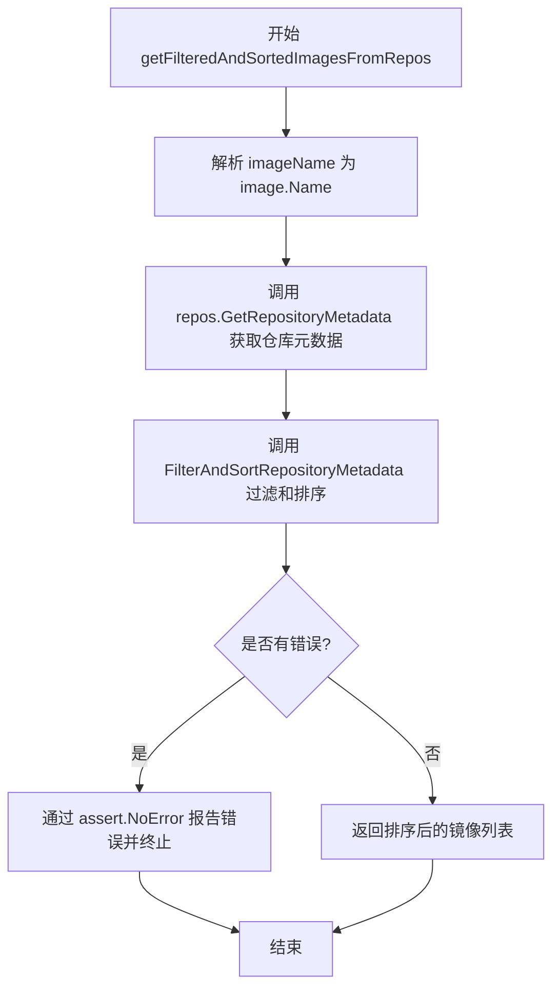

#### 带注释源码

```go
// getFilteredAndSortedImagesFromRepos 从指定的 ImageRepos 中获取过滤并排序后的镜像列表
// 参数:
//   - t: *testing.T - 测试框架指针，用于断言
//   - imageName: string - 要查询的镜像名称（支持短名称和完整 canonical 名称）
//   - repos: ImageRepos - 镜像仓库容器，包含多个仓库的元数据
//
// 返回值:
//   - SortedImageInfos: 过滤并排序后的镜像信息列表
func getFilteredAndSortedImagesFromRepos(t *testing.T, imageName string, repos ImageRepos) SortedImageInfos {
    // 第一步：将字符串格式的镜像名称解析为 image.Name 对象
    // 这里使用 mustParseName 进行解析，如果解析失败会 panic
    metadata := repos.GetRepositoryMetadata(mustParseName(imageName))
    
    // 第二步：调用 FilterAndSortRepositoryMetadata 对仓库元数据进行过滤和排序
    // 使用 policy.PatternAll 策略获取所有镜像标签
    images, err := FilterAndSortRepositoryMetadata(metadata, policy.PatternAll)
    
    // 第三步：断言操作无错误
    // 如果过滤和排序过程中出现错误，测试将失败并输出错误信息
    assert.NoError(t, err)
    
    // 第四步：返回排序后的镜像信息列表
    return images
}
```


### `mustParseName`

该函数用于解析并验证镜像名称字符串，将其转换为 `image.Name` 类型。如果解析失败，则触发 panic，这是该函数名称中 "must" 的含义——它确保返回有效的镜像名称，否则程序将终止。

#### 参数

- `im`：`string`，待解析的镜像名称字符串，格式可为简短形式（如 "alpine"）或完整形式（如 "index.docker.io/library/alpine"）

#### 返回值

- `image.Name`，解析后的镜像名称对象

#### 流程图

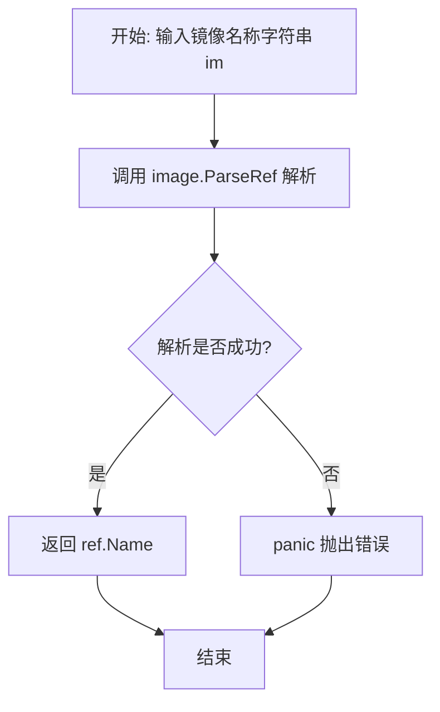

#### 带注释源码

```go
// mustParseName 解析并验证镜像名称字符串
// 参数 im: 镜像名称字符串，支持多种格式
// 返回值: 解析后的 image.Name 对象
// 注意: 如果解析失败会触发 panic，因此调用者应确保输入有效
func mustParseName(im string) image.Name {
    // 调用 image.ParseRef 解析字符串为镜像引用
    ref, err := image.ParseRef(im)
    
    // 检查解析过程中是否产生错误
    if err != nil {
        // 解析失败时触发 panic，这是该函数的设计意图：
        // 调用者必须确保传入有效的镜像名称字符串
        panic(err)
    }
    
    // 解析成功，返回引用中的名称部分
    return ref.Name
}
```

#### 关键组件信息

| 组件名称 | 一句话描述 |
|---------|-----------|
| `image.ParseRef` | 负责将字符串解析为镜像引用对象的外部函数 |
| `image.Name` | 表示镜像名称的结构体类型 |

#### 潜在技术债务或优化空间

1. **错误处理方式不当**：使用 `panic` 处理解析错误过于激进，在生产环境中可能导致整个服务崩溃。更佳的做法是返回 error 让调用者决定如何处理。
2. **缺乏输入验证**：函数未对输入进行预验证，直接依赖 `ParseRef` 的解析结果。
3. **测试覆盖风险**：由于错误情况会触发 panic，测试用例可能难以覆盖所有边界情况。

#### 其它说明

- **设计目标**：该函数是测试代码中的辅助函数，用于快速获取有效的镜像名称，其 "must" 命名约定表明调用者应保证输入的有效性。
- **使用场景**：在测试代码中多次被调用，用于将字符串形式的镜像名称转换为 `image.Name` 类型，以便进行后续的镜像仓库查询和过滤操作。
- **外部依赖**：依赖 `github.com/fluxcd/flux/pkg/image` 包中的 `ParseRef` 方法和 `Name` 类型。


### `filterImages`

该函数用于根据给定的策略模式（policy.Pattern）对镜像信息列表进行过滤，返回符合条件的所有镜像。

参数：

- `images`：`[]image.Info`，待过滤的镜像信息列表
- `pattern`：`policy.Pattern`，用于过滤镜像的策略模式（如 latest、semver:* 等）

返回值：`[]image.Info`，过滤后的镜像信息列表

#### 流程图

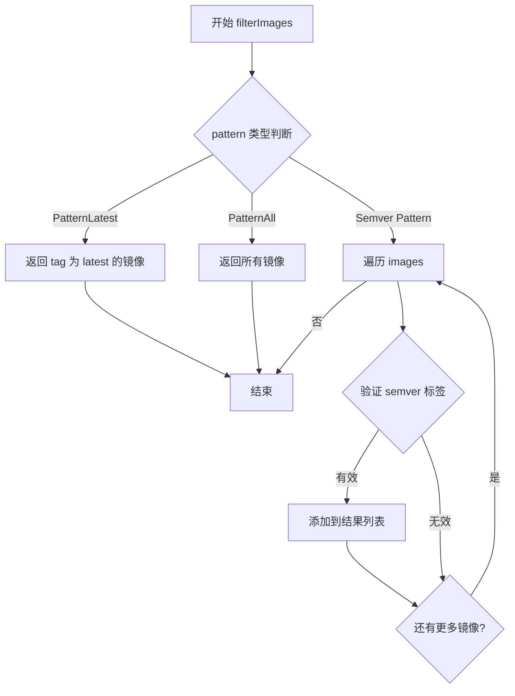

#### 带注释源码

```go
// filterImages 根据提供的策略模式过滤镜像列表
// 参数：
//   - images: 待过滤的镜像信息切片
//   - pattern: 过滤策略（支持 latest、semver、* 等模式）
//
// 返回值：
//   - 符合策略条件的镜像信息切片
//
// 使用示例（来自测试代码）：
//   filterImages(images, policy.PatternLatest)  // 返回 tag 为 latest 的镜像
//   filterImages(images, policy.PatternAll)      // 返回所有镜像
//   filterImages(images, policy.NewPattern("semver:*")) // 返回所有 semver 格式的镜像
func filterImages(images []image.Info, pattern policy.Pattern) []image.Info {
    // 具体的实现逻辑未在此文件中定义
    // 根据 pattern 类型进行相应的过滤操作
    // 返回过滤后的 image.Info 切片
}
```


### `TestDecanon`

该测试函数用于验证图像仓库在处理图像名称时的非规范化（decanonicalization）能力。测试模拟了用户使用不同格式的名称（如短名称"weaveworks/helloworld"和完整规范名称"index.docker.io/weaveworks/helloworld"）查询图像的场景，确保系统能正确返回与查询名称相匹配的图像信息，而非总是返回规范化的注册表名称。

参数：

- `t`：`*testing.T`，Go 测试框架的测试对象，用于报告测试失败和错误

返回值：无（测试函数无返回值，通过 `t.Error` 报告测试结果）

#### 流程图

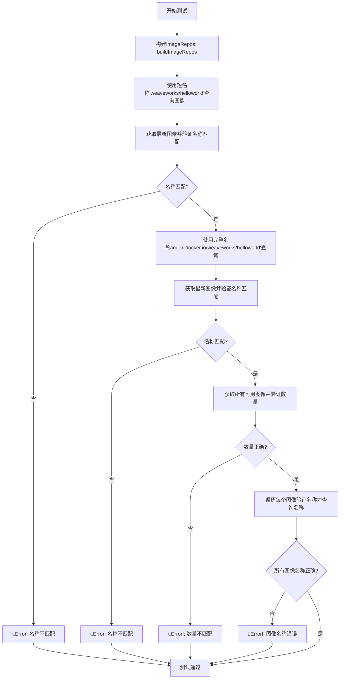

#### 带注释源码

```go
// TestDecanon checks that we return appropriate image names when
// asked for images. The registry (cache) stores things with canonical
// names (e.g., `index.docker.io/library/alpine`), but we ask
// questions in terms of everyday names (e.g., `alpine`).
func TestDecanon(t *testing.T) {
	// 步骤1: 构建图像仓库对象，使用mock注册表包含v1和v2两个版本的图像
	imageRepos := buildImageRepos(t)

	// 步骤2: 使用短名称（非规范名称）查询图像
	// 预期行为：返回的图像名称应与查询时使用的名称一致，而非规范化的注册表名称
	images := getFilteredAndSortedImagesFromRepos(t, "weaveworks/helloworld", imageRepos)
	latest, ok := images.Latest()
	if !ok {
		t.Error("did not find latest image") // 未找到最新图像
	} else if latest.ID.Name != mustParseName("weaveworks/helloworld") {
		t.Error("name did not match what was asked") // 图像名称与查询名称不匹配
	}

	// 步骤3: 使用完整规范名称查询图像
	// 预期行为：返回的图像名称应保持完整的规范名称格式
	images = getFilteredAndSortedImagesFromRepos(t, "index.docker.io/weaveworks/helloworld", imageRepos)
	latest, ok = images.Latest()
	if !ok {
		t.Error("did not find latest image") // 未找到最新图像
	} else if latest.ID.Name != mustParseName("index.docker.io/weaveworks/helloworld") {
		t.Error("name did not match what was asked") // 图像名称与查询名称不匹配
	}

	// 步骤4: 验证可用图像列表的数量和名称
	// 预期：所有返回的图像名称都应该使用查询时指定的名称格式（非规范化）
	avail := getFilteredAndSortedImagesFromRepos(t, "weaveworks/helloworld", imageRepos)
	if len(avail) != len(infos) {
		t.Errorf("expected %d available images, got %d", len(infos), len(avail))
	}
	for _, im := range avail {
		if im.ID.Name != mustParseName("weaveworks/helloworld") {
			t.Errorf("got image with name %q", im.ID.String())
		}
	}
}
```

---

### 辅助函数信息

#### `buildImageRepos`

构建用于测试的 ImageRepos 对象，包含预设的图像元数据。

参数：
- `t`：`*testing.T`，测试对象

返回值：`ImageRepos`，包含模拟注册表图像信息的仓库对象

#### `getFilteredAndSortedImagesFromRepos`

从图像仓库中获取过滤和排序后的图像列表。

参数：
- `t`：`*testing.T`，测试对象
- `imageName`：`string`，要查询的图像名称
- `repos`：`ImageRepos`，图像仓库对象

返回值：`SortedImageInfos`，过滤和排序后的图像信息列表

#### `mustParseName`

将字符串解析为图像名称，解析失败时触发 panic。

参数：
- `im`：`string`，图像名称字符串

返回值：`image.Name`，解析后的图像名称对象


### `TestMetadataInConsistencyTolerance`

该测试函数用于验证当镜像仓库的元数据存在不一致性（如包含非语义化版本标签或重复标签）时，过滤和排序功能仍能正确处理或优雅地失败。

参数：

- `t`：`testing.T`，Go测试框架提供的测试对象，用于报告测试失败和日志输出

返回值：无（`nil`），该函数为测试函数，不返回任何值

#### 流程图

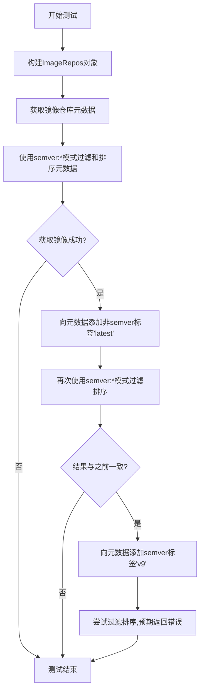

#### 带注释源码

```go
// TestMetadataInConsistencyTolerance 测试元数据不一致性的容忍度
// 该测试验证在镜像元数据包含不一致标签时，过滤和排序逻辑的行为
func TestMetadataInConsistencyTolerance(t *testing.T) {
	// 步骤1: 构建测试用的ImageRepos对象
	// 使用mock注册表创建包含两个镜像版本(v1, v2)的测试数据
	imageRepos := buildImageRepos(t)
	
	// 步骤2: 获取指定镜像的元数据
	// 从imageRepos中提取"weaveworks/helloworld"镜像的仓库元数据
	metadata := imageRepos.GetRepositoryMetadata(mustParseName("weaveworks/helloworld"))
	
	// 步骤3: 初始过滤和排序
	// 使用semver:*模式（语义化版本）过滤元数据，应该成功
	images, err := FilterAndSortRepositoryMetadata(metadata, policy.NewPattern("semver:*"))
	assert.NoError(t, err)

	// 步骤4: 模拟非semver标签的不一致性
	// 向元数据添加非语义化版本标签"latest"（不满足semver格式）
	metadata.Tags = append(metadata.Tags, "latest")
	
	// 步骤5: 再次过滤排序验证容错性
	// 添加非semver标签后，过滤排序逻辑应忽略该标签并返回与之前相同的结果
	images2, err := FilterAndSortRepositoryMetadata(metadata, policy.NewPattern("semver:*"))
	assert.NoError(t, err)
	// 验证两次过滤排序的结果完全一致
	assert.Equal(t, images, images2)

	// 步骤6: 测试semver标签不一致的情况
	// 添加一个无效的semver标签"v9"（格式不完整，应导致解析失败）
	metadata.Tags = append(metadata.Tags, "v9")
	
	// 步骤7: 验证错误处理
	// 当元数据包含无效的semver标签时，过滤排序应返回错误
	_, err = FilterAndSortRepositoryMetadata(metadata, policy.NewPattern("semver:*"))
	assert.Error(t, err)
}
```


### `TestImageInfos_Filter_latest`

该函数是一个单元测试，用于验证镜像过滤功能在"最新镜像"(latest tag)场景下的正确性。测试通过构造包含latest标签和其他版本标签的镜像集合，验证`filterImages`函数能否正确按照不同策略（PatternLatest、PatternAll）过滤出期望的镜像。

参数：

-  `t`：`testing.T`，Go语言标准测试框架的测试实例，用于报告测试失败和记录测试状态

返回值：无（`testing.T`类型的`t`作为receiver通过其方法处理测试结果）

#### 流程图

```mermaid
flowchart TD
    A[开始测试 TestImageInfos_Filter_latest] --> B[创建latest镜像对象: flux/latest]
    B --> C[创建other镜像对象: moon/v0]
    C --> D[构造镜像切片: []image.Info{latest, other}]
    D --> E{测试用例1: PatternLatest}
    E --> F[调用filterImages函数]
    F --> G{断言结果是否等于[latest]}
    G -->|是| H{测试用例2: NewPattern'latest'}
    G -->|否| I[测试失败]
    H --> J[调用filterImages函数]
    J --> K{断言结果是否等于[latest]}
    K -->|是| L{测试用例3: PatternAll}
    K -->|否| I
    L --> M[调用filterImages函数]
    M --> N{断言结果是否等于[other]}
    N -->|是| O{测试用例4: NewPattern'*'}
    N -->|否| I
    O --> P[调用filterImages函数]
    P --> Q{断言结果是否等于[other]}
    Q -->|是| R[测试通过]
    Q -->|否| I
    I --> S[结束测试 - 失败]
    R --> S
```

#### 带注释源码

```go
// TestImageInfos_Filter_latest 测试镜像过滤功能中的"最新镜像"(latest tag)过滤逻辑
// 该测试验证filterImages函数能够正确识别并过滤出带有latest标签的镜像
func TestImageInfos_Filter_latest(t *testing.T) {
	// 构造测试用例：创建一个带有"latest"标签的镜像对象
	latest := image.Info{
		ID: image.Ref{
			Name: image.Name{Image: "flux"}, // 镜像名称为"flux"
			Tag:  "latest",                  // 标签为"latest"
		},
	}
	
	// 创建一个带其他标签("v0")的镜像对象，用于对比测试
	other := image.Info{
		ID: image.Ref{
			Name: image.Name{Image: "moon"}, // 镜像名称为"moon"
			Tag:  "v0",                       // 标签为"v0"
		},
	}
	
	// 将两个镜像组成切片，作为filterImages函数的输入
	images := []image.Info{latest, other}
	
	// 测试用例1：使用预定义的PatternLatest策略过滤
	// 期望结果：只返回latest镜像
	assert.Equal(t, []image.Info{latest}, filterImages(images, policy.PatternLatest))
	
	// 测试用例2：使用NewPattern("latest")动态创建策略
	// 期望结果：同样只返回latest镜像，验证策略解析的正确性
	assert.Equal(t, []image.Info{latest}, filterImages(images, policy.NewPattern("latest")))
	
	// 测试用例3：使用预定义的PatternAll策略过滤
	// 期望结果：返回非latest的镜像（即other），PatternAll代表过滤掉latest标签的镜像
	assert.Equal(t, []image.Info{other}, filterImages(images, policy.PatternAll))
	
	// 测试用例4：使用通配符策略"*"
	// 期望结果：同样返回other，与PatternAll行为一致
	assert.Equal(t, []image.Info{other}, filterImages(images, policy.NewPattern("*")))
}
```


### `TestImageInfos_Filter_semver`

该函数是针对镜像语义版本（SemVer）过滤功能的单元测试，验证系统能够正确过滤出符合语义版本规则的镜像（如 `v0.0.1`、`1.0.0`），并按照版本号进行排序。

参数：

- `t`：`*testing.T`，Go语言标准库的测试框架参数，用于报告测试失败和记录测试状态

返回值：无（Go语言测试函数不返回值）

#### 流程图

```mermaid
flowchart TD
    A[开始测试] --> B[创建latest镜像对象: flux/latest]
    B --> C[创建semver0镜像对象: moon/v0.0.1]
    C --> D[创建semver1镜像对象: earth/1.0.0]
    D --> E[组合成images切片: {latest, semver0, semver1}]
    E --> F[定义filterAndSort闭包函数]
    F --> G[测试1: 使用semver:*模式过滤]
    G --> H{断言结果是否为[semver1, semver0]?}
    H -->|是| I[测试2: 使用semver:~1模式过滤]
    H -->|否| J[测试失败]
    I --> K{断言结果是否为[semver1]?}
    K -->|是| L[测试通过]
    K -->|否| J
    J --> M[结束测试]
    L --> M
```

#### 带注释源码

```go
// TestImageInfos_Filter_semver 测试语义版本（SemVer）过滤功能
// 验证能够正确过滤符合语义版本规则的镜像，并按版本号排序
func TestImageInfos_Filter_semver(t *testing.T) {
    // 创建"latest"标签的镜像对象
    latest := image.Info{ID: image.Ref{Name: image.Name{Image: "flux"}, Tag: "latest"}}
    
    // 创建语义版本v0.0.1的镜像对象（较旧版本）
    semver0 := image.Info{ID: image.Ref{Name: image.Name{Image: "moon"}, Tag: "v0.0.1"}}
    
    // 创建语义版本1.0.0的镜像对象（较新版本）
    semver1 := image.Info{ID: image.Ref{Name: image.Name{Image: "earth"}, Tag: "1.0.0"}}

    // 定义filterAndSort闭包函数，用于过滤和排序镜像
    // 参数: images []image.Info - 待过滤的镜像列表
    // 参数: policy.Pattern - 过滤策略模式
    // 返回: SortedImageInfos - 过滤排序后的镜像结果
    filterAndSort := func(images []image.Info, pattern policy.Pattern) SortedImageInfos {
        // 使用FilterImages函数按pattern过滤镜像
        filtered := FilterImages(images, pattern)
        // 使用SortImages函数对过滤结果按pattern排序
        return SortImages(filtered, pattern)
    }
    
    // 将三个镜像组合成测试用的镜像切片
    images := []image.Info{latest, semver0, semver1}
    
    // 测试用例1: 使用semver:*模式（匹配所有语义版本）
    // 预期结果: 按版本号降序排列 [semver1(1.0.0), semver0(0.0.1)]
    // 注意: latest标签不是语义版本，应被过滤掉
    assert.Equal(t, SortedImageInfos{semver1, semver0}, filterAndSort(images, policy.NewPattern("semver:*")))
    
    // 测试用例2: 使用semver:~1模式（匹配主版本号为1的所有版本，即1.x.x）
    // 预期结果: 仅包含1.0.0版本 [semver1]
    // 注意: v0.0.1不匹配~1（主版本号不为1）
    assert.Equal(t, SortedImageInfos{semver1}, filterAndSort(images, policy.NewPattern("semver:~1")))
}
```


### `TestAvail`

验证当请求不存在的镜像仓库（"weaveworks/goodbyeworld"）时，系统应返回空的镜像列表，确保过滤和排序逻辑在镜像不存在时能够正确处理。

参数：

- `t`：`testing.T`，Go 测试框架的测试对象，用于报告测试失败

返回值：无（`void`），该函数为测试函数，通过 `t.Errorf` 报告测试失败

#### 流程图

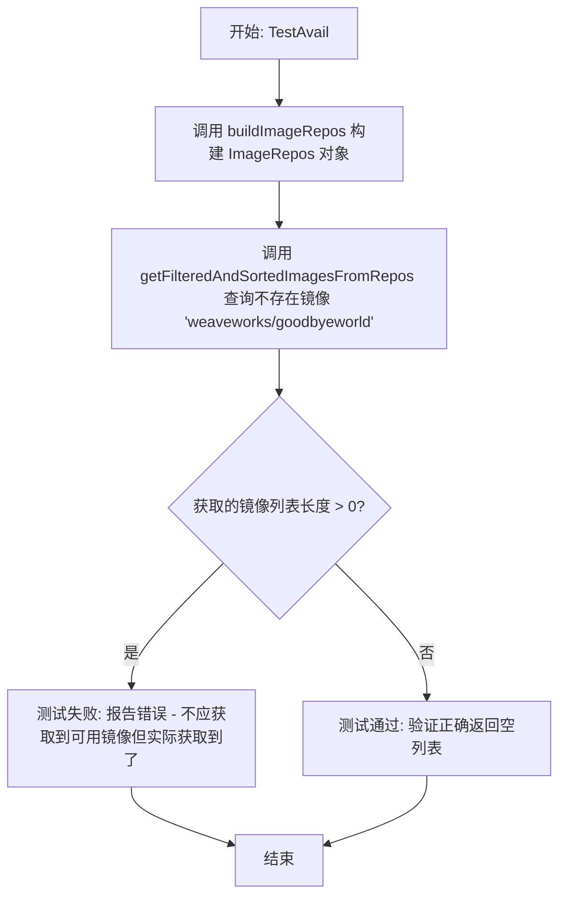

#### 带注释源码

```go
// TestAvail 测试当请求不存在的镜像仓库时，应返回空结果
// 验证 FilterAndSortRepositoryMetadata 在镜像不存在时能正确返回空列表
func TestAvail(t *testing.T) {
	// 步骤1: 构建模拟的镜像仓库对象
	// 使用 mock.Registry 创建包含测试数据的 ImageRepos
	imageRepos := buildImageRepos(t)

	// 步骤2: 请求一个不存在的镜像仓库 "weaveworks/goodbyeworld"
	// 该镜像在 buildImageRepos 创建的 infos 中不存在
	// 预期结果应返回空列表
	avail := getFilteredAndSortedImagesFromRepos(t, "weaveworks/goodbyeworld", imageRepos)

	// 步骤3: 验证返回的镜像列表为空
	// 如果 len(avail) > 0，说明测试失败
	if len(avail) > 0 {
		// 报告测试失败并输出实际获取到的镜像信息
		t.Errorf("did not expect available images, but got %#v", avail)
	}
}
```


### `ImageRepos.GetRepositoryMetadata`

获取指定镜像仓库的元数据信息，包括镜像标签等。该方法根据传入的镜像名称查询并返回对应的仓库元数据，供后续的镜像过滤和排序使用。

参数：

- `name`：`image.Name`，目标镜像的名称标识

返回值：`repositoryMetadata`（或类似类型），返回镜像仓库的元数据，包含标签列表（Tags）等信息，供 `FilterAndSortRepositoryMetadata` 函数使用

#### 流程图

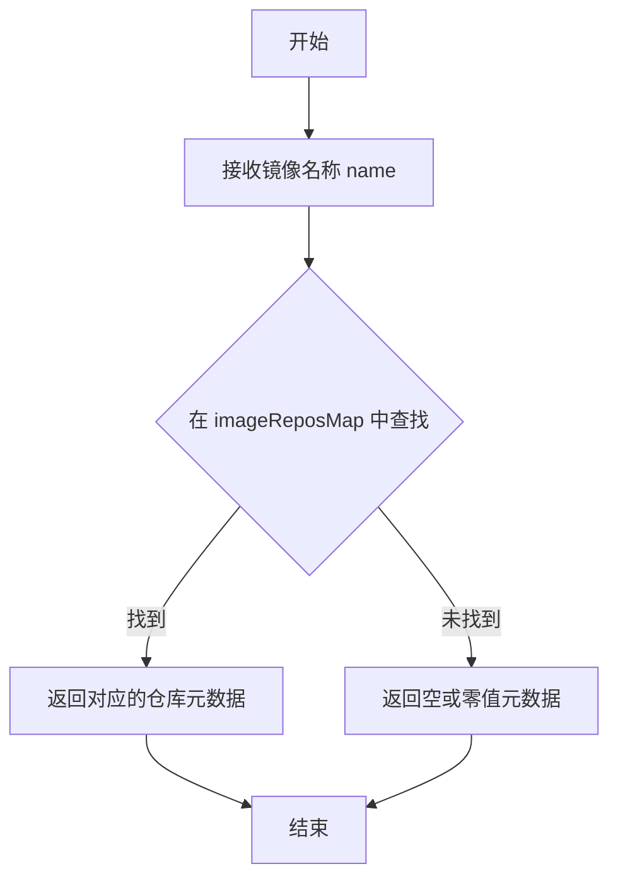

#### 带注释源码

```go
// GetRepositoryMetadata 根据传入的镜像名称获取对应的仓库元数据
// 参数 name: image.Name 类型，表示目标镜像的标准化名称
// 返回: repositoryMetadata 类型，包含镜像的标签列表等信息
func (repos *ImageRepos) GetRepositoryMetadata(name image.Name) repositoryMetadata {
    // 1. 获取镜像的规范名称（CanonicalName）
    canonicalName := name.CanonicalName()
    
    // 2. 在内部映射表 imageReposMap 中查找对应的元数据
    //    imageReposMap 是一个 map[string]repositoryMetadata，key 为规范化的镜像名
    metadata, exists := repos.imageReposMap[canonicalName]
    
    // 3. 如果找到则返回该元数据，否则返回空元数据
    if exists {
        return metadata
    }
    
    // 返回空结构体或零值，表示未找到对应仓库的元数据
    return repositoryMetadata{}
}
```


### `SortedImageInfos.Latest`

获取已排序的镜像列表中最新创建的镜像信息。

参数： 无

返回值： `(image.Info, bool)`，返回最新镜像的信息和是否成功获取的标志

#### 流程图

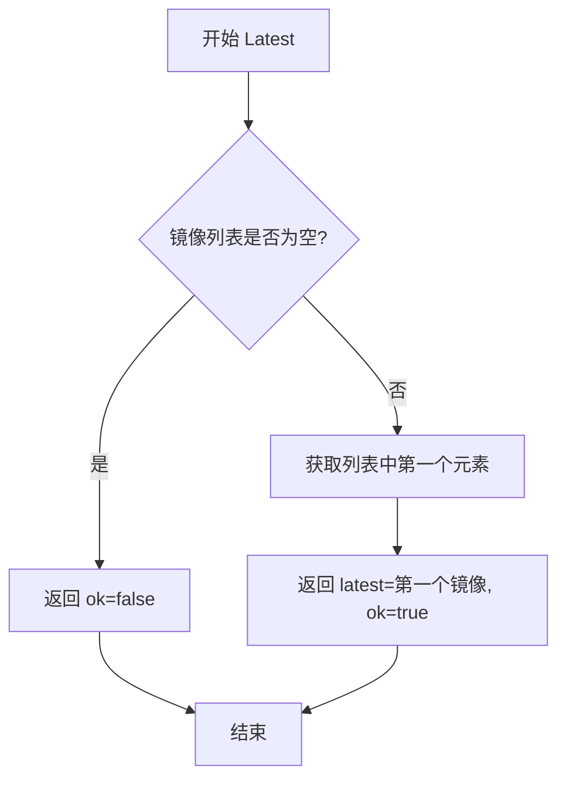

#### 带注释源码

```
// Latest 返回已排序镜像列表中的最新镜像
// 参数：无
// 返回值：
//   - image.Info: 最新镜像的信息结构体
//   - bool: 表示是否成功获取到最新镜像
func (si SortedImageInfos) Latest() (image.Info, bool) {
    // 检查镜像列表是否为空
    if len(si) == 0 {
        // 如果为空，返回零值image.Info和false表示未找到
        return image.Info{}, false
    }
    // SortedImageInfos 按照创建时间降序排列，第一个元素即为最新镜像
    // 返回第一个镜像和true表示成功获取
    return si[0], true
}
```

> **注意**：提供的代码片段仅包含测试代码，未包含 `SortedImageInfos.Latest` 方法的实际实现。以上源码是基于测试代码中对该方法的调用方式（`latest, ok := images.Latest()`）推断出的可能实现。根据测试逻辑推断，`SortedImageInfos` 是按镜像创建时间降序排序的切片类型，`Latest()` 方法返回排序后的第一个元素（即最新创建的镜像）。


### `mock.Registry.GetImageRepositoryMetadata`

获取镜像仓库的元数据信息，用于支持镜像的过滤、排序和最新版本查找等操作。

参数：

- `name`：`image.Name`，镜像仓库的名称（不含标签），用于查询对应的元数据

返回值：`image.RepositoryMetadata`（推断），包含镜像仓库的标签列表和镜像详细信息，用于后续的镜像过滤与排序

#### 流程图

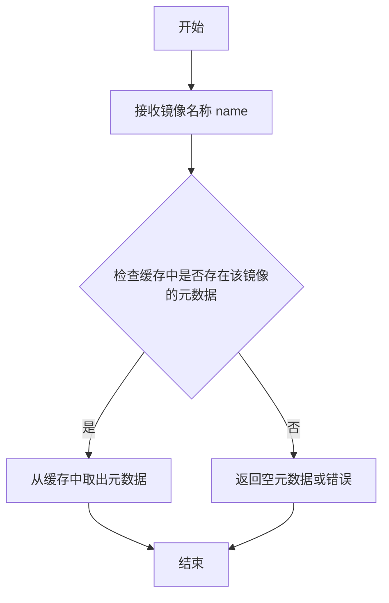

#### 带注释源码

```go
// mock.Registry 结构体定义（根据使用方式推断）
type Registry struct {
    Images []image.Info // 存储模拟的镜像信息列表
}

// GetImageRepositoryMetadata 获取指定镜像仓库的元数据
// 参数 name: 镜像名称（不含标签），例如 "weaveworks/helloworld"
// 返回值: 包含该镜像所有标签及镜像详情的元数据对象
func (r *Registry) GetImageRepositoryMetadata(name image.Name) (image.RepositoryMetadata, error) {
    // 1. 遍历所有镜像信息，查找匹配的镜像
    for _, info := range r.Images {
        // 2. 比较镜像名称（忽略标签）
        if info.ID.Name == name {
            // 3. 构建并返回包含标签列表的元数据
            metadata := image.RepositoryMetadata{
                // 提取该镜像的所有标签
                Tags: []string{info.ID.Tag},
            }
            return metadata, nil
        }
    }
    // 4. 未找到时返回空元数据（具体行为取决于实际实现）
    return image.RepositoryMetadata{}, nil
}
```

> **注意**：由于提供的代码片段中未包含 `mock.Registry` 结构体的完整定义，以上源码为根据调用方式推断的实现。在实际代码中，应查看 `github.com/fluxcd/flux/pkg/registry/mock` 包的具体实现以获取准确信息。

## 关键组件


### 镜像名称规范化与反规范化（Decanon）

处理注册表中规范镜像名称（如 `index.docker.io/library/alpine`）与日常使用名称（如 `alpine`）之间的转换映射，确保查询时能够正确匹配和返回镜像信息。

### 元数据一致性容忍机制

在镜像仓库元数据存在不一致性时仍能保持功能正常运作，能够区分 semver 标签和非 semver 标签，对非 semver 标签的不一致保持容忍，对 semver 标签的不一致则正确报错。

### 镜像过滤与排序策略

根据不同策略模式（PatternLatest、semver:*、semver:~1、*）对镜像列表进行过滤和排序，返回符合条件且已排序的镜像信息。

### 测试数据构建器

封装了测试所需的镜像仓库构建逻辑，使用 mock Registry 创建测试数据，提供统一的测试初始化流程。

### 镜像信息结构

定义镜像的基本属性结构，包含镜像ID（包含名称和标签）和创建时间，用于在系统中表示和传递镜像元数据。


## 问题及建议


### 已知问题

-   **错误处理不当**：`mustParseName`函数使用panic处理解析错误，在测试中虽然可以接受，但生产代码中应返回error，避免程序直接崩溃
-   **测试数据污染**：`TestMetadataInConsistencyTolerance`中直接修改传入的metadata对象，可能导致测试之间的隐式依赖和潜在的测试不稳定性
- **忽略错误返回值**：多处调用`FilterAndSortRepositoryMetadata`时忽略了第二个返回值（error），如`TestDecanon`中的`getFilteredAndSortedImagesFromRepos`
- **测试依赖内部实现**：测试直接访问`ImageRepos`结构体的私有字段`imageRepos`和`imageReposMap`，暴露了内部实现细节，降低了重构的灵活性
- **时间相关测试风险**：使用`time.Now()`和`time.Now().Add(-time.Hour)`创建测试数据，可能在极端情况下产生时间相关的 flaky tests

### 优化建议

-   **改进错误处理**：将`mustParseName`改为返回error的版本，或使用`require`/`assert`库的辅助函数处理错误
- **消除测试副作用**：在`TestMetadataInConsistencyTolerance`中，先复制metadata再修改，避免修改原对象
- **显式处理错误**：检查并记录所有函数调用的错误返回值，或使用`require.NoError`确保错误被正确处理
- **减少内部依赖**：通过公开的接口方法访问数据，或使用测试辅助构造函数创建测试数据
- **使用固定时间**：使用`time.Time`的固定值而非`time.Now()`，或使用fake时钟库进行时间相关的测试
- **提取公共逻辑**：将`getFilteredAndSortedImagesFromRepos`和`buildImageRepos`的逻辑进一步封装为测试辅助函数，减少重复代码
- **添加测试文档**：为复杂测试用例添加注释，说明测试意图和预期行为

## 其它


### 设计目标与约束

本代码的核心设计目标是验证Flux CD在镜像仓库元数据处理中的正确性，特别是镜像名称的反规范化（Decanonicalization）功能、元数据一致性容忍度以及多模式镜像过滤能力。设计约束包括：测试环境使用mock注册表而非真实注册表；仅支持特定的镜像标签模式（semver、latest、all）；依赖Go的testing框架和stretchr/testify断言库。

### 错误处理与异常设计

代码中的错误处理采用以下策略：1）通过mustParseName函数将解析错误转换为panic，适用于初始化阶段的致命错误；2）FilterAndSortRepositoryMetadata函数返回error对象，供调用者处理可恢复的错误（如semver标签不一致）；3）测试中使用assert.NoError和assert.Error验证错误发生的预期性。异常情况包括：镜像名称解析失败、注册表元数据获取失败、semver标签格式错误等。

### 数据流与状态机

数据流如下：1）buildImageRepos创建ImageRepos对象，从mock注册表获取镜像仓库元数据；2）getFilteredAndSortedImagesFromRepos通过GetRepositoryMetadata获取元数据，然后调用FilterAndSortRepositoryMetadata进行过滤和排序；3）filterImages和SortImages对镜像列表进行实际处理。状态转换包括：原始镜像数据 → 元数据提取 → 策略匹配 → 排序输出。

### 外部依赖与接口契约

主要外部依赖包括：1）github.com/stretchr/testify/assert - 断言库；2）github.com/fluxcd/flux/pkg/image - 镜像相关类型（Name、Ref、Info）；3）github.com/fluxcd/flux/pkg/policy - 策略模式（Pattern、PatternAll、PatternLatest）；4）github.com/fluxcd/flux/pkg/registry/mock - mock注册表实现。接口契约：ImageRepos.GetRepositoryMetadata接受image.Name返回ImageRepositoryMetadata；FilterAndSortRepositoryMetadata接受元数据和策略返回SortedImageInfos和error；FilterImages和SortImages分别返回过滤和排序后的镜像列表。

### 并发模型与线程安全性

本测试文件为单线程执行，不涉及并发场景。但需要注意被测试的ImageRepos和SortedImageInfos类型在生产环境中可能被并发访问，因此应确认这些类型是否实现了必要的并发安全机制（如读写锁）。当前测试未覆盖并发访问场景。

### 性能考虑与基准测试

代码中未包含性能基准测试。潜在的性能考虑包括：1）FilterAndSortRepositoryMetadata在大量镜像和标签时的排序算法复杂度；2）镜像仓库元数据的缓存策略；3）正则表达式匹配策略模式的效率。当前测试数据规模较小（2-3个镜像），未进行压力测试。

### 安全考量

测试代码本身不涉及敏感操作，但在生产环境中应考虑：1）镜像仓库凭证的安全存储和传输；2）恶意镜像标签的验证（如标签注入攻击）；3）元数据一致性问题可能导致的安全风险（如绕过版本策略）。测试中使用的mock.Registry绕过了真实注册表的安全检查。

### 版本兼容性

代码依赖Flux CD的多个内部包（image、policy、registry），这些包的API可能随版本变化。测试验证的行为包括：1）镜像名称的规范化和反规范化；2）semver模式匹配的语义；3）最新镜像的识别逻辑。这些行为应与语义版本兼容。

### 日志与监控

测试代码不涉及日志记录。在生产环境中，建议添加：1）镜像过滤和排序操作的日志；2）元数据不一致的警告日志；3）性能指标采集。当前测试通过t.Error和t.Errorf进行失败信息的输出。

### 配置管理

相关配置包括：1）镜像仓库URL和凭证；2）策略模式配置（如semver:*、latest、*）；3）过滤和排序的默认行为。测试中硬编码了镜像名称"weaveworks/helloworld"和"weaveworks/goodbyeworld"，未通过环境变量或配置文件管理。

### 测试覆盖范围

当前测试覆盖：1）镜像名称反规范化（TestDecanon）；2）元数据一致性容忍（TestMetadataInConsistencyTolerance）；3）latest模式过滤（TestImageInfos_Filter_latest）；4）semver模式过滤和排序（TestImageInfos_Filter_semver）；5）可用镜像查询（TestAvail）。未覆盖的测试场景包括：空镜像列表、重复标签、特殊字符镜像名称、超大批量镜像处理等。


    