# `flux\pkg\update\menu.go` 详细设计文档

这是一个终端交互式菜单更新工具，提供了一个基于文本的用户界面，用于在终端中选择和管理容器镜像更新，支持交互式光标导航、复选框选择和实时预览功能。

## 整体流程

```mermaid
graph TD
    A[开始] --> B[NewMenu 创建菜单]
B --> C{调用方式}
C --> D[Print 非交互式打印]
C --> E[Run 交互式运行]
E --> F[隐藏光标]
F --> G[进入事件循环]
G --> H{获取用户输入}
H --> I[Space: 切换选中状态]
H --> J[Enter: 确认选择并退出]
H --> K[j/Tab: 向下移动]
H --> L[k: 向上移动]
H --> M[q/Esc/Ctrl+C: 终止]
I --> N[printInteractive 刷新显示]
J --> O[收集选中的更新项]
O --> P[返回 map[resource.ID][]ContainerUpdate]
N --> G
K --> N
L --> N
M --> P
```

## 类结构

```
writer (终端输出包装器)
├── out: io.Writer
├── tw: *tabwriter.Writer
├── lines: int
└── width: uint16

menuItem (菜单项数据结构)
├── id: resource.ID
├── status: WorkloadUpdateStatus
├── error: string
├── update: ContainerUpdate
└── checked: bool

Menu (交互式菜单主类)
├── wr: *writer
├── items: []menuItem
├── selectable: int
└── cursor: int
```

## 全局变量及字段


### `moveCursorUp`
    
向上移动光标的转义序列

类型：`string`
    


### `hideCursor`
    
隐藏光标的转义序列

类型：`string`
    


### `showCursor`
    
显示光标的转义序列

类型：`string`
    


### `glyphSelected`
    
已选中标记 (⇒)

类型：`string`
    


### `glyphChecked`
    
已勾选标记 (◉)

类型：`string`
    


### `glyphUnchecked`
    
未勾选标记 (◫)

类型：`string`
    


### `tableHeading`
    
表头 'WORKLOAD \tSTATUS \tUPDATES'

类型：`string`
    


### `writer.writer.out`
    
终端输出流

类型：`io.Writer`
    


### `writer.writer.tw`
    
表格写入器

类型：`*tabwriter.Writer`
    


### `writer.writer.lines`
    
自上次清除后的行数

类型：`int`
    


### `writer.writer.width`
    
终端宽度

类型：`uint16`
    


### `menuItem.menuItem.id`
    
资源标识符

类型：`resource.ID`
    


### `menuItem.menuItem.status`
    
工作负载更新状态

类型：`WorkloadUpdateStatus`
    


### `menuItem.menuItem.error`
    
错误信息

类型：`string`
    


### `menuItem.menuItem.update`
    
容器更新信息

类型：`ContainerUpdate`
    


### `menuItem.menuItem.checked`
    
是否被选中

类型：`bool`
    


### `Menu.Menu.wr`
    
终端写入器

类型：`*writer`
    


### `Menu.Menu.items`
    
菜单项列表

类型：`[]menuItem`
    


### `Menu.Menu.selectable`
    
可选中的项目数量

类型：`int`
    


### `Menu.Menu.cursor`
    
当前光标位置

类型：`int`
    
    

## 全局函数及方法


### `newWriter`

`newWriter` 是 `update` 包中的一个内部构造函数，用于创建一个带有表格写入器和终端宽度信息的 writer 实例，以便后续交互式菜单的输出和清屏操作。

参数：

- `out`：`io.Writer`，用于输出菜单内容的写入目标

返回值：`*writer`，返回一个指向 writer 结构体的指针，包含输出流、表格写入器、行数和终端宽度等信息

#### 流程图

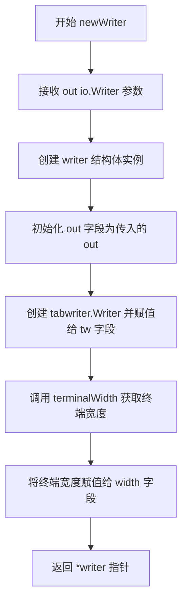
```mermaid
flowchart TD
    A[开始 newWriter] --> B[接收 out io.Writer 参数]
    B --> C[创建 writer 结构体实例]
    C --> D[初始化 out 字段为传入的 out]
    D --> E[创建 tabwriter.Writer 并赋值给 tw 字段]
    E --> F[调用 terminalWidth 获取终端宽度]
    F --> G[将终端宽度赋值给 width 字段]
    G --> H[返回 *writer 指针]
```

#### 带注释源码

```go
// newWriter 是一个内部构造函数，用于创建 writer 实例
// 参数 out: io.Writer 类型，用于指定菜单输出的目标位置
// 返回值: *writer 类型，返回一个指向 writer 结构体的指针
func newWriter(out io.Writer) *writer {
	return &writer{
		out:   out,                      // 将传入的 io.Writer 赋值给 out 字段
		tw:    tabwriter.NewWriter(      // 创建新的 tabwriter.Writer
			out,                         // 输出目标为传入的 out
			0,                           // 最小单元格宽度为 0
			2,                           // 单元格填充宽度为 2
			2,                            // 栏间距为 2
			' ',                         // 填充字符为空格
			0,                           // 不丢弃空白
		),
		width: terminalWidth(),          // 获取当前终端宽度并赋值给 width 字段
	}
}
```

#### 关联类型信息

**writer 结构体**（定义于同文件）：

| 字段名称 | 类型 | 描述 |
|---------|------|------|
| `out` | `io.Writer` | 输出目标流 |
| `tw` | `*tabwriter.Writer` | 表格写入器，用于格式化表格输出 |
| `lines` | `int` | 自上次清屏以来写入的行数 |
| `width` | `uint16` | 终端宽度，用于计算换行 |


### `getChar`

获取终端字符输入，返回用户按键的 ASCII 码或特殊键码，并处理可能的输入错误。

参数：

- （无参数）

返回值：

- `ascii`：`int`，返回普通键的 ASCII 码（如空格键为 32，Enter 键为 13，'q' 为 113 等）
- `keyCode`：`int`，返回特殊键的键码（如方向键上下分别为 40 和 38）
- `err`：`error`，读取输入时发生的错误

#### 流程图

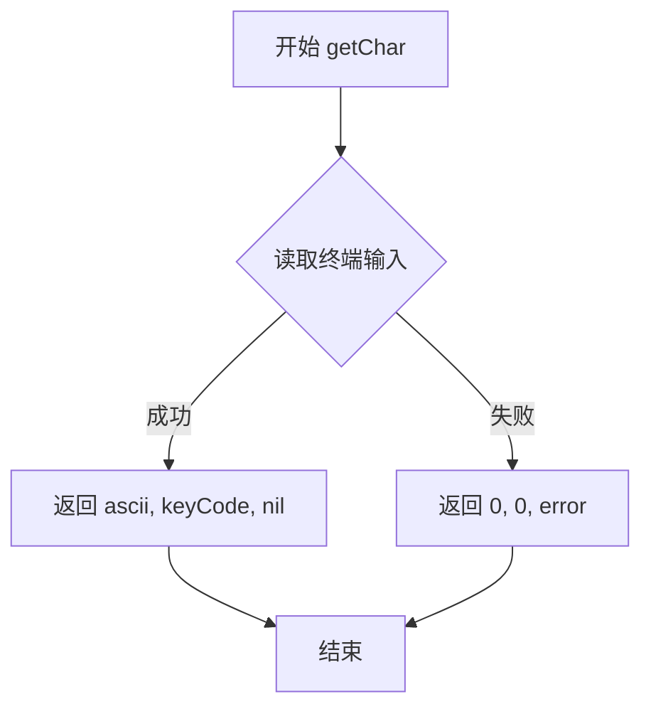
```mermaid
flowchart TD
    A[开始 getChar] --> B{读取终端输入}
    B -->|成功| C[返回 ascii, keyCode, nil]
    B -->|失败| D[返回 0, 0, error]
    C --> E[结束]
    D --> E
```

#### 带注释源码

```go
// getChar 是一个外部依赖函数，用于从终端读取单个字符
// 它返回三个值：
//   - ascii: 普通键的 ASCII 码
//   - keyCode: 特殊键（如方向键）的键码
//   - err: 读取过程中的错误
//
// 使用示例（来自 Menu.Run 方法）：
//   ascii, keyCode, err := getChar()
//   if err != nil {
//       return specs, err
//   }
//
//   switch ascii {
//   case 3, 27, 'q':  // Ctrl+C, ESC, q - 退出
//       return specs, errors.New("Aborted.")
//   case ' ':          // 空格键 - 切换选择
//       m.toggleSelected()
//   case 13:           // Enter 键 - 确认选择
//       // 处理确认逻辑...
//   case 9, 'j':       // Tab 或 j 键 - 光标下移
//       m.cursorDown()
//   case 'k':          // k 键 - 光标上移
//       m.cursorUp()
//   default:
//       switch keyCode {
//       case 40:       // 方向键下
//           m.cursorDown()
//       case 38:       // 方向键上
//           m.cursorUp()
//       }
//   }
//
// 注意：该函数未在此代码文件中定义，是来自外部包的依赖
func getChar() (int, int, error) {
    // 实现细节取决于外部包的具体实现
    // 根据使用方式推断，它应该实现终端原始模式下的字符读取
}
```


### `newWriter`

创建一个新的 `writer` 实例，用于格式化并输出菜单和进度信息。该函数初始化一个带有 tabwriter 的 writer 对象，并获取终端宽度以支持正确的行计数。

参数：

- `out`：`io.Writer`，输出目标，用于写入格式化后的内容

返回值：`*writer`，新创建的 writer 实例指针

#### 流程图

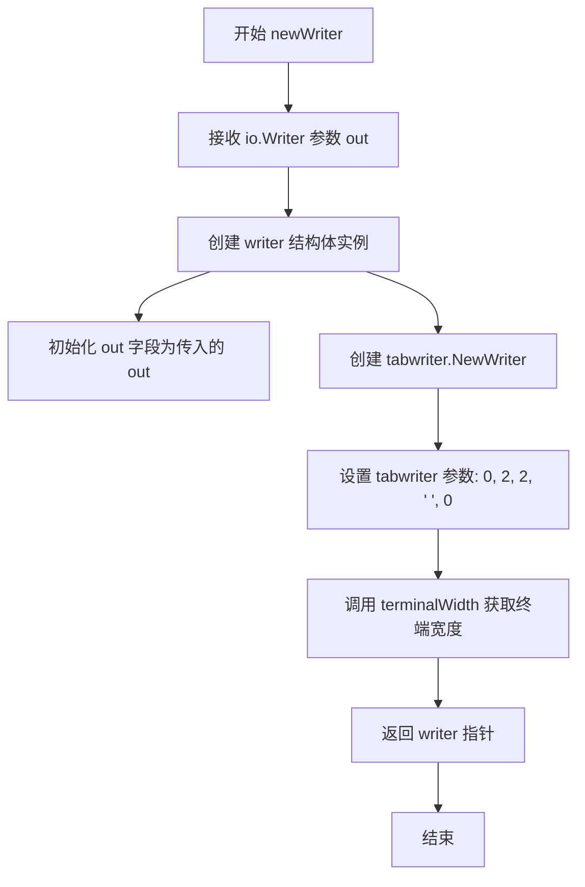
```mermaid
flowchart TD
    A[开始 newWriter] --> B[接收 io.Writer 参数 out]
    B --> C[创建 writer 结构体实例]
    C --> D[初始化 out 字段为传入的 out]
    C --> E[创建 tabwriter.NewWriter]
    E --> F[设置 tabwriter 参数: 0, 2, 2, ' ', 0]
    F --> G[调用 terminalWidth 获取终端宽度]
    G --> H[返回 writer 指针]
    H --> I[结束]
```

#### 带注释源码

```go
// newWriter 创建一个新的 writer 实例，用于格式化菜单和进度输出
// 参数 out: io.Writer 类型，表示输出目标
// 返回值: *writer 类型，返回新创建的 writer 实例指针
func newWriter(out io.Writer) *writer {
	return &writer{
		out:   out,                          // 将传入的 io.Writer 赋值给 out 字段
		tw:    tabwriter.NewWriter(out, 0, 2, 2, ' ', 0), // 创建 tabwriter，参数分别为：输出目标、最小单元格宽度为0、tab宽度为2、填充符为空格、忽略 ANSI 转义序列
		width: terminalWidth(),             // 调用 terminalWidth 函数获取当前终端宽度，用于计算行数
	}
}
```


### `writer.hideCursor`

该方法通过向终端输出 ANSI 转义序列 `\033[?25l` 来隐藏光标，常用于交互式菜单模式下提供更好的用户交互体验。

参数：无

返回值：无（`void`），该方法仅执行副作用（写入输出流）

#### 流程图

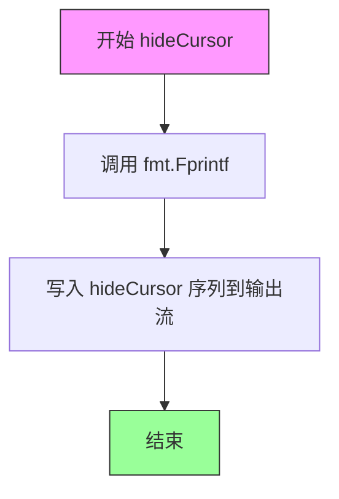
```mermaid
graph TD
    A[开始 hideCursor] --> B[调用 fmt.Fprintf]
    B --> C[写入 hideCursor 序列到输出流]
    C --> D[结束]
    
    style A fill:#f9f,stroke:#333
    style D fill:#9f9,stroke:#333
```

#### 带注释源码

```go
// hideCursor 向终端输出 ANSI 转义序列以隐藏光标
// 使用场景：在交互式菜单运行时隐藏光标，避免光标干扰用户视线
// 实现的原理：\033[?25l 是 VT100 转义序列，其中：
//   - \033 是 ESC 字符的八进制表示
//   - [?25l 表示设置 SGR 参数 25 (光标可见性) 为 l (隐藏)
func (c *writer) hideCursor() {
    // 使用 fmt.Fprintf 将隐藏光标的转义序列写入输出流
    // c.out 是 io.Writer 接口类型，负责实际的输出目标（通常是标准输出）
    // hideCursor 是预定义的常量 "\033[?25l"
    fmt.Fprintf(c.out, hideCursor)
}
```


### `writer.showCursor`

该方法用于在终端交互式菜单中显示光标，通过向终端输出 ANSI 转义序列 `\033[?25h` 来恢复光标的可见性，通常在用户退出交互模式后被 defer 调用以确保光标恢复正常显示状态。

参数：该方法无显式参数（接收者 `c *writer` 为隐式参数）

返回值：`void`，无返回值（Go 语言中无返回声明的方法默认不返回任何值）

#### 流程图


```mermaid
flowchart TD
    A[开始 showCursor] --> B{检查输出流 c.out}
    B -->|有效| C[调用 fmt.Fprintf]
    B -->|无效| D[忽略操作]
    C --> E[写入 ANSI 转义序列 showCursor &#91;?25h&#93;]
    E --> F[结束]
    D --> F
```

#### 带注释源码

```go
// showCursor 向终端输出 ANSI 转义序列以显示光标
// 该方法对应 ANSI 转义序列 "\033[?25h"，用于恢复终端光标的可见性
// 通常在交互式菜单 Run() 方法的 defer 语句中被调用，
// 确保即使程序异常退出，光标也能恢复正常显示状态
func (c *writer) showCursor() {
	// 使用 fmt.Fprintf 将转义序列写入到 writer 的输出流中
	// showCursor 常量定义为 "\033[?25h"（CSI ? 25 h 表示显示光标）
	// 对应的隐藏光标序列为 "\033[?25l"（showCursor 的反向操作）
	fmt.Fprintf(c.out, showCursor)
}
```


### `writer.writeln`

写入一行文本到 tabwriter，并统计行数以支持后续的清屏和光标移动操作。

参数：

- `line`：`string`，要写入的文本行内容

返回值：`error`，写入过程中可能发生的 I/O 错误，如果成功写入则返回 nil

#### 流程图

```mermaid
flowchart TD
    A[开始 writeln] --> B[给 line 追加换行符 \n]
    B --> C[计算行数: c.lines += (len(line)-1)/int(c.width) + 1]
    C --> D[将 line 转换为字节切片]
    D --> E[调用 c.tw.Write 写入 tabwriter]
    E --> F{写入是否成功?}
    F -->|是| G[返回 nil]
    F -->|否| H[返回错误 err]
    G --> I[结束]
    H --> I
```

#### 带注释源码

```go
// writeln counts the lines we output.
// 写入一行文本到输出流，并统计输出的行数
// 行数统计考虑到了终端宽度，用于后续 clear 操作时的光标移动
func (c *writer) writeln(line string) error {
	// 给传入的字符串追加换行符，组成完整的一行
	line += "\n"

	// 计算这行占据的实际行数
	// 逻辑：如果终端宽度为 width，字符串长度为 len(line)
	// 则需要的行数为 (len(line)-1)/width + 1
	// 减去1是因为换行符不占用显示宽度
	c.lines += (len(line)-1)/int(c.width) + 1

	// 将字符串转换为字节切片，调用 tabwriter 的 Write 方法写入
	// tabwriter 会处理文本的对齐和格式化
	_, err := c.tw.Write([]byte(line))

	// 返回写入过程中可能发生的错误，如果成功则返回 nil
	return err
}
```


### `writer.clear()`

该方法用于清除终端上已输出的行，通过将光标向上移动到上次开始写入的位置，实现刷新输出的效果。

参数：无（方法接收者为隐式参数 `c *writer`）

返回值：无

#### 流程图

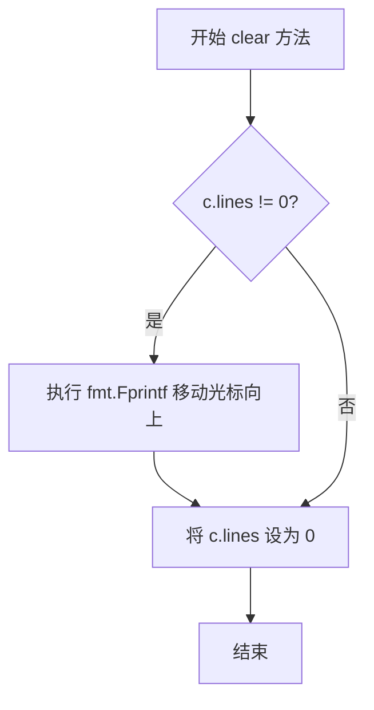
```mermaid
flowchart TD
    A[开始 clear 方法] --> B{c.lines != 0?}
    B -->|是| C[执行 fmt.Fprintf 移动光标向上]
    C --> D[将 c.lines 设为 0]
    B -->|否| D
    D --> E[结束]
```

#### 带注释源码

```go
// clear moves the terminal cursor up to the beginning of the
// line where we started writing.
func (c *writer) clear() {
    // 检查是否有需要清除的行
    if c.lines != 0 {
        // 使用 ANSI 转义序列向上移动光标
        // moveCursorUp = "\033[%dA" 表示向上移动 %d 行
        fmt.Fprintf(c.out, moveCursorUp, c.lines)
    }
    // 重置行计数器，为下一次输出做准备
    c.lines = 0
}
```


### `writer.flush`

刷新缓冲的 tabwriter，将所有已写入的格式化表格内容输出到最终的 io.Writer。

参数：
- （无参数）

返回值：`error`，如果刷新底层 tabwriter 时发生错误则返回该错误，否则返回 nil。

#### 流程图

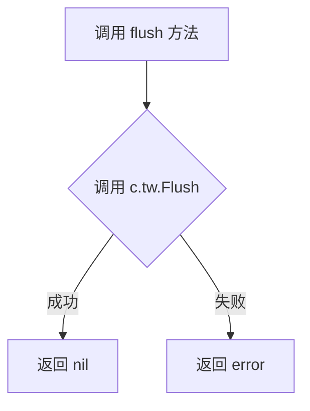
```mermaid
flowchart TD
    A[调用 flush 方法] --> B{调用 c.tw.Flush}
    B -->|成功| C[返回 nil]
    B -->|失败| D[返回 error]
```

#### 带注释源码

```go
// flush 将内部 tabwriter 缓冲区的内容刷新到绑定的 io.Writer。
// 它是针对 tabwriter.Writer 的 Flush 方法的包装器，
// 用于在完成所有行写入后输出格式化的表格内容。
func (c *writer) flush() error {
	return c.tw.Flush()
}
```


### `menuItem.checkbox`

获取菜单项的复选框显示字符，根据菜单项是否可选中以及是否被选中来返回对应的Unicode符号。

参数：
- 该方法无显式参数（接收者 `i menuItem` 为隐式参数）

返回值：`string`，返回复选框的显示字符，可能的值包括：
- 空格 `" "`（当菜单项不可选中时）
- `glyphChecked`（`\u25c9`，实心菱形，表示已选中）
- `glyphUnchecked`（`\u25ef`，空心菱形，表示未选中）

#### 流程图

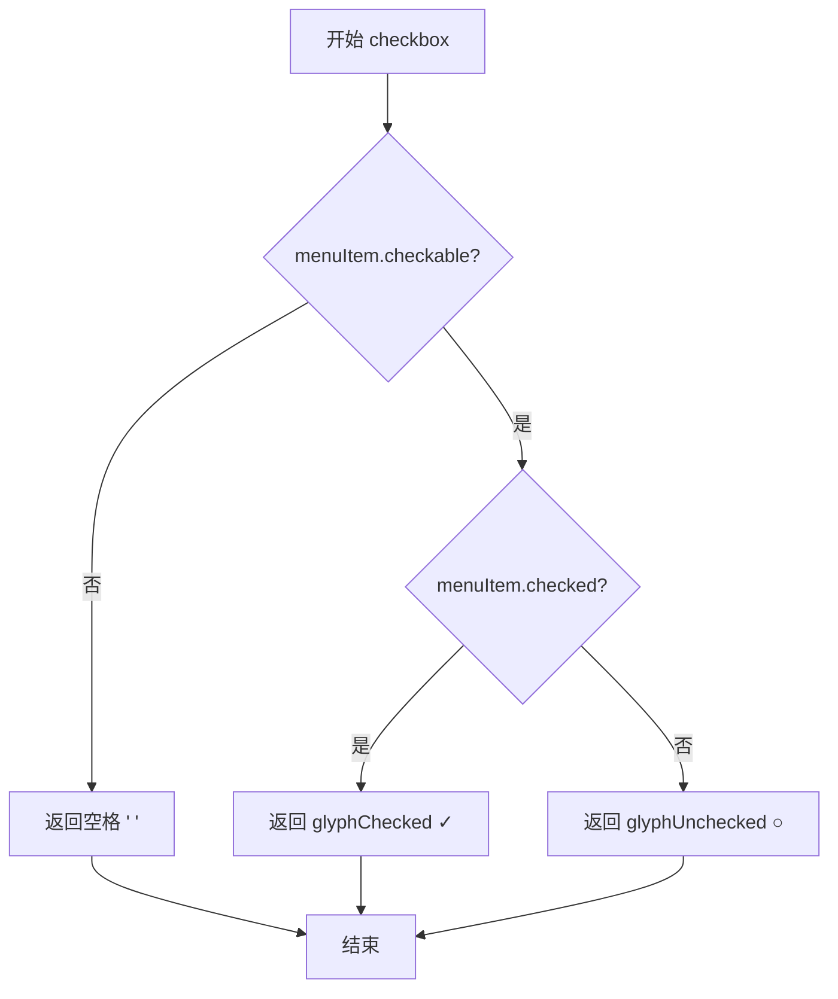
```mermaid
flowchart TD
    A[开始 checkbox] --> B{menuItem.checkable?}
    B -->|否| C[返回空格 ' ']
    B -->|是| D{menuItem.checked?}
    D -->|是| E[返回 glyphChecked ✓]
    D -->|否| F[返回 glyphUnchecked ○]
    C --> G[结束]
    E --> G
    F --> G
```

#### 带注释源码

```go
// checkbox 返回菜单项的复选框显示字符
// 根据以下逻辑返回不同的Unicode符号：
// 1. 如果菜单项不可选中（checkable返回false），返回空格
// 2. 如果菜单项已选中（checked为true），返回实心菱形符号 (●)
// 3. 如果菜单项未选中，返回空心菱形符号 (○)
func (i menuItem) checkbox() string {
	// 使用switch语句进行条件判断
	switch {
	// 情况1：菜单项不可选中时，返回空格作为占位符
	case !i.checkable():
		return " "
	// 情况2：菜单项已选中时，返回实心菱形符号 glyphChecked (●)
	case i.checked:
		return glyphChecked
	// 情况3：默认情况，菜单项未选中，返回空心菱形符号 glyphUnchecked (○)
	default:
		return glyphUnchecked
	}
}
```

#### 关联函数说明

| 函数名 | 类型 | 描述 |
|--------|------|------|
| `menuItem.checkable` | 方法 | 判断菜单项是否可选中（需要容器更新信息） |
| `glyphChecked` | 常量 | Unicode字符 `\u25c9`（●），表示已选中状态 |
| `glyphUnchecked` | 常量 | Unicode字符 `\u25ef`（○），表示未选中状态 |
| `menuItem.checked` | 字段 | 布尔类型，记录菜单项当前是否被选中 |


### `menuItem.checkable`

判断菜单项是否可选中。当菜单项关联了容器更新（即 `update.Container` 字段不为空）时返回 true，表示该菜单项可以被用户选中进行更新操作。

参数： 无（使用接收者 `i` 访问 menuItem 实例）

返回值：`bool`，返回 true 表示该菜单项可选中（即包含有效的容器更新），返回 false 表示不可选中

#### 流程图

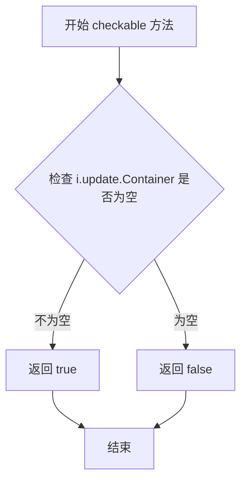
```mermaid
flowchart TD
    A[开始 checkable 方法] --> B{检查 i.update.Container 是否为空}
    B -->|不为空| C[返回 true]
    B -->|为空| D[返回 false]
    C --> E[结束]
    D --> E
```

#### 带注释源码

```go
// checkable 判断菜单项是否可选中
// 接收者: i menuItem - 菜单项实例
// 返回值: bool - 当关联了有效的容器更新时返回 true
func (i menuItem) checkable() bool {
	// 只有当 update.Container 不为空时，才表示该菜单项
	// 关联了实际的容器更新，可以被用户选中
	return i.update.Container != ""
}
```


### `menuItem.updates()`

获取更新描述字符串，用于在菜单中显示容器更新的详细信息。如果存在容器更新，则返回格式化的更新描述；否则返回错误信息。

参数：
- （无显式参数，方法接收者为 `i menuItem`）

返回值：`string`，返回更新描述字符串或错误信息字符串

#### 流程图

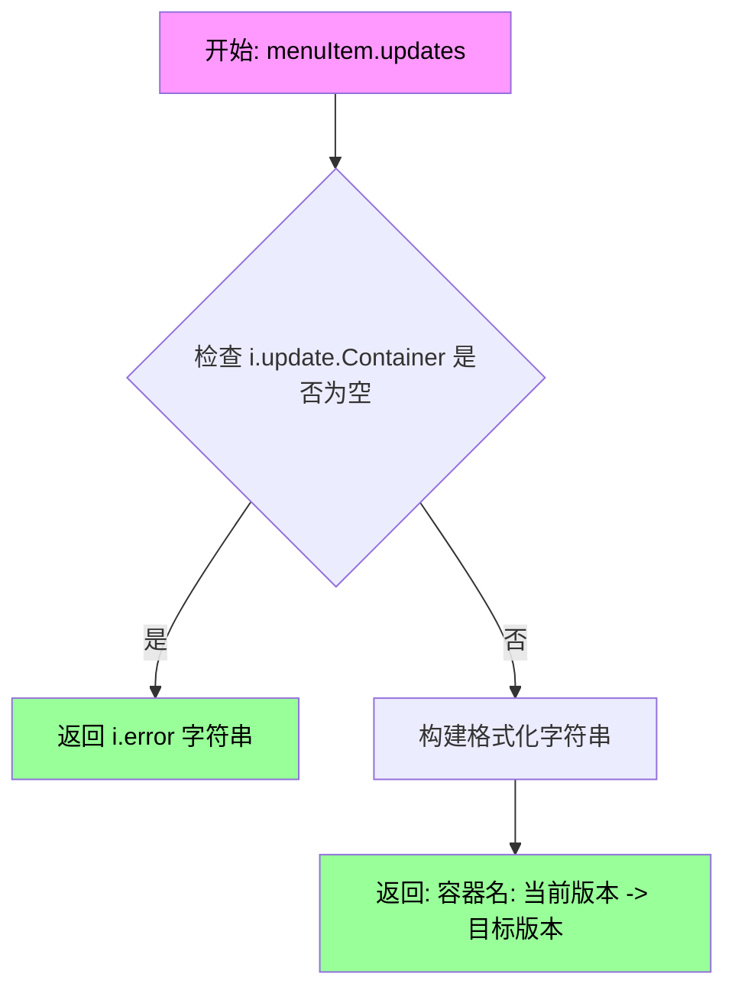
```mermaid
flowchart TD
    A[开始: menuItem.updates] --> B{检查 i.update.Container 是否为空}
    B -->|是| C[返回 i.error 字符串]
    B -->|否| D[构建格式化字符串]
    D --> E[返回: 容器名: 当前版本 -> 目标版本]
    
    style A fill:#f9f,color:#000
    style C fill:#9f9,color:#000
    style E fill:#9f9,color:#000
```

#### 带注释源码

```go
// updates 返回一个描述菜单项更新的字符串
// 如果 menuItem 包含容器更新信息，返回格式化的更新描述
// 格式为: "容器名: 当前镜像Tag -> 目标镜像Tag"
// 如果没有容器更新信息（即 update.Container 为空），则返回 error 字段的值
func (i menuItem) updates() string {
	// 检查是否存在容器更新信息
	if i.update.Container != "" {
		// 格式化输出: 容器名: 当前版本 -> 目标版本
		// i.update.Container: 容器名称
		// i.update.Current.String(): 当前镜像的完整描述
		// i.update.Target.Tag: 目标镜像的 Tag
		return fmt.Sprintf("%s: %s -> %s",
			i.update.Container,
			i.update.Current.String(),
			i.update.Target.Tag)
	}
	// 当没有容器更新时，返回错误信息（可能是空字符串或错误描述）
	return i.error
}
```


### `NewMenu`

`NewMenu` 是一个构造函数，用于创建一个菜单打印机实例。该函数接收一个 `io.Writer` 用于输出，一个 `Result` 包含工作负载更新结果，以及一个整数指定详细程度级别（2=包含跳过和忽略的资源，1=包含跳过的资源，0=排除跳过和忽略的资源）。它返回初始化后的 `*Menu` 指针，可用于打印一次性列表或进入交互模式。

#### 参数

- `out`：`io.Writer`，用于输出菜单的写入目标
- `results`：`Result`，包含工作负载更新结果的数据结构
- `verbosity`：`int`，控制输出详细程度的级别

#### 返回值

`*Menu`，返回新创建的 Menu 实例指针

#### 流程图

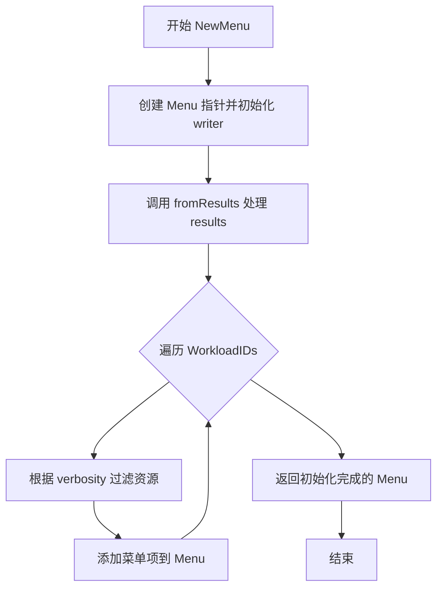
```mermaid
flowchart TD
    A[开始 NewMenu] --> B[创建 Menu 指针并初始化 writer]
    B --> C[调用 fromResults 处理 results]
    C --> D{遍历 WorkloadIDs}
    D --> E[根据 verbosity 过滤资源]
    E --> F[添加菜单项到 Menu]
    F --> D
    D --> G[返回初始化完成的 Menu]
    G --> H[结束]
```

#### 带注释源码

```go
// NewMenu creates a menu printer that outputs a result set to
// the `io.Writer` provided, at the given level of verbosity:
//  - 2 = include skipped and ignored resources
//  - 1 = include skipped resources, exclude ignored resources
//  - 0 = exclude skipped and ignored resources
//
// It can print a one time listing with `Print()` or then enter
// interactive mode with `Run()`.
func NewMenu(out io.Writer, results Result, verbosity int) *Menu {
	// 创建一个新的 Menu 指针，并初始化内部的 writer
	m := &Menu{wr: newWriter(out)}
	// 根据 results 和 verbosity 填充菜单项
	m.fromResults(results, verbosity)
	// 返回初始化完成的 Menu 实例
	return m
}
```


### `Menu.fromResults`

从结果集构建菜单项，根据 verbosity 过滤资源（2=包含跳过和忽略的资源，1=包含跳过的资源，0=不包含），并为每个有效的工作负载生成对应的菜单项。

参数：

- `results`：`Result`，结果集，包含多个工作负载的更新状态和信息
- `verbosity`：`int`，详细程度级别，控制是否显示被忽略（verbosity<2）或跳过（verbosity<1）的资源

返回值：无（`void`），该方法直接修改 Menu 结构体的内部状态（items 和 selectable 字段）

#### 流程图

```mermaid
flowchart TD
    A[开始 fromResults] --> B[遍历 results.WorkloadIDs]
    B --> C{还有更多 workloadID?}
    C -->|是| D[解析 resourceID]
    D --> E[获取对应的 result]
    E --> F{result.Status == ReleaseStatusIgnored?}
    F -->|是| G{verbosity >= 2?}
    G -->|否| C
    G -->|是| H{result.Status == ReleaseStatusSkipped?}
    H -->|否| I{result.Error != ''?}
    I -->|是| J[添加错误菜单项]
    J --> K{遍历 result.PerContainer}
    K --> L[添加容器更新菜单项]
    L --> M{result.Error == '' 且 len(result.PerContainer) == 0?}
    M -->|是| N[添加空白状态菜单项]
    M -->|否| C
    C -->|否| O[结束]
    
    F -->|否| H
    H -->|是| P{verbosity >= 1?}
    P -->|否| C
    P -->|是| I
```

#### 带注释源码

```go
// fromResults 从结果集构建菜单项
// 根据 verbosity 过滤资源：
//   - verbosity >= 2: 包含被忽略和跳过的资源
//   - verbosity >= 1: 包含跳过的资源，排除被忽略的资源
//   - verbosity < 1: 排除被忽略和跳过的资源
func (m *Menu) fromResults(results Result, verbosity int) {
    // 遍历结果集中的所有工作负载 ID
    for _, workloadID := range results.WorkloadIDs() {
        // 解析资源 ID
        resourceID := resource.MustParseID(workloadID)
        // 获取该资源对应的结果
        result := results[resourceID]
        
        // 根据状态和 verbosity 过滤被忽略的资源
        switch result.Status {
        case ReleaseStatusIgnored:
            // verbosity < 2 时，跳过被忽略的资源
            if verbosity < 2 {
                continue
            }
        case ReleaseStatusSkipped:
            // verbosity < 1 时，跳过被跳过的资源
            if verbosity < 1 {
                continue
            }
        }

        // 如果存在错误信息，添加错误菜单项
        if result.Error != "" {
            m.AddItem(menuItem{
                id:     resourceID,
                status: result.Status,
                error:  result.Error,
            })
        }
        
        // 遍历每个容器的更新信息，添加对应的菜单项
        for _, upd := range result.PerContainer {
            m.AddItem(menuItem{
                id:     resourceID,
                status: result.Status,
                update: upd,
            })
        }
        
        // 如果没有错误且没有容器更新，添加一个表示无更新或已完成状态的菜单项
        if result.Error == "" && len(result.PerContainer) == 0 {
            m.AddItem(menuItem{
                id:     resourceID,
                status: result.Status,
            })
        }
    }
    return
}
```


### `Menu.AddItem`

该方法用于向菜单中添加一个菜单项（menuItem），如果该菜单项可选择（checkable），则自动将其标记为已选中（checked）状态，并增加菜单的可选项计数器。

参数：

- `mi`：`menuItem`，要添加的菜单项结构，包含资源ID、状态、错误信息和容器更新数据

返回值：无（`void`），该方法直接修改Menu结构体的内部状态，不返回任何值。

#### 流程图

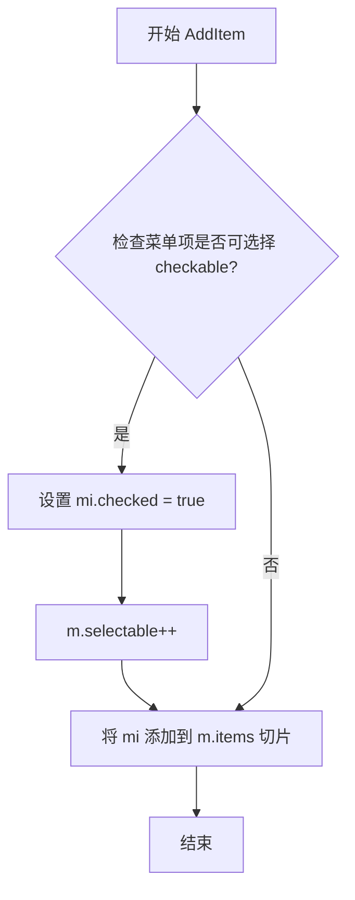
```mermaid
flowchart TD
    A[开始 AddItem] --> B{检查菜单项是否可选择 checkable?}
    B -->|是| C[设置 mi.checked = true]
    C --> D[m.selectable++]
    D --> E[将 mi 添加到 m.items 切片]
    B -->|否| E
    E --> F[结束]
```

#### 带注释源码

```go
// AddItem 向菜单添加一个菜单项
// 参数 mi: menuItem 类型的菜单项，包含资源的ID、状态、错误信息以及容器更新数据
func (m *Menu) AddItem(mi menuItem) {
	// 检查该菜单项是否可选择（即是否有容器更新需要用户确认）
	if mi.checkable() {
		// 如果可选择，自动标记为已选中状态
		mi.checked = true
		// 增加可选择项的计数器，用于后续交互控制光标位置
		m.selectable++
	}
	// 将菜单项追加到items切片中保存
	m.items = append(m.items, mi)
}
```


### `Menu.Run()`

启动交互式终端菜单，允许用户通过键盘导航、选择和确认容器更新操作。用户在菜单中选择要应用的更新后，方法返回这些更新的映射；如果用户中止或没有可选择的更新，则返回错误。

参数：空（该方法为值接收者，不接受额外参数）

返回值：
- `map[resource.ID][]ContainerUpdate`，用户选中的容器更新映射，以资源 ID 为键
- `error`，执行过程中的错误信息，如无更新项、用户中止或读取输入失败

#### 流程图

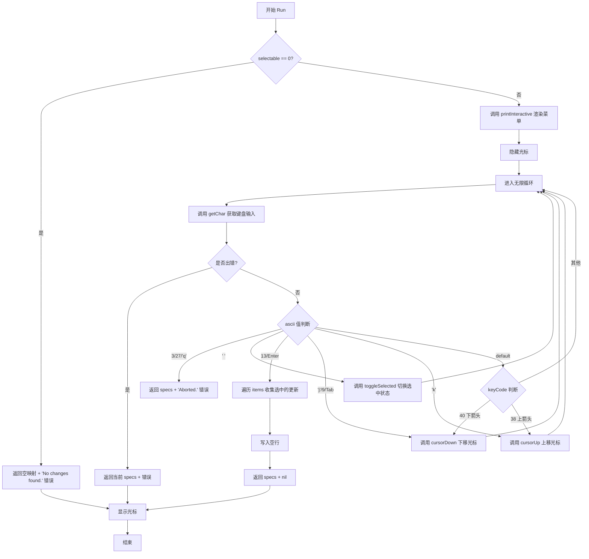
```mermaid
flowchart TD
    A[开始 Run] --> B{selectable == 0?}
    B -->|是| C[返回空映射 + 'No changes found.' 错误]
    B -->|否| D[调用 printInteractive 渲染菜单]
    D --> E[隐藏光标]
    E --> F[进入无限循环]
    
    F --> G[调用 getChar 获取键盘输入]
    G --> H{是否出错?}
    H -->|是| I[返回当前 specs + 错误]
    H -->|否| J{ascii 值判断}
    
    J -->|3/27/'q'| K[返回 specs + 'Aborted.' 错误]
    J -->|' '| L[调用 toggleSelected 切换选中状态]
    L --> F
    
    J -->|13/Enter| M[遍历 items 收集选中的更新]
    M --> N[写入空行]
    N --> O[返回 specs + nil]
    
    J -->|'j'/9/Tab| P[调用 cursorDown 下移光标]
    J -->|'k'| Q[调用 cursorUp 上移光标]
    J -->|default| R{keyCode 判断}
    
    R -->|40 下箭头| P
    R -->|38 上箭头| Q
    R -->|其他| F
    
    P --> F
    Q --> F
    
    I --> S[显示光标]
    O --> S
    C --> S
    S --> T[结束]
```

#### 带注释源码

```go
// Run 启动交互式菜单模式。
// 返回值：
//   - map[resource.ID][]ContainerUpdate: 用户选中的容器更新映射
//   - error: 错误信息（无更新项、用户中止或输入读取失败）
func (m *Menu) Run() (map[resource.ID][]ContainerUpdate, error) {
	// 初始化结果映射，用于存储用户选中的容器更新
	specs := make(map[resource.ID][]ContainerUpdate)
	
	// 检查是否有可选择的更新项
	// 如果没有可选择的项，直接返回错误
	if m.selectable == 0 {
		return specs, errors.New("No changes found.")
	}

	// 打印交互式菜单界面
	m.printInteractive()
	
	// 隐藏光标以获得更好的交互体验
	m.wr.hideCursor()
	// defer 确保函数返回前显示光标
	defer m.wr.showCursor()

	// 无限循环，持续读取用户输入直到做出选择或中止
	for {
		// getChar() 读取一个字符（可能是 ASCII 码或特殊键码）
		// 返回：ascii 码、keyCode（用于方向键等特殊键）、错误
		ascii, keyCode, err := getChar()
		
		// 如果读取字符出错，返回错误
		if err != nil {
			return specs, err
		}

		// 根据 ASCII 码处理用户输入
		switch ascii {
		// Ctrl+C (3)、Esc (27)、'q' - 中止操作
		case 3, 27, 'q':
			return specs, errors.New("Aborted.")
		
		// 空格键 (32) - 切换当前选中项的勾选状态
		case ' ':
			m.toggleSelected()
		
		// 回车键 (13) - 确认选择，返回选中的更新
		case 13:
			// 遍历所有菜单项，收集被勾选的项
			for _, item := range m.items {
				if item.checked {
					// 将选中的更新添加到结果映射中
					// 同一资源 ID 可能有多个容器更新
					specs[item.id] = append(specs[item.id], item.update)
				}
			}
			// 写入空行美化输出
			m.wr.writeln("")
			// 返回选中的更新和 nil 错误
			return specs, nil
		
		// Tab (9) 或 'j' - 光标下移
		case 9, 'j':
			m.cursorDown()
		
		// 'k' - 光标上移
		case 'k':
			m.cursorUp()
		
		// 其他 ASCII 码，尝试解析为特殊键
		default:
			// keyCode 用于识别方向键等非 ASCII 字符
			switch keyCode {
			// 40 = 下箭头键
			case 40:
				m.cursorDown()
			// 38 = 上箭头键
			case 38:
				m.cursorUp()
			}
		}
		// 循环继续，等待下一个输入
	}
}
```


### Menu.Print()

该方法用于非交互式打印菜单，将菜单项以表格形式输出到 io.Writer，不包含交互式光标选择和复选框，适用于一次性展示场景。

参数：无

返回值：无（`void`）

#### 流程图

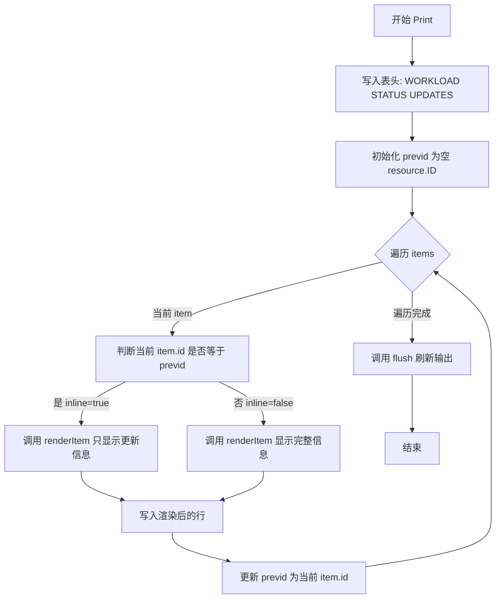
```mermaid
flowchart TD
    A[开始 Print] --> B[写入表头: WORKLOAD STATUS UPDATES]
    B --> C[初始化 previd 为空 resource.ID]
    C --> D{遍历 items}
    D -->|当前 item| E[判断当前 item.id 是否等于 previd]
    E -->|是 inline=true| F[调用 renderItem 只显示更新信息]
    E -->|否 inline=false| G[调用 renderItem 显示完整信息]
    F --> H[写入渲染后的行]
    G --> H
    H --> I[更新 previd 为当前 item.id]
    I --> D
    D -->|遍历完成| J[调用 flush 刷新输出]
    J --> K[结束]
```

#### 带注释源码

```go
// Print 非交互式打印菜单，将菜单项以表格形式输出到 io.Writer
// 该方法一次性输出所有菜单项，不包含交互式光标选择功能
func (m *Menu) Print() {
	// 写入表头，格式为 "WORKLOAD \tSTATUS \tUPDATES"
	m.wr.writeln(tableHeading)
	
	// 用于跟踪上一个输出的资源 ID，以实现同一资源的多个容器信息inline显示
	var previd resource.ID
	
	// 遍历所有菜单项
	for _, item := range m.items {
		// 判断当前 item 是否与上一 item 属于同一资源
		// 如果是同一资源（inline=true），则只显示更新信息列
		// 如果是新资源（inline=false），则显示完整的资源ID、状态和更新信息
		inline := previd == item.id
		
		// 渲染并写入该菜单项
		m.wr.writeln(m.renderItem(item, inline))
		
		// 更新 previd 为当前 item.id，供下一次迭代使用
		previd = item.id
	}
	
	// 刷新 tabwriter 缓冲区，确保所有内容输出到 io.Writer
	m.wr.flush()
}
```


### `Menu.printInteractive()`

该方法用于打印交互式菜单界面，清除终端并重新渲染所有菜单项，包括复选框状态和光标指示器，供用户进行交互式选择操作。

参数：

- 该方法没有显式参数（接收者为 `m *Menu`）

返回值：`无`（返回类型为空）

#### 流程图

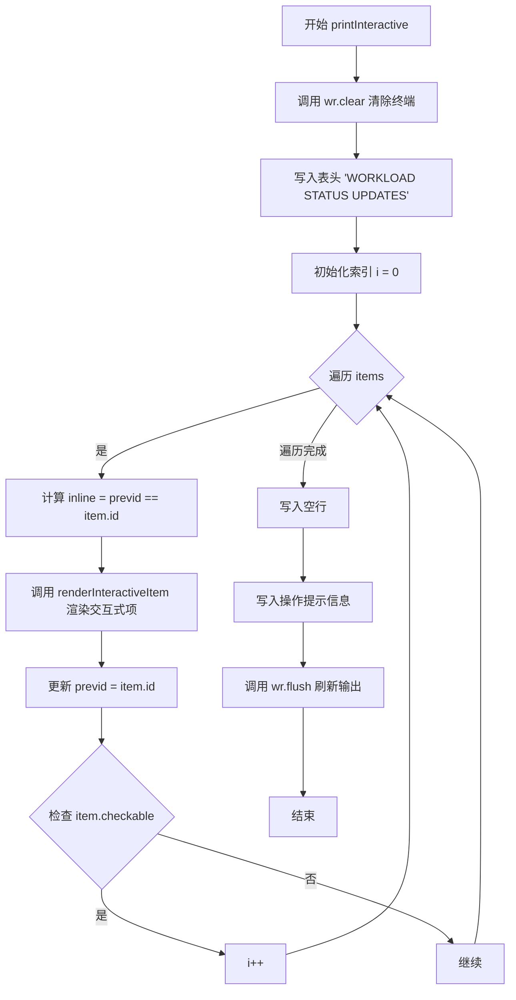
```mermaid
flowchart TD
    A[开始 printInteractive] --> B[调用 wr.clear 清除终端]
    B --> C[写入表头 'WORKLOAD STATUS UPDATES']
    C --> D[初始化索引 i = 0]
    D --> E{遍历 items}
    E -->|是| F[计算 inline = previd == item.id]
    F --> G[调用 renderInteractiveItem 渲染交互式项]
    G --> H[更新 previd = item.id]
    H --> I{检查 item.checkable}
    I -->|是| J[i++]
    I -->|否| K[继续]
    J --> E
    K --> E
    E -->|遍历完成| L[写入空行]
    L --> M[写入操作提示信息]
    M --> N[调用 wr.flush 刷新输出]
    N --> O[结束]
```

#### 带注释源码

```go
// printInteractive 打印交互式菜单界面
// 该方法清除当前终端内容并重新渲染所有菜单项
// 包括显示复选框状态、光标位置和操作提示
func (m *Menu) printInteractive() {
	// 1. 清除终端上一次的输出内容
	m.wr.clear()
	
	// 2. 写入表头，带缩进以对齐交互式菜单
	m.wr.writeln("    " + tableHeading)
	
	// 3. 初始化可选项索引计数器
	i := 0
	var previd resource.ID // 用于跟踪上一项的ID，实现内联显示
	
	// 4. 遍历所有菜单项并渲染
	for _, item := range m.items {
		// 判断是否与上一项ID相同（内联显示时省略重复的ID列）
		inline := previd == item.id
		
		// 渲染交互式菜单项（包含复选框和光标）
		m.wr.writeln(m.renderInteractiveItem(item, inline, i))
		
		// 更新前一项ID
		previd = item.id
		
		// 如果该项可选则递增索引
		if item.checkable() {
			i++
		}
	}
	
	// 5. 写入空行分隔菜单和提示信息
	m.wr.writeln("")
	
	// 6. 写入操作说明提示用户如何交互
	m.wr.writeln("Use arrow keys and [Space] to toggle updates; hit [Enter] to release selected.")
	
	// 7. 刷新输出缓冲区，确保内容立即显示
	m.wr.flush()
}
```


### `Menu.renderItem`

渲染菜单项为格式化字符串，用于在终端输出菜单列表。

参数：

- `item`：`menuItem`，要渲染的菜单项结构，包含资源ID、状态、更新信息和错误内容
- `inline`：`bool`，是否为内联渲染模式。当为 `true` 时表示该菜单项与上一项属于同一资源（如同一资源的多个容器更新），此时仅显示更新信息而不重复显示资源ID和状态

返回值：`string`，返回格式化后的菜单项字符串，包含制表符分隔的资源ID、状态和更新信息

#### 流程图

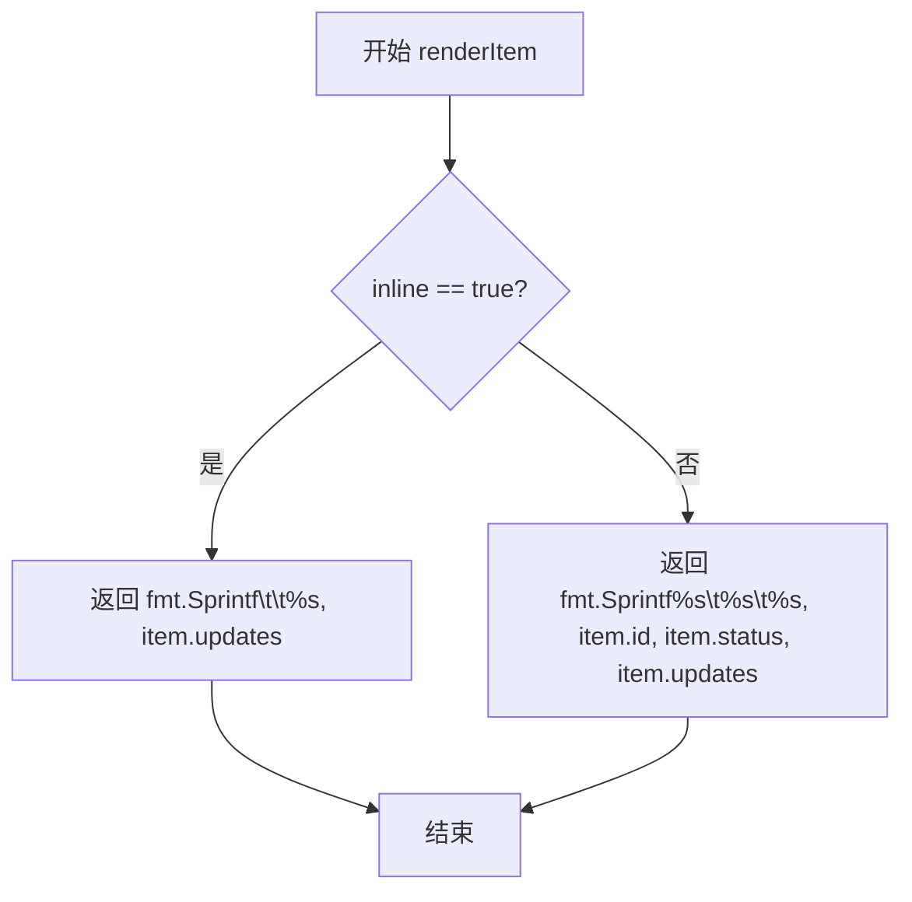
```mermaid
flowchart TD
    A[开始 renderItem] --> B{inline == true?}
    B -->|是| C[返回 fmt.Sprintf\t\t%s, item.updates]
    B -->|否| D[返回 fmt.Sprintf%s\t%s\t%s, item.id, item.status, item.updates]
    C --> E[结束]
    D --> E
```

#### 带注释源码

```go
// renderItem 将菜单项渲染为格式化字符串
// inline 参数决定是否以内联模式渲染：
//   - true: 仅显示更新信息（前置两个制表符），用于同一资源的多个容器更新行
//   - false: 显示完整信息（资源ID、状态、更新内容），每个资源的第一行使用此格式
func (m *Menu) renderItem(item menuItem, inline bool) string {
	if inline {
		// 内联模式：只显示更新内容，不重复显示资源ID和状态
		return fmt.Sprintf("\t\t%s", item.updates())
	} else {
		// 完整模式：显示资源ID、状态和更新内容，字段间用制表符分隔
		return fmt.Sprintf("%s\t%s\t%s", item.id, item.status, item.updates())
	}
}
```


### `Menu.renderInteractiveItem`

渲染交互式菜单项，根据当前索引与光标位置的关系添加选中标记，并组合复选框和菜单项内容生成最终的显示字符串。

参数：

- `item`：`menuItem`，菜单项数据，包含资源ID、状态、错误信息和容器更新内容
- `inline`：`bool`，是否以内联形式渲染（当同一资源有多个容器更新时使用）
- `index`：`int`，当前菜单项的索引位置

返回值：`string`，渲染完成的可交互菜单项字符串，包含选中标记、复选框和菜单内容

#### 流程图

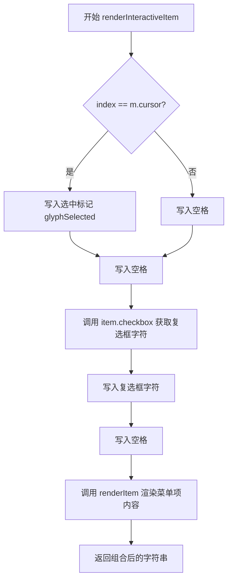
```mermaid
flowchart TD
    A[开始 renderInteractiveItem] --> B{index == m.cursor?}
    B -->|是| C[写入选中标记 glyphSelected]
    B -->|否| D[写入空格]
    C --> E[写入空格]
    D --> E
    E --> F[调用 item.checkbox 获取复选框字符]
    F --> G[写入复选框字符]
    G --> H[写入空格]
    H --> I[调用 renderItem 渲染菜单项内容]
    I --> J[返回组合后的字符串]
```

#### 带注释源码

```go
// renderInteractiveItem 渲染交互式菜单项
// 参数：
//   - item: menuItem, 菜单项数据
//   - inline: bool, 是否内联显示
//   - index: int, 当前项的索引
//
// 返回值：string, 渲染后的交互式菜单项字符串
func (m *Menu) renderInteractiveItem(item menuItem, inline bool, index int) string {
	// 创建缓冲区用于构建输出字符串
	pre := bytes.Buffer{}

	// 判断当前索引是否为光标所在位置
	if index == m.cursor {
		// 是光标位置，写入选中标记符号（⇒）
		pre.WriteString(glyphSelected)
	} else {
		// 非光标位置，写入空格保持对齐
		pre.WriteString(" ")
	}

	// 写入空格分隔选中标记和复选框
	pre.WriteString(" ")

	// 调用 menuItem 的 checkbox 方法获取复选框字符
	// 根据 checkable() 和 checked 状态返回：空格、● 或 ○
	pre.WriteString(item.checkbox())

	// 写入空格分隔复选框和菜单内容
	pre.WriteString(" ")

	// 调用 renderItem 方法渲染菜单项的主体内容
	// 根据 inline 参数决定是否内联显示容器更新信息
	pre.WriteString(m.renderItem(item, inline))

	// 返回组合完整的交互式菜单项字符串
	return pre.String()
}
```


### `Menu.toggleSelected`

该方法用于在交互式菜单中切换当前选中项的勾选状态，通过取反 `checked` 布尔值实现选中与取消选中的切换，并立即刷新界面以反映状态变化。

参数：无

返回值：无（`void`）

#### 流程图

```mermaid
flowchart TD
    A[开始 toggleSelected] --> B{获取当前游标位置}
    B --> C[访问 m.items[m.cursor]]
    C --> D[取反 checked 状态: checked = !checked]
    D --> E[调用 printInteractive 刷新显示]
    E --> F[结束]
```

#### 带注释源码

```go
// toggleSelected 在交互式菜单中切换当前选中项的勾选状态。
// 它通过取反当前菜单项的 checked 字段来实现选中/取消选中的切换，
// 然后立即刷新界面以显示最新的勾选状态。
func (m *Menu) toggleSelected() {
	// 访问当前游标位置的菜单项，并取反其 checked 状态
	m.items[m.cursor].checked = !m.items[m.cursor].checked
	
	// 刷新交互式界面，显示更新后的勾选状态
	m.printInteractive()
}
```


### `Menu.cursorDown`

该方法用于在交互式菜单中将光标向下移动一位，当光标到达菜单末尾时会循环回到开头，每次移动后都会刷新显示当前光标所在的菜单项。

参数：该方法没有显式参数。

返回值：无（`void`），该方法直接修改`Menu`结构体的内部状态。

#### 流程图

```mermaid
flowchart TD
    A[开始 cursorDown] --> B{cursor + 1 < selectable?}
    B -->|是| C[cursor = cursor + 1]
    B -->|否| D[cursor = 0]
    C --> E[调用 printInteractive 刷新显示]
    D --> E
    E --> F[结束]
    
    style A fill:#f9f,color:#333
    style F fill:#9f9,color:#333
```

#### 带注释源码

```go
// cursorDown 将光标向下移动一位，实现循环选择功能
// 当光标到达最后一个可选项时，下移会循环回到第一个可选项
func (m *Menu) cursorDown() {
	// 使用取模运算实现循环移动：(当前索引 + 1) % 可选项总数
	// 例如：如果当前cursor为0，selectable为3，则(0+1)%3=1，光标移动到位置1
	// 如果当前cursor为2，selectable为3，则(2+1)%3=0，光标循环回到位置0
	m.cursor = (m.cursor + 1) % m.selectable
	
	// 刷新交互式菜单显示，更新光标位置的可视化效果
	m.printInteractive()
}
```


### `Menu.cursorUp()`

该方法用于在交互式菜单中将光标位置向上移动一个选项。当光标到达顶部时，会循环回到最后一个可选项目，从而实现循环导航。移动光标后会立即刷新显示交互式菜单界面。

参数：无（该方法通过 receiver `m *Menu` 访问菜单状态）

返回值：无（返回类型为 `void`）

#### 流程图

```mermaid
flowchart TD
    A[cursorUp 被调用] --> B[计算新光标位置]
    B --> C{"m.cursor + m.selectable - 1) % m.selectable"}
    
    C -->|光标在顶部| D[循环回到最后一个可选项]
    C -->|光标不在顶部| E[向上移动一个位置]
    
    D --> F[更新 m.cursor]
    E --> F
    
    F --> G[调用 printInteractive]
    G --> H[刷新菜单显示]
    H --> I[结束]
```

#### 带注释源码

```go
// cursorUp 将光标向上移动一个位置，实现循环导航
// 当光标在顶部时，向上移动会循环到底部
func (m *Menu) cursorUp() {
	// 计算新光标位置：使用模运算实现循环效果
	// (current + total - 1) % total 相当于 (current - 1)，但避免负数
	// 例如：如果 cursor=0, selectable=5，结果是 (0+5-1)%5 = 4（循环到底部）
	m.cursor = (m.cursor + m.selectable - 1) % m.selectable
	
	// 刷新交互式菜单显示，反映新的光标位置
	m.printInteractive()
}
```

## 关键组件


### writer 结构体

负责终端输出的写入和格式化，包含tabwriter管理、光标控制（隐藏/显示）、行数计算和屏幕清除功能。

### menuItem 结构体

表示菜单中的单个条目，包含资源ID、更新状态、错误信息、容器更新内容及选中状态标记。

### Menu 结构体

交互式菜单的主要控制器，管理菜单项列表，处理用户键盘输入（空格选择、上下移动、回车确认），渲染静态和交互式菜单界面。

### NewMenu 函数

创建菜单打印器，将结果集输出到指定的io.Writer，支持三种详细级别（0/1/2）来过滤被忽略和跳过的资源。

### Run 方法

启动交互式菜单模式，监听用户键盘输入，处理空格键切换选择、上下箭头移动光标、回车键确认提交选择。

### Print 方法

一次性输出静态菜单列表，显示工作负载、状态和更新信息，不进入交互模式。

### fromResults 方法

将Result结果转换为菜单项，根据verbosity级别过滤不同状态的资源，区分错误和容器更新条目。

### checkable 方法

判断菜单项是否为可选择的容器更新项（仅当包含Container字段时）。

### updates 方法

格式化容器更新信息为"容器名: 当前版本 -> 目标版本"的字符串，或返回错误信息。

### renderItem 方法

渲染单个菜单项的显示内容，根据是否内联显示（同一资源的多个更新）调整格式。

### renderInteractiveItem 方法

渲染交互模式下带复选框和光标指示器的菜单项行。

### getChar 函数

读取用户输入的单个字符，支持ASCII键和方向键（虚拟键码40/38）的识别。


## 问题及建议


### 已知问题

-   `resource.MustParseID` 是一个会在解析失败时 panic 的函数，在 `fromResults` 方法中使用存在风险，应改用返回 error 的安全版本
-   `menuItem` 结构体中 `error` 字段类型为 `string` 而非标准 `error` 接口，类型语义不明确，且与 Go 错误处理惯例不符
-   `getChar()` 函数在 `Run()` 方法中被调用但未在该代码文件中定义，属于外部依赖，缺少接口抽象和错误处理说明
-   `renderInteractiveItem` 方法中每次调用都创建新的 `bytes.Buffer` 对象，在交互式循环中可能导致频繁的内存分配
-   `Menu` 结构体的 `selectable` 字段与 `items` 长度可能不一致，`AddItem` 方法中先递增 `selectable` 再追加 item，如果 `checkable()` 判断逻辑变化会导致状态不一致
-   `Run()` 方法的无限循环没有显式的退出条件说明，虽然通过 ASCII 码处理了中断，但整体逻辑可读性较差
-   `fromResults` 方法中存在 `return` 语句但无实际返回值，与 Go 风格指南不符

### 优化建议

-   将 `menuItem.error` 字段类型改为 `error`，或在文档中明确说明使用 string 的设计意图
-   使用 `resource.ParseID` 替代 `MustParseID`，并添加适当的错误处理
-   考虑提取 `getChar` 为接口依赖，便于单元测试，可以使用策略模式注入键盘输入
-   预先分配 `bytes.Buffer` 或使用 `strings.Builder` 减少内存分配开销
-   将 `selectable` 改为通过计算 `items` 中 `checkable()` 为 true 的数量获取，消除状态同步风险
-   为 `NewMenu` 的 `verbosity` 参数添加完整的文档注释，说明各值的具体含义
-   移除 `fromResults` 方法末尾无用的 `return` 语句
-   考虑将交互相关的键盘事件处理抽取为独立的事件处理器，提高代码可维护性
-   添加对 `out` 参数为 nil 的防御性检查，防止空指针异常

## 其它


### 设计目标与约束

本模块的设计目标是提供一个用户友好的交互式菜单系统，用于在终端环境中展示和管理 Flux CD 工作负载的更新。核心约束包括：1) 依赖 Go 标准库的 text/tabwriter 进行格式化输出；2) 仅支持 ANSI 转义序列的终端环境；3) 交互模式仅支持键盘输入（空格键切换选择、方向键移动光标、回车确认、ESC/q 退出）；4) verbosity 参数控制显示被忽略和跳过的资源。

### 错误处理与异常设计

错误处理采用以下策略：1) getChar() 调用失败时立即返回错误并退出交互循环；2) 当没有可选择的更新项时，Run() 返回 "No changes found." 错误；3) 用户按 Ctrl+C (ascii 3)、ESC (ascii 27) 或 'q' 时返回 "Aborted." 错误；4) Writer 的写入错误通过返回的 error 向上传播；5) 所有资源解析错误通过 resource.MustParseID 触发 panic，调用方需自行处理。

### 数据流与状态机

交互模式的状态机包含以下状态：1) 初始状态 - 调用 printInteractive() 渲染菜单；2) 等待输入状态 - 调用 getChar() 阻塞等待用户输入；3) 处理输入状态 - 根据 ascii 码或 keyCode 处理相应动作（空格切换选中、方向键移动光标、回车确认选择、退出键终止）；4) 退出状态 - 返回用户选中的更新规格或错误。状态转换通过全局的 m.cursor（光标位置）和 m.items[].checked（选中状态）维护。

### 外部依赖与接口契约

主要外部依赖包括：1) github.com/fluxcd/flux/pkg/resource 包提供 resource.ID 类型和 MustParseID 函数；2) io.Writer 接口用于所有输出；3) text/tabwriter 包提供表格格式化功能；4) errors 和 fmt 标准包提供错误和格式化功能。接口契约：NewMenu 接受 io.Writer、Result 和 verbosity 参数，返回 *Menu；Run() 返回 map[resource.ID][]ContainerUpdate 和 error；Print() 无返回值。

### 安全性考虑

当前实现未包含输入验证和清理：1) menuItem.id 来自资源 ID 但未验证合法性；2) error 字段直接显示给用户，存在潜在的信息泄露风险；3) 终端宽度计算依赖 terminalWidth() 函数，未处理返回值异常。建议对用户输入进行长度限制和内容过滤，避免终端代码注入攻击。

### 性能考虑

性能瓶颈分析：1) 每次 printInteractive() 都调用 clear() 和重新渲染整个菜单，时间复杂度 O(n)；2) renderItem 和 renderInteractiveItem 为每个菜单项分配新的 bytes.Buffer；3) writeln() 每次都计算换行次数。建议：缓存渲染结果，仅在状态变化时重新渲染；使用 sync.Pool 重用 Buffer；考虑分页显示大型菜单。

### 可维护性与扩展性

可维护性问题：1) 常量定义分散（moveCursorUp、hideCursor、showCursor、glyphs、tableHeading）；2) 菜单项渲染逻辑分散在多个方法中；3) 硬编码的 ASCII 码值（3=Ctrl+C, 27=ESC, 13=Enter, 9=Tab, 40/38=方向键）缺乏注释。扩展性建议：1) 将常量和配置提取为独立配置结构；2) 定义 MenuRenderer 接口支持不同终端渲染器；3) 添加插件系统支持自定义渲染模板。

### 并发模型

当前实现为单线程模型：1) Menu 和 writer 均无锁保护；2) Run() 方法在主 goroutine 中执行事件循环；3) 无并发写入冲突风险。注意事项：1) 如果外部代码在 Run() 执行期间修改 Menu items，需添加同步机制；2) writer.tw 的 tabwriter.Writer 本身非线程安全，多 goroutine 写入需加锁。

### 资源管理

资源管理策略：1) tabwriter.Writer 通过 flush() 方法显式释放；2) bytes.Buffer 在 renderInteractiveItem 中每次创建，依赖 GC 回收；3) 无文件句柄或网络连接资源需显式释放。建议：使用 defer 确保 flush() 总是执行；考虑使用 sync.Pool 减少 Buffer 分配；添加上下文支持以实现可取消的操作。

    