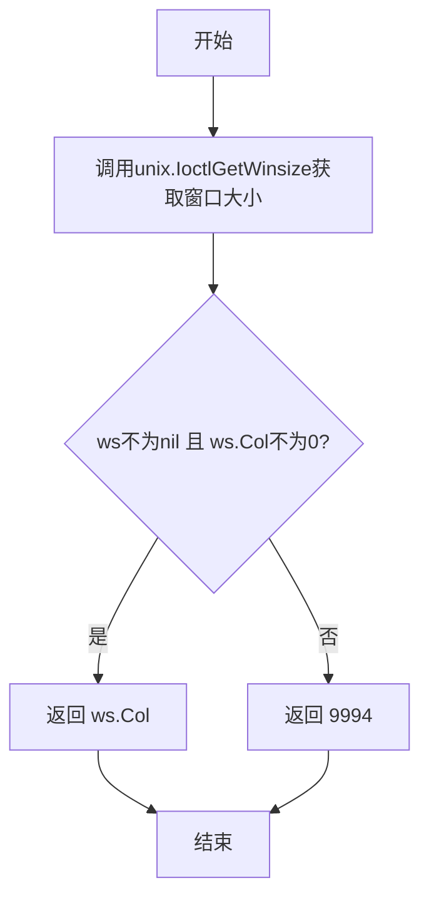

# `flux\pkg\update\menu_unix.go` 详细设计文档

该代码是一个跨平台的终端交互模块，专门为非Windows系统提供终端宽度获取和键盘按键读取功能，支持方向键识别。

## 整体流程

```mermaid
graph TD
    A[开始] --> B{调用terminalWidth}
    B --> C[使用unix.IoctlGetWinsize获取终端尺寸]
    C --> D{ws.Col != 0?}
    D -- 是 --> E[返回实际列数]
    D -- 否 --> F[返回默认值9999]
    F --> G[调用getChar读取按键]
    G --> H[打开/dev/tty终端]
    H --> I[设置为Raw模式]
    I --> J[读取3字节数据]
    J --> K{numRead == 3?}
    K -- 是 --> L{bs[0] == 27 && bs[1] == 91?}
    L -- 是 --> M{识别方向键}
    M --> N[返回keyCode]
    K -- 否 --> O{numRead == 1?}
    O -- 是 --> P[返回ascii码]
    O -- 否 --> Q[返回空值]
    N --> R[Restore并Close终端]
    P --> R
    Q --> R
    R --> S[结束]
```

## 类结构

```
Go Package: update (非Windows平台)
└── Functions
    ├── terminalWidth() uint16
    └── getChar() (int, int, error)
```

## 全局变量及字段


    

## 全局函数及方法


### `terminalWidth`

该函数用于获取当前终端的宽度（列数），通过调用 Unix 系统 ioctl 接口获取终端窗口大小。如果无法获取或返回值为 0，则返回默认值 9999。

参数：

- （无参数）

返回值：`uint16`，返回终端的宽度（列数），若无法获取则返回默认值 9999。

#### 流程图



#### 带注释源码

```go
// terminalWidth 返回当前终端的宽度（列数）
// 如果无法获取终端宽度，则返回默认值 9999
func terminalWidth() uint16 {
	// 使用 unix.IoctlGetWinsize 获取终端窗口大小信息
	// 传入标准输出文件描述符和终端窗口大小请求码 TIOCGWINSZ
	ws, _ := unix.IoctlGetWinsize(int(os.Stdout.Fd()), unix.TIOCGWINSZ)
	
	// 检查获取到的窗口大小是否有效：
	// 1. ws 不为 nil（确保系统调用成功）
	// 2. ws.Col 不为 0（确保列数有效，0 通常表示无效值）
	if ws != nil && ws.Col != 0 {
		// 返回实际的终端列数
		return ws.Col
	}
	
	// 如果无法获取有效宽度，返回默认值 9999
	// 这是一个常见的 fallback 策略，用于确保在无法确定终端宽度时
	// 仍然能够进行合理的布局输出
	return 9999
}
```


### `getChar`

该函数用于从终端读取单个字符，能够识别方向键（上下左右）并返回对应的JavaScript键码，同时支持普通ASCII字符的读取。

参数：无

返回值：

- `ascii`：`int`，返回普通ASCII字符的编码
- `keyCode`：`int`，返回方向键等特殊键的JavaScript键码（Up=38, Down=40, Right=39, Left=37）
- `err`：`error`，读取过程中可能发生的错误

#### 流程图

```mermaid
flowchart TD
    A[开始] --> B[打开终端 /dev/tty]
    B --> C[设置为Raw模式]
    C --> D[读取3个字节到缓冲区]
    D --> E{判断读取数量}
    
    E -->|numRead == 3| F{检查是否为ESC[开头}
    F -->|是| G{判断第三个字节}
    G -->|bs[2] == 65| H[keyCode = 38<br/>Up方向键]
    G -->|bs[2] == 66| I[keyCode = 40<br/>Down方向键]
    G -->|bs[2] == 67| J[keyCode = 39<br/>Right方向键]
    G -->|bs[2] == 68| K[keyCode = 37<br/>Left方向键]
    F -->|否| L[其他序列处理]
    
    E -->|numRead == 1| M[ascii = bs[0]]
    E -->|其他| N[未知情况处理]
    
    H --> O[恢复终端设置]
    I --> O
    J --> O
    K --> O
    L --> O
    M --> O
    N --> O
    
    O --> P[关闭终端]
    P --> Q[返回 ascii, keyCode, err]
```

#### 带注释源码

```go
// getChar 从终端读取单个字符，支持方向键识别
// 返回值：
//   - ascii: 普通ASCII字符的编码
//   - keyCode: 方向键等特殊键的JavaScript键码
//   - err: 可能发生的错误
func getChar() (ascii int, keyCode int, err error) {
	// 打开控制台终端设备
	t, _ := term.Open("/dev/tty")
	
	// 将终端设置为原始模式（Raw Mode）
	// 原始模式下，输入字符立即传递给程序，不等待回车键
	term.RawMode(t)
	
	// 创建3字节的缓冲区，用于读取可能的转义序列
	bs := make([]byte, 3)

	var numRead int
	
	// 从终端读取输入
	numRead, err = t.Read(bs)
	
	// 如果读取出错，直接返回
	if err != nil {
		return
	}
	
	// 判断读取到的字节数
	if numRead == 3 && bs[0] == 27 && bs[1] == 91 {
		// Three-character control sequence, beginning with "ESC-[".
		// 这是终端转义序列，用于表示方向键和其他特殊键
		// 格式：ESC [ 后跟一个字符表示具体按键

		// Since there are no ASCII codes for arrow keys, we use
		// Javascript key codes.
		// 箭头键没有对应的ASCII码，所以使用JavaScript键码
		if bs[2] == 65 {
			// Up arrow key (ESC [ A)
			keyCode = 38
		} else if bs[2] == 66 {
			// Down arrow key (ESC [ B)
			keyCode = 40
		} else if bs[2] == 67 {
			// Right arrow key (ESC [ C)
			keyCode = 39
		} else if bs[2] == 68 {
			// Left arrow key (ESC [ D)
			keyCode = 37
		}
	} else if numRead == 1 {
		// 仅读取到1个字节，说明是普通ASCII字符
		ascii = int(bs[0])
	} else {
		// Two characters read?? 
		// 其他情况（2个字节或其他）
	}
	
	// 恢复终端的原始设置
	t.Restore()
	
	// 关闭终端设备
	t.Close()
	
	// 返回结果
	return
}
```

## 关键组件


### terminalWidth 函数

获取终端宽度的函数，通过Unix系统调用TIOCGWINSZ获取终端窗口大小，若失败则返回默认值9999。

### getChar 函数

读取终端按键输入的核心函数，支持普通ASCII字符和方向键（上下左右）控制序列的识别，返回ASCII码、键码和错误信息。

### 终端控制序列解析

对ESC-[开头的三字节控制序列进行解析，将终端的方向键映射为JavaScript键码（上下左右分别对应38、40、39、37）。

### Unix系统调用接口

使用golang.org/x/sys/unix包进行底层系统调用，包括IoctlGetWinsize获取窗口大小和/dev/tty终端设备操作。

### 终端模式管理

使用github.com/pkg/term包实现终端的原始模式（RawMode）切换和状态恢复（Restore），确保能够即时捕获单个按键输入。


## 问题及建议


### 已知问题

-   **严重的错误处理缺失**：`term.Open("/dev/tty")` 的错误被忽略，如果打开失败后续调用 `t.Read()` 会导致空指针解引用 panic
- **终端状态未正确恢复**：如果 `t.Read()` 之前发生任何错误，终端会保持在 raw 模式而无法恢复，造成终端状态损坏
- **返回值未完全初始化**：`getChar()` 在未匹配到任何条件时，`ascii` 和 `keyCode` 返回未初始化的零值（0），调用方无法区分是正常返回还是未匹配情况
- **资源泄漏风险**：`getChar()` 中 `term.Restore()` 和 `t.Close()` 的错误被忽略，且如果在执行这些清理操作前发生 panic，终端将保持 raw 模式
- **缓冲区可能溢出**：硬编码 `bs := make([]byte, 3)` 仅能处理3字节序列，某些终端可能发送更长的转义序列导致读取不完整
- **魔法数字缺乏解释**：默认宽度 9999 和箭头键的 JavaScript key codes (38, 40, 39, 37) 为硬编码数值，无常量定义或注释说明来源
- **不支持取消操作**：函数使用阻塞式 I/O，无法通过 context 取消，长时间等待用户输入时无法优雅退出
- **终端兼容性有限**：仅支持 `/dev/tty`，在非交互式环境或伪终端环境下会失败

### 优化建议

-   为 `term.Open` 和 `term.Read` 添加错误检查，失败时返回明确错误而非继续执行
-   使用 `defer` 确保终端状态在所有退出路径上都能被正确恢复：`defer t.Restore(); defer t.Close()`
-   为未知输入情况返回明确的错误或特定标识值，而非依赖零值
-   定义常量来管理魔法数字：`const (DefaultTerminalWidth = 9999; KeyUp = 38; KeyDown = 40; ...)`
-   考虑增加缓冲区大小或使用动态缓冲区以支持更长的转义序列
-   添加 context 参数支持，允许调用方通过 context 取消阻塞的读取操作
-   添加详细的函数文档注释，说明返回值含义和错误处理方式
-   考虑添加对更完整 ANSI 转义序列的支持（如功能键 F1-F12 等）


## 其它


### 设计目标与约束

本模块旨在为更新程序提供跨平台的终端交互能力，支持获取终端宽度以及捕获用户键盘输入（包括方向键）。由于代码使用Unix系统调用和/dev/tty设备，仅支持非Windows平台（通过build tag !windows约束）。设计约束包括：终端必须支持RAW模式、/dev/tty设备必须可访问、仅处理ASCII字符和有限的箭头键序列。

### 错误处理与异常设计

代码采用了最小化错误处理策略。terminalWidth()函数在获取终端尺寸失败时返回默认值9999，这是一种降级处理策略。getChar()函数中，term.Open()、t.Read()等操作均未完整处理错误场景，主要问题包括：term.Open错误未处理、term.RawMode错误未处理、读取超时未处理、非法序列未明确返回错误。对于关键错误采用静默处理或使用零值返回，调用方需自行处理异常情况。

### 数据流与状态机

getChar()函数实现了简单的状态机来识别按键类型：初始状态读取1-3字节数据 → 根据字节数判断是ASCII字符（1字节）还是控制序列（3字节）→ 控制序列状态下解析第二、第三个字节识别方向键。状态转换路径：空闲 → 读取数据 → (numRead==1)→ASCII字符 | (numRead==3 && bs[0]==27 && bs[1]==91)→控制序列解析 | 其他→未知状态。

### 外部依赖与接口契约

本模块依赖两个外部包：github.com/golang.org/x/sys/unix用于Unix系统调用（IoctlGetWinsize获取终端尺寸），github.com/pkg/term用于终端模式管理（Open、RawMode、Restore、Close）。公共接口包括：terminalWidth()返回uint16类型的终端列数；getChar()返回三个值：ascii（ASCII码）、keyCode（特殊键码）、error（错误信息）。调用方需注意：getChar()打开/dev/tty后必须确保Restore和Close被调用，方向键使用JavaScript风格的keyCode（37-40）。

### 性能考量

代码在性能方面表现良好：无阻塞循环、资源使用可控（3字节缓冲区）、系统调用数量有限。潜在性能问题：每次调用getChar()都会打开和关闭/dev/tty，频繁调用时有一定开销；未设置读取超时可能造成无限等待。建议：可考虑连接池复用term.termios结构，或添加读取超时参数。

### 平台兼容性

当前代码通过// +build !windows标签仅在非Windows平台编译。平台特定实现：Linux使用unix.TIOCGWINSZ和/dev/tty，macOS同样兼容，BSD系列可能需要调整。Windows平台需要独立的实现文件（带// +build windows标签）。未来可考虑使用golang.org/x/crypto/ssh/term实现更通用的终端控制。

### 安全性考虑

代码存在安全风险：getChar()直接打开/dev/tty设备，在特权程序中可能造成安全问题；未验证用户输入合法性；term实例未使用defer确保资源释放（虽然函数末尾有Close但错误路径未保证）。建议增加权限检查、添加defer语句确保资源释放、考虑超时机制防止恶意输入。

### 测试策略

测试面临挑战：依赖真实终端设备，难以进行单元测试。建议的测试方法：使用mock替换unix.IoctlGetWinsize和term相关调用；创建伪终端（PTY）进行集成测试；针对不同按键序列（方向键、功能键）编写边界测试用例；验证错误路径（终端不可用、权限拒绝等）。

### 配置与可扩展性

当前实现硬编码了默认值9999和特定的方向键映射。扩展建议：方向键映射应可配置以支持不同终端类型；默认值可通过环境变量或配置参数调整；可添加对更多功能键（F1-F12）、Home/End等键的支持；考虑终端类型检测以适配不同终端协议（ANSI、VT100等）。

### 资源管理

资源管理存在问题隐患：term.Open()和term.RawMode()的错误未检查，失败时后续操作可能异常；t.Read()可能阻塞，需要考虑超时；错误返回路径中term实例可能未正确关闭。建议使用defer确保资源释放：defer t.Close()和defer t.Restore()，并添加超时上下文支持。

    