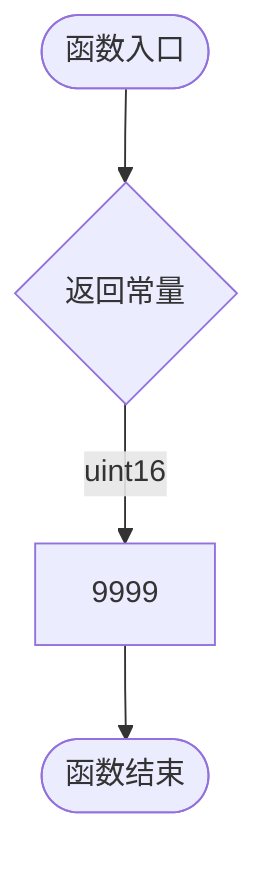

# `flux\pkg\update\menu_win.go` 详细设计文档

该文件是 `update` 包的 Windows 平台特定源文件，通过编译标签 `// +build windows` 限定仅在 Windows 环境编译。代码主要实现了两个全局函数：`terminalWidth` 用于获取终端宽度（此处固定返回 9999），以及 `getChar` 用于读取用户输入（当前实现直接返回错误，标记为 Windows 平台不支持交互模式）。

## 整体流程

```mermaid
graph TD
    subgraph terminalWidth 流程
        A1[调用 terminalWidth] --> B1[返回常量 9999 (uint16)]
    end
    subgraph getChar 流程
        A2[调用 getChar] --> B2[构造错误: errors.New]
        B2 --> C2[返回三元组 (0, 0, err)]
    end
```

## 类结构

```
update (Package)
├── terminalWidth (Global Function)
└── getChar (Global Function)
```

## 全局变量及字段


### `terminalWidth`
    
获取终端宽度，返回硬编码值9999（Windows平台）

类型：`func() uint16`
    


### `getChar`
    
获取用户输入的字符，Windows平台不支持交互模式返回错误

类型：`func() (ascii int, keyCode int, err error)`
    


    

## 全局函数及方法


### `terminalWidth`

该函数用于在 Windows 平台下获取终端宽度。由于 Windows 平台不支持交互模式的终端操作，该函数直接返回一个固定的假值 9999，而非真实的终端宽度。

参数：
- （无）

返回值：`uint16`，返回终端宽度的列数，在 Windows 环境下固定返回 9999。

#### 流程图



#### 带注释源码

```go
// terminalWidth 获取终端宽度
// 说明: 仅在 Windows 平台 (build tag: windows) 下生效。
// 由于 Windows 不支持交互模式下的终端宽度获取，此处返回假值 9999。
func terminalWidth() uint16 {
	return 9999
}
```


### `getChar`

该函数用于在交互模式下获取用户输入的字符，在 Windows 平台下由于不支持交互模式，始终返回错误。

参数：无

返回值：

- `ascii`：`int`，返回字符的 ASCII 码（Windows 平台下始终为 0）
- `keyCode`：`int`，返回键码（Windows 平台下始终为 0）
- `err`：`error`，返回错误信息，表示 Windows 平台不支持交互模式

#### 流程图

```mermaid
flowchart TD
    A[开始 getChar] --> B[返回错误]
    B --> B1[ascii = 0]
    B --> B2[keyCode = 0]
    B --> B3[err = errors.New<br/>"Error: Interactive mode is not supported on Windows"]
    B1 --> C[结束]
    B2 --> C
    B3 --> C
```

#### 带注释源码

```go
// +build windows

package update

import "errors"

// terminalWidth 返回终端宽度
// Windows 平台下固定返回 9999
func terminalWidth() uint16 {
	return 9999
}

// getChar 获取用户输入的字符
// Windows 平台不支持交互模式，因此始终返回错误
// 返回值：
//   - ascii: 字符的 ASCII 码（固定为 0）
//   - keyCode: 键码（固定为 0）
//   - err: 错误信息，表示不支持交互模式
func getChar() (ascii int, keyCode int, err error) {
	return 0, 0, errors.New("Error: Interactive mode is not supported on Windows")
}
```

## 关键组件


### terminalWidth 函数

获取终端宽度的函数，在Windows平台下返回固定值9999，表示终端宽度为最大。

### getChar 函数

获取用户字符输入的函数，在Windows平台下不支持交互模式，直接返回错误。

### 关键组件信息

| 组件名称 | 一句话描述 |
|---------|-----------|
| terminalWidth | Windows平台终端宽度获取函数 |
| getChar | Windows平台交互输入获取函数，返回不支持错误 |

### 潜在的技术债务或优化空间

1. **平台兼容性限制**：Windows平台完全不支持交互模式，返回固定错误值，缺少真正的实现
2. **错误处理方式**：使用errors.New()创建错误对象，每次调用都会创建新实例，可考虑定义全局错误变量
3. **返回值设计**：getChar函数返回三个值(ascii, keyCode, err)，但实际只使用err，API设计不够直观
4. **终端宽度硬编码**：terminalWidth返回固定值9999，未能真正获取实际终端宽度

### 其它项目

**设计目标与约束**：
- 目标：为Windows平台提供终端交互功能的占位实现
- 约束：Windows平台不支持交互模式

**错误处理与异常设计**：
- getChar函数通过返回error类型来表明操作失败，符合Go语言错误处理惯例
- terminalWidth函数不返回错误，但返回的假值可能导致调用方处理异常

**外部依赖与接口契约**：
- 仅依赖Go标准库的errors包
- 函数签名需与非Windows平台实现保持一致


## 问题及建议


### 已知问题

-   `terminalWidth()` 函数返回硬编码的固定值 9999，无法获取真实的终端宽度，可能导致UI显示错乱
-   `getChar()` 函数在Windows平台完全不可用，总是返回错误，交互功能完全缺失
-   缺少Windows平台特定的终端API调用实现，依赖硬编码默认值
-   错误信息过于简单，没有提供替代方案或解决建议
-   未考虑Windows Terminal、PowerShell、cmd.exe等不同终端环境的兼容性
-   代码缺乏注释，开发者无法理解设计意图和限制原因

### 优化建议

-   使用 Windows API（如 `kernel32.GetConsoleScreenBufferInfo`）实现真正的终端宽度检测
-   考虑通过 cgo 调用 Windows 控制台 API 实现 `getChar()` 函数，或提供替代的交互输入方案
-   添加配置选项，允许用户在无法获取终端宽度时手动指定宽度
-   提供更详细的错误信息，包括"建议使用 -y 参数运行"等替代方案
-   实现基础的 Windows 终端支持，至少支持箭头键和基本功能键
-   添加日志记录，在调试模式下输出终端检测的详细信息
-   考虑跨平台统一的错误处理策略，定义具体的错误类型


## 其它


### 设计目标与约束

本模块旨在为Windows平台提供更新功能的终端界面支持，但由于Windows平台不支持交互式终端操作，因此提供两个占位函数以保持API一致性。设计约束包括：仅在Windows平台编译运行，不提供实际的交互功能，返回固定值以保证其他平台调用时的行为可预测。

### 错误处理与异常设计

- `getChar()` 函数返回固定错误：`errors.New("Error: Interactive mode is not supported on Windows")`
- 错误信息明确说明Windows平台不支持交互模式
- 无异常panic机制，所有错误均通过返回值传播
- `terminalWidth()` 函数不返回错误，返回固定值9999

### 数据流与状态机

本模块无复杂数据流设计。数据流为单向输出模式：
- `terminalWidth()`: 无输入 → 返回固定宽度值
- `getChar()`: 无输入 → 返回错误状态

状态机：不适用，本模块为无状态服务模块

### 外部依赖与接口契约

- 依赖标准库 `errors` 包
- 接口契约：
  - `terminalWidth() uint16`: 返回终端宽度值
  - `getChar() (ascii int, keyCode int, err error)`: 获取字符接口，在Windows平台返回错误

### 性能考虑

- `terminalWidth()`: O(1)时间复杂度，返回固定值无计算开销
- `getChar()`: O(1)时间复杂度，直接返回预定义错误
- 内存占用极低，无额外资源消耗

### 安全性考虑

- 无用户输入处理，无注入风险
- 错误信息为静态字符串，无敏感信息泄露
- 无网络通信，无安全威胁

### 兼容性考虑

- 仅支持Windows平台（通过build tag约束）
- 与其他平台（Linux、macOS）的同名模块提供不同的实现
- API签名与其他平台保持一致，保证跨平台调用兼容性

### 测试策略

- 单元测试：验证函数返回值类型和错误信息
- 平台特定测试：确认build tag正确限制编译环境
- 回归测试：确保Windows平台更新功能能正确处理"不支持交互"的返回值

### 部署注意事项

- 作为update包的Windows平台特定实现自动包含在编译中
- 无需单独部署
- 构建时需指定GOOS=windows

### 监控与日志

- 本模块无日志记录功能
- 错误通过调用方处理和记录
- 建议在调用层添加监控点记录"交互模式不支持"错误的发生频率

### 配置管理

- 无配置项，纯功能性占位实现
- 未来如需配置终端宽度默认值，可在调用层注入

### 版本管理

- 遵循主包版本管理
- 保持与Linux/macOS实现的版本同步

### 维护建议

- 当前为最小化实现，建议在文档中明确标注Windows平台的限制
- 如未来Windows支持交互模式，可在此处实现具体功能
- 考虑添加编译时警告，提醒开发者Windows平台的限制


    