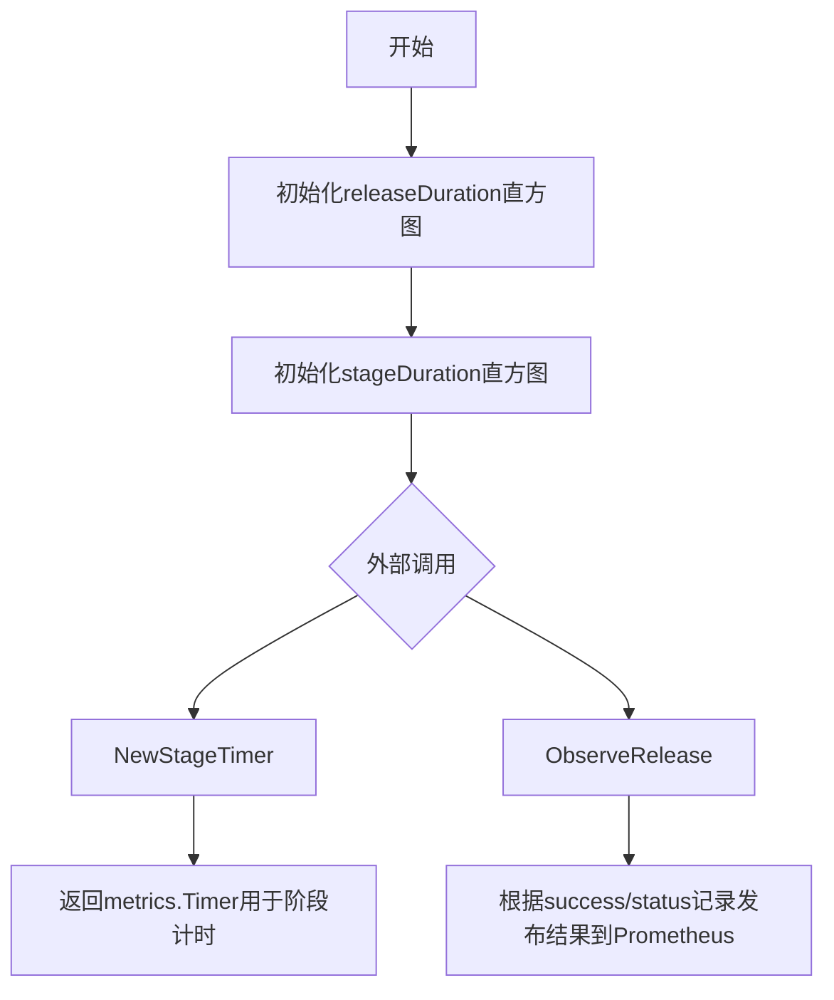
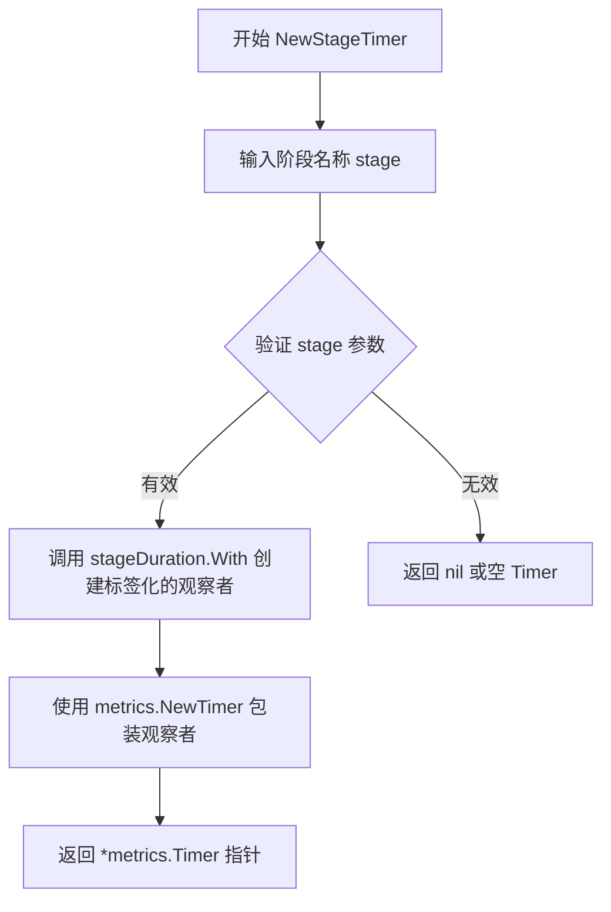

# `flux\pkg\update\metrics.go` 详细设计文档

这是一个Flux发布服务的指标收集模块，通过Prometheus监控发布操作的持续时间和成功率，提供releaseDuration和stageDuration两个直方图指标用于追踪发布性能

## 整体流程



## 类结构

```
update (包)
├── 全局变量
│   ├── releaseDuration (prometheus.Histogram - 发布持续时间)
│   └── stageDuration (prometheus.Histogram - 阶段持续时间)
└── 函数
    ├── NewStageTimer (创建阶段计时器)
    └── ObserveRelease (观察发布结果)
```

## 全局变量及字段


### `releaseDuration`
    
用于记录发布方法持续时间的 Prometheus 直方图指标，以秒为单位，包含发布类型、发布种类和成功与否等标签

类型：`*metrics.Histogram`
    


### `stageDuration`
    
用于记录发布每个阶段（包括 dry-runs）持续时间的 Prometheus 直方图指标，以秒为单位，按发布阶段进行标签区分

类型：`*metrics.Histogram`
    


    

## 全局函数及方法


### `NewStageTimer`

该函数创建一个针对特定发布阶段的 Prometheus 计时器，用于测量每个发布阶段的持续时间。它通过 `stageDuration` 直方图指标和给定的阶段名称标签来实例化一个 `metrics.Timer`，以便在发布流程中精确记录各阶段的执行时间。

参数：

- `stage`：`string`，阶段名称，用于作为指标标签值来区分不同的发布阶段

返回值：`*metrics.Timer`，返回指向 `metrics.Timer` 的指针，用于记录特定阶段的持续时间

#### 流程图



#### 带注释源码

```go
// NewStageTimer 创建一个针对特定发布阶段的计时器
// 参数 stage 表示发布阶段的名称，如 "dry-run", "apply", "rollback" 等
// 返回值是一个 *metrics.Timer，可用于记录该阶段的持续时间
func NewStageTimer(stage string) *metrics.Timer {
    // 使用预定义的 stageDuration 直方图指标
    // 通过 fluxmetrics.LabelStage 标签将指标与特定阶段关联
    // 例如：stage="dry-run" 会创建 label 为 "stage"="dry-run" 的指标
    return metrics.NewTimer(stageDuration.With(fluxmetrics.LabelStage, stage))
}
```

#### 相关组件信息

| 组件名称 | 描述 |
|---------|------|
| `stageDuration` | Prometheus 直方图指标，用于记录所有发布阶段的持续时间 |
| `releaseDuration` | Prometheus 直方图指标，用于记录整个发布过程的持续时间 |
| `fluxmetrics.LabelStage` | 指标标签常量，用于标识发布阶段 |

#### 潜在技术债务与优化空间

1. **缺少参数校验**：函数未对 `stage` 参数进行空值或非法值校验，可能导致无效的指标标签
2. **错误处理缺失**：当前实现没有错误处理机制，如果 `stageDuration.With()` 调用失败，调用方无法感知
3. **指标维度单一**：目前仅支持按阶段名称维度记录，如需更细粒度的分析（如按服务、按版本），需扩展标签

#### 外部依赖与接口契约

- **依赖库**：
  - `github.com/go-kit/kit/metrics` - 提供 Timer 接口
  - `github.com/prometheus/client_golang/prometheus` - 提供 Prometheus 指标实现
  - `github.com/fluxcd/flux/pkg/metrics` - 提供标签常量定义

- **接口契约**：
  - 输入：非空字符串类型的阶段名称
  - 输出：非 nil 的 `*metrics.Timer` 实例
  - 副作用：创建与特定阶段关联的 Prometheus 指标观察者


### `ObserveRelease`

该函数用于记录 Flux 发布操作的成功与否、类型、种类以及耗时，并将这些指标数据以直方图形式暴露给 Prometheus，用于监控和告警。

参数：

- `start`：`time.Time`，发布操作的开始时间，用于计算耗时
- `success`：`bool`，标识发布是否成功完成
- `releaseType`：`ReleaseType`，发布的类型（如 Full、Partial 等）
- `releaseKind`：`ReleaseKind`，发布的种类（如 Helm、Manifest 等）

返回值：`无`（该函数没有返回值，仅执行指标记录操作）

#### 流程图

```mermaid
flowchart TD
    A[开始 ObserveRelease] --> B[构建指标标签]
    B --> C{success 值}
    C -->|true| D[LabelSuccess = 'true']
    C -->|false| E[LabelSuccess = 'false']
    D --> F[获取 releaseDuration 直方图]
    E --> F
    F --> G[计算耗时: time.Since(start).Seconds()]
    G --> H[调用 Observe 方法记录耗时]
    H --> I[结束]
```

#### 带注释源码

```go
// update 包定义了发布相关的指标观测函数
package update

// 导入必要的包：
// - fmt: 用于字符串格式化
// - time: 用于时间处理
import (
	"fmt"
	"time"

	// fluxmetrics 提供了 Flux 相关的指标标签常量
	fluxmetrics "github.com/fluxcd/flux/pkg/metrics"
	// go-kit/metrics 提供了通用的指标抽象接口
	"github.com/go-kit/kit/metrics"
	// prometheus 提供 Prometheus 指标实现
	"github.com/go-kit/kit/metrics/prometheus"
	// 标准 Prometheus 客户端库
	stdprometheus "github.com/prometheus/client_golang/prometheus"
)

// 全局变量：releaseDuration - 用于记录发布方法的耗时（秒）
// 包含三个标签：ReleaseType（发布类型）、ReleaseKind（发布种类）、Success（是否成功）
var (
	releaseDuration = prometheus.NewHistogramFrom(stdprometheus.HistogramOpts{
		Namespace: "flux",     // Prometheus 指标命名空间
		Subsystem: "fluxsvc", // 子系统名称
		Name:      "release_duration_seconds", // 指标名称
		Help:      "Release method duration in seconds.", // 指标描述
		Buckets:   stdprometheus.DefBuckets,    // 使用默认的直方图桶
	}, []string{fluxmetrics.LabelReleaseType, fluxmetrics.LabelReleaseKind, fluxmetrics.LabelSuccess})

	// 全局变量：stageDuration - 用于记录发布各阶段的耗时（秒）
	// 包含一个标签：Stage（阶段名称）
	stageDuration = prometheus.NewHistogramFrom(stdprometheus.HistogramOpts{
		Namespace: "flux",
		Subsystem: "fluxsvc",
		Name:      "release_stage_duration_seconds",
		Help:      "Duration in seconds of each stage of a release, including dry-runs.",
		Buckets:   stdprometheus.DefBuckets,
	}, []string{fluxmetrics.LabelStage})
)

// NewStageTimer 是一个全局函数，用于创建一个指定阶段的计时器
// 参数：stage string - 阶段的名称（如 "sync", "dry-run" 等）
// 返回值：*metrics.Timer - 可用于记录阶段耗时的计时器
func NewStageTimer(stage string) *metrics.Timer {
	// 使用 stageDuration 直方图，并附加阶段标签
	return metrics.NewTimer(stageDuration.With(fluxmetrics.LabelStage, stage))
}

// ObserveRelease 是核心的发布观测函数
// 参数：
//   - start time.Time: 发布开始时间
//   - success bool: 发布是否成功
//   - releaseType ReleaseType: 发布类型
//   - releaseKind ReleaseKind: 发布种类
// 返回值：无
func ObserveRelease(start time.Time, success bool, releaseType ReleaseType, releaseKind ReleaseKind) {
	// 1. 使用 releaseDuration 直方图
	// 2. 添加三个标签：success、releaseType、releaseKind
	// 3. 调用 Observe 方法记录从 start 到现在的时间（秒）
	releaseDuration.With(
		fluxmetrics.LabelSuccess, fmt.Sprint(success),           // 将 bool 转换为字符串
		fluxmetrics.LabelReleaseType, string(releaseType),       // 将 ReleaseType 转换为字符串
		fluxmetrics.LabelReleaseKind, string(releaseKind),       // 将 ReleaseKind 转换为字符串
	).Observe(time.Since(start).Seconds()) // 计算耗时并记录
}
```

#### 关键组件信息

| 名称 | 描述 |
|------|------|
| `releaseDuration` | Prometheus 直方图指标，用于记录整个发布过程的耗时（秒） |
| `stageDuration` | Prometheus 直方图指标，用于记录发布各阶段的耗时（秒） |
| `NewStageTimer` | 全局函数，用于创建带阶段标签的计时器，方便在发布各阶段进行耗时监控 |

#### 潜在的技术债务或优化空间

1. **缺少错误处理**：如果 `releaseDuration.With()` 或 `Observe()` 调用失败，没有错误返回值或日志记录，可能导致指标丢失但不可见
2. **字符串转换开销**：`fmt.Sprint(success)` 在每次调用时都会进行字符串格式化，可考虑使用 `strconv.FormatBool` 或预计算
3. **全局变量初始化**：两个直方图指标在包加载时初始化，如果初始化失败会导致整个包无法使用，缺乏优雅的错误处理机制
4. **ReleaseType/ReleaseKind 类型定义未展示**：代码依赖 `ReleaseType` 和 `ReleaseKind` 类型，但未在当前代码片段中定义，可能存在类型安全隐患

#### 其它项目

- **设计目标**：通过 Prometheus 指标暴露发布性能数据，支持监控告警和容量规划
- **约束**：依赖 go-kit/metrics 和 Prometheus 客户端库，需保证指标命名符合 Prometheus 命名规范
- **错误处理**：采用"静默失败"策略，指标记录失败不影响主业务流程，但可能导致监控数据缺失
- **外部依赖**：依赖 Flux 的指标标签定义包（fluxmetrics）和 Prometheus 生态组件

## 关键组件


### Prometheus 指标组件

用于记录发布操作性能指标的 Prometheus 直方图，包括 releaseDuration（发布方法耗时）和 stageDuration（发布各阶段耗时）

### releaseDuration 全局变量

Prometheus 直方图指标，用于记录发布方法的执行时间，包含发布类型、成功状态和发布种类等标签

### stageDuration 全局变量

Prometheus 直方图指标，用于记录发布过程中每个阶段的执行时间，包含阶段名称标签

### NewStageTimer 函数

创建特定阶段的计时器，用于测量发布过程中各个阶段的耗时

### ObserveRelease 函数

记录发布结果的指标，观察发布操作的耗时，并根据成功与否、发布类型和发布种类进行分类记录


## 问题及建议


### 已知问题

-   **全局变量初始化顺序风险**：两个Prometheus histogram使用全局var声明，在包初始化时执行。如果依赖的fluxmetrics包或其他外部依赖未就绪，可能导致panic或难以追踪的初始化错误。
-   **标签基数爆炸风险**：`ReleaseType`和`ReleaseKind`直接转换为string作为标签值使用，如果这两个类型包含动态生成的值（如时间戳、UUID或用户输入），将导致高基数标签问题，严重影响Prometheus性能。
-   **缺少错误处理**：`prometheus.NewHistogramFrom`和指标记录操作均无错误返回，如果Prometheus指标注册失败或指标收集器被关闭，代码不会感知到异常。
-   **可测试性差**：全局变量使得单元测试难以隔离，无法轻易mock或替换指标收集器进行测试。
-   **资源生命周期不明确**：没有提供指标注销或清理的机制，在长期运行的服务中可能导致资源泄漏或重复注册问题。
-   **依赖外部包脆弱性**：代码强依赖`fluxmetrics`包提供的常量标签，如果外部包API变更或标签常量不存在，代码将无法编译或运行。

### 优化建议

-   **重构为结构体依赖注入**：将Prometheus指标改为结构体字段，通过构造函数或依赖注入方式传入，提高可测试性和灵活性。
-   **添加标签值校验**：在`ObserveRelease`函数中对`releaseType`和`releaseKind`进行白名单校验，确保只有预定义的合法值才能作为标签，避免高基数问题。
-   **增加错误处理机制**：为指标操作添加错误日志记录，或使用带错误返回的指标客户端（如pushgateway模式）。
-   **提供接口抽象**：定义`MetricsRecorder`接口，将Prometheus实现作为具体实现，便于后续切换到其他监控后端。
-   **添加配置化选项**：将命名空间、子系统等硬编码值提取为配置参数或环境变量。
-   **增加单元测试**：添加针对`ObserveRelease`参数边界情况的测试用例，确保标签值处理的正确性。


## 其它


### 设计目标与约束

本包（update）主要用于为Flux发布服务提供Prometheus指标监控功能，目标是量化发布操作的性能和结果。设计约束包括：必须依赖Flux的metrics包定义的标签规范，确保指标命名符合Prometheus最佳实践，指标必须包含releaseType、releaseKind、success等关键维度以支持细粒度监控分析。

### 错误处理与异常设计

由于本包仅包含指标观测功能，不涉及复杂的业务逻辑和错误处理流程。函数参数均为有效值假设调用方负责校验。若传入无效的stage名称或ReleaseType/ReleaseKind值，Prometheus指标仍会记录但可能导致后续查询分析困难。建议调用方在入口处进行参数校验。

### 数据流与状态机

本包采用单向数据流设计：调用方在发布操作开始时调用NewStageTimer创建计时器，在阶段结束时停止Timer；在发布操作结束时调用ObserveRelease记录总耗时和结果。数据流为：业务逻辑 → 计时器创建 → 阶段执行 → Timer停止 → 发布完成 → ObserveRelease调用 → Prometheus指标存储。无复杂状态机设计。

### 外部依赖与接口契约

核心依赖包括：github.com/fluxcd/flux/pkg/metrics（提供标签常量定义）、github.com/go-kit/kit/metrics（Timer接口）、github.com/prometheus/client_golang/prometheus（Prometheus客户端库）。NewStageTimer返回*metrics.Timer接口，调用方通过Stop()方法停止计时。ObserveRelease为无返回值的观测函数，接受time.Time、bool及两种ReleaseType枚举值。

### 性能考虑与监控指标

指标记录操作设计为低开销异步执行，Prometheus客户端库已优化批量处理。Histograms使用默认buckets，适合大多数0-10秒范围的发布操作。建议生产环境根据实际发布耗时分布调整buckets以提高精确度。Label采用字符串拼接方式构建，需注意高频调用时的字符串分配开销。

### 并发安全性

Prometheus指标库的With()和Observe()方法均为线程安全设计，可并发调用。releaseDuration和stageDuration作为包级全局变量，在包初始化时创建，后续只读访问无需额外同步保护。

### 配置管理

指标命名空间（Namespace）和子系统（Subsystem）硬编码为"flux"和"fluxsvc"，符合Flux项目规范。Bucket配置使用标准默认值，如有特殊需求可通过fork本包或使用Go Kit的自定义选项扩展。

### 测试策略建议

建议补充单元测试验证：1）NewStageTimer返回的Timer正确记录stage标签；2）ObserveRelease正确记录所有维度标签；3）并发调用下的线程安全性。由于涉及第三方指标库，可通过mock metrics.Timer接口进行隔离测试。

### 安全考虑

本包不涉及敏感数据处理，指标内容（发布类型、耗时、成功标志）均为运维监控数据，无安全风险。唯一需要注意的是releaseKind和releaseType的字符串值不应包含用户输入以防止指标标签注入。

### API稳定性

当前为内部包（package update），无明确版本承诺。ReleaseType和ReleaseKind枚举定义在调用方包中，需保持与本包的标签值传递一致性。建议未来考虑导出接口以支持插件化指标后端。


    