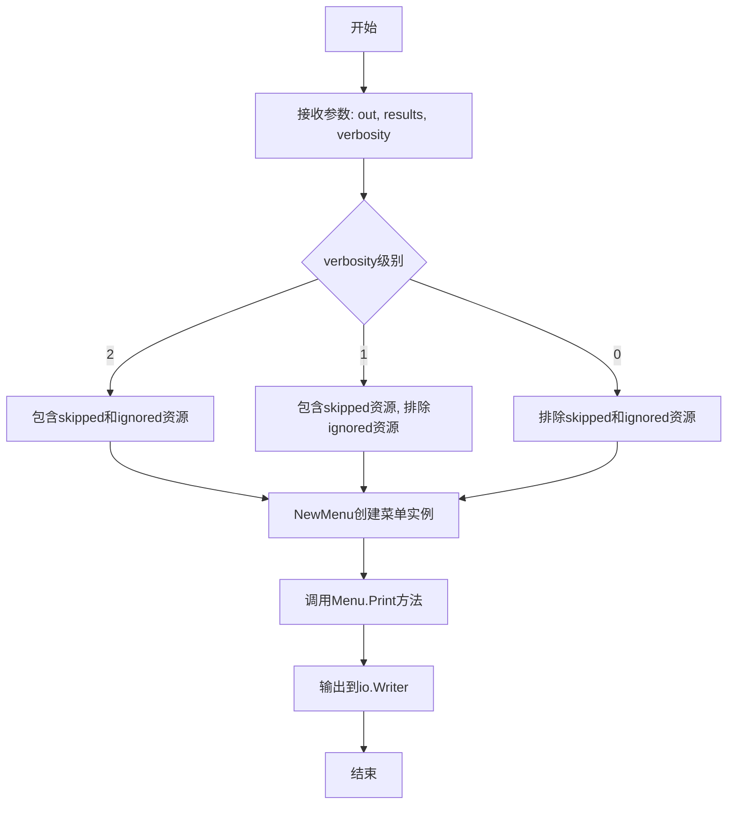
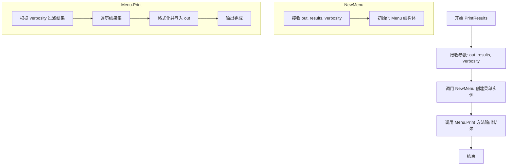

# `flux\pkg\update\print.go` 详细设计文档

该文件定义了PrintResults函数，用于根据指定的verbosity级别将Result结果集输出到指定的io.Writer。函数通过创建Menu实例并调用其Print方法实现结果的格式化输出。

## 整体流程



## 类结构

```
Go语言面向过程编程，无类层次结构
└── package update
    └── PrintResults (函数)
```

## 全局变量及字段


    

## 全局函数及方法


### `PrintResults`

该函数根据指定的详细级别（verbosity）将结果集输出到指定的 io.Writer，支持通过控制详细级别来过滤跳过和忽略的资源输出。

参数：

- `out`：`io.Writer`，输出目标，用于写入结果内容
- `results`：`Result`，待输出的结果集，包含需要打印的资源信息
- `verbosity`：`int`，详细级别，控制输出内容的范围；2 表示包含跳过和忽略的资源，1 表示包含跳过的资源但排除忽略的资源，0 表示排除跳过和忽略的资源

返回值：无（`nil`），该函数无显式返回值，仅通过 io.Writer 输出结果

#### 流程图



#### 带注释源码

```go
package update

import (
	"io"
)

// PrintResults outputs a result set to the `io.Writer` provided, at
// the given level of verbosity:
//  - 2 = include skipped and ignored resources
//  - 1 = include skipped resources, exclude ignored resources
//  - 0 = exclude skipped and ignored resources
//
// 参数说明：
//   - out: 目标输出流，用于写入结果内容
//   - results: Result 类型的结果集，包含待输出的资源信息
//   - verbosity: 整数类型，详细级别标志位
//     * 0: 仅输出正常资源
//     * 1: 输出正常资源和跳过的资源
//     * 2: 输出所有资源（正常、跳过、忽略）
func PrintResults(out io.Writer, results Result, verbosity int) {
	// 创建 Menu 实例并调用 Print 方法进行输出
	// NewMenu 接收输出流、结果集和详细级别作为参数
	// 返回的 Menu 实例的 Print 方法负责实际的格式化输出逻辑
	NewMenu(out, results, verbosity).Print()
}
```

## 关键组件


### PrintResults函数

核心输出函数，负责将结果集按指定详细级别输出到io.Writer。它接受结果数据、输出目标和详细级别三个参数，内部创建菜单对象并调用打印方法。

### Result类型

结果集数据结构，包含需要输出的资源信息。具体结构在代码中未定义，但作为参数传递给PrintResults函数使用。

### verbosity参数

详细级别控制参数，支持三个值：0表示排除跳过和忽略的资源，1表示包含跳过的资源但排除忽略的资源，2表示包含跳过和忽略的所有资源。

### NewMenu工厂函数

菜单创建工厂，根据输出目标、结果集和详细级别创建打印菜单实例。具体实现代码中未展示，但通过NewMenu方法被调用。

### Print方法

菜单打印方法，负责实际的结果输出操作。由NewMenu返回的菜单对象调用。

### io.Writer接口

Go标准库接口，作为输出目标。PrintResults函数将结果输出到实现该接口的任意writer。


## 问题及建议


### 已知问题

-   **错误未处理**：`NewMenu(out, results, verbosity).Print()` 的返回值（通常是 error）被直接忽略，如果打印过程中发生错误，调用方无法感知
-   **参数边界未校验**：`verbosity` 参数未验证有效范围（0-2），传入负数或大于2的值可能导致未定义行为
-   **依赖的外部类型不明确**：代码依赖 `Result` 类型和 `NewMenu` 函数，但未在此文件中定义或导入，可能导致运行时 panic
-   **文档不完整**：缺少 package 级别的文档注释；未说明 `Result` 类型的结构和用途
-   **函数设计单一职责不明确**：该函数承担了参数验证（缺失）、错误处理（缺失）、结果打印等多重职责

### 优化建议

-   在 `PrintResults` 函数中增加 `verbosity` 参数的范围校验，确保值在 [0, 2] 范围内，返回错误或使用默认值
-   修改函数签名为 `func PrintResults(out io.Writer, results Result, verbosity int) error`，将内部 `Print()` 的错误向上传递
-   为 package 添加包级别文档注释，说明该包的功能定位
-   考虑添加单元测试，覆盖 verbosity 边界值、无结果、打印失败等场景
-   如果 `Result` 类型在同包内定义，建议添加类型文档注释


## 其它


### 设计目标与约束

本函数的主要设计目标是将Result结果集以指定 verbosity 级别打印到指定的 io.Writer。约束条件包括：verbosity 参数仅接受 0-2 的整数值，超出范围时行为未定义；依赖 Result 类型和 NewMenu 函数的存在；必须使用 Go 的 io.Writer 接口以保证输出灵活性。

### 错误处理与异常设计

本函数本身不包含显式的错误处理逻辑，错误传播依赖于被调用方（NewMenu 和 Menu.Print 方法）。若 out 为 nil，可能导致 panic；若 results 为 nil 或处于无效状态，行为由 NewMenu 构造函数决定。建议在调用前验证 out 非 nil，并对 results 进行有效性检查。

### 外部依赖与接口契约

**io.Writer 接口**：out 参数必须实现 io.Writer 接口，用于接收格式化后的输出内容。
**Result 类型**：results 参数类型为 Result，定义在同包其他文件中，具体结构未在本文件中体现。
**NewMenu 函数**：同包内的工厂函数，签名为 NewMenu(out io.Writer, results Result, verbosity int) *Menu，返回 Menu 指针实例。

### 性能考虑

函数本身执行路径简短，主要性能消耗点在于 NewMenu 的构造和 Menu.Print 的执行。Print 方法可能涉及大量字符串拼接或格式化操作，应注意避免在高频调用场景下造成内存分配压力。verbosity 参数的层级设计允许在低 verbosity 场景下跳过部分处理逻辑，理论上可提升性能。

### 可测试性设计

由于函数依赖 io.Writer 接口和同包内类型，可通过传入 bytes.Buffer 或自定义 mock 对象验证输出内容。建议为不同 verbosity 级别（0/1/2）编写单元测试，验证输出内容的完整性和正确性。Result 和 NewMenu 的可测试性会直接影响本函数的可测试性。

### 并发考虑

本函数本身不包含任何并发控制逻辑。如果 Print 方法内部涉及共享状态访问（如内部缓存或全局变量），则存在潜在的并发安全问题。调用方需确保在并发环境下正确同步，或使用无状态的实现方式。

### 资源管理

本函数不直接管理资源（文件、网络连接等），资源管理职责转移至 io.Writer 的实现方以及 NewMenu/Menu.Print 的内部实现。若 Menu 内部持有资源，应在 Print 完成后确保资源释放。

### 日志与监控

本函数未包含任何日志记录或监控埋点。建议在调用方或 Menu.Print 内部实现日志功能，以便追踪打印结果的状态和 verbosity 级别。

### 配置管理

verbosity 参数通过函数参数传入，属于运行时配置。未使用配置文件或环境变量进行配置，符合简单函数的设计原则。如需扩展，可考虑从全局配置或命令行标志中读取默认值。


    