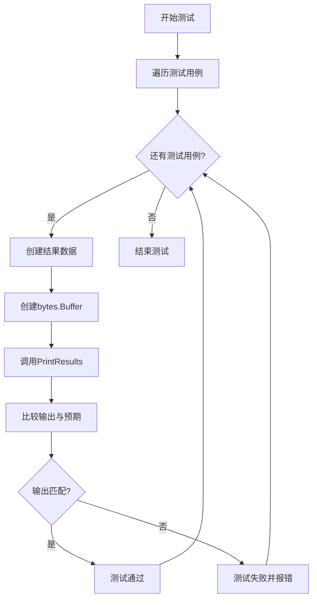
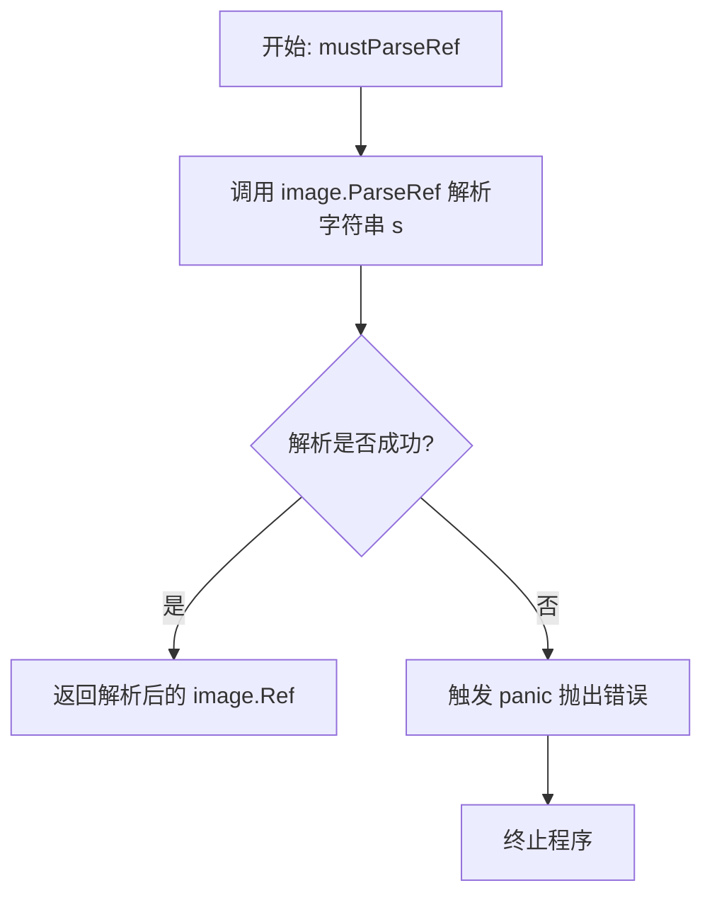
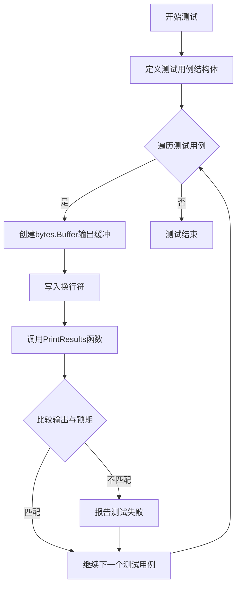
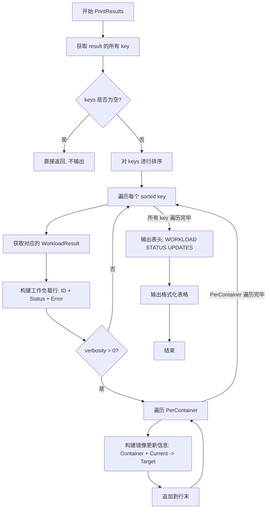

# `flux\pkg\update\print_test.go` 详细设计文档

这是Flux项目update包中的一个测试文件，用于测试PrintResults函数的输出格式是否正确。测试覆盖了三种场景：基本结果展示、带有错误信息的结果展示、以及服务结果的排序展示。

## 整体流程



## 类结构

```
update包 (测试文件)
└── TestPrintResults (测试函数)
```

## 全局变量及字段


### `Result`
    
更新结果映射，以资源ID为键，WorkloadResult为值

类型：`map[resource.ID]WorkloadResult`
    


### `mustParseRef`
    
辅助函数，解析图像引用并在解析失败时panic

类型：`func(s string) image.Ref`
    


### `PrintResults`
    
将更新结果打印到指定的io.Writer，支持不同详细级别

类型：`func(w io.Writer, result Result, verbosity int)`
    


### `WorkloadResult.Status`
    
发布状态，表示更新是否成功或失败

类型：`ReleaseStatus`
    


### `WorkloadResult.Error`
    
错误信息字符串，如果更新失败则包含错误描述

类型：`string`
    


### `WorkloadResult.PerContainer`
    
容器更新列表，包含每个容器的当前和目标镜像信息

类型：`[]ContainerUpdate`
    


### `ContainerUpdate.Container`
    
容器名称

类型：`string`
    


### `ContainerUpdate.Current`
    
当前镜像引用，表示容器当前使用的镜像

类型：`image.Ref`
    


### `ContainerUpdate.Target`
    
目标镜像引用，表示容器将要更新的镜像

类型：`image.Ref`
    
    

## 全局函数及方法


### `mustParseRef`

该函数是一个辅助函数，用于将字符串形式的图像引用（image reference）解析为 `image.Ref` 对象。如果解析失败，它会触发 panic 并终止程序，这是一种快速失败的错误处理策略，常用于测试代码或初始化阶段。

参数：

- `s`：`string`，要解析的图像引用字符串，例如 `"quay.io/weaveworks/helloworld:master-a000001"`

返回值：`image.Ref`，解析成功后的图像引用对象

#### 流程图



#### 带注释源码

```go
// mustParseRef 是一个辅助函数，用于将字符串解析为 image.Ref 类型
// 该函数在解析失败时会 panic，因此仅适用于确定输入有效的场景（如测试用例）
func mustParseRef(s string) image.Ref {
    // 调用 image.ParseRef 尝试解析字符串 s 为图像引用
    ref, err := image.ParseRef(s)
    
    // 检查解析过程中是否发生错误
    if err != nil {
        // 如果解析失败，触发 panic 并将错误信息作为 panic 的值
        // 这是一种快速失败的策略，适用于测试代码或初始化阶段
        panic(err)
    }
    
    // 解析成功，返回解析后的图像引用对象
    return ref
}
```


### `TestPrintResults`

这是一个测试函数，用于验证 `PrintResults` 函数的输出是否符合预期。函数定义了多个测试用例，涵盖基本的发布结果展示、包含错误的场景以及服务结果的排序功能。

参数：

- `t`：`*testing.T`，Go 测试框架的测试对象，用于报告测试失败

返回值：`void`，无返回值

#### 流程图



#### 带注释源码

```go
// TestPrintResults 是一个测试函数，用于验证 PrintResults 函数的输出格式是否正确
func TestPrintResults(t *testing.T) {
    // 遍历测试用例数组，每个用例包含：名称、结果、详细级别、预期输出
    for _, example := range []struct {
        name      string   // 测试用例名称
        result    Result   // 打印结果的结构体
        verbosity int      // 输出详细程度
        expected  string   // 期望的输出字符串
    }{
        // 用例1：基本结果展示
        {
            name: "basic, just results",
            result: Result{
                resource.MustParseID("default/helloworld"): WorkloadResult{
                    Status: ReleaseStatusSuccess, // 发布状态为成功
                    Error:  "",                    // 无错误信息
                    PerContainer: []ContainerUpdate{
                        {
                            Container: "helloworld",                                                     // 容器名称
                            Current:   mustParseRef("quay.io/weaveworks/helloworld:master-a000002"), // 当前镜像
                            Target:    mustParseRef("quay.io/weaveworks/helloworld:master-a000001"), // 目标镜像
                        },
                    },
                },
            },
            // 预期输出：显示工作负载、状态和镜像更新信息
            expected: `
WORKLOAD            STATUS   UPDATES
default/helloworld  success  helloworld: quay.io/weaveworks/helloworld:master-a000002 -> master-a000001
`,
        },

        // 用例2：包含错误信息的结果展示
        {
            name: "With an error, *and* results",
            result: Result{
                resource.MustParseID("default/helloworld"): WorkloadResult{
                    Status: ReleaseStatusSuccess,
                    Error:  "test error", // 包含错误信息
                    PerContainer: []ContainerUpdate{
                        {
                            Container: "helloworld",
                            Current:   mustParseRef("quay.io/weaveworks/helloworld:master-a000002"),
                            Target:    mustParseRef("quay.io/weaveworks/helloworld:master-a000001"),
                        },
                    },
                },
            },
            // 预期输出：显示工作负载、状态、错误信息和镜像更新
            expected: `
WORKLOAD            STATUS   UPDATES
default/helloworld  success  test error
                             helloworld: quay.io/weaveworks/helloworld:master-a000002 -> master-a000001
`,
        },

        // 用例3：验证服务结果按字母顺序排序
        {
            name: "Service results should be sorted",
            result: Result{
                // 无序的资源ID列表，用于验证排序功能
                resource.MustParseID("default/d"): WorkloadResult{Status: ReleaseStatusSuccess},
                resource.MustParseID("default/c"): WorkloadResult{Status: ReleaseStatusSuccess},
                resource.MustParseID("default/b"): WorkloadResult{Status: ReleaseStatusSuccess},
                resource.MustParseID("default/a"): WorkloadResult{Status: ReleaseStatusSuccess},
            },
            // 预期输出：按字母顺序a->b->c->d排列
            expected: `
WORKLOAD   STATUS   UPDATES
default/a  success  
default/b  success  
default/c  success  
default/d  success  
`,
        },
    } {
        // 创建字节缓冲区和写入换行符（所有预期值都以换行符开头以便维护）
        out := &bytes.Buffer{}
        out.WriteString("\n")
        
        // 调用被测试的PrintResults函数
        PrintResults(out, example.result, example.verbosity)
        
        // 验证实际输出是否与预期匹配
        if out.String() != example.expected {
            // 输出详细的错误信息，包括用例名称、参数、期望值和实际值
            t.Errorf(
                "Name: %s\nPrintResults(out, %#v, %v)\nExpected\n-------%s-------\nGot\n-------%s-------",
                example.name,
                example.result,
                example.verbosity,
                example.expected,
                out.String(),
            )
        }
    }
}
```


### `PrintResults`

将升级结果（Release 操作的执行结果）格式化为人类可读的表格形式输出到指定的 Writer，包含工作负载状态和容器镜像变更信息。

参数：

- `out`：`io.Writer`，输出目标，用于写入格式化的结果
- `result`：`Result`，包含所有工作负载升级结果的映射，键为资源 ID，值为对应的升级结果
- `verbosity`：`int`，控制输出详细程度的 verbosity 级别

返回值：无（直接写入到 out Writer）

#### 流程图



#### 带注释源码

```go
// 假设的 PrintResults 函数实现（根据测试用例推断）
func PrintResults(out io.Writer, result Result, verbosity int) {
	// 获取所有工作负载 ID（map 的 key）
	ids := make([]resource.ID, 0, len(result))
	for id := range result {
		ids = append(ids, id)
	}
	
	// 如果没有结果，直接返回
	if len(ids) == 0 {
		return
	}
	
	// 对工作负载 ID 进行排序，确保输出有序
	sort.Slice(ids, func(i, j int) bool {
		return ids[i] < ids[j]
	})
	
	// 构建并输出表头
	fmt.Fprintf(out, "%-16s %-8s %s\n", "WORKLOAD", "STATUS", "UPDATES")
	
	// 遍历每个工作负载，输出其结果
	for _, id := range ids {
		r := result[id]
		// 输出工作负载行：ID + Status + Error（如有）
		line := fmt.Sprintf("%-16s %-8s", id, r.Status)
		
		// 如果有错误信息，追加到同一行
		if r.Error != "" {
			fmt.Fprintf(out, "%s %s\n", line, r.Error)
			line = strings.Repeat(" ", 25) // 错误信息后的行需要缩进
		}
		
		// 如果 verbosity > 0，输出容器更新详情
		if verbosity > 0 {
			for _, cu := range r.PerContainer {
				updateInfo := fmt.Sprintf("%s: %s -> %s", 
					cu.Container, 
					cu.Current, 
					cu.Target)
				fmt.Fprintf(out, "%s %s\n", line, updateInfo)
				line = strings.Repeat(" ", 25) // 后续行缩进
			}
		}
	}
}
```

## 关键组件


### Result 类型

用于存储多个工作负载的更新结果，以资源ID为键，WorkloadResult为值的映射类型

### WorkloadResult 结构体

包含单个工作负载的更新结果，包括发布状态、错误信息和每个容器的更新详情

### ContainerUpdate 结构体

表示容器镜像的更新信息，包含容器名称、当前镜像和目标镜像引用

### PrintResults 函数

将Result结果格式化输出到指定的io.Writer，支持不同的verbosity级别控制输出详细程度

### ReleaseStatusSuccess 常量

表示发布成功的状态标识

### mustParseRef 辅助函数

解析镜像引用字符串为image.Ref类型，解析失败时触发panic，用于测试中的快捷构造


## 问题及建议


### 已知问题

- 测试函数内部直接定义了测试用例数据结构，应提取到包级别以提高可维护性和代码复用性
- 使用 `panic` 实现的 `mustParseRef` 辅助函数不符合良好的错误处理实践，虽然在测试场景中可接受，但缺乏灵活性
- 错误消息拼接采用字符串格式化方式，可读性较差且容易出错
- 测试覆盖不完整，仅测试了 `PrintResults` 函数，未对 `Result`、`WorkloadResult` 等相关类型进行独立测试
- 测试用例中的预期输出使用硬编码字符串，包含了前导换行符 `\n`，这种设计增加了维护成本

### 优化建议

- 使用 `t.Run()` 子测试重构测试结构，为每个测试用例提供更清晰的测试报告和独立的失败信息
- 将测试用例数据提取到包级别的变量或常量中，使用表格驱动测试（Table-Driven Tests）模式
- 考虑将 `mustParseRef` 替换为标准的错误处理方式或使用 testing.T 的辅助方法来跳过测试
- 增加边界条件测试：空结果集、不同 ReleaseStatus 状态、verbosity 不同值等场景
- 考虑使用 `require` 或 `assert` 替代手动比较和错误消息构造，提高测试代码简洁性
- 提取通用辅助函数到测试文件顶部或单独的测试工具包中，减少重复代码

## 其它


### 设计目标与约束

验证PrintResults函数能够正确格式化并输出更新结果，支持多种场景包括基本结果展示、错误信息展示以及结果排序。输出目标为人类可读的表格格式，包含工作负载名称、状态和更新详情。

### 错误处理与异常设计

测试用例覆盖了两种错误场景：1) 正常成功状态下的结果展示；2) 包含错误信息的结果展示。测试验证当Result中包含Error字段时，能够正确显示错误信息。mustParseRef辅助函数使用panic处理解析失败，用于测试数据准备。

### 数据流与状态机

输入数据为map[resource.ID]WorkloadResult类型的Result结构，键为资源ID，值为工作负载更新结果。每个WorkloadResult包含Status状态、Error错误信息字符串、PerContainer容器更新列表。测试验证数据在打印前按资源ID键进行字母排序输出。

### 外部依赖与接口契约

依赖github.com/fluxcd/flux/pkg/image包的image.Ref类型和ParseRef函数进行镜像引用解析；依赖github.com/fluxcd/flux/pkg/resource包的MustParseID函数解析资源ID。被测函数PrintResults签名应为func PrintResults(w io.Writer, result Result, verbosity int)，接受io.Writer接口用于输出。

### 性能考虑

测试使用bytes.Buffer作为输出目标，避免直接写文件。测试数据量较小，未进行大规模性能测试。PrintResults函数应避免频繁的字符串拼接操作。

### 安全性考虑

测试用例中的错误信息为测试字符串"test error"，不涉及真实敏感数据。输出格式化应防止格式化字符串漏洞。

### 可测试性设计

代码本身为测试文件，通过表驱动测试方式组织，便于扩展新测试用例。mustParseRef辅助函数简化测试数据准备。

### 关键假设

假设PrintResults函数已在其他文件中实现，本测试文件仅验证其行为。假设Result类型和WorkloadResult类型已正确定义。假设verbosity参数控制输出详细程度，测试用例使用verbosity为0。

### 测试覆盖范围

当前测试覆盖三种场景：基本结果展示、带错误信息的结果展示、服务结果排序验证。覆盖了ReleaseStatusSuccess状态的输出格式。

### 待实现内容

PrintResults函数的具体实现未在本测试文件中展示，需要根据测试用例的expected输出推断其格式化逻辑。

    