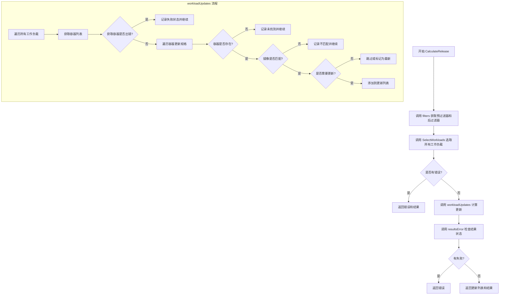
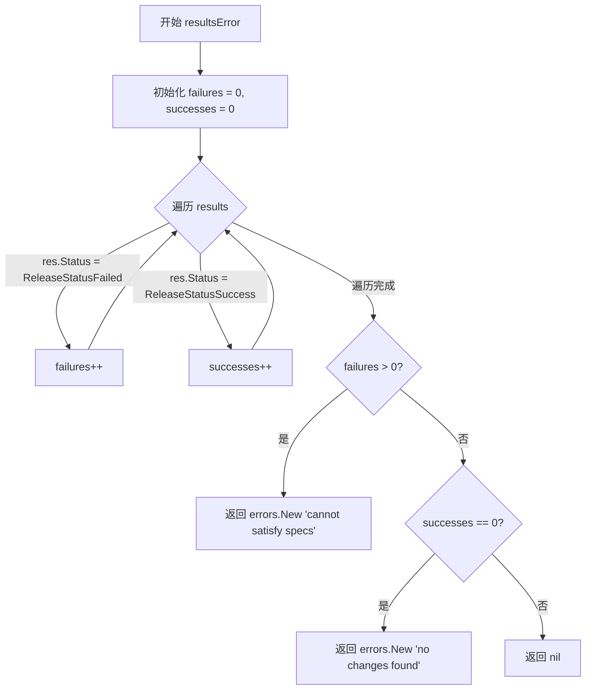
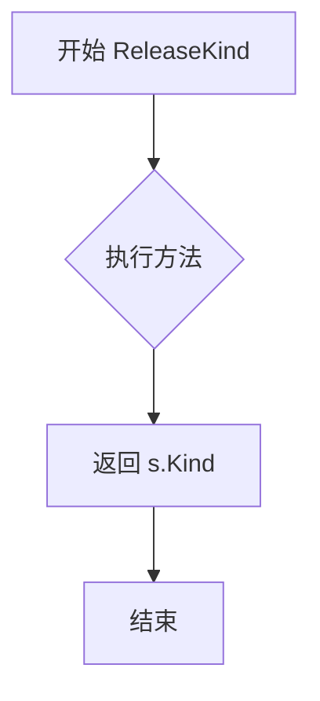
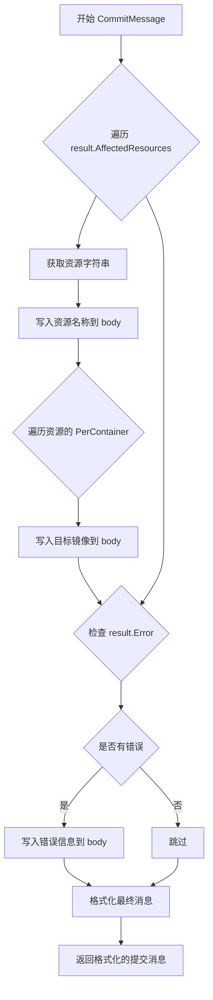
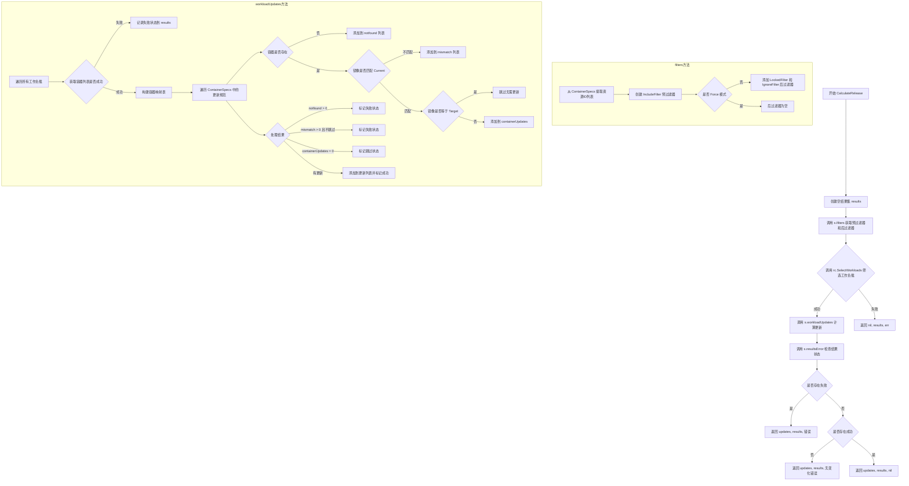
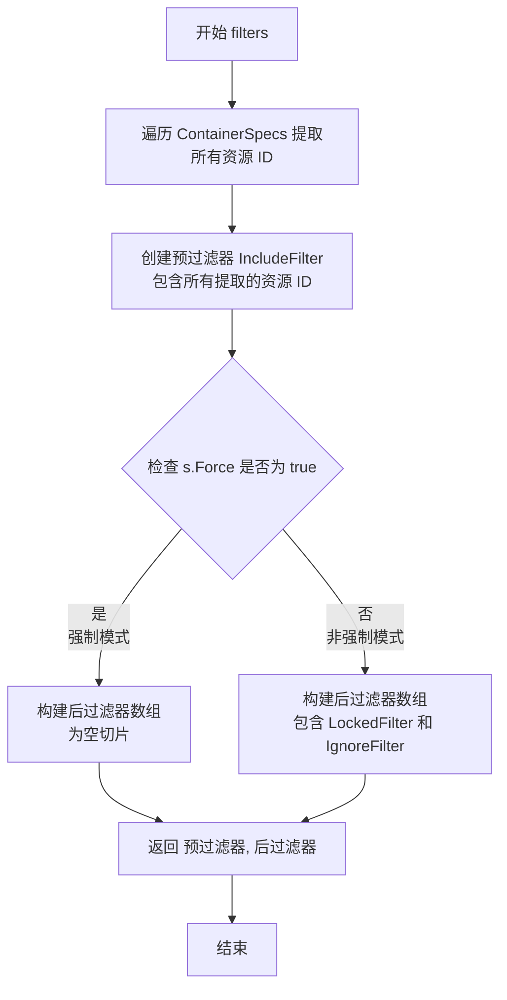
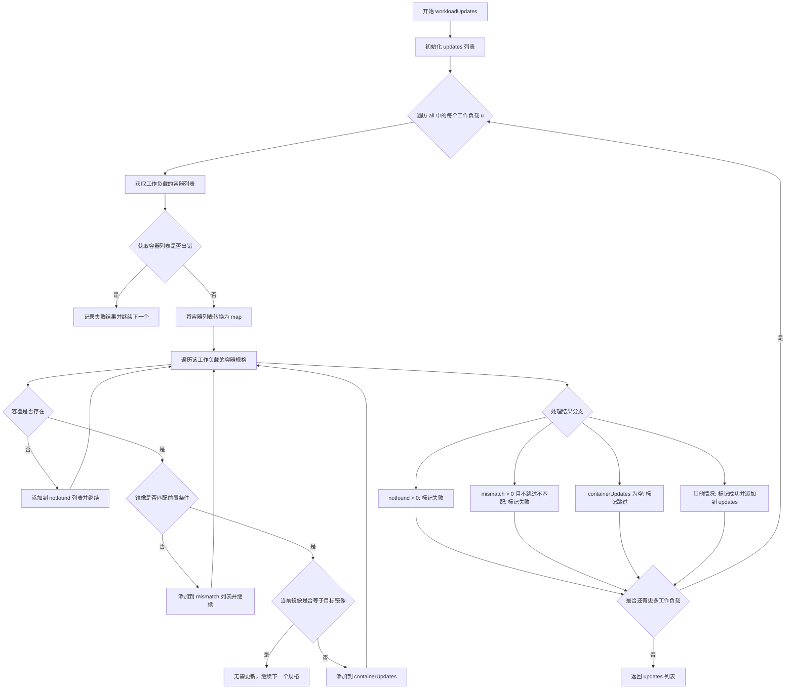
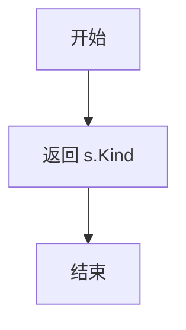
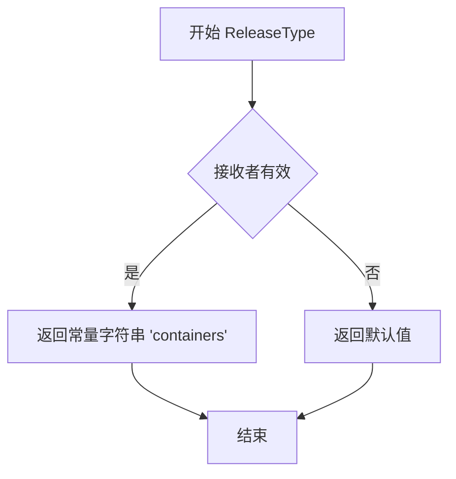
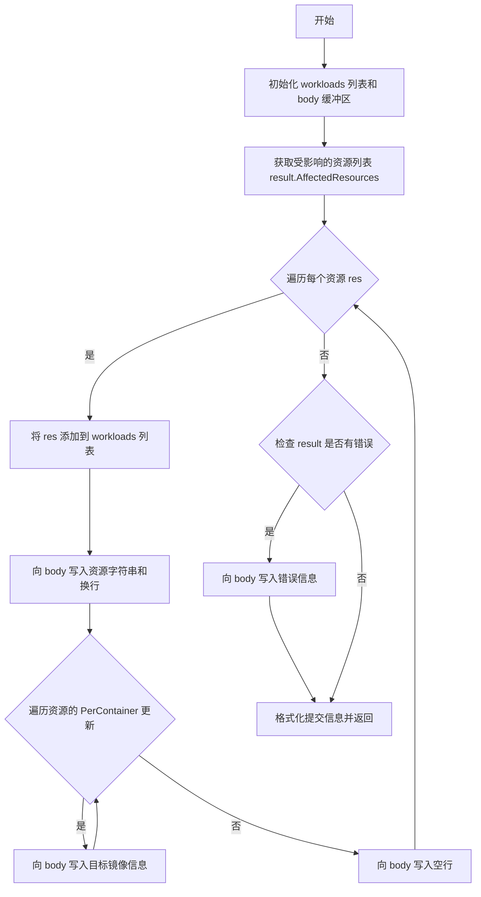

# `flux\pkg\update\release_containers.go` 详细设计文档

这是Flux CD项目中的容器发布更新模块，定义了ReleaseContainersSpec结构体用于描述容器镜像更新规范，核心功能是计算并执行容器镜像的发布更新，检查当前镜像与目标镜像是否匹配，处理镜像不匹配、容器未找到等边界情况，并生成相应的发布结果和提交信息。

## 整体流程



## 类结构

```
ReleaseContainersSpec (容器发布规范结构体)
├── 字段: Kind (ReleaseKind) - 发布类型
├── 字段: ContainerSpecs (map[resource.ID][]ContainerUpdate) - 容器更新规格映射
├── 字段: SkipMismatches (bool) - 是否跳过不匹配
├── 字段: Force (bool) - 是否强制更新
└── 方法: CalculateRelease, resultsError, filters, workloadUpdates, ReleaseKind, ReleaseType, CommitMessage
```

## 全局变量及字段


### `zeroImageRef`
    
空镜像引用，用于检查空规格

类型：`image.Ref`
    


### `ReleaseContainersSpec.Kind`
    
发布更新的类型

类型：`ReleaseKind`
    


### `ReleaseContainersSpec.ContainerSpecs`
    
资源ID到容器更新规格的映射

类型：`map[resource.ID][]ContainerUpdate`
    


### `ReleaseContainersSpec.SkipMismatches`
    
是否跳过镜像不匹配的容器

类型：`bool`
    


### `ReleaseContainersSpec.Force`
    
是否强制执行更新，忽略锁定状态

类型：`bool`
    
    

## 全局函数及方法


### `ReleaseContainersSpec.CalculateRelease`

该方法计算满足发布容器规范所需的控制器更新。它通过选择工作负载、生成工作负载更新并验证结果来执行发布计算。如果任何规范计算失败则返回错误，除非 `SkipMismatches` 设置为 true。

参数：

- `ctx`：`context.Context`，用于取消和超时的上下文
- `rc`：`ReleaseContext`，用于选择工作负载的发布上下文
- `logger`：`log.Logger`，用于记录日志的日志记录器

返回值：

- `[]*WorkloadUpdate`，需要应用的工作负载更新列表
- `Result`，发布操作的结果
- `error`，如果任何步骤失败则返回错误

#### 流程图

```mermaid
flowchart TD
    A[开始 CalculateRelease] --> B[创建空结果 Result{}]
    B --> C[调用 s.filters 获取预过滤器和后过滤器]
    C --> D{调用 rc.SelectWorkloads 筛选工作负载}
    D -->|成功| E[调用 s.workloadUpdates 生成更新]
    D -->|失败| F[返回 nil, results, err]
    E --> G[调用 s.resultsError 检查结果错误]
    G -->|有错误| H[返回 updates, results, 错误]
    G -->|无错误| I[返回 updates, results, nil]
    
    subgraph filters函数
    C1[获取所有容器规范资源ID] --> C2[创建 IncludeFilter]
    C2 --> C3{检查 s.Force 标志}
    C3 -->|Force=false| C4[返回 prefilter + LockedFilter + IgnoreFilter]
    C3 -->|Force=true| C5[返回 prefilter + 空后过滤器]
    end
    
    subgraph workloadUpdates函数
    E1[遍历所有工作负载] --> E2{获取容器信息}
    E2 -->|失败| E3[记录失败结果]
    E2 -->|成功| E4[构建容器映射]
    E4 --> E5[遍历容器规范]
    E5 --> E6{检查容器存在性}
    E6 -->|不存在| E7[添加到 notfound 列表]
    E6 -->|存在| E8{检查镜像匹配}
    E8 -->|不匹配| E9[添加到 mismatch 列表]
    E8 -->|匹配| E10{检查是否需要更新}
    E10 -->|无需更新| E11[跳过]
    E10 -->|需要更新| E12[添加到 containerUpdates]
    E7 --> E13[综合处理结果]
    E9 --> E13
    E11 --> E13
    E12 --> E13
    E13 -->|存在 notfound| E14[标记为失败]
    E13 -->|存在 mismatch 且不跳过| E15[标记为失败]
    E13 -->|containerUpdates为空| E16[标记为跳过]
    E13 -->|有更新| E17[标记为成功并添加到更新列表]
    end
    
    subgraph resultsError函数
    G1[遍历所有结果] --> G2[统计成功和失败数量]
    G2 --> G3{失败数 > 0?}
    G3 -->|是| G4[返回错误: cannot satisfy specs]
    G3 -->|否| G5{成功数 == 0?}
    G5 -->|是| G6[返回错误: no changes found]
    G5 -->|否| G7[返回 nil]
    end
```

#### 带注释源码

```go
// CalculateRelease 计算满足此规范所需的控制器更新。
// 如果任何规范计算失败则返回错误，除非 `SkipMismatches` 为 true。
func (s ReleaseContainersSpec) CalculateRelease(ctx context.Context, rc ReleaseContext,
	logger log.Logger) ([]*WorkloadUpdate, Result, error) {
	// 初始化结果对象，用于跟踪所有工作负载的发布状态
	results := Result{}
	
	// 获取预过滤器和后过滤器
	// 预过滤器用于包含特定资源ID的工作负载
	// 后过滤器用于排除锁定或忽略的工作负载（除非强制执行）
	prefilter, postfilter := s.filters()
	
	// 使用发布上下文选择符合条件的工作负载
	// 根据预过滤器和后过滤器筛选工作负载
	all, err := rc.SelectWorkloads(ctx, results, prefilter, postfilter)
	if err != nil {
		// 如果选择工作负载失败，返回错误
		return nil, results, err
	}
	
	// 根据规范计算需要执行的工作负载更新
	// 遍历所有工作负载，检查容器镜像是否需要更新
	updates := s.workloadUpdates(results, all)
	
	// 验证结果并返回相应的错误
	// 检查是否有失败的发布或没有成功的发布
	return updates, results, s.resultsError(results)
}
```


### `ReleaseContainersSpec.resultsError`

该方法用于检查发布结果中是否存在错误，统计成功和失败的工作负载数量，并在有失败或无任何成功更新时返回相应的错误信息。

参数：

- `results`：`Result`，包含所有工作负载更新结果的状态映射

返回值：`error`，如果存在失败则返回 "cannot satisfy specs" 错误，如果没有成功则返回 "no changes found" 错误，否则返回 nil

#### 流程图



#### 带注释源码

```go
// resultsError 检查结果映射中的错误，统计成功和失败的工作负载数量
// 参数:
//   - results: Result类型，包含所有工作负载的更新结果状态
//
// 返回值:
//   - error: 如果存在失败返回"cannot satisfy specs"错误，
//            如果没有成功返回"no changes found"错误，否则返回nil
func (s ReleaseContainersSpec) resultsError(results Result) error {
    // 初始化失败和成功计数器
    failures := 0
    successes := 0
    
    // 遍历所有结果，统计失败和成功的数量
    for _, res := range results {
        switch res.Status {
        case ReleaseStatusFailed:
            // 如果状态为失败，增加失败计数器
            failures++
        case ReleaseStatusSuccess:
            // 如果状态为成功，增加成功计数器
            successes++
        }
    }
    
    // 如果存在任何失败，返回错误
    // 表示无法满足发布规范
    if failures > 0 {
        return errors.New("cannot satisfy specs")
    }
    
    // 如果没有任何成功（即没有变化），返回错误
    // 表示没有找到需要更新的内容
    if successes == 0 {
        return errors.New("no changes found")
    }
    
    // 所有检查通过，返回nil表示无错误
    return nil
}
```


### `ReleaseContainersSpec.filters`

该方法根据发布容器规范构建预过滤器和后过滤器，用于筛选需要更新的工作负载。它从容器规范中提取资源ID创建包含过滤器，并根据是否强制执行决定是否添加锁定和忽略过滤器。

参数：
- 该方法无显式参数（接收者 `s ReleaseContainersSpec` 为隐式参数）

返回值：`([]WorkloadFilter, []WorkloadFilter)`，返回两个WorkloadFilter切片 - 第一个为预过滤器（包含基于资源ID的IncludeFilter），第二个为后过滤器（根据Force标志决定是否包含LockedFilter和IgnoreFilter）

#### 流程图

```mermaid
flowchart TD
    A[开始 filters 方法] --> B[遍历 ContainerSpecs 获取所有资源ID]
    B --> C[创建预过滤器: IncludeFilter{IDs: rids}]
    C --> D{检查 Force 标志}
    D -->|Force = false| E[返回预过滤器和后过滤器: LockedFilter + IgnoreFilter]
    D -->|Force = true| F[返回预过滤器和空后过滤器]
    E --> G[结束]
    F --> G
```

#### 带注释源码

```go
// filters 根据容器规范生成预过滤器和后过滤器
// 返回值：(预过滤器切片, 后过滤器切片)
func (s ReleaseContainersSpec) filters() ([]WorkloadFilter, []WorkloadFilter) {
	// 用于存储从ContainerSpecs中提取的所有资源ID
	var rids []resource.ID
	// 遍历容器规范映射，收集所有资源ID
	for rid := range s.ContainerSpecs {
		rids = append(rids, rid)
	}
	
	// 创建预过滤器：仅包含指定ID的工作负载
	pre := []WorkloadFilter{&IncludeFilter{IDs: rids}}

	// 如果不是强制更新模式，则添加后过滤器用于过滤锁定和忽略的工作负载
	if !s.Force {
		// 返回包含预过滤器、锁定过滤器和忽略过滤器的组合
		return pre, []WorkloadFilter{&LockedFilter{}, &IgnoreFilter{}}
	}
	
	// 强制更新模式下，返回预过滤器和空的后过滤器列表
	// 这意味着所有匹配的工作负载都会被考虑更新，不受锁定或忽略规则限制
	return pre, []WorkloadFilter{}
}
```


### `ReleaseContainersSpec.workloadUpdates`

该方法计算工作负载的容器更新，根据提供的容器规格检查每个工作负载的当前容器镜像，找出需要更新的工作负载，并记录每个工作负载的处理结果。

参数：

- `results`：`Result`，用于记录每个工作负载的处理结果（成功、失败或跳过）
- `all`：`[]*WorkloadUpdate`，所有工作负载的切片，包含需要检查的工作负载

返回值：`[]*WorkloadUpdate`，需要更新的工作负载切片，只包含有实际容器更新的工作负载

#### 流程图

```mermaid
flowchart TD
    A[开始 workloadUpdates] --> B[初始化空的updates切片]
    B --> C{遍历 all 中的每个工作负载 u}
    C --> D[获取工作负载的容器列表 ContainersOrError]
    D --> E{是否有错误?}
    E -->|是| F[记录失败状态到results<br/>跳过当前工作负载]
    E -->|否| G[构建容器映射 containers]
    F --> C
    G --> H{遍历 s.ContainerSpecs[u.ResourceID] 中的每个规格 spec}
    H --> I[检查容器是否存在于containers中]
    I --> J{容器是否存在?}
    J -->|否| K[将容器名添加到notfound列表<br/>继续下一个规格]
    J -->|是| L{检查当前镜像是否匹配}
    L --> M[spec.Current != zeroImageRef 且 container.Image != spec.Current]
    M -->|是| N[将容器名添加到mismatch列表<br/>继续下一个规格]
    M -->|否| O{检查目标镜像是否已是最新}
    O -->|container.Image == spec.Target| P[无需更新<br/>继续下一个规格]
    O -->|否| Q[将spec添加到containerUpdates]
    K --> H
    N --> H
    P --> H
    Q --> H
    R{遍历结束} --> S{根据notfound和mismatch处理结果}
    S --> T{len(notfound) > 0?}
    T -->|是| U[设置状态为ReleaseStatusFailed<br/>错误信息: ContainerNotFound]
    T -->|否| V{!s.SkipMismatches && len(mismatch) > 0?}
    V -->|是| W[设置状态为ReleaseStatusFailed<br/>错误信息: mismatchError]
    V -->|否| X{len(containerUpdates) == 0?}
    X -->|是| Y{检查skippedMismatches}
    Y -->|是| Z[设置状态为ReleaseStatusSkipped<br/>错误: mismatchError]
    Y -->|否| AA[设置状态为ReleaseStatusSkipped<br/>错误: ImageUpToDate]
    X -->|否| AB[设置u.Updates = containerUpdates<br/>将u添加到updates]
    AB --> AC{检查skippedMismatches}
    AC -->|是| AD[设置状态为ReleaseStatusSuccess<br/>错误: mismatchError]
    AC -->|否| AE[设置状态为ReleaseStatusSuccess<br/>错误: 空]
    U --> AF
    W --> AF
    Z --> AF
    AA --> AF
    AE --> AF
    AD --> AF
    AF{C是否遍历结束?}
    AF -->|否| C
    AF -->|是| AG[返回 updates 切片]
```

#### 带注释源码

```go
// workloadUpdates 计算需要更新的工作负载
// 参数:
//   - results: Result类型，用于记录每个工作负载的处理结果（成功/失败/跳过）
//   - all: []*WorkloadUpdate类型，所有工作负载的切片，包含需要检查的工作负载
//
// 返回值:
//   - []*WorkloadUpdate: 需要进行容器更新的工作负载切片
func (s ReleaseContainersSpec) workloadUpdates(results Result, all []*WorkloadUpdate) []*WorkloadUpdate {
	// 初始化空的更新切片，用于存储需要更新的工作负载
	var updates []*WorkloadUpdate
	
	// 遍历所有工作负载进行处理
	for _, u := range all {
		// 获取工作负载的容器列表，如果出错则记录失败结果并跳过
		cs, err := u.Workload.ContainersOrError()
		if err != nil {
			results[u.ResourceID] = WorkloadResult{
				Status: ReleaseStatusFailed,  // 设置状态为失败
				Error:  err.Error(),          // 记录错误信息
			}
			continue  // 跳过后续处理，继续下一个工作负载
		}

		// 将容器切片转换为映射，方便通过名称快速查找
		// 键为容器名称，值为容器对象
		containers := map[string]resource.Container{}
		for _, spec := range cs {
			containers[spec.Name] = spec
		}

		// 初始化用于收集问题的切片
		var mismatch, notfound []string      // mismatch: 镜像不匹配的容器; notfound: 不存在的容器
		var containerUpdates []ContainerUpdate  // 实际需要更新的容器列表
		
		// 遍历当前工作负载对应的容器规格
		for _, spec := range s.ContainerSpecs[u.ResourceID] {
			// 尝试从容器映射中获取指定容器
			container, ok := containers[spec.Container]
			if !ok {
				// 容器不存在，记录到notfound列表
				notfound = append(notfound, spec.Container)
				continue
			}

			// 检查镜像是否匹配前置条件
			// 空镜像规格(zeroImageRef)表示跳过前置条件检查
			if spec.Current != zeroImageRef && container.Image != spec.Current {
				// 镜像不匹配，记录到mismatch列表
				mismatch = append(mismatch, spec.Container)
				continue
			}

			// 检查目标镜像是否已是最新状态
			if container.Image == spec.Target {
				// 已是最新，无需更新
				continue
			}

			// 该容器需要更新，添加到更新列表
			containerUpdates = append(containerUpdates, spec)
		}

		// 格式化镜像不匹配错误信息
		mismatchError := fmt.Sprintf(ContainerTagMismatch, strings.Join(mismatch, ", "))

		// 根据检查结果设置处理状态
		var rerr string
		// 判断是否需要跳过不匹配的情况
		skippedMismatches := s.SkipMismatches && len(mismatch) > 0
		
		switch {
		case len(notfound) > 0:
			// 情况1: 容器不存在或名称错误 - 总是失败
			results[u.ResourceID] = WorkloadResult{
				Status: ReleaseStatusFailed,
				Error:  fmt.Sprintf(ContainerNotFound, strings.Join(notfound, ", ")),
			}
		case !s.SkipMismatches && len(mismatch) > 0:
			// 情况2: 有镜像不匹配且不允许跳过 - 失败
			results[u.ResourceID] = WorkloadResult{
				Status: ReleaseStatusFailed,
				Error:  mismatchError,
			}
		case len(containerUpdates) == 0:
			// 情况3: 没有需要更新的容器 - 跳过
			rerr = ImageUpToDate  // 默认消息：镜像已是最新
			if skippedMismatches {
				// 如果因跳过不匹配而没有更新，使用不匹配错误信息
				rerr = mismatchError
			}
			results[u.ResourceID] = WorkloadResult{
				Status: ReleaseStatusSkipped,
				Error:  rerr,
			}
		default:
			// 情况4: 有需要更新的容器 - 成功
			rerr = ""
			if skippedMismatches {
				// 虽然成功，但仍需告知客户端有不匹配情况
				rerr = mismatchError
			}
			// 将容器更新设置到工作负载上
			u.Updates = containerUpdates
			// 添加到更新列表
			updates = append(updates, u)
			// 记录成功状态和每个容器的更新详情
			results[u.ResourceID] = WorkloadResult{
				Status:       ReleaseStatusSuccess,
				Error:        rerr,
				PerContainer: u.Updates,
			}
		}
	}

	// 返回需要更新的工作负载切片
	return updates
}
```


### `ReleaseContainersSpec.ReleaseKind`

该方法用于获取发布容器的规格类型（ReleaseKind），属于 `ReleaseContainersSpec` 结构体的访问器方法，无参数输入，直接返回结构体中存储的 `Kind` 字段值。

参数： 无

返回值：`ReleaseKind`，返回发布类型的枚举值，表示本次发布的种类（如：升级、降级、回滚等）

#### 流程图



#### 带注释源码

```go
// ReleaseKind 返回发布容器的规格类型
// 该方法是 ReleaseContainersSpec 结构体的访问器方法
// 用于获取在创建发布时指定的 ReleaseKind 值
func (s ReleaseContainersSpec) ReleaseKind() ReleaseKind {
	return s.Kind  // 直接返回结构体中存储的 Kind 字段
}
```

#### 补充信息

**关键组件信息：**

- `ReleaseKind`：发布类型枚举值，定义在 `update` 包中，用于标识发布的种类
- `ReleaseContainersSpec.Kind`：结构体字段，存储发布类型的具体值

**技术债务/优化空间：**

- 该方法为简单的访问器方法（Getter），在 Go 语言中可直接通过导出字段访问，但保留此方法可能是为了实现某个接口或保持 API 一致性
- 建议检查是否有必要保留此方法，若无需实现接口，可考虑直接访问 `Kind` 字段

**设计目标与约束：**

- 该方法遵循 Go 语言的命名规范，以大写字母开头表示可导出
- 返回值类型 `ReleaseKind` 应为预定义的类型别名或枚举类型

**接口契约：**

- 此方法可能是某个接口（如 `ReleaseSpec`）的实现部分，用于多态处理不同类型的发布规格


### `ReleaseContainersSpec.ReleaseType`

获取发布类型字符串，用于标识当前 Release 规范对应的发布类型为容器发布。

参数： 无

返回值： `ReleaseType`，返回 `"containers"` 字符串，表示该发布类型为容器镜像更新。

#### 流程图

```mermaid
flowchart TD
    A[开始 ReleaseType 方法] --> B{执行方法体}
    B --> C[返回常量字符串 "containers"]
    C --> D[结束方法, 返回 ReleaseType 类型值]
```

#### 带注释源码

```go
// ReleaseType 返回该发布规范的类型标识
// 在 Flux 的发布系统中，不同的发布类型（如容器、服务等）通过此方法区分
// 此方法对应 ReleaseContainersSpec，即容器镜像的发布更新
func (s ReleaseContainersSpec) ReleaseType() ReleaseType {
	// 返回固定字符串 "containers"，标识此发布规范用于更新容器镜像
	// ReleaseType 类型通常为 string 的别名，用于类型安全和语义化表达
	return "containers"
}
```


### `ReleaseContainersSpec.CommitMessage`

该方法根据更新结果生成提交消息，遍历受影响的资源及其容器更新，格式化输出包含资源名称、目标镜像和错误信息的提交正文，最终返回格式化的提交消息字符串。

参数：
- `result`：`Result`，包含发布更新的结果信息，包括每个资源的状态和容器更新详情

返回值：`string`，生成的提交消息，包含资源列表和详细的更新或错误信息

#### 流程图



#### 带注释源码

```go
// CommitMessage 根据更新结果生成提交消息
// 参数 result: 包含发布更新结果的 Result 对象
// 返回: 格式化的提交消息字符串
func (s ReleaseContainersSpec) CommitMessage(result Result) string {
    // 用于存储资源名称的切片
    var workloads []string
    // 用于构建消息正文的缓冲区
    body := &bytes.Buffer{}
    
    // 遍历所有受影响的资源
    for _, res := range result.AffectedResources() {
        // 将资源名称添加到切片
        workloads = append(workloads, res.String())
        // 写入资源名称到消息正文
        fmt.Fprintf(body, "\n%s", res)
        
        // 遍历该资源下的每个容器更新
        for _, upd := range result[res].PerContainer {
            // 写入目标镜像到消息正文
            fmt.Fprintf(body, "\n- %s", upd.Target)
        }
        // 写入换行符
        fmt.Fprintln(body)
    }
    
    // 检查结果中是否有错误
    if err := result.Error(); err != "" {
        // 如果有错误，将错误信息写入消息正文
        fmt.Fprintf(body, "\n%s", result.Error())
    }
    
    // 格式化并返回最终的提交消息
    // 格式: "Update image refs in {资源列表}\n{详情}"
    return fmt.Sprintf("Update image refs in %s\n%s", strings.Join(workloads, ", "), body.String())
}
```

---

### 补充信息

#### 文件整体运行流程

`ReleaseContainersSpec` 是 Flux CD 项目中用于处理容器镜像更新的核心类型。其运行流程如下：

1. `CalculateRelease` 方法作为入口，调用 `filters()` 获取预过滤器和后过滤器
2. 通过 `SelectWorkloads` 选择需要更新的工作负载
3. `workloadUpdates` 方法逐个处理工作负载，比较当前镜像与目标镜像，计算更新
4. `CommitMessage` 方法在更新完成后生成人类可读的提交消息

#### 关键组件信息

| 名称 | 描述 |
|------|------|
| `ReleaseContainersSpec` | 容器发布规范，包含发布类型、容器更新规范和跳过不匹配的选项 |
| `Result` | 发布结果映射，键为资源ID，值为发布状态和详情 |
| `WorkloadUpdate` | 工作负载更新对象，包含资源ID、工作负载和更新列表 |
| `ContainerUpdate` | 容器更新规范，包含容器名、当前镜像和目标镜像 |

#### 潜在的技术债务或优化空间

1. **字符串拼接效率**：使用 `fmt.Fprintf` 多次写入 `bytes.Buffer`，可考虑使用 `strings.Builder` 提升性能
2. **错误处理**：当前仅返回字符串格式的错误，建议定义专用错误类型以支持国际化
3. **可测试性**：方法依赖 `result.Error()` 和 `result.AffectedResources()`，建议提取接口以便于单元测试

#### 其它项目

**设计目标与约束**：
- 支持部分更新（当 `SkipMismatches` 为 true 时）
- 支持强制更新（忽略锁定状态）
- 生成的提交消息需兼容 Git 提交格式

**数据流与状态机**：
- 状态流转：`ReleaseStatusFailed` → `ReleaseStatusSkipped` → `ReleaseStatusSuccess`
- 失败条件：容器未找到、镜像不匹配且不允许跳过
- 跳过条件：镜像已是最新的或不匹配但允许跳过

**外部依赖与接口契约**：
- 依赖 `image.Ref` 表示镜像引用
- 依赖 `resource.ID` 和 `resource.Container` 表示资源和容器
- 依赖 `Result` 接口的 `AffectedResources()` 和 `Error()` 方法


### `ReleaseContainersSpec.CalculateRelease`

该方法计算并返回满足容器发布规范所需的控制器更新，通过筛选工作负载、比对容器镜像、处理匹配和未匹配情况，最终返回需要执行的工作负载更新列表及结果状态。

参数：
- `ctx`：`context.Context`，请求上下文，用于控制超时和取消
- `rc`：`ReleaseContext`，发布上下文接口，提供工作负载选择能力
- `logger`：`log.Logger`，日志记录器，用于输出调试信息

返回值：
- `[]*WorkloadUpdate`，需要执行的工作负载更新列表
- `results`：`Result`，发布操作的结果映射，包含每个资源的发布状态
- `error`，如果在计算过程中发生错误或结果不符合预期（如全部失败或无变化），则返回错误

#### 流程图



#### 带注释源码

```go
// CalculateRelease 计算满足发布规范所需的控制器更新
// 返回工作负载更新列表、结果映射和可能出现的错误
// 核心逻辑：筛选工作负载 -> 比对容器镜像 -> 生成更新 -> 验证结果
func (s ReleaseContainersSpec) CalculateRelease(ctx context.Context, rc ReleaseContext,
	logger log.Logger) ([]*WorkloadUpdate, Result, error) {
	// 1. 初始化结果映射，用于记录每个资源的发布状态
	results := Result{}
	
	// 2. 获取预过滤器和后过滤器
	// 预过滤器：包含指定资源ID的工作负载
	// 后过滤器：排除被锁定或忽略的工作负载（非强制模式）
	prefilter, postfilter := s.filters()
	
	// 3. 使用发布上下文选择符合条件的工作负载
	// SelectWorkloads 会应用预过滤和后过滤条件
	all, err := rc.SelectWorkloads(ctx, results, prefilter, postfilter)
	if err != nil {
		// 如果选择工作负载失败，直接返回错误
		return nil, results, err
	}
	
	// 4. 计算每个工作负载的具体更新内容
	// 包括容器镜像比对、状态记录等
	updates := s.workloadUpdates(results, all)
	
	// 5. 验证结果状态，检查是否有失败或无变化的情况
	return updates, results, s.resultsError(results)
}

// resultsError 检查结果映射中的状态
// 判断是否存在失败或成功的情况，用于决定是否需要返回错误
func (s ReleaseContainersSpec) resultsError(results Result) error {
	failures := 0
	successes := 0
	// 遍历所有结果，统计失败和成功数量
	for _, res := range results {
		switch res.Status {
		case ReleaseStatusFailed:
			failures++
		case ReleaseStatusSuccess:
			successes++
		}
	}
	
	// 如果存在失败，返回错误（无法满足规范）
	if failures > 0 {
		return errors.New("cannot satisfy specs")
	}
	
	// 如果没有任何成功变化，返回错误（没有需要更新的内容）
	if successes == 0 {
		return errors.New("no changes found")
	}
	
	// 全部成功，无错误
	return nil
}

// filters 生成用于筛选工作负载的过滤器列表
// 预过滤器：强制包含指定资源ID的工作负载
// 后过滤器：根据Force标志决定是否应用锁定和忽略规则
func (s ReleaseContainersSpec) filters() ([]WorkloadFilter, []WorkloadFilter) {
	// 从容器规范中提取所有资源ID
	var rids []resource.ID
	for rid := range s.ContainerSpecs {
		rids = append(rids, rid)
	}
	
	// 预过滤器：只包含在规范中指定的资源
	pre := []WorkloadFilter{&IncludeFilter{IDs: rids}}

	// 如果不是强制模式，添加后过滤器排除锁定或忽略的工作负载
	if !s.Force {
		return pre, []WorkloadFilter{&LockedFilter{}, &IgnoreFilter{}}
	}
	
	// 强制模式下不过滤任何工作负载
	return pre, []WorkloadFilter{}
}

// workloadUpdates 计算每个工作负载的具体容器更新
// 核心逻辑：获取工作负载容器 -> 比对镜像 -> 生成更新列表
func (s ReleaseContainersSpec) workloadUpdates(results Result, all []*WorkloadUpdate) []*WorkloadUpdate {
	var updates []*WorkloadUpdate
	
	// 遍历所有筛选出的工作负载
	for _, u := range all {
		// 尝试获取工作负载的容器列表
		cs, err := u.Workload.ContainersOrError()
		if err != nil {
			// 获取失败，记录失败状态并继续处理下一个工作负载
			results[u.ResourceID] = WorkloadResult{
				Status: ReleaseStatusFailed,
				Error:  err.Error(),
			}
			continue
		}

		// 将容器列表转换为映射，方便通过名称查找
		containers := map[string]resource.Container{}
		for _, spec := range cs {
			containers[spec.Name] = spec
		}

		// 用于记录不匹配和未找到的容器
		var mismatch, notfound []string
		var containerUpdates []ContainerUpdate
		
		// 遍历当前工作负载的更新规范
		for _, spec := range s.ContainerSpecs[u.ResourceID] {
			// 检查规范中指定的容器是否存在于工作负载中
			container, ok := containers[spec.Container]
			if !ok {
				// 容器不存在，记录并跳过
				notfound = append(notfound, spec.Container)
				continue
			}

			// 检查当前镜像是否符合前置条件（如果指定了非空镜像）
			// 空镜像ref表示跳过前置检查
			if spec.Current != zeroImageRef && container.Image != spec.Current {
				// 镜像不匹配，记录并跳过
				mismatch = append(mismatch, spec.Container)
				continue
			}

			// 如果镜像已经等于目标镜像，无需更新
			if container.Image == spec.Target {
				// Nothing to update
				continue
			}

			// 添加到待更新列表
			containerUpdates = append(containerUpdates, spec)
		}

		// 构建镜像不匹配错误信息
		mismatchError := fmt.Sprintf(ContainerTagMismatch, strings.Join(mismatch, ", "))

		var rerr string
		// 判断是否跳过不匹配的情况
		skippedMismatches := s.SkipMismatches && len(mismatch) > 0
		
		// 根据不同情况设置结果状态
		switch {
		case len(notfound) > 0:
			// 容器未找到或名称错误，总是失败
			results[u.ResourceID] = WorkloadResult{
				Status: ReleaseStatusFailed,
				Error:  fmt.Sprintf(ContainerNotFound, strings.Join(notfound, ", ")),
			}
		case !s.SkipMismatches && len(mismatch) > 0:
			// 不跳过不匹配时，镜像不一致导致失败
			results[u.ResourceID] = WorkloadResult{
				Status: ReleaseStatusFailed,
				Error:  mismatchError,
			}
		case len(containerUpdates) == 0:
			// 没有需要更新的容器，标记为跳过
			rerr = ImageUpToDate
			if skippedMismatches {
				rerr = mismatchError
			}
			results[u.ResourceID] = WorkloadResult{
				Status: ReleaseStatusSkipped,
				Error:  rerr,
			}
		default:
			// 有实际更新，执行更新
			rerr = ""
			if skippedMismatches {
				// 部分不匹配但已成功更新，通知客户端
				rerr = mismatchError
			}
			u.Updates = containerUpdates
			updates = append(updates, u)
			results[u.ResourceID] = WorkloadResult{
				Status:       ReleaseStatusSuccess,
				Error:        rerr,
				PerContainer: u.Updates,
			}
		}
	}

	return updates
}
```


### `ReleaseContainersSpec.resultsError`

该方法用于检查容器发布结果中的失败和成功数量，当存在失败时返回"cannot satisfy specs"错误，当没有成功更新时返回"no changes found"错误，确保发布操作满足预期结果。

参数：

- `results`：`Result`，结果映射表，包含每个资源 ID 对应的工作负载更新结果（包含状态、错误信息等）

返回值：`error`，如果存在失败则返回"cannot satisfy specs"错误，如果没有成功更新则返回"no changes found"错误，否则返回 nil（表示验证通过）

#### 流程图


#### 带注释源码

```go
// resultsError 检查结果中的失败和成功数量，返回相应错误
// 该方法确保发布操作满足基本要求：不能有失败，且至少要有一个成功的更新
func (s ReleaseContainersSpec) resultsError(results Result) error {
	// 初始化失败和成功计数器
	failures := 0
	successes := 0
	
	// 遍历所有结果，统计失败和成功的数量
	for _, res := range results {
		switch res.Status {
		case ReleaseStatusFailed:
			// 记录失败状态的工作负载
			failures++
		case ReleaseStatusSuccess:
			// 记录成功状态的工作负载
			successes++
		}
	}
	
	// 如果存在任何失败的操作，返回错误
	// 这表示无法满足发布规范，因为有容器更新失败
	if failures > 0 {
		return errors.New("cannot satisfy specs")
	}
	
	// 如果没有任何成功的更新，返回错误
	// 这表示没有发现需要处理的变更
	if successes == 0 {
		return errors.New("no changes found")
	}
	
	// 检查通过，没有错误
	return nil
}
```


### `ReleaseContainersSpec.filters`

该方法根据 `ReleaseContainersSpec` 中的容器规范生成预过滤器和后过滤器，用于在选择工作负载时进行筛选控制。预过滤器始终包含一个 `IncludeFilter`，用于限定只处理 `ContainerSpecs` 中指定的工作负载；后过滤器根据 `Force` 字段决定是否包含 `LockedFilter` 和 `IgnoreFilter` 来排除被锁定或忽略的工作负载。

参数：该方法为结构体方法，使用接收者 `s` 传递 `ReleaseContainersSpec` 实例，无需额外参数。

- `s`：`ReleaseContainersSpec`，方法接收者，包含容器更新规范配置

返回值：返回两个 `WorkloadFilter` 切片，分别用于预过滤和后过滤工作负载。

- `([]WorkloadFilter, []WorkloadFilter)`：第一个数组为预过滤器列表，第二个数组为后过滤器列表。预过滤器始终包含 `IncludeFilter`，后过滤器在非强制模式下包含 `LockedFilter` 和 `IgnoreFilter`，强制模式下为空数组。

#### 流程图



#### 带注释源码

```go
// filters 方法生成预过滤器和后过滤器，用于选择需要更新容器的工作负载
// 预过滤器：决定哪些工作负载可以被考虑处理
// 后过滤器：决定哪些被考虑的工作负载最终被排除
func (s ReleaseContainersSpec) filters() ([]WorkloadFilter, []WorkloadFilter) {
	// 步骤1：从 ContainerSpecs 中提取所有的资源 ID
	// ContainerSpecs 的 key 是 resource.ID，value 是该资源对应的容器更新规范列表
	var rids []resource.ID
	for rid := range s.ContainerSpecs {
		rids = append(rids, rid)
	}

	// 步骤2：创建预过滤器 IncludeFilter
	// IncludeFilter 确保只处理在 ContainerSpecs 中明确指定的工作负载
	// 这样可以避免处理无关的工作负载，提高效率
	pre := []WorkloadFilter{&IncludeFilter{IDs: rids}}

	// 步骤3：根据 Force 标志决定后过滤器
	// Force 为 true 时：强制更新，忽略所有锁定和忽略标记
	// Force 为 false 时：正常模式，应用锁定和忽略策略
	if !s.Force {
		// 非强制模式：返回包含 LockedFilter 和 IgnoreFilter 的后过滤器数组
		// LockedFilter：排除被锁定的资源，禁止更新
		// IgnoreFilter：忽略被标记为忽略的资源
		return pre, []WorkloadFilter{&LockedFilter{}, &IgnoreFilter{}}
	}

	// 强制模式：返回空的后过滤器数组，允许更新所有指定的工作负载
	// 即使这些工作负载被锁定或被标记为忽略
	return pre, []WorkloadFilter{}
}
```


### `ReleaseContainersSpec.workloadUpdates`

该方法负责计算所有工作负载的容器更新，通过遍历每个工作负载的容器规格，验证容器存在性和镜像匹配情况，最终生成需要更新的容器列表并填充结果状态。

参数：

- `results`：`Result`，用于记录每个工作负载的释放结果（成功、失败或跳过）
- `all`：`[]*WorkloadUpdate`，所有需要处理的工作负载更新列表

返回值：`[]*WorkloadUpdate`，返回包含实际容器更新操作的工作负载更新列表

#### 流程图



#### 带注释源码

```go
// workloadUpdates 计算所有工作负载的容器更新
// 参数:
//   - results: 用于记录每个工作负载的释放结果（成功/失败/跳过）
//   - all: 所有需要处理的工作负载更新列表
// 返回值:
//   - []*WorkloadUpdate: 包含需要执行更新操作的工作负载列表
func (s ReleaseContainersSpec) workloadUpdates(results Result, all []*WorkloadUpdate) []*WorkloadUpdate {
    // 初始化更新列表，用于存储需要实际更新的工作负载
    var updates []*WorkloadUpdate

    // 遍历所有工作负载
    for _, u := range all {
        // 获取工作负载的容器列表，如果出错则记录失败并跳过
        cs, err := u.Workload.ContainersOrError()
        if err != nil {
            results[u.ResourceID] = WorkloadResult{
                Status: ReleaseStatusFailed, // 标记为失败状态
                Error:  err.Error(),         // 记录错误信息
            }
            continue // 继续处理下一个工作负载
        }

        // 将容器切片转换为 map，以容器名称为键便于快速查找
        containers := map[string]resource.Container{}
        for _, spec := range cs {
            containers[spec.Name] = spec
        }

        // 初始化容器不匹配和未找到的列表
        var mismatch, notfound []string
        // 初始化需要更新的容器列表
        var containerUpdates []ContainerUpdate

        // 遍历该工作负载对应的所有容器规格
        for _, spec := range s.ContainerSpecs[u.ResourceID] {
            // 查找容器是否存在于工作负载中
            container, ok := containers[spec.Container]
            if !ok {
                // 容器未找到，记录并继续
                notfound = append(notfound, spec.Container)
                continue
            }

            // 检查镜像是否匹配前置条件（如果指定了当前镜像）
            // 空镜像规格表示跳过前置条件检查
            if spec.Current != zeroImageRef && container.Image != spec.Current {
                mismatch = append(mismatch, spec.Container)
                continue
            }

            // 如果当前镜像已等于目标镜像，则无需更新
            if container.Image == spec.Target {
                continue
            }

            // 添加到需要更新的列表
            containerUpdates = append(containerUpdates, spec)
        }

        // 格式化镜像不匹配错误信息
        mismatchError := fmt.Sprintf(ContainerTagMismatch, strings.Join(mismatch, ", "))

        // 根据不同情况设置结果状态
        var rerr string
        // 判断是否跳过不匹配（当配置允许跳过且存在不匹配时）
        skippedMismatches := s.SkipMismatches && len(mismatch) > 0

        switch {
        case len(notfound) > 0:
            // 容器消失或拼写错误时总是失败
            results[u.ResourceID] = WorkloadResult{
                Status: ReleaseStatusFailed,
                Error:  fmt.Sprintf(ContainerNotFound, strings.join(notfound, ", ")),
            }

        case !s.SkipMismatches && len(mismatch) > 0:
            // 不跳过不匹配时失败；否则部分更新成功或标记为跳过
            results[u.ResourceID] = WorkloadResult{
                Status: ReleaseStatusFailed,
                Error:  mismatchError,
            }

        case len(containerUpdates) == 0:
            // 没有需要更新的容器
            rerr = ImageUpToDate
            if skippedMismatches {
                rerr = mismatchError
            }
            results[u.ResourceID] = WorkloadResult{
                Status: ReleaseStatusSkipped, // 标记为跳过
                Error:  rerr,
            }

        default:
            // 存在需要更新的容器
            rerr = ""
            if skippedMismatches {
                // 虽然成功，但仍需告知客户端存在不匹配的容器
                rerr = mismatchError
            }
            // 将更新赋值给工作负载
            u.Updates = containerUpdates
            // 添加到更新列表
            updates = append(updates, u)
            results[u.ResourceID] = WorkloadResult{
                Status:       ReleaseStatusSuccess, // 标记为成功
                Error:        rerr,
                PerContainer: u.Updates, // 记录每个容器的更新详情
            }
        }
    }

    // 返回包含实际更新操作的工作负载列表
    return updates
}
```


### `ReleaseContainersSpec.ReleaseKind`

该方法用于获取发布容器的具体类型（ReleaseKind），直接返回 `ReleaseContainersSpec` 结构体中存储的 `Kind` 字段值。

参数：

- （无额外参数，隐式接收者 `s` 为 `ReleaseContainersSpec` 类型）

返回值：`ReleaseKind`，返回发布类型，标识具体的发布操作类型（如自动化发布、手动发布等）。

#### 流程图



#### 带注释源码

```go
// ReleaseKind 返回发布容器的类型
// 这是一个接口方法实现，用于多态地获取不同发布规格的类型
// s: ReleaseContainersSpec 的实例，包含发布的相关配置信息
func (s ReleaseContainersSpec) ReleaseKind() ReleaseKind {
	return s.Kind // 直接返回结构体中存储的 ReleaseKind 类型值
}
```


### `ReleaseContainersSpec.ReleaseType`

该方法返回发布类型的字符串表示，用于标识此发布规范为容器类型的发布操作。

参数：无（仅包含接收者 `s ReleaseContainersSpec`）

返回值：`ReleaseType`，返回字符串 `"containers"` 表示容器发布类型

#### 流程图



#### 带注释源码

```go
// ReleaseType 返回发布类型的字符串表示。
// 该方法实现了 ReleaseSpec 接口，用于标识当前发布规范的类型为容器发布。
// 返回值始终为字符串 "containers"，对应 ReleaseType 类型。
func (s ReleaseContainersSpec) ReleaseType() ReleaseType {
	return "containers"
}
```

#### 详细说明

| 项目 | 说明 |
|------|------|
| **所属类** | `ReleaseContainersSpec` |
| **方法类型** | 值接收者 (value receiver) |
| **接口实现** | 实现 `ReleaseSpec` 接口的 `ReleaseType()` 方法 |
| **功能说明** | 这是一个简单的方法，用于返回发布规范的类型标识符。在 Fluxcd 的更新框架中，不同的发布类型（如 `containers`、` Helm` 等）通过此方法区分。该方法直接返回预定义的字符串常量，无需任何计算或状态检查。 |
| **调用场景** | 通常在处理发布请求时用于判断发布类型，或在日志/错误信息中标识发布规范类型。 |


### `ReleaseContainersSpec.CommitMessage`

该方法根据发布更新的结果生成 Git 提交信息，遍历所有受影响的资源及其容器更新，格式化为人类可读的提交描述，包含更新的工作负载列表、具体的容器镜像目标以及可能的错误信息。

参数：

- `result`：`Result`，包含发布操作的结果数据，包括受影响的资源列表和每个资源的更新详情

返回值：`string`，生成的 Git 提交信息，格式为 "Update image refs in {workloads}\n{details}"

#### 流程图



#### 带注释源码

```go
// CommitMessage 根据发布结果生成 Git 提交信息
// 参数 result: 包含所有资源更新结果的 Result 对象
// 返回: 格式化的提交信息字符串
func (s ReleaseContainersSpec) CommitMessage(result Result) string {
    // 初始化工作负载名称列表，用于提交信息的主题行
	var workloads []string
    // 使用 buffer 缓冲构建提交信息的正文部分
	body := &bytes.Buffer{}
    
    // 遍历所有受影响的资源
	for _, res := range result.AffectedResources() {
        // 收集资源名称用于后续格式化
		workloads = append(workloads, res.String())
        // 写入资源标识到正文
		fmt.Fprintf(body, "\n%s", res)
        
        // 遍历该资源下的每个容器更新
		for _, upd := range result[res].PerContainer {
            // 写入目标镜像信息（格式: "- 目标镜像"）
			fmt.Fprintf(body, "\n- %s", upd.Target)
		}
        // 每个资源块后添加空行分隔
		fmt.Fprintln(body)
	}
    
    // 检查是否存在错误，若有则添加到提交信息末尾
	if err := result.Error(); err != "" {
		fmt.Fprintf(body, "\n%s", result.Error())
	}
    
    // 组装最终提交信息: 主题行 + 正文
    // 主题行格式: "Update image refs in workload1, workload2, ..."
	return fmt.Sprintf("Update image refs in %s\n%s", strings.Join(workloads, ", "), body.String())
}
```

## 关键组件


### ReleaseContainersSpec 结构体

定义容器发布规范的规格，包含发布类型、容器更新映射、跳过不匹配标志和强制更新标志。

### CalculateRelease 方法

计算满足规格所需的控制器更新，返回工作负载更新列表、结果和错误。核心逻辑包括选择工作负载、计算更新和处理结果错误。

### filters 方法

根据容器规范ID创建预过滤器和后过滤器，支持按资源ID包含和排除工作负载，实现锁定和忽略过滤逻辑。

### workloadUpdates 方法

计算实际的工作负载更新，遍历所有工作负载并匹配容器规格，处理容器找不到、镜像不匹配等场景，生成容器更新列表。

### resultsError 方法

检查结果中的失败和成功状态，返回错误信息当有失败或没有成功时。

### 容器镜像匹配逻辑

比较当前镜像与规格中的当前镜像，处理空规格跳过前置条件，支持目标镜像已是最新的情况。

### 错误处理机制

处理三种状态：失败（容器不存在或镜像不匹配）、跳过（无更新或跳过不匹配）、成功（部分或全部更新），并在结果中记录详细信息。

### SkipMismatches 策略

允许在镜像不匹配时继续执行部分更新，同时记录不匹配信息，适用于灰度发布或渐进式更新场景。

### Force 策略

绕过锁定和忽略过滤器，强制执行更新，适用于紧急修复或完全同步场景。

### CommitMessage 方法

生成包含受影响工作负载和更新的Git提交消息，格式化输出每个资源的变更详情。


## 问题及建议


### 已知问题

- **错误处理不规范**：`rerr`变量使用字符串而非`error`类型，违反了Go的错误处理最佳实践，降低了错误可追溯性
- **魔法字符串**：存在硬编码的字符串（如"cannot satisfy specs"、"no changes found"等），分散在代码各处，不利于维护和国际化
- **未使用的参数**：`CalculateRelease`方法接收`logger log.Logger`参数但从未使用，导致接口不一致
- **上下文未充分利用**：`ctx context.Context`参数被接收但在实际逻辑中未使用，无法实现超时控制和取消传播
- **重复代码**：`mismatchError`字符串在多个分支中重复构建，应提取为方法或使用模板
- **类型断言风险**：`results[u.ResourceID] = WorkloadResult{...}`直接赋值，当`u.ResourceID`不存在时会创建新的map条目而非检查
- **缺少单元测试**：整个文件没有任何测试代码，无法保证关键业务逻辑的正确性

### 优化建议

- 将所有硬编码错误字符串提取为包级别的常量或枚举
- 将`rerr`字符串改为返回`error`类型，统一错误处理模式
- 若`logger`参数暂不需要，应从方法签名中移除，避免误导
- 在`workloadUpdates`中添加context超时检查，确保长时间运行可被中断
- 提取`mismatchError`构建逻辑为独立方法，减少代码重复
- 添加`Result`类型的nil检查和防御性编程
- 补充单元测试覆盖主要业务场景（成功、更新、跳过、失败等）

## 其它


### 设计目标与约束

本代码的设计目标是实现一个灵活的容器镜像发布机制，支持按需更新指定工作负载中的容器镜像。核心约束包括：1）必须通过ReleaseContext获取工作负载信息；2）支持跳过镜像不匹配的情况；3）强制更新模式下绕过锁和忽略过滤器；4）每个容器只能进行一次目标镜像更新。

### 错误处理与异常设计

代码采用显式错误返回和结果状态记录两种方式处理异常。CalculateRelease方法返回error表示执行失败；WorkloadResult结构包含Status字段（Failed/Success/Skipped）和Error字段记录具体错误信息。关键错误场景包括：容器不存在（ContainerNotFound）、镜像不匹配（ContainerTagMismatch）、无可用更新（ImageUpToDate）。当SkipMismatches为true时，镜像不匹配不导致失败而是标记为跳过。

### 数据流与状态机

数据流为：ReleaseContainersSpec -> filters()获取工作负载过滤器 -> SelectWorkloads查询目标工作负载 -> workloadUpdates()逐个计算更新 -> 返回WorkloadUpdate列表和Result结果集。结果状态机包含三种状态：ReleaseStatusFailed（失败）、ReleaseStatusSuccess（成功）、ReleaseStatusSkipped（跳过）。状态转换条件取决于容器是否存在、镜像是否匹配、是否有可用更新。

### 外部依赖与接口契约

依赖包括：1）context.Context用于超时和取消控制；2）github.com/go-kit/kit/log.Logger用于日志记录；3）github.com/fluxcd/flux/pkg/image提供镜像引用类型；4）github.com/fluxcd/flux/pkg/resource提供资源ID和容器类型。接口契约：ReleaseContext必须实现SelectWorkloads方法；Workload必须实现ContainersOrError方法；结果映射使用resource.ID作为键。

### 性能考虑

当前实现使用map结构存储容器信息，查找复杂度为O(1)。潜在性能瓶颈：1）filters()每次调用都遍历ContainerSpecs构建ID切片；2）workloadUpdates()对每个工作负载都创建containers map。建议：对于大规模工作负载场景，可缓存filters()结果；在ContainerSpecs较大时考虑使用更高效的数据结构。

### 安全性考虑

代码不直接涉及敏感数据处理，但存在间接安全考量：1）Force模式允许绕过LockedFilter，可能导致意外更新生产环境工作负载；2）SkipMismatches模式跳过镜像校验，可能发布不一致版本。建议在UI层面添加Force和SkipMismatches的确认提示。

### 并发与线程安全

ReleaseContainersSpec作为值类型传递，不涉及并发修改。Result类型为map，在多协程场景下需要自行保证并发安全。SelectWorkloads调用可能涉及并发访问，由ReleaseContext实现类控制。

### 配置参数说明

ReleaseContainersSpec字段：Kind（ReleaseKind类型，发布类型标识）、ContainerSpecs（map类型，资源ID到容器更新规范的映射）、SkipMismatches（bool，跳过镜像不匹配）、Force（bool，强制更新绕过锁定）。

### 测试策略建议

应覆盖场景：1）正常镜像更新流程；2）容器不存在错误；3）镜像不匹配错误；4）SkipMismatches为true时的不匹配处理；5）Force模式绕过过滤器；6）无可用更新时的跳过状态；7）空ContainerSpecs处理；8）CommitMessage生成格式验证。

    