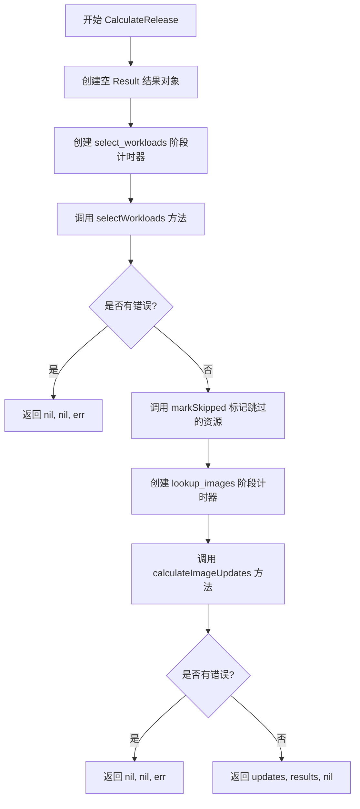
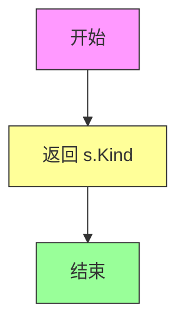
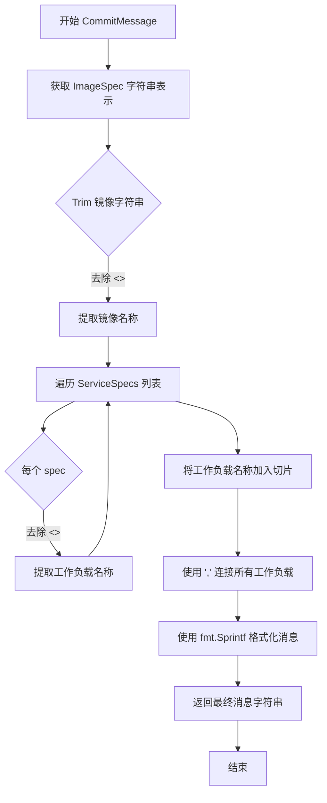
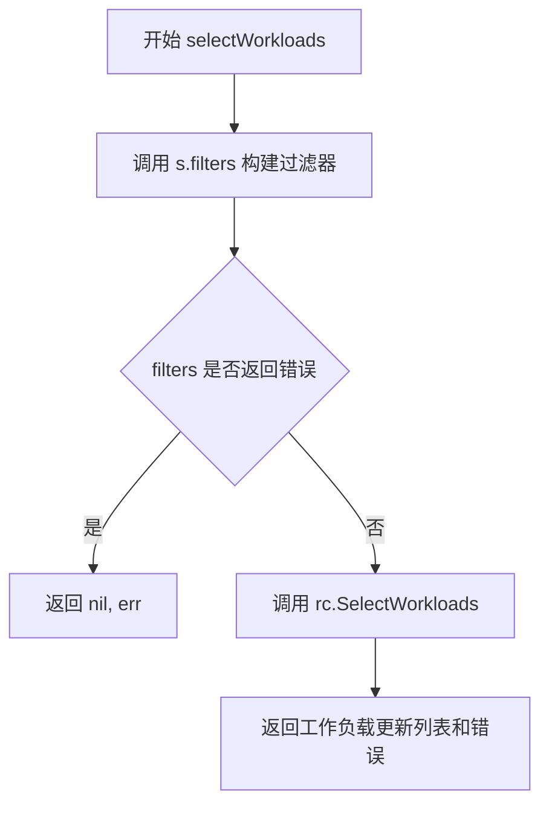
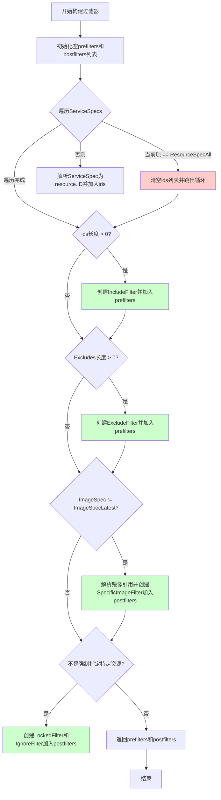
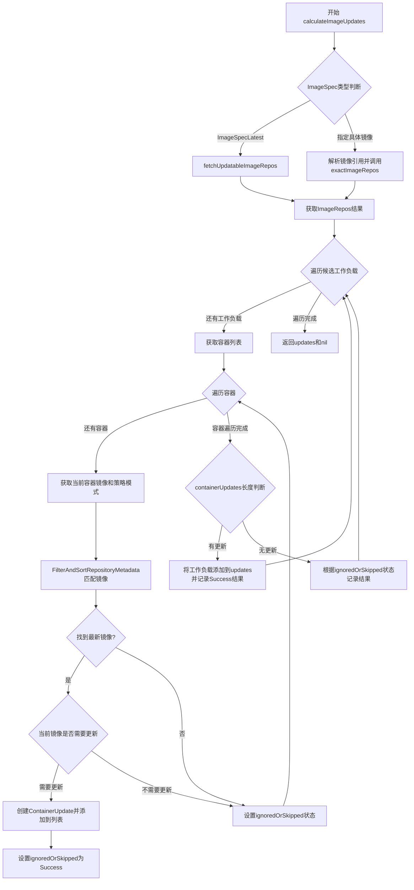
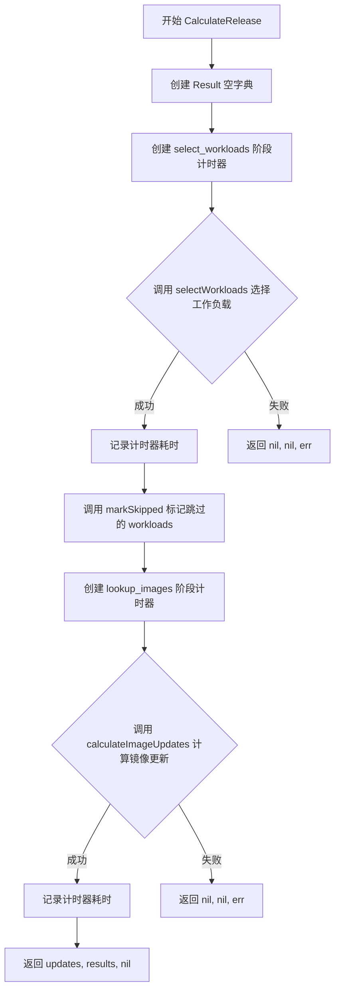
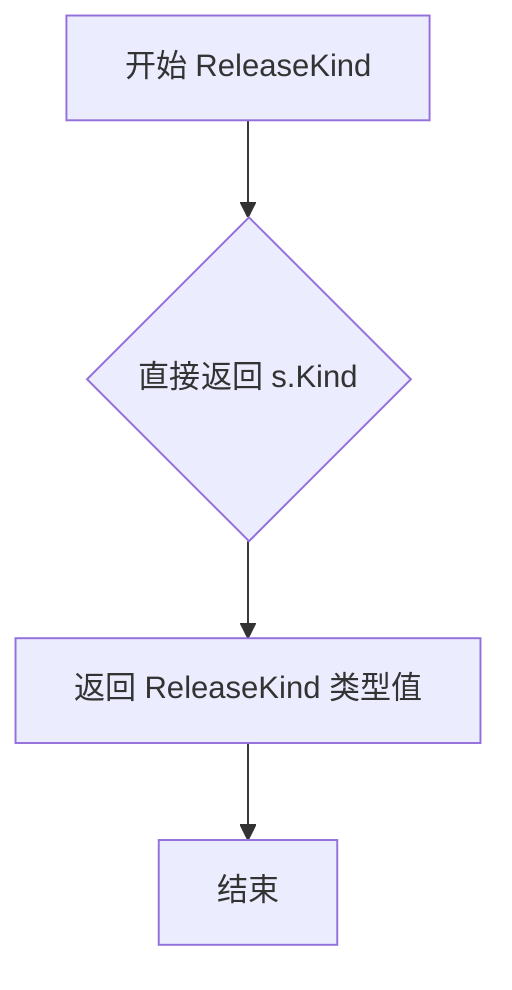
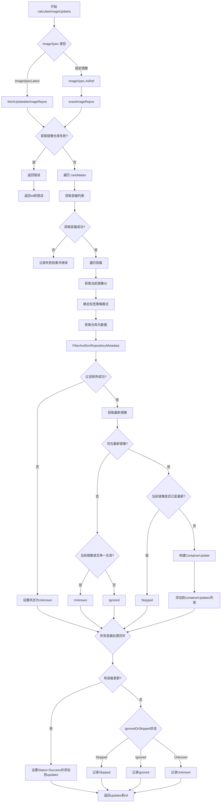

# `flux\pkg\update\release_image.go` 详细设计文档

Flux CD的镜像发布更新包，负责处理容器镜像的发布策略、过滤器构建、工作负载选择、镜像更新计算等核心功能，支持Plan和Execute两种发布模式，能够自动匹配最新镜像并更新到指定的工作负载中。

## 整体流程

```mermaid
graph TD
    A[开始 CalculateRelease] --> B[selectWorkloads 选择工作负载]
    B --> C{选择是否成功?}
    C -- 否 --> D[返回错误]
    C -- 是 --> E[markSkipped 标记跳过的]
    E --> F[calculateImageUpdates 计算镜像更新]
    F --> G{获取镜像仓库?}
G -- 否 --> H[返回错误]
G -- 是 --> I[遍历候选工作负载]
I --> J{处理每个容器}
J --> K[获取容器当前镜像]
K --> L[获取策略标签模式]
L --> M[过滤并排序仓库元数据]
M --> N{找到最新镜像?}
N -- 否 --> O[设置状态为Ignored/Skipped/Unknown]
N -- 是 --> P{当前镜像是否最新?}
P -- 是 --> Q[设置状态为Skipped]
P -- 否 --> R[构建ContainerUpdate]
R --> S[添加到更新列表]
S --> T{是否还有容器?]
T -- 是 --> J
T -- 否 --> U{是否有更新?]
U -- 是 --> V[设置Success状态]
U -- 否 --> W[设置对应状态]
V --> X[返回更新结果和结果映射]
W --> X
```

## 类结构

```
ReleaseContext (接口)
├── SelectWorkloads()
└── Registry()
ReleaseImageSpec (结构体)
├── ReleaseType()
├── CalculateRelease()
├── ReleaseKind()
├── CommitMessage()
├── selectWorkloads()
├── filters()
├── markSkipped()
└── calculateImageUpdates()
ResourceSpec (类型别名)
├── ParseResourceSpec()
├── MakeResourceSpec()
├── AsID()
└── String()
ImageSpec (类型别名)
├── ParseImageSpec()
├── String()
├── AsRef()
└── ImageSpecFromRef()
辅助函数
├── ParseReleaseKind()
└── (filters中的各类Filter)
```

## 全局变量及字段


### `ResourceSpecAll`
    
表示所有资源的常量规格

类型：`ResourceSpec`
    


### `ImageSpecLatest`
    
表示所有最新镜像的常量规格

类型：`ImageSpec`
    


### `UserAutomated`
    
自动用户标识字符串

类型：`string`
    


### `ErrInvalidReleaseKind`
    
无效发布类型的错误变量

类型：`error`
    


### `ReleaseKindPlan`
    
仅计划发布的常量

类型：`ReleaseKind`
    


### `ReleaseKindExecute`
    
计划并执行发布的常量

类型：`ReleaseKind`
    


### `ReleaseKind`
    
发布类型别名(plan/execute)

类型：`string`
    


### `ReleaseType`
    
发布类型描述别名

类型：`string`
    


### `ReleaseImageSpec.ReleaseImageSpec.ServiceSpecs`
    
工作负载规格列表

类型：`[]ResourceSpec`
    


### `ReleaseImageSpec.ReleaseImageSpec.ImageSpec`
    
镜像规格

类型：`ImageSpec`
    


### `ReleaseImageSpec.ReleaseImageSpec.Kind`
    
发布类型(plan/execute)

类型：`ReleaseKind`
    


### `ReleaseImageSpec.ReleaseImageSpec.Excludes`
    
排除的资源ID

类型：`[]resource.ID`
    


### `ReleaseImageSpec.ReleaseImageSpec.Force`
    
是否强制发布

类型：`bool`
    
    

## 全局函数及方法


### `ParseReleaseKind`

该函数用于将字符串解析为发布类型（ReleaseKind），支持两种发布类型：`plan`（仅计划）和 `execute`（计划并执行）。如果传入的字符串不匹配任何有效的发布类型，则返回错误。

参数：

- `s`：`string`，待解析的发布类型字符串

返回值：`ReleaseKind, error`，成功时返回对应的 ReleaseKind 枚举值，失败时返回空字符串和 `ErrInvalidReleaseKind` 错误

#### 流程图

```mermaid
flowchart TD
    A[开始 ParseReleaseKind] --> B{输入字符串 s}
    B -->|等于 "plan"| C[返回 ReleaseKindPlan]
    B -->|等于 "execute"| D[返回 ReleaseKindExecute]
    B -->|其他情况| E[返回空字符串 + ErrInvalidReleaseKind]
    C --> F[结束]
    D --> F
    E --> F
```

#### 带注释源码

```go
// ParseReleaseKind 将字符串解析为 ReleaseKind 枚举类型
// 参数 s: 表示发布类型的字符串，可能值为 "plan" 或 "execute"
// 返回值:
//   - ReleaseKind: 解析成功时返回对应的发布类型常量
//   - error: 解析失败时返回 ErrInvalidReleaseKind 错误
func ParseReleaseKind(s string) (ReleaseKind, error) {
	// 使用 switch 语句匹配输入字符串
	switch s {
	// 如果输入为 "plan" 字符串，返回计划发布类型常量
	case string(ReleaseKindPlan):
		return ReleaseKindPlan, nil
	// 如果输入为 "execute" 字符串，返回执行发布类型常量
	case string(ReleaseKindExecute):
		return ReleaseKindExecute, nil
	// 输入既不是 "plan" 也不是 "execute"，返回无效错误
	default:
		return "", ErrInvalidReleaseKind
	}
}
```


### `ReleaseImageSpec.ReleaseType`

获取ReleaseImageSpec的发布类型，返回一个单词的描述信息，主要用于标记指标或日志消息。

参数：
- （无参数，这是方法，使用接收者 `s`）

返回值：`ReleaseType`，返回发布类型的字符串描述。当 `ImageSpec` 等于 `ImageSpecLatest`（"<all latest>"）时返回 `"latest_images"`，否则返回 `"specific_image"`。

#### 流程图

```mermaid
flowchart TD
    A[开始 ReleaseType] --> B{s.ImageSpec == ImageSpecLatest?}
    B -->|是| C[返回 "latest_images"]
    B -->|否| D[返回 "specific_image"]
    C --> E[结束]
    D --> E
```

#### 带注释源码

```go
// ReleaseType gives a one-word description of the release, mainly
// useful for labelling metrics or log messages.
func (s ReleaseImageSpec) ReleaseType() ReleaseType {
	switch {
	case s.ImageSpec == ImageSpecLatest:
		// 当镜像规格为 <all latest> 时，表示更新所有容器到最新镜像
		return "latest_images"
	default:
		// 当指定具体镜像时，返回特定镜像发布类型
		return "specific_image"
	}
}
```


### `ReleaseImageSpec.CalculateRelease`

该方法是 `ReleaseImageSpec` 结构体的核心方法，负责计算镜像发布结果。它首先通过选择器筛选需要更新的工作负载，然后计算这些工作负载的镜像更新情况，最终返回所有需要执行的工作负载更新列表、发布结果摘要以及可能的错误信息。

参数：

- `ctx`：`context.Context`，Go 语言的上下文对象，用于传递取消信号、超时控制等请求范围的数据
- `rc`：`ReleaseContext`，发布上下文接口，提供选择工作负载的方法和访问镜像注册表的能力
- `logger`：`log.Logger`，日志记录器，用于记录方法执行过程中的关键事件和调试信息

返回值：

- `[]*WorkloadUpdate`：工作负载更新列表，包含需要更新镜像的工作负载及其更新详情
- `Result`：发布结果映射表，记录每个资源 ID 对应的发布状态和相关信息
- `error`：执行过程中发生的错误，如果成功则返回 nil

#### 流程图



#### 带注释源码

```go
// CalculateRelease 是 ReleaseImageSpec 的方法，用于计算镜像发布结果
// 输入：ctx 上下文、rc 发布上下文、logger 日志记录器
// 输出：工作负载更新列表、结果映射、错误信息
func (s ReleaseImageSpec) CalculateRelease(ctx context.Context, rc ReleaseContext, logger log.Logger) ([]*WorkloadUpdate, Result, error) {
	// 1. 初始化结果对象，用于记录每个资源的发布状态
	results := Result{}
	
	// 2. 创建第一阶段计时器：选择工作负载
	timer := NewStageTimer("select_workloads")
	
	// 3. 调用 selectWorkloads 筛选出需要处理的工作负载
	updates, err := s.selectWorkloads(ctx, rc, results)
	
	// 4. 记录选择工作负载阶段耗时
	timer.ObserveDuration()
	
	// 5. 如果选择工作负载失败，直接返回错误
	if err != nil {
		return nil, nil, err
	}
	
	// 6. 标记未被选中的资源为跳过状态
	s.markSkipped(results)

	// 7. 创建第二阶段计时器：查找镜像
	timer = NewStageTimer("lookup_images")
	
	// 8. 计算每个工作负载的镜像更新情况
	updates, err = s.calculateImageUpdates(rc, updates, results, logger)
	
	// 9. 记录查找镜像阶段耗时
	timer.ObserveDuration()
	
	// 10. 如果计算镜像更新失败，返回错误
	if err != nil {
		return nil, nil, err
	}
	
	// 11. 返回工作负载更新列表、结果和nil错误
	return updates, results, nil
}
```


### `ReleaseKind()`

获取 `ReleaseImageSpec` 的发布类型（plan 或 execute）。该方法是一个简单的 getter 方法，直接返回结构体内部的 `Kind` 字段值，用于标识发布是仅计划还是计划后执行。

参数： 无

返回值：`ReleaseKind`，返回 `ReleaseImageSpec` 的发布类型，值为 `"plan"`（仅计划）或 `"execute"`（计划并执行）。

#### 流程图



#### 带注释源码

```go
// ReleaseKind 返回 ReleaseImageSpec 的发布类型
// 返回值为 ReleaseKind 类型，可能是 ReleaseKindPlan("plan") 或 ReleaseKindExecute("execute")
// 用于区分此次发布是仅做计划(dry-run)还是实际执行发布操作
func (s ReleaseImageSpec) ReleaseKind() ReleaseKind {
	return s.Kind  // 直接返回结构体内部的 Kind 字段，该字段在 ReleaseImageSpec 创建时指定
}
```


### `ReleaseImageSpec.CommitMessage`

该方法根据发布镜像规格和服务规格生成人类可读的提交消息，用于描述本次发布的镜像目标以及受影响的工作负载列表。

参数：

- `result`：`Result` 类型，包含发布结果信息（虽然当前方法实现中未直接使用，但保留此参数以供未来扩展）

返回值：`string`，返回格式化的发布提交消息，格式为 "Release {镜像} to {工作负载列表}"

#### 流程图



#### 带注释源码

```go
// CommitMessage 根据发布镜像规格和服务规格生成提交消息
// 参数 result: Result 类型，包含发布结果（当前实现未使用，保留用于未来扩展）
// 返回: 格式化的字符串，描述发布的镜像和目标工作负载
func (s ReleaseImageSpec) CommitMessage(result Result) string {
	// 1. 获取 ImageSpec 的字符串表示，并去除两端的尖括号
	//    例如: "<all latest>" -> "all latest" 或具体镜像如 "nginx:1.19" -> "nginx:1.19"
	image := strings.Trim(s.ImageSpec.String(), "<>")
	
	// 2. 初始化工作负载切片用于存储所有目标工作负载名称
	var workloads []string
	
	// 3. 遍历所有 ServiceSpecs（服务规格列表）
	for _, spec := range s.ServiceSpecs {
		// 4. 同样去除两端尖括号（处理 "<all>" 等特殊值）
		workloads = append(workloads, strings.Trim(spec.String(), "<>"))
	}
	
	// 5. 使用逗号连接所有工作负载名称，生成最终的目标列表字符串
	// 6. 返回格式化的提交消息，格式: "Release {镜像} to {工作负载1, 工作负载2, ...}"
	return fmt.Sprintf("Release %s to %s", image, strings.Join(workloads, ", "))
}
```


### `ReleaseImageSpec.selectWorkloads`

该方法根据发布镜像规范构建预过滤器和后过滤器，并调用 ReleaseContext 的 SelectWorkloads 方法来选择需要更新的工作负载。

参数：

- `ctx`：`context.Context`，用于控制请求的截止时间和取消
- `rc`：`ReleaseContext`，发布上下文接口，提供工作负载选择能力和注册表访问
- `results`：`Result`，结果映射，用于记录每个工作负载的发布结果

返回值：`[]*WorkloadUpdate, error`，返回选中的工作负载更新列表及其错误信息

#### 流程图



#### 带注释源码

```go
// selectWorkloads 根据发布镜像规范选择需要更新的工作负载
// 1. 构建预过滤器和后过滤器
// 2. 调用 ReleaseContext 执行实际的选择逻辑
func (s ReleaseImageSpec) selectWorkloads(ctx context.Context, rc ReleaseContext, results Result) ([]*WorkloadUpdate, error) {
	// Build list of filters
	// 第一步：构建过滤器列表，包括预过滤器和后过滤器
	prefilters, postfilters, err := s.filters(rc)
	if err != nil {
		return nil, err
	}
	// Find and filter workloads
	// 第二步：调用 ReleaseContext 的 SelectWorkloads 方法进行实际的选择
	return rc.SelectWorkloads(ctx, results, prefilters, postfilters)
}
```

---

**补充说明**：

该方法的核心逻辑依赖于 `filters` 方法构建的过滤器链：

- **预过滤器 (prefilters)**：包含 IncludeFilter（按 ID 包含）、ExcludeFilter（排除列表）、LockedFilter（锁定的工作负载）、IgnoreFilter（忽略的工作负载）
- **后过滤器 (postfilters)**：包含 SpecificImageFilter（特定镜像过滤）、LockedFilter、IgnoreFilter

过滤器构建逻辑在 `filters` 方法中实现，会根据 `s.ServiceSpecs`、`s.Excludes`、`s.ImageSpec` 和 `s.Force` 参数来决定使用哪些过滤器。


### `ReleaseImageSpec.filters`

该方法根据发布规范（包含服务规格、镜像规格、排除列表和强制标志）构建用于筛选工作负载的预过滤器和后过滤器列表。预过滤器在查询工作负载之前应用（包含/排除特定资源），后过滤器在获取工作负载后应用（过滤特定镜像、锁定或忽略的工作负载）。

参数：

- `rc`：`ReleaseContext`，发布上下文接口，提供工作负载选择和注册表等能力

返回值：

- `[]WorkloadFilter`：预过滤器列表，在工作负载查询前应用
- `[]WorkloadFilter`：后过滤器列表，在工作负载获取后应用
- `error`：解析或构建过滤器过程中发生的错误

#### 流程图



#### 带注释源码

```go
// filters 根据发布规范构建预过滤器和后过滤器
// 预过滤器：用于在查询工作负载时筛选（包含/排除特定资源ID）
// 后过滤器：用于在获取工作负载后进一步筛选（特定镜像、锁定/忽略的控制器）
func (s ReleaseImageSpec) filters(rc ReleaseContext) ([]WorkloadFilter, []WorkloadFilter, error) {
	// 初始化预过滤器和后过滤器切片
	var prefilters, postfilters []WorkloadFilter

	// 用于存储解析后的资源ID列表
	ids := []resource.ID{}
	
	// 遍历所有服务规格，解析出资源ID
	for _, ss := range s.ServiceSpecs {
		// 如果规格为"<all>"，表示选择所有工作负载
		if ss == ResourceSpecAll {
			// "<all>" 覆盖任何其他过滤器，清空ids表示不过滤
			ids = []resource.ID{}
			break // 跳出循环
		}
		// 将字符串规格解析为资源ID
		id, err := resource.ParseID(string(ss))
		if err != nil {
			// 解析失败返回错误
			return nil, nil, err
		}
		ids = append(ids, id)
	}
	
	// 如果解析出了特定的资源ID，创建包含过滤器
	if len(ids) > 0 {
		// IncludeFilter：仅保留ids中指定的工作负载
		prefilters = append(prefilters, &IncludeFilter{ids})
	}

	// 排除过滤器：如果指定了要排除的资源
	if len(s.Excludes) > 0 {
		// ExcludeFilter：排除ids中指定的工作负载
		prefilters = append(prefilters, &ExcludeFilter{s.Excludes})
	}

	// 镜像过滤器：如果不是更新到最新镜像
	if s.ImageSpec != ImageSpecLatest {
		// 解析镜像引用
		id, err := image.ParseRef(s.ImageSpec.String())
		if err != nil {
			return nil, nil, err
		}
		// SpecificImageFilter：仅保留使用指定镜像的工作负载
		postfilters = append(postfilters, &SpecificImageFilter{id})
	}

	// 锁定/忽略过滤器：除非强制指定了特定控制器，否则过滤掉锁定的资源
	// 条件：不是（指定了特定资源 且 强制执行）
	// 即：没有指定特定资源，或者没有强制执行时，都应用锁定/忽略过滤器
	if !(len(ids) > 0 && s.Force) {
		// LockedFilter：排除被锁定的控制器
		postfilters = append(postfilters, &LockedFilter{})
		// IgnoreFilter：排除被标记为忽略的工作负载
		postfilters = append(postfilters, &IgnoreFilter{})
	}

	// 返回构建完成的过滤器和nil错误
	return prefilters, postfilters, nil
}
```


### `ReleaseImageSpec.markSkipped`

该方法用于标记在发布过程中被跳过的服务工作负载。当服务规范不是 "<all>" 时，会遍历所有服务规范，将其转换为资源 ID，并检查结果映射中是否存在对应的条目。如果不存在对应的结果，则将该工作负载标记为跳过状态（ReleaseStatusSkipped），错误信息为 NotInRepo。

参数：

- `results`：`Result`，表示工作负载发布结果映射，用于记录每个工作负载的发布状态

返回值：`void`（无返回值），该方法直接修改传入的 `results` 映射

#### 流程图

```mermaid
flowchart TD
    A[开始 markSkipped] --> B{遍历 ServiceSpecs}
    B --> C{当前项 == ResourceSpecAll}
    C -->|是| D[继续下一次循环]
    C -->|否| E[调用 v.AsID 转换为资源 ID]
    E --> F{转换是否成功}
    F -->|否| D
    F -->|是| G{检查 results 中是否存在该 ID}
    G -->|是| D
    G -->|否| H[创建 WorkloadResult]
    H --> I[设置 Status = ReleaseStatusSkipped]
    I --> J[设置 Error = NotInRepo]
    J --> K[将结果存入 results[id]]
    K --> D
    D --> B
    B --> L[结束]
```

#### 带注释源码

```go
// markSkipped 方法标记在发布中被跳过的服务工作负载
// 参数 results 是一个映射，记录每个工作负载的发布结果
func (s ReleaseImageSpec) markSkipped(results Result) {
    // 遍历 ReleaseImageSpec 中所有的服务规范
    for _, v := range s.ServiceSpecs {
        // 如果服务规范是 "<all>"，则跳过本次循环，不处理
        if v == ResourceSpecAll {
            continue
        }
        
        // 尝试将服务规范转换为资源 ID
        id, err := v.AsID()
        // 如果转换失败（如格式错误），跳过本次循环
        if err != nil {
            continue
        }
        
        // 检查 results 映射中是否已经存在该工作负载的结果
        // 如果不存在，说明该工作负载未被处理（可能不在仓库中）
        if _, ok := results[id]; !ok {
            // 创建新的 WorkloadResult，标记为跳过状态
            results[id] = WorkloadResult{
                Status: ReleaseStatusSkipped,  // 设置状态为跳过
                Error:  NotInRepo,              // 设置错误信息为不在仓库中
            }
        }
    }
}
```


### `ReleaseImageSpec.calculateImageUpdates`

该函数是 Flux CD 发布的核心方法，负责计算工作负载的镜像更新。它根据提供的镜像规范（指定最新镜像或特定镜像），从候选工作负载中筛选出需要更新的容器，并生成相应的更新指令。

参数：

- `s`：`ReleaseImageSpec`，方法接收者，包含发布规范（镜像规格、服务规格、发布类型等）
- `rc`：`ReleaseContext`，发布上下文接口，提供注册表访问和工作负载选择功能
- `candidates`：`[]*WorkloadUpdate`，待检查的工作负载候选列表，这些是从仓库和集群中筛选出的可能需要更新的工作负载
- `results`：`Result`，结果映射表，以资源 ID 为键存储每个工作负载的发布结果（成功、跳过、忽略或失败）
- `logger`：`log.Logger`，日志记录器，用于记录函数执行过程中的调试信息

返回值：`[]*WorkloadUpdate, error`，返回需要实际更新的工作负载列表，以及可能发生的错误

#### 流程图



#### 带注释源码

```go
// calculateImageUpdates 计算所有需要执行的镜像更新
// 参数：
//   - rc: ReleaseContext 发布上下文，提供注册表和工作负载查询能力
//   - candidates: []*WorkloadUpdate 候选工作负载列表
//   - results: Result 结果映射，记录每个资源的发布状态
//   - logger: log.Logger 日志记录器
//
// 返回值：
//   - []*WorkloadUpdate: 包含实际需要更新的工作负载
//   - error: 执行过程中的错误信息
func (s ReleaseImageSpec) calculateImageUpdates(rc ReleaseContext, candidates []*WorkloadUpdate, results Result, logger log.Logger) ([]*WorkloadUpdate, error) {
	// --- 第一阶段：获取镜像仓库信息 ---
	// 根据 ImageSpec 类型决定获取镜像的方式
	// ImageRepos 存储了所有可更新镜像的仓库元数据
	var imageRepos ImageRepos
	var singleRepo image.CanonicalName  // 存储单一镜像的规范名称
	var err error

	switch s.ImageSpec {
	case ImageSpecLatest:
		// 如果是 "<all latest>"，获取所有可更新的镜像仓库
		// 扫描注册表中所有镜像，找出候选工作负载使用的镜像的最新版本
		imageRepos, err = fetchUpdatableImageRepos(rc.Registry(), candidates, logger)
	default:
		// 如果指定了具体镜像，解析镜像引用并获取该镜像的仓库信息
		var ref image.Ref
		ref, err = s.ImageSpec.AsRef()
		if err == nil {
			singleRepo = ref.CanonicalName()
			// FIXME(fons): 即使禁用镜像扫描也应允许此操作，可以使用无缓存的注册表
			imageRepos, err = exactImageRepos(rc.Registry(), []image.Ref{ref})
		}
	}

	// 错误处理：镜像仓库获取失败则直接返回错误
	if err != nil {
		return nil, err
	}

	// --- 第二阶段：遍历候选工作负载，检查每个容器是否需要更新 ---
	var updates []*WorkloadUpdate
	for _, u := range candidates {
		// 获取工作负载的容器列表
		// ContainersOrError 返回工作负载定义中的所有容器，如果出错则记录失败状态并跳过
		containers, err := u.Workload.ContainersOrError()
		if err != nil {
			results[u.ResourceID] = WorkloadResult{
				Status: ReleaseStatusFailed,
				Error:  err.Error(),
			}
			continue
		}

		// 初始化状态：如果至少有一个容器使用了目标镜像，则标记为跳过而非忽略
		// 这主要用于过滤输出结果
		ignoredOrSkipped := ReleaseStatusIgnored
		var containerUpdates []ContainerUpdate  // 存储该工作负载中需要更新的容器列表

		// 遍历每个容器，检查是否有可用的新版本镜像
		for _, container := range containers {
			currentImageID := container.Image  // 当前使用的镜像ID

			// 获取容器的镜像标签策略模式，默认为匹配所有标签
			tagPattern := policy.PatternAll
			// 如果不是强制发布模式，或者请求更新所有最新镜像，则使用容器自带的策略
			if !s.Force || s.ImageSpec == ImageSpecLatest {
				if pattern, ok := u.Resource.Policies().Get(policy.TagPrefix(container.Name)); ok {
					// 根据策略创建匹配模式，如 semver 通配符等
					tagPattern = policy.NewPattern(pattern)
				}
			}

			// 从镜像仓库元数据中获取当前镜像的仓库信息
			metadata := imageRepos.GetRepositoryMetadata(currentImageID.Name)
			// 根据标签策略过滤并排序镜像，找出符合策略的最新镜像
			sortedImages, err := FilterAndSortRepositoryMetadata(metadata, tagPattern)
			if err != nil {
				// 缺少镜像仓库元数据（如镜像从未被扫描到），标记为未知状态
				ignoredOrSkipped = ReleaseStatusUnknown
				continue
			}

			// 获取排序后的最新镜像
			latestImage, ok := sortedImages.Latest()
			if !ok {
				// 没有找到符合条件的镜像
				if currentImageID.CanonicalName() != singleRepo {
					// 当前镜像不在目标镜像仓库中，标记为忽略
					ignoredOrSkipped = ReleaseStatusIgnored
				} else {
					// 当前镜像在目标仓库中但没有找到任何标签，标记为未知
					ignoredOrSkipped = ReleaseStatusUnknown
				}
				continue
			}

			// 检查当前镜像是否就是最新镜像
			if currentImageID == latestImage.ID {
				// 镜像已是最新，标记为跳过
				ignoredOrSkipped = ReleaseStatusSkipped
				continue
			}

			// --- 容器需要更新 ---
			// 将镜像标签转换为清单中出现的形式（而非规范形式）
			newImageID := currentImageID.WithNewTag(latestImage.ID.Tag)
			// 记录容器更新信息：容器名、原镜像、新镜像
			containerUpdates = append(containerUpdates, ContainerUpdate{
				Container: container.Name,
				Current:   currentImageID,
				Target:    newImageID,
			})
		}

		// --- 第三阶段：根据更新情况设置最终状态 ---
		switch {
		case len(containerUpdates) > 0:
			// 有容器需要更新
			u.Updates = containerUpdates
			updates = append(updates, u)  // 添加到返回列表
			results[u.ResourceID] = WorkloadResult{
				Status:       ReleaseStatusSuccess,
				PerContainer: containerUpdates,  // 记录每个容器的更新详情
			}
		case ignoredOrSkipped == ReleaseStatusSkipped:
			// 所有容器都已是最新版本
			results[u.ResourceID] = WorkloadResult{
				Status: ReleaseStatusSkipped,
				Error:  ImageUpToDate,
			}
		case ignoredOrSkipped == ReleaseStatusIgnored:
			// 容器使用的镜像不在目标镜像仓库中
			results[u.ResourceID] = WorkloadResult{
				Status: ReleaseStatusIgnored,
				Error:  DoesNotUseImage,
			}
		case ignoredOrSkipped == ReleaseStatusUnknown:
			// 无法确定镜像状态（缺少元数据）
			results[u.ResourceID] = WorkloadResult{
				Status: ReleaseStatusSkipped,
				Error:  ImageNotFound,
			}
		}
	}

	return updates, nil
}
```


### `ReleaseImageSpec.ReleaseType`

返回发布类型的单字描述，主要用于标记指标或日志消息。

参数：
- （无参数，这是方法而非函数）

返回值：`ReleaseType`，返回发布类型的描述字符串，可能为 "latest_images" 或 "specific_image"

#### 流程图

```mermaid
flowchart TD
    A[开始 ReleaseType] --> B{ImageSpec == ImageSpecLatest?}
    B -->|是| C[返回 "latest_images"]
    B -->|否| D[返回 "specific_image"]
    C --> E[结束]
    D --> E[结束]
```

#### 带注释源码

```go
// ReleaseType gives a one-word description of the release, mainly
// useful for labelling metrics or log messages.
// ReleaseType 给出发布的单字描述，主要用于标记指标或日志消息
func (s ReleaseImageSpec) ReleaseType() ReleaseType {
    // 使用 switch 语句判断发布类型
    // 判断 ImageSpec 是否为最新的镜像规范
    switch {
    case s.ImageSpec == ImageSpecLatest:
        // 如果是 <all latest>，返回 latest_images 类型
        return "latest_images"
    default:
        // 否则返回 specific_image 类型
        return "specific_image"
    }
}
```


### `ReleaseImageSpec.CalculateRelease`

该方法是 `ReleaseImageSpec` 结构体的核心方法，用于计算发布更新。它首先通过 `selectWorkloads` 选择需要更新的工作负载，然后通过 `calculateImageUpdates` 计算这些工作负载的镜像更新，最终返回所有工作负载更新列表、发布结果和可能的错误。

参数：

- `ctx`：`context.Context`，Go 语言的上下文，用于传递取消信号和截止时间
- `rc`：`ReleaseContext`，发布上下文接口，用于选择工作负载和访问镜像注册表
- `logger`：`log.Logger`，日志记录器，用于记录计算镜像更新过程中的日志信息

返回值：

- `[]*WorkloadUpdate`：工作负载更新列表，包含需要更新的工作负载及其容器更新信息
- `Result`：发布结果，一个映射资源 ID 到工作负载结果的字典
- `error`：执行过程中的错误，如果成功则返回 nil

#### 流程图



#### 带注释源码

```go
// CalculateRelease 计算发布更新，输出工作负载更新列表、结果和错误
// 方法流程：首先选择需要更新的工作负载，然后计算这些工作负载的镜像更新
func (s ReleaseImageSpec) CalculateRelease(ctx context.Context, rc ReleaseContext, logger log.Logger) ([]*WorkloadUpdate, Result, error) {
    // 初始化结果字典，用于记录每个工作负载的发布状态
    results := Result{}
    
    // 创建 select_workloads 阶段的计时器，用于性能监控
    timer := NewStageTimer("select_workloads")
    
    // 调用 selectWorkloads 方法选择需要更新的工作负载
    // 根据 ReleaseImageSpec 中的 ServiceSpecs、Excludes、ImageSpec 等配置进行筛选
    updates, err := s.selectWorkloads(ctx, rc, results)
    
    // 记录选择工作负载阶段耗时
    timer.ObserveDuration()
    
    // 如果选择工作负载失败，直接返回错误
    if err != nil {
        return nil, nil, err
    }
    
    // 调用 markSkipped 方法，将 ServiceSpecs 中指定但不在更新列表中的工作负载标记为跳过
    s.markSkipped(results)

    // 创建 lookup_images 阶段的计时器，用于性能监控
    timer = NewStageTimer("lookup_images")
    
    // 调用 calculateImageUpdates 计算镜像更新
    // 根据镜像注册表中的最新镜像，计算每个工作负载需要更新的容器镜像
    updates, err = s.calculateImageUpdates(rc, updates, results, logger)
    
    // 记录计算镜像更新阶段耗时
    timer.ObserveDuration()
    
    // 如果计算镜像更新失败，直接返回错误
    if err != nil {
        return nil, nil, err
    }
    
    // 返回工作负载更新列表、结果字典和 nil 错误
    return updates, results, nil
}
```


### ReleaseImageSpec.ReleaseKind()

获取 ReleaseImageSpec 实例的发布类型（Kind），返回值为 ReleaseKind 枚举类型，用于区分是计划发布（plan）还是执行发布（execute）。

参数：
- （无显式参数，隐式接收者为 `s ReleaseImageSpec`）

返回值：`ReleaseKind`，返回当前发布操作的类型，可能值为 `ReleaseKindPlan`（仅计划）或 `ReleaseKindExecute`（计划并执行）。

#### 流程图



#### 带注释源码

```go
// ReleaseKind 返回发布类型
// 这是一个简单的 getter 方法，用于获取 ReleaseImageSpec 中定义的发布类型
// 返回值可以是:
//   - ReleaseKindPlan: 仅创建发布计划，不实际执行
//   - ReleaseKindExecute: 创建计划并立即执行发布
func (s ReleaseImageSpec) ReleaseKind() ReleaseKind {
	return s.Kind  // 直接返回结构体中存储的 Kind 字段值
}
```

---

#### 上下文关联信息

**所属类：ReleaseImageSpec**

`ReleaseImageSpec` 是 Flux CD 系统中用于描述镜像发布规范的struct，包含以下关键字段：

- `ServiceSpecs []ResourceSpec`：要更新的工作负载列表
- `ImageSpec ImageSpec`：目标镜像规范
- `Kind ReleaseKind`：发布类型（plan/execute）
- `Excludes []resource.ID`：排除的资源ID列表
- `Force bool`：是否强制执行

**调用场景**

此方法通常在发布流程的早期阶段被调用，用于判断当前操作是仅做预览（plan）还是实际执行（execute）。根据返回的发布类型，系统会决定是否将变更提交到 Git 仓库或应用到集群。

**相关常量**

```go
const (
    ReleaseKindPlan    ReleaseKind = "plan"     // 仅计划，不执行
    ReleaseKindExecute ReleaseKind = "execute"  // 计划并执行
)
```

**潜在优化空间**

当前实现是一个极简的 getter 方法，几乎没有优化空间。如需扩展，可以考虑：
1. 添加缓存机制以避免重复访问
2. 在返回前进行合法性校验（如确保 Kind 值有效）


### ReleaseImageSpec.CommitMessage

生成Git提交消息，用于描述镜像发布操作的目标镜像和目标工作负载列表。

参数：

- `result`：`Result`，发布操作的结果对象（当前方法中未直接使用，但作为方法签名的一部分保留）

返回值：`string`，返回格式化的Git提交消息，格式为"Release {镜像名} to {工作负载列表}"

#### 流程图

```mermaid
flowchart TD
    A[开始 CommitMessage] --> B[获取镜像名称]
    B --> C[去除镜像名称的 <> 符号]
    C --> D[初始化 workloads 切片]
    D --> E{遍历 ServiceSpecs}
    E -->|每次迭代| F[获取服务规范字符串]
    F --> G[去除服务规范的 <> 符号]
    G --> H[添加到 workloads 切片]
    H --> E
    E -->|遍历完成| I[格式化输出字符串]
    I --> J[返回: Release {镜像} to {工作负载列表}]
    J --> K[结束]
    
    style A fill:#f9f,color:#000
    style J fill:#9f9,color:#000
    style K fill:#9f9,color:#000
```

#### 带注释源码

```go
// CommitMessage 生成Git提交消息，描述镜像发布的目标
// 参数 result: 发布操作的结果（当前版本中未使用，保留以保持接口一致性）
// 返回: 格式化的提交消息字符串，格式为 "Release {镜像} to {工作负载列表}"
func (s ReleaseImageSpec) CommitMessage(result Result) string {
	// 1. 获取镜像名称并去除两端的 "<>" 符号
	//    ImageSpec 可能是 "<all latest>" 或具体镜像名
	image := strings.Trim(s.ImageSpec.String(), "<>")
	
	// 2. 初始化工作负载列表切片
	var workloads []string
	
	// 3. 遍历所有服务规范（ServiceSpecs），收集工作负载名称
	for _, spec := range s.ServiceSpecs {
		// 去除每个服务规范两端的 "<>" 符号后添加到列表
		workloads = append(workloads, strings.Trim(spec.String(), "<>"))
	}
	
	// 4. 使用 fmt.Sprintf 格式化最终的提交消息
	//    格式: "Release {镜像名} to {工作负载1, 工作负载2, ...}"
	return fmt.Sprintf("Release %s to %s", image, strings.Join(workloads, ", "))
}
```


### `ReleaseImageSpec.selectWorkloads`

该方法根据发布规范中的服务规范和镜像规范，构建相应的过滤器（前置过滤器和后置过滤器），并通过 ReleaseContext 的 SelectWorkloads 方法筛选出需要更新的工作负载列表，是发布流程中确定目标工作负载的核心步骤。

**参数：**

- `ctx`：`context.Context`，Go 语言标准库的上下文，用于传递截止时间、取消信号等
- `rc`：`ReleaseContext`，发布上下文接口，提供了 SelectWorkloads 方法用于查询和过滤工作负载，以及 Registry 方法用于访问镜像仓库
- `results`：`Result`，发布结果映射表，以 resource.ID 为键存储各工作负载的发布状态结果

**返回值：**`[]*WorkloadUpdate`，需要更新的工作负载列表；`error`，执行过程中的错误信息

#### 流程图

```mermaid
flowchart TD
    A[开始 selectWorkloads] --> B[调用 filters 方法构建过滤器]
    B --> C{filters 是否返回错误?}
    C -->|是| D[返回 nil, 错误信息]
    C -->|否| E[调用 rc.SelectWorkloads 方法]
    E --> F{SelectWorkloads 是否返回错误?}
    F -->|是| G[返回 nil, 错误信息]
    F -->|否| H[返回更新列表, nil]
    
    subgraph filters 内部逻辑
    I[初始化 prefilters 和 postfilters 切片] --> J[遍历 ServiceSpecs]
    J --> K{当前 Spec == "<all>"}
    K -->|是| L[清空 ids 列表, 跳出循环]
    K -->|否| M[解析为 resource.ID 并加入 ids]
    M --> N{遍历完成?}
    N -->|否| J
    N -->|是| O{ids 长度 > 0?}
    O -->|是| P[创建 IncludeFilter 加入 prefilters]
    O -->|否| Q{Excludes 长度 > 0?}
    Q -->|是| R[创建 ExcludeFilter 加入 prefilters]
    Q -->|否| S{ImageSpec != "<all latest>"?]
    S -->|是| T[创建 SpecificImageFilter 加入 postfilters]
    S -->|否| U{不是强制指定且未指定具体工作负载?}
    U -->|是| V[创建 LockedFilter 和 IgnoreFilter 加入 postfilters]
    end
```

#### 带注释源码

```go
// selectWorkloads 根据发布规范选择需要更新的工作负载
// 参数 ctx 为上下文对象，rc 为发布上下文，results 用于存储发布结果
func (s ReleaseImageSpec) selectWorkloads(ctx context.Context, rc ReleaseContext, results Result) ([]*WorkloadUpdate, error) {
	// 第一步：构建过滤器列表
	// 根据 ServiceSpecs、Excludes、ImageSpec 和 Force 标志构建前置过滤器和后置过滤器
	prefilters, postfilters, err := s.filters(rc)
	if err != nil {
		// 如果过滤器构建失败，直接返回错误
		return nil, err
	}
	
	// 第二步：调用 ReleaseContext 的 SelectWorkloads 方法进行工作负载筛选
	// 前置过滤器在查询工作负载之前应用，后置过滤器在查询之后应用
	// 返回满足所有过滤器条件的工作负载列表
	return rc.SelectWorkloads(ctx, results, prefilters, postfilters)
}
```

#### 关键组件信息

| 名称 | 一句话描述 |
|------|-----------|
| `ReleaseContext` | 发布上下文接口，定义了选择工作负载和获取注册表的核心方法 |
| `WorkloadFilter` | 工作负载过滤器接口，用于筛选符合条件的工作负载 |
| `IncludeFilter` | 包含过滤器，只保留指定 ID 列表中的工作负载 |
| `ExcludeFilter` | 排除过滤器，排除指定 ID 列表中的工作负载 |
| `SpecificImageFilter` | 特定镜像过滤器，只保留使用指定镜像的工作负载 |
| `LockedFilter` | 锁定过滤器，排除被锁定的控制器 |
| `IgnoreFilter` | 忽略过滤器，排除被配置为忽略的工作负载 |
| `ResourceSpecAll` | 常量 `<all>`，表示选择所有工作负载 |

#### 潜在技术债务与优化空间

1. **过滤器构建逻辑耦合**：当前过滤器构建逻辑集中在 `filters` 方法中，随着功能增加可能变得臃肿，可以考虑将不同类型的过滤器封装为独立的策略类。

2. **错误处理粒度**：在 `selectWorkloads` 方法中调用 `filters` 和 `SelectWorkloads` 时的错误信息可能不够具体，难以定位问题根源，建议增加更详细的错误上下文。

3. **性能考虑**：当 ServiceSpecs 包含大量工作负载 ID 时，每次调用都需要解析和验证，可以考虑添加缓存机制。

4. **常量命名**：注释中提到 `ServiceSpecs` 计划改名为 `WorkloadSpecs`，但目前仍使用旧名称，建议统一命名规范。

#### 其他设计说明

- **设计目标**：该方法是发布流程的入口点之一，负责精确确定哪些工作负载需要应用镜像更新，支持全量更新和选择性更新两种模式。
- **约束条件**：当 ServiceSpecs 包含 `<all>` 时，忽略其他所有过滤器，强制选择所有工作负载；除非明确指定工作负载且启用 Force 模式，否则默认排除锁定和忽略的工作负载。
- **数据流**：该方法接收外部传入的 results 映射，并在后续的 calculateImageUpdates 方法中填充具体的发布状态和镜像更新信息，形成链式数据处理流程。


### `ReleaseImageSpec.filters`

该方法负责构建过滤器链，根据发布规范（ReleaseImageSpec）中的服务规范、排除列表、镜像规范和强制标志，生成两组过滤器（预过滤器和后过滤器），用于在选择工作负载时进行筛选和过滤。

参数：

- `rc`：`ReleaseContext`，发布上下文接口，提供选择工作负载的方法和注册表访问

返回值：

- `[]WorkloadFilter`：预过滤器列表，在工作负载选择前应用
- `[]WorkloadFilter`：后过滤器列表，在工作负载选择后应用
- `error`：处理过程中的错误信息

#### 流程图

```mermaid
flowchart TD
    A[开始构建过滤器链] --> B[初始化空预过滤器和后过滤器列表]
    B --> C{遍历ServiceSpecs}
    C -->|服务规格 == ResourceSpecAll| D[清空ids列表并跳出循环]
    C -->|服务规格 != ResourceSpecAll| E[解析resource.ID并添加到ids]
    E --> C
    D --> F{len(ids) > 0}
    F -->|是| G[添加IncludeFilter到prefilters]
    F -->|否| H{len(Excludes) > 0}
    G --> H
    H -->|是| I[添加ExcludeFilter到prefilters]
    H -->|否| J{ImageSpec != ImageSpecLatest}
    I --> J
    J -->|是| K[解析镜像引用并添加SpecificImageFilter到postfilters]
    J -->|否| L{不是特定ID强制发布}
    K --> L
    L -->|是| M[添加LockedFilter和IgnoreFilter到postfilters]
    L -->|否| N[返回prefilters和postfilters]
    M --> N
```

#### 带注释源码

```go
// filters 构建过滤器链，用于筛选需要发布的工作负载
// 参数 rc: ReleaseContext 发布上下文
// 返回: 预过滤器列表, 后过滤器列表, 错误信息
func (s ReleaseImageSpec) filters(rc ReleaseContext) ([]WorkloadFilter, []WorkloadFilter, error) {
	// 初始化预过滤器和后过滤器切片
	var prefilters, postfilters []WorkloadFilter

	// 用于存储解析后的资源ID列表
	ids := []resource.ID{}
	
	// 遍历所有服务规格，构建资源ID列表
	for _, ss := range s.ServiceSpecs {
		// 如果指定了"<all>"，则覆盖任何其他过滤器，选择所有工作负载
		if ss == ResourceSpecAll {
			ids = []resource.ID{}
			break
		}
		
		// 解析服务规格为资源ID
		id, err := resource.ParseID(string(ss))
		if err != nil {
			return nil, nil, err
		}
		ids = append(ids, id)
	}
	
	// 如果指定了特定的工作负载，添加包含过滤器
	if len(ids) > 0 {
		prefilters = append(prefilters, &IncludeFilter{ids})
	}

	// 添加排除过滤器，排除指定的工作负载
	if len(s.Excludes) > 0 {
		prefilters = append(prefilters, &ExcludeFilter{s.Excludes})
	}

	// 如果指定了特定镜像（非最新镜像），添加镜像过滤器
	if s.ImageSpec != ImageSpecLatest {
		id, err := image.ParseRef(s.ImageSpec.String())
		if err != nil {
			return nil, nil, err
		}
		postfilters = append(postfilters, &SpecificImageFilter{id})
	}

	// 除非指定了特定控制器且启用了强制标志，否则过滤掉锁定和忽略的工作负载
	// 如果没有指定特定工作负载，或者没有强制标志，则应用LockedFilter和IgnoreFilter
	if !(len(ids) > 0 && s.Force) {
		postfilters = append(postfilters, &LockedFilter{}, &IgnoreFilter{})
	}

	return prefilters, postfilters, nil
}
```


### `ReleaseImageSpec.markSkipped`

标记未在发布结果中的工作负载为跳过状态

参数：

- `results`：`Result`，用于记录每个工作负载的发布结果

返回值：`void`（无返回值，通过修改 results 参数传递结果）

#### 流程图

```mermaid
flowchart TD
    A[开始 markSkipped] --> B{遍历 s.ServiceSpecs}
    B -->|还有元素| C{当前元素 == ResourceSpecAll}
    C -->|是| D[continue 跳过]
    C -->|否| E{尝试转换为 ID}
    E -->|转换成功| F{检查 ID 是否在 results 中}
    E -->|转换失败| D
    F -->|不在结果中| G[设置 results[id] = WorkloadResult<br/>Status: ReleaseStatusSkipped<br/>Error: NotInRepo]
    F -->|已在结果中| B
    G --> B
    B -->|遍历完成| H[结束]
```

#### 带注释源码

```
// markSkipped 方法用于标记未在发布结果中的工作负载为跳过状态
// 遍历所有服务规格，对于不在结果中的工作负载，标记为 ReleaseStatusSkipped
func (s ReleaseImageSpec) markSkipped(results Result) {
	// 遍历 ReleaseImageSpec 中的所有服务规格
	for _, v := range s.ServiceSpecs {
		// 如果是 "<all>"，跳过此次迭代，不处理
		if v == ResourceSpecAll {
			continue
		}
		// 尝试将服务规格转换为资源 ID
		id, err := v.AsID()
		// 转换失败则跳过
		if err != nil {
			continue
		}
		// 检查该资源 ID 是否已存在于 results 中
		if _, ok := results[id]; !ok {
			// 不存在则标记为跳过，并设置错误原因为 NotInRepo
			results[id] = WorkloadResult{
				Status: ReleaseStatusSkipped,
				Error:  NotInRepo,
			}
		}
	}
}
```


### `ReleaseImageSpec.calculateImageUpdates`

该函数是 Flux CD 镜像更新的核心计算逻辑，根据给定的镜像规范（ImageSpec）计算所有需要更新的镜像，遍历候选工作负载的容器，通过镜像仓库元数据筛选最新镜像，生成容器更新列表并填充发布结果。

**参数：**

- `rc`：`ReleaseContext`，发布上下文接口，提供工作负载选择和注册表访问能力
- `candidates`：`[]*WorkloadUpdate`，待检测的工作负载更新候选列表
- `results`：`Result`，用于记录每个工作负载的发布结果（状态、错误信息等）
- `logger`：`log.Logger`，日志记录器，用于输出镜像抓取过程中的日志

**返回值：**`[]*WorkloadUpdate`，包含实际需要更新镜像的工作负载列表；`error`，处理过程中发生的错误

#### 流程图



#### 带注释源码

```go
// calculateImageUpdates 查找所有需要执行的镜像更新并完成替换
// 参数:
//   - rc: ReleaseContext 发布上下文，包含注册表和工作负载选择逻辑
//   - candidates: []*WorkloadUpdate 待检测的工作负载候选列表
//   - results: Result 存储每个工作负载的发布结果
//   - logger: log.Logger 日志记录器
//
// 返回值:
//   - []*WorkloadUpdate: 包含实际需要更新的工作负载
//   - error: 处理过程中的错误信息
func (s ReleaseImageSpec) calculateImageUpdates(rc ReleaseContext, candidates []*WorkloadUpdate, results Result, logger log.Logger) ([]*WorkloadUpdate, error) {
	// ---------------------------------------------------------
	// 第一阶段：获取镜像仓库信息
	// ---------------------------------------------------------
	
	// 定义镜像仓库变量，用于存储所有相关镜像仓库的元数据
	var imageRepos ImageRepos
	// 定义单一仓库的规范名称（当指定具体镜像时使用）
	var singleRepo image.CanonicalName
	var err error

	// 根据 ImageSpec 类型选择不同的镜像获取策略
	switch s.ImageSpec {
	case ImageSpecLatest:
		// 模式1：更新到所有镜像的最新版本
		// 调用 fetchUpdatableImageRepos 获取所有可更新的镜像仓库
		imageRepos, err = fetchUpdatableImageRepos(rc.Registry(), candidates, logger)
	default:
		// 模式2：发布到指定的镜像版本
		// 将 ImageSpec 解析为镜像引用
		var ref image.Ref
		ref, err = s.ImageSpec.AsRef()
		if err == nil {
			// 获取该镜像的规范名称
			singleRepo = ref.CanonicalName()
			// FIXME(fons): 即使镜像扫描被禁用，我们可能仍希望允许此操作
			//              可以选择跳过验证或使用未缓存的注册表
			// 根据指定的镜像引用获取精确的镜像仓库
			imageRepos, err = exactImageRepos(rc.Registry(), []image.Ref{ref})
		}
	}

	// 如果获取镜像仓库失败，直接返回错误
	if err != nil {
		return nil, err
	}

	// ---------------------------------------------------------
	// 第二阶段：遍历候选工作负载，计算每个容器的镜像更新
	// ---------------------------------------------------------
	
	// 存储最终需要更新的工作负载
	var updates []*WorkloadUpdate
	
	// 遍历所有候选工作负载
	for _, u := range candidates {
		// 获取工作负载的容器列表
		containers, err := u.Workload.ContainersOrError()
		if err != nil {
			// 容器获取失败，记录失败状态并跳过该工作负载
			results[u.ResourceID] = WorkloadResult{
				Status: ReleaseStatusFailed,
				Error:  err.Error(),
			}
			continue
		}

		// 初始化状态：
		// 如果至少有一个容器使用了目标镜像，则标记为 skipped 而非 ignored
		// 这主要用于输出过滤
		ignoredOrSkipped := ReleaseStatusIgnored
		// 存储该工作负载的容器更新列表
		var containerUpdates []ContainerUpdate

		// 遍历该工作负载的所有容器
		for _, container := range containers {
			// 获取容器当前使用的镜像ID
			currentImageID := container.Image

			// 确定标签过滤模式，默认为全部匹配
			tagPattern := policy.PatternAll
			
			// 如果不是强制发布或请求更新所有镜像，
			// 则使用容器自身策略中定义的标签模式
			if !s.Force || s.ImageSpec == ImageSpecLatest {
				if pattern, ok := u.Resource.Policies().Get(policy.TagPrefix(container.Name)); ok {
					tagPattern = policy.NewPattern(pattern)
				}
			}

			// 从镜像仓库获取当前镜像的仓库元数据
			metadata := imageRepos.GetRepositoryMetadata(currentImageID.Name)
			// 根据标签模式过滤和排序镜像
			sortedImages, err := FilterAndSortRepositoryMetadata(metadata, tagPattern)
			if err != nil {
				// 缺少镜像仓库元数据，标记为未知状态
				ignoredOrSkipped = ReleaseStatusUnknown
				continue
			}

			// 获取排序后的最新镜像
			latestImage, ok := sortedImages.Latest()
			if !ok {
				// 没有找到可用的镜像
				if currentImageID.CanonicalName() != singleRepo {
					// 当前镜像不在指定仓库中，忽略
					ignoredOrSkipped = ReleaseStatusIgnored
				} else {
					// 当前镜像在指定仓库中但未找到更新，标记为未知
					ignoredOrSkipped = ReleaseStatusUnknown
				}
				continue
			}

			// 检查当前镜像是否已经是最新版本
			if currentImageID == latestImage.ID {
				ignoredOrSkipped = ReleaseStatusSkipped
				continue
			}

			// 需要更新镜像：
			// 使用清单中的镜像形式（而非规范形式）构建新镜像ID
			newImageID := currentImageID.WithNewTag(latestImage.ID.Tag)
			// 创建容器更新记录
			containerUpdates = append(containerUpdates, ContainerUpdate{
				Container: container.Name,
				Current:   currentImageID,
				Target:    newImageID,
			})
		}

		// ---------------------------------------------------------
		// 第三阶段：记录该工作负载的处理结果
		// ---------------------------------------------------------
		
		switch {
		case len(containerUpdates) > 0:
			// 有容器需要更新
			u.Updates = containerUpdates
			updates = append(updates, u)
			results[u.ResourceID] = WorkloadResult{
				Status:       ReleaseStatusSuccess,
				PerContainer: containerUpdates,
			}
		case ignoredOrSkipped == ReleaseStatusSkipped:
			// 所有容器已是最新
			results[u.ResourceID] = WorkloadResult{
				Status: ReleaseStatusSkipped,
				Error:  ImageUpToDate,
			}
		case ignoredOrSkipped == ReleaseStatusIgnored:
			// 容器未使用目标镜像
			results[u.ResourceID] = WorkloadResult{
				Status: ReleaseStatusIgnored,
				Error:  DoesNotUseImage,
			}
		case ignoredOrSkipped == ReleaseStatusUnknown:
			// 无法确定镜像状态
			results[u.ResourceID] = WorkloadResult{
				Status: ReleaseStatusSkipped,
				Error:  ImageNotFound,
			}
		}
	}

	// 返回需要更新的工作负载列表
	return updates, nil
}
```


### `ResourceSpec.ParseResourceSpec`

该函数用于解析资源规格字符串，将其转换为 `ResourceSpec` 类型。如果字符串为 `"<all>"`，则返回预定义的 `ResourceSpecAll` 常量；否则尝试将其解析为资源 ID，解析成功则返回对应的 `ResourceSpec`，失败则返回错误信息。

参数：

-  `s`：`string`，需要解析的资源规格字符串，可以是 `"<all>"` 或具体的资源 ID

返回值：

-  `ResourceSpec`：解析后的资源规格，如果输入为 `"<all>"` 则返回 `ResourceSpecAll`，否则返回解析后的资源 ID 字符串包装
-  `error`：解析过程中的错误，如果字符串既不是 `"<all>"` 也不是有效的资源 ID，则返回包含错误详情的错误对象

#### 流程图

```mermaid
flowchart TD
    A[开始解析资源规格] --> B{输入字符串是否等于<br/>"<all>"}
    B -->|是| C[返回 ResourceSpecAll]
    B -->|否| D[尝试将字符串解析为 resource.ID]
    D --> E{解析是否成功}
    E -->|失败| F[返回错误<br/>错误信息: 'invalid workload spec']
    E -->|成功| G[将解析得到的 ID 转换为 ResourceSpec 并返回]
    C --> H[结束]
    F --> H
    G --> H
```

#### 带注释源码

```go
// ParseResourceSpec 将给定的字符串解析为 ResourceSpec
// 如果字符串等于 "<all>"，则返回预定义的 ResourceSpecAll 常量
// 否则尝试将字符串解析为资源 ID，解析成功返回对应的 ResourceSpec，失败返回错误
func ParseResourceSpec(s string) (ResourceSpec, error) {
	// 检查输入是否为 "<all>" 特殊标记
	if s == string(ResourceSpecAll) {
		// 如果是 "<all>"，直接返回预定义的 ResourceSpecAll 常量
		return ResourceSpecAll, nil
	}
	// 尝试将字符串解析为资源 ID
	id, err := resource.ParseID(s)
	if err != nil {
		// 解析失败，包装错误信息并返回
		return "", errors.Wrap(err, "invalid workload spec")
	}
	// 解析成功，将资源 ID 转换为 ResourceSpec 并返回
	return ResourceSpec(id.String()), nil
}
```


### `MakeResourceSpec`

该函数用于将 `resource.ID` 类型转换为 `ResourceSpec` 类型，通过调用资源ID的字符串方法并将其包装为 `ResourceSpec` 类型返回。这是一个简单的类型转换函数，位于 `update` 包中，用于在发布更新操作中处理资源规格的标准化。

参数：

- `id`：`resource.ID`，要转换的资源ID对象

返回值：`ResourceSpec`，转换后的资源规格字符串

#### 流程图

```mermaid
flowchart TD
    A[Start] --> B[Input: id resource.ID]
    B --> C{call id.String()}
    C --> D[Get string representation of resource.ID]
    D --> E[Convert string to ResourceSpec type]
    E --> F[Return ResourceSpec]
    F --> G[End]
```

#### 带注释源码

```go
// MakeResourceSpec 将 resource.ID 转换为 ResourceSpec
// 参数: id resource.ID - 资源标识符对象
// 返回: ResourceSpec - 资源规格的字符串包装类型
func MakeResourceSpec(id resource.ID) ResourceSpec {
	// 1. 调用 resource.ID 的 String() 方法获取其字符串表示
	// 2. 将字符串显式转换为 ResourceSpec 类型（ResourceSpec 是 string 的类型别名）
	// 3. 返回转换后的 ResourceSpec
	return ResourceSpec(id.String())
}
```

#### 相关类型定义

```go
// ResourceSpec 是资源规格的类型定义，本质上是一个字符串
// 可以表示特定的工作负载ID，或者 "<all>" 表示所有工作负载
type ResourceSpec string // ID or "<all>"

// resource.ID 是 fluxcd/flux/pkg/resource 包中定义的核心资源标识符类型
// 用于唯一标识 Kubernetes 中的工作负载资源
```


### `ResourceSpec.AsID`

将 `ResourceSpec` 字符串类型转换为 `resource.ID` 类型，用于解析和验证资源规范是否有效。

参数： 无

返回值：`(resource.ID, error)`  
- `resource.ID`：解析成功时返回的资源标识符
- `error`：解析失败时返回错误信息

#### 流程图

```mermaid
flowchart TD
    A[开始] --> B{检查 s 是否为空}
    B -->|是| C[返回空字符串和错误]
    B -->|否| D[调用 resource.ParseID 解析字符串]
    D --> E{解析是否成功}
    E -->|成功| F[返回 resource.ID 和 nil]
    E -->|失败| G[返回空 ID 和错误]
```

#### 带注释源码

```go
// AsID 将 ResourceSpec 转换为 resource.ID
// ResourceSpec 本质上是一个字符串，可能是具体的资源ID或者是 "<all>" 表示所有资源
// 该方法调用 resource.ParseID 进行解析验证
func (s ResourceSpec) AsID() (resource.ID, error) {
    // 将 ResourceSpec (string 类型) 转换为 string，然后调用 resource.ParseID 进行解析
    return resource.ParseID(string(s))
}
```


### ResourceSpec.String

将 `ResourceSpec` 类型转换为字符串表示。该方法是 Go 语言中 `fmt.Stringer` 接口的实现，用于获取资源规范的字符串形式。

参数： 无

返回值： `string`，返回资源规范的字符串表示

#### 流程图

```mermaid
flowchart TD
    A[开始 String 方法] --> B{检查 receiver s}
    B --> C[将 ResourceSpec 强制转换为 string]
    C --> D[返回转换后的字符串]
    D --> E[结束]
    
    style A fill:#f9f,color:#333
    style E fill:#9f9,color:#333
```

#### 带注释源码

```go
// String 将 ResourceSpec 转换为字符串
// 这是 fmt.Stringer 接口的实现方法
// 返回值格式：如果是 "<all>" 则返回 "<all>"，否则返回资源 ID 的字符串形式
func (s ResourceSpec) String() string {
	// ResourceSpec 本质上是 string 的类型别名
	// 直接进行类型转换即可获取其字符串表示
	return string(s)
}
```


### ImageSpec.ParseImageSpec

该方法用于将用户输入的字符串解析为 `ImageSpec` 对象。它支持两种格式：一是特殊的标记字符串 `"<all latest>"`，用于表示更新所有容器到最新镜像；二是标准的镜像引用字符串（如 `docker.io/library/nginx:latest`）。解析过程中会验证字符串是否符合镜像规范，并确保 Tag 不为空。

参数：

- `s`：`string`，待解析的镜像规格字符串，例如 "myrepo/myimage:v1.0" 或 "<all latest>"。

返回值：`ImageSpec`, `error`

- `ImageSpec`：解析成功返回的镜像规格对象。
- `error`：如果解析失败（如格式错误、Tag 为空）或输入为无效字符串时返回错误。

#### 流程图

```mermaid
flowchart TD
    A([开始解析]) --> B{输入 s 是否等于 "<all latest>"}
    B -- 是 --> C[返回预定义常量 ImageSpecLatest]
    C --> D([结束])
    B -- 否 --> E[调用 image.ParseRef 解析 s]
    E --> F{解析是否出错?}
    F -- 是 --> G[返回空 ImageSpec 和错误]
    G --> D
    F -- 否 --> H{Tag 是否为空?}
    H -- 是 --> I[返回空 ImageSpec 和自定义错误: Tag 不能为空]
    I --> D
    H -- 否 --> J[构造并返回 ImageSpec]
    J --> D
```

#### 带注释源码

```go
// ParseImageSpec 将字符串解析为 ImageSpec
// 支持两种格式:
// 1. "<all latest>" - 表示更新所有镜像
// 2. 具体的镜像引用 - 例如 "image:tag"
func ParseImageSpec(s string) (ImageSpec, error) {
	// 1. 检查是否为特殊的 "更新所有最新镜像" 标记
	if s == string(ImageSpecLatest) {
		return ImageSpecLatest, nil
	}

	// 2. 尝试解析具体镜像字符串为 image.Ref 结构
	id, err := image.ParseRef(s)
	if err != nil {
		// 如果字符串格式本身就不符合镜像规范，直接返回解析错误
		return "", err
	}

	// 3. 业务逻辑校验：强制要求指定 Tag
	// 如果未指定 Tag（例如只写了 "image" 而非 "image:tag"），则报错
	// 并给出提示，建议用户明确使用 ":latest"
	if id.Tag == "" {
		return "", errors.Wrap(image.ErrInvalidImageID, "blank tag (if you want latest, explicitly state the tag :latest)")
	}

	// 4. 解析成功，将 Ref 转换为字符串并封装为 ImageSpec 类型返回
	// 此时 err 为 nil
	return ImageSpec(id.String()), err
}
```


### `ImageSpec.String`

将 ImageSpec 转换为字符串表示。ImageSpec 是底层类型为 string 的自定义类型，该方法直接返回其底层字符串值。

参数： 无

返回值： `string`，返回 ImageSpec 的字符串表示，即原始的镜像规范内容

#### 流程图

```mermaid
graph TD
    A[开始 String 方法] --> B{直接返回}
    B --> C[将 ImageSpec 底层类型 string 转换并返回]
    C --> D[结束]
```

#### 带注释源码

```go
// String 返回 ImageSpec 的字符串表示
// ImageSpec 本质上是基于 string 的类型别名
// 该方法实现了 fmt.Stringer 接口，允许 ImageSpec 在需要字符串的地方自动转换
func (s ImageSpec) String() string {
	return string(s) // 将 ImageSpec 强制转换为底层类型 string 并返回
}
```


### `ImageSpec.AsRef`

将 ImageSpec 字符串解析为 image.Ref 类型，用于转换为镜像引用。该方法是 ImageSpec 类型的方法，通过调用 image.ParseRef 函数将存储在 ImageSpec 中的字符串解析为标准的镜像引用对象。

参数：

- （无显式参数，接收者 `s` 为 ImageSpec 类型）

返回值：

- `image.Ref`：解析成功后的镜像引用对象
- `error`：如果字符串格式无效或解析失败，则返回错误信息

#### 流程图

```mermaid
flowchart TD
    A[开始 AsRef] --> B{检查 ImageSpec 字符串}
    B --> C[调用 s.String 获取字符串]
    C --> D[调用 image.ParseRef 解析字符串]
    D --> E{解析是否成功?}
    E -->|是| F[返回 image.Ref 和 nil 错误]
    E -->|否| G[返回空的 image.Ref 和错误]
    F --> H[结束]
    G --> H
```

#### 带注释源码

```go
// AsRef 将 ImageSpec 转换为镜像引用 image.Ref
// 它内部调用 image.ParseRef 来解析存储在 ImageSpec 中的字符串
// 参数: 无（使用接收者 s）
// 返回值:
//   - image.Ref: 解析后的镜像引用
//   - error: 解析过程中的错误（如果字符串格式无效）
func (s ImageSpec) AsRef() (image.Ref, error) {
	// 首先将 ImageSpec 转换为字符串，然后调用 image.ParseRef 进行解析
	// image.ParseRef 会验证字符串是否符合镜像引用的格式
	return image.ParseRef(s.String())
}
```


### `ImageSpecFromRef`

该函数用于将镜像引用（image.Ref）转换为镜像规格（ImageSpec）类型，以便在发布操作中使用。它是镜像引用到字符串规格的单向转换函数。

参数：

- `id`：`image.Ref`，待转换的镜像引用对象

返回值：`ImageSpec`，转换后的镜像规格字符串

#### 流程图

```mermaid
flowchart TD
    A[开始] --> B[输入: image.Ref]
    B --> C[调用 id.String 获取字符串表示]
    C --> D[将字符串包装为 ImageSpec 类型]
    D --> E[返回 ImageSpec]
    E --> F[结束]
```

#### 带注释源码

```go
// ImageSpecFromRef 从镜像引用创建规格
// 参数: id image.Ref - 镜像引用对象，包含镜像的仓库、名称和标签信息
// 返回值: ImageSpec - 镜像规格的字符串类型表示
func ImageSpecFromRef(id image.Ref) ImageSpec {
    // 调用 image.Ref 的 String 方法获取其字符串表示形式
    // 然后将其强制转换为 ImageSpec 类型后返回
    return ImageSpec(id.String())
}
```

## 关键组件


### ReleaseImageSpec

发布镜像的规范结构体，包含服务规范、镜像规范、发布类型、排除列表和强制标志，用于描述一次完整的镜像发布操作。

### ReleaseContext

发布上下文的接口，定义了选择工作负载的方法和获取注册表实例的能力，是发布操作的核心依赖。

### WorkloadUpdate

工作负载更新结构体，包含工作负载本身和容器更新列表，表示需要对某个工作负载进行的镜像更新操作。

### Result

发布结果的映射表，以资源ID为键，WorkloadResult为值，记录每个工作负载的发布状态和结果信息。

### WorkloadFilter

工作负载过滤器的接口，包含IncludeFilter、ExcludeFilter、SpecificImageFilter、LockedFilter和IgnoreFilter，用于筛选需要处理的工作负载。

### ResourceSpec

资源规范的字符串类型别名，表示工作负载ID或"<all>"，用于指定发布目标范围。

### ImageSpec

镜像规范的字符串类型别名，表示镜像引用或"<all latest>"，用于指定要发布的镜像。

### ReleaseKind

发布类型的枚举，包含Plan和Execute两种，用于区分只是计划还是计划后执行。

### calculateImageUpdates

计算镜像更新的核心方法，遍历候选工作负载，比较当前镜像与可用镜像，确定需要更新的容器并生成更新列表。

### selectWorkloads

选择工作负载的方法，根据发布规范构建过滤器，从发布上下文中获取需要处理的工作负载列表。

### filters

构建过滤器的方法，根据服务规范、排除列表、镜像规范和强制标志生成前置过滤器和后置过滤器列表。

## 问题及建议


### 已知问题

- **TODO/FIXME 未解决**：代码中存在TODO注释（`ServiceSpecs`需要重命名）和FIXME注释（关于镜像扫描禁用时的处理逻辑），表明有已知的待完善项
- **错误处理不一致**：`markSkipped`方法中静默忽略了解析错误（使用`continue`），可能导致某些工作负载状态不可预测
- **类型安全问题**：`ResourceSpec`和`ImageSpec`本质上是`type string`，缺乏编译期的类型检查，容易因误用导致运行时错误
- **字符串硬编码**：多处使用魔法字符串（如"<all>"、"<automated>"、"<all latest>"），分散在代码各处，不利于维护和国际化
- **变量命名不够清晰**：`ids`、`prefilters`、`postfilters`等变量名缺乏语义，难以快速理解其用途
- **重复逻辑**：`filters`方法和`markSkipped`方法中都存在解析`ResourceSpec`的逻辑，存在代码重复

### 优化建议

- **消除TODO/FIXME**：优先完成TODO标记的重构任务，将`ServiceSpecs`重命名为`WorkloadSpecs`以提高代码清晰度；解决FIXME中关于镜像扫描禁用的逻辑
- **统一错误处理**：在`markSkipped`中记录或上报解析错误，而非静默忽略；考虑使用更统一的错误包装方式
- **引入类型别名或封装**：考虑为`ResourceSpec`和`ImageSpec`添加更多编译期类型检查，或使用更严格的类型定义
- **提取常量**：将所有魔法字符串提取为具名常量，放置在文件顶部便于统一管理和修改
- **改善命名**：将`ids`改为`resourceIDs`，`prefilters/postfilters`改为更具体的名称如`includeFilters/excludeFilters`
- **提取公共函数**：将`filters`和`markSkipped`中重复的`ResourceSpec`解析逻辑提取为公共函数
- **增加日志上下文**：当前仅使用基础logger，建议增加更多结构化日志便于问题追踪

## 其它


### 设计目标与约束

本代码库的核心设计目标是实现Flux CD中的镜像发布（Release）功能，支持两种发布模式：计划（Plan）和执行（Execute）。主要设计约束包括：1）必须兼容fluxctl发送的JSON格式以保持向后兼容性；2）支持全量更新和指定镜像更新两种模式；3）过滤器机制支持预过滤和后过滤两阶段处理；4）必须支持锁定（Locked）和忽略（Ignore）策略以防止意外更新。

### 错误处理与异常设计

错误处理采用Go语言的错误返回值模式。主要错误类型包括：ErrInvalidReleaseKind（无效的发布类型）、NotInRepo（资源不在仓库中）、ImageUpToDate（镜像已是最新）、DoesNotNeedUpdate（不需要更新）、ImageNotFound（镜像未找到）。关键方法如CalculateRelease、selectWorkloads、calculateImageUpdates均返回error类型，调用方需要逐层传递或处理这些错误。代码使用github.com/pkg/errors包进行错误封装和堆栈信息保留。

### 数据流与状态机

核心数据流如下：ReleaseImageSpec -> selectWorkloads（选择工作负载）-> calculateImageUpdates（计算镜像更新）-> WorkloadUpdate切片 + Result结果集。工作负载状态机包括：ReleaseStatusSkipped（跳过）、ReleaseStatusIgnored（忽略）、ReleaseStatusFailed（失败）、ReleaseStatusSuccess（成功）、ReleaseStatusUnknown（未知）。状态转换主要发生在calculateImageUpdates方法中，根据镜像比较结果更新对应状态。

### 外部依赖与接口契约

核心外部依赖包括：1）github.com/pkg/errors用于错误处理；2）github.com/fluxcd/flux/pkg/image提供镜像解析和引用管理；3）github.com/fluxcd/flux/pkg/policy提供策略模式匹配；4）github.com/fluxcd/flux/pkg/registry提供镜像仓库访问；5）github.com/fluxcd/flux/pkg/resource提供资源ID解析。ReleaseContext接口是关键的依赖抽象，定义了SelectWorkloads和Registry两个方法，任何实现该接口的类型都可以驱动发布流程。

### 并发与异步处理

当前代码主要使用context.Context进行超时和取消控制，未直接使用goroutine并发。NewStageTimer用于性能监控，记录各阶段耗时。calculateImageUpdates方法中遍历工作负载和容器是串行执行，存在一定的性能优化空间，可以考虑使用并发处理多个工作负载的镜像更新计算。

### 配置与参数说明

关键配置常量：ResourceSpecAll = "<all>"表示全量资源；ImageSpecLatest = "<all latest>"表示更新所有镜像到最新版本。ReleaseImageSpec结构体包含：ServiceSpecs（目标工作负载列表）、ImageSpec（目标镜像）、Kind（发布类型）、Excludes（排除列表）、Force（强制更新标志）。Force参数用于绕过锁定策略。

### 安全性考虑

代码中的安全性主要体现在：1）Force标志必须与特定资源ID配合使用才能绕过锁定过滤器；2）ImageSpec解析时验证镜像tag不能为空，防止blank tag问题；3）资源ID使用ParseID进行严格验证；4）排错过程中对错误进行skip而非panic，保证服务稳定性。

### 测试策略建议

当前代码缺乏单元测试覆盖，建议补充以下测试用例：1）ParseReleaseKind的边界条件测试；2）filters方法的各种过滤器组合测试；3）calculateImageUpdates的镜像匹配逻辑测试；4）markSkipped的状态标记测试；5）ReleaseType方法的返回值测试。测试应覆盖正常流程和异常分支。

### 性能优化建议

代码中存在以下潜在性能瓶颈：1）串行遍历工作负载和容器进行镜像匹配，可考虑并发处理；2）ImageRepos的构建可能涉及大量镜像仓库查询，可增加缓存机制；3）每容器都进行RepositoryMetadata获取，存在重复查询。优化方向包括：使用sync.WaitGroup或errgroup实现并发；增加镜像元数据缓存层；批量获取镜像仓库元数据减少网络请求。

### 兼容性说明

ReleaseImageSpec的JSON格式必须与fluxctl保持兼容，这是代码中的硬约束（见NB注释）。ResourceSpec和ImageSpec的字符串表示形式也需要保持稳定，避免破坏现有的序列化/反序列化逻辑。ReleaseKind的字符串表示"plan"和"execute"是公开的API契约。

    