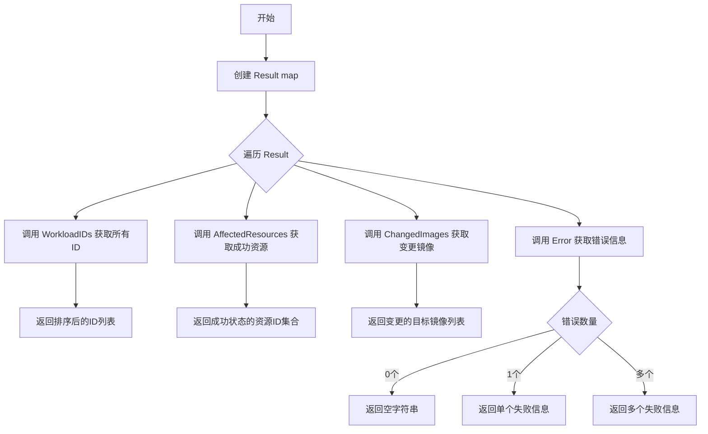
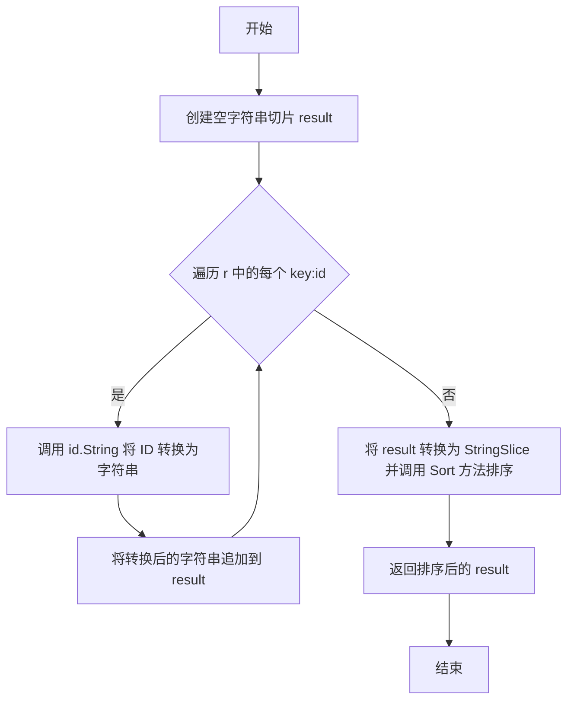
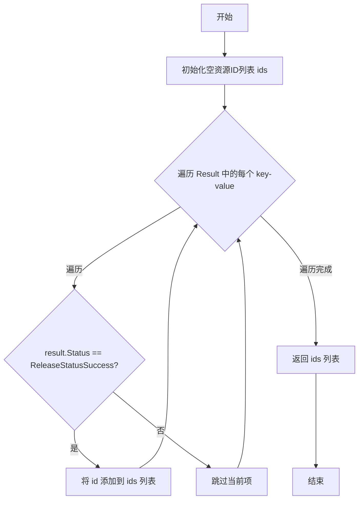
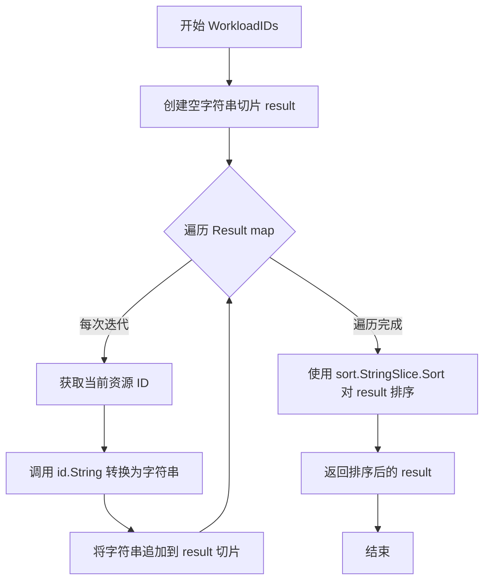
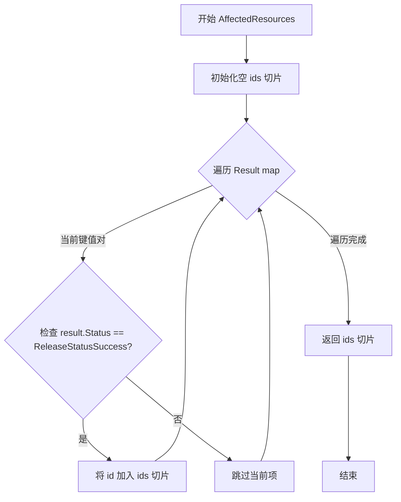
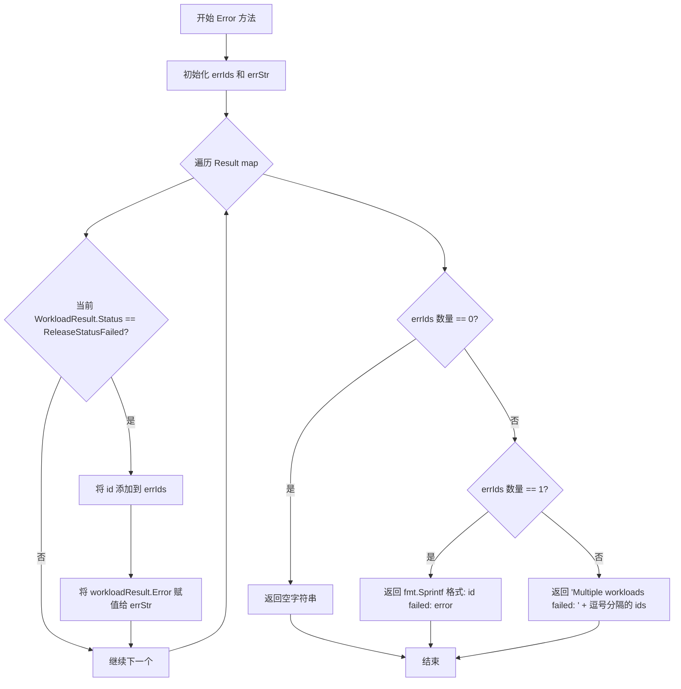
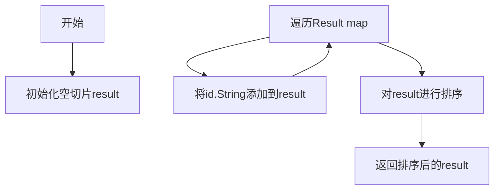
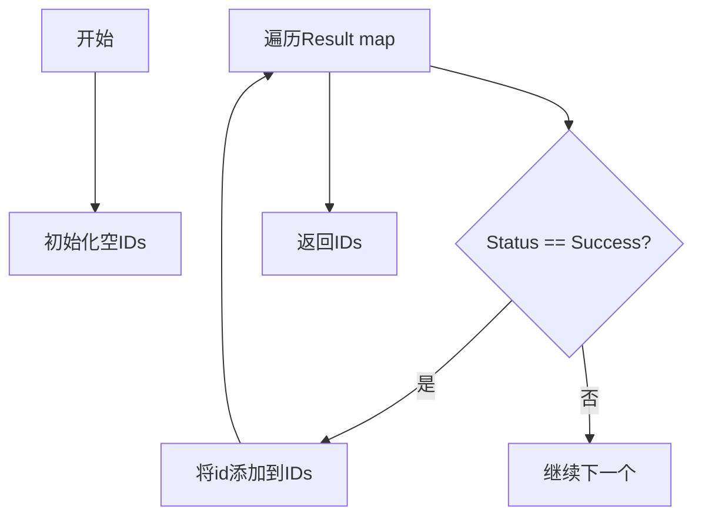
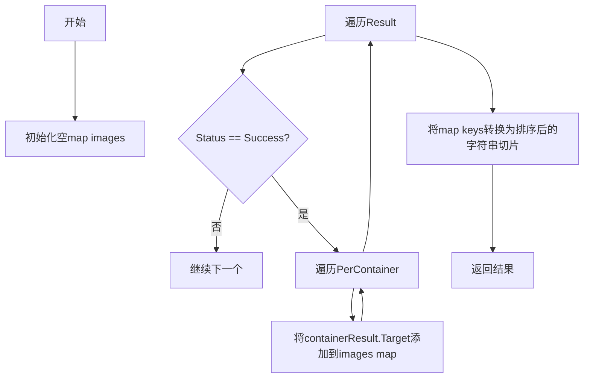
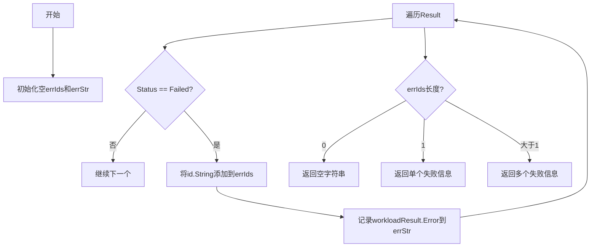

# `flux\pkg\update\result.go` 详细设计文档

该代码定义了 Flux CD 中用于跟踪工作负载更新结果的类型系统，包括发布状态常量、结果映射结构以及用于汇总成功/失败的资源ID、镜像和错误信息的方法。

## 整体流程



## 类结构

```
Result (map 类型，带方法)
├── WorkloadResult (结构体)
│   ├── Status (WorkloadUpdateStatus)
│   ├── Error (string)
│   └── PerContainer ([]ContainerUpdate)
│       └── ContainerUpdate (结构体)
│           ├── Container (string)
│           ├── Current (image.Ref)
│           └── Target (image.Ref)
└── WorkloadUpdateStatus (类型别名)
    ├── ReleaseStatusSuccess
    ├── ReleaseStatusFailed
    ├── ReleaseStatusSkipped
    ├── ReleaseStatusIgnored
    └── ReleaseStatusUnknown
```

## 全局变量及字段


### `ReleaseStatusSuccess`
    
发布成功状态常量

类型：`WorkloadUpdateStatus`
    


### `ReleaseStatusFailed`
    
发布失败状态常量

类型：`WorkloadUpdateStatus`
    


### `ReleaseStatusSkipped`
    
发布跳过状态常量

类型：`WorkloadUpdateStatus`
    


### `ReleaseStatusIgnored`
    
发布忽略状态常量

类型：`WorkloadUpdateStatus`
    


### `ReleaseStatusUnknown`
    
发布未知状态常量

类型：`WorkloadUpdateStatus`
    


### `WorkloadResult.Status`
    
更新状态摘要，如 'success'/'failed'/'ignored'

类型：`WorkloadUpdateStatus`
    


### `WorkloadResult.Error`
    
如果查找服务时出错则记录错误信息

类型：`string`
    


### `WorkloadResult.PerContainer`
    
每个容器的更新结果列表

类型：`[]ContainerUpdate`
    


### `ContainerUpdate.Container`
    
容器名称

类型：`string`
    


### `ContainerUpdate.Current`
    
当前镜像引用

类型：`image.Ref`
    


### `ContainerUpdate.Target`
    
目标镜像引用

类型：`image.Ref`
    


### `Result.map[resource.ID]WorkloadResult`
    
资源ID到工作负载结果的映射

类型：`map[resource.ID]WorkloadResult`
    
    

## 全局函数及方法


### `Result.WorkloadIDs`

该方法接收一个 `Result` 类型的映射（map），遍历其中的所有资源ID，将每个ID转换为字符串并收集到切片中，最后对结果进行排序并返回。

参数：

-  `r`：`Result`（`map[resource.ID]WorkloadResult`），接收者本身，代表更新结果的映射表，包含资源ID到工作负载结果的键值对

返回值：`[]string`，返回按字母顺序排序的所有资源ID字符串列表

#### 流程图



#### 带注释源码

```go
// WorkloadIDs 返回一个包含所有资源ID的排序字符串列表
// 参数 r: Result 类型的接收者，是一个 map[resource.ID]WorkloadResult
// 返回值: 排序后的字符串切片，包含所有资源的ID
func (r Result) WorkloadIDs() []string {
    // 1. 创建一个空字符串切片用于存储结果
	var result []string
	
    // 2. 遍历 Result map 中的所有键（资源 ID）
	for id := range r {
        // 3. 将每个 resource.ID 转换为字符串并添加到结果切片
		result = append(result, id.String())
	}
	
    // 4. 将切片转换为 sort.StringSlice 并调用 Sort 方法进行排序
    //    sort.StringSlice 实现了 sort.Interface，允许使用 Sort 方法
	sort.StringSlice(result).Sort()
	
    // 5. 返回排序后的字符串列表
	return result
}
```


### `Result.AffectedResources()`

筛选出状态为成功的资源ID集合，返回所有成功更新的工作负载的资源标识符列表。

参数：

- 该方法无显式参数（接收者 `r Result` 为隐式参数）

返回值：`resource.IDs`，返回所有状态为 `ReleaseStatusSuccess` 的资源ID列表，如果没有任何成功状态的资源则返回空切片。

#### 流程图



#### 带注释源码

```go
// AffectedResources 筛选出状态为成功的资源ID集合
// 返回：resource.IDs - 包含所有 ReleaseStatusSuccess 状态的资源ID
func (r Result) AffectedResources() resource.IDs {
    // 1. 初始化空切片用于存储成功的资源ID
    ids := resource.IDs{}
    
    // 2. 遍历Result map中的每个键值对
    //    r 是 map[resource.ID]WorkloadResult 类型
    for id, result := range r {
        // 3. 判断当前资源的状态是否为成功
        if result.Status == ReleaseStatusSuccess {
            // 4. 状态为成功时，将资源ID添加到结果集中
            ids = append(ids, id)
        }
        // 5. 状态非成功则跳过，不添加到结果集
    }
    
    // 6. 返回筛选后的资源ID列表
    return ids
}
```


### `Result.ChangedImages()`

该方法从更新结果中筛选出所有状态为成功的容器更新目标镜像，使用集合（map）去重后排序并返回镜像字符串列表，主要用于获取本次发布中实际发生变更的镜像集合。

参数：此方法为类型方法，无显式参数（隐式接受者为 `r Result`）

返回值：`[]string`，返回排序后的目标镜像名称字符串切片

#### 流程图

```mermaid
flowchart TD
    A[开始 ChangedImages] --> B[创建空镜像集合: images map[image.Ref]struct{}]
    B --> C[遍历 r 中的每个 workloadResult]
    C --> D{workloadResult.Status == ReleaseStatusSuccess?}
    D -->|否| E[跳过该 workloadResult]
    D -->|是| F[遍历 workloadResult.PerContainer]
    F --> G[将 containerResult.Target 加入 images 集合]
    G --> C
    E --> C
    C --> H[创建空字符串切片 result]
    H --> I[遍历 images 集合]
    I --> J[将每个 image.Ref 转为字符串加入 result]
    J --> K[对 result 进行排序]
    K --> L[返回排序后的 result]
```

#### 带注释源码

```go
// ChangedImages 收集所有成功容器更新的目标镜像并排序输出
// 输入：当前 Result 实例（map[resource.ID]WorkloadResult）
// 输出：排序后的镜像名称字符串切片 []string
func (r Result) ChangedImages() []string {
    // 1. 创建镜像引用集合，使用 map 实现去重（键为 image.Ref，值为空结构体）
    images := map[image.Ref]struct{}{}
    
    // 2. 遍历 Result 中的所有 workloadResult
    for _, workloadResult := range r {
        // 3. 只处理状态为成功的更新
        if workloadResult.Status != ReleaseStatusSuccess {
            continue // 跳过非成功的 workload
        }
        
        // 4. 遍历该 workload 的所有容器更新结果
        for _, containerResult := range workloadResult.PerContainer {
            // 5. 将目标镜像添加到集合（自动去重）
            images[containerResult.Target] = struct{}{}
        }
    }
    
    // 6. 将 map 键转换为字符串切片
    var result []string
    for image := range images {
        result = append(result, image.String())
    }
    
    // 7. 对结果进行字母排序以保证输出顺序一致性
    sort.StringSlice(result).Sort()
    
    // 8. 返回排序后的镜像名称列表
    return result
}
```


### `Result.Error`

该方法用于汇总构建失败信息字符串，遍历所有工作负载结果，收集状态为失败（ReleaseStatusFailed）的工作负载ID和错误信息，并根据失败数量返回格式化的错误描述字符串。

参数：

- （无显式参数，使用接收者 `r`）

返回值：`string`，返回格式化的错误信息字符串，如果所有工作负载都成功则返回空字符串

#### 流程图

```mermaid
flowchart TD
    A[开始] --> B[初始化 errIds 和 errStr]
    B --> C{遍历 r 中的每个 workloadResult}
    C -->|遍历| D{检查 Status == ReleaseStatusFailed?}
    D -->|是| E[将 id.String() 添加到 errIds]
    E --> F[将 workloadResult.Error 赋值给 errStr]
    D -->|否| C
    F --> C
    C -->|遍历完成| G{len(errIds) == 0?}
    G -->|是| H[返回空字符串 ""]
    G -->|否| I{len(errIds) == 1?}
    I -->|是| J[返回 fmt.Sprintf&#40;\"%s failed: %s\", errIds[0], errStr&#41;]
    I -->|否| K[返回 fmt.Sprintf&#40;\"Multiple workloads failed: %s\", strings.Join&#40;errIds, \", \"&#41;&#41;]
    H --> L[结束]
    J --> L
    K --> L
```

#### 带注释源码

```go
// Error 返回该发布的错误信息（如果有）
// 如果所有工作负载都成功，则返回空字符串
// 如果只有一个工作负载失败，返回格式如 "workload-id failed: error-message"
// 如果多个工作负载失败，返回格式如 "Multiple workloads failed: workload-1, workload-2"
func (r Result) Error() string {
    // 用于存储失败工作负载的ID列表
    var errIds []string
    // 用于存储错误信息字符串（注意：这里只保留最后一个错误信息）
    var errStr string
    
    // 遍历Result map中的所有工作负载结果
    for id, workloadResult := range r {
        // 只处理状态为失败的工作负载
        if workloadResult.Status == ReleaseStatusFailed {
            // 将失败工作负载的ID字符串添加到列表中
            errIds = append(errIds, id.String())
            // 记录错误信息（注意：这里会覆盖之前的错误信息，只保留最后一个）
            errStr = workloadResult.Error
        }
    }
    
    // 根据失败数量返回不同的错误格式
    switch {
    // 没有失败的工作负载，返回空字符串
    case len(errIds) == 0:
        return ""
    // 只有一个工作负载失败，返回详细错误信息
    case len(errIds) == 1:
        return fmt.Sprintf("%s failed: %s", errIds[0], errStr)
    // 多个工作负载失败，只列出失败的ID列表
    default:
        return fmt.Sprintf("Multiple workloads failed: %s", strings.Join(errIds, ", "))
    }
}
```


### `Result.WorkloadIDs()`

获取所有工作负载ID并返回按字母顺序排序的字符串列表。该方法遍历Result映射中的所有资源ID，将它们转换为字符串格式，然后使用sort包进行排序后返回。

参数：

- （无参数，该方法使用接收者 `r Result`）

返回值：`[]string`，返回所有工作负载ID的排序列表

#### 流程图



#### 带注释源码

```go
// WorkloadIDs 返回一个包含所有工作负载ID的排序列表
// 接收者: r Result - Result 是 map[resource.ID]WorkloadResult 的类型别名
// 返回值: []string - 排序后的工作负载ID字符串切片
func (r Result) WorkloadIDs() []string {
	var result []string                    // 1. 声明一个空字符串切片用于存储结果
	for id := range r {                    // 2. 遍历Result map中的所有键（resource.ID）
		result = append(result, id.String()) // 3. 将每个resource.ID转换为字符串并追加到切片
	}
	sort.StringSlice(result).Sort()        // 4. 使用sort包对字符串切片进行原地排序
	return result                           // 5. 返回排序后的工作负载ID列表
}
```


### `Result.AffectedResources`

该方法用于从更新结果集中筛选出状态为成功的资源ID集合，并返回一个包含所有成功更新资源标识符的切片。

参数：

- 该方法为成员方法，无显式参数（隐式接收者为 `r`，类型为 `Result`，即 `map[resource.ID]WorkloadResult`）

返回值：`resource.IDs`，返回包含所有状态为 `ReleaseStatusSuccess` 的资源ID集合。

#### 流程图



#### 带注释源码

```go
// AffectedResources 返回状态为成功的资源ID集合
// 该方法遍历 Result map，筛选出所有 Status 为 ReleaseStatusSuccess 的资源ID
// 返回一个 resource.IDs 类型的切片，包含所有成功更新的资源标识符
func (r Result) AffectedResources() resource.IDs {
    // 1. 初始化一个空的 resource.IDs 切片用于存储结果
    ids := resource.IDs{}
    
    // 2. 遍历 Result map 中的每个键值对
    // r 是 map[resource.ID]WorkloadResult 类型
    for id, result := range r {
        // 3. 检查当前工作负载的更新状态是否为成功
        if result.Status == ReleaseStatusSuccess {
            // 4. 如果状态为成功，将资源ID添加到结果切片中
            ids = append(ids, id)
        }
    }
    
    // 5. 返回包含所有成功资源ID的切片
    return ids
}
```


### `Result.ChangedImages`

该方法用于从发布结果中提取所有成功更新的目标镜像列表，并返回排序后的镜像引用字符串数组。通过遍历所有工作负载的更新结果，筛选出状态为成功（ReleaseStatusSuccess）的记录，收集其容器更新的目标镜像，最后进行去重和排序处理。

参数：

- 该方法无显式参数（接收者 `r Result` 为隐式参数）

返回值：`[]string`，返回排序后的所有变更的目标镜像列表（字符串数组）

#### 流程图

```mermaid
flowchart TD
    A[开始 ChangedImages] --> B[创建空 map: images map[image.Ref]struct{}]
    B --> C{遍历 r 中的每个 workloadResult}
    C --> D{检查 workloadResult.Status == ReleaseStatusSuccess?}
    D -->|否| C
    D -->|是| E{遍历 workloadResult.PerContainer 中的每个 containerResult}
    E --> F[将 containerResult.Target 加入 images map]
    F --> G{PerContainer 遍历完成?}
    G -->|否| E
    G -->|是| C
    C --> H{所有 WorkloadResult 遍历完成?}
    H -->|否| C
    H -->|是| I[创建空切片 result]
    I --> J{遍历 images map 中的每个 image}
    J --> K[将 image.String() 加入 result 切片]
    K --> L{images map 遍历完成?}
    L -->|否| J
    L -->|是| M[对 result 切片进行排序]
    M --> N[返回排序后的 result]
    N --> O[结束]
```

#### 带注释源码

```go
// ChangedImages 返回所有变更的目标镜像列表（排序）
// 该方法遍历 Result 中的所有工作负载更新结果，筛选出成功更新的镜像
// 并返回去重且排序后的镜像引用字符串数组
func (r Result) ChangedImages() []string {
	// 1. 创建空 map 用于去重存储镜像引用
	// 使用 struct{} 作为值类型以节省内存
	images := map[image.Ref]struct{}{}

	// 2. 遍历 Result 中的所有工作负载结果
	for _, workloadResult := range r {
		// 3. 只处理状态为成功的工作负载
		// 跳过失败、跳过或忽略的工作负载
		if workloadResult.Status != ReleaseStatusSuccess {
			continue
		}

		// 4. 遍历该工作负载中每个容器的更新结果
		for _, containerResult := range workloadResult.PerContainer {
			// 5. 将目标镜像存入 map（自动去重）
			// image.Ref 作为 map 的 key，确保唯一性
			images[containerResult.Target] = struct{}{}
		}
	}

	// 6. 创建字符串切片用于存储最终结果
	var result []string

	// 7. 将 map 的键（镜像引用）转换为字符串并加入切片
	for image := range images {
		// 调用 String() 方法将 image.Ref 转换为字符串格式
		result = append(result, image.String())
	}

	// 8. 对结果切片进行字母排序
	// 使用 sort.StringSlice 包装后调用 Sort 方法
	sort.StringSlice(result).Sort()

	// 9. 返回排序后的镜像字符串列表
	return result
}
```


### `Result.Error()`

返回发布的错误信息字符串，如果存在失败的工作负载则返回具体的错误描述，否则返回空字符串。

参数：
- 无

返回值：`string`，返回错误信息字符串，如果没有失败的工作负载则返回空字符串

#### 流程图



#### 带注释源码

```go
// Error returns the error for this release (if any)
// Error 返回此版本的错误信息（如果有）
func (r Result) Error() string {
    // 存储失败工作负载的ID列表
	var errIds []string
    // 存储错误信息字符串
	var errStr string
    // 遍历Result map中的每个条目
	for id, workloadResult := range r {
        // 仅处理状态为失败的工作负载
		if workloadResult.Status == ReleaseStatusFailed {
            // 将失败的ID添加到列表中
			errIds = append(errIds, id.String())
            // 获取错误信息（只保存最后一个失败工作负载的错误）
			errStr = workloadResult.Error
		}
	}
    // 根据失败数量返回不同的错误消息
	switch {
    // 没有失败的工作负载
	case len(errIds) == 0:
		return ""
    // 只有一个失败的工作负载
	case len(errIds) == 1:
        // 格式: "{工作负载ID} failed: {错误信息}"
		return fmt.Sprintf("%s failed: %s", errIds[0], errStr)
    // 多个失败的工作负载
	default:
        // 格式: "Multiple workloads failed: {id1, id2, ...}"
		return fmt.Sprintf("Multiple workloads failed: %s", strings.Join(errIds, ", "))
	}
}
```

## 关键组件


### Result 类型 (map[resource.ID]WorkloadResult)

用于存储工作负载更新结果的核心数据结构，键为资源ID，值为WorkloadResult，提供查询受影响资源和已更改镜像的功能。

### WorkloadUpdateStatus 类型

枚举类型，定义工作负载更新的五种状态：成功、失败、跳过、忽略和未知，用于表示更新操作的最终结果。

### WorkloadResult 结构体

包含单个工作负载的更新结果，记录整体状态、更新错误信息以及每个容器的具体更新情况（当前镜像和目标镜像）。

### ContainerUpdate 结构体

表示单个容器的镜像更新信息，包含容器名称、当前镜像引用和目标镜像引用。

### WorkloadIDs() 方法

从Result中提取所有工作负载的资源ID并排序返回，用于获取更新操作涉及的所有工作负载标识。

### AffectedResources() 方法

筛选并返回状态为成功的资源ID列表，表示实际发生变更的资源。

### ChangedImages() 方法

收集所有成功更新的容器目标镜像，并以排序后的字符串列表返回，用于追踪镜像变更情况。

### Error() 方法

汇总所有失败工作负载的错误信息，如果只有一个失败则返回具体错误，如果有多个失败则返回聚合的多工作负载失败消息。


## 问题及建议


### 已知问题

- **Error方法只保留最后一个错误信息**：当多个工作负载失败时，errStr变量会被后续迭代覆盖，导致最终只返回最后一个失败工作的错误描述，丢失其他错误信息
- **Result作为map类型直接暴露**：直接使用map类型作为返回值，无法保护内部状态，且非线程安全，缺乏封装性
- **WorkloadResult的Status字段类型约束不足**：使用string类型而非自定义类型枚举，无法在编译期检查状态值的合法性，容易传入非法值
- **缺乏并发安全机制**：Result类型没有任何同步保护，在并发场景下直接操作map存在数据竞争风险
- **ChangedImages方法每次都重新构建和排序**：即使数据未变化，频繁调用时都会执行map遍历和排序操作，缺乏缓存机制
- **WorkloadIDs方法每次调用都排序**：排序操作时间复杂度O(n log n)，对于大结果集频繁调用时会有性能开销
- **错误信息格式不统一**：单个失败时返回详细错误，多个失败时只返回ID列表，缺少错误原因

### 优化建议

- **Error方法收集所有错误**：将errStr改为收集所有错误信息的切片，或使用errors.Join组合多个错误
- **封装Result为结构体**：将map类型包装为自定义结构体，提供只读访问方法，并可内部实现线程安全的缓存
- **为Status定义严格类型**：创建WorkloadUpdateStatus类型并实现String()方法，或使用iota定义常量确保类型安全
- **添加并发保护**：使用sync.RWMutex保护Result的读写操作，或提供不可变版本
- **缓存排序结果**：添加缓存机制或提供批量获取已排序ID的方法，避免重复排序
- **统一错误返回格式**：无论单失败还是多失败，都返回包含所有错误详情的结构化信息
- **考虑使用值Receiver**：当前Result方法使用指针Receiver，如果Result很大复制成本高，可评估是否改用值Receiver或提供不可变版本

## 其它


### 一段话描述

该代码是Flux CD项目中用于表示工作负载（Workload）更新结果的数据结构定义包，提供了工作负载更新状态的枚举、结果映射以及用于提取受影响资源和镜像的辅助方法。

### 文件的整体运行流程

该包主要作为数据模型使用，不涉及主动运行流程。当Flux CD执行工作负载更新操作后，会创建Result对象来存储每个resource.ID对应的WorkloadResult，其中包含更新状态、错误信息以及每个容器的镜像变更详情。外部调用者可以通过Result类型的方法获取排序后的工作负载ID列表、成功更新的资源ID列表、变更的镜像列表以及聚合的错误信息。

### 类的详细信息

#### WorkloadUpdateStatus (类型)

- **类型**: string
- **描述**: 表示工作负载更新状态的字符串类型，用于区分更新成功、失败、跳过、被忽略或未知等情况

#### Result (类型)

- **类型**: map[resource.ID]WorkloadResult
- **描述**: 核心数据结构，将资源ID映射到对应的工作负载更新结果，支持通过ID查询特定工作负载的更新状态

#### WorkloadResult (结构体)

- **字段**:
  - Status: WorkloadUpdateStatus - 更新结果的摘要状态
  - Error: string - 当更新失败时的错误信息
  - PerContainer: []ContainerUpdate - 每个容器的更新详情列表

#### ContainerUpdate (结构体)

- **字段**:
  - Container: string - 容器名称
  - Current: image.Ref - 当前使用的镜像引用
  - Target: image.Ref - 目标镜像引用

### 类字段详细信息

#### WorkloadUpdateStatus 类型字段

- 无显式字段（基于string的类型别名）

#### Result 类型字段

- 无显式字段（基于map的类型）

#### WorkloadResult 结构体字段

| 名称 | 类型 | 描述 |
|------|------|------|
| Status | WorkloadUpdateStatus | 更新结果的摘要状态，如success、failed、skipped等 |
| Error | string | 当发生错误时的错误描述信息 |
| PerContainer | []ContainerUpdate | 每个容器的详细更新信息列表 |

#### ContainerUpdate 结构体字段

| 名称 | 类型 | 描述 |
|------|------|------|
| Container | string | 容器在Podspec中的名称 |
| Current | image.Ref | 容器当前使用的镜像 |
| Target | image.Ref | 容器将要更新到的目标镜像 |

### 类方法和全局函数详细信息

#### Result.WorkloadIDs() 方法

- **名称**: WorkloadIDs
- **参数**: 无
- **参数类型**: 无
- **参数描述**: 无
- **返回值类型**: []string
- **返回值描述**: 返回排序后的所有工作负载ID字符串列表
- **mermaid流程图**:

- **带注释源码**:
```go
// WorkloadIDs返回排序后的工作负载ID列表
// 遍历Result中的所有key，将ID转换为字符串并收集到切片中
// 最后使用sort.StringSlice进行排序后返回
func (r Result) WorkloadIDs() []string {
    var result []string
    for id := range r {
        result = append(result, id.String())
    }
    sort.StringSlice(result).Sort()
    return result
}
```

#### Result.AffectedResources() 方法

- **名称**: AffectedResources
- **参数**: 无
- **参数类型**: 无
- **参数描述**: 无
- **返回值类型**: resource.IDs
- **返回值描述**: 返回所有更新状态为成功的资源ID列表
- **mermaid流程图**:

- **带注释源码**:
```go
// AffectedResources返回成功更新的资源ID列表
// 筛选出Status为ReleaseStatusSuccess的所有资源ID
// 用于确定哪些资源受到了更新操作的影响
func (r Result) AffectedResources() resource.IDs {
    ids := resource.IDs{}
    for id, result := range r {
        if result.Status == ReleaseStatusSuccess {
            ids = append(ids, id)
        }
    }
    return ids
}
```

#### Result.ChangedImages() 方法

- **名称**: ChangedImages
- **参数**: 无
- **参数类型**: 无
- **参数描述**: 无
- **返回值类型**: []string
- **返回值描述**: 返回所有成功更新的容器所使用的目标镜像字符串列表（去重排序）
- **mermaid流程图**:

- **带注释源码**:
```go
// ChangedImages返回成功更新的所有目标镜像列表
// 使用map实现去重，遍历所有成功状态的工作负载
// 提取每个容器的Target镜像并返回排序后的字符串列表
func (r Result) ChangedImages() []string {
    images := map[image.Ref]struct{}{}
    for _, workloadResult := range r {
        if workloadResult.Status != ReleaseStatusSuccess {
            continue
        }
        for _, containerResult := range workloadResult.PerContainer {
            images[containerResult.Target] = struct{}{}
        }
    }
    var result []string
    for image := range images {
        result = append(result, image.String())
    }
    sort.StringSlice(result).Sort()
    return result
}
```

#### Result.Error() 方法

- **名称**: Error
- **参数**: 无
- **参数类型**: 无
- **参数描述**: 无
- **返回值类型**: string
- **返回值描述**: 返回聚合的错误信息字符串，如果没有错误则返回空字符串
- **mermaid流程图**:

- **带注释源码**:
```go
// Error返回发布过程的错误信息（如果有）
// 收集所有状态为Failed的工作负载ID和错误信息
// 根据失败数量返回不同格式的错误字符串
func (r Result) Error() string {
    var errIds []string
    var errStr string
    for id, workloadResult := range r {
        if workloadResult.Status == ReleaseStatusFailed {
            errIds = append(errIds, id.String())
            errStr = workloadResult.Error
        }
    }
    switch {
    case len(errIds) == 0:
        return ""
    case len(errIds) == 1:
        return fmt.Sprintf("%s failed: %s", errIds[0], errStr)
    default:
        return fmt.Sprintf("Multiple workloads failed: %s", strings.Join(errIds, ", "))
    }
}
```

### 全局变量详细信息

| 名称 | 类型 | 描述 |
|------|------|------|
| ReleaseStatusSuccess | WorkloadUpdateStatus | 表示工作负载更新成功完成 |
| ReleaseStatusFailed | WorkloadUpdateStatus | 表示工作负载更新失败 |
| ReleaseStatusSkipped | WorkloadUpdateStatus | 表示工作负载更新被跳过 |
| ReleaseStatusIgnored | WorkloadUpdateStatus | 表示工作负载被忽略（未做更新） |
| ReleaseStatusUnknown | WorkloadUpdateStatus | 表示工作负载更新状态未知 |

### 全局函数详细信息

无独立全局函数，所有函数均为类型方法。

### 关键组件信息

| 组件名称 | 描述 |
|----------|------|
| Result类型 | 核心数据结构，作为工作负载更新结果的聚合容器，提供查询和分析更新结果的便捷方法 |
| WorkloadUpdateStatus枚举 | 定义了工作负载更新可能处于的所有状态，用于状态跟踪和结果判断 |
| WorkloadResult结构体 | 单个工作负载的更新结果，包含总体状态、错误信息和容器级详细更新信息 |
| ContainerUpdate结构体 | 描述单个容器从当前镜像到目标镜像的更新过程 |

### 潜在的技术债务或优化空间

1. **Error方法只保留最后一个错误信息**: 当多个工作负载更新失败时，Error方法只记录最后一个失败的错误字符串，可能导致前面的错误信息丢失，建议使用错误切片或更详细的错误聚合方式。

2. **缺少序列化/反序列化方法**: Result类型实现了Error()方法但未实现error接口的Error()函数签名（因为参数为r Result而非*Result），且缺少JSON序列化相关的标签和方法。

3. **镜像去重使用map可能丢失信息**: ChangedImages方法使用map去重，如果同一个镜像被多次更新为目标，只会保留一次，无法体现更新的次数。

4. **缺乏对空Result的处理**: 方法未对空的Result进行特殊处理，可能在边界情况下产生意外行为。

5. **类型导出性设计**: ContainerUpdate的字段未使用导出（首字母大写），限制了其在包外的使用灵活性。

### 设计目标与约束

- **设计目标**: 提供清晰的工作负载更新结果表示，支持状态追踪、错误聚合和变更分析
- **约束**: 依赖于fluxcd/flux/pkg/image和fluxcd/flux/pkg/resource两个外部包，必须与Flux CD生态系统配合使用

### 错误处理与异常设计

- Result.Error()方法通过遍历所有失败的WorkloadResult来聚合错误信息
- 当单个工作负载失败时，返回格式为"{ID} failed: {Error}"
- 当多个工作负载失败时，返回"Multiple workloads failed: {id1, id2, ...}"
- 错误信息仅包含最后一个失败工作的具体错误文本，存在信息丢失风险

### 数据流与状态机

- **数据输入**: Flux CD更新引擎执行工作负载更新后，创建Result对象填充每个resource.ID对应的WorkloadResult
- **数据处理**: Result类型提供三种查询方法：获取工作负载ID列表、获取成功资源列表、获取变更镜像列表
- **状态流转**: WorkloadUpdateStatus定义了五状态流转：unknown -> (success/failed/skipped/ignored)
- **数据输出**: 外部系统通过方法调用获取结构化的更新结果用于报告或后续处理

### 外部依赖与接口契约

- **依赖包**: 
  - github.com/fluxcd/flux/pkg/image - 提供image.Ref类型用于镜像引用表示
  - github.com/fluxcd/flux/pkg/resource - 提供resource.ID和resource.IDs类型用于资源标识
- **接口契约**: 
  - Result类型期望与Flux CD的更新引擎配合使用
  - resource.ID类型需实现String()方法以支持WorkloadIDs()方法的输出
  - image.Ref类型需实现String()方法以支持ChangedImages()方法的输出
- **导入的标准库**: fmt、sort、strings用于字符串格式化和排序操作


    