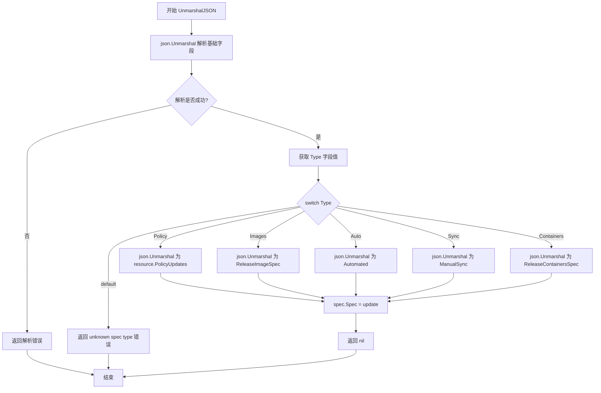
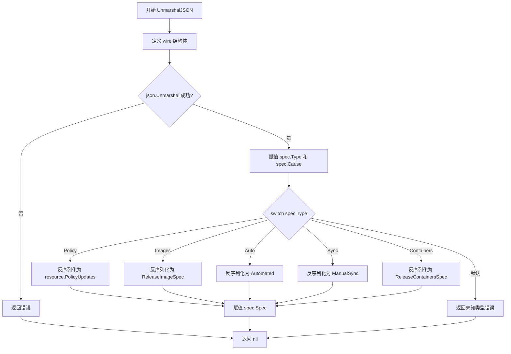
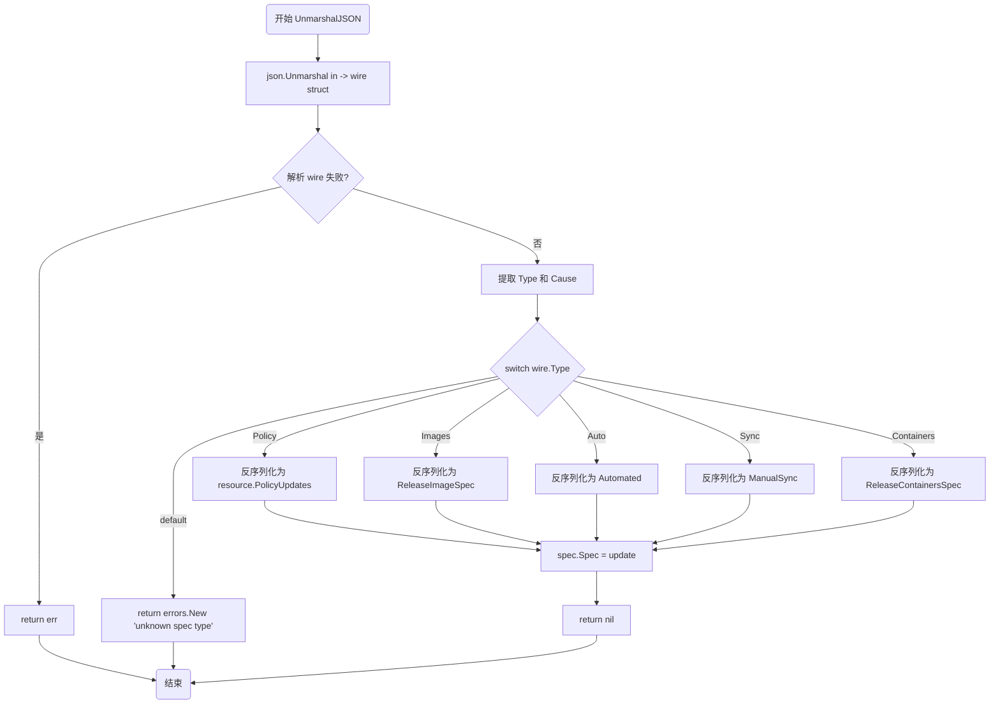

# `flux\pkg\update\spec.go` 详细设计文档

这是 Flux CD 的更新规范定义包，通过定义 Cause（触发原因）和 Spec（带标签的联合体）来统一处理多种更新类型的反序列化，支持策略更新、镜像更新、自动化更新、手动同步和容器更新五种更新场景。

## 整体流程



## 类结构

```
update 包
├── 常量定义
│   ├── Images
│   ├── Policy
│   ├── Auto
│   ├── Sync
│   └── Containers
├── Cause 结构体
│   ├── Message 字段
│   └── User 字段
└── Spec 结构体 (带自定义 UnmarshalJSON)
├── Type 字段
├── Cause 字段
└── Spec 字段
```

## 全局变量及字段


### `Images`
    
更新类型常量，表示镜像更新

类型：`string`
    


### `Policy`
    
更新类型常量，表示策略更新

类型：`string`
    


### `Auto`
    
更新类型常量，表示自动化更新

类型：`string`
    


### `Sync`
    
更新类型常量，表示同步更新

类型：`string`
    


### `Containers`
    
更新类型常量，表示容器更新

类型：`string`
    


### `Cause.Message`
    
触发更新的消息描述

类型：`string`
    


### `Cause.User`
    
触发更新的用户标识

类型：`string`
    


### `Spec.Type`
    
更新类型的标识符

类型：`string`
    


### `Spec.Cause`
    
触发更新的原因

类型：`Cause`
    


### `Spec.Spec`
    
具体的更新规范内容

类型：`interface{}`
    
    

## 全局函数及方法


### `Spec.UnmarshalJSON`

该方法实现了自定义 JSON 反序列化逻辑，根据 JSON 数据中的 `type` 字段动态确定 `spec` 字段的具体类型，并将数据反序列化为相应的结构体（PolicyUpdates、ReleaseImageSpec、Automated、ManualSync 或 ReleaseContainersSpec）。

参数：

- `in`：`[]byte`，待反序列化的 JSON 字节切片

返回值：`error`，如果反序列化过程中发生错误则返回错误，否则返回 nil

#### 流程图



#### 带注释源码

```go
// UnmarshalJSON 实现自定义 JSON 反序列化
// 根据 type 字段的值动态确定 spec 字段的具体类型
func (spec *Spec) UnmarshalJSON(in []byte) error {
	// 定义临时结构体用于初步解析
	// SpecBytes 用于延迟解析，因为类型未知
	var wire struct {
		Type      string          `json:"type"`       // 更新类型：policy/images/auto/sync/containers
		Cause     Cause           `json:"cause"`      // 触发原因
		SpecBytes json.RawMessage `json:"spec"`       // 原始 spec 数据，需要根据类型二次解析
	}

	// 第一步：解析外层结构，获取 type、cause 和原始 spec 数据
	if err := json.Unmarshal(in, &wire); err != nil {
		// JSON 格式错误，直接返回解析错误
		return err
	}
	
	// 将解析出的类型和原因赋值到目标结构体
	spec.Type = wire.Type
	spec.Cause = wire.Cause

	// 第二步：根据 type 字段的值，进行不同的反序列化
	switch wire.Type {
	case Policy:
		// 策略更新类型
		var update resource.PolicyUpdates
		if err := json.Unmarshal(wire.SpecBytes, &update); err != nil {
			return err
		}
		spec.Spec = update

	case Images:
		// 镜像发布类型
		var update ReleaseImageSpec
		if err := json.Unmarshal(wire.SpecBytes, &update); err != nil {
			return err
		}
		spec.Spec = update

	case Auto:
		// 自动化更新类型
		var update Automated
		if err := json.Unmarshal(wire.SpecBytes, &update); err != nil {
			return err
		}
		spec.Spec = update

	case Sync:
		// 手动同步类型
		var update ManualSync
		if err := json.Unmarshal(wire.SpecBytes, &update); err != nil {
			return err
		}
		spec.Spec = update

	case Containers:
		// 容器发布类型
		var update ReleaseContainersSpec
		if err := json.Unmarshal(wire.SpecBytes, &update); err != nil {
			return err
		}
		spec.Spec = update

	default:
		// 未知类型，返回错误
		return errors.New("unknown spec type: " + wire.Type)
	}
	return nil
}
```


### `Spec.UnmarshalJSON`

实现 `json.Unmarshaler` 接口的自定义方法。该方法首先将输入的 JSON 数据解析为一个中间结构体以提取 `type` 字段，然后根据 `type` 的值将原始的 `spec` 字节流动态反序列化为对应的具体更新规范对象（如策略更新、镜像发布等），实现了对多态数据的支持。

参数：

- `in`：`[]byte`，待反序列化的 JSON 字节切片。

返回值：`error`，如果 JSON 格式错误、类型未知或子规范解析失败则返回错误；成功时返回 `nil`。

#### 流程图



#### 带注释源码

```go
// UnmarshalJSON 实现 json.Unmarshaler 接口的自定义反序列化逻辑。
// 它根据 JSON 数据中的 type 字段动态决定 spec 字段的具体类型。
func (spec *Spec) UnmarshalJSON(in []byte) error {
    // 1. 定义一个中间结构体 wire，用于接收原始 JSON 数据。
    // 注意：这里将 Spec 字段定义为 json.RawMessage，以便稍后根据 Type 动态解析。
    var wire struct {
        Type      string          `json:"type"`
        Cause     Cause           `json:"cause"`
        SpecBytes json.RawMessage `json:"spec"`
    }

    // 2. 首先解析 JSON 的外层结构，提取 Type, Cause 和原始的 Spec 字节数据。
    if err := json.Unmarshal(in, &wire); err != nil {
        return err // 如果 JSON 格式错误，直接返回错误
    }

    // 3. 将解析出的公共字段赋值给 Spec 对象。
    spec.Type = wire.Type
    spec.Cause = wire.Cause

    // 4. 根据 Type 字段的值，使用 switch 语句决定将 SpecBytes 解析为何种具体的结构体。
    switch wire.Type {
    case Policy:
        // 处理策略更新类型
        var update resource.PolicyUpdates
        if err := json.Unmarshal(wire.SpecBytes, &update); err != nil {
            return err
        }
        spec.Spec = update

    case Images:
        // 处理镜像发布类型
        var update ReleaseImageSpec
        if err := json.Unmarshal(wire.SpecBytes, &update); err != nil {
            return err
        }
        spec.Spec = update

    case Auto:
        // 处理自动化更新类型
        var update Automated
        if err := json.Unmarshal(wire.SpecBytes, &update); err != nil {
            return err
        }
        spec.Spec = update

    case Sync:
        // 处理手动同步类型
        var update ManualSync
        if err := json.Unmarshal(wire.SpecBytes, &update); err != nil {
            return err
        }
        spec.Spec = update

    case Containers:
        // 处理容器发布类型
        var update ReleaseContainersSpec
        if err := json.Unmarshal(wire.SpecBytes, &update); err != nil {
            return err
        }
        spec.Spec = update

    default:
        // 如果遇到了未知的 type 类型，返回错误
        return errors.New("unknown spec type: " + wire.Type)
    }

    // 5. 解析成功，返回 nil
    return nil
}
```

## 关键组件


### 常量定义 (Images, Policy, Auto, Sync, Containers)

定义更新类型的字符串常量，用于在JSON中标识不同的更新种类，包括镜像更新、策略更新、自动化更新、同步更新和容器更新。

### Cause 结构体

表示更新触发的原因，包含触发消息和触发用户信息，用于记录和追溯更新的来源。

### Spec 结构体

一个标记联合（tagged union）结构体，用于统一表示不同类型的更新。包含更新类型、触发原因和具体更新内容，其中Spec字段为interface{}类型以支持多态。

### UnmarshalJSON 方法

自定义的JSON反序列化方法，根据Type字段的值动态解析不同类型的更新内容到Spec字段。支持Policy、Images、Auto、Sync、Containers五种更新类型的反序列化，采用类型开关（switch）实现多态解析。


## 问题及建议


### 已知问题

- 使用 `interface{}` 存储不同类型的 Spec 数据，导致运行时类型断言风险，缺乏编译时类型安全
- 错误处理使用 `errors.New("unknown spec type: " + wire.Type)` 动态创建错误，调用方无法使用 `errors.Is()` 或 `errors.As()` 进行精确错误判断
- `UnmarshalJSON` 方法未处理 `Type` 字段为空或 `Spec` 字段为 `null` 的边界情况
- `Cause` 结构体缺少字段验证（如 `Message` 是否可为空）
- 缺少对 `wire.Type` 值的预验证，任何未知字符串都会触发默认分支返回错误
- 代码中 magic string 散落，若后续常量名称变更可能导致不一致

### 优化建议

- 定义具体的错误变量（如 `ErrUnknownSpecType`）供外部包检测
- 为 `Spec` 和 `Cause` 添加 `Validate()` 方法进行输入校验
- 考虑使用 Go 1.18+ 泛型或定义明确的联合类型替代 `interface{}`
- 在 `UnmarshalJSON` 开头增加对空输入的防御性检查
- 为关键结构体和方法添加文档注释，提升可维护性

## 其它


### 设计目标与约束

本包的设计目标是提供一种统一的结构来表示Flux CD中的各种更新操作，支持通过JSON反序列化将不同类型的更新规范（Policy、Images、Auto、Sync、Containers）反序列化为具体的Go结构体。约束条件包括：必须实现自定义的UnmarshalJSON方法以支持多态反序列化，更新类型必须在预定义的常量列表中，否则返回错误。

### 错误处理与异常设计

本包采用显式错误返回机制。JSON反序列化过程中可能出现的错误包括：JSON格式错误（json.Unmarshal返回的标准错误）、未知更新类型错误（当Type字段值不在支持列表中时返回errors.New）、以及各具体更新类型的内部字段验证错误。所有错误均通过返回值传播，不使用panic机制。错误消息应具有描述性，便于调试。

### 数据流与状态机

数据流方向为：外部JSON输入 → Spec结构体 UnmarshalJSON方法 → 类型判断 → 具体更新类型的反序列化 → Spec.Spec字段存储。状态转换依赖于JSON中的type字段：初始状态为解析type字段，然后根据type值分发到对应的反序列化逻辑，最后将解析结果存储到Spec.Spec接口字段。不涉及复杂的状态机，主要为简单的分发-反序列化流程。

### 外部依赖与接口契约

本包依赖两个外部包：标准库encoding/json用于JSON解析，标准库errors用于创建错误对象。此外，从github.com/fluxcd/flux/pkg/resource导入PolicyUpdates类型。接口契约方面，Spec结构体实现了json.Unmarshaler接口，支持标准的json.Unmarshal调用。公开的类型包括：Cause（触发原因）、Spec（更新规范）、常量Images/Policy/Auto/Sync/Containers（更新类型标识）。

### 并发与线程安全考虑

本包中的结构体不包含可变状态，Spec结构体的字段在反序列化后即为只读。UnmarshalJSON方法接收指针接收者，但不存在并发写入场景，因此不需要额外的并发控制机制。使用时由调用方保证在同一时刻只有一个goroutine对同一个Spec实例进行反序列化操作。

### 性能考虑

JSON反序列化采用两阶段解析策略：首先解析外层结构获取type字段，然后根据type值再次解析具体的spec内容。这种方式在JSON嵌套较深时会产生额外的内存拷贝（wire.SpecBytes存储原始字节），但提供了更好的类型安全和灵活性。性能瓶颈主要在json.Unmarshal的调用次数上，当前实现针对5种更新类型进行了优化。

### 安全性考虑

本包处理来自外部的JSON输入，需要注意：Type字段未进行严格的输入验证，仅与预定义常量比较，防止注入未知类型；Spec字段存储为interface{}类型，反序列化后的具体类型取决于type值，需要调用方进行类型断言后才能安全使用；JSON解析过程中不会执行任意代码，安全性依赖Go标准库json包的实现。

### 测试策略

建议编写以下测试用例：正常反序列化每种更新类型（Policy、Images、Auto、Sync、Containers）的JSON；验证未知type类型返回预期错误；测试JSON格式错误时的错误传播；验证Cause字段的正常解析；测试嵌套结构复杂的JSON输入；性能测试大量反序列化操作的吞吐量。

### 配置文件格式

本包不直接涉及配置文件读取，但定义了更新规范的JSON结构示例。典型的Spec JSON格式为：{"type":"policy","cause":{"message":"...","user":"..."},"spec":{...}}，其中spec字段的具体结构取决于type字段的值。每种type对应的spec结构体定义在其他包中（resource包定义PolicyUpdates，本包定义ReleaseImageSpec、Automated、ManualSync、ReleaseContainersSpec）。

### 使用示例

```go
// 反序列化一个策略更新
jsonData := `{"type":"policy","cause":{"message":"Update policy","user":"admin"},"spec":{"updates":[...]}}`
var spec update.Spec
if err := json.Unmarshal([]byte(jsonData), &spec); err != nil {
    log.Fatal(err)
}
fmt.Println(spec.Type) // 输出: policy
// 使用类型断言访问具体内容
policyUpdates := spec.Spec.(resource.PolicyUpdates)
```

    