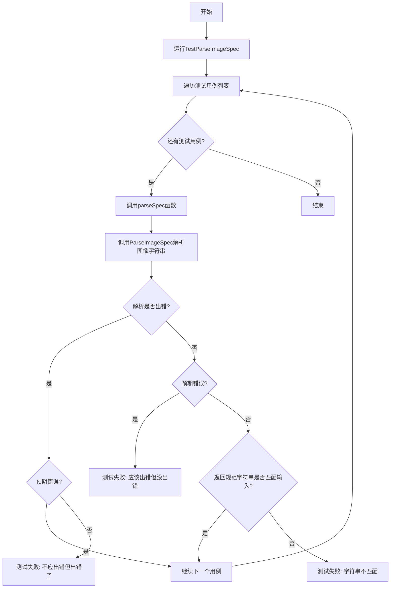
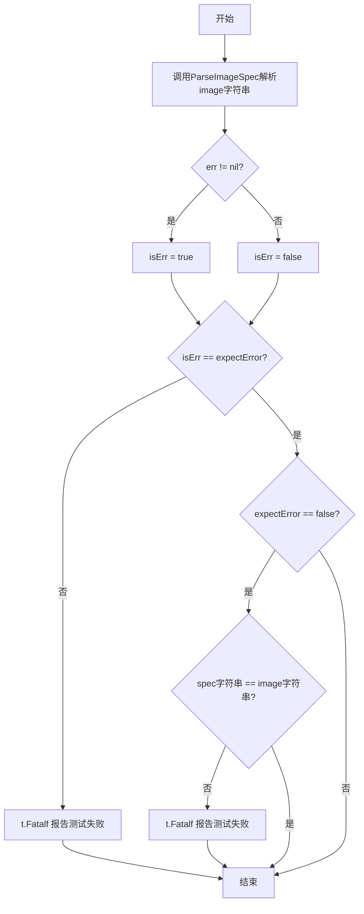
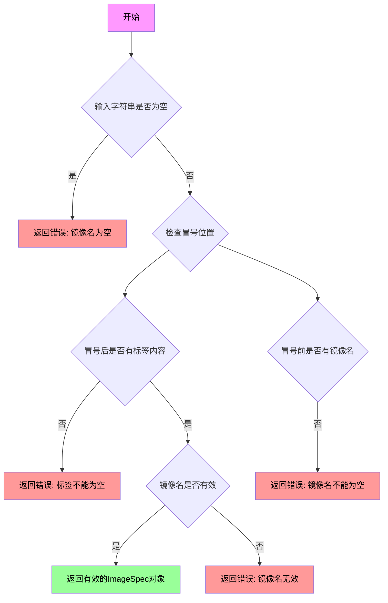

# `flux\pkg\update\spec_test.go` 详细设计文档

这是一个Go语言的测试文件，用于验证图像规范解析函数ParseImageSpec的正确性。测试通过多个有效和无效的图像字符串输入，确保函数能够正确解析并返回预期的图像规范，同时处理错误情况。

## 整体流程



## 类结构

```
update包 (package update)
├── update_test.go (测试文件)
│   ├── TestParseImageSpec (测试函数)
│   └── parseSpec (辅助测试函数)
└── 假设存在: update.go (被测试的代码，包含ParseImageSpec和ImageSpecLatest)
```

## 全局变量及字段


### `ImageSpecLatest`
    
表示最新的镜像标签常量，用于默认或最新版本的镜像引用

类型：`string (常量)`
    


    

## 全局函数及方法


### `TestParseImageSpec`

这是 `update` 包中的测试函数，用于验证 `ParseImageSpec` 函数对不同格式镜像规格字符串的解析能力，包括有效和无效的各种输入场景。

参数：

- `t`：`testing.T`，Go语言标准库的测试框架参数，用于报告测试失败

返回值：无（`void`），该函数为测试函数，不返回值

#### 流程图

```mermaid
flowchart TD
    A[开始 TestParseImageSpec] --> B[调用 parseSpec with 'valid/image:tag', false]
    B --> C[调用 parseSpec with 'image:tag', false]
    C --> D[调用 parseSpec with ':tag', true]
    D --> E[调用 parseSpec with 'image:', true]
    E --> F[调用 parseSpec with 'image', true]
    F --> G[调用 parseSpec with ImageSpecLatest, false]
    G --> H[调用 parseSpec with '<invalid spec>', true]
    H --> I[结束]
    
    subgraph parseSpec 逻辑
    J[调用 ParseImageSpec] --> K{err != nil?}
    K -->|是| L{expectError == true?}
    K -->|否| M{expectError == true?}
    L -->|是| N[测试通过]
    L -->|否| O[t.Fatalf 报告错误]
    M -->|否| P{string(spec) == image?}
    M -->|是| O
    P -->|是| N
    P -->|否| O
    end
```

#### 带注释源码

```go
package update

import "testing"

// TestParseImageSpec 测试函数，验证 ParseImageSpec 的解析能力
// 测试多种有效的镜像规格字符串和无效的输入
func TestParseImageSpec(t *testing.T) {
	// 测试有效的镜像规格：包含registry和tag
	parseSpec(t, "valid/image:tag", false)
	
	// 测试有效的镜像规格：仅有image名和tag
	parseSpec(t, "image:tag", false)
	
	// 测试无效输入：仅有tag，缺少image名
	parseSpec(t, ":tag", true)
	
	// 测试无效输入：仅有image名，无tag
	parseSpec(t, "image:", true)
	
	// 测试无效输入：仅有image名，缺少tag
	parseSpec(t, "image", true)
	
	// 测试有效的特殊常量：ImageSpecLatest 表示 latest 标签
	parseSpec(t, string(ImageSpecLatest), false)
	
	// 测试无效输入：完全无效的规格字符串
	parseSpec(t, "<invalid spec>", true)
}

// parseSpec 辅助测试函数，用于验证 ParseImageSpec 的行为
// 参数：
//   - t: 测试框架的测试对象
//   - image: 要解析的镜像规格字符串
//   - expectError: 是否期望解析失败
func parseSpec(t *testing.T, image string, expectError bool) {
	// 调用 ParseImageSpec 解析镜像规格字符串
	spec, err := ParseImageSpec(image)
	
	// 判断是否产生了错误
	isErr := (err != nil)
	
	// 验证错误状态是否符合预期
	if isErr != expectError {
		t.Fatalf("Expected error = %v for %q. Error = %q\n", expectError, image, err)
	}
	
	// 如果不期望错误，则验证返回的规格字符串与输入一致
	if !expectError && (string(spec) != image) {
		t.Fatalf("Expected string spec %q but got %q", image, string(spec))
	}
}
```


### `parseSpec`

这是一个测试辅助函数，用于验证 `ParseImageSpec` 函数对不同镜像规范字符串的解析行为是否符合预期，包括正确解析有效镜像和正确返回无效镜像的错误。

参数：

- `t`：`testing.T`，Go 测试框架的测试对象，用于报告测试失败
- `image`：`string`，要解析的镜像规范字符串
- `expectError`：`bool`，表示是否期望解析过程返回错误

返回值：无返回值（`void`）

#### 流程图



#### 带注释源码

```go
// parseSpec 是一个测试辅助函数，用于验证 ParseImageSpec 函数的行为
// 参数：
//   - t: 测试框架的测试对象，用于报告测试失败
//   - image: 要解析的镜像规范字符串
//   - expectError: 期望解析是否返回错误
func parseSpec(t *testing.T, image string, expectError bool) {
    // 调用 ParseImageSpec 解析镜像规范字符串
    spec, err := ParseImageSpec(image)
    
    // 判断解析是否返回了错误
    isErr := (err != nil)
    
    // 验证实际结果是否与期望一致
    if isErr != expectError {
        // 如果不一致，报告测试失败并退出
        t.Fatalf("Expected error = %v for %q. Error = %q\n", expectError, image, err)
    }
    
    // 如果期望解析成功（不报错），验证返回的规范字符串与输入一致
    if !expectError && (string(spec) != image) {
        // 如果不一致，报告测试失败并退出
        t.Fatalf("Expected string spec %q but got %q", image, string(spec))
    }
}
```


### `ParseImageSpec`

该函数用于解析和验证Docker镜像规范字符串，验证其格式是否符合标准的镜像命名规范（格式应为`镜像名:标签`），并返回解析后的镜像规范对象或相应的错误信息。

参数：

- `image`：`string`，需要解析的镜像规范字符串，例如 "image:tag" 或 "valid/image:tag"

返回值：

- `spec`：`ImageSpec`，解析成功时返回的镜像规范对象，可转换为字符串
- `err`：`error`，解析失败时返回错误信息，成功时返回nil

#### 流程图



#### 带注释源码

```go
// 测试函数：验证 ParseImageSpec 的各种输入场景
func TestParseImageSpec(t *testing.T) {
    // 测试有效的镜像规范 - 带命名空间和标签
    parseSpec(t, "valid/image:tag", false)
    
    // 测试有效的镜像规范 - 无命名空间，仅镜像名和标签
    parseSpec(t, "image:tag", false)
    
    // 测试无效输入 - 只有冒号和标签，缺少镜像名
    parseSpec(t, ":tag", true)
    
    // 测试无效输入 - 镜像名后没有标签
    parseSpec(t, "image:", true)
    
    // 测试无效输入 - 仅有镜像名，没有标签
    parseSpec(t, "image", true)
    
    // 测试有效的特殊值 - ImageSpecLatest 常量
    parseSpec(t, string(ImageSpecLatest), false)
    
    // 测试无效输入 - 完全无效的规范字符串
    parseSpec(t, "<invalid spec>", true)
}

// 辅助测试函数：执行具体的解析和验证逻辑
// 参数：
//   - t: testing.T 测试框架提供的测试对象
//   - image: string 待解析的镜像规范字符串
//   - expectError: bool 是否期望解析失败
func parseSpec(t *testing.T, image string, expectError bool) {
    // 调用 ParseImageSpec 函数进行解析
    spec, err := ParseImageSpec(image)
    
    // 判断是否产生错误
    isErr := (err != nil)
    
    // 验证错误预期与实际是否一致
    if isErr != expectError {
        t.Fatalf("Expected error = %v for %q. Error = %q\n", expectError, image, err)
    }
    
    // 当不期望错误时，验证返回的字符串规范与输入一致
    if !expectError && (string(spec) != image) {
        t.Fatalf("Expected string spec %q but got %q", image, string(spec))
    }
}
```


## 关键组件


### ParseImageSpec 函数

解析镜像规格字符串，验证镜像标签格式是否合法，返回解析后的ImageSpec或错误信息。

### TestParseImageSpec 函数

测试函数，验证不同镜像字符串格式的解析结果是否正确，包括有效格式（带标签、无标签、latest常量）和无效格式。

### parseSpec 辅助函数

测试辅助函数，用于验证ParseImageSpec对给定镜像字符串的解析行为是否符合预期，包括错误返回和结果匹配。

### ImageSpecLatest 常量

全局常量，表示"latest"标签的镜像规格默认值。

### 错误处理与验证逻辑

代码验证镜像字符串格式：有效的格式为"image:tag"或"image"，无效情况包括空镜像名或空标签。


## 问题及建议


### 已知问题

-   **测试覆盖不足**：仅覆盖了有限的几个测试用例，缺少边界情况测试，如空字符串、nil输入、超长字符串、特殊字符、Unicode字符等。
-   **测试数据硬编码**：所有测试数据直接写在TestParseImageSpec函数中，增加新测试用例时需要修改测试函数本身，不利于维护和扩展。
-   **缺乏测试并行性**：未使用`t.Parallel()`，在大型测试套件中会影响测试执行效率。
-   **错误断言方式基础**：使用手动比较`isErr != expectError`，而非使用 testify 等更强大的断言库，导致错误信息可读性较差。
-   **缺少性能基准测试**：没有 Benchmark 测试，无法评估 ParseImageSpec 函数的性能表现。
-   **测试函数无注释**：parseSpec 辅助函数和 TestParseImageSpec 缺乏必要的文档注释，降低了代码可读性和可维护性。
-   **未验证错误类型**：当 expectError 为 true 时，没有验证返回的错误类型或错误消息内容是否正确。

### 优化建议

-   增加边界值测试用例，包括空字符串、nil、极长字符串、特殊字符（如中文、emoji）、带端口的镜像名等。
-   将测试数据提取为测试表（table-driven tests），使用结构体数组存储测试用例，便于扩展和维护。
-   考虑引入 testify/require 断言库，提供更清晰的错误信息和更流畅的断言语法。
-   添加 Benchmark 测试来评估函数性能，关注大规模调用场景下的表现。
-   为测试函数添加文档注释，说明测试目的和覆盖范围。
-   当 expectError 为 true 时，增加对错误类型的具体验证，确保返回的错误符合预期。
-   对于 CPU 密集型的测试用例，考虑使用`t.Parallel()`提升测试并行度。


## 其它


### 设计目标与约束

本代码的测试目标是验证 `ParseImageSpec` 函数对不同镜像规范（image spec）字符串的解析能力，包括有效和无效的输入格式。测试约束：仅测试字符串解析逻辑，不涉及实际的镜像拉取或存储操作。

### 错误处理与异常设计

测试用例覆盖了以下错误场景：
- 缺少镜像名称（`:tag`）
- 缺少标签（`image:`）
- 仅有镜像名称无标签（`image`）
- 无效规范字符串（`<invalid spec>`）
- `ImageSpecLatest` 常量作为有效输入

错误通过 `err != nil` 判断，使用 `t.Fatalf` 报告不符合预期的错误状态。

### 数据流与状态机

测试数据流：
1. 输入字符串 → `ParseImageSpec()` → 返回 `spec` 和 `err`
2. 验证 `err` 是否符合预期（是否应该报错）
3. 若不报错，验证返回的 `spec` 字符串与输入是否一致

### 外部依赖与接口契约

- 依赖 `testing` 包提供测试框架
- 依赖被测函数 `ParseImageSpec(image string) (ImageSpec, error)`（定义在 `update` 包的其他文件中）
- 依赖常量 `ImageSpecLatest`（定义在 `update` 包的其他文件中）

### 接口规范

`ParseImageSpec` 函数应满足以下契约：
- 输入：镜像规范字符串（如 `"image:tag"`、`"repo/image:v1"`）
- 输出：解析成功时返回 `ImageSpec` 类型值和 `nil` 错误；解析失败时返回空 `ImageSpec` 和非空错误
- `ImageSpec` 应实现 `stringer` 接口，支持转换为字符串

### 测试覆盖范围

当前测试覆盖了基本格式验证，但缺少以下边界情况：
- 空字符串输入
- 特殊字符或非法字符的镜像名
- 超长镜像名或标签
- 多级仓库路径（如 `registry.example.com:5000/image:tag`）
- 带 SHA256 hash 的镜像引用

### 性能考量

测试未涉及性能测试。若 `ParseImageSpec` 涉及复杂正则匹配或大量字符串操作，可考虑添加基准测试（benchmark）。

### 安全性考虑

测试数据不包含真实凭证或敏感信息。但若 `ParseImageSpec` 未来支持从 URL 解析镜像，需注意防止 SSRF 攻击和凭证泄露。

    