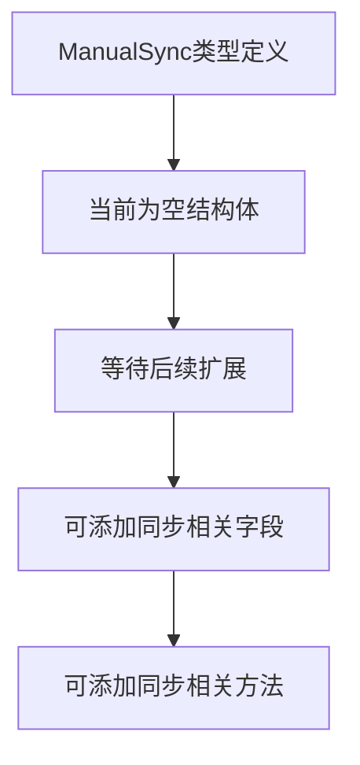

# `flux\pkg\update\sync.go` 详细设计文档

定义了一个空的ManualSync结构体，用于手动同步操作的占位符或基础类型，目前未包含任何字段和方法实现。

## 整体流程



## 类结构

```
ManualSync (空结构体)
└── 潜在方法 (未实现)
    ├── Sync()
    ├── Rollback()
    └── GetStatus()
```

## 全局变量及字段


    

## 全局函数及方法


## 关键组件


### ManualSync 结构体

ManualSync 是一个位于 update 包中的空结构体，当前未定义任何字段和方法。作为一个占位符结构体，它可能用于后续实现手动同步机制的接口定义或类型约束。


## 问题及建议


### 已知问题

-   **空结构体无实际功能**：ManualSync结构体为空，未定义任何字段和方法，无法实现任何同步逻辑，功能完全缺失
-   **缺乏文档注释**：包和类型均无任何文档注释，不符合Go语言规范，降低代码可读性和可维护性
-   **命名语义模糊**：ManualSync命名未明确其用途（如手动同步什么？与谁同步？），增加后续理解和维护难度
-   **未定义接口契约**：未实现任何接口或定义明确的职责边界，无法与外部模块建立清晰的协作关系
-   **设计意图不明**：无法判断是占位符、未完成代码还是有意设计的空类型，长期可能导致代码腐化

### 优化建议

-   **明确功能定位**：根据业务需求为ManualSync添加必要的字段（如配置、同步目标列表、时间戳等）和方法（如Sync()、Rollback()等）
-   **添加文档注释**：遵循Go文档规范，为包和类型添加描述性注释，说明职责和使用场景
-   **定义接口或方法集**：考虑实现sync.Locker或其他相关接口，明确类型的行为契约
-   **错误处理设计**：定义错误类型或使用标准错误，提升错误可追溯性
-   **补充单元测试**：空结构体无法进行有效测试，应补充相应功能及测试用例


## 其它


### 设计目标与约束

该代码目前定义了一个空的ManualSync结构体，用于表示手动同步功能。设计目标可能是提供一个可扩展的同步机制接口，允许后续添加具体的同步逻辑。约束条件包括：Go语言编程规范、结构体需支持后续方法扩展、应与update包的其他组件保持一致的命名风格。

### 错误处理与异常设计

由于当前结构体为空，暂无具体的错误处理逻辑。未来实现时需考虑：定义同步失败时返回的错误类型（如SyncFailedError）、错误码体系设计、是否支持重试机制、错误信息的国际化支持、是否需要详细的错误日志记录、异常情况下的资源释放（如连接断开、文件句柄关闭等）。

### 数据流与状态机

当前无实际数据流。未来设计应包含：ManualSync的典型生命周期（初始化→执行→完成/失败）、状态定义（如Idle、Syncing、Success、Failed）、状态转换条件、是否支持并发同步、状态持久化需求、与上游数据源和下游目标的数据交互方式。

### 外部依赖与接口契约

当前无外部依赖。未来需要明确：与数据库或存储系统的交互接口、是否依赖第三方同步服务、配置的获取方式（环境变量/配置文件）、是否需要网络调用、与包内其他模块的依赖关系、对外暴露的API接口设计、版本兼容性考虑。

### 性能考量

需要评估：同步操作的超时设置、是否支持批量操作、内存使用限制、并发同步时的线程安全设计、是否需要连接池、缓存策略、对系统资源的占用限制。

### 安全设计

需要考虑：敏感数据的处理方式、是否涉及身份验证和授权、传输加密需求、日志中是否包含敏感信息、输入验证机制、SQL注入和命令注入的防护。

### 可观测性

需要设计：关键操作的日志记录级别、是否暴露Prometheus metrics、是否有tracing需求、日志格式规范、调试模式的开关、运行时的监控指标（如同步成功率、耗时等）。

### 配置管理

需要明确：配置的结构和格式、配置的加载顺序（默认配置→环境变量→配置文件）、配置的热更新能力、配置变更的生效策略、配置validation。

### 测试策略

需要规划：单元测试的覆盖要求、是否需要mock测试、集成测试场景、性能测试用例、混沌工程测试、测试数据的管理。

### 部署与运维

需要考虑：容器化支持、健康检查接口、优雅关闭机制、运行时的配置调整能力、日志轮转策略、备份和恢复策略。

### 兼容性策略

需要定义：API的版本管理、与旧版本的迁移路径、废弃功能的处理方式、升级时的数据迁移需求。

    