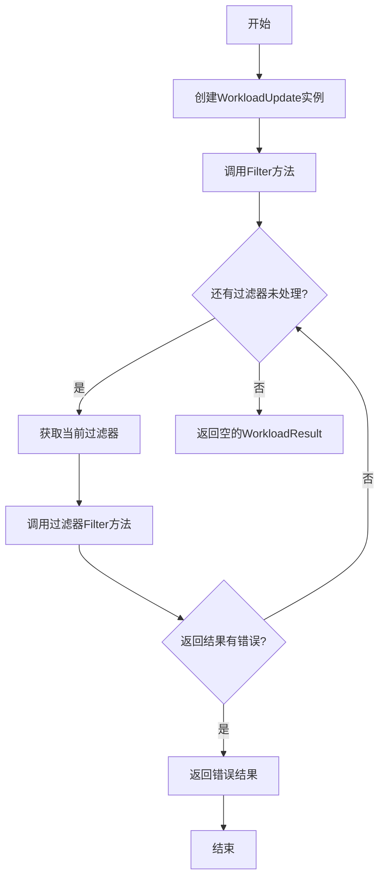
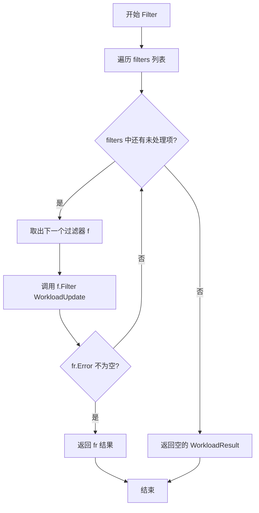
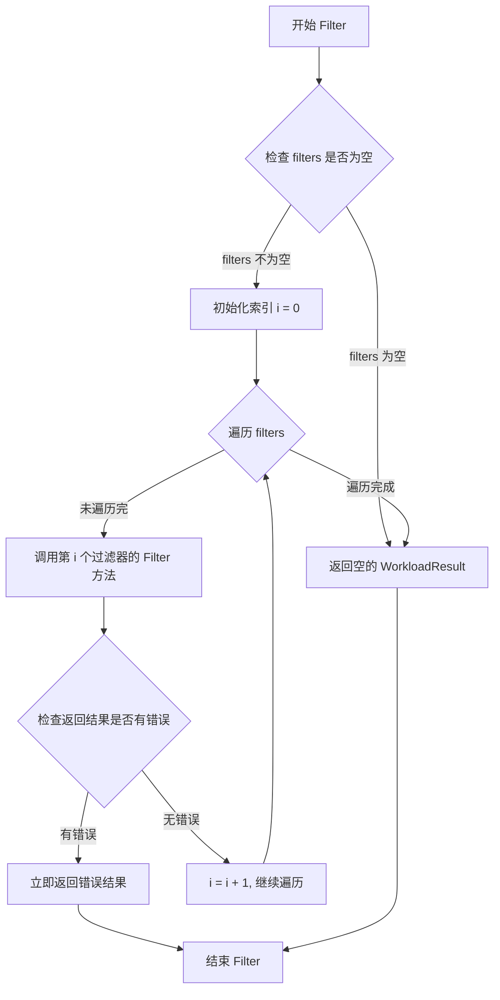
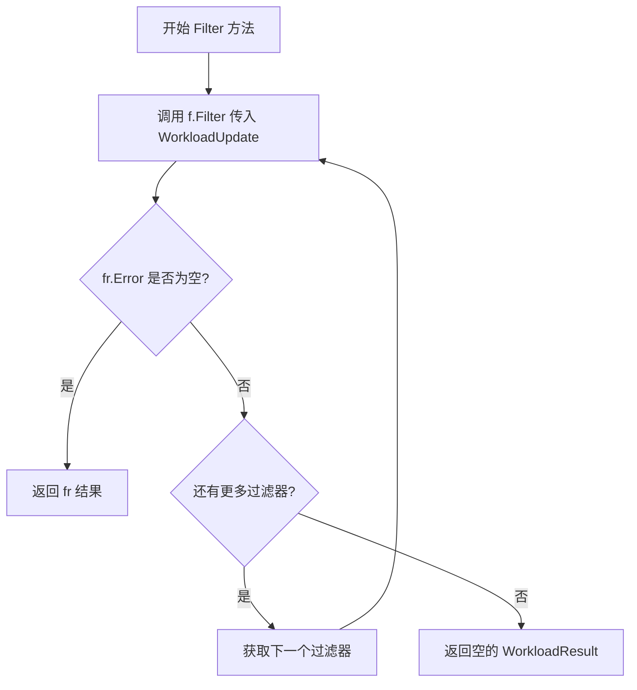
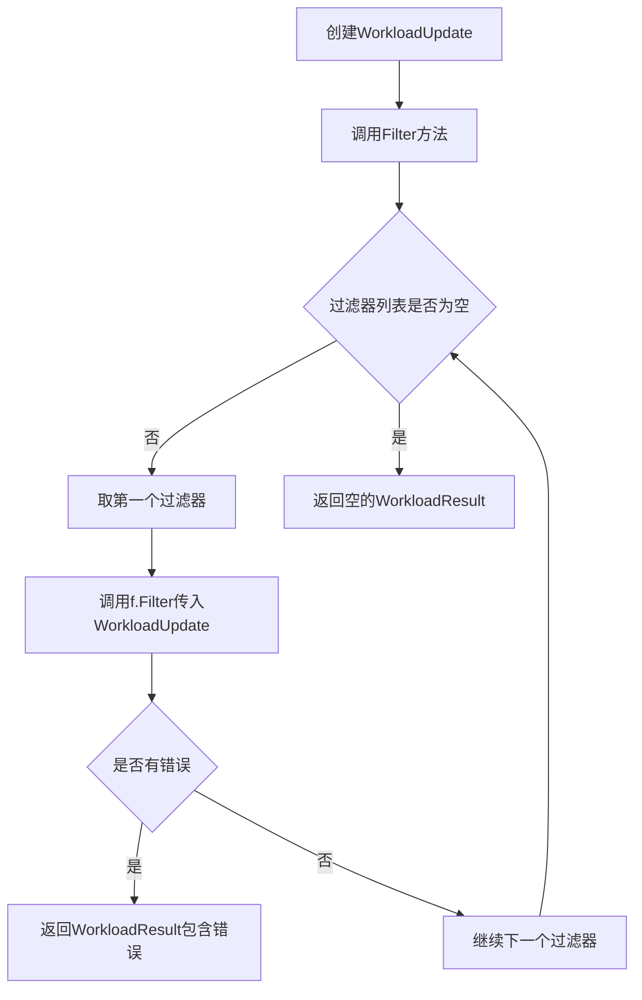

# `flux\pkg\update\workload.go` 详细设计文档

该代码定义了一个用于处理工作负载更新的模块，包含WorkloadUpdate结构体和WorkloadFilter接口，用于对Kubernetes工作负载进行过滤和更新操作，支持链式调用多个过滤器并返回第一个错误结果。

## 整体流程



## 类结构

```
WorkloadUpdate (结构体)
└── WorkloadFilter (接口)
    └── Filter方法实现
```

## 全局变量及字段


### `WorkloadUpdate.ResourceID`
    
资源唯一标识

类型：`resource.ID`
    


### `WorkloadUpdate.Workload`
    
Kubernetes工作负载对象

类型：`cluster.Workload`
    


### `WorkloadUpdate.Resource`
    
资源描述对象

类型：`resource.Workload`
    


### `WorkloadUpdate.Updates`
    
容器更新列表

类型：`[]ContainerUpdate`
    
    

## 全局函数及方法


### `WorkloadUpdate.Filter`

该方法对传入的过滤器列表进行遍历调用，如果任何一个过滤器返回错误则立即返回该错误结果，否则返回空的 WorkloadResult，表示所有过滤器检查通过。

参数：

- `filters`：`...WorkloadFilter`，可变数量的过滤器接口，用于对 WorkloadUpdate 进行过滤检查

返回值：`WorkloadResult`，返回第一个返回错误的过滤器的结果，或者所有过滤器通过时返回空的 WorkloadResult

#### 流程图



#### 带注释源码

```go
// Filter 对传入的过滤器列表进行遍历调用
// 参数 filters: 可变数量的 WorkloadFilter 接口实例
// 返回值: 第一个返回错误的过滤器的结果,或所有过滤器通过时返回空的 WorkloadResult
func (s *WorkloadUpdate) Filter(filters ...WorkloadFilter) WorkloadResult {
    // 遍历每一个过滤器
    for _, f := range filters {
        // 调用当前过滤器的 Filter 方法对 WorkloadUpdate 进行过滤检查
        fr := f.Filter(*s)
        
        // 检查过滤器返回的结果是否包含错误
        if fr.Error != "" {
            // 如果有错误,立即返回该错误结果,不再继续检查后续过滤器
            return fr
        }
    }
    
    // 所有过滤器都通过检查,返回空的 WorkloadResult
    return WorkloadResult{}
}
```


### `WorkloadUpdate.Filter`

对工作负载应用一系列过滤器，遍历每个过滤器并执行过滤操作，如果任何过滤器返回错误则立即返回错误结果，否则返回空的成功结果。

参数：

- `filters`：`...WorkloadFilter`，可变数量的过滤器参数，每个过滤器都会对工作负载进行检验

返回值：`WorkloadResult`，过滤操作的结果，包含可能出现的错误信息或成功状态

#### 流程图



#### 带注释源码

```go
// Filter 对工作负载应用一系列过滤器
// 接收可变数量的 WorkloadFilter 参数，依次执行每个过滤器的 Filter 方法
// 如果任何一个过滤器返回错误，则立即返回该错误；否则返回空的 WorkloadResult 表示成功
func (s *WorkloadUpdate) Filter(filters ...WorkloadFilter) WorkloadResult {
	// 遍历所有传入的过滤器
	for _, f := range filters {
		// 调用当前过滤器的 Filter 方法，传入工作负载更新的副本
		fr := f.Filter(*s)
		
		// 检查过滤结果是否包含错误
		if fr.Error != "" {
			// 如果有错误，立即返回该错误结果，停止后续过滤器的执行
			return fr
		}
	}
	
	// 所有过滤器都执行成功，返回空的 WorkloadResult
	return WorkloadResult{}
}
```


### `WorkloadFilter.Filter`

这是过滤器接口的方法定义，用于对工作负载更新进行过滤处理。`WorkloadFilter` 接口定义了统一的过滤操作规范，具体实现类通过实现 `Filter` 方法来定义特定的过滤逻辑。

参数：

- `param0`：`WorkloadUpdate`，表示需要过滤的工作负载更新对象，包含资源ID、工作负载、资源和容器更新列表

返回值：`WorkloadResult`，表示过滤处理后的结果，包含可能出现的错误信息

#### 流程图



#### 带注释源码

```go
// Filter 是 WorkloadFilter 接口的方法定义
// 用于对 WorkloadUpdate 进行过滤处理，返回 WorkloadResult
// WorkloadFilter 接口定义了 Filter 方法，任何实现该接口的类型都可以用于过滤工作负载更新
type WorkloadFilter interface {
    Filter(WorkloadUpdate) WorkloadResult
}

// Filter 是 WorkloadUpdate 类型的成员方法
// 功能：遍历执行所有过滤器，逐一过滤工作负载更新
// 参数：filters，可变数量的 WorkFilter 过滤器接口实例
// 返回值：WorkloadResult，过滤处理结果，如果所有过滤器都通过返回空的 WorkloadResult
func (s *WorkloadUpdate) Filter(filters ...WorkloadFilter) WorkloadResult {
    // 遍历所有过滤器
    for _, f := range filters {
        // 调用当前过滤器的 Filter 方法进行过滤
        fr := f.Filter(*s)
        
        // 如果过滤结果中存在错误信息，则立即返回该错误结果
        // 实现了短路逻辑：一旦某个过滤器判定不通过，后续过滤器不再执行
        if fr.Error != "" {
            return fr
        }
    }
    
    // 所有过滤器都通过，返回空的 WorkloadResult 表示放行
    return WorkloadResult{}
}
```

## 关键组件


### 一段话描述

该代码定义了一个用于处理工作负载更新的Go包，包含工作负载更新数据结构WorkloadUpdate以及用于过滤和筛选更新的接口WorkloadFilter，核心功能是通过链式过滤器对工作负载更新进行多条件筛选并返回结果。

### 文件的整体运行流程

该文件定义了工作负载更新的数据结构和过滤器接口。首先创建WorkloadUpdate结构体实例并填充相关字段（资源ID、工作负载、资源和容器更新列表），然后通过调用Filter方法并传入多个WorkloadFilter实现来执行过滤逻辑。Filter方法会依次执行每个过滤器，一旦某个过滤器返回错误就立即返回，否则返回空结果的WorkloadResult。

### 类的详细信息

#### 结构体：WorkloadUpdate

**字段：**

| 字段名 | 类型 | 描述 |
|--------|------|------|
| ResourceID | resource.ID | 要更新的资源标识符 |
| Workload | cluster.Workload | 集群中的工作负载对象 |
| Resource | resource.Workload | 资源定义的工作负载 |
| Updates | []ContainerUpdate | 容器更新列表 |

**方法：**

| 方法名 | 参数名称 | 参数类型 | 参数描述 | 返回值类型 | 返回值描述 |
|--------|----------|----------|----------|------------|------------|
| Filter | filters | ...WorkloadFilter | 可变数量的过滤器参数 | WorkloadResult | 过滤结果，包含可能的错误信息 |

**mermaid流程图：**



**带注释源码：**

```go
// Filter 对工作负载更新应用一系列过滤器
// 参数: filters 可变数量的WorkloadFilter接口实现
// 返回: WorkloadResult 过滤结果，如果所有过滤器都通过则返回空结果
func (s *WorkloadUpdate) Filter(filters ...WorkloadFilter) WorkloadResult {
	// 遍历所有过滤器
	for _, f := range filters {
		// 对当前工作负载更新应用过滤器
		fr := f.Filter(*s)
		// 如果过滤器返回了错误，立即返回错误结果
		if fr.Error != "" {
			return fr
		}
	}
	// 所有过滤器都通过，返回空结果
	return WorkloadResult{}
}
```

#### 接口：WorkloadUpdateFilter

**方法：**

| 方法名 | 参数名称 | 参数类型 | 参数描述 | 返回值类型 | 返回值描述 |
|--------|----------|----------|----------|------------|------------|
| Filter | WorkloadUpdate | WorkloadUpdate | 要过滤的工作负载更新 | WorkloadResult | 过滤结果 |

### 关键组件信息

#### WorkloadUpdate结构体

核心数据结构，包含工作负载更新的所有信息，用于在过滤器链中传递和处理。

#### WorkloadUpdateFilter接口

定义了过滤器契约，任何实现该接口的类型都可以用于过滤工作负载更新，支持策略模式。

#### Filter方法

实现了链式过滤逻辑，依次应用多个过滤器，一旦发生错误立即返回，提供了声明式的过滤机制。

### 潜在的技术债务或优化空间

1. **缺少WorkloadResult定义** - 代码中使用了WorkloadResult但未在该文件中定义其结构，可能存在隐藏的依赖
2. **错误处理不够丰富** - Filter方法仅返回字符串类型的错误信息，缺乏错误码和错误分类
3. **缺乏并发支持** - 过滤器顺序执行，无法利用多核优势
4. **接口定义过于简单** - WorkloadFilter接口仅返回WorkloadResult，缺乏上下文传递能力

### 其它项目

#### 设计目标与约束

- 设计目标：提供灵活的工作负载更新过滤机制，支持多条件链式筛选
- 约束：过滤器按顺序执行，一旦出错立即终止

#### 错误处理与异常设计

- 错误通过WorkloadResult的Error字段传递，采用字符串形式
- 错误发生后立即短路返回，支持快速失败模式

#### 数据流与状态机

数据流为单向流动：WorkloadUpdate → Filter方法 → 各个WorkloadFilter → WorkloadResult，不存在状态回退或循环依赖。

#### 外部依赖与接口契约

- 依赖 `github.com/fluxcd/flux/pkg/cluster` 包中的Workload类型
- 依赖 `github.com/fluxcd/flux/pkg/resource` 包中的ID和Workload类型
- 依赖同包中未定义的WorkloadResult和ContainerUpdate类型


## 问题及建议


### 已知问题

- **错误处理机制不够健壮**：使用字符串类型的 `Error` 字段而非标准的 `error` 接口，无法传递堆栈信息，且缺乏错误溯源能力
- **Filter 方法返回值语义不明确**：成功情况下返回空 `WorkloadResult{}`，调用方无法区分"无结果"和"执行成功"两种状态
- **可变参数设计风险**：接受 `filters ...WorkloadFilter`，当传入 `nil` 或空切片时行为不够明确，且无法预知过滤器的执行顺序
- **命名混淆**：方法参数名 `filters` 与接口类型 `WorkloadFilter` 名称高度相似，易造成理解和维护时的混淆
- **类型依赖不完整**：`WorkloadUpdate` 结构体中 `Workload` 字段类型为 `cluster.Workload`，但代码中未展示该类型的定义，无法验证类型兼容性

### 优化建议

- **改进错误处理**：将 `Error` 字段改为标准的 `error` 类型，或定义专用的错误类型结构体以携带更多上下文信息
- **明确返回值语义**：考虑返回包含 `Success` 布尔字段的 `WorkloadResult`，或在成功时返回包含有效数据的结构体，而非空结果
- **增强接口设计**：可考虑使用函数式选项模式或建造者模式替代可变参数，提高 API 的清晰度和可测试性
- **优化命名**：将参数名改为更具体的名称，如 `filterChain` 或 `workloadFilters`，以区分接口类型
- **添加文档注释**：为接口和方法添加完整的文档说明，包括预期行为、错误条件和使用示例
- **考虑依赖注入**：将外部依赖（如集群客户端）通过接口注入，提高代码的可测试性和模块化程度


## 其它


### 设计目标与约束

**设计目标**：
该代码旨在提供一个灵活的工作负载更新过滤框架，通过抽象的过滤器接口实现对工作负载更新的链式处理和验证，支持在更新应用前进行多阶段的条件检查和过滤。

**约束条件**：
- 依赖 Go 语言的接口和多参数可变函数特性
- 依赖外部包 `github.com/fluxcd/flux/pkg/cluster` 和 `github.com/fluxcd/flux/pkg/resource`
- 过滤器链式调用会在首次遇到错误时立即返回，不执行后续过滤器

### 错误处理与异常设计

**错误传播机制**：
- 通过 `WorkloadResult` 结构体中的 `Error` 字段传递错误信息
- 错误采用短路策略：第一个过滤器返回非空错误即终止整个过滤链
- 错误类型为字符串形式，未使用 Go 的 error 接口

**异常场景**：
- 空过滤器切片：返回空的 `WorkloadResult{}`
- nil 过滤器：代码中未做 nil 检查，可能引发 panic
- 过滤器 panic：未实现 recover 机制

### 数据流与状态机

**数据流转方向**：
1. 外部调用方构造 `WorkloadUpdate` 对象（包含 ResourceID、Workload、Resource、Updates）
2. 调用 `Filter` 方法并传入一个或多个 `WorkloadFilter` 实现
3. 依次执行每个过滤器的 `Filter` 方法
4. 收集第一个非空的 Error 结果并返回，或返回空结果

**状态变化**：
- 初始状态：`WorkloadUpdate` 对象创建
- 处理状态：依次经过各过滤器处理
- 终止状态：返回 `WorkloadResult`（包含 Error 或空）

### 外部依赖与接口契约

**依赖的外部包**：
- `github.com/fluxcd/flux/pkg/cluster`：提供 `Workload` 类型定义
- `github.com/fluxcd/flux/pkg/resource`：提供 `ID` 和 `Workload` 类型定义

**接口契约**：
- `WorkloadFilter` 接口：必须实现 `Filter(WorkloadUpdate) WorkloadResult` 方法
- `Filter` 方法：接收 `WorkloadUpdate` 值的副本，返回 `WorkloadResult`

**使用方职责**：
- 调用方需确保传入的 `WorkloadFilter` 实现已正确初始化
- 调用方需定义 `WorkloadResult` 结构体（代码中未显示但被引用）

### 并发安全性

- 当前实现为串行执行，无并发保护需求
- 但如果 `WorkloadFilter` 实现涉及共享状态，需调用方自行保证线程安全

### 性能考量

- 过滤器链式调用时间复杂度为 O(n)，n 为过滤器数量
- 每次迭代都会复制 `WorkloadUpdate` 结构体（值传递）
- 建议：对于大型结构体，考虑使用指针传递以减少复制开销

### 扩展性设计

- 通过添加新的 `WorkloadFilter` 实现可扩展功能
- 支持责任链模式（Chain of Responsibility）的变体
- 可在 Filter 方法中添加日志、指标收集等横切关注点

### 配置与初始化

- 该包为纯逻辑包，无配置文件依赖
- 无需显式初始化，可直接使用

### 测试策略建议

- 单元测试：针对 `Filter` 方法测试空过滤器、单个过滤器、多个过滤器、错误短路等场景
- 接口测试：验证 `WorkloadFilter` 实现类的行为
- 边界测试：nil 过滤器、nil 切片等边界条件

### 版本与兼容性

- 当前版本：v1（基于代码推断）
- 需注意：如果 `WorkloadResult` 结构体定义发生变化，可能影响现有 `WorkloadFilter` 实现

### 命名规范与代码风格

- 类型命名遵循 Go 语言驼峰命名惯例
- 方法命名语义清晰（Filter 明确表达过滤意图）
- 包名 `update` 简洁明确


    