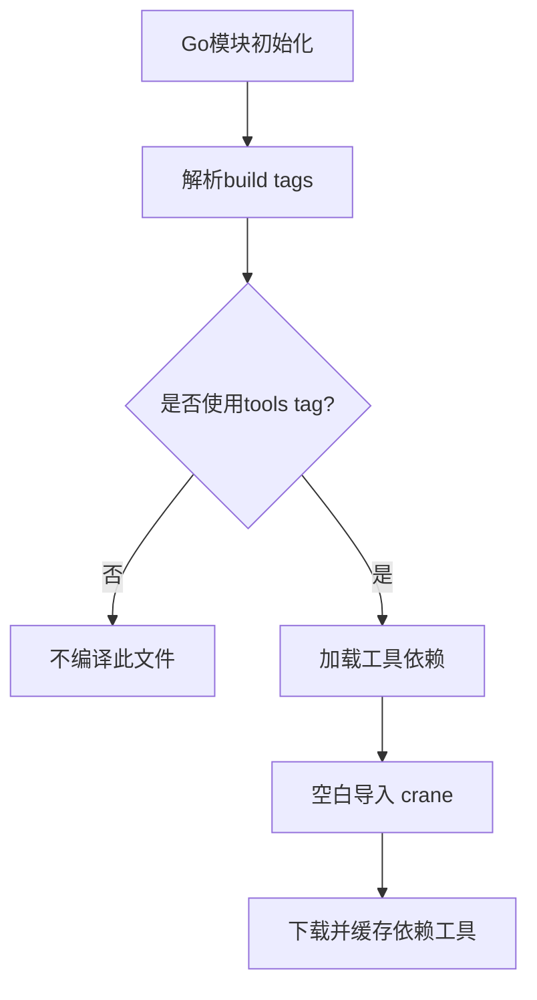

# `flux\tools.go` 详细设计文档

这是一个Go模块的工具依赖声明文件，通过空白导入确保构建项目所需的工具（如crane）被下载，但不影响主代码编译。

## 整体流程



## 类结构

```

```

## 全局变量及字段


    

## 全局函数及方法


## 关键组件


### 概述

这是一个Go模块的工具依赖管理文件，通过空白导入（blank import）机制确保项目构建时自动下载并维护 `crane` 容器镜像工具，不包含任何实际的业务逻辑或功能实现。

### 文件运行流程

此文件不参与正常的程序运行流程，仅在Go模块进行依赖解析和下载时被触发。当执行 `go mod tidy`、`go build` 等命令时，Go工具链会解析该文件的导入语句，从而确保 `github.com/google/go-containerregistry/cmd/crane` 工具被下载到本地缓存中。

### 关键组件信息

### 构建标签 `// +build tools`

标识此文件为工具依赖文件，仅在特定构建场景下被处理，用于将工具依赖与主代码分离。

### 空白导入 `github.com/google/go-containerregistry/cmd/crane`

通过空白导入（`_`）方式引入crane工具包，确保该工具被下载但不调用任何导出函数。此为Go语言管理二进制工具依赖的标准做法。

### 潜在技术债务或优化空间

1. **文档缺失**：缺少关于为何需要crane工具以及其用途的说明注释
2. **单一职责过度**：当前仅管理crane工具，如需其他工具会导致文件膨胀
3. **隐式依赖**：工具的实际使用逻辑分散在其他文件中，缺乏集中管理

### 其它项目

**设计目标与约束**
- 目标：实现Go模块工具依赖的自动化管理
- 约束：遵循Go 1.11+模块机制，使用空白导入触发工具下载

**外部依赖与接口契约**
- 外部依赖：`github.com/google/go-containerregistry/cmd/crane`（容器镜像管理CLI工具）
- 无接口契约，仅作为依赖声明存在

**错误处理与异常设计**
- 空白导入不会引发运行时错误，Go编译器会自动处理

**数据流与状态机**
- 无数据流或状态机设计，该文件为纯声明性配置


## 问题及建议


### 已知问题

- **工具依赖未实际使用**：导入了 `crane` 工具但在代码中没有任何实际调用，可能存在多余的依赖
- **缺少版本控制**：import 语句未指定具体版本号，无法保证构建的可重复性
- **缺乏文档说明**：文件仅有注释说明存在目的，未说明为何需要 `crane` 工具及其在项目中的作用
- **单一工具局限性**：文件设计为单工具依赖模式，若项目需要多个构建工具则需要创建多个类似文件

### 优化建议

- **添加工具用途注释**：在 import 前添加注释说明该工具的具体用途，例如 `// crane is used for...`
- **使用版本锁定**：通过 go.mod 的 require 或 replace 声明具体版本，提高构建可重复性
- **考虑使用 Go 1.17+ 工具管理**：现代 Go 版本支持更好的工具依赖管理方式，可评估是否迁移
- **评估依赖必要性**：确认 crane 是否为必需工具，如非必要可移除以减少依赖复杂度
- **集中管理工具依赖**：如需多个工具，可考虑在单独文件中统一管理或使用 go.work 机制


## 其它


### 设计目标与约束

本文件的核心设计目标是管理 Go 项目的工具依赖，确保 CI/CD 环境和开发者在构建项目时能够自动下载必要的命令行工具。该文件遵循 Go Modules 的工具依赖管理规范，使用空的导入语句来触发工具的下载，而非直接调用工具功能。设计约束包括：仅在构建标签为 `tools` 时编译、不包含任何业务逻辑、不引入运行时依赖。

### 错误处理与异常设计

由于该文件仅用于工具依赖声明，不涉及运行时逻辑，因此不存在传统的错误处理机制。若 crane 工具下载失败，将由 Go 模块系统在构建阶段报告错误。可能的异常情况包括：网络问题导致工具无法下载、crane 包被官方废弃或迁移、Go 版本不兼容等。这些异常不属于该文件的职责范围，而由上层构建系统或 Go 工具链处理。

### 数据流与状态机

该文件不涉及数据流处理或状态机设计。它是一个静态的依赖声明文件，在 Go 模块系统解析依赖时会被读取。当执行 `go mod tidy` 或构建带有 `// +build tools` 标签的目标时，Go 工具链会扫描该文件并下载声明的导入包。

### 外部依赖与接口契约

该文件仅依赖一个外部包：github.com/google/go-containerregistry/cmd/crane。crane 是 Google 开发的容器镜像操作 CLI 工具，该项目引入 crane 的目的可能是用于容器镜像的构建、推送或操作。接口契约方面，该文件不导出任何接口或函数，仅通过 import 语句建立模块级别的依赖关系。

### 构建配置与编译选项

该文件使用 `// +build tools` 构建标签，这是 Go 官方推荐的工具依赖管理模式。带有此标签的文件仅在特定构建场景下编译（如 `go build -tags tools` 或 `go run -tags tools`），不会影响主程序的二进制体积。编译选项保持最小化，不包含任何编译指令或条件分支。

### 版本管理与兼容性

该文件未指定 crane 的具体版本，版本由 go.mod 文件中的间接依赖声明控制。这种设计允许通过 go.mod 锁定工具版本，确保团队成员使用一致的工具版本。兼容性方面，该文件适用于 Go 1.11 及以上版本（Go Modules 引入的版本），需要确保项目根目录存在有效的 go.mod 文件。

### 性能考量与资源消耗

该文件本身不产生运行时性能开销，因为编译产物不会被包含在主程序中。在工具下载阶段，仅产生一次性的网络下载开销。内存和 CPU 消耗由 Go 工具链在解析依赖时产生，可忽略不计。

### 安全考量

由于该文件导入了外部包，需要关注供应链安全风险。建议在 go.mod 中锁定 crane 的具体版本，并定期检查是否有安全更新。此外，应确保从可信的源（官方 Go 仓库）下载依赖，避免依赖链劫持攻击。

### 部署与环境要求

该文件不涉及运行时部署，但需要以下环境：Go 1.11+、有效的网络连接（用于下载依赖）、go.mod 文件存在于项目根目录。在 CI/CD 环境中，通常会在构建步骤前执行 `go mod download` 以确保工具可用。

### 测试策略

该文件不需要单元测试或集成测试，因为它不包含可执行逻辑。验证方式通常是尝试构建带有 tools 标签的目标，确认依赖能够成功下载。如果 crane 版本过旧或不可用，构建过程会失败并提供明确的错误信息。

### 维护建议与扩展性

当前设计具有良好的扩展性，如需添加更多工具，只需在该文件中添加新的空导入即可。长期维护建议包括：定期更新工具版本以获取新功能和安全修复、考虑使用 Go 1.24 引入的 `go:tool` 指令（更现代的工具依赖管理方式）、以及在项目文档中说明工具的用途。

    