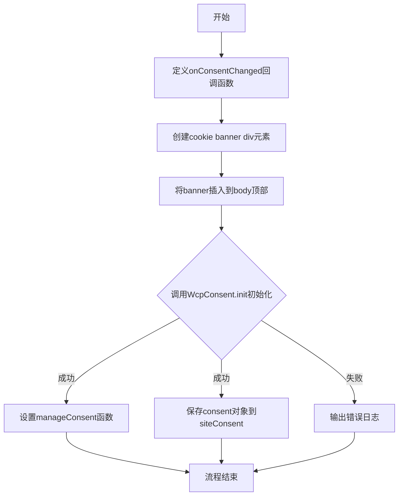
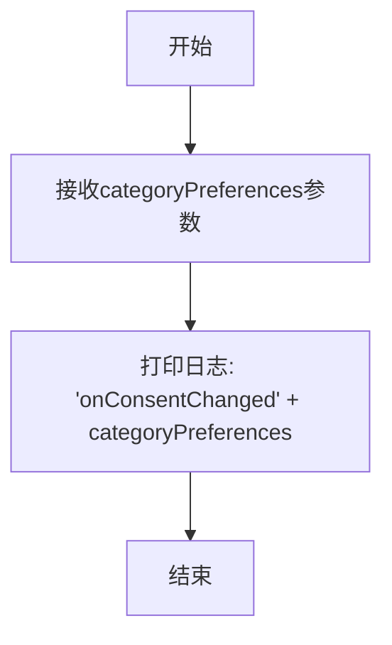
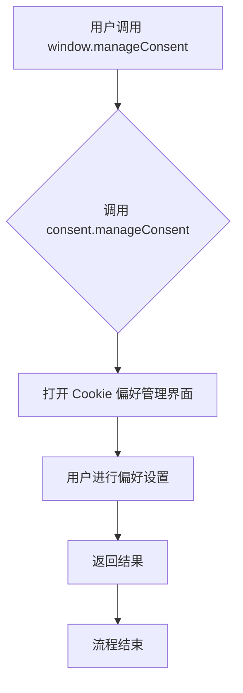

# `graphrag\docs\scripts\create_cookie_banner.js` 详细设计文档

该代码是一个Cookie同意管理模块的初始化脚本，用于在网页中集成Cookie横幅（cookie banner），允许用户管理其Cookie偏好设置，并通过WcpConsent库实现隐私合规。

## 整体流程



## 类结构

```
无类层次结构（函数式编程风格）
├── 全局变量
│   ├── cb (DOM元素)
│   └── siteConsent (consent对象)
├── 全局函数
│   ├── onConsentChanged
│   └── manageConsent
└── 外部依赖
    └── WcpConsent (第三方Cookie管理库)
```

## 全局变量及字段


### `cb`
    
cookie banner的容器div

类型：`HTMLDivElement`
    


### `siteConsent`
    
存储用户同意偏好对象

类型：`Object`
    


    

## 全局函数及方法


### `onConsentChanged`

处理用户同意偏好变更事件的回调函数，当用户的Cookie同意偏好设置发生改变时调用，用于记录或响应新的同意偏好配置。

参数：

- `categoryPreferences`：`Object/Any`，用户同意偏好变更后的类别偏好设置对象，包含用户对各个Cookie类别的同意状态

返回值：`undefined`，该函数没有返回值，仅作为事件回调处理日志输出

#### 流程图



#### 带注释源码

```javascript
/**
 * 处理用户同意偏好变更事件的回调函数
 * 当用户的Cookie同意偏好设置发生改变时，
 * WcpConsent会调用此函数通知应用程序
 * 
 * @param {Object/Any} categoryPreferences - 用户同意偏好变更后的类别偏好设置
 */
function onConsentChanged(categoryPreferences) {
    // 输出同意偏好变更日志，便于调试和追踪用户同意状态变化
    console.log("onConsentChanged", categoryPreferences);        
}
```


### `manageConsent`（动态创建于 `window` 对象）

该函数是在 `WcpConsent.init()` 回调中动态创建的箭头函数，用于调用 `consent.manageConsent()` 方法打开 Cookie 偏好管理界面，允许用户管理隐私同意偏好设置。

参数：

- （无参数）

返回值：`任意类型`，返回 `consent.manageConsent()` 的执行结果，具体类型取决于Consent Manager的实现，通常为 `void` 或 `Promise<void>`

#### 流程图



#### 带注释源码

```javascript
// 在 WcpConsent.init 回调中动态创建 manageConsent 函数
window.WcpConsent && WcpConsent.init("en-US", "cookie-banner", function (err, consent) {
    if (!err) {
        console.log("consent: ", consent);
        
        // 动态创建 manageConsent 箭头函数并挂载到 window 对象
        // 该函数内部调用 consent.manageConsent() 打开偏好管理界面
        window.manageConsent = () => consent.manageConsent();
        
        // 保存 consent 对象引用到全局变量 siteConsent
        siteConsent = consent;          
    } else {
        console.log("Error initializing WcpConsent: "+ err);
    }
}, onConsentChanged, WcpConsent.themes.light);
```

#### 关键说明

| 属性 | 值 |
|------|-----|
| 定义位置 | `WcpConsent.init` 回调函数内部 |
| 挂载对象 | `window.manageConsent` |
| 函数类型 | 箭头函数 (Arrow Function) |
| 依赖对象 | `consent` (由 WcpConsent.init 回调传入的 Consent 实例) |

## 关键组件


### Cookie Banner 组件

负责创建并插入cookie同意横幅到页面顶部，通过document.createElement创建div元素并使用insertBefore方法将其插入到body的第一个子元素位置，确保横幅在页面加载时优先显示。

### WcpConsent 初始化模块

调用window.WcpConsent.init方法初始化cookie同意管理功能，传入语言区域(en-US)、绑定的DOM元素ID(cookie-banner)、回调函数等参数，建立与WcpConsent服务的连接并获取consent对象。

### Consent 回调处理机制

onConsentChanged函数作为用户同意偏好变更的回调监听器，当用户修改cookie偏好设置时被触发，接收categoryPreferences参数并输出日志记录变更内容。

### Consent 对象管理

通过WcpConsent.init的回调获取consent对象，并将其赋值给siteConsent全局变量，同时在window对象上暴露manageConsent方法，允许页面其他部分调用consent.manageConsent()来打开consent管理界面。

### 错误处理机制

在WcpConsent.init的回调中实现错误处理逻辑，当初始化失败时(err存在)输出错误信息到控制台，成功时则初始化consent相关功能。

### 主题定制支持

通过传入WcpConsent.themes.light参数指定cookie banner使用浅色主题，确保横幅的视觉样式与页面整体设计保持一致。


## 问题及建议


### 已知问题

-   **全局变量污染**：`cb` 和 `siteConsent` 变量未使用 `var`、`let` 或 `const` 声明，会意外泄露为全局变量，可能与第三方代码产生冲突
-   **缺少错误处理**：当 `WcpConsent` 不存在时，`window.WcpConsent &&` 只会静默跳过，不会给用户任何反馈
-   **DOM未就绪风险**：代码直接操作 `document.body`，若脚本在 DOM 加载前执行会导致报错
-   **硬编码配置值**："en-US"、"cookie-banner"、主题配置等字符串散落各处，难以维护和国际化
-   **生产环境调试代码**：多处 `console.log` 语句遗留，在生产环境可能泄露敏感信息
-   **缺少类型声明**：无 TypeScript 类型定义或 JSDoc 注释，参数和返回值类型不明确
-   **无清理机制**：未提供移除 cookie banner 或注销事件监听的入口

### 优化建议

-   使用 `const` 声明变量，将 `siteConsent` 挂载到 `window` 对象时使用明确的命名空间（如 `window.__consentManager`）
-   添加 DOM 就绪检查（如 `document.body` 是否存在），或使用 `DOMContentLoaded` 事件包装
-   提取配置为独立常量对象或配置文件，例：`CONSENT_CONFIG = { locale: 'en-US', bannerId: 'cookie-banner', theme: 'light' }`
-   生产构建时移除或替换 `console.log` 为日志框架（如 loglevel）
-   为关键函数添加 JSDoc 注释，说明参数类型和返回值
-   提供 `destroy()` 方法用于清理 DOM 元素和事件监听器
-   考虑使用 async/await 或 Promise 封装初始化逻辑，提升可读性和错误处理能力


## 其它


### 设计目标与约束

该代码的主要设计目标是实现网站Cookie同意横幅的初始化和管理功能，确保网站符合GDPR等隐私法规要求。约束条件包括：需要依赖window.WcpConsent全局对象，必须在DOM加载完成后执行，且需要支持多语言（当前硬编码为en-US）。

### 错误处理与异常设计

代码中包含基本的错误处理机制：当WcpConsent.init()调用失败时，会将错误信息打印到控制台。异常处理策略为静默失败并记录日志，不阻塞页面加载。潜在改进点：可添加用户友好的错误提示UI，以及重试机制。

### 数据流与状态机

数据流从WcpConsent.init()初始化开始，经过回调函数获取consent对象，最终通过manageConsent方法管理用户偏好。状态转换包括：初始化状态 -> 用户交互状态 -> 同意状态/拒绝状态。onConsentChanged作为状态变更监听器。

### 外部依赖与接口契约

主要外部依赖为window.WcpConsent对象，该对象需提供init()方法和themes属性。init()方法签名为init(language, elementId, callback, onConsentChangedCallback, theme)，返回consent对象。manageConsent()方法为consent对象的内部方法，用于打开同意管理界面。

### 浏览器兼容性

代码使用标准的DOM API（document.createElement, document.body.insertBefore），兼容主流现代浏览器。需注意insertBefore的兼容性（IE9+支持），以及ES6语法（const/let）的兼容性考虑。

### 性能考虑

代码在DOM加载时同步创建元素，可能影响首屏渲染。建议使用defer/async或DOMContentLoaded事件延迟执行。对于高频触发的onConsentChanged回调，应考虑防抖处理。

### 可访问性考虑

cookie banner应添加适当的ARIA属性和键盘导航支持。当前实现仅为空的div元素，缺少语义化标签和可访问性属性。

### 国际化/本地化

当前硬编码'en-US'语言参数。改进方向：将语言参数提取为配置项，支持从页面meta标签或data属性读取，或实现动态语言检测。

### 维护性考虑

代码存在全局变量cb和siteConsent，可能造成命名冲突。建议使用IIFE或模块模式封装。cookie banner的样式和位置也应配置化而非硬编码。

    