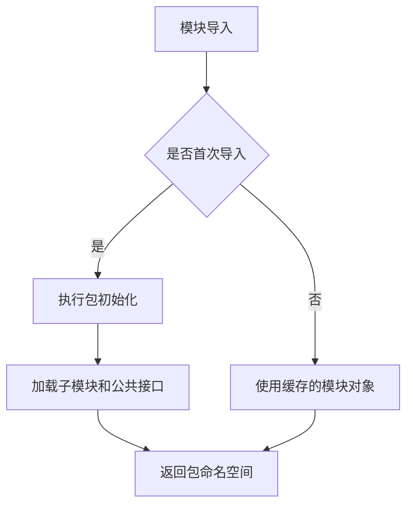

# `graphrag\packages\graphrag\graphrag\__init__.py` 详细设计文档

GraphRAG包的初始化文件，定义了包的公共API接口，目前仅包含版权和许可信息声明，是Microsoft GraphRAG项目的入口模块，用于组织和导出该包的核心功能供外部调用。

## 整体流程



## 类结构

```
GraphRAG Package (根包)
└── __init__.py (包初始化模块)
```

## 全局变量及字段


    

## 全局函数及方法


## 关键组件


### GraphRAG 包定义

这是一个空的 Python 包初始化文件，仅包含版权声明和包名称文档字符串，无实际功能实现。

### 包初始化

该文件作为 GraphRAG 包的入口点，定义了包的元数据信息和许可证声明，为后续模块加载提供基础框架。


## 问题及建议


### 已知问题

-   **包内容为空**：该`__init__.py`文件仅包含版权声明和模块文档字符串，未导出任何模块、类、函数或常量，无法提供实际功能
-   **缺少版本信息**：未定义`__version__`变量，用户和下游依赖无法获取包版本信息
-   **缺少公共API定义**：未定义`__all__`列表，无法明确哪些内容属于公共API接口
-   **缺乏元数据**：缺少包描述、维护者信息、依赖声明等元数据信息
-   **GraphRAG核心功能入口点缺失**：作为GraphRAG包的核心初始化文件，未提供任何图检索增强生成相关功能的入口

### 优化建议

-   **添加版本信息**：定义`__version__ = "0.1.0"`或类似版本号，并可选添加`__author__`、`__license__`等元数据
-   **导出核心模块**：根据GraphRAG功能，导入并导出核心模块（如索引器、查询器、图构建器等），使包具备实际功能
-   **定义公共API**：添加`__all__ = [...]`明确声明公共接口，例如`__all__ = ["IndexBuilder", "QueryEngine", "GraphStore"]`
-   **添加依赖声明**：在文件头部或单独的配置文件中声明包依赖关系
-   **完善文档字符串**：扩展模块文档字符串，包含GraphRAG的简要功能描述、使用方式和关键组件说明
-   **添加类型标注**：考虑添加类型别名或重导出常用类型，提升开发者体验


## 其它


### 设计目标与约束

本包作为GraphRAG项目的顶层包，旨在提供统一的命名空间和入口点。设计目标包括：1）遵循Python包最佳实践，提供清晰的模块组织结构；2）支持后续功能扩展和子模块添加；3）确保与Microsoft开源协议的兼容性。当前代码为最小化实现，主要约束为保持轻量级依赖，未来需根据实际功能需求补充子模块。

### 错误处理与异常设计

由于当前代码未包含任何功能性逻辑，暂无自定义异常类定义。在后续开发中，建议：1）建立统一的异常继承体系，定义GraphRAGBaseException作为根异常；2）针对不同错误场景定义具体异常类型（如DataProcessingError、GraphConstructionError等）；3）异常设计需与调用方约定清晰的错误码和错误消息格式。

### 数据流与状态机

当前包不涉及数据流处理或状态管理。在完整系统中，GraphRAG的数据流预计包括：输入数据接收→图谱构建→知识检索→结果生成等阶段。建议后续补充状态机设计文档，定义各阶段的输入输出契约和状态转换规则。

### 外部依赖与接口契约

当前代码无外部依赖。在项目完整实现时，需明确以下接口契约：1）图数据库接口（如Neo4j、NetworkX等）；2）大语言模型接口（如OpenAI、Azure OpenAI等）；3）数据存储接口（如文件系统、云存储等）；4）配置文件格式和加载机制。

### 安全性考虑

当前代码不涉及敏感操作。后续设计需考虑：1）API密钥和凭证的安全存储机制；2）输入数据的验证和 sanitization；3）权限控制和访问日志；4）依赖库的安全审计流程。

### 性能要求

当前为无操作代码。后续设计应明确：1）图构建的最大超时时间；2）并发处理的最大并行度；3）内存使用的上限；4）批量处理的推荐批次大小等性能指标。

### 配置管理

当前代码无配置定义。建议后续设计包含：1）配置文件格式（YAML/JSON/TOML）；2）环境变量覆盖机制；3）配置验证逻辑；4）默认配置值的设定。

### 版本兼容性

当前版本为0.0.1（推测）。建议明确：1）Python版本兼容范围；2）语义化版本号规则；3）breaking change的发布策略；4）与上下游库的版本对应关系。

### 测试策略

当前代码无可测试内容。建议后续设计包含：1）单元测试框架选择（pytest）；2）集成测试策略；3）Mock对象的使用规范；4）测试覆盖率要求（建议≥80%）。

### 部署考虑

当前为纯Python包。建议后续设计包含：1）打包格式（wheel/sdist）；2）发布平台（PyPI）；3）容器化方案；4）CI/CD流程配置。

### 监控与可观测性

当前无监控需求。建议后续设计包含：1）日志级别和格式规范；2）关键指标定义；3）追踪（tracing）集成方案；4）健康检查端点（如适用）。

### 国际化/本地化

当前代码仅包含英文。建议后续设计包含：1）多语言支持的架构设计；2）字符串外部化策略；3）本地化文件格式（gettext）。

### 许可证与法律合规

当前代码已声明MIT许可证。需确保：1）所有第三方依赖的许可证兼容性；2）版权年份的年度更新；3） NOTICE文件的维护（如需要）。

### 项目目录结构建议

基于当前最小化实现，建议后续按以下结构扩展：
```
graphrag/
├── __init__.py          # 当前文件
├── config/              # 配置模块
├── graph/               # 图谱构建模块
├── retrieve/            # 检索模块
├── llm/                 # LLM接口模块
├── storage/             # 存储模块
├── utils/               # 工具模块
└── tests/               # 测试模块
```


    