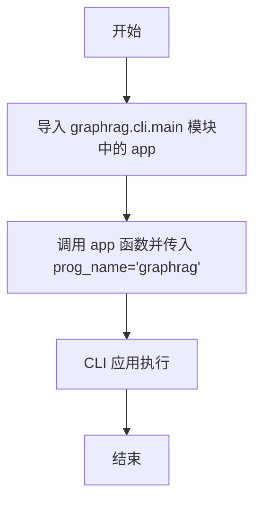

# `graphrag\packages\graphrag\graphrag\__main__.py` 详细设计文档

这是GraphRAG包的入口文件，通过导入graphrag.cli.main模块中的app对象并直接调用执行，启动GraphRAG命令行界面工具。

## 整体流程

```mermaid
graph TD
    A[程序启动] --> B[导入 graphrag.cli.main 模块]
B --> C[实例化 CLI App]
C --> D[调用 app(prog_name='graphrag')]
D --> E[CLI 解析命令行参数]
E --> F{根据子命令执行相应操作}
F --> G[索引命令: 读取数据并构建图索引]
F --> H[查询命令: 执行图增强的检索问答]
F --> I[评估命令: 评估查询质量]
F --> J[可视化命令: 输出查询结果或知识图谱]
```

## 类结构

```
无显式类定义 (该文件为纯入口脚本)
实际CLI应用定义在 graphrag.cli.main 模块中
推测结构 (基于GraphRAG框架常见架构):
├── CLIApp (主命令行应用)
├── Indexer (索引构建模块)
├── QueryEngine (查询引擎模块)
├── GraphStorage (图存储模块)
└── LLMClient (大语言模型客户端)
```

## 全局变量及字段


### `app`
    
从graphrag.cli.main导入的CLI应用对象，作为GraphRAG包的主入口点，用于执行命令行界面

类型：`CLI Application (click.Group or typer.Typer)`
    


    

## 全局函数及方法


### `app`

这是一个CLI应用的入口函数，用于启动GraphRAG命令行工具程序。

参数：

- `prog_name`：`str`，指定CLI程序的名称，默认为"graphrag"

返回值：`None`，CLI应用执行完成后无返回值

#### 流程图



#### 带注释源码

```python
# Copyright (c) 2024 Microsoft Corporation.
# Licensed under the MIT License

"""The GraphRAG package."""

# 从 graphrag.cli.main 模块导入 app 函数
# app 是由 Click 框架创建的 CLI 应用程序实例
from graphrag.cli.main import app

# 立即调用（IIFE）app 函数
# prog_name 参数指定 CLI 程序在帮助信息中显示的名称
# 这里设置为 "graphrag"，使得命令行帮助等信息显示为 graphrag 而不是默认的模块名
app(prog_name="graphrag")
```


## 关键组件


### GraphRAG Package

The root package of GraphRAG that serves as the namespace and entry point for the entire CLI application.

### CLI Application (app)

The CLI application instance imported from graphrag.cli.main module, invoked to handle command-line interface operations using Typer/Click framework.

### CLI Main Module (graphrag.cli.main)

The module containing the CLI application definition (app), which defines all available commands, arguments, and subcommands for the GraphRAG tool.

### Application Runner

The app() function call that executes the CLI application, using prog_name="graphrag" to set the program name for command-line invocation.


## 问题及建议


### 已知问题

- **入口点缺乏错误处理**：直接调用 `app(prog_name="graphrag")` 无任何 try-except 保护，若 CLI 模块导入失败或应用启动异常，用户只会收到原始堆栈跟踪，缺乏友好的错误提示
- **硬编码的程序名称**：`prog_name="graphrag"` 写死在入口文件，不利于多实例部署或程序名动态配置
- **缺少日志初始化**：作为主入口文件，未在启动时配置日志系统，后续模块的日志行为不可控
- **无版本信息入口**：缺少 `--version` 参数支持（虽可能由 CLI 内部实现，但入口层未显式声明）
- **入口职责不单一**：该文件既是包入口又充当 CLI 启动器，混淆了包初始化与 CLI 执行的职责边界

### 优化建议

- **添加异常捕获与友好错误提示**：使用 try-except 包装入口逻辑，捕获导入错误、CLI 执行错误等，提供用户友好的错误信息和建议
- **支持程序名动态配置**：通过环境变量或配置文件读取 `prog_name`，增强部署灵活性
- **前置日志系统初始化**：在入口处配置根日志器，设置默认级别和格式，确保全链路日志可追溯
- **显式声明版本信息**：在入口文件或 CLI 中集成版本显示功能，提升用户体验
- **分离包初始化与 CLI 执行**：考虑将入口脚本独立为 `__main__.py` 或专用 CLI 入口文件，包的 `__init__.py` 仅负责命名空间导出

## 其它


### 设计目标与约束

本项目旨在提供一个基于图的检索增强生成(GraphRAG)命令行工具，通过CLI方式让用户能够执行图谱相关的RAG任务。约束条件包括：必须使用Python 3.10+环境，需依赖graphrag.cli.main模块中的app对象，遵循MIT开源许可证，仅作为包入口点不包含核心业务逻辑。

### 错误处理与异常设计

由于本文件仅为入口点，错误处理由下游模块(graphrag.cli.main.app)负责。入口点应捕获基础异常并提供友好的错误信息，确保CLI应用在遇到未处理异常时能优雅退出，返回适当的退出码(非0表示错误)。

### 数据流与状态机

本文件不涉及数据处理流程，仅作为Python包的__main__入口。数据流由app对象内部管理，CLI框架(likely Click或Typer)解析命令行参数后传递给相应的处理函数，最终执行图谱索引、查询等操作。

### 外部依赖与接口契约

主要外部依赖包括：graphrag包本身、CLI框架(推测为Click或Tyter)、Python运行时。接口契约为：必须提供可调用的app对象，该对象接受prog_name参数并执行CLI应用。

### 性能考虑

本入口文件本身无性能瓶颈，性能取决于graphrag.cli.main中实际执行的命令。CLI框架的启动时间应控制在合理范围内(<1秒)，避免明显的加载延迟。

### 安全性考虑

代码本身无直接安全风险，但需确保CLI参数传递安全处理，避免命令注入风险。依赖的第三方库应保持更新以修复已知安全漏洞。

### 配置管理

CLI应用应支持配置文件(如graphrag.yml)和环境变量配置，配置内容包括API端点、模型参数、存储路径等。配置优先级应为：命令行参数 > 环境变量 > 配置文件 > 默认值。

### 版本和兼容性

本代码与Python 3.10+兼容，与graphrag.cli.main模块版本严格绑定。主版本号变更可能引入不兼容的API变更，次版本号保持向后兼容。

### 测试策略

入口点测试应覆盖：正常调用流程、help信息显示、错误参数处理、退出码验证。建议使用pytest框架编写集成测试，验证CLI应用能正确启动并响应基本命令。

### 部署相关

作为Python包发布，支持通过pip install或poetry安装。包元数据(pyproject.toml)需正确配置entry_points，使graphrag命令全局可用。Docker部署需包含Python运行时和所有依赖。

### 监控和日志

CLI操作应支持日志级别配置(-v/--verbose)，关键操作记录info级别，异常情况记录error级别并包含堆栈信息。日志输出格式应统一，支持结构化日志便于分析。

### 国际化/本地化

CLI帮助文档和错误信息应支持国际化，使用gettext或类似方案。默认语言为英语，可扩展支持其他语言。

### 许可和合规

代码头部明确声明MIT许可证，版权归属Microsoft Corporation。使用第三方开源库需确保兼容MIT许可证或符合项目许可要求。


    