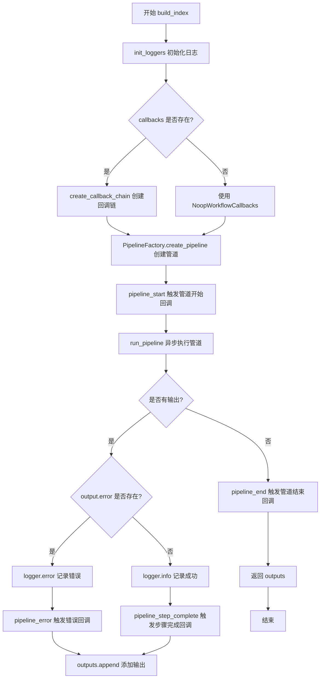
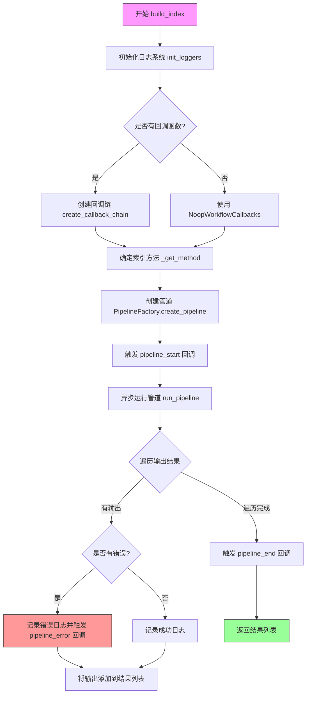

# `graphrag\packages\graphrag\graphrag\api\index.py` 详细设计文档

GraphRAG索引API的核心入口模块，提供build_index异步函数用于执行完整的索引管道，支持多种索引方法、可自定义工作流回调、额外上下文传递以及直接传入DataFrame进行文档索引，并返回管道执行结果列表。

## 整体流程



## 类结构

```
build_index (顶层入口函数)
└── _get_method (内部辅助函数)
```

## 全局变量及字段


### `logger`
    
模块级日志记录器，用于记录索引管道运行过程中的信息、警告和错误

类型：`logging.Logger`
    


    

## 全局函数及方法


### `build_index`

这是一个异步主函数，执行完整的索引管道（pipeline），负责初始化日志、创建回调链、根据配置和索引方法创建管道，然后异步运行管道并收集结果，最终返回管道运行结果的列表。

参数：

- `config`：`GraphRagConfig`，GraphRAG的配置文件，包含索引的各种配置参数
- `method`：`IndexingMethod | str`，索引方法，默认为`IndexingMethod.Standard`，指定要执行的索引风格（全量LLM、NLP+LLM等）
- `is_update_run`：`bool`，是否为增量更新运行，默认为`False`
- `callbacks`：`list[WorkflowCallbacks] | None`，工作流回调函数列表，用于监听管道生命周期事件，默认为`None`
- `additional_context`：`dict[str, Any] | None`，额外的上下文数据，会被传递给管道运行，可在管道状态中通过`additional_context`键访问，默认为`None`
- `verbose`：`bool`，是否启用详细日志输出，默认为`False`
- `input_documents`：`pd.DataFrame | None`，可选的文档数据帧，用于覆盖默认的文档加载和解析步骤，默认为`None`

返回值：`list[PipelineRunResult]`，管道运行结果的列表，每个结果包含工作流名称、执行结果和可能的错误信息

#### 流程图



#### 带注释源码

```python
async def build_index(
    config: GraphRagConfig,
    method: IndexingMethod | str = IndexingMethod.Standard,
    is_update_run: bool = False,
    callbacks: list[WorkflowCallbacks] | None = None,
    additional_context: dict[str, Any] | None = None,
    verbose: bool = False,
    input_documents: pd.DataFrame | None = None,
) -> list[PipelineRunResult]:
    """Run the pipeline with the given configuration.

    Parameters
    ----------
    config : GraphRagConfig
        The configuration.
    method : IndexingMethod default=IndexingMethod.Standard
        Styling of indexing to perform (full LLM, NLP + LLM, etc.).
    memory_profile : bool
        Whether to enable memory profiling.
    callbacks : list[WorkflowCallbacks] | None default=None
        A list of callbacks to register.
    additional_context : dict[str, Any] | None default=None
        Additional context to pass to the pipeline run. This can be accessed in the pipeline state under the 'additional_context' key.
    input_documents : pd.DataFrame | None default=None.
        Override document loading and parsing and supply your own dataframe of documents to index.

    Returns
    -------
    list[PipelineRunResult]
        The list of pipeline run results
    """
    # 根据配置初始化日志系统，verbose参数控制日志详细程度
    init_loggers(config=config, verbose=verbose)

    # 如果提供了回调函数列表，则创建回调链；否则使用无操作回调
    workflow_callbacks = (
        create_callback_chain(callbacks) if callbacks else NoopWorkflowCallbacks()
    )

    # 初始化结果列表，用于收集所有管道运行结果
    outputs: list[PipelineRunResult] = []

    logger.info("Initializing indexing pipeline...")
    # 确定最终的索引方法（如果是更新运行，则添加-update后缀）
    # todo: this could propagate out to the cli for better clarity, but will be a breaking api change
    method = _get_method(method, is_update_run)
    # 根据配置和索引方法创建相应的管道
    pipeline = PipelineFactory.create_pipeline(config, method)

    # 触发管道开始回调，传入管道名称列表
    workflow_callbacks.pipeline_start(pipeline.names())

    # 异步迭代运行管道，yield每个工作流的输出结果
    async for output in run_pipeline(
        pipeline,
        config,
        callbacks=workflow_callbacks,
        is_update_run=is_update_run,
        additional_context=additional_context,
        input_documents=input_documents,
    ):
        # 将每个工作流的输出添加到结果列表
        outputs.append(output)
        # 检查输出是否有错误
        if output.error is not None:
            # 记录错误日志
            logger.error("Workflow %s completed with errors", output.workflow)
            # 触发单个工作流错误回调
            workflow_callbacks.pipeline_error(output.error)
        else:
            # 记录成功完成的日志
            logger.info("Workflow %s completed successfully", output.workflow)
        # 记录详细的输出结果（debug级别）
        logger.debug(str(output.result))

    # 所有工作流执行完毕后，触发管道结束回调
    workflow_callbacks.pipeline_end(outputs)
    # 返回所有管道运行结果
    return outputs
```


### `_get_method`

内部辅助函数，用于处理索引方法名称，根据是否为更新运行（is_update_run）来动态调整方法名称，添加"-update"后缀以区分更新操作和标准索引操作。

参数：

- `method`：`IndexingMethod | str`，要处理的索引方法，可以是枚举类型或字符串形式
- `is_update_run`：`bool`，标记是否为更新运行的布尔值，决定是否需要添加"-update"后缀

返回值：`str`，返回处理后的方法名称字符串，如果是更新运行则返回"{方法名}-update"，否则返回原始方法名

#### 流程图

```mermaid
flowchart TD
    A[开始 _get_method] --> B{判断 method 类型}
    B -->|是 IndexingMethod 枚举| C[提取 method.value]
    B -->|是字符串| D[直接使用 method]
    C --> E[存储到变量 m]
    D --> E
    E --> F{判断 is_update_run}
    F -->|True| G[返回 f"{m}-update"]
    F -->|False| H[返回 m]
    G --> I[结束]
    H --> I
```

#### 带注释源码

```python
def _get_method(method: IndexingMethod | str, is_update_run: bool) -> str:
    """处理索引方法名称，根据是否为更新运行添加后缀。
    
    Parameters
    ----------
    method : IndexingMethod | str
        索引方法，可以是 IndexingMethod 枚举值或字符串
    is_update_run : bool
        是否为更新运行的标志
    
    Returns
    -------
    str
        处理后的方法名称字符串
    """
    # 如果 method 是 IndexingMethod 枚举类型，提取其 value 属性
    # 否则直接使用传入的字符串值
    m = method.value if isinstance(method, IndexingMethod) else method
    
    # 如果是更新运行，在方法名称后添加 "-update" 后缀
    # 否则返回原始方法名称
    return f"{m}-update" if is_update_run else m
```

---

#### 设计目标与约束

- **设计目标**：提供一种简单的方法来区分标准索引和更新索引，通过命名约定让管道工厂能够创建不同的处理流水线
- **约束**：依赖于 `IndexingMethod` 枚举的定义，必须与 `PipelineFactory` 的命名约定保持一致

#### 错误处理与异常设计

- 当前实现未包含显式的错误处理
- 假设传入的 `method` 始终是有效的 `IndexingMethod` 枚举值或字符串
- 如果传入无效的枚举值，可能在后续的 `PipelineFactory.create_pipeline` 中才会暴露问题

#### 潜在技术债务与优化空间

1. **缺少输入验证**：建议在函数入口处添加对 `method` 参数的类型和值验证
2. **魔法字符串**："-update" 后缀作为硬编码字符串，建议提取为常量以提高可维护性
3. **文档完整性**：函数文档字符串使用了简短的描述，建议补充更完整的功能说明和使用示例

## 关键组件


### 索引管道构建器 (build_index)

异步主函数，负责根据配置运行完整的GraphRag索引管道，支持多种索引方法、全量更新和增量更新、回调机制、自定义文档输入和详细日志控制。

### 方法解析器 (_get_method)

辅助函数，将IndexingMethod枚举或字符串转换为实际的方法名称，支持增量更新模式（-update后缀）。

### 配置对象 (GraphRagConfig)

GraphRagConfig类型的配置对象，包含索引管道的所有配置参数，如模型设置、存储路径、并行度等。

### 工作流回调机制 (WorkflowCallbacks)

回调接口链，支持管道生命周期事件（开始、错误、结束）的通知，用于监控和日志记录。

### 管道工厂 (PipelineFactory)

工厂类，根据配置和索引方法创建具体的处理管道实例。

### 管道运行器 (run_pipeline)

异步迭代器，执行索引管道并逐个产出工作流结果，支持增量运行和额外上下文传递。

### 文档输入覆盖 (input_documents)

可选的pd.DataFrame参数，允许绕过文档加载和解析阶段，直接提供待索引的文档数据。

### 日志系统 (init_loggers)

基于配置初始化标准日志记录器，支持详细模式控制。


## 问题及建议


### 已知问题

-   **文档与实现不一致**：文档字符串中声明了`memory_profile`参数，但函数签名中并不存在此参数，存在文档错误
-   **错误处理不完善**：当`output.error is not None`时仅记录日志和触发回调，但仍会继续处理并返回所有输出，调用者难以判断是否存在错误
-   **TODO待完成项**：代码中存在TODO注释"This could propagate out to the cli for better clarity"，表明错误信息传递机制尚未完善
-   **回调参数不完整**：`pipeline_error`回调仅传递了`error`参数，缺少工作流名称等上下文信息，不利于问题定位
-   **类型转换潜在风险**：`method`参数支持`IndexingMethod | str`类型，但转换后直接传给pipeline工厂方法，缺乏运行时类型验证

### 优化建议

-   **修复文档错误**：将文档字符串中的`memory_profile`参数描述移除或补充完整参数说明
-   **改进错误处理机制**：在函数返回时添加错误状态标识，或在遇到错误时抛出异常，以便调用者能够清晰感知失败情况
-   **完善回调上下文**：为`pipeline_error`回调增加工作流名称等上下文信息
-   **添加日志级别控制**：根据`verbose`参数动态调整日志级别，而不仅仅用于初始化日志
-   **增加类型校验**：在`_get_method`函数中添加对返回值的校验，确保生成的pipeline名称有效
-   **添加超时和取消支持**：考虑为长时间运行的pipeline添加超时参数和取消token支持
-   **日志输出优化**：将`logger.debug(str(output.result))`改为条件判断，仅在详细日志开启时执行序列化操作


## 其它


### 设计目标与约束

**设计目标**：
- 提供统一的索引构建接口，支持多种索引方法（Standard、NLP+LLM等）
- 支持增量更新和完整重建两种模式
- 提供灵活的回调机制以支持生命周期事件监控
- 支持自定义文档输入以便高级用户绕过默认加载逻辑

**设计约束**：
- 需配合GraphRagConfig配置使用
- 依赖异步编程模型（async/await）
- 当前API为开发中版本，不保证向后兼容性

### 错误处理与异常设计

**异常传播机制**：
- 工作流级别的错误通过`PipelineRunResult.error`字段返回，不中断整体管道执行
- 严重错误触发`workflow_callbacks.pipeline_error()`回调
- 日志记录采用分级策略：error级别记录失败，info级别记录成功，debug级别记录详细输出

**错误场景**：
- 索引方法无效时通过`_get_method`处理，默认返回原方法或添加-update后缀
- 文档加载失败时管道继续执行但标记该工作流为错误状态

### 数据流与状态机

**输入数据流**：
- config: GraphRagConfig对象，包含索引所有配置
- method: IndexingMethod枚举或字符串，指定索引策略
- is_update_run: 布尔值，标识是否为增量更新
- callbacks: 回调函数列表，用于生命周期事件通知
- additional_context: 字典，向管道状态传递额外上下文
- input_documents: DataFrame，可选的预加载文档数据

**处理数据流**：
- 日志初始化 → 回调链创建 → 管道创建 → 管道执行（异步迭代）→ 结果收集 → 返回

**状态转换**：
- pipeline_start → [workflow execution]* → pipeline_end

### 外部依赖与接口契约

**核心依赖**：
- graphrag.config.models.graph_rag_config.GraphRagConfig: 配置模型
- graphrag.config.enums.IndexingMethod: 索引方法枚举
- graphrag.index.run.run_pipeline.run_pipeline: 管道执行函数
- graphrag.index.workflows.factory.PipelineFactory: 管道工厂
- graphrag.callbacks.workflow_callbacks.WorkflowCallbacks: 回调接口
- pandas.DataFrame: 文档数据结构

**接口契约**：
- build_index为异步函数，返回list[PipelineRunResult]
- callbacks参数支持None，此时使用NoopWorkflowCallbacks
- input_documents为None时使用默认文档加载逻辑

### 性能指标与约束

**性能考量**：
- 管道采用异步迭代器模式，支持流式处理大文档集
- 日志级别控制：verbose=True时输出详细日志，可能影响性能

### 安全与合规要求

**合规性**：
- 代码遵循MIT许可证
- 包含开发警告，声明API可能变更

### 部署与运行环境

**Python版本**：需支持async/await（Python 3.10+）
**依赖包**：pandas、logging标准库

### 配置管理

**配置来源**：通过GraphRagConfig对象传入
**配置项示例**：日志级别(verbose参数)、索引方法、是否增量更新等

    