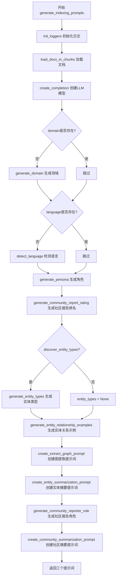
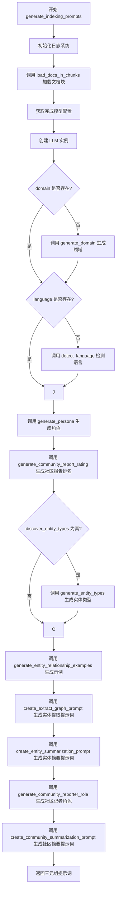

# `graphrag\packages\graphrag\graphrag\api\prompt_tune.py` 详细设计文档

这是 GraphRAG 的自动模板 API，提供自动提示词生成功能，允许外部应用程序接入 GraphRAG 并从私有数据生成提示词，用于索引流程中的实体提取、实体摘要和社区摘要。

## 整体流程



## 类结构

```
无类定义 - 该文件为纯模块化函数文件
所有功能通过 async 函数 generate_indexing_prompts 实现
```

## 全局变量及字段


### `logger`
    
模块级日志记录器，用于记录API执行过程中的信息

类型：`logging.Logger`
    


    

## 全局函数及方法


### `generate_indexing_prompts`

这是一个异步主函数，用于根据输入文档和配置生成索引提示词，包括实体提取提示词、实体摘要提示词和社区摘要提示词。该函数通过调用多个子生成器完成领域检测、语言识别、实体类型识别、角色生成等工作，最终组合成完整的提示词元组返回。

参数：

- `config`：`GraphRagConfig`，GraphRag 配置对象，包含系统配置信息
- `limit`：`PositiveInt`，默认值为 15，要加载的文档块数量限制
- `selection_method`：`DocSelectionType`，默认值为 `DocSelectionType.RANDOM`，文档块的选择方法
- `domain`：`str | None`，默认值为 None，要映射输入文档的领域
- `language`：`str | None`，默认值为 None，用于提示词的语言
- `max_tokens`：`int`，默认值为 `MAX_TOKEN_COUNT`，实体提取提示词使用的最大 token 数
- `discover_entity_types`：`bool`，默认值为 True，是否生成实体类型
- `min_examples_required`：`PositiveInt`，默认值为 2，实体提取提示词所需的最少示例数
- `n_subset_max`：`PositiveInt`，默认值为 300，使用自动选择方法时嵌入的文本块数量
- `k`：`PositiveInt`，默认值为 15，使用自动选择方法时选择的文档数量
- `verbose`：`bool`，默认值为 False，是否输出详细日志

返回值：`tuple[str, str, str]`，包含三个元素，分别是实体提取提示词、实体摘要提示词、社区摘要提示词

#### 流程图



#### 带注释源码

```python
@validate_call(config={"arbitrary_types_allowed": True})
async def generate_indexing_prompts(
    config: GraphRagConfig,
    limit: PositiveInt = 15,
    selection_method: DocSelectionType = DocSelectionType.RANDOM,
    domain: str | None = None,
    language: str | None = None,
    max_tokens: int = MAX_TOKEN_COUNT,
    discover_entity_types: bool = True,
    min_examples_required: PositiveInt = 2,
    n_subset_max: PositiveInt = 300,
    k: PositiveInt = 15,
    verbose: bool = False,
) -> tuple[str, str, str]:
    """Generate indexing prompts.

    Parameters
    ----------
    - config: The GraphRag configuration.
    - output_path: The path to store the prompts.
    - chunk_size: The chunk token size to use for input text units.
    - limit: The limit of chunks to load.
    - selection_method: The chunk selection method.
    - domain: The domain to map the input documents to.
    - language: The language to use for the prompts.
    - max_tokens: The maximum number of tokens to use on entity extraction prompts
    - discover_entity_types: Generate entity types.
    - min_examples_required: The minimum number of examples required for entity extraction prompts.
    - n_subset_max: The number of text chunks to embed when using auto selection method.
    - k: The number of documents to select when using auto selection method.

    Returns
    -------
    tuple[str, str, str]: entity extraction prompt, entity summarization prompt, community summarization prompt
    """
    # 初始化日志系统，根据配置设置日志级别和输出文件
    init_loggers(config=config, verbose=verbose, filename="prompt-tuning.log")

    # 步骤1: 检索文档 - 将文档分块并加载
    logger.info("Chunking documents...")
    doc_list = await load_docs_in_chunks(
        config=config,
        limit=limit,
        select_method=selection_method,
        logger=logger,
        n_subset_max=n_subset_max,
        k=k,
    )

    # 步骤2: 从配置中获取提示调优模型的 LLM 设置
    # TODO: 暴露通过配置指定提示调优模型 ID 的方式
    logger.info("Retrieving language model configuration...")
    default_llm_settings = config.get_completion_model_config(PROMPT_TUNING_MODEL_ID)

    # 步骤3: 创建 LLM 实例用于后续各种生成任务
    logger.info("Creating language model...")
    llm = create_completion(default_llm_settings)

    # 步骤4: 如果未指定领域，则使用 LLM 从文档中自动生成领域
    if not domain:
        logger.info("Generating domain...")
        domain = await generate_domain(llm, doc_list)

    # 步骤5: 如果未指定语言，则使用 LLM 从文档中自动检测语言
    if not language:
        logger.info("Detecting language...")
        language = await detect_language(llm, doc_list)

    # 步骤6: 生成与领域相关的角色描述
    logger.info("Generating persona...")
    persona = await generate_persona(llm, domain)

    # 步骤7: 生成社区报告排名描述
    logger.info("Generating community report ranking description...")
    community_report_ranking = await generate_community_report_rating(
        llm, domain=domain, persona=persona, docs=doc_list
    )

    # 步骤8: 获取实体提取使用的模型配置
    entity_types = None
    extract_graph_llm_settings = config.get_completion_model_config(
        config.extract_graph.completion_model_id
    )
    
    # 步骤9: 如果需要发现实体类型，则生成实体类型
    if discover_entity_types:
        logger.info("Generating entity types...")
        entity_types = await generate_entity_types(
            llm,
            domain=domain,
            persona=persona,
            docs=doc_list,
            json_mode=True,
        )

    # 步骤10: 生成实体关系示例
    logger.info("Generating entity relationship examples...")
    examples = await generate_entity_relationship_examples(
        llm,
        persona=persona,
        entity_types=entity_types,
        docs=doc_list,
        language=language,
        json_mode=False,  # config.llm.model_supports_json should be used, but these prompts are used in non-json mode by the index engine
    )

    # 步骤11: 生成实体提取提示词
    logger.info("Generating entity extraction prompt...")
    extract_graph_prompt = create_extract_graph_prompt(
        entity_types=entity_types,
        docs=doc_list,
        examples=examples,
        language=language,
        json_mode=False,  # config.llm.model_supports_json should be used, but these prompts are used in non-json mode by the index engine
        tokenizer=get_tokenizer(model_config=extract_graph_llm_settings),
        max_token_count=max_tokens,
        min_examples_required=min_examples_required,
    )

    # 步骤12: 生成实体摘要提示词
    logger.info("Generating entity summarization prompt...")
    entity_summarization_prompt = create_entity_summarization_prompt(
        persona=persona,
        language=language,
    )

    # 步骤13: 生成社区记者角色
    logger.info("Generating community reporter role...")
    community_reporter_role = await generate_community_reporter_role(
        llm, domain=domain, persona=persona, docs=doc_list
    )

    # 步骤14: 生成社区摘要提示词
    logger.info("Generating community summarization prompt...")
    community_summarization_prompt = create_community_summarization_prompt(
        persona=persona,
        role=community_reporter_role,
        report_rating_description=community_report_ranking,
        language=language,
    )

    # 调试日志输出生成的中间结果
    logger.debug("Generated domain: %s", domain)
    logger.debug("Detected language: %s", language)
    logger.debug("Generated persona: %s", persona)

    # 返回三个提示词元组
    return (
        extract_graph_prompt,
        entity_summarization_prompt,
        community_summarization_prompt,
    )
```

## 关键组件


### 文档分块加载 (Document Chunking & Loading)

负责将输入文档按配置的 token 限制进行分块处理，并支持多种选择方法（RANDOM 等），为后续 prompt 生成提供数据基础。

### 领域生成 (Domain Generation)

调用 LLM 分析文档内容，自动推断数据所属领域（如医疗、金融等），用于指导后续 prompt 生成的方向性和专业性。

### 语言检测 (Language Detection)

自动识别输入文档的语言类型，确保生成的 prompt 使用正确的语言表达。

### 角色生成 (Persona Generation)

根据领域信息生成适合的社区报告者角色（persona），用于指导 prompt 的写作风格和专业视角。

### 实体类型发现 (Entity Type Discovery)

通过 LLM 自动发现并定义数据中的实体类型（如人物、组织、地点等），为图谱提取提供类型规范。

### 实体关系示例生成 (Entity Relationship Examples Generation)

生成实体关系提取的示例，帮助 LLM 理解特定领域的关系模式。

### 图提取 Prompt 创建 (Graph Extraction Prompt Creation)

根据实体类型、文档示例和语言设置，创建用于从文本中提取图结构的 prompt，支持自定义 token 限制和最小示例数。

### 实体摘要 Prompt 创建 (Entity Summarization Prompt Creation)

生成用于总结单个实体的 prompt，定义实体描述的格式和内容要求。

### 社区报告者角色生成 (Community Reporter Role Generation)

为社区报告生成任务创建合适的报告者角色定义。

### 社区摘要 Prompt 创建 (Community Summarization Prompt Creation)

综合角色定义、排名描述和语言设置，生成社区级别的摘要 prompt。

### 社区报告评级生成 (Community Report Rating Generation)

生成社区报告的质量评级描述，用于指导报告评估标准。

### LLM 配置管理 (LLM Configuration Management)

从配置中获取完成模型（completion model）的设置，用于创建 LLM 实例，支持提示调优和图提取使用不同的模型。

### Token 计数与管理 (Token Counting & Management)

使用 tokenizer 对输入进行 token 计数，确保生成的 prompt 不超过指定的 max_tokens 限制。


## 问题及建议


### 已知问题

- **TODO 标记**：代码中存在 TODO 注释 "Expose a way to specify Prompt Tuning model ID through config"，表明配置接口不完整
- **硬编码与配置不符**：`json_mode=False` 被硬编码两处，注释说明应使用 `config.llm.model_supports_json`，但实际未采用配置值
- **缺失的错误处理**：整个函数无 try-except 块，任何异步调用失败都会导致函数直接崩溃
- **文档字符串过时**：参数描述包含 `output_path` 和 `chunk_size`，但函数签名中并不存在这些参数
- **类型注解不严格**：`max_tokens: int` 应改为 `PositiveInt` 以确保正整数
- **顺序执行的独立任务**：`generate_domain`、`detect_language`、`generate_persona` 等独立任务串行执行，可并行化提升性能
- **重复模型配置获取**：调用了 `config.get_completion_model_config()` 两次获取不同模型配置，可提取为通用方法
- **日志冗余**：多处 `logger.info` 调用，可合并或优化日志级别

### 优化建议

- 移除 TODO，将 Prompt Tuning model ID 纳入配置模型
- 使用 `config.llm.model_supports_json` 替代硬编码的 `json_mode=False`
- 添加全局异常处理或为关键异步调用添加 try-except
- 修正文档字符串参数列表，确保与函数签名一致
- 将 `max_tokens` 类型改为 `PositiveInt`
- 使用 `asyncio.gather()` 并行化独立的异步任务
- 提取公共的模型配置获取逻辑，减少重复代码
- 考虑将日志级别细分，INFO 用于关键步骤，DEBUG 用于详细调试信息

## 其它


### 设计目标与约束

本API的设计目标是提供一个自动化的模板生成机制，使外部应用能够集成graphrag的自动模板功能，从私有数据中生成用于索引的提示词。约束条件包括：1) 该API处于开发阶段，未来版本可能发生变更；2) 不保证向后兼容性；3) 依赖graphrag配置和LLM模型；4) 需要有效的GraphRagConfig配置才能正常运行。

### 错误处理与异常设计

错误处理主要依赖Pydantic的validate_call装饰器进行参数验证，使用PositiveInt确保正整数输入。异常处理包括：1) 配置验证异常，由GraphRagConfig的合法性保证；2) 文档加载异常，通过try-except捕获并记录日志；3) LLM调用异常，由create_completion和各个generate_*函数返回的异常处理；4) 异步操作异常，通过async/await机制传递。日志记录使用标准logging模块，在关键步骤记录info和debug级别信息，便于问题排查。

### 数据流与状态机

数据流遵循以下顺序：初始化日志 -> 加载文档 -> 创建LLM -> 生成域（可选） -> 检测语言（可选） -> 生成角色 -> 生成社区报告排名 -> 生成实体类型（可选） -> 生成实体关系示例 -> 创建提取图提示 -> 创建实体摘要提示 -> 生成社区报告角色 -> 创建社区摘要提示 -> 返回三元组提示。整个过程是严格的顺序执行，前一步的成功是后续步骤的前提条件。状态机包含：初始化、文档加载、模型创建、提示生成、完成五个主要状态。

### 外部依赖与接口契约

外部依赖包括：1) graphrag_llm.completion.create_completion - 创建LLM实例；2) graphrag.config.models.graph_rag_config.GraphRagConfig - 配置模型；3) graphrag.logger.standard_logging.init_loggers - 日志初始化；4) graphrag.prompt_tune.* - 各种提示生成器；5) graphrag.prompt_tune.loader.input.load_docs_in_chunks - 文档加载；6) graphrag.tokenizer.get_tokenizer - 分词器获取；7) pydantic.PositiveInt和validate_call - 参数验证。接口契约：generate_indexing_prompts接受配置对象和各种可选参数，返回包含三个字符串的元组（实体提取提示、实体摘要提示、社区摘要提示）。

### 配置要求与参数说明

config参数为必选，为GraphRagConfig类型，包含完整的graphrag配置。limit默认为15，限制加载的文档块数量。selection_method默认为DocSelectionType.RANDOM，决定文档选择策略。domain和language可选，如不提供则自动生成和检测。max_tokens默认MAX_TOKEN_COUNT，限制提示的最大token数。discover_entity_types默认为True，决定是否生成实体类型。min_examples_required默认为2，实体提取提示所需的最少示例数。n_subset_max默认300，嵌入文本块数量。k默认15，自动选择时选择的文档数。verbose控制日志详细程度。

### 已知限制与使用注意事项

已知限制包括：1) API为实验性质，生产环境需谨慎使用；2) 代码中存在TODO注释指出需要暴露通过配置指定提示调整模型ID的方式；3) 实体提取提示使用json_mode=False，但代码注释指出应使用config.llm.model_supports_json；4) 依赖外部LLM服务，网络或服务不可用时会导致失败；5) 文档加载受限于n_subset_max和k参数，大规模数据需要调整这些参数。使用时应确保LLM服务可用，合理设置max_tokens参数以平衡提示质量和token限制。

### 性能考虑与优化建议

性能考虑因素包括：1) 文档加载的并行性，当前为串行加载；2) LLM调用次数较多，包含多个独立的异步LLM调用，理论上可并行化；3) 分词器在每次调用中获取，建议缓存。优化建议：1) 将独立的LLM调用（如generate_domain、detect_language、generate_persona）并行执行以减少总耗时；2) 添加配置项控制模型ID；3) 使用config.llm.model_supports_json替代硬编码的False；4) 添加超时控制和重试机制；5) 实现结果缓存避免重复生成。


    