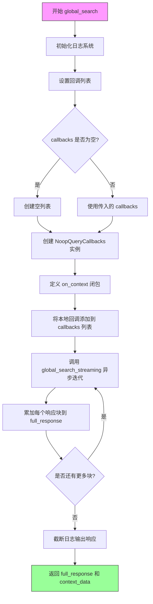
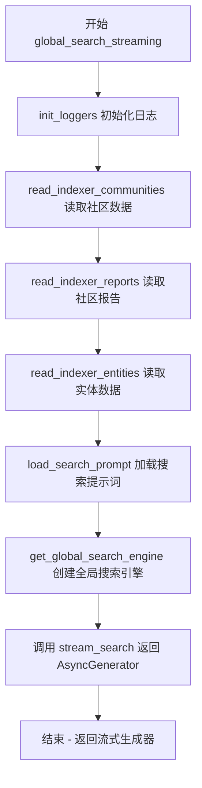
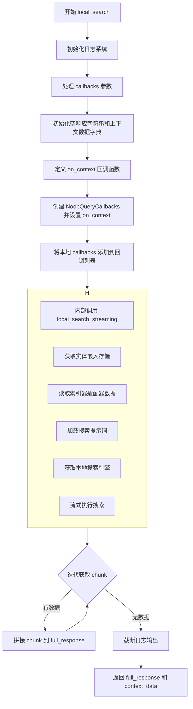
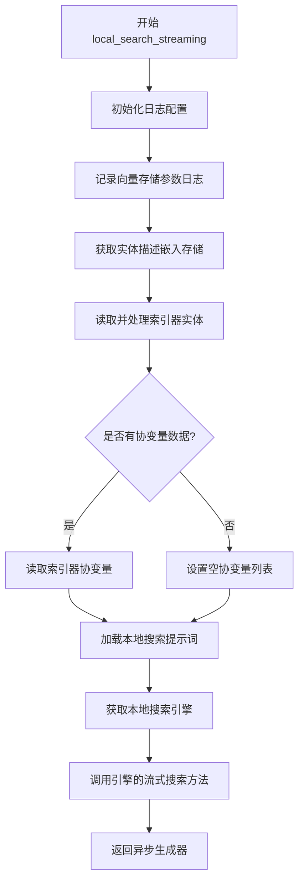
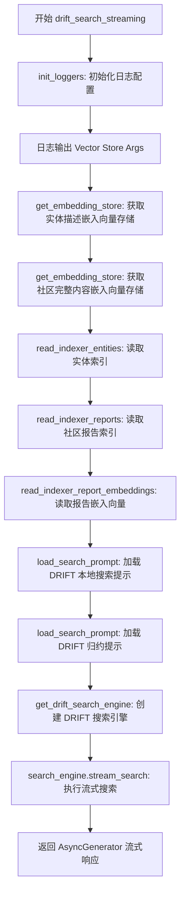
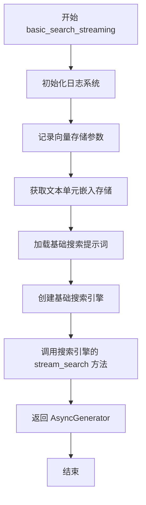

# `graphrag\packages\graphrag\graphrag\api\query.py` 详细设计文档

GraphRAG查询引擎API，提供全局搜索、局部搜索、漂移搜索和基本搜索功能，允许外部应用程序对GraphRAG生成的知识图进行查询并返回流式响应。

## 整体流程

```mermaid
graph TD
    A[开始] --> B[初始化日志]
B --> C[准备回调函数]
C --> D[调用对应的streaming函数]
D --> E[遍历搜索结果块]
E --> F[累加完整响应]
F --> G[返回 (完整响应, 上下文数据)]
```

## 类结构

```
query_engine (模块)
├── 全局函数
│   ├── global_search
│   ├── global_search_streaming
│   ├── local_search
│   ├── local_search_streaming
│   ├── drift_search
│   ├── drift_search_streaming
│   ├── basic_search
│   └── basic_search_streaming
```

## 全局变量及字段


### `logger`
    
全局日志记录器，用于记录模块内的调试和信息日志

类型：`logging.Logger`
    


### `community_full_content_embedding`
    
社区完整内容嵌入配置常量，用于drift搜索中获取社区完整内容的嵌入存储

类型：`str`
    


### `entity_description_embedding`
    
实体描述嵌入配置常量，用于local搜索和drift搜索中获取实体描述的嵌入存储

类型：`str`
    


### `text_unit_text_embedding`
    
文本单元嵌入配置常量，用于basic搜索中获取文本单元的嵌入存储

类型：`str`
    


    

## 全局函数及方法


### `global_search`

执行全局搜索并返回上下文数据和响应。该函数通过调用流式搜索函数 `global_search_streaming` 收集所有响应块，组装完整的文本响应，同时通过回调机制捕获搜索过程中产生的上下文数据。

参数：

- `config`：`GraphRagConfig`，图配置（来自 settings.yaml）
- `entities`：`pd.DataFrame`，包含最终实体的 DataFrame（来自 entities.parquet）
- `communities`：`pd.DataFrame`，包含最终社区的 DataFrame（来自 communities.parquet）
- `community_reports`：`pd.DataFrame`，包含最终社区报告的 DataFrame（来自 community_reports.parquet）
- `community_level`：`int | None`，要搜索的社区级别
- `dynamic_community_selection`：`bool`，启用动态社区选择而非使用固定级别的所有社区报告
- `response_type`：`str`，返回的响应类型
- `query`：`str`，用户查询字符串
- `callbacks`：`list[QueryCallbacks] | None`，查询回调列表，默认为 None
- `verbose`：`bool`，是否输出详细日志，默认为 False

返回值：`tuple[str | dict[str, Any] | list[dict[str, Any]], str | list[pd.DataFrame] | dict[str, pd.DataFrame]]`，返回完整响应和上下文数据的元组

#### 流程图



#### 带注释源码

```python
@validate_call(config={"arbitrary_types_allowed": True})
async def global_search(
    config: GraphRagConfig,
    entities: pd.DataFrame,
    communities: pd.DataFrame,
    community_reports: pd.DataFrame,
    community_level: int | None,
    dynamic_community_selection: bool,
    response_type: str,
    query: str,
    callbacks: list[QueryCallbacks] | None = None,
    verbose: bool = False,
) -> tuple[
    str | dict[str, Any] | list[dict[str, Any]],
    str | list[pd.DataFrame] | dict[str, pd.DataFrame],
]:
    """Perform a global search and return the context data and response.

    Parameters
    ----------
    - config (GraphRagConfig): A graphrag configuration (from settings.yaml)
    - entities (pd.DataFrame): A DataFrame containing the final entities (from entities.parquet)
    - communities (pd.DataFrame): A DataFrame containing the final communities (from communities.parquet)
    - community_reports (pd.DataFrame): A DataFrame containing the final community reports (from community_reports.parquet)
    - community_level (int): The community level to search at.
    - dynamic_community_selection (bool): Enable dynamic community selection instead of using all community reports at a fixed level. Note that you can still provide community_level cap the maximum level to search.
    - response_type (str): The type of response to return.
    - query (str): The user query to search for.

    Returns
    -------
    TODO: Document the search response type and format.
    """
    # 初始化日志系统，根据配置设置日志级别和输出文件
    init_loggers(config=config, verbose=verbose, filename="query.log")

    # 如果没有传入回调，则使用空列表
    callbacks = callbacks or []
    # 初始化完整响应字符串
    full_response = ""
    # 初始化上下文数据字典
    context_data = {}

    # 定义上下文回调闭包，用于捕获搜索过程中的上下文数据
    def on_context(context: Any) -> None:
        nonlocal context_data
        context_data = context

    # 创建无操作查询回调实例并设置上下文回调
    local_callbacks = NoopQueryCallbacks()
    local_callbacks.on_context = on_context
    # 将本地回调添加到回调列表末尾
    callbacks.append(local_callbacks)

    # 记录调试日志，执行全局搜索查询
    logger.debug("Executing global search query: %s", query)
    # 异步迭代流式搜索结果，累加每个响应块
    async for chunk in global_search_streaming(
        config=config,
        entities=entities,
        communities=communities,
        community_reports=community_reports,
        community_level=community_level,
        dynamic_community_selection=dynamic_community_selection,
        response_type=response_type,
        query=query,
        callbacks=callbacks,
    ):
        full_response += chunk
    # 记录查询响应日志，截断超长响应（保留400字符）
    logger.debug("Query response: %s", truncate(full_response, 400))
    # 返回完整响应和上下文数据
    return full_response, context_data
```


### `global_search_streaming`

执行全局搜索并通过异步生成器返回流式响应，支持动态社区选择和上下文数据收集。

参数：

- `config`：`GraphRagConfig`，graphrag 配置对象（来自 settings.yaml）
- `entities`：`pd.DataFrame`，包含最终实体的 DataFrame（来自 entities.parquet）
- `communities`：`pd.DataFrame`，包含最终社区的 DataFrame（来自 communities.parquet）
- `community_reports`：`pd.DataFrame`，包含最终社区报告的 DataFrame（来自 community_reports.parquet）
- `community_level`：`int | None`，要搜索的社区级别
- `dynamic_community_selection`：`bool`，启用动态社区选择而非使用固定级别的所有社区报告
- `response_type`：`str`，返回的响应类型
- `query`：`str`，用户查询字符串
- `callbacks`：`list[QueryCallbacks] | None`，可选的查询回调列表
- `verbose`：`bool`，是否输出详细日志

返回值：`AsyncGenerator`，异步生成器，流式返回搜索结果

#### 流程图



#### 带注释源码

```python
@validate_call(config={"arbitrary_types_allowed": True})
def global_search_streaming(
    config: GraphRagConfig,
    entities: pd.DataFrame,
    communities: pd.DataFrame,
    community_reports: pd.DataFrame,
    community_level: int | None,
    dynamic_community_selection: bool,
    response_type: str,
    query: str,
    callbacks: list[QueryCallbacks] | None = None,
    verbose: bool = False,
) -> AsyncGenerator:
    """Perform a global search and return the context data and response via a generator.

    Context data is returned as a dictionary of lists, with one list entry for each record.

    Parameters
    ----------
    - config (GraphRagConfig): A graphrag configuration (from settings.yaml)
    - entities (pd.DataFrame): A DataFrame containing the final entities (from entities.parquet)
    - communities (pd.DataFrame): A DataFrame containing the final communities (from communities.parquet)
    - community_reports (pd.DataFrame): A DataFrame containing the final community reports (from community_reports.parquet)
    - community_level (int): The community level to search at.
    - dynamic_community_selection (bool): Enable dynamic community selection instead of using all community reports at a fixed level. Note that you can still provide community_level cap the maximum level to search.
    - response_type (str): The type of response to return.
    - query (str): The user query to search for.

    Returns
    -------
    TODO: Document the search response type and format.
    """
    # 初始化日志记录器，根据 config、verbose 和 filename="query.log" 配置
    init_loggers(config=config, verbose=verbose, filename="query.log")

    # 使用 read_indexer_communities 处理社区和社区报告数据
    communities_ = read_indexer_communities(communities, community_reports)
    
    # 读取索引器报告，支持动态社区选择和指定社区级别
    reports = read_indexer_reports(
        community_reports,
        communities,
        community_level=community_level,
        dynamic_community_selection=dynamic_community_selection,
    )
    
    # 读取索引器实体，根据社区级别过滤
    entities_ = read_indexer_entities(
        entities, communities, community_level=community_level
    )
    
    # 加载全局搜索的 Map、Reduce 和 Knowledge 提示词
    map_prompt = load_search_prompt(config.global_search.map_prompt)
    reduce_prompt = load_search_prompt(config.global_search.reduce_prompt)
    knowledge_prompt = load_search_prompt(config.global_search.knowledge_prompt)

    # 调试日志：输出流式全局搜索查询
    logger.debug("Executing streaming global search query: %s", query)
    
    # 获取全局搜索引擎实例，配置报告、实体、社区等信息
    search_engine = get_global_search_engine(
        config,
        reports=reports,
        entities=entities_,
        communities=communities_,
        response_type=response_type,
        dynamic_community_selection=dynamic_community_selection,
        map_system_prompt=map_prompt,
        reduce_system_prompt=reduce_prompt,
        general_knowledge_inclusion_prompt=knowledge_prompt,
        callbacks=callbacks,
    )
    
    # 返回异步生成器，流式返回搜索结果
    return search_engine.stream_search(query=query)
```


### `local_search`

执行本地搜索并返回上下文数据和响应。该函数是 GraphRAG 查询引擎的异步入口点，通过调用流式版本 `local_search_streaming` 来收集完整的响应内容，同时通过回调机制捕获搜索过程中生成的上下文数据。

参数：

- `config`：`GraphRagConfig`，图谱检索配置对象（来自 settings.yaml）
- `entities`：`pd.DataFrame`，包含最终实体数据的数据框（来自 entities.parquet）
- `communities`：`pd.DataFrame`，包含最终社区数据的数据框（来自 communities.parquet）
- `community_reports`：`pd.DataFrame`，包含最终社区报告数据的数据框（来自 community_reports.parquet）
- `text_units`：`pd.DataFrame`，包含最终文本单元数据的数据框（来自 text_units.parquet）
- `relationships`：`pd.DataFrame`，包含最终关系数据的数据框（来自 relationships.parquet）
- `covariates`：`pd.DataFrame | None`，包含最终协变量数据的数据框（来自 covariates.parquet），可为空
- `community_level`：`int`，搜索的社区层级
- `response_type`：`str`，返回的响应类型
- `query`：`str`，用户查询字符串
- `callbacks`：`list[QueryCallbacks] | None`，查询回调函数列表，默认为 None
- `verbose`：`bool`，是否启用详细日志，默认为 False

返回值：`tuple[str | dict[str, Any] | list[dict[str, Any]], str | list[pd.DataFrame] | dict[str, pd.DataFrame]]`，返回元组包含完整响应（字符串、字典或字典列表）和上下文数据（字符串、DataFrame 列表或字典）

#### 流程图



#### 带注释源码

```python
@validate_call(config={"arbitrary_types_allowed": True})
async def local_search(
    config: GraphRagConfig,
    entities: pd.DataFrame,
    communities: pd.DataFrame,
    community_reports: pd.DataFrame,
    text_units: pd.DataFrame,
    relationships: pd.DataFrame,
    covariates: pd.DataFrame | None,
    community_level: int,
    response_type: str,
    query: str,
    callbacks: list[QueryCallbacks] | None = None,
    verbose: bool = False,
) -> tuple[
    str | dict[str, Any] | list[dict[str, Any]],
    str | list[pd.DataFrame] | dict[str, pd.DataFrame],
]:
    """Perform a local search and return the context data and response.

    ----------
    - config (GraphRagConfig): A graphrag configuration (from settings.yaml)
    - entities (pd.DataFrame): A DataFrame containing the final entities (from entities.parquet)
    - community_reports (pd.DataFrame): A DataFrame containing the final community reports (from community_reports.parquet)
    - text_units (pd.DataFrame): A DataFrame containing the final text units (from text_units.parquet)
    - relationships (pd.DataFrame): A DataFrame containing the final relationships (from relationships.parquet)
    - covariates (pd.DataFrame): A DataFrame containing the final covariates (from covariates.parquet)
    - community_level (int): The community level to search at.
    - response_type (str): The response type to return.
    - query (str): The user query to search for.

    Returns
    -------
    TODO: Document the search response type and format.
    """
    # 初始化日志系统，使用配置文件设置日志级别和输出文件
    init_loggers(config=config, verbose=verbose, filename="query.log")

    # 如果没有提供 callbacks，初始化为空列表
    callbacks = callbacks or []
    # 初始化空字符串用于累积完整响应
    full_response = ""
    # 初始化空字典用于存储上下文数据
    context_data = {}

    # 定义内部回调函数，用于捕获搜索过程中的上下文数据
    def on_context(context: Any) -> None:
        nonlocal context_data
        context_data = context

    # 创建 NoopQueryCallbacks 实例并设置 on_context 回调
    local_callbacks = NoopQueryCallbacks()
    local_callbacks.on_context = on_context
    # 将本地 callbacks 添加到回调列表末尾
    callbacks.append(local_callbacks)

    # 记录调试日志，执行本地搜索查询
    logger.debug("Executing local search query: %s", query)
    
    # 异步迭代流式搜索结果，逐块拼接响应
    async for chunk in local_search_streaming(
        config=config,
        entities=entities,
        communities=communities,
        community_reports=community_reports,
        text_units=text_units,
        relationships=relationships,
        covariates=covariates,
        community_level=community_level,
        response_type=response_type,
        query=query,
        callbacks=callbacks,
    ):
        full_response += chunk
    
    # 记录查询响应日志，截断过长内容
    logger.debug("Query response: %s", truncate(full_response, 400))
    
    # 返回完整响应和上下文数据的元组
    return full_response, context_data
```


### `local_search_streaming`

执行局部搜索并通过生成器返回流式响应。该函数从配置和数据源加载必要的信息，构建本地搜索引擎，并以异步生成器的方式流式返回搜索结果。

参数：

- `config`：`GraphRagConfig`，图谱配置对象（来自 settings.yaml）
- `entities`：`pd.DataFrame`，包含最终实体的 DataFrame（来自 entities.parquet）
- `communities`：`pd.DataFrame`，包含最终社区的 DataFrame（来自 communities.parquet）
- `community_reports`：`pd.DataFrame`，包含最终社区报告的 DataFrame（来自 community_reports.parquet）
- `text_units`：`pd.DataFrame`，包含最终文本单元的 DataFrame（来自 text_units.parquet）
- `relationships`：`pd.DataFrame`，包含最终关系的 DataFrame（来自 relationships.parquet）
- `covariates`：`pd.DataFrame | None`，包含最终协变量的 DataFrame（来自 covariates.parquet），可为空
- `community_level`：`int`，搜索的社区层级
- `response_type`：`str`，返回的响应类型
- `query`：`str`，用户查询字符串
- `callbacks`：`list[QueryCallbacks] | None`，可选的查询回调列表
- `verbose`：`bool`，是否输出详细日志

返回值：`AsyncGenerator`，异步生成器，流式返回搜索结果文本片段

#### 流程图



#### 带注释源码

```python
@validate_call(config={"arbitrary_types_allowed": True})
def local_search_streaming(
    config: GraphRagConfig,
    entities: pd.DataFrame,
    communities: pd.DataFrame,
    community_reports: pd.DataFrame,
    text_units: pd.DataFrame,
    relationships: pd.DataFrame,
    covariates: pd.DataFrame | None,
    community_level: int,
    response_type: str,
    query: str,
    callbacks: list[QueryCallbacks] | None = None,
    verbose: bool = False,
) -> AsyncGenerator:
    """Perform a local search and return the context data and response via a generator.

    Parameters
    ----------
    - config (GraphRagConfig): A graphrag configuration (from settings.yaml)
    - entities (pd.DataFrame): A DataFrame containing the final entities (from entities.parquet)
    - community_reports (pd.DataFrame): A DataFrame containing the final community reports (from community_reports.parquet)
    - text_units (pd.DataFrame): A DataFrame containing the final text units (from text_units.parquet)
    - relationships (pd.DataFrame): A DataFrame containing the final relationships (from relationships.parquet)
    - covariates (pd.DataFrame): A DataFrame containing the final covariates (from covariates.parquet)
    - community_level (int): The community level to search at.
    - response_type (str): The response type to return.
    - query (str): The user query to search for.

    Returns
    -------
    TODO: Document the search response type and format.
    """
    # 初始化日志系统，根据配置设置详细日志级别和日志文件名
    init_loggers(config=config, verbose=verbose, filename="query.log")

    # 记录向量存储参数到调试日志（敏感信息会被脱敏处理）
    msg = f"Vector Store Args: {redact(config.vector_store.model_dump())}"
    logger.debug(msg)

    # 获取实体描述嵌入存储，用于基于嵌入的实体检索
    description_embedding_store = get_embedding_store(
        config=config.vector_store,
        embedding_name=entity_description_embedding,
    )

    # 从输入数据中读取并处理实体信息，根据社区层级过滤
    entities_ = read_indexer_entities(entities, communities, community_level)
    # 如果提供了协变量数据则读取，否则设置为空列表
    covariates_ = read_indexer_covariates(covariates) if covariates is not None else []
    # 加载本地搜索的系统提示词模板
    prompt = load_search_prompt(config.local_search.prompt)

    # 记录执行的流式本地搜索查询
    logger.debug("Executing streaming local search query: %s", query)
    # 创建本地搜索引擎实例，传入所有必要的上下文数据和配置
    search_engine = get_local_search_engine(
        config=config,
        # 读取社区报告并根据社区层级过滤
        reports=read_indexer_reports(community_reports, communities, community_level),
        # 读取文本单元数据
        text_units=read_indexer_text_units(text_units),
        # 传入处理后的实体
        entities=entities_,
        # 读取关系数据
        relationships=read_indexer_relationships(relationships),
        # 传入协变量数据（以字典形式包装为claims键）
        covariates={"claims": covariates_},
        # 传入实体描述嵌入存储
        description_embedding_store=description_embedding_store,
        # 设置响应类型
        response_type=response_type,
        # 加载的系统提示词
        system_prompt=prompt,
        # 传入回调函数列表
        callbacks=callbacks,
    )
    # 调用搜索引擎的流式搜索方法并返回异步生成器
    return search_engine.stream_search(query=query)
```


### `drift_search`

执行 DRIFT（Dynamic Retrieval-Interactive Fusion and Tracking）搜索，返回上下文数据和响应。该函数是异步的，通过调用 `drift_search_streaming` 获取流式结果并聚合为完整响应。

参数：

- `config`：`GraphRagConfig`，图 RAG 配置对象（来自 settings.yaml）
- `entities`：`pd.DataFrame`，包含最终实体的 DataFrame（来自 entities.parquet）
- `communities`：`pd.DataFrame`，包含最终社区的 DataFrame（来自 communities.parquet）
- `community_reports`：`pd.DataFrame`，包含最终社区报告的 DataFrame（来自 community_reports.parquet）
- `text_units`：`pd.DataFrame`，包含最终文本单元的 DataFrame（来自 text_units.parquet）
- `relationships`：`pd.DataFrame`，包含最终关系的 DataFrame（来自 relationships.parquet）
- `community_level`：`int`，要搜索的社区层级
- `response_type`：`str`，要返回的响应类型
- `query`：`str`，用户搜索查询
- `callbacks`：`list[QueryCallbacks] | None`，可选的查询回调列表
- `verbose`：`bool`，是否启用详细日志记录

返回值：`tuple[str | dict[str, Any] | list[dict[str, Any]], str | list[pd.DataFrame] | dict[str, pd.DataFrame]]`，返回上下文数据和响应元组。第一个元素是响应（字符串或字典或字典列表），第二个元素是上下文数据（字符串或 DataFrame 或 DataFrame 字典）

#### 流程图

```mermaid
flowchart TD
    A[开始 drift_search] --> B[init_loggers 初始化日志]
    B --> C{callbacks 是否为空}
    C -->|是| D[创建空列表]
    C -->|否| E[使用传入的 callbacks]
    D --> F[初始化 full_response = '']
    F --> G[初始化 context_data = {}]
    G --> H[定义 on_context 回调函数]
    H --> I[创建 NoopQueryCallbacks]
    I --> J[设置 local_callbacks.on_context = on_context]
    J --> K[callbacks.append local_callbacks]
    K --> L[记录日志: 执行 drift search query]
    L --> M[调用 drift_search_streaming 获取异步生成器]
    M --> N{遍历 chunk}
    N -->|是| O[full_response += chunk]
    O --> N
    N -->|否| P[记录日志: Query response]
    P --> Q[返回 full_response, context_data]
```

#### 带注释源码

```python
@validate_call(config={"arbitrary_types_allowed": True})
async def drift_search(
    config: GraphRagConfig,
    entities: pd.DataFrame,
    communities: pd.DataFrame,
    community_reports: pd.DataFrame,
    text_units: pd.DataFrame,
    relationships: pd.DataFrame,
    community_level: int,
    response_type: str,
    query: str,
    callbacks: list[QueryCallbacks] | None = None,
    verbose: bool = False,
) -> tuple[
    str | dict[str, Any] | list[dict[str, Any]],
    str | list[pd.DataFrame] | dict[str, pd.DataFrame],
]:
    """Perform a DRIFT search and return the context data and response.

    Parameters
    ----------
    - config (GraphRagConfig): A graphrag configuration (from settings.yaml)
    - entities (pd.DataFrame): A DataFrame containing the final entities (from entities.parquet)
    - community_reports (pd.DataFrame): A DataFrame containing the final community reports (from community_reports.parquet)
    - text_units (pd.DataFrame): A DataFrame containing the final text units (from text_units.parquet)
    - relationships (pd.DataFrame): A DataFrame containing the final relationships (from relationships.parquet)
    - community_level (int): The community level to search at.
    - query (str): The user query to search for.

    Returns
    -------
    TODO: Document the search response type and format.
    """
    # 初始化日志记录器，使用配置、详细模式和日志文件名
    init_loggers(config=config, verbose=verbose, filename="query.log")

    # 如果没有提供 callbacks，则使用空列表
    callbacks = callbacks or []
    # 初始化完整响应字符串
    full_response = ""
    # 初始化上下文数据字典
    context_data = {}

    # 定义上下文回调函数，用于捕获搜索过程中的上下文数据
    def on_context(context: Any) -> None:
        nonlocal context_data
        context_data = context

    # 创建 NoopQueryCallbacks 实例，用于不执行任何操作但可以捕获回调的虚拟对象
    local_callbacks = NoopQueryCallbacks()
    # 将自定义的 on_context 函数绑定到 local_callbacks
    local_callbacks.on_context = on_context
    # 将 local_callbacks 添加到 callbacks 列表末尾
    callbacks.append(local_callbacks)

    # 记录调试日志：正在执行 drift search 查询
    logger.debug("Executing drift search query: %s", query)
    # 异步迭代 drift_search_streaming 返回的流式数据块
    async for chunk in drift_search_streaming(
        config=config,
        entities=entities,
        communities=communities,
        community_reports=community_reports,
        text_units=text_units,
        relationships=relationships,
        community_level=community_level,
        response_type=response_type,
        query=query,
        callbacks=callbacks,
    ):
        # 将每个流式块追加到完整响应字符串
        full_response += chunk
    # 记录调试日志：截断显示查询响应（最多400字符）
    logger.debug("Query response: %s", truncate(full_response, 400))
    # 返回完整响应和上下文数据的元组
    return full_response, context_data
```


### `drift_search_streaming`

执行 DRIFT（深度检索与迭代推理）搜索并通过异步生成器返回流式响应。该函数是 `drift_search` 的流式版本，初始化日志、加载数据索引和嵌入向量，构建搜索引擎并流式返回查询结果。

参数：

- `config`：`GraphRagConfig`，graphrag 配置对象（来自 settings.yaml）
- `entities`：`pd.DataFrame`，包含最终实体的 DataFrame（来自 entities.parquet）
- `communities`：`pd.DataFrame`，包含最终社区的 DataFrame（来自 communities.parquet）
- `community_reports`：`pd.DataFrame`，包含最终社区报告的 DataFrame（来自 community_reports.parquet）
- `text_units`：`pd.DataFrame`，包含最终文本单元的 DataFrame（来自 text_units.parquet）
- `relationships`：`pd.DataFrame`，包含最终关系的 DataFrame（来自 relationships.parquet）
- `community_level`：`int`，搜索的社区级别
- `response_type`：`str`，返回的响应类型
- `query`：`str`，用户查询字符串
- `callbacks`：`list[QueryCallbacks] | None`，可选的查询回调列表，用于处理搜索过程中的事件
- `verbose`：`bool`，是否输出详细日志

返回值：`AsyncGenerator`，异步生成器，用于流式返回搜索结果

#### 流程图



#### 带注释源码

```python
@validate_call(config={"arbitrary_types_allowed": True})
def drift_search_streaming(
    config: GraphRagConfig,
    entities: pd.DataFrame,
    communities: pd.DataFrame,
    community_reports: pd.DataFrame,
    text_units: pd.DataFrame,
    relationships: pd.DataFrame,
    community_level: int,
    response_type: str,
    query: str,
    callbacks: list[QueryCallbacks] | None = None,
    verbose: bool = False,
) -> AsyncGenerator:
    """Perform a DRIFT search and return the context data and response.

    Parameters
    ----------
    - config (GraphRagConfig): A graphrag configuration (from settings.yaml)
    - entities (pd.DataFrame): A DataFrame containing the final entities (from entities.parquet)
    - community_reports (pd.DataFrame): A DataFrame containing the final community reports (from community_reports.parquet)
    - text_units (pd.DataFrame): A DataFrame containing the final text units (from text_units.parquet)
    - relationships (pd.DataFrame): A DataFrame containing the final relationships (from relationships.parquet)
    - community_level (int): The community level to search at.
    - query (str): The user query to search for.

    Returns
    -------
    TODO: Document the search response type and format.
    """
    # 初始化日志系统，根据 config、verbose 和 filename 配置日志输出
    init_loggers(config=config, verbose=verbose, filename="query.log")

    # 记录向量存储参数到调试日志（敏感信息会被审查）
    msg = f"Vector Store Args: {redact(config.vector_store.model_dump())}"
    logger.debug(msg)

    # 获取实体描述的嵌入向量存储，用于语义搜索
    description_embedding_store = get_embedding_store(
        config=config.vector_store,
        embedding_name=entity_description_embedding,
    )

    # 获取社区完整内容的嵌入向量存储，用于更深层次的语义匹配
    full_content_embedding_store = get_embedding_store(
        config=config.vector_store,
        embedding_name=community_full_content_embedding,
    )

    # 从原始数据中读取并处理实体数据，过滤到指定社区级别
    entities_ = read_indexer_entities(entities, communities, community_level)
    
    # 从原始数据中读取并处理社区报告
    reports = read_indexer_reports(community_reports, communities, community_level)
    
    # 将报告嵌入向量加载到报告中
    read_indexer_report_embeddings(reports, full_content_embedding_store)
    
    # 加载 DRIFT 搜索的本地搜索提示模板
    prompt = load_search_prompt(config.drift_search.prompt)
    
    # 加载 DRIFT 搜索的归约提示模板（用于多轮结果合并）
    reduce_prompt = load_search_prompt(config.drift_search.reduce_prompt)

    # 记录开始执行的搜索查询
    logger.debug("Executing streaming drift search query: %s", query)
    
    # 创建 DRIFT 搜索引擎实例
    search_engine = get_drift_search_engine(
        config=config,
        reports=reports,
        text_units=read_indexer_text_units(text_units),
        entities=entities_,
        relationships=read_indexer_relationships(relationships),
        description_embedding_store=description_embedding_store,
        local_system_prompt=prompt,
        reduce_system_prompt=reduce_prompt,
        response_type=response_type,
        callbacks=callbacks,
    )
    
    # 返回搜索引擎的流式搜索生成器，供调用者迭代获取结果
    return search_engine.stream_search(query=query)
```


### `basic_search`

执行基本搜索并返回上下文数据和响应。该函数是一个异步函数，它初始化日志系统，设置查询回调，然后通过调用流式版本的基本搜索（`basic_search_streaming`）来获取搜索结果，最后返回完整的响应字符串和上下文数据。

参数：

-  `config`：`GraphRagConfig`，graphrag配置文件（来自settings.yaml）
-  `text_units`：`pd.DataFrame`，包含最终文本单元的DataFrame（来自text_units.parquet）
-  `response_type`：`str`，要返回的响应类型
-  `query`：`str`，要搜索的用户查询
-  `callbacks`：`list[QueryCallbacks] | None`，可选的查询回调列表
-  `verbose`：`bool`，是否启用详细日志输出

返回值：`tuple[str | dict[str, Any] | list[dict[str, Any]], str | list[pd.DataFrame] | dict[str, pd.DataFrame]]`，返回一个元组，包含搜索响应和上下文数据。第一个元素是响应内容（字符串、字典或字典列表），第二个元素是上下文数据（字符串、DataFrame列表或字典）

#### 流程图

```mermaid
flowchart TD
    A[开始 basic_search] --> B[init_loggers: 初始化日志系统]
    B --> C{callbacks 是否为 None}
    C -->|是| D[创建空列表]
    C -->|否| E[使用提供的 callbacks]
    D --> F[创建 NoopQueryCallbacks 实例]
    E --> F
    F --> G[定义 on_context 闭包函数]
    G --> H[将 on_context 赋值给 local_callbacks.on_context]
    H --> I[将 local_callbacks 添加到 callbacks 列表]
    I --> J[调用 basic_search_streaming]
    J --> K{遍历流式响应块}
    K -->|每个chunk| L[full_response += chunk]
    L --> K
    K -->|完成| M[truncate: 截断日志输出]
    M --> N[返回 (full_response, context_data)]
```

#### 带注释源码

```python
@validate_call(config={"arbitrary_types_allowed": True})
async def basic_search(
    config: GraphRagConfig,          # GraphRAG 配置对象
    text_units: pd.DataFrame,        # 文本单元数据
    response_type: str,              # 响应类型
    query: str,                      # 用户查询
    callbacks: list[QueryCallbacks] | None = None,  # 可选的回调函数列表
    verbose: bool = False,           # 详细日志标志
) -> tuple[
    str | dict[str, Any] | list[dict[str, Any]],
    str | list[pd.DataFrame] | dict[str, pd.DataFrame],
]:
    """Perform a basic search and return the context data and response.

    Parameters
    ----------
    - config (GraphRagConfig): A graphrag configuration (from settings.yaml)
    - text_units (pd.DataFrame): A DataFrame containing the final text units (from text_units.parquet)
    - query (str): The user query to search for.

    Returns
    -------
    TODO: Document the search response type and format.
    """
    # 初始化日志记录器，使用config配置，设置verbose标志，日志文件名为query.log
    init_loggers(config=config, verbose=verbose, filename="query.log")

    # 如果callbacks为None，则创建空列表；否则使用提供的callbacks
    callbacks = callbacks or []
    full_response = ""                # 用于累积完整的响应文本
    context_data = {}                 # 用于存储上下文数据

    # 定义一个内部回调函数，用于捕获搜索过程中的上下文数据
    def on_context(context: Any) -> None:
        nonlocal context_data
        context_data = context

    # 创建NoopQueryCallbacks实例，并设置其on_context属性为上面定义的闭包函数
    local_callbacks = NoopQueryCallbacks()
    local_callbacks.on_context = on_context
    # 将本地回调添加到回调列表末尾，以便在搜索过程中捕获上下文
    callbacks.append(local_callbacks)

    # 记录调试日志，显示正在执行的查询
    logger.debug("Executing basic search query: %s", query)
    
    # 调用basic_search_streaming生成器函数，遍历流式返回的响应块
    async for chunk in basic_search_streaming(
        config=config,
        text_units=text_units,
        response_type=response_type,
        query=query,
        callbacks=callbacks,
    ):
        # 将每个流式块追加到完整响应字符串中
        full_response += chunk
    
    # 记录查询响应的调试日志，截断到400字符以避免日志过长
    logger.debug("Query response: %s", truncate(full_response, 400))
    
    # 返回元组：包含完整响应字符串和捕获的上下文数据
    return full_response, context_data
```


### `basic_search_streaming`

执行基本搜索并通过生成器返回流式响应。

参数：

-  `config`：`GraphRagConfig`，图配置（来自 settings.yaml）
-  `text_units`：`pd.DataFrame`，包含最终文本单元的数据框（来自 text_units.parquet）
-  `response_type`：`str`，响应类型
-  `query`：`str`，用户查询字符串
-  `callbacks`：`list[QueryCallbacks] | None`，查询回调函数列表
-  `verbose`：`bool`，是否输出详细日志

返回值：`AsyncGenerator`，异步生成器，用于流式返回搜索结果

#### 流程图



#### 带注释源码

```python
@validate_call(config={"arbitrary_types_allowed": True})
def basic_search_streaming(
    config: GraphRagConfig,
    text_units: pd.DataFrame,
    response_type: str,
    query: str,
    callbacks: list[QueryCallbacks] | None = None,
    verbose: bool = False,
) -> AsyncGenerator:
    """Perform a local search and return the context data and response via a generator.

    Parameters
    ----------
    - config (GraphRagConfig): A graphrag configuration (from settings.yaml)
    - text_units (pd.DataFrame): A DataFrame containing the final text units (from text_units.parquet)
    - query (str): The user query to search for.

    Returns
    -------
    TODO: Document the search response type and format.
    """
    # 初始化日志系统，使用配置文件和verbose标志
    init_loggers(config=config, verbose=verbose, filename="query.log")

    # 构建向量存储参数日志消息，并对敏感信息进行脱敏处理
    msg = f"Vector Store Args: {redact(config.vector_store.model_dump())}"
    logger.debug(msg)

    # 获取文本单元的嵌入存储，用于相似度搜索
    embedding_store = get_embedding_store(
        config=config.vector_store,
        embedding_name=text_unit_text_embedding,
    )

    # 从配置中加载基础搜索的提示词模板
    prompt = load_search_prompt(config.basic_search.prompt)

    # 记录搜索查询的调试信息
    logger.debug("Executing streaming basic search query: %s", query)
    
    # 创建基础搜索引擎实例
    search_engine = get_basic_search_engine(
        config=config,
        text_units=read_indexer_text_units(text_units),
        text_unit_embeddings=embedding_store,
        response_type=response_type,
        system_prompt=prompt,
        callbacks=callbacks,
    )
    
    # 返回搜索引擎的流式搜索生成器
    return search_engine.stream_search(query=query)
```

## 关键组件


### 索引适配器模块 (Indexer Adapters)

提供数据读取和转换功能，将Parquet文件数据转换为搜索引擎所需的格式，包括实体、社区、社区报告、文本单元、关系、共变量等的读取器。

### 嵌入存储获取器 (Embedding Store Getter)

通过get_embedding_store函数动态获取不同类型的向量存储，支持实体描述嵌入、社区完整内容嵌入、文本单元嵌入等。

### 搜索引擎工厂 (Search Engine Factory)

根据不同搜索策略创建相应的搜索引擎实例，包括全局搜索引擎、本地搜索引擎、DRIFT搜索引擎和基础搜索引擎。

### 提示加载器 (Prompt Loader)

通过load_search_prompt加载各种搜索策略所需的提示模板，如map_prompt、reduce_prompt、knowledge_prompt等。

### 查询回调系统 (Query Callbacks)

使用NoopQueryCallbacks实现查询事件的回调机制，用于捕获搜索过程中的上下文数据。

### 配置初始化 (Configuration Initialization)

通过init_loggers函数初始化日志系统，支持verbose模式和日志文件输出。

### 流式搜索生成器 (Streaming Search Generators)

提供AsyncGenerator类型的流式返回机制，支持global_search_streaming、local_search_streaming、drift_search_streaming、basic_search_streaming四种搜索方式。

### 数据脱敏工具 (Redaction Utility)

使用redact函数对敏感配置信息进行脱敏处理，防止日志泄露向量存储配置。

### 搜索策略配置 (Search Strategy Configuration)

支持多种搜索策略的配置管理，包括global_search、local_search、drift_search、basic_search各自的提示模板和参数设置。


## 问题及建议


### 已知问题

-   **文档不完整**：多处返回类型标注为"TODO: Document the search response type and format."，API响应格式未明确文档化。
-   **代码重复**：全局搜索、本地搜索、漂移搜索和基础搜索的实现中存在大量重复模式（callbacks初始化、context_data构建、流式结果遍历、logger调用等），违反DRY原则。
-   **类型注解不精确**：`AsyncGenerator`未指定泛型参数，返回类型联合过于宽泛且缺乏具体说明。
-   **内存效率问题**：使用`full_response += chunk`进行字符串拼接，在长响应场景下会导致内存分配效率低下（应使用列表或io.StringIO）。
-   **设计规范违反**：通过动态赋值修改`NoopQueryCallbacks`对象的`on_context`属性（`local_callbacks.on_context = on_context`），而非通过构造函数或合适的方式注入行为。
-   **参数不一致**：`drift_search`/`drift_search_streaming`函数缺少`covariates`参数，而`local_search`/`local_search_streaming`具有该参数，导致功能不一致。
-   **冗余装饰器**：每个公共函数都使用`@validate_call`进行运行时验证，增加了不必要的性能开销。
-   **日志处理**：虽然对日志输出做了截断处理，但完整响应仍完整存储在内存中，可能导致大结果集场景下的内存压力。
-   **API稳定性风险**：代码注释明确警告"under development"且"Backwards compatibility is not guaranteed"，对外暴露风险。

### 优化建议

-   **抽取公共基类或辅助函数**：将callbacks初始化、context_data收集、流式结果聚合等重复逻辑抽取为独立函数或基类。
-   **完善类型注解**：为`AsyncGenerator`添加具体泛型参数，明确`global_search`等函数返回值的具体结构并补充文档。
-   **优化字符串拼接**：使用`["".join()](https://github.com/search?q=%22%22%22.join()&type=code)`或`io.StringIO`替代`+=`操作。
-   **重构callback机制**：设计更清晰的回调注册机制或使用依赖注入模式。
-   **统一函数签名**：确保所有搜索函数具有一致的参数集合，或通过显式默认参数处理可选参数。
-   **移除或条件化验证装饰器**：考虑仅在关键入口点使用`@validate_call`，或在生产环境中禁用。
-   **补充错误处理**：添加try-except块捕获潜在异常并提供有意义的错误信息。
-   **完善文档**：补全"TODO"标记的返回类型说明，提供具体的响应格式示例。

## 其它


### 设计目标与约束

本API旨在为GraphRAG系统提供统一的查询接口，支持全局搜索、本地搜索、DRIFT搜索和基本搜索四种模式。核心目标是将外部应用与GraphRAG知识图谱查询能力解耦，提供同步和流式两种响应方式。设计约束包括：1）所有搜索方法均为异步或生成器模式以支持流式输出；2）依赖pandas DataFrame作为数据交换格式；3）必须通过GraphRagConfig统一配置；4）回调机制用于扩展搜索行为。

### 错误处理与异常设计

API采用分层错误处理策略：1）输入验证使用Pydantic的validate_call装饰器，确保config、DataFrame等参数类型正确；2）内部错误通过logger记录而非直接抛出，保证搜索流程的鲁棒性；3）搜索过程中的异常由底层search_engine捕获并转换为错误响应。TODO：需要完善具体的异常类型定义和错误码体系。

### 数据流与状态机

数据流遵循"配置初始化→数据加载→搜索器创建→流式查询→结果聚合"的流程。以global_search为例：1）init_loggers初始化日志；2）read_indexer_*系列函数将Parquet数据转换为索引格式；3）load_search_prompt加载提示词模板；4）get_*_search_engine创建搜索器；5）stream_search迭代返回结果块；6）async for收集完整响应。状态机主要涉及搜索类型选择（global/local/drift/basic）和社区级别筛选。

### 外部依赖与接口契约

核心依赖包括：1）pandas用于DataFrame数据处理；2）pydantic用于配置验证；3）graphrag内部模块（config、query、callbacks、logger、utils）。外部契约：调用方需提供有效的GraphRagConfig和对应的Parquet数据文件（entities.parquet、communities.parquet、community_reports.parquet、text_units.parquet、relationships.parquet、covariates.parquet）。返回值为元组（响应文本，上下文数据），响应类型为str|dict|list，上下文数据类型为str|list[DataFrame]|dict[DataFrame]。

### 安全性考虑

1）日志脱敏：使用redact函数对向量存储配置进行脱敏处理；2）配置验证：通过Pydantic模型确保配置合法性；3）警告声明：代码头部明确标注API处于开发阶段，向后兼容性不保证。TODO：需添加请求超时保护、敏感信息过滤、速率限制等安全措施。

### 性能考虑与优化空间

1）流式响应减少内存峰值；2）DataFrame按需加载避免全量载入；3）embedding_store缓存减少重复初始化。当前优化空间：1）多处重复调用init_loggers，可提取为模块级初始化；2）NoopQueryCallbacks每次创建新实例，可考虑单例或对象池；3）search_engine创建逻辑在各函数中重复，可抽象为工厂方法；4）缺少搜索结果缓存机制。

### 并发与异步处理

API设计充分利用Python异步特性：1）搜索方法分为async版（global_search/local_search/drift_search/basic_search）和生成器版（*_streaming）；2）流式输出通过AsyncGenerator实现，支持非阻塞迭代；3）回调机制支持异步通知。并发场景下需注意：DataFrame和embedding_store的非线程安全性，建议每个并发请求创建独立的API调用实例。

### 配置管理

所有搜索方法共享GraphRagConfig作为唯一配置入口，配置内容包括：1）vector_store向量存储配置；2）global_search/local_search/drift_search/basic_search各模块的prompt模板路径；3）日志配置。配置通过load_search_prompt动态加载提示词模板，实现搜索逻辑与提示词的解耦。

### 测试策略建议

1）单元测试：验证各read_indexer_*函数的数据转换逻辑；2）集成测试：使用模拟的Parquet数据测试完整搜索流程；3）性能测试：对比流式与同步模式的响应时间和内存占用；4）回归测试：确保不同版本间搜索结果一致性。TODO：当前代码缺少测试文件。

### 版本兼容性说明

根据代码头部警告，该API为开发版本，后续可能发生非向后兼容变更。当前版本依赖：Python 3.10+（使用str|None语法）、pandas、pydantic。升级建议：1）锁定graphrag具体版本；2）关注release notes中的breaking changes；3）实现版本协商机制。


    