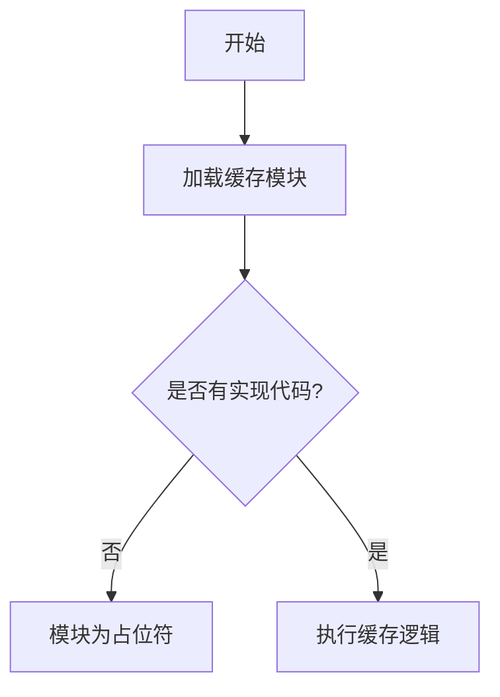

# `graphrag\packages\graphrag\graphrag\cache\__init__.py` 详细设计文档

该代码文件是一个缓存模块的占位符，目前仅包含版权信息和模块文档字符串，没有具体的实现代码。根据模块名称推断，该模块预计将实现缓存相关的功能，如数据存储、检索、过期策略等。

## 整体流程



## 类结构

```
CacheModule (模块根)
└── (无具体类实现)
```

## 全局变量及字段


    

## 全局函数及方法


## 关键组件


### 代码概述

该代码文件目前仅为一个空的占位符模块，仅包含版权声明和模块级文档字符串，未实现任何缓存相关的功能逻辑。

### 文件整体运行流程

由于当前代码不包含任何可执行逻辑，该模块被导入时仅执行模块初始化操作，不涉及任何业务流程或数据处理。

### 关键组件信息

由于代码中未定义任何类、函数或变量，因此无法提取关键组件信息。

### 潜在的技术债务或优化空间

当前代码存在以下需要完善之处：
1. 缺少缓存数据结构的实现（如LRU、TTL缓存等）
2. 缺少缓存操作接口（get、set、delete等）
3. 缺少缓存策略配置机制
4. 缺少缓存清理和过期处理逻辑
5. 缺少线程安全或并发控制机制
6. 缺少缓存命中率和性能监控功能

### 其它项目

**设计目标与约束**：待定（需要根据实际需求定义）

**错误处理与异常设计**：待实现

**数据流与状态机**：无（模块尚未实现功能）

**外部依赖与接口契约**：待定义


## 问题及建议


### 已知问题

-   **功能完全缺失**：当前代码仅包含版权声明和模块文档字符串，没有任何实际的缓存实现代码，无法提供任何缓存功能。
-   **缺乏接口定义**：作为缓存模块，未定义任何缓存接口或抽象类，用户无法了解可用的API。
-   **无错误处理机制**：由于没有任何实现代码，缺少对边界情况（如缓存满、键不存在、并发访问等）的错误处理设计。
-   **缺少配置能力**：未提供任何配置选项（如缓存大小限制、过期策略、存储后端选择等）。
-   **无文档说明**：模块文档字符串过于简略，仅有"Cache module."一句话，缺少功能说明、使用示例和API文档。
-   **缺乏可测试性**：由于无实际代码，无法进行任何单元测试或集成测试。

### 优化建议

-   **实现核心缓存功能**：根据实际需求实现基础缓存逻辑，如内存缓存、文件缓存或分布式缓存支持。
-   **设计清晰的API接口**：定义统一的缓存接口（get、set、delete、clear等），便于后续扩展和替换不同缓存实现。
-   **添加缓存策略支持**：实现常见的缓存策略，如LRU（最近最少使用）、TTL（过期时间）、LFU（最不经常使用）等。
-   **完善错误处理**：为缓存操作添加异常处理机制，定义自定义异常类（如CacheMissError、CacheFullError等）。
-   **添加配置管理**：提供可配置的缓存参数，如最大容量、默认过期时间、序列化方式等。
-   **补充文档**：编写详细的模块文档，包括功能概述、使用方法、API说明和示例代码。
-   **添加单元测试**：为缓存模块编写完整的单元测试，确保核心功能的正确性和稳定性。


## 其它


### 设计目标与约束

该模块暂无实现，设计目标与约束待后续需求明确后补充。

### 错误处理与异常设计

暂无实现，错误处理与异常机制待补充。

### 数据流与状态机

暂无实现，数据流与状态机设计待补充。

### 外部依赖与接口契约

暂无实现，外部依赖与接口契约待补充。

### 性能要求

暂无实现，性能要求待补充。

### 安全性考虑

暂无实现，安全性设计待补充。

### 可维护性与可测试性

暂无实现，代码组织、单元测试及可维护性措施待补充。

### 配置文件与参数说明

暂无实现，配置项及参数说明待补充。

### 版本控制与发布策略

暂无实现，版本号及发布流程待补充。

### 部署架构

暂无实现，部署方式与运行时环境待补充。


    