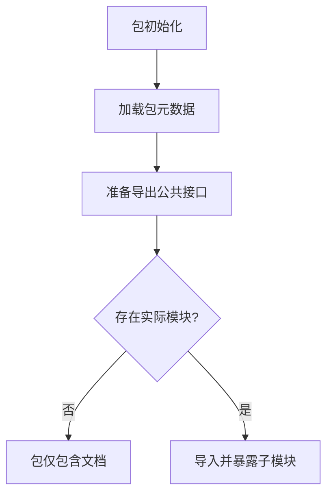

# `graphrag\packages\graphrag\graphrag\callbacks\__init__.py` 详细设计文档

这是 Microsoft  Corporation 的一个回调实现包（callback implementations），基于 MIT License 开源。该文件仅包含包级别的文档字符串和许可证声明，没有具体的类、方法或函数实现。

## 整体流程



## 类结构

```
Package: callback implementations
└── (无具体类定义)
```

## 全局变量及字段


    

## 全局函数及方法


## 关键组件


### 一段话描述

该代码文件仅包含版权声明和包级别的文档字符串，是一个空的占位文件，用于标识一个包含回调实现的包的开始，实际功能实现代码未提供。

### 文件的整体运行流程

由于该文件不包含任何可执行代码，仅作为包的入口标识，因此不存在实际的运行流程。

### 类的详细信息

无类定义。

### 关键组件信息

由于源代码中未包含实际实现代码，无法识别具体的核心组件。该文件仅提供了包的元信息，暗示该包将用于实现回调机制。

### 潜在的技术债务或优化空间

1. **空文件问题**：当前文件仅为占位符，缺少实际的回调实现代码
2. **文档不完整**：包级别的文档字符串过于简略，未说明回调的具体用途、类型或设计模式

### 其它项目

- **设计目标与约束**：从版权信息和包名推断，该代码属于 Microsoft 的某个项目，使用 MIT 许可证开源
- **错误处理与异常设计**：无异常处理设计
- **数据流与状态机**：无数据流设计
- **外部依赖与接口契约**：无依赖和接口定义


## 问题及建议


### 已知问题

-   **空包实现**：该包仅包含版权声明和简单的文档字符串，没有任何实际的回调实现代码，是一个空的占位符包
-   **功能缺失**：包名表明应包含回调实现（如回调接口、抽象类或具体实现），但当前完全缺失
-   **文档不完整**：文档字符串过于简略，未说明该包的具体用途、目标用户或预期功能

### 优化建议

-   **实现核心功能**：根据包名"callback implementations"，应添加具体的回调接口或抽象类定义，例如定义各种回调协议（Protocol）或基类
-   **完善文档**：扩展文档字符串，详细说明该包的用途、包含的回调类型、使用场景和示例代码
-   **定义导出接口**：在__init__.py中明确导出公共API，便于其他模块导入使用
-   **添加类型注解**：为所有回调接口添加完整的类型注解，提高代码可维护性和IDE支持


## 其它


### 设计目标与约束

该包旨在提供一个统一的回调实现框架，支持异步事件处理和插件化扩展机制。设计约束包括：保持轻量级依赖、遵循Microsoft的代码规范、支持类型安全、以及提供良好的向后兼容性。

### 错误处理与异常设计

回调执行过程中的异常应被捕获并记录，不应向上传播导致调用方崩溃。提供回调执行结果的统一返回格式，包含成功状态、错误信息和建议的重试策略。

### 数据流与状态机

回调包的数据流主要包括：事件触发 -> 回调调度 -> 参数验证 -> 回调执行 -> 结果处理 -> 状态更新。状态机管理回调的注册态、执行态和注销态，确保回调的生命周期清晰可控。

### 外部依赖与接口契约

该包依赖于Python标准库中的typing模块和可能的asyncio模块用于异步回调。提供明确的接口定义（Protocol或Abstract Base Class），确保回调实现者遵循统一的契约，包括参数签名、返回值类型和异常规范。

### 性能考虑

回调调度应尽可能低开销，支持批量注册和注销操作。提供缓存机制避免重复创建相同的回调包装器。考虑使用弱引用避免内存泄漏。

### 安全考虑

回调函数应支持权限验证机制，防止未授权代码注册回调。对传入回调的参数进行必要的安全检查，防止注入攻击。提供回调执行超时机制。

### 配置管理

支持通过配置文件或环境变量配置回调的默认行为，包括超时时间、重试次数、日志级别等。配置应支持热更新而无需重启服务。

### 测试策略

提供单元测试覆盖所有公开接口，包括回调注册、执行、注销等核心功能。包含集成测试验证回调在实际场景中的表现。提供模拟对象（Mock）便于使用者进行测试。

### 监控与日志

记录回调的注册、注销、执行开始、执行结束等关键事件。收集执行时长、成功率、失败原因等指标。提供可配置的日志级别，支持结构化日志输出。

### 命名约定与代码风格

遵循PEP 8 Python代码规范，使用Google风格的文档字符串。回调类名使用CamelCase，方法名使用snake_case。常量使用UPPER_SNAKE_CASE。全局变量以单下划线前缀表示私有性。

### 版本管理与发布策略

遵循语义化版本号（Semantic Versioning）。主版本号变更表示不兼容的API修改，次版本号表示向后兼容的功能新增，修订号表示向后兼容的问题修复。


    