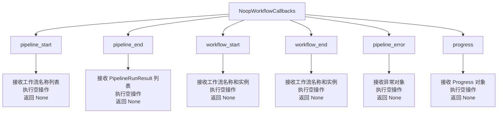
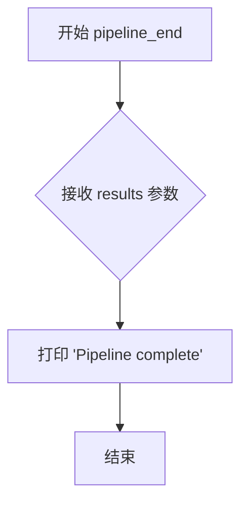
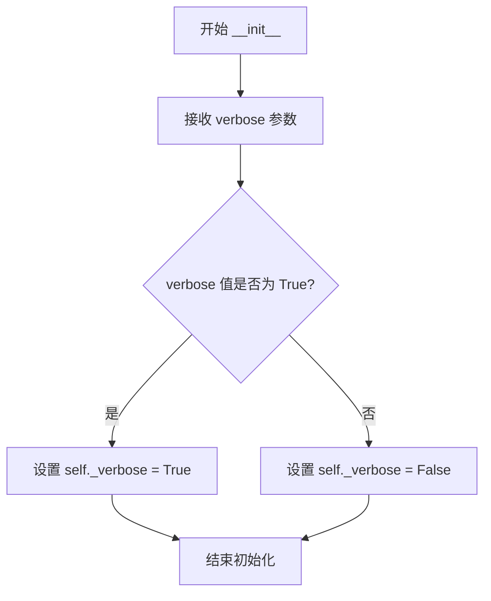
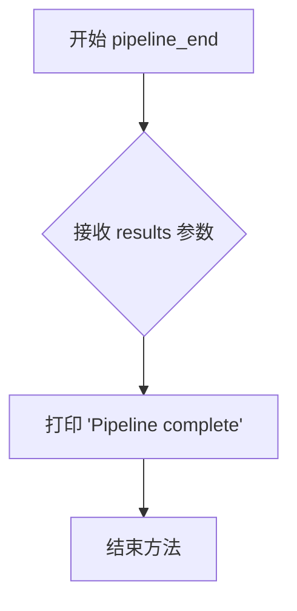

# `graphrag\packages\graphrag\graphrag\callbacks\console_workflow_callbacks.py` 详细设计文档

一个控制台工作流回调日志记录器，用于在索引引擎执行过程中向控制台输出工作流和管道的启动、进度、完成及错误信息，支持详细模式开关

## 整体流程

```mermaid
graph TD
    A[开始] --> B[创建ConsoleWorkflowCallbacks实例]
B --> C{pipeline_start调用}
C --> D[打印Starting pipeline with workflows: {names}]
D --> E[工作流执行中...]
E --> F{pipeline_run回调}
F --> G[调用workflow_start - 打印Starting workflow: {name}]
G --> H[工作流执行]
H --> I[调用progress - 打印进度条]
I --> J[调用workflow_end - 打印Workflow complete: {name}]
J --> K{verbose=True?}
K -- 是 --> L[打印instance详细信息]
K -- 否 --> M[继续]
L --> N{其他工作流?}
M --> N
N -- 是 --> G
N -- 否 --> O[调用pipeline_end - 打印Pipeline complete]
O --> P{发生错误?}
P -- 是 --> Q[调用pipeline_error - 打印错误信息]
P -- 否 --> R[结束]
Q --> R
```

## 类结构

```
NoopWorkflowCallbacks (抽象基类/空实现)
└── ConsoleWorkflowCallbacks (实现类)
```

## 全局变量及字段


### `print`
    
内置函数，用于向控制台输出信息

类型：`builtin_function`
    


### `round`
    
内置函数，用于计算百分比时的四舍五入

类型：`builtin_function`
    


### `ConsoleWorkflowCallbacks._verbose`
    
类变量，控制是否输出详细信息，默认为False

类型：`bool`
    


### `ConsoleWorkflowCallbacks._verbose`
    
实例变量，控制是否在workflow_end时输出instance详细信息

类型：`bool`
    
    

## 全局函数及方法


### `NoopWorkflowCallbacks`

这是一个工作流回调的空实现基类，提供了工作流执行过程中各阶段的默认（无操作）回调方法，供子类重写以实现具体的日志记录或监控逻辑。

参数：

- `self`：隐式参数，实例本身

返回值：`None`（所有方法均返回 None）

#### 流程图



#### 带注释源码

```python
# graphrag/callbacks/noop_workflow_callbacks.py
# 该源码为根据 ConsoleWorkflowCallbacks 继承关系推断的空实现基类

from typing import List
from graphrag.index.typing.pipeline_run_result import PipelineRunResult
from graphrag.logger.progress import Progress


class NoopWorkflowCallbacks:
    """工作流回调的空实现基类，提供默认的无操作方法供子类重写。"""

    def pipeline_start(self, names: List[str]) -> None:
        """整个管道开始时的回调（空实现）。
        
        参数:
            names: 要执行的工作流名称列表
        返回值: None
        """
        pass

    def pipeline_end(self, results: List[PipelineRunResult]) -> None:
        """整个管道结束时的回调（空实现）。
        
        参数:
            results: 管道运行结果列表
        返回值: None
        """
        pass

    def workflow_start(self, name: str, instance: object) -> None:
        """单个工作流开始时的回调（空实现）。
        
        参数:
            name: 工作流名称
            instance: 工作流实例对象
        返回值: None
        """
        pass

    def workflow_end(self, name: str, instance: object) -> None:
        """单个工作流结束时的回调（空实现）。
        
        参数:
            name: 工作流名称
            instance: 工作流实例对象
        返回值: None
        """
        pass

    def pipeline_error(self, error: BaseException) -> None:
        """管道执行发生错误时的回调（空实现）。
        
        参数:
            error: 捕获的异常对象
        返回值: None
        """
        pass

    def progress(self, progress: Progress) -> None:
        """进度更新时的回调（空实现）。
        
        参数:
            progress: 进度对象，包含已完成和总任务数
        返回值: None
        """
        pass
```


### `ConsoleWorkflowCallbacks.pipeline_end`

该方法为 `ConsoleWorkflowCallbacks` 类的实例方法，用于在管道执行完成后打印"Pipeline complete"消息到控制台，接收一个 `PipelineRunResult` 类型的列表作为参数。

参数：

-  `self`：`ConsoleWorkflowCallbacks`，类的实例本身
-  `results`：`list[PipelineRunResult]`，管道执行结果的列表，每个元素包含单个工作流运行的结果

返回值：`None`，无返回值（仅执行打印操作）

#### 流程图



#### 带注释源码

```python
def pipeline_end(self, results: list[PipelineRunResult]) -> None:
    """Execute this callback to signal when the entire pipeline ends."""
    print("Pipeline complete")
```

---

### 补充说明

**关于 `PipelineRunResult` 类型**：
- `PipelineRunResult` 是从 `graphrag.index.typing.pipeline_run_result` 模块导入的类型
- 当前代码文件中并未定义该类型，仅使用了它作为参数类型注解
- 该类型可能是一个数据类或命名元组，用于封装工作流运行的结果
- 如需获取该类型的详细字段信息，需要查看 `graphrag/index/typing/pipeline_run_result.py` 源文件


### `ConsoleWorkflowCallbacks.progress`

处理索引引擎向控制台发出的进度更新，计算并显示当前进度百分比。

参数：

-  `progress`：`Progress`，进度对象，包含已完成项目和总项目数信息

返回值：`None`，无返回值，此方法仅用于输出进度信息

#### 流程图

```mermaid
flowchart TD
    A[开始 progress 方法] --> B[获取进度: progress.completed_items]
    B --> C{completed_items 是否存在?}
    C -->|是| D[complete = completed_items]
    C -->|否| E[complete = 0]
    D --> F[获取总数: progress.total_items]
    E --> F
    F --> G{total_items 是否存在?}
    G -->|是| H[total = total_items]
    G -->|否| I[total = 1]
    H --> J[计算百分比: percent = round((complete / total) * 100)]
    I --> J
    J --> K[格式化输出字符串: start = '  {complete} / {total} ']
    K --> L[打印进度条: print with flush and \r]
    L --> M[结束方法]
```

#### 带注释源码

```python
def progress(self, progress: Progress) -> None:
    """Handle when progress occurs."""
    # 获取已完成项目数，若为 None 则默认为 0
    complete = progress.completed_items or 0
    # 获取总项目数，若为 None 则默认为 1（避免除零错误）
    total = progress.total_items or 1
    # 计算完成百分比
    percent = round((complete / total) * 100)
    # 格式化进度字符串，显示完成数/总数
    start = f"  {complete} / {total} "
    # 打印进度条，使用点号填充至百分比位置，flush=True 立即刷新，\r 实现覆盖更新
    print(f"{start:{'.'}<{percent}}", flush=True, end="\r")
```


### `ConsoleWorkflowCallbacks.__init__`

初始化 ConsoleWorkflowCallbacks 实例，用于设置是否启用详细输出模式。

参数：

-   `verbose`：`bool`，控制是否在 workflow 结束时输出详细信息。默认值为 `False`

返回值：`None`，无返回值（构造函数）

#### 流程图



#### 带注释源码

```python
def __init__(self, verbose=False):
    """初始化 ConsoleWorkflowCallbacks 实例。

    Args:
        verbose: 布尔值，控制是否在 workflow 结束时输出详细信息。
                 默认为 False，不输出详细信息。
    """
    # 将 verbose 参数值存储到实例属性 _verbose 中
    # 后续在 workflow_end 方法中会根据该值决定是否打印实例对象
    self._verbose = verbose
```


### `ConsoleWorkflowCallbacks.pipeline_start`

执行此回调以信号通知整个管道何时启动。当索引引擎的整个管道启动时，该方法会被调用，用于向控制台输出正在启动的工作流名称列表。

参数：

- `names`：`list[str]`，要启动的工作流名称列表

返回值：`None`，该方法不返回任何值

#### 流程图

```mermaid
flowchart TD
    A[开始] --> B[接收 names 参数]
    B --> C{检查 names 是否为空}
    C -->|否| D[使用 ", ".join(names) 格式化字符串]
    C -->|是| E[使用空字符串]
    D --> F[打印 "Starting pipeline with workflows: " + 格式化后的字符串]
    E --> F
    F --> G[结束]
```

#### 带注释源码

```python
def pipeline_start(self, names: list[str]) -> None:
    """Execute this callback to signal when the entire pipeline starts."""
    # 使用字符串的 join 方法将 names 列表中的元素用逗号和空格连接起来
    # 例如: ["workflow1", "workflow2"] -> "workflow1, workflow2"
    workflow_names = ", ".join(names)
    
    # 打印管道启动信息到控制台
    # 输出格式: "Starting pipeline with workflows: {workflow_names}"
    print("Starting pipeline with workflows:", workflow_names)
```


### `ConsoleWorkflowCallbacks.pipeline_end`

该方法是一个回调函数，在整个数据处理管道（pipeline）执行完毕后被调用，用于输出管道执行完成的消息到控制台，作为日志记录的一部分。

参数：

- `self`：隐式参数，ConsoleWorkflowCallbacks 实例本身
- `results`：`list[PipelineRunResult]`，管道执行结果的列表，包含各个工作流（workflow）的运行结果

返回值：`None`，无返回值，仅执行打印操作

#### 流程图



#### 带注释源码

```python
def pipeline_end(self, results: list[PipelineRunResult]) -> None:
    """Execute this callback to signal when the entire pipeline ends."""
    # 打印管道完成的消息，告知用户所有工作流已执行完毕
    # 注意：虽然接收了 results 参数，但当前实现中未使用该参数
    # 这可能是一个潜在的技术债务，因为结果信息未被记录或展示
    print("Pipeline complete")
```


### `ConsoleWorkflowCallbacks.workflow_start`

执行此回调以在工作流启动时向控制台打印工作流名称。

参数：

-  `name`：`str`，工作流的名称
-  `instance`：`object`，工作流的实例对象

返回值：`None`，无返回值

#### 流程图

```mermaid
flowchart TD
    A[开始 workflow_start] --> B{接收参数}
    B --> C[name: str - 工作流名称]
    B --> D[instance: object - 工作流实例]
    C --> E[print f'Starting workflow: {name}']
    E --> F[结束]
```

#### 带注释源码

```python
def workflow_start(self, name: str, instance: object) -> None:
    """Execute this callback when a workflow starts."""
    # 打印工作流启动消息，输出工作流名称
    print(f"Starting workflow: {name}")
```


### `ConsoleWorkflowCallbacks.workflow_end`

该方法在工作流执行完成后被调用，用于在控制台输出工作流完成信息，并在 verbose 模式下输出工作流实例的详细信息。

参数：

- `self`：隐式参数，`ConsoleWorkflowCallbacks` 实例本身
- `name`：`str`，工作流的名称，用于在控制台显示具体哪个工作流已完成
- `instance`：`object`，工作流的实例对象，在 verbose 模式下会被打印以提供详细的运行时信息

返回值：`None`，该方法仅执行副作用（打印日志），不返回任何值

#### 流程图

```mermaid
flowchart TD
    A[开始 workflow_end] --> B[打印空行]
    B --> C[打印 'Workflow complete: {name}']
    C --> D{self._verbose == True?}
    D -->|Yes| E[打印 instance 对象]
    D -->|No| F[跳过打印]
    E --> G[结束]
    F --> G
```

#### 带注释源码

```python
def workflow_end(self, name: str, instance: object) -> None:
    """Execute this callback when a workflow ends."""
    # 打印空行，用于处理之前进度显示可能留下的回车符
    print("")  
    # 输出工作流完成的消息，包含工作流名称
    print(f"Workflow complete: {name}")
    # 如果启用了 verbose 模式，则打印工作流实例的详细信息
    if self._verbose:
        print(instance)
```


### `ConsoleWorkflowCallbacks.pipeline_error`

当管道发生错误时执行的回调方法，用于将错误信息输出到控制台。

参数：

- `self`：隐式参数，ConsoleWorkflowCallbacks 实例本身
- `error`：`BaseException`，管道执行过程中捕获的异常对象

返回值：`None`，无返回值

#### 流程图

```mermaid
flowchart TD
    A[开始] --> B[接收error参数]
    B --> C[打印错误信息: Pipeline error: {error}]
    C --> D[结束]
```

#### 带注释源码

```python
def pipeline_error(self, error: BaseException) -> None:
    """Execute this callback when an error occurs in the pipeline."""
    # 打印错误信息到控制台，格式为 "Pipeline error: {错误内容}"
    print(f"Pipeline error: {error}")
```


### `ConsoleWorkflowCallbacks.progress`

该方法是一个进度回调处理器，用于在控制台显示索引工作流程的进度。它接收一个 Progress 对象，计算完成百分比，并以可视化进度条的形式将进度信息打印到控制台。

参数：

- `self`：隐式参数，ConsoleWorkflowCallbacks 实例本身
- `progress`：`Progress`，包含已完成项目数和总项目数的进度对象

返回值：`None`，该方法仅向控制台输出信息，无返回值

#### 流程图

```mermaid
flowchart TD
    A[开始 progress 方法] --> B{获取 progress.completed_items}
    B --> C[如果 completed_items 为 None, 设为 0]
    D{获取 progress.total_items}
    D --> E[如果 total_items 为 None, 设为 1]
    C --> F[计算完成百分比: percent = round((complete / total) * 100)]
    F --> G[构建进度字符串: start = f'  {complete} / {total} ']
    G --> H[打印进度条: print with flush and \r to overwrite]
    H --> I[结束方法]
```

#### 带注释源码

```python
def progress(self, progress: Progress) -> None:
    """Handle when progress occurs."""
    # 获取已完成项目数，如果为 None 则默认为 0
    complete = progress.completed_items or 0
    # 获取总项目数，如果为 None 则默认为 1（避免除零错误）
    total = progress.total_items or 1
    # 计算完成百分比，保留整数
    percent = round((complete / total) * 100)
    # 构建进度前缀字符串，显示 "已完成数 / 总数"
    start = f"  {complete} / {total} "
    # 打印进度条，使用 '.' 填充至百分比位置
    # flush=True 确保立即输出，end="\r" 使光标回到行首以支持后续覆盖
    print(f"{start:{'.'}<{percent}}", flush=True, end="\r")
```

## 关键组件


### ConsoleWorkflowCallbacks

控制台工作流回调类，继承自NoopWorkflowCallbacks，用于在控制台输出索引引擎的工作流和进度信息。

### _verbose

布尔类型类属性，控制是否在workflow_end时输出instance的详细信息。

### __init__(verbose=False)

初始化方法，接受verbose参数用于控制详细输出模式。

### pipeline_start(names: list[str]) -> None

流水线开始回调，打印启动的流水线名称列表。

### pipeline_end(results: list[PipelineRunResult]) -> None

流水线结束回调，打印"Pipeline complete"消息。

### workflow_start(name: str, instance: object) -> None

工作流开始回调，打印启动的工作流名称。

### workflow_end(name: str, instance: object) -> None

工作流结束回调，打印工作流完成消息，若启用verbose模式则打印instance对象。

### pipeline_error(error: BaseException) -> None

流水线错误回调，打印错误信息。

### progress(progress: Progress) -> None

进度回调，计算并打印当前完成百分比和进度条。


## 问题及建议


### 已知问题

-   **类型提示不够精确**：`workflow_start`和`workflow_end`方法中的`instance`参数类型为`object`，无法体现具体的业务对象类型，降低了代码的可读性和类型安全性
-   **进度显示逻辑不够健壮**：当`progress.total_items`为0时，虽然有`or 1`的默认处理，但`percent`计算仍可能在边界情况下出现异常；进度条使用`.`字符填充的逻辑在百分比为0或100时表现不符合预期
-   **缺少日志级别控制**：仅通过`_verbose`控制详细输出，但未支持标准日志级别（如INFO、WARNING、ERROR），无法灵活控制日志详细程度
-   **输出格式不可配置**：所有输出直接使用`print`，无法重定向到文件或其他输出目标，违反了开闭原则
-   **错误处理不完整**：`pipeline_error`方法仅打印错误，未提供错误堆栈信息，且未支持错误恢复或降级机制
-   **潜在的进度条残留问题**：`progress`方法使用`end="\r"`覆盖输出，但在管道结束时未清除进度条，可能在控制台留下残留字符
-   **返回值信息未展示**：`pipeline_end`接收`results`参数但未对其进行处理和展示，导致运行结果信息丢失

### 优化建议

-   将`instance`参数类型改为更具体的类型注解，或定义统一的WorkflowResult类型
-   增加标准日志库（如`logging`模块）的集成，支持日志级别配置和多种输出目标
-   在`progress`方法中添加边界检查和进度条清理逻辑，确保管道结束时控制台状态正确
-   在`pipeline_end`方法中展示`results`的关键信息（如工作流成功/失败状态）
-   考虑使用`sys.stderr`区分普通输出和错误输出，提升可读性
-   添加进度百分比为0和100时的特殊处理，避免进度条格式问题


## 其它


### 设计目标与约束

该类的设计目标是为索引引擎提供一个轻量级的控制台日志回调机制，用于在控制台输出工作流和管道的执行状态。约束包括：仅支持同步打印操作，不支持异步写入；verbose模式会打印完整的实例对象，可能包含大量数据；依赖继承的NoopWorkflowCallbacks基类接口。

### 错误处理与异常设计

该类本身不进行复杂的错误处理，主要通过print语句输出信息。当pipeline_error被调用时，会直接打印异常信息。在verbose模式下打印instance对象时，如果对象没有合理的__str__或__repr__实现，可能会抛出异常。建议添加try-except保护打印instance的代码。

### 外部依赖与接口契约

依赖以下外部组件：
- NoopWorkflowCallbacks：基类，定义回调接口契约
- PipelineRunResult：管道运行结果数据类型
- Progress：进度数据类型
该类实现NoopWorkflowCallbacks的所有回调方法，遵循相同的接口契约：接收特定参数并返回None。

### 数据流与状态机

数据流为单向输出：索引引擎 -> 回调方法 -> 控制台输出。状态转换包括：
- pipeline_start: 初始化 -> 管道开始
- workflow_start: 管道开始 -> 工作流开始
- progress: 工作流进行中 -> 进度更新（循环）
- workflow_end: 工作流进行中 -> 工作流结束
- pipeline_end: 工作流结束 -> 管道结束
- pipeline_error: 任意状态 -> 错误状态

### 使用示例与集成方式

该类通常与索引引擎的管道配置一起使用，通过实例化并传递给索引管道来启用控制台日志输出。verbose参数控制是否打印完整的工作流实例对象。典型用法：callbacks = ConsoleWorkflowCallbacks(verbose=True)

### 性能考虑与优化空间

当前实现使用同步print语句，在高频率progress回调时可能影响性能。优化方向：
1. 考虑使用缓冲机制减少IO次数
2. progress方法中的字符串格式化可以优化
3. 可以考虑添加日志级别过滤
4. verbose模式下打印完整instance可能导致内存和性能问题

### 线程安全性分析

该类本身不包含共享状态，_verbose为实例级变量。但print函数在多线程环境下可能产生交错的输出。建议在多线程环境使用时添加线程锁或使用logging模块替代print。

### 配置说明

提供verbose配置参数用于控制详细输出模式。当verbose=False（默认）时，仅打印工作流名称和进度；当verbose=True时，额外打印完整的工作流实例对象。

    