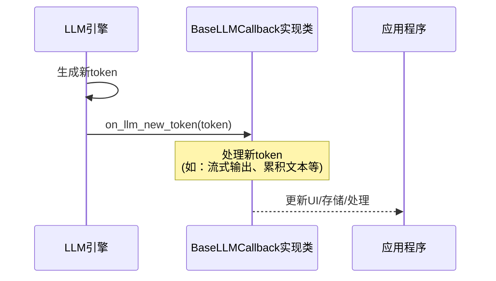

# `graphrag\packages\graphrag\graphrag\callbacks\llm_callbacks.py` 详细设计文档

定义了一个用于LLM回调的协议基类BaseLLMCallback，提供了处理新生成的token的on_llm_new_token方法接口，用于在语言模型生成输出时实时获取和处理token流。

## 整体流程

```mermaid
graph TD
    A[开始] --> B[定义BaseLLMCallback Protocol]
B --> C[定义on_llm_new_token方法签名]
C --> D[返回None (Protocol方法不需要实现)]
```

## 类结构

```
BaseLLMCallback (Protocol)
└── on_llm_new_token(token: str) -> None
```

## 全局变量及字段


    

## 全局函数及方法


### `BaseLLMCallback.on_llm_new_token`

处理当大语言模型（LLM）生成新令牌（token）时的回调方法。该方法作为协议接口定义，由具体实现类提供实际功能，用于在流式响应场景中实时处理LLM输出的每个新令牌。

参数：

- `token`：`str`，表示 LLM 新生成的令牌内容

返回值：`None`，无返回值

#### 流程图



#### 带注释源码

```python
# 定义协议基类，用于LLM回调处理
class BaseLLMCallback(Protocol):
    """Base class for LLM callbacks."""

    def on_llm_new_token(self, token: str):
        """Handle when a new token is generated."""
        # 参数 token: str - 新生成的令牌内容
        # 返回值: None - 此方法为回调接口，不返回任何值
        # 实际逻辑由实现类定义，可能包括：
        # - 流式输出到终端/UI
        # - 累积文本用于后续处理
        # - 实时日志记录等
        ...
```

## 关键组件


### BaseLLMCallback

基础协议类，定义了LLM回调的接口规范，用于处理大语言模型生成过程中的事件。

### on_llm_new_token

回调方法，当LLM生成新token时被调用，用于流式输出处理。


## 问题及建议


### 已知问题

-   **功能不完整**: 该 Protocol 仅定义了 `on_llm_new_token` 方法，但完整的 LLM 回调通常需要更多生命周期方法，如 `on_llm_start`（开始生成）、`on_llm_end`（生成结束）、`on_llm_error`（发生错误）等
-   **缺少返回类型注解**: `on_llm_new_token` 方法没有声明返回类型，应显式声明返回 `None` 以提高类型安全性和代码可读性
-   **参数文档缺失**: `token` 参数缺少详细描述，未说明其编码格式、是否包含空格等信息
-   **不支持异步场景**: 随着大语言模型流式输出的普及，未提供异步版本的回调接口定义
-   **设计模式选择待商榷**: 使用 `Protocol` 定义接口，但对于需要提供默认实现的场景，`ABC`（抽象基类）可能更为合适

### 优化建议

-   扩展 Protocol 方法集，添加完整的 LLM 生命周期回调方法：
  - `on_llm_start` - LLM 开始处理请求时调用
  - `on_llm_end` - LLM 完成处理时调用
  - `on_llm_error` - LLM 处理出错时调用
  - `on_llm_chunk` - 可选的块级别回调（如果 token 是按批次返回的）
-   为所有方法添加显式的返回类型注解 `-> None`
-   为 `token` 参数添加详细的文档字符串，说明其内容和格式
-   考虑提供异步版本 `BaseLLMCallbackAsync` Protocol，以支持 `async` 流式输出场景
-   根据实际需求评估是否需要从 `Protocol` 切换到 `ABC`，以便提供默认的空实现
-   添加类的版本信息和变更日志注释


## 其它


### 设计目标与约束

本模块的设计目标是定义一个统一的LLM回调协议接口，用于在LLM生成token的过程中提供灵活的扩展点。该协议采用Python Protocol的方式定义，允许任何实现类通过类型提示的方式被识别和调用。设计约束包括：只定义方法签名而不实现具体逻辑，保持接口的简洁性和通用性；使用Protocol而非ABC以提供更好的运行时duck typing支持；方法设计为同步方法，不支持异步操作。

### 错误处理与异常设计

当前协议定义不涉及具体的错误处理机制，因为BaseLLMCallback是一个Protocol而非具体实现类。实现类在重写方法时应考虑以下异常处理策略：on_llm_new_token方法中如果发生异常应该记录日志而非抛出，以避免中断LLM的生成过程；建议实现类添加try-except块捕获可能的异常，并进行适当的错误记录；可以定义自定义异常类如CallbackError用于回调相关的错误场景。

### 数据流与状态机

该模块本身不涉及复杂的状态机设计，其数据流相对简单：LLM生成器产生token → 调用回调的on_llm_new_token方法 → token被传递给所有注册的回调实现 → 回调处理token（如流式输出、存储等）。虽然当前版本没有状态管理的需求，但未来可以扩展为支持回调链（多个回调顺序执行）、状态保存与恢复等高级功能。

### 外部依赖与接口契约

该模块的外部依赖非常 minimal，主要依赖Python标准库中的typing模块。Protocol类来自Python 3.8+的typing模块。接口契约方面：实现类必须实现on_llm_new_token方法；该方法接受一个字符串类型的token参数；方法返回值为None（基于当前定义）。使用者应确保传入的token参数是有效的字符串类型。

### 性能考虑

当前设计对性能的影响极小，因为：Protocol在运行时开销很低，只是类型检查时不进行实例化；回调方法设计简单，通常只是简单的字符串处理。如果需要优化，可以考虑：避免在回调中执行耗时操作；对于大量token的场景，可以考虑批量回调而非逐个回调。

### 安全性考虑

当前模块没有涉及敏感数据的处理，但实现类在实现回调时应当注意：不要在回调中记录敏感信息如完整的LLM响应；如果是处理用户输入生成的token，需要进行适当的输入验证；多线程环境下使用回调时需要考虑线程安全性。

### 兼容性考虑

该模块使用Python 3.8+的Protocol特性，确保了与Python 3.8及以上版本的兼容性。由于Protocol是结构化子类型检查而非名义子类型检查，任何具有on_llm_new_token方法的类都会被识别为实现了该协议，这提供了极大的实现灵活性。

### 使用示例

```python
class PrintCallback:
    def on_llm_new_token(self, token: str):
        print(token, end="", flush=True)

class StorageCallback:
    def __init__(self):
        self.tokens = []
    
    def on_llm_new_token(self, token: str):
        self.tokens.append(token)
    
    def get_full_response(self) -> str:
        return "".join(self.tokens)

# 使用示例
callback = PrintCallback()
callback.on_llm_new_token("Hello")
```

### 扩展性设计

当前协议可以通过以下方式进行扩展：添加更多的回调方法如on_llm_start、on_llm_end、on_llm_error等；为Protocol添加泛型支持以处理不同类型的token；可以设计回调管理器类来管理多个回调的注册和调用顺序；支持优先级机制来控制回调的执行顺序。

### 测试策略

由于这是Protocol定义而非具体实现，测试重点应放在：验证Protocol的类型检查正确性；测试实现了该Protocol的类是否可以被正确识别；测试各种实现类的功能正确性；测试多个回调的组合使用场景。

### 配置说明

当前模块不需要任何配置。未来扩展时可以添加：回调启用/禁用的开关配置；回调执行顺序的优先级配置；回调超时设置等。

### 潜在的技术债务或优化空间

1. **缺乏异步支持**：当前只支持同步回调，对于高并发场景可能需要异步版本
2. **缺少更多回调点**：目前只有on_llm_new_token，缺少LLM开始、结束、错误等回调
3. **没有回调管理器**：缺少统一管理多个回调的机制
4. **文档完善**：需要补充更详细的使用文档和最佳实践
5. **类型注解完善**：可以考虑添加返回类型注解，如`-> None`
6. **扩展协议**：可以考虑添加泛型支持以适配不同类型的LLM

    