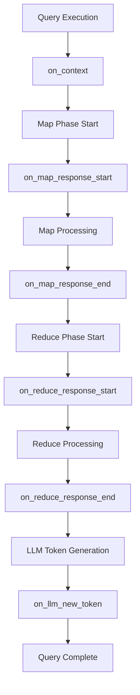
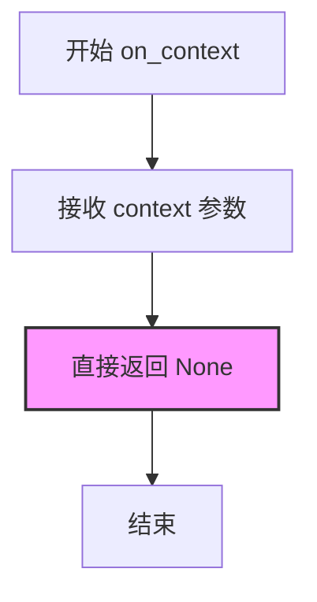
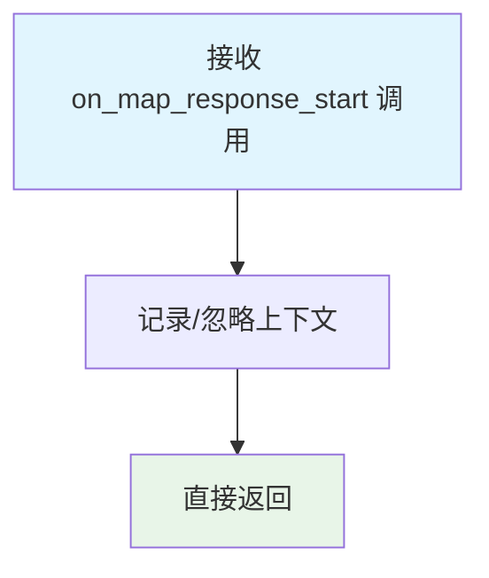
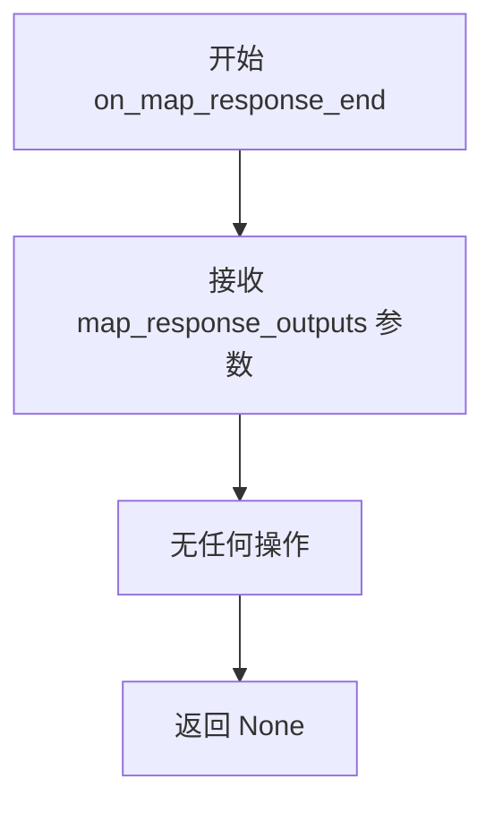
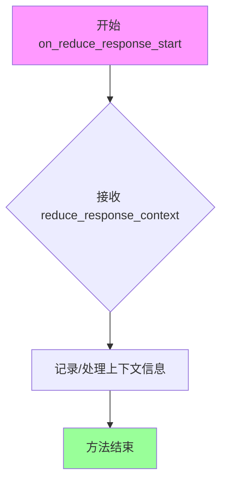
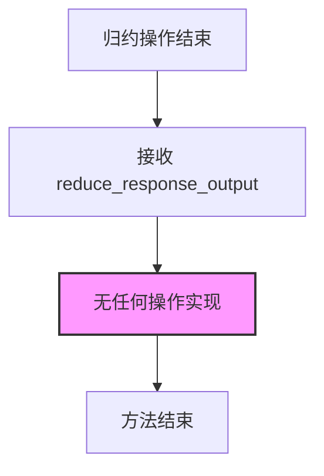
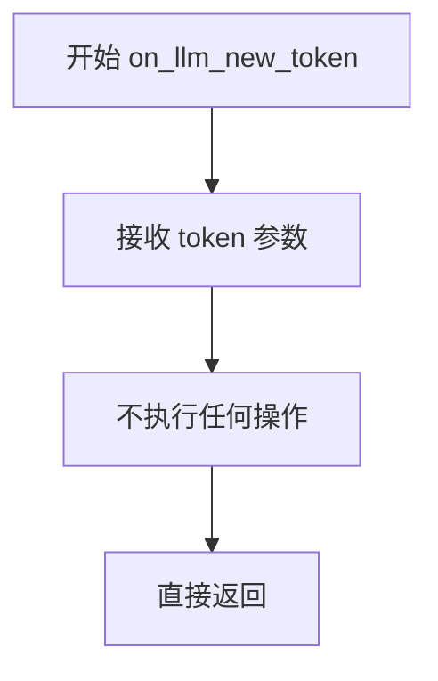

# `graphrag\packages\graphrag\graphrag\callbacks\noop_query_callbacks.py` 详细设计文档

这是一个No-op（无操作）查询回调实现类，继承自QueryCallbacks基类，提供了查询过程中各个阶段的空回调方法，用于在不需要实际回调处理时作为占位符或默认实现。

## 整体流程



## 类结构

```
QueryCallbacks (抽象基类)
└── NoopQueryCallbacks
```

## 全局变量及字段


    

## 全局函数及方法


### NoopQueryCallbacks.on_context

处理上下文数据构建时的回调方法（No-op 空实现），该方法不执行任何操作，仅作为 QueryCallbacks 接口的空实现。

参数：

- `context`：`Any`，待处理的上下文数据

返回值：`None`，无返回值

#### 流程图



#### 带注释源码

```python
def on_context(self, context: Any) -> None:
    """Handle when context data is constructed."""
    # No-op implementation: 不执行任何操作
    # 参数 context: 上下文数据，当前未被使用
    # 返回值: None
    pass  # 空实现，仅作为接口占位符
```


### `NoopQueryCallbacks.on_map_response_start`

处理 Map 操作开始的回调方法（No-op 实现，不执行任何实际操作）。

参数：

- `self`：`NoopQueryCallbacks`，类的实例本身
- `map_response_contexts`：`list[str]`，包含 Map 操作上下文字符串的列表

返回值：`None`，无返回值

#### 流程图



#### 带注释源码

```python
def on_map_response_start(self, map_response_contexts: list[str]) -> None:
    """Handle the start of map operation.
    
    这是一个 No-op（无操作）实现，用于处理 Map 阶段开始的回调事件。
    当 Map 操作开始时，框架会调用此方法，但本实现不执行任何实际操作。
    
    Args:
        map_response_contexts: 包含 Map 操作上下文字符串的列表。
                              在 No-op 实现中此参数被忽略。
    
    Returns:
        None: 此方法不返回任何值。
    
    Note:
        该方法的存在是为了满足 QueryCallbacks 接口契约，
        允许调用者在不关心此事件时使用 NoopQueryCallbacks 作为默认实现。
    """
```


### NoopQueryCallbacks.on_map_response_end

处理 map 操作结束时的回调方法，当前为无操作实现。

参数：

- `map_response_outputs`：`list[SearchResult]`，map 操作的输出结果列表

返回值：`None`，无返回值（空操作实现）

#### 流程图



#### 带注释源码

```python
def on_map_response_end(self, map_response_outputs: list[SearchResult]) -> None:
    """Handle the end of map operation."""
    # No-op implementation: 该方法不执行任何操作
    # 参数 map_response_outputs 被接收但未被使用
    # 返回值为 None
```


### NoopQueryCallbacks.on_reduce_response_start

处理reduce操作开始的回调方法，当开始执行reduce操作时调用，用于通知回调处理程序reduce阶段的上下文已准备就绪。

参数：

- `self`：NoopQueryCallbacks，类的实例自身
- `reduce_response_context`：str | dict[str, Any]，reduce操作的上下文数据，可以是字符串形式或字典形式的上下文信息

返回值：`None`，该方法为void方法，不返回任何值

#### 流程图



#### 带注释源码

```python
def on_reduce_response_start(
    self, reduce_response_context: str | dict[str, Any]
) -> None:
    """Handle the start of reduce operation."""
    # 这是一个No-op（空操作）实现
    # 当reduce操作开始时，此方法被调用但不做任何实际处理
    # 
    # 参数说明：
    # - reduce_response_context: 可以是字符串或字典类型
    #   - str: 表示reduce操作的字符串上下文
    #   - dict[str, Any]: 表示包含键值对的字典形式上下文
    #
    # 返回值：None
    # 该方法继承自QueryCallbacks基类，此处提供空实现
    # 实际使用中可以通过继承此类并重写此方法来实现自定义逻辑
    pass
```


### NoopQueryCallbacks.on_reduce_response_end

处理归约操作结束时的回调方法，当归约阶段完成后被调用，用于处理最终的归约输出结果。

参数：

- `reduce_response_output`：`str`，表示归约操作的最终输出结果

返回值：`None`，该方法不返回任何值，仅作为回调钩子使用

#### 流程图



#### 带注释源码

```python
def on_reduce_response_end(self, reduce_response_output: str) -> None:
    """Handle the end of reduce operation."""
    
    # 参数：reduce_response_output - 归约操作的最终输出结果，类型为字符串
    
    # 返回值：None - 这是一个空操作（no-op）回调，不执行任何实际逻辑
    
    # 方法功能说明：
    # 这是一个空实现的回调方法，当归约阶段完成时被调用
    # 在基类 QueryCallbacks 中可能定义了具体的处理逻辑
    # 但 NoopQueryCallbacks 作为无操作实现，不执行任何处理
    
    pass  # 空方法体，不执行任何操作
```


### `NoopQueryCallbacks.on_llm_new_token`

处理 LLM 生成新 token 时的回调方法，该实现为无操作（no-op）版本，不执行任何实际逻辑，仅作为接口的空实现。

参数：

- `token`：未明确指定类型，根据方法签名推断为 `Any` 类型，表示 LLM 生成的新 token

返回值：`None`，无返回值

#### 流程图



#### 带注释源码

```python
def on_llm_new_token(self, token):
    """Handle when a new token is generated."""
    # No-op 实现：不执行任何操作
    # 参数 token 接收但未使用
    # 该方法为 QueryCallbacks 接口的空实现
    pass
```

## 关键组件


### NoopQueryCallbacks 类

无操作的查询回调实现类，继承自 QueryCallbacks 抽象基类，提供一系列查询过程中的钩子方法，但所有方法均为空实现，不执行任何实际操作。

### QueryCallbacks 抽象基类

查询回调的抽象基类，定义了查询过程中各种阶段的钩子接口，包括上下文构建、map/reduce 操作、LLM token 生成等事件的处理。

### on_context 方法

当上下文数据被构建时调用的回调方法，当前为空实现。

### on_map_response_start 方法

当 map 操作开始时调用的回调方法，接收待处理的上下文列表，当前为空实现。

### on_map_response_end 方法

当 map 操作完成时调用的回调方法，接收 map 操作的输出结果列表，当前为空实现。

### on_reduce_response_start 方法

当 reduce 操作开始时调用的回调方法，接收 reduce 操作的上下文信息，当前为空实现。

### on_reduce_response_end 方法

当 reduce 操作完成时调用的回调方法，接收 reduce 操作的输出结果，当前为空实现。

### on_llm_new_token 方法

当 LLM 生成新 token 时调用的回调方法，用于流式输出处理，当前为空实现。


## 问题及建议


### 已知问题

-   **缺少模块级文档字符串** - 文件开头缺少模块级别的 docstring，说明该模块的用途
-   **方法参数类型注解不完整** - `on_llm_new_token` 方法的 `token` 参数没有类型注解，违反了代码库的静态类型规范
-   **类型不一致** - `on_map_response_end` 方法接收 `list[SearchResult]` 类型，而类似的 `on_map_response_start` 接收 `list[str]` 类型，这种类型差异缺乏明确的文档说明
-   **空实现缺乏调试能力** - 所有回调方法都是空实现，当需要调试或验证回调是否被调用时，无法提供任何日志或追踪信息
-   **方法文档不一致** - 部分方法有详细描述（如 `on_context`），而 `on_llm_new_token` 的描述过于简洁，缺乏参数说明

### 优化建议

-   **添加模块级文档字符串** - 在文件开头添加模块说明，描述 NoopQueryCallbacks 的用途和使用场景
-   **完善类型注解** - 为 `on_llm_new_token` 方法的 `token` 参数添加适当的类型注解（如 `str` 或 `Any`）
-   **添加可选的调试模式** - 实现一个可选的调试参数，当启用时输出日志，便于追踪回调调用情况
-   **统一文档风格** - 为所有方法添加一致的参数说明文档，包括参数类型和返回值类型
-   **考虑添加基类默认实现** - 建议在父类 `QueryCallbacks` 中将所有方法设置为可选的默认实现，减少空实现类的必要性

## 其它


### 设计目标与约束

该类的设计目标是提供一个QueryCallbacks接口的空实现，用于在不需要实际回调处理的场景下作为占位符使用。设计约束包括：必须继承自QueryCallbacks抽象类，保持接口签名一致，不执行业务逻辑，仅作为接口的最小实现。

### 错误处理与异常设计

该类不涉及错误处理逻辑，因为所有方法均为空实现（pass），不会抛出任何异常。调用方应自行处理回调执行过程中可能出现的异常。

### 数据流与状态机

该类不维护任何状态，也不参与数据流处理。回调方法接收参数后直接返回，不改变任何内部或外部状态。

### 外部依赖与接口契约

该类依赖以下外部组件：
- `graphrag.callbacks.query_callbacks.QueryCallbacks`：抽象基类，定义回调接口契约
- `graphrag.query.structured_search.base.SearchResult`：类型注解，用于方法签名
- `typing.Any`：Python内置类型

接口契约要求实现类必须实现所有抽象方法，该类通过空实现满足此契约。

### 性能考虑

该类设计为极简实现，不涉及任何计算或IO操作，性能开销为零。适用于性能敏感场景下的无代价回调注入。

### 安全性考虑

该类不处理敏感数据，不涉及权限校验，不存在安全漏洞风险。

### 测试策略

建议为该类编写单元测试，验证：
- 类成功实例化
- 所有方法可调用且返回None
- 继承关系正确（isinstance检查）
- 方法签名与父类一致

### 使用示例

```python
# 在不需要实际回调处理时使用
callbacks = NoopQueryCallbacks()
callbacks.on_context(some_data)  # 无操作
callbacks.on_llm_new_token("token")  # 无操作
```

### 版本兼容性

- Python版本：需支持Python 3.10+（支持str | dict语法）
- 依赖包版本：需与graphrag主包版本保持一致

### 文档引用

该类是graphrag查询回调系统的一部分，与以下组件配合使用：
- QueryCallbacks基类定义
- 搜索结果处理流程
- LLM流式输出处理

    