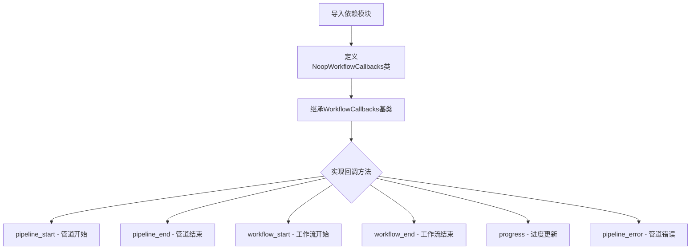
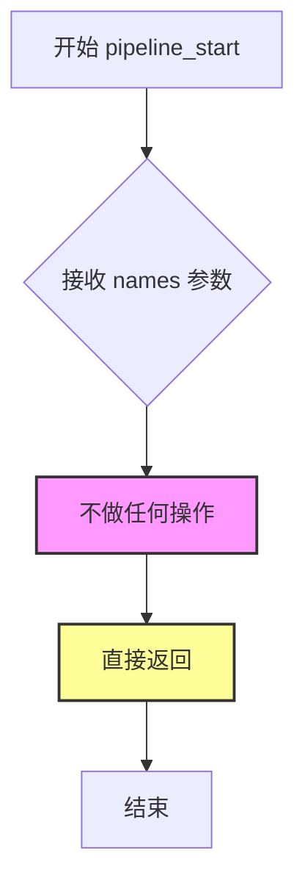
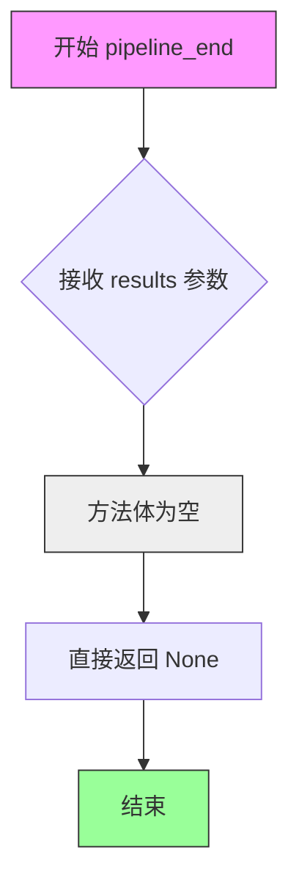
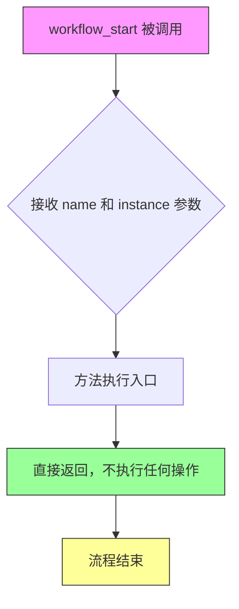
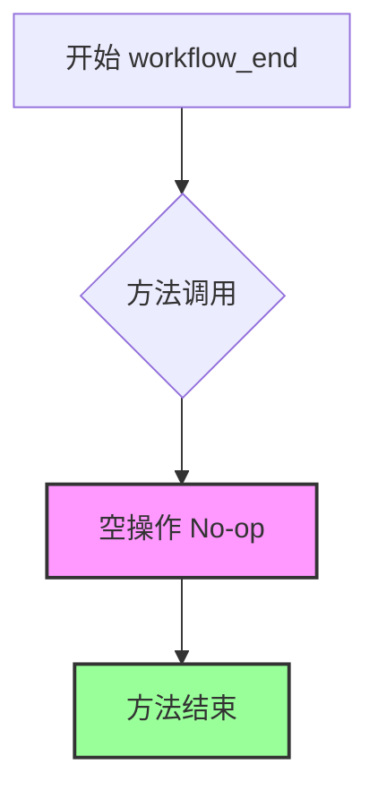
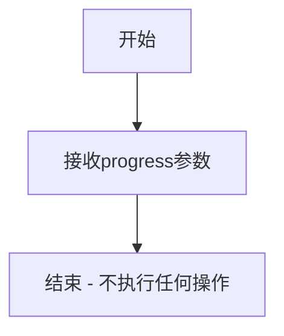
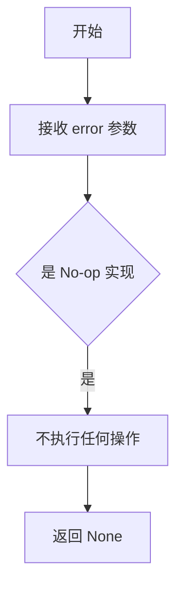

# `graphrag\packages\graphrag\graphrag\callbacks\noop_workflow_callbacks.py` 详细设计文档

这是一个无操作（no-op）实现的WorkflowCallbacks类，作为graphrag工作流回调系统的空实现，用于在不需要实际执行回调逻辑时作为placeholder，同时保持与WorkflowCallbacks接口的兼容性。

## 整体流程



## 类结构

```
WorkflowCallbacks (抽象基类/接口)
└── NoopWorkflowCallbacks (空实现类)
```

## 全局变量及字段


    

## 全局函数及方法


### NoopWorkflowCallbacks.pipeline_start

执行此回调以发出整个管道开始的信号。该方法是一个空操作（no-op）实现，不执行任何实际操作，仅作为回调接口的占位实现。

参数：

- `names`：`list[str]`，管道的名称列表

返回值：`None`，无返回值

#### 流程图



#### 带注释源码

```python
def pipeline_start(self, names: list[str]) -> None:
    """Execute this callback to signal when the entire pipeline starts.
    
    这是一个空操作（no-op）实现，不执行任何实际操作。
    在实际应用中，此方法可用于记录管道开始事件或初始化相关资源。
    
    参数:
        names: 管道名称列表，用于标识即将运行的管道
        
    返回:
        None: 此方法不返回任何值
    """
    # 空实现 - 不执行任何操作
    # 注释: 作为回调接口的占位符，保留接口契约的完整性
    pass
```


### `NoopWorkflowCallbacks.pipeline_end`

这是一个无操作（No-op）的工作流回调实现，用于在管道（pipeline）结束时被调用，但不执行任何实际操作，仅作为接口的空实现。

参数：

- `results`：`list[PipelineRunResult]` ，管道执行结束后的结果列表，包含了每个工作流的运行结果

返回值：`None` ，该方法不返回任何值

#### 流程图



#### 带注释源码

```python
def pipeline_end(self, results: list[PipelineRunResult]) -> None:
    """Execute this callback to signal when the entire pipeline ends.
    
    这是一个无操作（No-op）实现，当整个数据处理管道结束时被调用。
    该方法接收管道执行的结果列表，但不做任何处理，仅作为 WorkflowCallbacks
    接口的空实现存在，允许调用者在不执行任何逻辑的情况下订阅管道结束事件。
    
    参数:
        results: 包含所有工作流执行结果的列表，每个 PipelineRunResult 代表
                一个工作流的运行结果（可能包含输出文档、统计信息等）
                
    返回:
        None: 不返回任何值
    """
```


### `NoopWorkflowCallbacks.workflow_start`

该方法是一个空操作（no-op）的回调实现，当工作流开始时调用，但不执行任何实际逻辑，仅作为 `WorkflowCallbacks` 接口的空实现。

参数：

- `name`：`str`，工作流的名称，用于标识哪个工作流开始执行
- `instance`：`object`，工作流的实例对象，包含工作流的运行时状态和上下文

返回值：`None`，该方法不返回任何值

#### 流程图



#### 带注释源码

```python
def workflow_start(self, name: str, instance: object) -> None:
    """Execute this callback when a workflow starts.
    
    这是一个空操作（no-op）实现，不执行任何实际操作。
    该方法作为 WorkflowCallbacks 接口的默认实现，仅接收参数但不进行处理。
    
    Args:
        name: str - 工作流的名称，用于标识哪个工作流开始执行
        instance: object - 工作流的实例对象，包含工作流的运行时状态和上下文
        
    Returns:
        None - 该方法不返回任何值
        
    Note:
        此方法的设计遵循了观察者模式中的空对象模式（Null Object Pattern），
        提供了一个什么都不做的默认实现，允许调用者无需检查回调是否为 None。
    """
```


### `NoopWorkflowCallbacks.workflow_end`

执行此回调以信号通知工作流结束。

参数：

- `name`：`str`，工作流的名称
- `instance`：`object`，工作流的实例对象

返回值：`None`，无返回值描述

#### 流程图



#### 带注释源码

```python
def workflow_end(self, name: str, instance: object) -> None:
    """Execute this callback when a workflow ends."""
    # No-op implementation: 该方法为空实现，不执行任何操作
    # 当工作流结束时，框架会调用此回调，但此处不做任何处理
    # 目的：提供一个什么都不做的默认实现，用于不需要在工作流结束时执行任何操作的场景
    pass
```


### `NoopWorkflowCallbacks.progress`

处理工作流进度事件的回调方法，该方法为空实现，不执行任何实际操作，仅作为接口占位符。

参数：

- `progress`：`Progress`，进度对象，包含当前工作流的进度信息

返回值：`None`，无返回值描述

#### 流程图



#### 带注释源码

```python
def progress(self, progress: Progress) -> None:
    """Handle when progress occurs."""
    # 该方法为 No-operation (空操作) 实现
    # 不执行任何逻辑，仅作为 WorkflowCallbacks 接口的占位符
    # 参数 progress 被接收但未使用
    # 返回值为 None
```


### `NoopWorkflowCallbacks.pipeline_error`

当管道中发生错误时执行此回调。该方法是 `WorkflowCallbacks` 接口的空实现，不执行任何实际操作，仅作为回调接口的占位符实现。

参数：

-  `error`：`BaseException`，管道中发生的错误异常对象

返回值：`None`，无返回值

#### 流程图



#### 带注释源码

```python
def pipeline_error(self, error: BaseException) -> None:
    """Execute this callback when an error occurs in the pipeline."""
    # 这是一个空实现（No-op），不执行任何实际操作
    # 接收 BaseException 类型的错误参数
    # 该方法的存在是为了满足 WorkflowCallbacks 接口的契约
    # 实际的处理逻辑由其他实现了该接口的类完成
    pass
```

## 关键组件


### NoopWorkflowCallbacks

一个无操作（no-op）实现的工作流回调类，继承自 WorkflowCallbacks 接口，提供空方法体用于需要回调但无需实际执行的场景。

### pipeline_start

管道开始时的回调方法，目前为空实现，用于信号通知整个管道的启动。

### pipeline_end

管道结束时的回调方法，目前为空实现，接收管道运行结果列表用于信号通知整个管道的结束。

### workflow_start

工作流开始时的回调方法，目前为空实现，接收工作流名称和实例对象用于信号通知单个工作流的启动。

### workflow_end

工作流结束时的回调方法，目前为空实现，接收工作流名称和实例对象用于信号通知单个工作流的结束。

### progress

进度更新时的回调方法，目前为空实现，接收 Progress 对象用于处理管道执行过程中的进度更新事件。

### pipeline_error

管道错误时的回调方法，目前为空实现，接收 BaseException 异常对象用于处理管道执行过程中发生的错误。


## 问题及建议


### 已知问题

-   **文档与实现不一致**：类的docstring描述"A no-op implementation of WorkflowCallbacks that logs all events to standard logging"，但实际所有方法都是空实现，没有包含任何日志逻辑，存在误导性
-   **类型注解过于宽泛**：`workflow_start`和`workflow_end`方法中的`instance`参数类型为`object`，缺少具体类型约束，降低了类型安全性
-   **设计意图不明确**：无法判断这是一个占位符实现还是有实际用途的日志类，代码意图不清晰
-   **缺少配置灵活性**：如果需要记录日志，没有提供日志级别、格式或输出目标的配置选项

### 优化建议

-   **修正文档或实现**：如果确实是无操作实现，应将docstring修改为明确说明不执行任何操作；如果需要日志功能，应添加实际的日志记录代码
-   **使用具体类型**：将`instance: object`替换为更具体的类型，如`Workflow`或`BaseWorkflow`基类
-   **添加配置选项**：考虑添加构造函数参数以支持日志级别、格式等配置，提高类的实用性
-   **添加可选日志功能**：可以提供一个带日志的子类或在需要时通过参数启用日志功能

## 其它


### 设计目标与约束

设计目标：提供一个什么都不做的WorkflowCallbacks实现，用于在不需要实际回调处理时作为默认或占位符实现，避免调用方进行空值检查。

设计约束：
- 必须继承自WorkflowCallbacks抽象基类
- 必须实现所有抽象方法
- 方法体保持空实现（pass或直接return）
- 不能引入额外的外部依赖

### 错误处理与异常设计

该类本身不进行任何实际处理，因此不涉及错误处理。所有方法都是空实现，不会抛出异常。

继承自基类时需要遵循基类定义的异常规范，当基类方法声明可能抛出特定异常时，子类实现应保持空实现而不抛出异常。

### 数据流与状态机

数据流：
- 该类作为回调订阅者接收来自pipeline/workflow的事件通知
- 输入数据：pipeline_run_result列表、工作流名称和实例、Progress对象、异常对象
- 输出数据：无（空实现）

状态机：
- 不维护任何状态
- 不参与状态转换
- 仅作为接口的空实现存在

### 外部依赖与接口契约

外部依赖：
- graphrag.callbacks.workflow_callbacks.WorkflowCallbacks：基类，定义回调接口契约
- graphrag.index.typing.pipeline_run_result.PipelineRunResult：类型注解依赖
- graphrag.logger.progress.Progress：类型注解依赖

接口契约：
- 必须实现WorkflowCallbacks基类定义的所有抽象方法
- 方法签名必须与基类完全一致
- 不改变基类定义的方法行为语义

### 性能考虑

由于是空实现，性能开销极低：
- 方法执行时间可忽略不计
- 不分配额外内存
- 不进行任何I/O操作
- 可作为性能基准对比的对照组

### 安全性考虑

安全性风险：低
- 不涉及敏感数据处理
- 不进行网络通信
- 不访问文件系统
- 不执行用户输入验证

### 可测试性

测试策略：
- 单元测试：验证所有方法可以被调用而不抛出异常
- 集成测试：验证该实现可以作为有效的回调提供者传递给需要WorkflowCallbacks的组件
- 继承测试：验证所有基类抽象方法都被正确实现

### 配置管理

配置需求：无
- 该类不读取任何配置文件
- 不使用环境变量
- 不提供配置选项
- 作为静态实现存在

### 版本兼容性

Python版本要求：遵循graphrag项目的Python版本要求（通常为3.8+）

API稳定性：
- 该类为稳定的公共API的一部分
- 继承关系和接口签名在版本间应保持兼容
- 基类WorkflowCallbacks的任何变更都应向后兼容

### 使用示例

```python
# 作为默认回调提供者
callbacks = NoopWorkflowCallbacks()
pipeline.run(callbacks=callbacks)

# 在不需要实际日志记录时使用
config = PipelineConfig(callbacks=NoopWorkflowCallbacks())
```

    