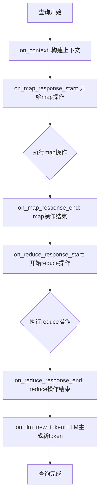
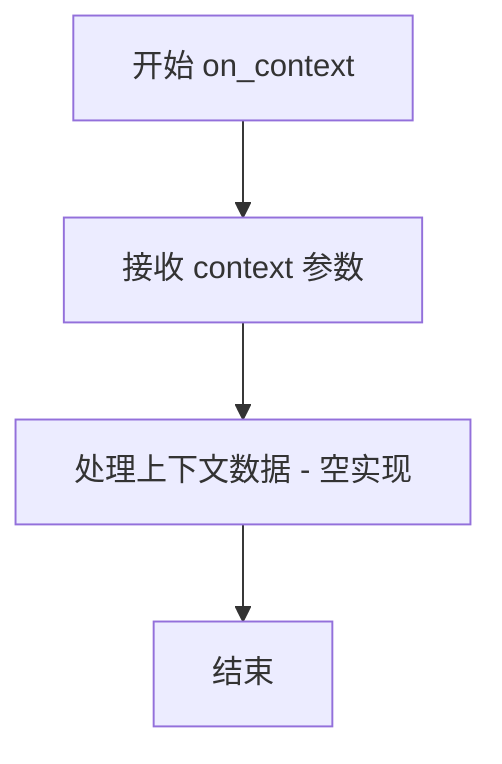
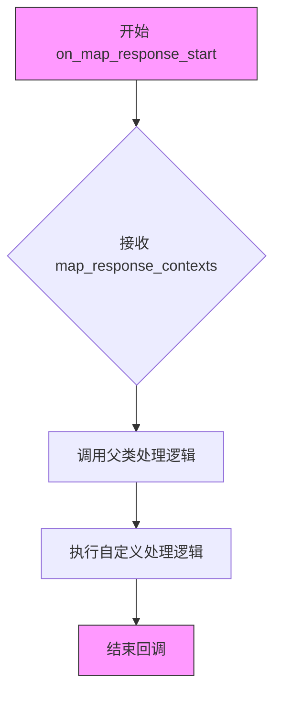
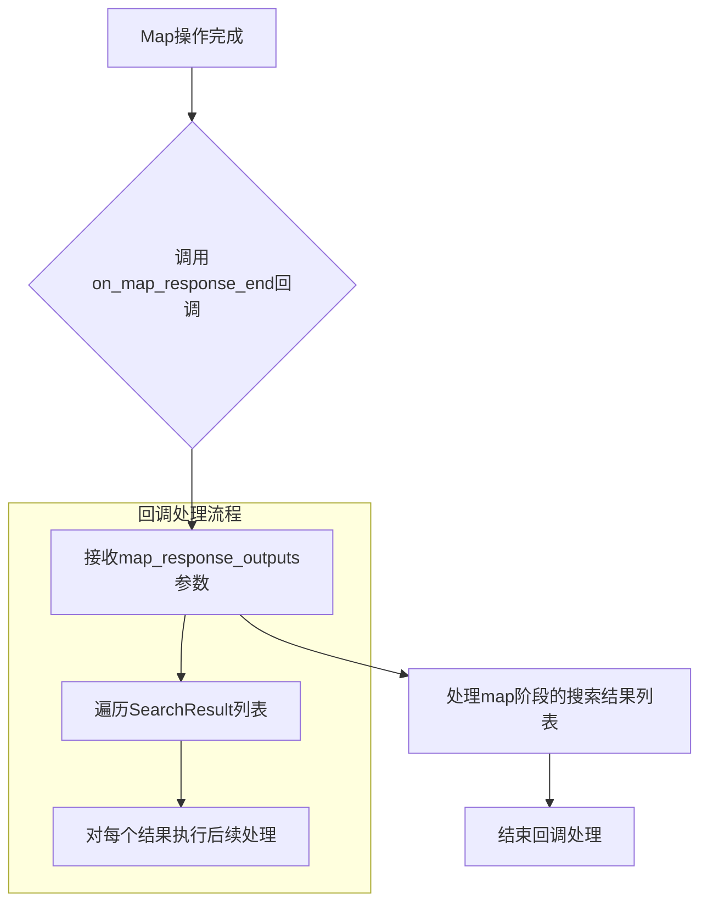
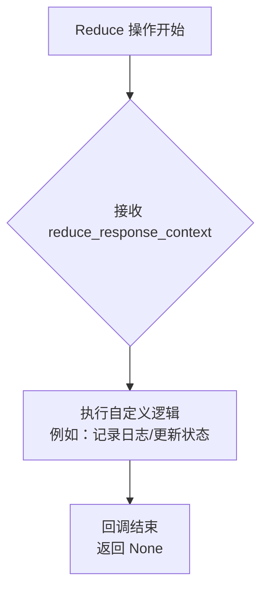
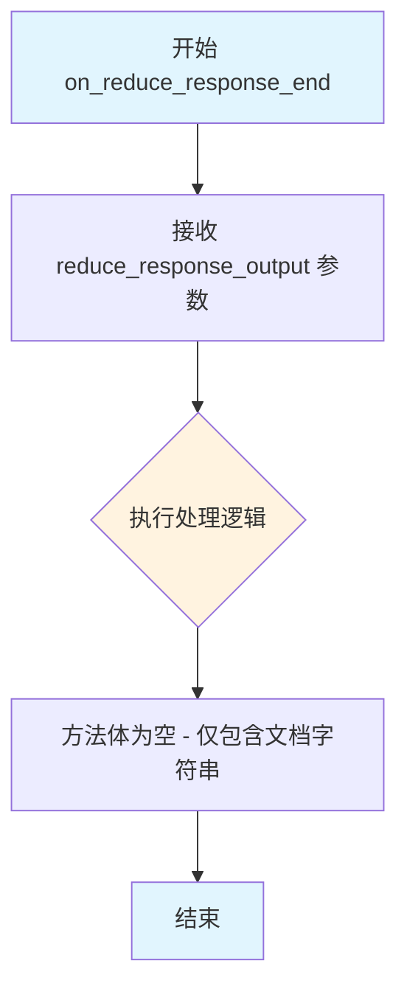
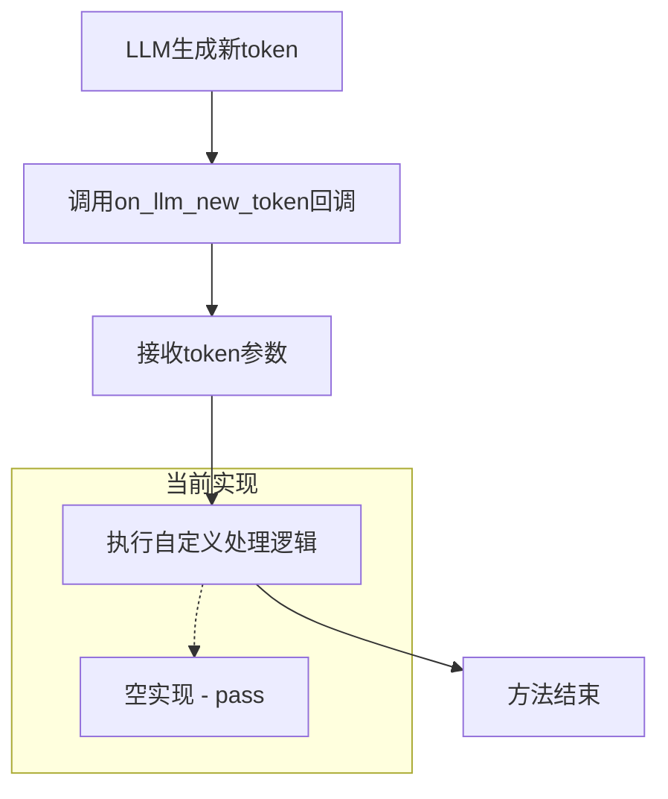

# `graphrag\packages\graphrag\graphrag\callbacks\query_callbacks.py` 详细设计文档

这是一个查询回调模块，定义了QueryCallbacks类，继承自BaseLLMCallback，用于在图检索问答系统的查询执行过程中提供多个钩子函数，涵盖上下文构建、map操作、reduce操作和LLM新token生成等阶段的回调处理。

## 整体流程



## 类结构

```
BaseLLMCallback (抽象基类 - 来自 graphrag.callbacks.llm_callbacks)
└── QueryCallbacks (查询回调实现类)
```

## 全局变量及字段


    

## 全局函数及方法


### `QueryCallbacks.on_context`

处理上下文数据构建完成时的回调方法。

参数：

- `context`：`Any`，在查询执行过程中构建的上下文数据

返回值：`None`，该回调方法不返回任何值

#### 流程图



#### 带注释源码

```python
def on_context(self, context: Any) -> None:
    """Handle when context data is constructed."""
    # 该方法为回调函数，在查询执行过程中当上下文数据被构建完成后调用
    # 当前实现为空方法，供子类重写以实现自定义上下文处理逻辑
    # 参数 context: 包含构建好的上下文数据，类型为 Any，可接受任意类型
    # 返回值: 无返回值
```


### QueryCallbacks.on_map_response_start

处理地图操作开始时的回调方法，用于在MapReduce查询过程中map阶段开始时接收和处理上下文数据。

参数：

- `map_response_contexts`：`list[str]`，地图操作开始时传入的上下文字符串列表，通常包含多个文档或数据块的上下文信息

返回值：`None`，无返回值，仅作为钩子函数用于处理传入的上下文数据

#### 流程图



#### 带注释源码

```python
def on_map_response_start(self, map_response_contexts: list[str]) -> None:
    """Handle the start of map operation.
    
    在MapReduce查询的map阶段开始时调用的回调函数。
    用于接收和处理即将进行map操作的上下文数据列表。
    
    Args:
        map_response_contexts: 包含多个上下文字符串的列表，
                              每个字符串代表一个文档块或数据单元的上下文
    
    Returns:
        None: 此回调不返回任何值，仅作为钩子用于监控或处理
    """
    
    # 方法体为空，仅定义了接口
    # 实际处理逻辑由子类重写实现
    # 这是一个扩展点，允许在查询执行过程中插入自定义逻辑
    pass
```


### QueryCallbacks.on_map_response_end

处理map操作结束时的回调，用于接收map阶段的搜索结果。

参数：

- `map_response_outputs`：`list[SearchResult]`，map阶段的输出结果列表，每个元素包含搜索结果数据

返回值：`None`，该方法为回调函数，不返回任何值

#### 流程图



#### 带注释源码

```python
def on_map_response_end(self, map_response_outputs: list[SearchResult]) -> None:
    """Handle the end of map operation.
    
    此回调方法在map阶段的搜索操作完成后被调用。
    用于接收和处理map阶段产生的搜索结果列表。
    
    Args:
        map_response_outputs: map阶段的输出结果列表，
                             包含SearchResult对象的列表，
                             每个结果代表一个文档或数据源的搜索结果
    
    Returns:
        None: 此方法为回调函数，不返回任何值
    """
    # 方法体为空，仅作为回调接口定义
    # 实际业务逻辑由子类重写实现
    pass
```


### `QueryCallbacks.on_reduce_response_start`

该方法用于处理 Reduce 操作开始时的回调，当 reduce 阶段的响应上下文开始构建时被调用，允许调用方在 reduce 操作启动时执行自定义逻辑或记录状态。

参数：

- `reduce_response_context`：`str | dict[str, Any]`，Reduce 操作开始时的上下文数据，可以是字符串形式的上下文或包含任意键值对的字典类型

返回值：`None`，该方法没有返回值，仅作为回调钩子使用

#### 流程图



#### 带注释源码

```python
def on_reduce_response_start(
    self, reduce_response_context: str | dict[str, Any]
) -> None:
    """Handle the start of reduce operation.
    
    在 reduce 操作开始时被调用的回调方法。
    该方法接收 reduce 阶段的上下文数据，允许在执行 reduce 操作之前
    执行预处理、验证或记录等操作。
    
    参数:
        reduce_response_context: 可以是字符串形式的上下文信息，
                                也可以是包含任意键值对的字典，
                                例如可能包含中间结果、提示词模板等
    
    返回值:
        无返回值
    """
```


### `QueryCallbacks.on_reduce_response_end`

处理reduce操作结束时的回调方法，当reduce操作完成后被调用，接收reduce操作的字符串输出结果。

参数：

- `reduce_response_output`：`str`，reduce操作的输出结果，为字符串类型

返回值：`None`，该方法没有返回值

#### 流程图



#### 带注释源码

```python
def on_reduce_response_end(self, reduce_response_output: str) -> None:
    """Handle the end of reduce operation.
    
    该方法在reduce操作完成时被调用，作为回调函数接收reduce阶段的最终输出结果。
    当前实现为空方法（pass），仅定义了接口规范，供子类扩展实现具体的处理逻辑。
    
    参数:
        reduce_response_output: str - reduce操作的输出结果，通常为最终生成的回答文本
        
    返回值:
        None - 该方法不返回任何值
    """
    pass  # 当前为空实现，等待子类重写以实现具体的回调逻辑
```


### QueryCallbacks.on_llm_new_token

处理LLM生成新token时的回调方法，用于在查询执行过程中实时处理LLM输出的每个token。该方法在流式响应场景下会被调用，允许调用方实时获取LLM生成的token，实现进度展示或流式输出等功能。

参数：

- `token`：`Any`，新生成的token内容

返回值：`None`，无返回值

#### 流程图



#### 带注释源码

```python
def on_llm_new_token(self, token) -> None:
    """Handle when a new token is generated.
    
    在LLM生成新token时调用的回调函数。
    
    Args:
        token: LLM新生成的token内容，可以是字符串或其他类型
        
    Returns:
        None: 该方法不返回任何值
        
    Note:
        - 该方法是流式响应处理的关键钩子
        - 当前实现为空方法（pass），需要根据具体业务需求实现
        - 在实际应用中，可以用于：
          * 实时展示LLM输出进度
          * 流式传输token到客户端
          * 累计拼接完整响应
          * 实现打字机效果
    """
    # 空实现，待业务方继承并实现具体逻辑
    pass
```

#### 补充说明

| 项目 | 详情 |
|------|------|
| **所属类** | QueryCallbacks |
| **父类** | BaseLLMCallback |
| **方法签名** | `def on_llm_new_token(self, token) -> None` |
| **访问权限** | 公开（public） |
| **是否为抽象方法** | 否（可覆盖） |
| **当前实现状态** | 空实现（仅包含pass语句） |

#### 潜在优化空间

1. **空实现问题**：该方法当前为空的`pass`实现，虽然作为回调接口预留是合理的，但缺少默认的流式输出逻辑
2. **类型标注缺失**：参数`token`缺少类型注解，建议补充为`str`类型以提高代码可读性和类型安全
3. **文档完善**：可以增加更多使用示例和场景说明

#### 使用场景示例

```python
# 继承并实现自定义逻辑的示例
class StreamingQueryCallbacks(QueryCallbacks):
    def __init__(self):
        self.accumulated_response = ""
    
    def on_llm_new_token(self, token: str) -> None:
        """实现流式输出累积"""
        self.accumulated_response += token
        print(token, end="", flush=True)  # 实时打印
```

## 关键组件


### QueryCallbacks 类

继承自 BaseLLMCallback 的回调类，用于在查询执行过程中提供钩子点，允许在不同的查询阶段插入自定义逻辑。

### on_context 方法

在构建上下文数据时调用，用于处理查询上下文的回调方法。

### on_map_response_start 方法

在 map 操作开始时调用，接收一个字符串列表作为 map 操作的上下文输入。

### on_map_response_end 方法

在 map 操作结束时调用，接收 SearchResult 对象列表作为 map 操作的输出结果。

### on_reduce_response_start 方法

在 reduce 操作开始时调用，接收字符串或字典类型的 reduce 操作上下文输入。

### on_reduce_response_end 方法

在 reduce 操作结束时调用，接收字符串类型的 reduce 操作输出结果。

### on_llm_new_token 方法

在生成新 token 时调用，用于处理流式输出的回调方法。

### SearchResult 类型

表示搜索操作的返回结果，包含查询响应和相关元数据。

### BaseLLMCallback 抽象基类

定义了 LLM 回调的接口规范，QueryCallbacks 继承该类并实现了具体的回调方法。


## 问题及建议


### 已知问题

-   **空实现问题**：所有回调方法（`on_context`、`on_map_response_start`、`on_map_response_end`、`on_reduce_response_start`、`on_reduce_response_end`、`on_llm_new_token`）都是空实现，仅包含文档字符串而没有任何功能代码，导致回调机制形同虚设。
-   **类型注解不完整**：`on_llm_new_token` 方法的 `token` 参数缺少类型注解，无法提供类型安全保证。
-   **返回值类型不一致**：`on_reduce_response_end` 方法接收 `reduce_response_output: str` 参数，但方法名暗示应该处理某种结构化输出，与 `on_map_response_end` 返回 `SearchResult` 对象的设计不一致。
-   **文档字符串过于简略**：每个方法的文档字符串仅有一句话描述，未说明回调的触发时机、调用频率、上下文内容结构等关键信息。
-   **缺乏错误处理**：空实现方法无法处理异常情况，若调用方传入异常数据可能导致未知错误。
-   **未考虑异步场景**：在现代LLM应用中，回调常用于流式输出场景，当前设计未考虑异步支持。

### 优化建议

-   **提供默认实现或设计模式**：为每个回调方法提供合理的默认行为（如空操作、记录日志、抛出特定异常），或明确这是一个抽象基类需要子类实现。
-   **完善类型注解**：为 `token` 参数添加类型（如 `str` 或 `Any`），统一 `on_reduce_response_end` 的输入类型设计。
-   **增强文档字符串**：详细描述每个回调方法的调用时机、参数结构、预期行为及使用场景。
-   **添加日志或事件机制**：在空实现中加入日志记录，便于调试和监控回调触发情况。
-   **考虑异步支持**：如果需要支持流式输出，可添加异步版本的回调方法（如 `async on_llm_new_token`）。
-   **统一接口设计**：重新审视 `on_reduce_response_end` 的设计，确保与 map 端输出的 `SearchResult` 保持一致性。

## 其它


### 设计目标与约束

设计目标：为查询执行过程提供灵活的钩子机制，允许外部代码在查询的不同阶段插入自定义逻辑，如日志记录、监控、性能追踪等。约束：回调方法应为同步调用，不应阻塞主查询流程；子类必须实现所有抽象方法。

### 错误处理与异常设计

回调方法中的异常应在内部捕获并记录，不应向上传播以免中断主查询流程。建议在子类实现中添加try-except块处理可能出现的异常情况。BaseLLMCallback基类应定义默认的空实现以降低实现负担。

### 数据流与状态机

查询执行遵循map-reduce模式：map阶段处理多个上下文片段（on_map_response_start/on_map_response_end），reduce阶段合并结果（on_reduce_response_start/on_reduce_response_end）。上下文数据通过on_context传递，LLM生成的token通过on_llm_new_token实时传递。

### 外部依赖与接口契约

依赖：graphrag.callbacks.llm_callbacks.BaseLLMCallback、graphrag.query.structured_search.base.SearchResult。接口契约：所有回调方法返回None（void），接收特定类型的参数。SearchResult类型来自graphrag.query.structured_search.base模块。

### 性能考虑

回调实现应保持轻量，避免耗时操作。当前设计为同步调用，如需异步处理可考虑在子类中使用线程池或异步机制。避免在回调中进行阻塞式IO操作。

### 线程安全/并发考虑

如在多线程环境中使用，需确保回调实现是线程安全的。共享状态的访问应使用锁保护。建议在文档中明确说明线程安全要求。

### 配置管理

回调行为可通过子类扩展实现配置化。配置项可通过构造函数传入，如日志级别、监控开关等。

### 版本兼容性

当前代码未标注废弃标记，应保持向后兼容。如需更改回调签名，应先在基类中添加新方法而非修改现有方法。

### 测试策略

建议为每个回调方法编写单元测试，验证参数传递和异常处理。使用mock对象模拟SearchResult等依赖类型。集成测试应验证回调在实际查询流程中的执行顺序。

### 使用示例

```python
class LoggingQueryCallbacks(QueryCallbacks):
    def on_context(self, context):
        print(f"Context built: {len(context)} items")
    
    def on_map_response_end(self, map_response_outputs):
        print(f"Map completed: {len(map_response_outputs)} outputs")
```

### 常见用例场景

1. 查询执行过程的可观测性监控 2. 实时流式输出的前端推送 3. 查询性能的profiling分析 4. 查询结果的缓存策略触发 5. 多模态查询的中间状态记录

    