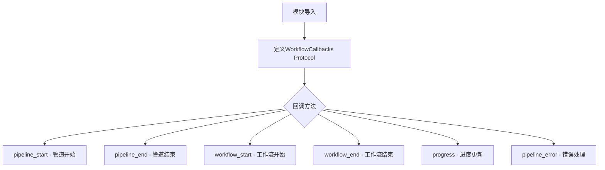
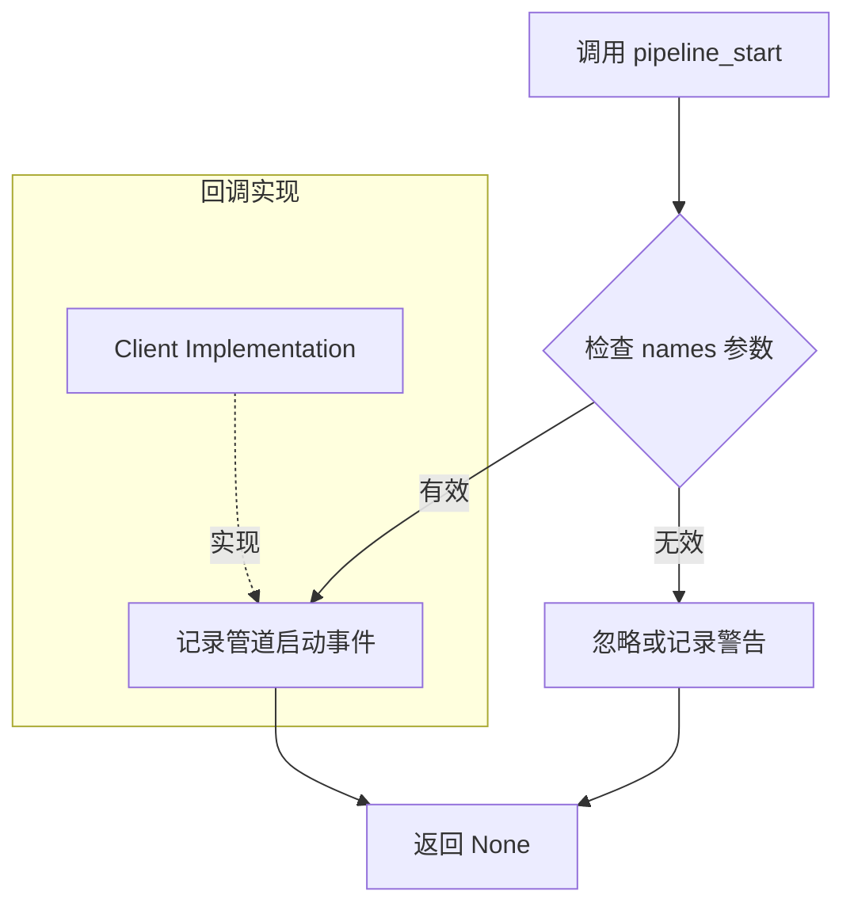
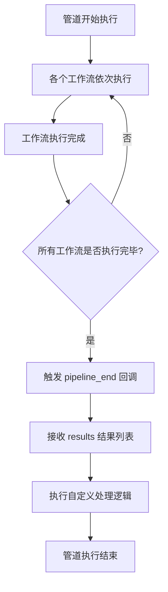
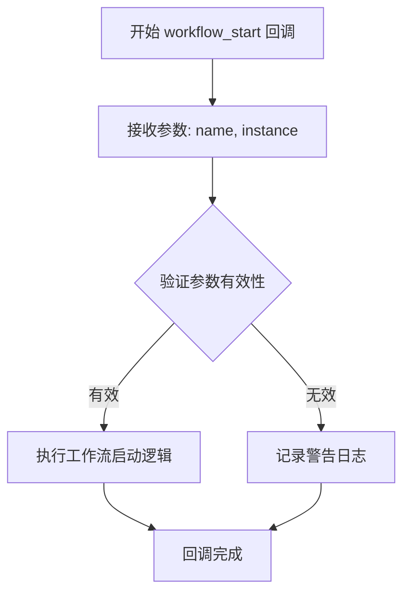
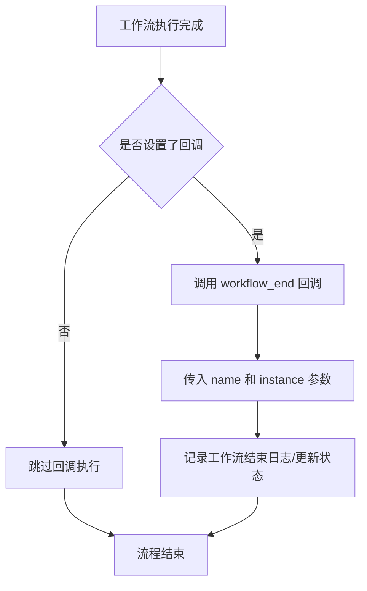
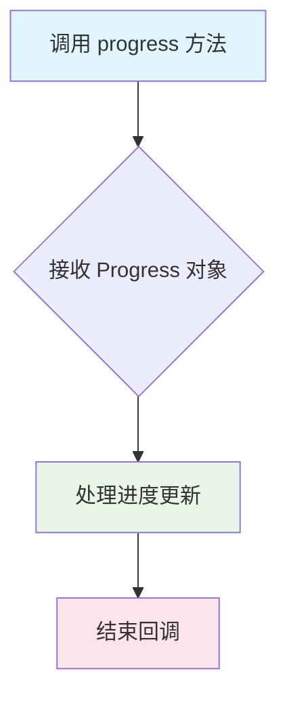
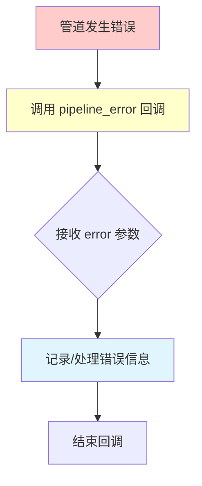

# `graphrag\packages\graphrag\graphrag\callbacks\workflow_callbacks.py` 详细设计文档

定义了一个Protocol类WorkflowCallbacks，用于监控工作流执行的回调集合。该类作为基类（noop实现），允许客户端仅实现所需的回调方法，包括管道开始、管道结束、工作流开始、工作流结束、进度更新和错误处理等事件。

## 整体流程



## 类结构

```
WorkflowCallbacks (Protocol)
├── pipeline_start()
├── pipeline_end()
├── workflow_start()
├── workflow_end()
├── progress()
└── pipeline_error()
```

## 全局变量及字段


    

## 全局函数及方法


### `WorkflowCallbacks.pipeline_start`

执行此回调以信号整个管道开始执行。当整个数据处理管道启动时，会调用此方法，传入将要执行的管道名称列表，以便监控或记录管道的启动状态。

参数：

- `names`：`list[str]`，管道名称列表，指定将要执行的各个管道的名称

返回值：`None`，无返回值，仅作为信号回调使用

#### 流程图



#### 带注释源码

```python
def pipeline_start(self, names: list[str]) -> None:
    """
    执行此回调以信号整个管道开始。
    
    当整个数据处理管道启动时，此方法会被调用。
    传入的参数 names 是一个字符串列表，包含了所有将要执行的管道的名称。
    这个回调可以用于：
    - 记录开始时间
    - 初始化监控指标
    - 通知外部系统管道已启动
    - 准备日志记录器
    
    参数:
        names: list[str] - 管道名称列表，指定将要执行的各个管道的名称
        
    返回:
        None - 此方法仅作为信号使用，不返回任何值
        
    示例:
        # 在某个启动点调用此回调
        callbacks = WorkflowCallbacks()
        callbacks.pipeline_start(["extract", "graph", "summarize"])
    """
    ...  # 空实现，由具体实现类override
```


### `WorkflowCallbacks.pipeline_end`

该方法是一个回调函数接口，用于在整个人工智能管道（pipeline）执行完成后被调用，接收并处理管道中各个工作流（workflow）的执行结果列表。

参数：

- `results`：`list[PipelineRunResult]`，包含管道中所有工作流的执行结果列表，每个元素代表一个工作流的运行结果

返回值：`None`，该回调方法不返回任何值，仅作为信号机制通知管道执行完毕

#### 流程图



#### 带注释源码

```python
def pipeline_end(self, results: list[PipelineRunResult]) -> None:
    """
    Execute this callback to signal when the entire pipeline ends.
    
    参数:
        results: list[PipelineRunResult]
            包含所有工作流执行结果的列表，每个 PipelineRunResult 对象
            封装了对应工作流的名称、执行状态、输出数据等信息。
            
    返回值:
        None: 该方法仅作为回调通知使用，不返回任何数据。
              子类实现此方法时可根据业务需求处理 results 列表，
              例如汇总结果、生成报告或执行清理操作。
              
    示例:
        # 子类实现示例
        class MyCallbacks:
            def pipeline_end(self, results: list[PipelineRunResult]):
                successful = [r for r in results if r.success]
                failed = [r for r in results if not r.success]
                print(f"成功: {len(successful)}, 失败: {len(failed)}")
    """
    ...
```


### `WorkflowCallbacks.workflow_start`

执行此回调以 signal 当一个工作流开始时。

参数：

- `name`：`str`，工作流的名称，用于标识正在启动的具体工作流
- `instance`：`object`，工作流实例对象，包含工作流的上下文和状态信息

返回值：`None`，无返回值，仅作为回调接口使用

#### 流程图



#### 带注释源码

```python
def workflow_start(self, name: str, instance: object) -> None:
    """Execute this callback when a workflow starts."""
    ...
```

**源码说明：**

- `self`：Protocol 实例的隐式参数
- `name: str`：工作流的名称，字符串类型，用于标识具体启动的工作流
- `instance: object`：工作流实例对象，可以是任意类型的工作流实例
- `-> None`：无返回值，该方法仅作为回调通知，不返回任何数据
- `...`：表示这是 Protocol 接口的抽象方法定义，具体实现由实现该 Protocol 的类提供


### `WorkflowCallbacks.workflow_end`

该方法是一个回调协议方法，用于在工作流执行结束时被调用，通知监听器某个具体工作流已经完成执行。

参数：

- `name`：`str`，工作流的名称，用于标识哪个工作流执行结束
- `instance`：`object`，工作流的实例对象，包含了该工作流执行时的上下文和状态信息

返回值：`None`，该方法仅为回调通知，不返回任何数据

#### 流程图



#### 带注释源码

```python
def workflow_end(self, name: str, instance: object) -> None:
    """
    Execute this callback when a workflow ends.
    
    Args:
        name: The name of the workflow that ended.
        instance: The instance of the workflow that ended.
    
    Returns:
        None. This is a notification callback that does not return any value.
    """
    ...  # 该 Protocol 定义了接口契约，具体实现由客户端提供
```


### `WorkflowCallbacks.progress`

处理工作流执行过程中的进度更新回调方法。

参数：

- `progress`：`Progress`，表示当前工作流执行的进度状态对象

返回值：`None`，无返回值，仅作为回调通知使用

#### 流程图



#### 带注释源码

```python
def progress(self, progress: Progress) -> None:
    """
    Handle when progress occurs.
    
    当工作流执行过程中产生进度更新时调用此回调方法。
    该方法接收一个 Progress 对象作为参数，该对象包含了
    当前的进度信息，如已完成的任务数、总任务数、百分比等。
    
    Args:
        progress: Progress 对象，包含当前工作流的进度状态信息
        
    Returns:
        None: 此回调方法不返回任何值，仅用于通知和记录
    """
    ...
```


### `WorkflowCallbacks.pipeline_error`

执行此回调以信号通知管道中发生错误。

参数：

- `error`：`BaseException`，管道中发生的错误

返回值：`None`，无返回值

#### 流程图



#### 带注释源码

```python
def pipeline_error(self, error: BaseException) -> None:
    """
    Execute this callback when an error occurs in the pipeline.
    
    Args:
        error: The exception that was raised during pipeline execution.
        
    Returns:
        None. This is a noop implementation in the base Protocol class.
        
    Note:
        This method is part of the WorkflowCallbacks Protocol interface.
        Clients implementing this interface can override this method
        to handle pipeline errors (e.g., logging, alerting, cleanup, etc.).
        The base implementation does nothing (noop).
    """
    ...  # Noop implementation - clients implement only the callbacks they need
```

## 关键组件


### WorkflowCallbacks 协议类

工作流回调协议集合，定义了监控工作流执行的标准接口，允许客户端仅实现所需的回调方法，是一个"空操作"（noop）实现的基础类。

### pipeline_start 方法

在整个管道开始时调用的回调方法，用于信号管道流程启动。

**参数：**
- names: list[str] - 管道中各步骤的名称列表

**返回值：** None

### pipeline_end 方法

在整个管道结束时调用的回调方法，用于信号管道流程完成。

**参数：**
- results: list[PipelineRunResult] - 管道执行结果的列表

**返回值：** None

### workflow_start 方法

在工作流开始时调用的回调方法。

**参数：**
- name: str - 工作流的名称
- instance: object - 工作流实例对象

**返回值：** None

### workflow_end 方法

在工作流结束时调用的回调方法。

**参数：**
- name: str - 工作流的名称
- instance: object - 工作流实例对象

**返回值：** None

### progress 方法

处理进度更新的回调方法。

**参数：**
- progress: Progress - 进度对象，包含当前执行状态信息

**返回值：** None

### pipeline_error 方法

在管道执行过程中发生错误时调用的回调方法。

**参数：**
- error: BaseException - 管道执行过程中抛出的异常对象

**返回值：** None


## 问题及建议


### 已知问题

-   **类型过于宽泛**：workflow_start和workflow_end方法的instance参数类型为object，缺乏具体的类型约束，降低了类型安全和IDE的智能提示能力
-   **参数信息不完整**：Progress类型从外部导入但未在该文件中定义或说明，且缺少对names、results等参数的详细文档
-   **缺少异步支持**：仅提供同步回调接口，随着工作流执行可能向异步架构演进，当前设计缺乏前瞻性
-   **回调粒度不足**：仅提供pipeline和workflow级别的回调，缺乏对单个步骤（step）的开始/结束监控能力
-   **错误处理不完整**：pipeline_error回调仅接收异常对象，调用方无法获知错误发生的具体上下文位置
-   **缺乏默认值实现**：虽声明为"noop"实现，但Protocol本身不提供默认实现，客户端必须实现所有方法

### 优化建议

-   **强化类型定义**：将instance参数改为泛型类型参数，或定义具体的WorkflowInstance基类；使用TypedDict或dataclass规范化PipelineRunResult等复杂参数结构
-   **添加异步协议**：创建AsyncWorkflowCallbacks协议，继承自typing.Protocol，支持async def回调方法
-   **扩展回调粒度**：增加step_start(self, workflow_name: str, step_name: str, step_index: int)和step_end(self, workflow_name: str, step_name: str, step_index: int, result: StepResult)等细粒度回调
-   **增强错误上下文**：在pipeline_error回调中添加发生错误的工作流名称、步骤名称等上下文信息参数
-   **添加配置选项**：引入回调配置类，支持设置日志级别、回调启用/禁用、详细程度等选项
-   **提供基类实现**：创建WorkflowCallbacksBase抽象基类，提供所有方法的空实现，降低客户端实现成本


## 其它


### 设计目标与约束

设计目标：定义一个灵活的可选回调协议，使客户端能够仅实现所需的回调方法，无需实现所有方法。约束：该类为"noop"（空操作）实现，采用结构子类型（Protocol）而非名义子类型，支持按需重写。

### 错误处理与异常设计

错误处理机制：通过 `pipeline_error` 回调方法接收并处理管道执行过程中的异常。该协议本身不处理错误，仅提供错误传播的钩子点。实现类可根据需要实现自定义错误处理逻辑。

### 数据流与状态机

数据流向：回调方法遵循工作流执行的生命周期——`pipeline_start` 标识开始 → `workflow_start` 标识单个工作流开始 → 多次 `progress` 报告进度 → `workflow_end` 标识工作流结束 → `pipeline_end` 标识整个管道结束。错误时触发 `pipeline_error`。

### 外部依赖与接口契约

外部依赖：1) `PipelineRunResult` 类型，用于 `pipeline_end` 返回结果列表；2) `Progress` 类型，用于 `progress` 回调报告进度；3) `typing.Protocol`，Python 内置协议支持。接口契约：实现类必须遵循 Protocol 定义的方法签名，但可选择性实现（结构子类型特性）。

### 性能考虑

该协议类为纯接口定义，无运行时性能开销。实现类的性能取决于具体回调逻辑的实现，建议避免在回调中执行耗时操作，以免阻塞工作流执行。

### 安全性考虑

无直接安全相关实现。实现类应注意不要在回调中泄露敏感信息，特别是在错误处理回调 `pipeline_error` 中记录异常详情时需谨慎。

### 可扩展性设计

扩展点：可在协议中新增回调方法以支持更多监控场景，如 `workflow_step_start`、`workflow_step_end` 等。当前设计已预留 `...` 作为方法体，支持可选实现。

### 使用示例

```python
class MyCallbacks:
    def pipeline_start(self, names: list[str]) -> None:
        print(f"Starting pipeline: {names}")
    
    def pipeline_end(self, results: list[PipelineRunResult]) -> None:
        print(f"Pipeline completed with {len(results)} results")
```

### 版本兼容性

该代码为 graphrag 项目的一部分，依赖 Python 3.10+ 的 Protocol 特性。需确保运行时环境支持 `typing.Protocol`。

### 测试策略

测试重点：1) 验证 Protocol 的结构子类型特性；2) 验证部分实现类的兼容性；3) 验证回调方法签名的正确性。可通过 isinstance 检查或静态类型检查工具验证实现。

    