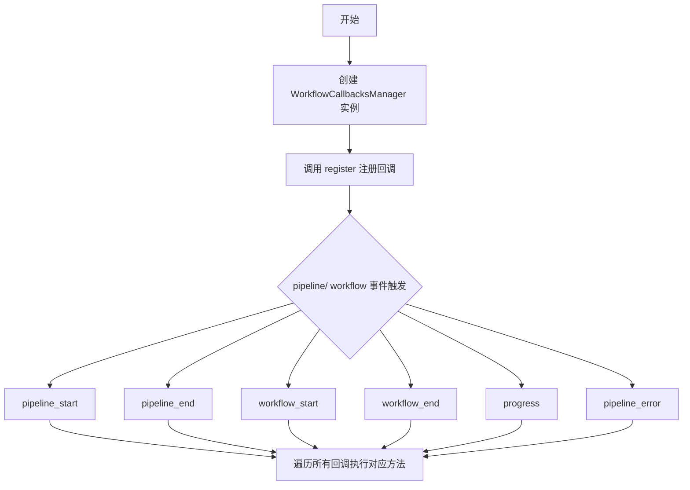
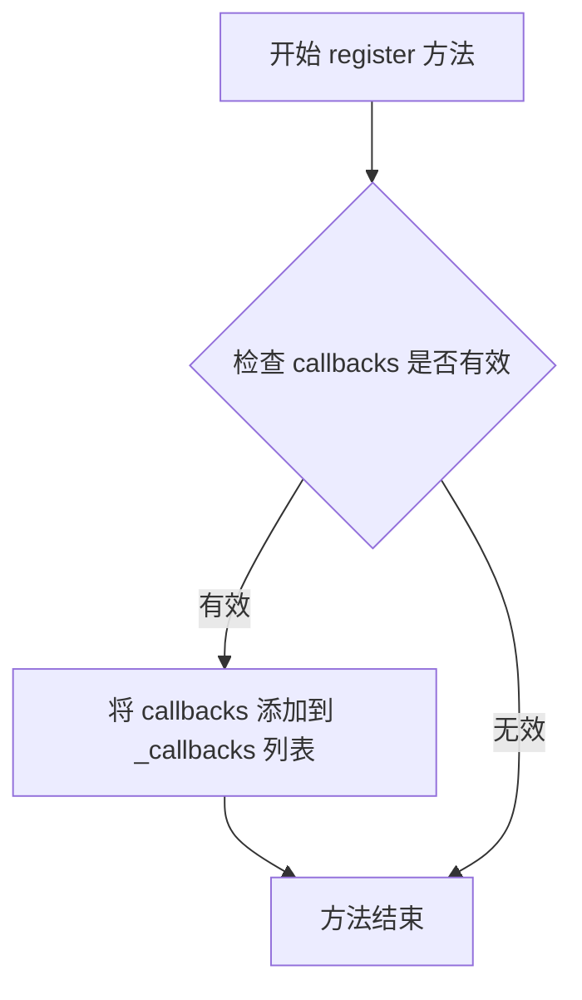
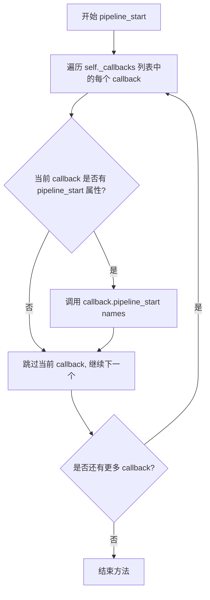
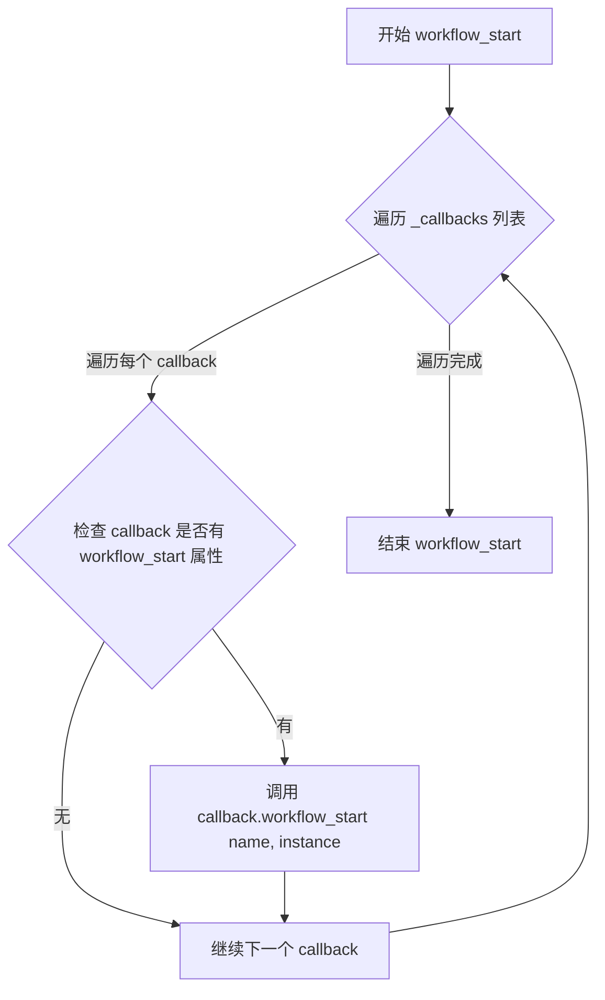
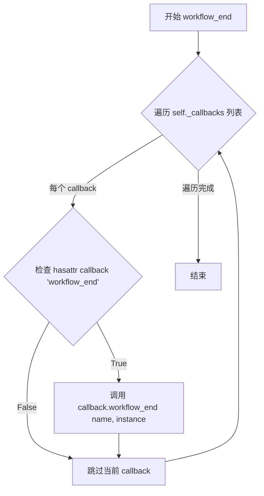
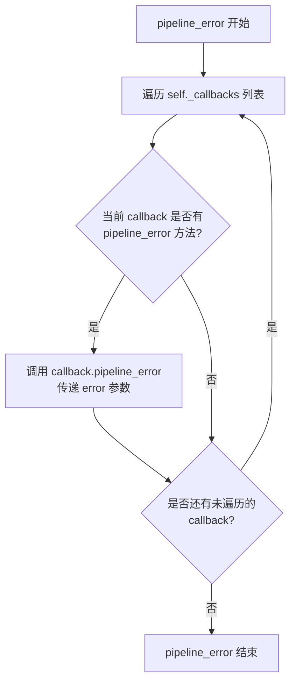

# `graphrag\packages\graphrag\graphrag\callbacks\workflow_callbacks_manager.py` 详细设计文档

这是一个工作流回调管理器类，用于注册和管理多个 WorkflowCallbacks 实例，并在 pipeline 和 workflow 的不同生命周期阶段（开始、结束、进度、错误）自动分发调用到所有已注册的回调函数。

## 整体流程



## 类结构

```
WorkflowCallbacks (抽象基类/接口)
└── WorkflowCallbacksManager (实现类)
```

## 全局变量及字段


### `WorkflowCallbacksManager._callbacks`
    
存储已注册的 WorkflowCallbacks 实例列表

类型：`list[WorkflowCallbacks]`
    
    

## 全局函数及方法


### `WorkflowCallbacksManager.__init__`

初始化管理器，创建空的回调列表

参数：

- 该方法无参数

返回值：`None`，无返回值，仅初始化实例属性

#### 流程图

```mermaid
flowchart TD
    A[开始 __init__] --> B[创建空列表 self._callbacks = []]
    B --> C[初始化完成]
```

#### 带注释源码

```python
def __init__(self):
    """Create a new instance of WorkflowCallbacksRegistry."""
    # 初始化一个空列表用于存储已注册的回调函数
    self._callbacks = []
```


### WorkflowCallbacksManager.register

注册一个新的 WorkflowCallbacks 实例到管理器

参数：

- `callbacks`：`WorkflowCallbacks`，要注册的回调实例

返回值：`None`，无返回值描述

#### 流程图



#### 带注释源码

```python
def register(self, callbacks: WorkflowCallbacks) -> None:
    """Register a new WorkflowCallbacks type."""
    # 将传入的回调实例追加到内部回调列表中
    # 该列表存储所有需要被调用的回调处理器
    self._callbacks.append(callbacks)
```


### WorkflowCallbacksManager.pipeline_start

当整个 pipeline 启动时触发，遍历调用所有已注册回调的 `pipeline_start` 方法。

参数：

- `names`：`list[str]`，pipeline 名称列表

返回值：`None`，无返回值描述

#### 流程图



#### 带注释源码

```python
def pipeline_start(self, names: list[str]) -> None:
    """Execute this callback when a the entire pipeline starts."""
    # 遍历所有已注册的回调对象
    for callback in self._callbacks:
        # 动态检查回调对象是否实现了 pipeline_start 方法
        if hasattr(callback, "pipeline_start"):
            # 调用回调对象的 pipeline_start 方法，传入 pipeline 名称列表
            callback.pipeline_start(names)
```


### WorkflowCallbacksManager.pipeline_end

当整个 pipeline 结束时触发，遍历调用所有已注册回调的 `pipeline_end` 方法。

参数：

- `results`：`list[PipelineRunResult]`，pipeline 执行结果列表

返回值：`None`，无返回值，仅执行副作用（调用各回调的 pipeline_end 方法）

#### 流程图

```mermaid
flowchart TD
    A[开始 pipeline_end] --> B[遍历 self._callbacks 列表]
    B --> C{当前索引 &lt; 列表长度?}
    C -->|是| D[获取当前 callback]
    D --> E{callback 是否拥有 pipeline_end 属性?}
    E -->|是| F[调用 callback.pipeline_end(results)]
    E -->|否| G[跳过当前 callback]
    F --> H[索引 + 1]
    G --> H
    H --> C
    C -->|否| I[结束]
```

#### 带注释源码

```python
def pipeline_end(self, results: list[PipelineRunResult]) -> None:
    """Execute this callback when the entire pipeline ends."""
    # 遍历所有已注册的回调对象
    for callback in self._callbacks:
        # 使用 hasattr 动态检查回调对象是否实现了 pipeline_end 方法
        if hasattr(callback, "pipeline_end"):
            # 如果实现了，则调用该方法并传递 results 参数
            callback.pipeline_end(results)
```


### `WorkflowCallbacksManager.workflow_start`

当单个 workflow 启动时触发该回调方法，它会遍历所有已注册的回调对象，对每个具有 `workflow_start` 方法的回调调用该方法，传递 workflow 名称和实例对象，从而实现工作流启动事件的广播通知。

参数：

- `name`：`str`，workflow 名称
- `instance`：`object`，workflow 实例对象

返回值：`None`，无返回值描述

#### 流程图



#### 带注释源码

```python
def workflow_start(self, name: str, instance: object) -> None:
    """Execute this callback when a workflow starts."""
    # 遍历所有已注册的回调对象
    for callback in self._callbacks:
        # 使用 hasattr 检查回调对象是否实现了 workflow_start 方法
        if hasattr(callback, "workflow_start"):
            # 如果实现了，则调用该方法并传递 workflow 名称和实例对象
            callback.workflow_start(name, instance)
```


### `WorkflowCallbacksManager.workflow_end`

当单个 workflow 结束时触发，遍历调用所有已注册回调的 workflow_end 方法。

参数：

-  `name`：`str`，workflow 名称
-  `instance`：`object`，workflow 实例对象

返回值：`None`，无返回值

#### 流程图



#### 带注释源码

```python
def workflow_end(self, name: str, instance: object) -> None:
    """Execute this callback when a workflow ends.
    
    当单个 workflow 结束时触发，遍历调用所有回调的 workflow_end 方法。
    
    Args:
        name: workflow 名称
        instance: workflow 实例对象
    """
    # 遍历所有已注册的回调函数
    for callback in self._callbacks:
        # 检查当前回调对象是否实现了 workflow_end 方法
        if hasattr(callback, "workflow_end"):
            # 如果实现了，则调用该回调的 workflow_end 方法
            callback.workflow_end(name, instance)
```


### `WorkflowCallbacksManager.progress`

当有进度更新时触发，遍历调用所有已注册回调的 progress 方法。

参数：

- `progress`：`Progress`，进度信息对象

返回值：`None`，无返回值

#### 流程图

```mermaid
flowchart TD
    A([开始: progress]) --> B[遍历 self._callbacks 列表]
    B --> C{当前 callback 是否有 'progress' 属性?}
    C -->|是| D[调用 callback.progress(progress)]
    C -->|否| E[跳过该 callback, 继续下一个]
    D --> F{还有更多 callback?}
    E --> F
    F -->|是| B
    F -->|否| G([结束])
```

#### 带注释源码

```python
def progress(self, progress: Progress) -> None:
    """Handle when progress occurs."""
    # 遍历所有已注册的回调列表
    for callback in self._callbacks:
        # 检查当前回调对象是否实现了 progress 方法
        if hasattr(callback, "progress"):
            # 如果实现了，则调用该回调的 progress 方法，传递进度信息
            callback.progress(progress)
```


### `WorkflowCallbacksManager.pipeline_error`

当 pipeline 执行发生错误时触发该方法，遍历所有已注册的回调对象，对每个实现了 `pipeline_error` 方法的回调传递异常对象，以实现错误的统一传播和多样化处理。

参数：

- `error`：`BaseException`，pipeline 执行过程中的异常

返回值：`None`，该方法仅执行副作用，不返回任何值

#### 流程图



#### 带注释源码

```python
def pipeline_error(self, error: BaseException) -> None:
    """Execute this callback when an error occurs in the pipeline."""
    # 遍历所有已注册的回调对象
    for callback in self._callbacks:
        # 动态检查回调对象是否实现了 pipeline_error 方法
        # 使用 hasattr 而非直接调用，避免未实现该方法的回调导致 AttributeError
        if hasattr(callback, "pipeline_error"):
            # 将错误传递给回调对象，实现错误的统一传播
            callback.pipeline_error(error)
```

#### 技术债务与优化空间

1. **使用 hasattr 的运行时检查**：每次调用都会执行 `hasattr` 反射检查，如果回调接口固定，可在注册时验证或使用抽象基类（ABC）进行编译时检查，提升性能。

2. **错误吞没风险**：当前实现中如果某个回调的 `pipeline_error` 抛出异常，会中断后续回调的执行。建议添加 try-except 保护，确保所有回调都能收到错误通知。

3. **缺乏日志记录**：方法执行过程中没有任何日志，无法追踪错误传播的路径，建议添加日志记录以便于调试和监控。

4. **同步阻塞设计**：采用同步方式依次调用回调，在回调操作耗时（如网络请求、文件 IO）时会阻塞主流程，可考虑异步化改造。

#### 其它考量

- **设计目标**：实现观察者模式，允许任意数量的回调订阅 pipeline 错误事件，实现关注点分离。
- **错误处理**：该方法本身不处理错误，仅负责传播，如需统一错误处理（如日志记录、告警），可在回调实现类中完成。
- **接口契约**：`pipeline_error` 方法签名由 `WorkflowCallbacks` 抽象接口定义，所有实现该接口的类都应遵循统一签名，保证兼容性。

## 关键组件


### WorkflowCallbacksManager

回调管理器类，继承自 WorkflowCallbacks 抽象基类，用于注册和管理多个工作流回调实例，并在管道和工作流的各个生命周期阶段（开始、结束、进度、错误）触发相应的回调方法。

### _callbacks 列表

存储已注册的 WorkflowCallbacks 实例的列表，用于在各个生命周期事件触发时遍历执行所有已注册的回调。

### register 方法

用于注册新的 WorkflowCallbacks 实例到管理器中，将回调对象添加到内部列表以便后续统一调度。

### pipeline_start 方法

管道开始时的回调方法，遍历所有已注册的回调并执行其 pipeline_start 方法，通知各回调管道已开始运行。

### pipeline_end 方法

管道结束时的回调方法，遍历所有已注册的回调并执行其 pipeline_end 方法，传递管道运行结果列表。

### workflow_start 方法

工作流开始时的回调方法，遍历所有已注册的回调并执行其 workflow_start 方法，传递工作流名称和实例对象。

### workflow_end 方法

工作流结束时的回调方法，遍历所有已注册的回调并执行其 workflow_end 方法，传递工作流名称和实例对象。

### progress 方法

进度更新时的回调方法，遍历所有已注册的回调并执行其 progress 方法，传递 Progress 进度对象。

### pipeline_error 方法

管道错误时的回调方法，遍历所有已注册的回调并执行其 pipeline_error 方法，传递发生的异常对象。


## 问题及建议


### 已知问题

-   **缺乏错误隔离机制**：在遍历执行回调时，如果某个回调抛出异常，会导致后续回调无法执行，整个流程会中断
-   **使用动态属性检查降低性能**：每次调用都使用 `hasattr` 检查方法是否存在，当回调数量较多时会造成性能开销
-   **缺少线程安全保护**：多线程环境下对 `_callbacks` 列表的并发访问可能导致数据竞争
-   **类型注解不够精确**：`workflow_start` 和 `workflow_end` 方法中的 `instance: object` 类型过于宽泛，无法提供有效的类型安全和代码提示
-   **无法注销回调**：只提供了 `register` 方法，缺少 `unregister` 方法，无法移除已注册的回调
-   **缺少回调执行顺序控制**：回调按照注册顺序执行，无法指定优先级或调整执行顺序
-   **空列表未做防御性处理**：虽然 `_callbacks` 初始化为空列表，但如果在外部被直接修改或传入无效数据，缺乏验证

### 优化建议

-   **添加错误隔离**：使用 try-except 包装每个回调调用，捕获异常后记录日志或收集错误，继续执行其他回调
-   **考虑使用协议或抽象基类**：在回调注册时进行类型检查，避免运行时属性检查的开销
-   **添加线程锁**：使用 `threading.Lock` 保护 `_callbacks` 列表的读写操作
-   **改进类型注解**：将 `instance: object` 替换为更具体的类型，或使用泛型参数
-   **实现注销机制**：添加 `unregister` 方法，支持通过回调实例或类型名称移除回调
-   **支持优先级**：在注册时接受优先级参数，高优先级回调优先执行
-   **添加回调验证**：在注册和调用前验证回调对象的有效性

## 其它


### 设计目标与约束

设计目标：提供一种统一的机制来管理多个工作流回调（WorkflowCallbacks），允许在管道的不同阶段（管道开始/结束、工作流开始/结束、进度更新、错误发生）触发多个回调函数，实现解耦和扩展性。

设计约束：
- 必须继承自WorkflowCallbacks基类
- 回调方法使用hasattr进行可选方法检查，避免未实现的方法导致错误
- 不限制回调数量，但需注意大量回调可能影响性能
- 不支持反注册回调（unregister）

### 错误处理与异常设计

代码中的错误处理机制：
- 使用hasattr动态检查回调对象是否实现了特定方法，若未实现则跳过调用
- 不捕获回调执行过程中的异常，异常将直接传播到调用方
- 建议调用方在调用回调管理器方法时进行异常捕获和处理

潜在改进：
- 可考虑添加回调执行结果的错误收集机制
- 可添加回调执行超时控制
- 可添加回调执行失败时的降级策略

### 数据流与状态机

数据流：
1. 外部通过register()方法注册WorkflowCallbacks实例到_callbacks列表
2. 当管道/工作流事件发生时，调用WorkflowCallbacksManager对应的回调方法
3. 回调方法遍历_callbacks列表，对每个回调调用其对应的方法
4. 回调方法接收的参数（names、results、name、instance、progress、error）被传递给每个已注册的回调

状态机：
- 该类本身不维护复杂状态，仅维护回调注册列表
- 回调的执行状态由各个具体的回调实现类自行管理

### 外部依赖与接口契约

依赖项：
- WorkflowCallbacks：基类，定义回调接口契约
- PipelineRunResult：管道运行结果类型
- Progress：进度信息类型

接口契约：
- register(callbacks: WorkflowCallbacks)：接收WorkflowCallbacks类型参数
- 各回调方法接收特定类型的参数，参数传递给已注册的回调
- 所有回调方法返回None（void）

### 扩展性分析

扩展方式：
1. 继承WorkflowCallbacks基类创建新的回调类
2. 通过register方法注册多个回调实例
3. 可在子类中重写回调方法添加自定义逻辑

限制：
- 不支持动态移除已注册的回调
- 不支持回调优先级控制（按注册顺序执行）
- 所有回调同步执行，不支持异步执行

### 线程安全性

当前实现未考虑线程安全：
- _callbacks列表的append操作在多线程环境下非原子操作
- 遍历_callbacks并调用回调时可能出现竞态条件
- 如需在多线程环境使用，建议添加线程锁保护

### 性能考虑

性能特点：
- 每次回调触发需遍历所有已注册的回调，时间复杂度O(n)
- 使用hasattr进行动态方法检查，每次调用都有一定开销
- 回调数量越多，性能影响越大

优化建议：
- 可考虑缓存方法检查结果
- 可添加回调启用/禁用开关
- 可考虑异步执行回调（但会增加复杂性）

    