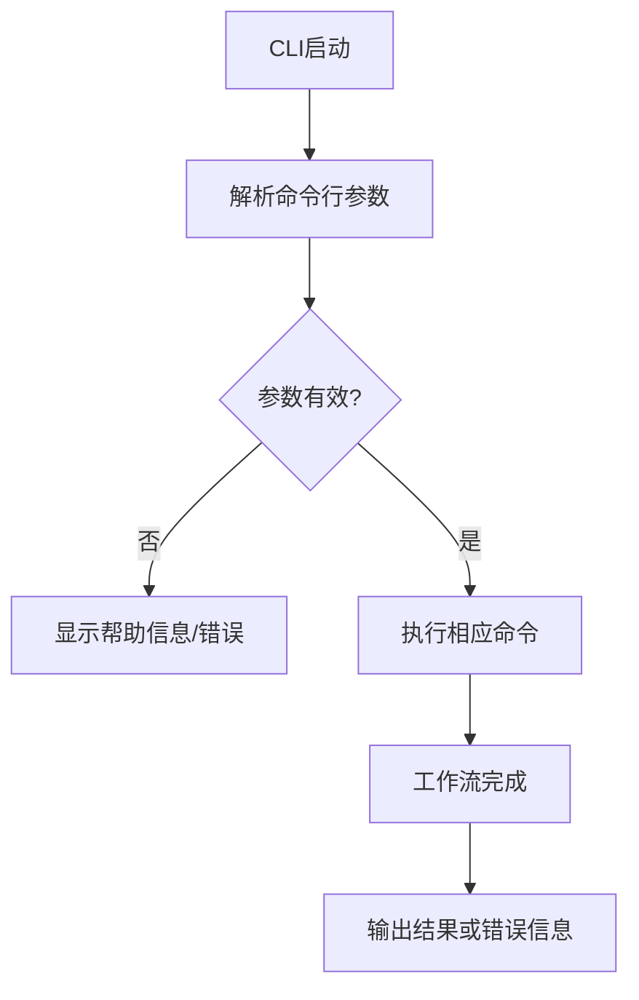

# `graphrag\packages\graphrag\graphrag\cli\__init__.py` 详细设计文档

GraphRAG的命令行界面(CLI)模块，提供用于运行GraphRAG工作流程的命令行接口。

## 整体流程



## 类结构

```
CLI模块 (命令行入口)
├── 命令处理器
├── 参数解析器
└── 工作流调度器
```

## 全局变量及字段


    

## 全局函数及方法


## 关键组件


## 核心功能概述

该代码文件为GraphRAG项目的命令行界面（CLI）模块的初始化文件，定义了模块的版权信息和基本功能说明，但由于代码片段仅包含文档字符串，未包含实际的功能实现代码。

## 文件整体运行流程

由于该代码文件仅为模块级别的文档字符串和版权声明，不包含可执行代码，因此无法提供详细的运行流程分析。该文件作为GraphRAG CLI模块的入口点定义，其实际功能实现应分布在其他模块文件中。

## 类详细信息

**无类定义**

该代码文件中未定义任何类。

## 全局变量与全局函数

**无全局变量与全局函数**

该代码文件中未定义任何全局变量或全局函数。

## 关键组件信息

### GraphRAG CLI模块

该模块作为GraphRAG项目的命令行界面入口点，负责提供用户与GraphRAG系统交互的命令行接口。根据模块文档字符串，该CLI工具旨在帮助用户使用GraphRAG的各项功能。

## 潜在技术债务与优化空间

1. **功能实现缺失**：当前代码文件仅为模块声明文件，缺乏实际的CLI功能实现，需要后续补充完整的命令行界面逻辑
2. **文档完善**：建议添加更详细的模块说明，包括CLI支持的命令列表、使用方法等
3. **模块化设计**：建议明确CLI模块的子命令结构和模块划分

## 其它项目

### 设计目标与约束

- **设计目标**：为GraphRAG提供命令行交互界面
- **许可证约束**：遵循MIT License开源协议
- **版权归属**：Microsoft Corporation (2024)

### 错误处理与异常设计

由于代码中未包含实际实现代码，无法提供详细的错误处理与异常设计说明。

### 数据流与状态机

由于代码中未包含实际实现代码，无法提供数据流与状态机分析。

### 外部依赖与接口契约

由于代码中未包含实际实现代码，无法提供外部依赖与接口契约说明。


## 问题及建议


### 已知问题

- 该文件仅包含版权声明和模块文档字符串，没有任何实际的 CLI 实现代码，属于占位符文件
- 缺少命令行参数解析逻辑（如使用 argparse、click 或 typer）
- 缺少子命令定义（如 `graphrag index`、`graphrag query` 等）
- 缺少帮助信息和使用说明
- 缺少版本信息输出
- 缺少错误处理和异常捕获机制
- 缺少日志配置和输出控制
- 缺少配置文件加载和管理逻辑

### 优化建议

- 实现完整的 CLI 框架，选择合适的命令行解析库（推荐 typer 或 click）
- 定义 GraphRAG 的核心子命令：index（建索引）、query（查询）、stats（统计）等
- 添加全局参数支持：--config、--verbose、--output-format 等
- 实现统一的错误处理和用户友好的错误提示
- 添加 `--version` 参数显示版本信息
- 配置日志级别和输出格式
- 添加命令执行前的参数校验
- 实现进度条和实时反馈机制
- 添加单元测试和集成测试
- 提供完整的命令行帮助文档和使用示例


## 其它


### 设计目标与约束

本CLI工具旨在为GraphRAG（基于知识图谱的检索增强生成系统）提供命令行交互入口，支持用户通过命令行方式执行图谱查询、索引构建、模型推理等核心功能。设计约束包括：需兼容Python 3.8+环境，支持跨平台运行（Windows/Linux/macOS），依赖项需保持最小化，命令行参数遵循POSIX标准约定。

### 错误处理与异常设计

CLI工具应实现统一的错误处理机制，包括：命令行参数解析错误（使用argparse的ArgumentError）、网络请求异常（连接超时、服务不可用）、文件操作异常（权限不足、路径不存在）、GraphRAG核心模块异常等。所有异常需分类处理，用户友好的错误信息输出，退出码遵循标准约定（0成功，1常规错误，2参数错误）。

### 数据流与状态机

CLI启动流程：解析命令行参数 → 验证配置 → 加载GraphRAG核心模块 → 执行用户指定命令 → 返回结果/错误。命令执行状态包括：IDLE（空闲）、LOADING（加载中）、EXECUTING（执行中）、COMPLETED（完成）、ERROR（错误）。数据流方向：用户输入 → 参数解析器 → 命令处理器 → GraphRAG API → 输出格式化器 → 终端输出。

### 外部依赖与接口契约

核心依赖包括：Python标准库（argparse、subprocess、logging）、GraphRAG核心包（graphrag库）、可能的第三方库（用于输出格式化的tabulate、json等）。接口契约方面：CLI作为顶层入口，向下调用GraphRAG SDK的公开API，向上接收用户命令行输入并格式化输出结果。需定义清晰的API版本兼容策略。

### 安全性考虑

CLI工具需处理用户数据（如查询文本、文件路径），建议实现：敏感信息（如API密钥）通过环境变量而非命令行参数传递，输入内容进行基本的安全校验（如路径遍历检查），防止命令注入攻击。

### 性能要求

CLI响应时间目标：启动时间<1秒，参数解析时间<100ms，错误提示响应时间<50ms。需考虑日志输出的性能影响，建议提供日志级别配置选项。

### 配置管理

支持通过命令行参数、环境变量、配置文件（YAML/JSON）多层次配置。配置优先级：命令行参数 > 环境变量 > 配置文件 > 默认值。需提供配置验证机制。

### 日志记录

实现分级日志记录（DEBUG、INFO、WARNING、ERROR、CRITICAL），默认日志级别为INFO，日志输出到stderr（与stdout分离），提供JSON格式日志选项以便集成外部日志收集系统。

### 测试策略

建议包含：单元测试（参数解析、配置验证）、集成测试（CLI与GraphRAG核心的交互）、端到端测试（典型使用场景）、Mock测试（模拟外部依赖）。

### 部署与发布

CLI工具建议通过pip包管理发布，提供entry_points配置实现命令自动安装，支持虚拟环境部署，需提供详细的安装和使用文档。

### 版本管理与兼容性

遵循语义化版本号（Semantic Versioning），CLI主版本号变更需考虑向后兼容性维护，需在发布说明中明确版本间的 Breaking Changes。


    