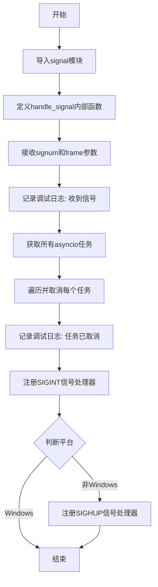
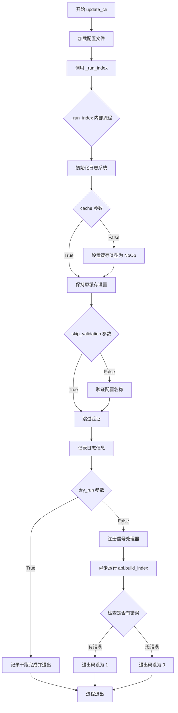

# `graphrag\packages\graphrag\graphrag\cli\index.py` 详细设计文档

该文件是graphrag项目的CLI实现，提供了index和update两个子命令用于执行索引管道，支持配置加载、日志初始化、缓存管理、信号处理和异步索引构建等功能。

## 整体流程

```mermaid
graph TD
    A[开始] --> B{命令类型}
    B -- index_cli --> C[index_cli]
    B -- update_cli --> D[update_cli]
    C --> E[_run_index]
    D --> E
    E --> F[init_loggers]
    E --> G{cache参数}
G -- False --> H[设置CacheType.Noop]
G -- True --> I[跳过]
H --> J{skip_validation参数}
I --> J
J -- False --> K[validate_config_names]
J -- True --> L[跳过验证]
K --> L
L --> M{dry_run参数}
M -- True --> N[记录日志并退出]
M -- False --> O[_register_signal_handlers]
O --> P[asyncio.run api.build_index]
P --> Q{检查错误}
Q -- 有错误 --> R[sys.exit(1)]
Q -- 无错误 --> S[sys.exit(0)]
```

## 类结构

```
cli.py (模块根)
├── 全局变量
│   └── logger
└── 全局函数
    ├── _register_signal_handlers()
    ├── index_cli()
    ├── update_cli()
    └── _run_index()
```

## 全局变量及字段


### `logger`
    
模块级日志记录器，用于记录模块内的日志信息

类型：`logging.Logger`
    


    

## 全局函数及方法


### `_register_signal_handlers`

注册SIGINT和SIGHUP信号处理器，用于在收到退出信号时优雅地取消所有asyncio任务。

参数：空

返回值：`None`，无返回值

#### 流程图



#### 带注释源码

```python
def _register_signal_handlers():
    """注册信号处理器以处理SIGINT和SIGHUP信号."""
    import signal  # 导入signal模块以处理系统信号

    def handle_signal(signum, _):
        """内部信号处理函数.
        
        Args:
            signum: 信号编号
            _: 当前的栈帧（未使用）
        """
        # 处理接收到的信号
        logger.debug(f"Received signal {signum}, exiting...")  # noqa: G004
        # 获取所有当前运行的asyncio任务
        for task in asyncio.all_tasks():
            task.cancel()  # 取消每个任务以实现优雅退出
        logger.debug("All tasks cancelled. Exiting...")

    # Register signal handlers for SIGINT and SIGHUP
    # 注册SIGINT处理器（Ctrl+C触发）
    signal.signal(signal.SIGINT, handle_signal)

    # 仅在非Windows平台注册SIGHUP信号处理器
    if sys.platform != "win32":
        signal.signal(signal.SIGHUP, handle_signal)
```


### `index_cli`

执行索引管道的主入口函数，负责加载配置并调用内部函数 `_run_index` 来执行实际的索引操作。

参数：

- `root_dir`：`Path`，项目根目录路径，用于定位配置文件
- `method`：`IndexingMethod`，索引方法类型，指定索引管道的执行方式
- `verbose`：`bool`，是否输出详细日志信息
- `cache`：`bool`，是否启用缓存功能
- `dry_run`：`bool`，是否为试运行模式（仅验证配置，不执行实际索引）
- `skip_validation`：`bool`，是否跳过配置验证步骤

返回值：`None`，该函数无返回值，通过 `sys.exit` 返回执行状态码

#### 流程图

```mermaid
flowchart TD
    A[开始 index_cli] --> B[加载配置文件: load_config]
    B --> C[调用 _run_index 函数]
    C --> D{_run_index 内部流程}
    
    D --> E[初始化日志系统 init_loggers]
    E --> F{cache 参数为 false?}
    F -->|是| G[设置缓存类型为 Noop]
    F -->|否| H{skip_validation 为 false?}
    G --> H
    
    H -->|是| I[验证配置名称 validate_config_names]
    H -->|否| J{日志输出配置信息}
    I --> J
    
    J --> K{dry_run 为 true?}
    K -->|是| L[记录日志并退出: sys.exit(0)]
    K -->|否| M[注册信号处理器]
    
    M --> N[异步执行 api.build_index]
    N --> O{检查是否存在错误}
    O -->|有错误| P[sys.exit(1)]
    O -->|无错误| Q[sys.exit(0)]
```

#### 带注释源码

```python
def index_cli(
    root_dir: Path,
    method: IndexingMethod,
    verbose: bool,
    cache: bool,
    dry_run: bool,
    skip_validation: bool,
):
    """Run the pipeline with the given config."""
    # 步骤1: 从指定根目录加载配置对象
    config = load_config(root_dir=root_dir)
    
    # 步骤2: 调用内部函数 _run_index 执行实际的索引管道
    # 参数 is_update_run=False 表示这是全新的索引运行，而非增量更新
    _run_index(
        config=config,
        method=method,
        is_update_run=False,  # 标记为初始索引运行
        verbose=verbose,
        cache=cache,
        dry_run=dry_run,
        skip_validation=skip_validation,
    )
```


### `update_cli`

执行更新管道的主入口函数，用于运行具有给定配置的更新操作。该函数加载配置文件，并以更新模式调用内部索引运行函数。

参数：

- `root_dir`：`Path`，项目根目录，用于加载配置文件
- `method`：`IndexingMethod`，索引方法，指定要使用的索引方式
- `verbose`：`bool`，是否启用详细日志输出
- `cache`：`bool`，是否启用缓存功能
- `skip_validation`：`bool`，是否跳过配置验证

返回值：`None`，该函数不返回值，执行管道后直接退出进程

#### 流程图



#### 带注释源码

```python
def update_cli(
    root_dir: Path,
    method: IndexingMethod,
    verbose: bool,
    cache: bool,
    skip_validation: bool,
):
    """Run the pipeline with the given config."""
    # 使用根目录加载配置文件
    config = load_config(
        root_dir=root_dir,
    )

    # 调用内部索引运行函数，is_update_run=True 表示执行更新模式
    _run_index(
        config=config,
        method=method,
        is_update_run=True,  # 关键参数：标识这是更新运行
        verbose=verbose,
        cache=cache,
        dry_run=False,       # 更新模式默认不进行干跑
        skip_validation=skip_validation,
    )
```


### `_run_index`

核心索引运行逻辑，负责配置加载、日志初始化、缓存设置、配置验证、信号处理注册，并调用异步API构建索引，最后根据执行结果退出程序。

参数：

- `config`：`Any`，从 `load_config()` 加载的配置文件对象，包含索引管道的所有配置信息
- `method`：`IndexingMethod`，索引方法枚举，指定使用的索引策略
- `is_update_run`：`bool`，是否为更新运行模式，True 表示增量更新，False 表示全量重建
- `verbose`：`bool`，是否启用详细日志输出
- `cache`：`bool`，是否启用缓存功能
- `dry_run`：`bool`，是否为干运行模式，仅验证配置但不执行实际索引
- `skip_validation`：`bool`，是否跳过配置名称验证

返回值：`None`，该函数通过 `sys.exit()` 返回执行状态码（0表示成功，1表示失败）

#### 流程图

```mermaid
flowchart TD
    A[开始 _run_index] --> B[调用 init_loggers 初始化日志系统]
    B --> C{cache 为 False?}
    C -->|是| D[设置 config.cache.type = CacheType.Noop]
    C -->|否| E{skip_validation 为 False?}
    D --> E
    E -->|是| F[调用 validate_config_names 验证配置名称]
    E -->|否| G{dry_run 为 True?}
    F --> G
    G -->|是| H[记录日志 'Dry run complete, exiting...']
    H --> I[sys.exit(0) 正常退出]
    G -->|否| J[调用 _register_signal_handlers 注册信号处理器]
    J --> K[asyncio.run 调用 api.build_index]
    K --> L[检查 outputs 中是否存在错误]
    L --> M{any error is not None?}
    M -->|是| N[sys.exit(1) 异常退出]
    M -->|否| O[sys.exit(0) 正常退出]
```

#### 带注释源码

```python
def _run_index(
    config,
    method,
    is_update_run,
    verbose,
    cache,
    dry_run,
    skip_validation,
):
    """Run the index pipeline with the given configuration.
    
    This function orchestrates the entire indexing process including:
    - Logger initialization
    - Cache configuration
    - Config validation
    - Signal handling setup
    - Async index building
    - Error handling and exit code management
    """
    # Configure the root logger with the specified log level
    # 导入日志初始化模块
    from graphrag.logger.standard_logging import init_loggers

    # Initialize loggers and reporting config
    # 初始化日志系统，传入配置和详细日志标志
    init_loggers(
        config=config,
        verbose=verbose,
    )

    # If cache is disabled, set cache type to Noop
    # 如果禁用缓存，将缓存类型设置为 Noop（无操作）
    if not cache:
        config.cache.type = CacheType.Noop

    # Validate configuration names if not skipped
    # 如果未跳过验证，则验证配置名称的有效性
    if not skip_validation:
        validate_config_names(config)

    # Log the start of pipeline run and configuration details
    # 记录管道运行开始的日志，包含干运行标志
    logger.info("Starting pipeline run. %s", dry_run)
    # 使用 redact 函数脱敏后记录配置信息
    logger.info(
        "Using default configuration: %s",
        redact(config.model_dump()),
    )

    # If dry run mode, exit after logging configuration
    # 干运行模式：仅验证配置，不执行实际索引，直接退出
    if dry_run:
        logger.info("Dry run complete, exiting...", True)
        sys.exit(0)

    # Register signal handlers for graceful shutdown
    # 注册信号处理器以支持优雅退出（处理 SIGINT 和 SIGHUP）
    _register_signal_handlers()

    # Run the async index building process
    # 使用 asyncio.run 执行异步索引构建API
    outputs = asyncio.run(
        api.build_index(
            config=config,
            method=method,
            is_update_run=is_update_run,
            callbacks=[ConsoleWorkflowCallbacks(verbose=verbose)],
            verbose=verbose,
        )
    )
    
    # Check if any errors were encountered during indexing
    # 检查索引输出中是否存在任何错误
    encountered_errors = any(output.error is not None for output in outputs)

    # Exit with appropriate code: 1 for errors, 0 for success
    # 根据是否遇到错误返回相应的退出码
    sys.exit(1 if encountered_errors else 0)
```

## 关键组件


### 信号处理模块 (_register_signal_handlers)

负责注册系统信号处理器，处理SIGINT和SIGHUP信号以实现优雅退出，遍历并取消所有待处理的异步任务。

### 索引CLI入口 (index_cli)

主入口函数，接收根目录、索引方法、详细模式、缓存开关、干运行模式和验证跳过标志，调用内部_run_index函数执行完整索引流程。

### 更新CLI入口 (update_cli)

增量更新入口函数，与index_cli类似但设置is_update_run=True，执行增量索引更新而非完整重建。

### 核心运行函数 (_run_index)

内部实现函数，负责初始化日志系统、配置缓存类型、验证配置名称、处理干运行模式、注册信号处理器，并异步调用API构建索引，处理错误退出逻辑。

### 配置加载模块 (load_config)

从指定根目录加载图谱索引配置，返回包含所有索引参数的配置对象。

### 配置验证模块 (validate_config_names)

验证配置中的名称是否符合规范，确保配置的有效性。

### 日志初始化模块 (init_loggers)

根据配置和详细模式标志初始化根日志记录器，设置适当的日志级别和格式。

### 异步索引构建API (api.build_index)

调用图谱API执行实际的索引构建操作，接收配置、索引方法、是否为更新运行、回调函数和详细模式，返回包含错误信息的输出列表。

### 控制台工作流回调 (ConsoleWorkflowCallbacks)

提供控制台输出的工作流回调实现，用于在索引过程中向用户显示进度和状态信息。

### 缓存类型配置 (CacheType.Noop)

用于禁用缓存的缓存类型枚举值，当用户指定--no-cache时设置。

### 错误处理与退出机制

检查所有输出是否包含错误，如有错误则退出码为1，否则为0，实现正确的程序退出状态码管理。


## 问题及建议


### 已知问题

-   **信号处理不够健壮**：handle_signal函数中直接调用task.cancel()可能导致任务在执行关键清理代码前被强制取消，建议使用asyncio.Event来协调取消流程，让任务有机会优雅退出
-   **日志参数冗余**：第101行`logger.info("Dry run complete, exiting...", True)`中第二个参数True没有实际作用，属无效参数
-   **缺少类型注解**：_run_index函数的config、method等参数没有提供类型注解，降低了代码可读性和IDE支持
-   **错误信息不详细**：只检查了是否存在错误（any(output.error is not None for output in outputs)），但没有记录具体是哪些输出失败了，排查问题时缺少关键信息
-   **缓存配置修改不够优雅**：直接修改config.cache.type = CacheType.Noop，建议通过配置选项传递而非直接修改对象属性
-   **缺少异常处理**：asyncio.run(api.build_index(...))可能抛出异常，但代码中没有try-except捕获，程序可能以未捕获的异常终止
-   **信号模块导入位置不当**：signal模块在_run_index内部导入，增加了每次调用的开销，应提升到文件顶部
-   **回调对象重复创建**：每次调用都会创建新的ConsoleWorkflowCallbacks实例，可考虑复用

### 优化建议

-   为_run_index函数的参数添加类型注解，提升代码可维护性
-   在捕获信号时使用asyncio.Event通知任务取消，而不是直接cancel，提供优雅退出的机会
-   增加详细的错误日志记录，输出失败输出的具体信息
-   将signal模块的导入移到文件顶部，符合Python最佳实践
-   添加try-except块捕获asyncio.run中的异常，并进行适当的错误处理和日志记录
-   移除logger.info中无用的第二个参数
-   考虑为长时间运行的索引操作添加超时配置选项
-   在修改config对象前添加必要的空值检查，避免AttributeError

## 其它


### 设计目标与约束

该CLI工具作为graphrag索引流程的入口点，核心设计目标是提供统一的命令行界面来执行数据索引和更新操作。设计约束包括：必须支持两种运行模式（完整索引和增量更新），支持干运行（dry-run）以预览执行计划，支持缓存机制以提升性能，支持信号处理以实现优雅关闭。依赖Python asyncio框架实现异步执行，并通过配置管理系统动态加载参数。

### 错误处理与异常设计

代码采用多层错误处理策略。在配置加载阶段，通过validate_config_names进行配置验证，验证失败会抛出异常。在执行阶段，api.build_index返回的outputs包含error字段，代码通过any(output.error is not None for output in outputs)检查是否存在错误。信号处理中捕获SIGINT和SIGHUP信号后，取消所有asyncio任务实现优雅退出。程序退出码遵循Unix规范：成功返回0，存在错误返回1。日志系统记录详细执行信息，包括配置内容（经脱敏处理）和执行状态。

### 数据流与状态机

程序执行分为以下状态阶段：配置加载 → 配置验证 → 日志初始化 → 缓存配置 → 干运行检查 → 信号注册 → 索引执行 → 结果检查 → 退出。在干运行模式下，程序在执行索引前退出。索引执行通过asyncio.run调用api.build_index异步执行，支持增量更新（is_update_run=True）和完整重建两种模式。执行过程中通过ConsoleWorkflowCallbacks回调报告进度。

### 外部依赖与接口契约

该模块依赖以下核心外部模块：graphrag.api提供build_index函数作为索引执行入口；graphrag.config.load_config负责配置加载；graphrag.cache.cache_type.CacheType定义缓存类型枚举；graphrag.index.validate_config提供配置验证函数；graphrag.logger.standard_logging.init_loggers负责日志初始化；graphrag.callbacks.console_workflow_callbacks.ConsoleWorkflowCallbacks提供执行进度回调。配置对象遵循pydantic模型规范，通过model_dump()方法序列化。

### 安全性考虑

代码在安全性方面采取了以下措施：日志输出时使用redact函数对敏感配置信息进行脱敏处理；信号处理中正确处理平台差异（Windows不支持SIGHUP信号）；通过skip_validation参数控制是否跳过配置验证。潜在安全风险包括：配置验证仅检查名称有效性，未进行深层安全校验；日志中可能泄露配置细节。

### 性能考虑

性能优化策略体现在：支持缓存机制避免重复计算，通过CacheType.Noop禁用缓存；使用asyncio实现并发执行提高吞吐量；干运行模式允许在正式执行前验证流程完整性。性能瓶颈可能出现在：大规模数据集索引时内存占用较高；配置序列化和脱敏操作有一定开销。

### 配置管理

配置通过load_config函数从root_dir加载，使用pydantic模型定义配置结构。配置包含索引方法（IndexingMethod）、缓存类型（CacheType）等关键参数。配置支持命令行参数覆盖：method参数指定索引方法，cache参数控制缓存开关，dry_run参数启用干运行模式，skip_validation参数跳过配置验证，verbose参数控制日志详细程度。

### 日志记录策略

日志系统通过init_loggers函数初始化，支持verbose参数控制日志级别。关键日志节点包括：索引开始日志（包含dry_run状态）、配置信息日志（脱敏后）、干运行完成日志、任务取消日志。日志格式遵循标准logging模块规范，使用logger.debug和logger.info方法。Numba相关的警告被全局过滤以减少干扰。

### 退出码与状态报告

程序遵循明确的退出码规范：dry_run模式正常退出返回0；索引执行成功（无错误）返回0；索引执行过程中遇到任何错误返回1。错误检测机制通过检查outputs集合中是否存在非空的error字段实现。信号中断不返回特定退出码，由操作系统决定。

    