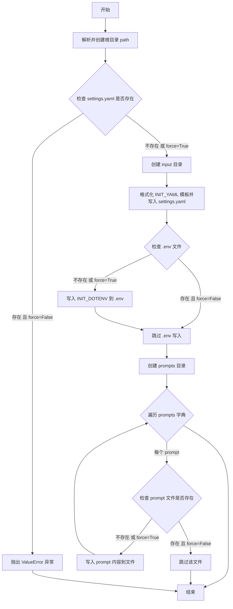

# `graphrag\packages\graphrag\graphrag\cli\initialize.py` 详细设计文档

This code implements the CLI initialization subcommand for GraphRAG, which sets up a new project at a specified path by creating the directory structure, generating configuration files (settings.yaml and .env), and populating a prompts directory with various system prompts for graph extraction, community reporting, claim extraction, and different search strategies.

## 整体流程

```mermaid
graph TD
    A[开始: initialize_project_at] --> B[解析并创建根目录]
    B --> C{settings.yaml已存在且force=false?}
    C -- 是 --> D[抛出ValueError项目已存在]
    C -- 否 --> E[创建input目录]
    E --> F[格式化INIT_YAML替换模型名称]
    F --> G[写入settings.yaml配置文件]
    G --> H{force或.env不存在?]
    H -- 是 --> I[写入.env文件]
    H -- 否 --> J[跳过.env写入]
    I --> K[创建prompts目录]
    J --> K
    K --> L[定义prompts字典]
    L --> M{遍历prompts字典}
    M --> N{force或prompt文件不存在?}
    N -- 是 --> O[写入prompt文件]
    N -- 否 --> P[跳过写入]
    O --> M
    P --> M
    M --> Q[结束]
```

## 类结构

```
CLI模块 (无类)
└── initialize_project_at 函数
```

## 全局变量及字段


### `logger`
    
用于记录初始化过程日志

类型：`logging.Logger`
    


### `initialize_project_at.root`
    
项目根目录的绝对路径

类型：`Path`
    


### `initialize_project_at.settings_yaml`
    
settings.yaml配置文件路径

类型：`Path`
    


### `initialize_project_at.input_path`
    
输入数据目录路径

类型：`Path`
    


### `initialize_project_at.formatted`
    
格式化后的YAML配置内容

类型：`str`
    


### `initialize_project_at.dotenv`
    
.env环境变量文件路径

类型：`Path`
    


### `initialize_project_at.prompts_dir`
    
prompts目录路径

类型：`Path`
    


### `initialize_project_at.prompts`
    
包含所有prompt名称和内容的字典

类型：`dict`
    
    

## 全局函数及方法


### `initialize_project_at`

初始化GraphRAG项目的主要函数，接受path/force/model/embedding_model参数，创建完整的项目结构和配置文件（包括settings.yaml、.env文件、prompts目录及各种提示词文件）。

参数：

- `path`：`Path`，项目初始化的目标路径
- `force`：`bool`，是否强制初始化（即使项目已存在）
- `model`：`str`，默认的LLMCompletion模型名称
- `embedding_model`：`str`，默认的Embedding模型名称

返回值：`None`，无返回值，该函数直接操作文件系统

#### 流程图



#### 带注释源码

```python
def initialize_project_at(
    path: Path, force: bool, model: str, embedding_model: str
) -> None:
    """
    Initialize the project at the given path.

    Parameters
    ----------
    path : Path
        The path at which to initialize the project.
    force : bool
        Whether to force initialization even if the project already exists.

    Raises
    ------
    ValueError
        If the project already exists and force is False.
    """
    # 记录初始化日志
    logger.info("Initializing project at %s", path)
    
    # 解析并创建根目录（parents=True表示创建所有必要的父目录，exist_ok=True表示目录已存在时不报错）
    root = Path(path).resolve()
    root.mkdir(parents=True, exist_ok=True)

    # 定义settings.yaml文件路径
    settings_yaml = root / "settings.yaml"
    
    # 检查项目是否已初始化，若已初始化且force为False则抛出异常
    if settings_yaml.exists() and not force:
        msg = f"Project already initialized at {root}"
        raise ValueError(msg)

    # 构建并创建input目录（默认使用graphrag_config_defaults中的base_dir或"input"）
    input_path = (
        root / (graphrag_config_defaults.input_storage.base_dir or "input")
    ).resolve()
    input_path.mkdir(parents=True, exist_ok=True)
    
    # 格式化INIT_YAML模板，替换默认模型和嵌入模型占位符
    # 注意：使用replace而非format是因为后续会用GRAPHRAG_API_KEY覆盖.env
    formatted = INIT_YAML.replace("<DEFAULT_COMPLETION_MODEL>", model).replace(
        "<DEFAULT_EMBEDDING_MODEL>", embedding_model
    )
    # 写入settings.yaml配置文件（使用strict编码处理）
    settings_yaml.write_text(formatted, encoding="utf-8", errors="strict")

    # 定义.env文件路径，若不存在或force为True则写入默认环境变量模板
    dotenv = root / ".env"
    if not dotenv.exists() or force:
        dotenv.write_text(INIT_DOTENV, encoding="utf-8", errors="strict")

    # 创建prompts目录用于存放提示词文件
    prompts_dir = root / "prompts"
    prompts_dir.mkdir(parents=True, exist_ok=True)

    # 定义所有需要写入的prompt文件映射（包含索引和查询相关的提示词）
    prompts = {
        "extract_graph": GRAPH_EXTRACTION_PROMPT,  # 图提取提示词
        "summarize_descriptions": SUMMARIZE_PROMPT,  # 描述摘要提示词
        "extract_claims": EXTRACT_CLAIMS_PROMPT,  # 声明提取提示词
        "community_report_graph": COMMUNITY_REPORT_PROMPT,  # 社区报告图提示词
        "community_report_text": COMMUNITY_REPORT_TEXT_PROMPT,  # 社区报告文本提示词
        "drift_search_system_prompt": DRIFT_LOCAL_SYSTEM_PROMPT,  # 漂移搜索系统提示词
        "drift_reduce_prompt": DRIFT_REDUCE_PROMPT,  # 漂移归约提示词
        "global_search_map_system_prompt": MAP_SYSTEM_PROMPT,  # 全局搜索映射提示词
        "global_search_reduce_system_prompt": REDUCE_SYSTEM_PROMPT,  # 全局搜索归约提示词
        "global_search_knowledge_system_prompt": GENERAL_KNOWLEDGE_INSTRUCTION,  # 全局搜索知识指令
        "local_search_system_prompt": LOCAL_SEARCH_SYSTEM_PROMPT,  # 本地搜索系统提示词
        "basic_search_system_prompt": BASIC_SEARCH_SYSTEM_PROMPT,  # 基础搜索系统提示词
        "question_gen_system_prompt": QUESTION_SYSTEM_PROMPT,  # 问题生成系统提示词
    }

    # 遍历所有prompt文件，若不存在或force为True则写入文件
    for name, content in prompts.items():
        prompt_file = prompts_dir / f"{name}.txt"
        if not prompt_file.exists() or force:
            prompt_file.write_text(content, encoding="utf-8", errors="strict")
```

## 关键组件


### 项目初始化核心函数

负责在指定路径创建一个完整的graphrag项目结构，包括配置目录、输入目录、提示词目录，并生成必要的配置文件和环境变量文件。

### 配置文件生成模块

将默认配置模板中的占位符（模型名称、嵌入模型名称）替换为实际参数值，并写入settings.yaml文件。

### 环境变量初始化模块

将预定义的环境变量模板（包含API密钥占位符）写入项目的.env文件。

### 提示词文件管理模块

负责将代码中导入的多个提示词模板（如图提取、描述摘要、声明提取、社区报告等）按名称映射并写入独立的提示词文件。

### 目录结构创建模块

确保项目根目录、输入目录、提示词目录的创建，支持parents=True以创建多层嵌套目录。

### 强制覆盖保护机制

通过force参数控制是否允许覆盖已存在的配置文件，避免误操作导致现有配置丢失。


## 问题及建议


### 已知问题

-   **字符串替换方式不安全**：使用简单的 `.replace()` 方法进行配置替换，如果模板中 `<DEFAULT_COMPLETION_MODEL>` 或 `<DEFAULT_EMBEDDING_MODEL>` 出现在其他位置（如注释或其他配置项中），会被意外替换，导致配置损坏
-   **缺乏原子性操作**：创建多个文件和目录时，如果中途发生异常（如磁盘空间不足、权限问题），项目会处于部分初始化的不完整状态，没有回滚机制
-   **路径验证缺失**：未对 `path` 参数进行有效性验证（如检查路径是否合法、是否在允许的目录范围内），可能导致安全风险
-   **硬编码的 Prompt 映射**：`prompts` 字典完全硬编码在函数内部，新增 Prompt 类型需要修改代码，违反了开闭原则
-   **重复的目录创建逻辑**：`input_path.mkdir()`、`prompts_dir.mkdir()` 与根目录创建逻辑重复，可提取为通用工具函数
-   **日志记录不足**：仅使用 `logger.info`，缺少关键操作（如文件覆盖、错误场景）的 WARNING 或 DEBUG 级别日志，不利于问题排查
-   **编码错误处理过于严格**：`errors="strict"` 会在遇到无法编码的字符时直接抛出异常，可能导致在某些环境下初始化失败
-   **配置默认值依赖隐式假设**：`graphrag_config_defaults.input_storage.base_dir or "input"` 假设配置对象必然存在且属性可访问，缺乏防御性编程

### 优化建议

-   使用正则表达式进行配置替换，或采用模板引擎（如 Jinja2）来生成配置文件，提高替换的精确性和安全性
-   实现事务性初始化机制：先在临时目录完成所有创建操作，成功后再原子性移动到目标位置，或记录操作步骤并在失败时进行清理
-   添加路径验证：检查 `path` 是否为空、是否超过最大路径长度、是否在允许的根目录范围内，防止路径遍历攻击
-   将 Prompt 映射外部化：可考虑从配置文件或插件机制加载 Prompt 列表，减少代码改动
-   提取通用的目录创建和文件写入工具函数，接受路径和覆盖策略参数，减少重复代码
-   增强日志分级：对覆盖文件操作使用 WARNING 级别，对详细调试信息使用 DEBUG 级别
-   考虑使用 `errors="replace"` 或检测系统默认编码，提高跨平台兼容性
-   添加配置验证：在写入前校验模板占位符是否被正确替换，校验生成的配置文件是否符合预期格式

## 其它


### 设计目标与约束

**设计目标**：为 GraphRAG 项目提供自动化的初始化功能，自动创建项目目录结构、配置文件（settings.yaml、.env）和提示词模板文件，降低用户入门门槛，实现开箱即用的开发体验。

**设计约束**：
- 必须支持覆盖已有配置的 force 模式
- 配置文件模板使用硬编码的默认值，仅允许通过参数替换模型名称
- 路径处理需兼容不同操作系统，使用 pathlib.Path 保证跨平台兼容性
- 所有文件操作采用 utf-8 编码和 strict 错误模式，确保写入安全

### 错误处理与异常设计

**异常类型**：
- `ValueError`：当项目已存在且 force=False 时抛出，包含明确的错误消息说明冲突路径

**错误处理策略**：
- 使用 `Path.mkdir(parents=True, exist_ok=True)` 创建目录，忽略已存在的目录
- 文件写入前检查存在性，结合 force 参数决定是否覆盖
- 捕获并记录日志信息，使用 logging 模块记录初始化进度
- 错误消息采用人类可读格式，包含具体路径信息便于定位问题

**边界条件**：
- 根路径不存在时自动创建父目录
- prompts 目录中的文件独立检查存在性，支持部分覆盖

### 数据流与状态机

**数据流向**：
1. 输入：path (Path), force (bool), model (str), embedding_model (str)
2. 处理：解析路径 → 检查冲突 → 创建目录结构 → 格式化配置 → 写入文件
3. 输出：无返回值，仅产生文件系统副作用

**关键状态节点**：
- 初始状态：检查 settings.yaml 是否存在
- 判断状态：根据 force 参数决定是否允许覆盖
- 创建状态：依次创建 input 目录、settings.yaml、.env、prompts 目录及文件

**状态转换条件**：
- 若 settings.yaml 存在且 force=False → 抛出 ValueError
- 若 settings.yaml 不存在或 force=True → 继续执行创建流程

### 外部依赖与接口契约

**直接依赖**：
- `pathlib.Path`：路径操作和文件系统交互
- `logging`：日志记录功能
- `graphrag.config.defaults.graphrag_config_defaults`：获取默认配置路径
- `graphrag.config.init_content`：获取初始配置文件模板（INIT_YAML、INIT_DOTENV）
- `graphrag.prompts.*`：获取各类提示词模板内容

**接口契约**：
- 函数签名：`initialize_project_at(path: Path, force: bool, model: str, embedding_model: str) -> None`
- 输入验证：path 必须为有效路径，force 必须为布尔值，model 和 embedding_model 必须为非空字符串
- 副作用：创建目录和文件，无返回值
- 异常传播：可能抛出 ValueError 和 IOError（文件写入失败时）

### 安全考虑

**写入安全**：
- 使用 `errors='strict'` 参数，任何编码错误立即抛出异常
- 文件写入采用完整覆盖模式，避免追加导致的内容混淆
- .env 文件可能包含敏感信息，需注意文件权限设置（代码中未实现权限控制）

**路径安全**：
- 使用 `resolve()` 将相对路径转换为绝对路径，防止路径注入攻击
- 创建目录时使用 `parents=True` 确保完整路径创建

### 性能考虑

**性能特征**：
- 初始化操作顺序执行，无并发优化
- 文件写入为同步阻塞操作
- 提示词内容较大（多个模板），单次初始化涉及约 13 个文件写入

**优化建议**：
- 可考虑使用异步文件写入提升大规模项目初始化性能
- 提示词内容可考虑压缩存储，减少 IO 次数

### 兼容性设计

**Python 版本**：需 Python 3.10+（支持 pathlib 的现代用法）

**平台兼容**：
- 使用 pathlib.Path 实现跨平台路径操作
- 目录分隔符由操作系统自动处理

**依赖版本**：无严格版本约束，依赖上游模块的稳定性

### 日志与监控设计

**日志级别**：
- INFO 级别：记录初始化开始和成功完成
- 异常堆栈：由调用方捕获并记录

**日志格式**：
- 使用标准 logging 模块格式
- 包含动态路径信息：`Initializing project at %s`

### 部署与运维

**部署方式**：作为 CLI 命令集成到 graphrag 包中，通过命令行调用

**运维考量**：
- 初始化后的配置文件需用户手动填写 API Key
- prompts 目录支持用户自定义修改，不影响核心功能

### 测试策略建议

**单元测试**：
- 测试路径解析和目录创建逻辑
- 测试文件存在性检查和覆盖逻辑
- 测试配置格式化替换功能

**集成测试**：
- 测试真实文件系统操作
- 测试权限拒绝场景
- 测试跨平台路径处理


    