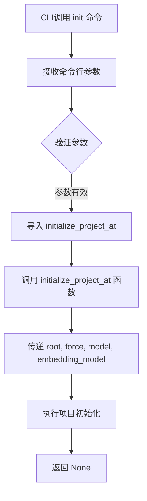
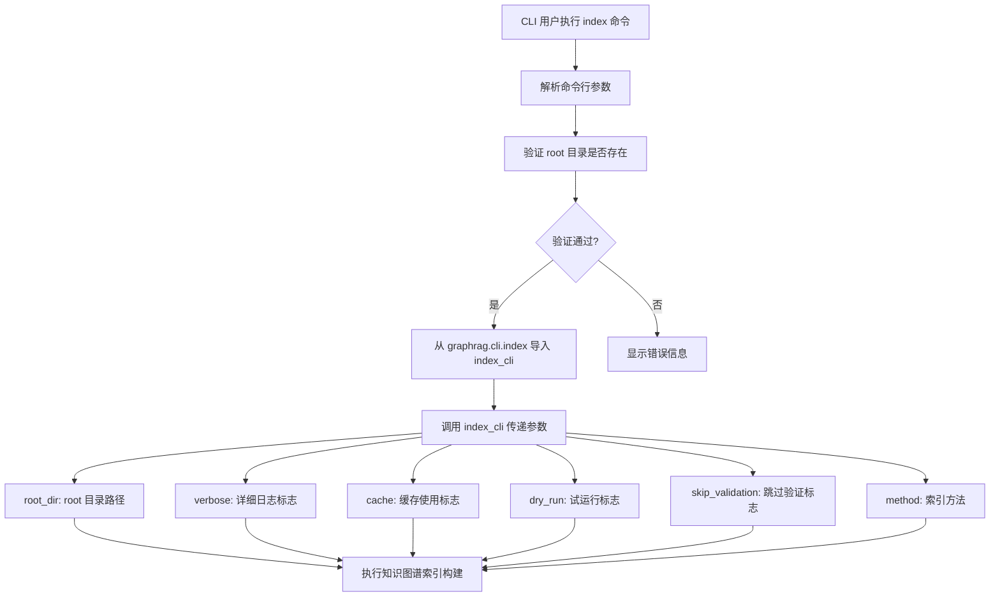
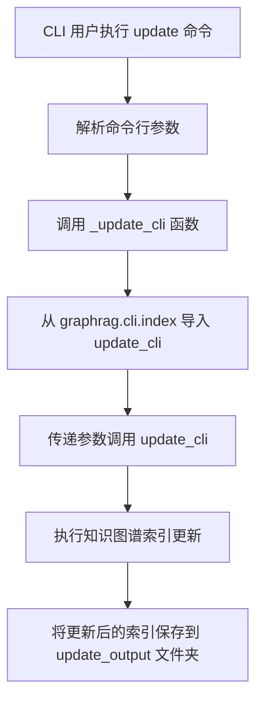
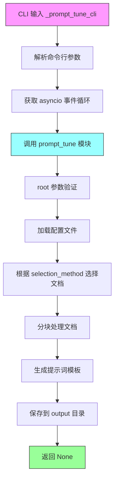
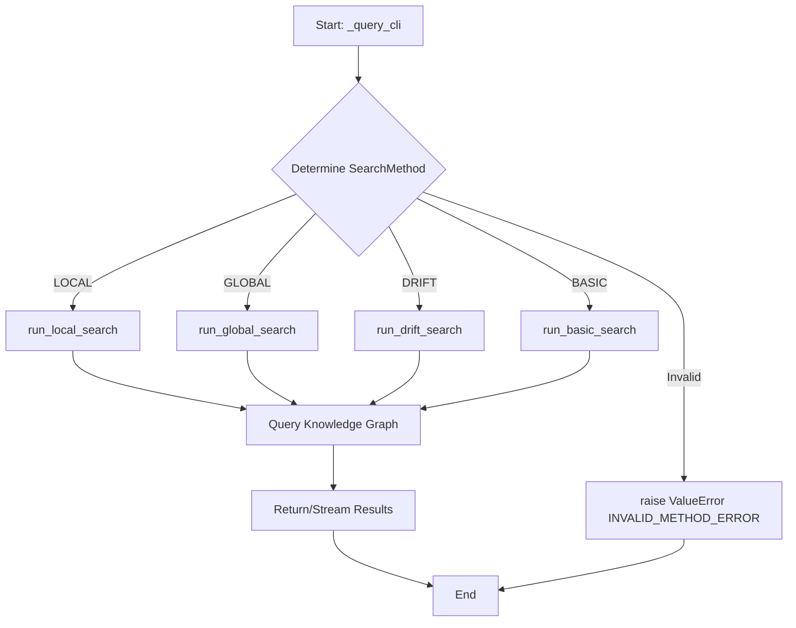

# `graphrag\packages\graphrag\graphrag\cli\main.py` 详细设计文档

GraphRAG系统的命令行入口点（CLI），基于Typer框架构建，提供了初始化项目、构建索引、更新索引、提示词优化以及通过全局、本地、漂移或基本搜索方法查询知识图谱的完整命令集。

## 整体流程

```mermaid
graph TD
    User[用户执行 CLI 命令] --> Typer[Typer App (graphrag.cli)]
    Typer --> Init[init 命令]
    Typer --> Index[index 命令]
    Typer --> Update[update 命令]
    Typer --> PromptTune[prompt-tune 命令]
    Typer --> Query[query 命令]
    Init --> InitModule[graphrag.cli.initialize]
    Index --> IndexModule[graphrag.cli.index]
    Update --> UpdateModule[graphrag.cli.index (update_cli)]
    PromptTune --> PromptTuneModule[graphrag.cli.prompt_tune]
    Query --> QueryModule[graphrag.cli.query]
    Query --> MethodRouter{路由 SearchMethod}
    MethodRouter --> Local[run_local_search]
    MethodRouter --> Global[run_global_search]
    MethodRouter --> Drift[run_drift_search]
    MethodRouter --> Basic[run_basic_search]
```

## 类结构

```
graphrag_cli (模块)
├── Typer App (应用主体)
├── 全局变量/常量
│   ├── INVALID_METHOD_ERROR
│   ├── CONFIG_AUTOCOMPLETE
│   └── ROOT_AUTOCOMPLETE
└── 命令函数 (Commands)
    ├── _initialize_cli (init)
    ├── _index_cli (index)
    ├── _update_cli (update)
    ├── _prompt_tune_cli (prompt-tune)
    └── _query_cli (query)
```

## 全局变量及字段


### `app`
    
GraphRAG CLI应用程序的主入口，提供了命令行界面的基础配置和命令注册功能

类型：`typer.Typer`
    


### `INVALID_METHOD_ERROR`
    
无效查询方法错误消息常量，用于在收到未知SearchMethod时抛出异常

类型：`str`
    


### `CONFIG_AUTOCOMPLETE`
    
配置文件自动补全函数，用于CLI参数自动补全YAML配置文件路径

类型：`Callable[[str], list[str]]`
    


### `ROOT_AUTOCOMPLETE`
    
根目录自动补全函数，用于CLI参数自动补全项目根目录路径

类型：`Callable[[str], list[str]]`
    


    

## 全局函数及方法


### `path_autocomplete`

该函数是一个用于 CLI 自动补全的工具函数，主要用于为 Typer 命令行工具提供文件路径和目录路径的自动补全功能。它通过接受多个过滤参数（文件/目录类型、可读/可写权限、通配符匹配）来生成一个符合条件要求的路径补全器（completer），该补全器可以列出当前目录中匹配的用户输入前缀的所有有效路径。

参数：

- `file_okay`：`bool`，是否允许补全文件路径，默认为 True
- `dir_okay`：`bool`，是否允许补全目录路径，默认为 True
- `readable`：`bool`，补全结果是否需要具有可读权限，默认为 True
- `writable`：`bool`，补全结果是否需要具有可写权限，默认为 False
- `match_wildcard`：`str | None`，用于过滤补全结果的通配符模式，默认为 None

返回值：`Callable[[str], list[str]]`，返回一个 completer 函数，该函数接受用户输入的不完整字符串，返回匹配的所有路径名称列表

#### 流程图

```mermaid
flowchart TD
    A[调用 path_autocomplete] --> B{传入参数}
    B --> C[设置过滤条件<br/>file_okay, dir_okay<br/>readable, writable<br/>match_wildcard]
    
    C --> D[返回 completer 闭包函数]
    
    D --> E[用户触发自动补全<br/>输入 incomplete 字符串]
    
    E --> F[获取当前目录所有条目<br/>Path.iterdir()]
    
    F --> G{遍历每个条目}
    
    G -->|是文件且 file_okay=False| H1[跳过]
    G -->|是目录且 dir_okay=False| H2[跳过]
    G -->|需要可读但无权限| H3[跳过]
    G -->|需要可写但无权限| H4[跳过]
    
    H1 --> I
    H2 --> I
    H3 --> I
    H4 --> I
    G -->|通过所有过滤| I[添加到候选项]
    
    I --> J{有 match_wildcard?}
    J -->|是| K[应用通配符匹配<br/>wildcard_match 过滤]
    J -->|否| L[直接使用候选项]
    
    K --> L
    L --> M[过滤前缀匹配<br/>i.startswith(incomplete)]
    
    M --> N[返回补全列表]
    
    style A fill:#e1f5fe
    style D fill:#e8f5e8
    style N fill:#fff3e0
```

#### 带注释源码

```python
def path_autocomplete(
    file_okay: bool = True,
    dir_okay: bool = True,
    readable: bool = True,
    writable: bool = False,
    match_wildcard: str | None = None,
) -> Callable[[str], list[str]]:
    """Autocomplete file and directory paths.
    
    该函数创建一个用于 CLI 自动补全的路径补全器。
    它返回一个新的 completer 函数，该函数可以过滤当前目录下的文件/目录，
    并根据提供的条件返回匹配的补全项。
    
    参数:
        file_okay: 是否允许补全文件
        dir_okay: 是否允许补全目录
        readable: 是否要求路径可读
        writable: 是否要求路径可写
        match_wildcard: 用于过滤结果的通配符模式（支持 ? 和 *）
    
    返回:
        一个 completer 函数，接受不完整的输入字符串，返回匹配的路径列表
    """
    
    def wildcard_match(string: str, pattern: str) -> bool:
        """将通配符模式转换为正则表达式进行匹配
        
        将用户友好的通配符 (? 和 *) 转换为正则表达式:
        - ? 转换为 . (匹配任意单个字符)
        - * 转换为 .* (匹配任意序列)
        
        参数:
            string: 要匹配的字符串
            pattern: 通配符模式
            
        返回:
            如果字符串完全匹配模式返回 True，否则返回 False
        """
        # 转义特殊字符，将通配符转换为正则表达式
        regex = re.escape(pattern).replace(r"\?", ".").replace(r"\*", ".*")
        # 使用完整匹配
        return re.fullmatch(regex, string) is not None

    from pathlib import Path

    def completer(incomplete: str) -> list[str]:
        """路径补全器函数
        
        这是实际执行的补全函数，它会:
        1. 遍历当前目录的所有条目
        2. 根据 file_okay, dir_okay, readable, writable 进行过滤
        3. 如果指定了 match_wildcard，应用通配符匹配
        4. 返回以 incomplete 开头的所有补全项
        
        参数:
            incomplete: 用户输入的不完整的路径字符串
            
        返回:
            匹配的路径名称列表
        """
        # List items in the current directory as Path objects
        # 获取当前目录的所有条目
        items = Path().iterdir()
        completions = []

        for item in items:
            # Filter based on file/directory properties
            # 如果不允许文件且当前项是文件，跳过
            if not file_okay and item.is_file():
                continue
            # 如果不允许目录且当前项是目录，跳过
            if not dir_okay and item.is_dir():
                continue
            # 如果要求可读权限但当前项不可读，跳过
            if readable and not os.access(item, os.R_OK):
                continue
            # 如果要求可写权限但当前项不可写，跳过
            if writable and not os.access(item, os.W_OK):
                continue

            # Append the name of the matching item
            # 将匹配的项名称添加到候选项
            completions.append(item.name)

        # Apply wildcard matching if required
        # 如果指定了通配符模式，应用过滤
        if match_wildcard:
            completions = filter(
                lambda i: (
                    wildcard_match(i, match_wildcard) if match_wildcard else False
                ),
                completions,
            )

        # Return completions that start with the given incomplete string
        # 返回以用户输入的开头的所有补全项
        return [i for i in completions if i.startswith(incomplete)]

    # 返回补全器函数
    return completer
```


### `_initialize_cli`

这是一个CLI命令处理函数，用于初始化GraphRAG项目。它接收项目根目录、模型配置和强制覆盖标志，并将这些参数传递给`initialize_project_at`函数来生成默认配置文件。

参数：

- `root`：`Path`，项目根目录，默认值为当前工作目录，支持目录补全
- `model`：`str`，默认聊天模型，用于生成配置
- `embedding_model`：`str`，默认嵌入模型，用于生成配置
- `force`：`bool`，是否强制初始化，即使项目已存在也覆盖

返回值：`None`，该函数无返回值，仅执行副作用操作

#### 流程图



#### 带注释源码

```python
@app.command("init")  # 定义typer命令，命令名为"init"
def _initialize_cli(
    root: Path = typer.Option(
        Path.cwd(),           # 默认值为当前工作目录
        "--root",             # 长选项名
        "-r",                 # 短选项名
        help="The project root directory.",  # 帮助文本
        dir_okay=True,        # 允许目录参数
        writable=True,        # 需要可写权限
        file_okay=False,      # 不允许文件参数
        resolve_path=True,   # 解析为绝对路径
        autocompletion=ROOT_AUTOCOMPLETE,  # 启用目录自动补全
    ),
    model: str = typer.Option(
        DEFAULT_COMPLETION_MODEL,  # 从配置导入的默认模型
        "--model",
        "-m",
        prompt="Specify the default chat model to use",  # 交互式提示
    ),
    embedding_model: str = typer.Option(
        DEFAULT_EMBEDDING_MODEL,  # 从配置导入的默认嵌入模型
        "--embedding",
        "-e",
        prompt="Specify the default embedding model to use",
    ),
    force: bool = typer.Option(
        False,           # 默认不强制覆盖
        "--force",
        "-f",
        help="Force initialization even if the project already exists.",  # 强制覆盖已有项目
    ),
) -> None:
    """Generate a default configuration file."""  # 命令帮助文档
    from graphrag.cli.initialize import initialize_project_at  # 延迟导入初始化函数

    # 调用项目初始化函数，传入所有收集的参数
    initialize_project_at(
        path=root,
        force=force,
        model=model,
        embedding_model=embedding_model,
    )
```


### `_index_cli`

该函数是 GraphRAG CLI 的索引命令入口点，用于构建知识图谱索引。它接收项目根目录、索引方法、详细日志输出、试运行、缓存使用和验证跳过等选项，并将这些参数传递给 `graphrag.cli.index` 模块中的 `index_cli` 函数执行实际的索引操作。

参数：

-  `root`：`Path`，项目根目录，默认为当前工作目录
-  `method`：`IndexingMethod`，索引方法，默认为 Standard 方法
-  `verbose`：`bool`，是否启用详细日志输出
-  `dry_run`：`bool`，是否仅验证配置而不执行索引步骤
-  `cache`：`bool`，是否使用 LLM 缓存，默认为 True
-  `skip_validation`：`bool`，是否跳过预检验证

返回值：`None`，该函数无返回值，通过调用下游函数执行索引操作

#### 流程图



#### 带注释源码

```python
@app.command("index")  # 注册为 'index' 子命令
def _index_cli(
    # root: 项目根目录选项
    root: Path = typer.Option(
        Path.cwd(),           # 默认值为当前工作目录
        "--root",
        "-r",
        help="The project root directory.",
        exists=True,          # 验证目录必须存在
        dir_okay=True,        # 允许目录
        file_okay=False,      # 不允许文件
        writable=True,        # 必须可写
        resolve_path=True,    # 解析为绝对路径
        autocompletion=ROOT_AUTOCOMPLETE,  # 启用路径自动补全
    ),
    # method: 索引方法选项
    method: IndexingMethod = typer.Option(
        IndexingMethod.Standard.value,  # 默认使用标准索引方法
        "--method",
        "-m",
        help="The indexing method to use.",
    ),
    # verbose: 详细日志选项
    verbose: bool = typer.Option(
        False,
        "--verbose",
        "-v",
        help="Run the indexing pipeline with verbose logging",
    ),
    # dry_run: 试运行选项，用于验证配置
    dry_run: bool = typer.Option(
        False,
        "--dry-run",
        help=(
            "Run the indexing pipeline without executing any steps "
            "to inspect and validate the configuration."
        ),
    ),
    # cache: LLM 缓存选项
    cache: bool = typer.Option(
        True,                 # 默认启用缓存
        "--cache/--no-cache",  # 支持布尔标志形式
        help="Use LLM cache.",
    ),
    # skip_validation: 跳过验证选项
    skip_validation: bool = typer.Option(
        False,
        "--skip-validation",
        help="Skip any preflight validation. Useful when running no LLM steps.",
    ),
) -> None:
    """Build a knowledge graph index."""  # 命令描述文档字符串
    # 延迟导入 index_cli 模块，避免顶层导入性能开销
    from graphrag.cli.index import index_cli

    # 调用实际的索引 CLI 函数，传递所有接收到的参数
    index_cli(
        root_dir=root,
        verbose=verbose,
        cache=cache,
        dry_run=dry_run,
        skip_validation=skip_validation,
        method=method,
    )
```


### `_update_cli`

该函数是 GraphRAG CLI 的 `update` 命令入口点，用于更新现有的知识图谱索引。它接受多个命令行参数，包括项目根目录、索引方法、详细日志、缓存使用和验证跳过选项，然后将参数传递给 `graphrag.cli.index` 模块中的 `update_cli` 函数执行实际的索引更新操作。

参数：

- `root`：`Path`，项目根目录，默认为当前工作目录，支持目录自动补全
- `method`：`IndexingMethod`，索引方法，默认为 Standard.value
- `verbose`：`bool`，是否运行带详细日志的索引管道，默认为 False
- `cache`：`bool`，是否使用 LLM 缓存，默认为 True
- `skip_validation`：`bool`，是否跳过预检验证，默认为 False

返回值：`None`，无返回值

#### 流程图



#### 带注释源码

```python
@app.command("update")  # 使用 typer 装饰器注册为 'update' 命令
def _update_cli(
    root: Path = typer.Option(  # 项目根目录选项
        Path.cwd(),
        "--root",
        "-r",
        help="The project root directory.",
        exists=True,
        dir_okay=True,
        file_okay=False,
        writable=True,
        resolve_path=True,
        autocompletion=ROOT_AUTOCOMPLETE,
    ),
    method: IndexingMethod = typer.Option(  # 索引方法选项
        IndexingMethod.Standard.value,
        "--method",
        "-m",
        help="The indexing method to use.",
    ),
    verbose: bool = typer.Option(  # 详细日志选项
        False,
        "--verbose",
        "-v",
        help="Run the indexing pipeline with verbose logging.",
    ),
    cache: bool = typer.Option(  # LLM 缓存选项
        True,
        "--cache/--no-cache",
        help="Use LLM cache.",
    ),
    skip_validation: bool = typer.Option(  # 跳过验证选项
        False,
        "--skip-validation",
        help="Skip any preflight validation. Useful when running no LLM steps.",
    ),
) -> None:
    """
    Update an existing knowledge graph index.

    Applies a default output configuration (if not provided by config), 
    saving the new index to the local file system in the `update_output` folder.
    """
    # 延迟导入避免循环依赖
    from graphrag.cli.index import update_cli

    # 调用实际的索引更新逻辑
    update_cli(
        root_dir=root,
        verbose=verbose,
        cache=cache,
        skip_validation=skip_validation,
        method=method,
    )
```


### `_prompt_tune_cli`

该函数是 GraphRAG CLI 的提示调优命令入口点，通过 Typer 框架定义了一系列命令行选项，用于配置提示词生成的各种参数，最终调用 `prompt_tune` 模块执行实际的提示调优逻辑。

参数：

-  `root`：`Path`，项目根目录，默认为当前工作目录
-  `verbose`：`bool`，是否启用详细日志记录
-  `domain`：`str | None`，数据相关领域，如 "space science"、"microbiology" 等，若未定义则从输入数据中推断
-  `selection_method`：`DocSelectionType`，文本块选择方法，默认为随机选择
-  `n_subset_max`：`int`，当选择方法为 auto 时嵌入的文本块数量
-  `k`：`int`，当选择方法为 auto 时每个质心选择的最多文档数
-  `limit`：`int`，当选择方法为 random 或 top 时加载的文档数量
-  `max_tokens`：`int`，提示生成的最大 token 数量
-  `min_examples_required`：`int`，实体提取提示中最少需要生成的示例数量
-  `chunk_size`：`int`，每个示例文本块的大小，可覆盖配置文件中的 chunking.size
-  `overlap`：`int`，文档分块的重叠大小，可覆盖配置文件中的 chunking.overlap
-  `language`：`str | None`，GraphRAG 提示中输入输出的主要语言
-  `discover_entity_types`：`bool`，是否发现和提取未指定的实体类型
-  `output`：`Path`，保存提示词的目录，默认为 "prompts"，相对于项目根目录

返回值：`None`，该函数通过副作用完成操作，将生成的提示词写入指定目录

#### 流程图



#### 带注释源码

```python
@app.command("prompt-tune")
def _prompt_tune_cli(
    # 项目根目录选项
    root: Path = typer.Option(
        Path.cwd(),  # 默认为当前工作目录
        "--root",
        "-r",
        help="The project root directory.",
        exists=True,  # 目录必须存在
        dir_okay=True,
        file_okay=False,
        writable=True,  # 必须可写
        resolve_path=True,
        autocompletion=ROOT_AUTOCOMPLETE,  # 目录自动补全
    ),
    # 详细日志选项
    verbose: bool = typer.Option(
        False,
        "--verbose",
        "-v",
        help="Run the prompt tuning pipeline with verbose logging.",
    ),
    # 数据领域选项
    domain: str | None = typer.Option(
        None,
        "--domain",
        help=(
            "The domain your input data is related to. "
            "For example 'space science', 'microbiology', 'environmental news'. "
            "If not defined, a domain will be inferred from the input data."
        ),
    ),
    # 文档选择方法选项
    selection_method: DocSelectionType = typer.Option(
        DocSelectionType.RANDOM.value,
        "--selection-method",
        help="The text chunk selection method.",
    ),
    # 最大子集数量选项
    n_subset_max: int = typer.Option(
        N_SUBSET_MAX,  # 从默认值模块导入
        "--n-subset-max",
        help="The number of text chunks to embed when --selection-method=auto.",
    ),
    # K 值选项
    k: int = typer.Option(
        K,  # 从默认值模块导入
        "--k",
        help="The maximum number of documents to select from each centroid when --selection-method=auto.",
    ),
    # 文档数量限制选项
    limit: int = typer.Option(
        LIMIT,  # 从默认值模块导入
        "--limit",
        help="The number of documents to load when --selection-method={random,top}.",
    ),
    # 最大 token 数量选项
    max_tokens: int = typer.Option(
        MAX_TOKEN_COUNT,  # 从默认值模块导入
        "--max-tokens",
        help="The max token count for prompt generation.",
    ),
    # 最少示例数量选项
    min_examples_required: int = typer.Option(
        2,
        "--min-examples-required",
        help="The minimum number of examples to generate/include in the entity extraction prompt.",
    ),
    # 块大小选项
    chunk_size: int = typer.Option(
        graphrag_config_defaults.chunking.size,  # 从配置默认值获取
        "--chunk-size",
        help="The size of each example text chunk. Overrides chunking.size in the configuration file.",
    ),
    # 重叠大小选项
    overlap: int = typer.Option(
        graphrag_config_defaults.chunking.overlap,  # 从配置默认值获取
        "--overlap",
        help="The overlap size for chunking documents. Overrides chunking.overlap in the configuration file.",
    ),
    # 语言选项
    language: str | None = typer.Option(
        None,
        "--language",
        help="The primary language used for inputs and outputs in graphrag prompts.",
    ),
    # 发现实体类型选项
    discover_entity_types: bool = typer.Option(
        True,
        "--discover-entity-types/--no-discover-entity-types",
        help="Discover and extract unspecified entity types.",
    ),
    # 输出目录选项
    output: Path = typer.Option(
        Path("prompts"),  # 默认为 prompts 目录
        "--output",
        "-o",
        help="The directory to save prompts to, relative to the project root directory.",
        dir_okay=True,
        writable=True,
        resolve_path=True,
    ),
) -> None:
    """Generate custom graphrag prompts with your own data (i.e. auto templating)."""
    # 导入 asyncio 模块用于异步执行
    import asyncio

    # 导入实际的 prompt_tune 实现函数
    from graphrag.cli.prompt_tune import prompt_tune

    # 获取事件循环并执行异步的 prompt_tune 函数
    loop = asyncio.get_event_loop()
    loop.run_until_complete(
        prompt_tune(
            root=root,
            domain=domain,
            verbose=verbose,
            selection_method=selection_method,
            limit=limit,
            max_tokens=max_tokens,
            chunk_size=chunk_size,
            overlap=overlap,
            language=language,
            discover_entity_types=discover_entity_types,
            output=output,
            n_subset_max=n_subset_max,
            k=k,
            min_examples_required=min_examples_required,
        )
    )
```


### `_query_cli`

Query a knowledge graph index. This CLI command serves as the entry point for querying a GraphRAG knowledge graph index. It accepts a user query string and various configuration options (such as the search method, root directory, data directory, community level, etc.), then dispatches to the appropriate search implementation (`run_local_search`, `run_global_search`, `run_drift_search`, or `run_basic_search`) based on the selected search method, handling streaming and verbose logging as needed.

参数：

- `query`：`str`，The query to execute.（位置参数）
- `root`：`Path`，The project root directory.（选项，默认为 `Path.cwd()`）
- `method`：`SearchMethod`，The query algorithm to use.（选项，默认为 `SearchMethod.GLOBAL.value`）
- `verbose`：`bool`，Run the query with verbose logging.（选项，默认为 `False`）
- `data`：`Path | None`，Index output directory (contains the parquet files).（选项，默认为 `None`）
- `community_level`：`int`，Leiden hierarchy level from which to load community reports. Higher values represent smaller communities.（选项，默认为 `2`）
- `dynamic_community_selection`：`bool`，Use global search with dynamic community selection.（选项，默认为 `False`）
- `response_type`：`str`，Free-form description of the desired response format (e.g. 'Single Sentence', 'List of 3-7 Points', etc.).（选项，默认为 `"Multiple Paragraphs"`）
- `streaming`：`bool`，Print the response in a streaming manner.（选项，默认为 `False`）

返回值：`None`，无返回值。该函数通过 side effect（打印输出或流式输出）将查询结果返回给用户。

#### 流程图



#### 带注释源码

```python
@app.command("query")
def _query_cli(
    query: str = typer.Argument(
        help="The query to execute.",
    ),
    root: Path = typer.Option(
        Path.cwd(),
        "--root",
        "-r",
        help="The project root directory.",
        exists=True,
        dir_okay=True,
        file_okay=False,
        writable=True,
        resolve_path=True,
        autocompletion=ROOT_AUTOCOMPLETE,
    ),
    method: SearchMethod = typer.Option(
        SearchMethod.GLOBAL.value,
        "--method",
        "-m",
        help="The query algorithm to use.",
    ),
    verbose: bool = typer.Option(
        False,
        "--verbose",
        "-v",
        help="Run the query with verbose logging.",
    ),
    data: Path | None = typer.Option(
        None,
        "--data",
        "-d",
        help="Index output directory (contains the parquet files).",
        exists=True,
        dir_okay=True,
        readable=True,
        resolve_path=True,
        autocompletion=ROOT_AUTOCOMPLETE,
    ),
    community_level: int = typer.Option(
        2,
        "--community-level",
        help=(
            "Leiden hierarchy level from which to load community reports. "
            "Higher values represent smaller communities."
        ),
    ),
    dynamic_community_selection: bool = typer.Option(
        False,
        "--dynamic-community-selection/--no-dynamic-selection",
        help="Use global search with dynamic community selection.",
    ),
    response_type: str = typer.Option(
        "Multiple Paragraphs",
        "--response-type",
        help=(
            "Free-form description of the desired response format "
            "(e.g. 'Single Sentence', 'List of 3-7 Points', etc.)."
        ),
    ),
    streaming: bool = typer.Option(
        False,
        "--streaming/--no-streaming",
        help="Print the response in a streaming manner.",
    ),
) -> None:
    """Query a knowledge graph index."""
    # 导入具体的搜索实现函数
    # 这些函数在命令执行时才导入，以延迟加载依赖
    from graphrag.cli.query import (
        run_basic_search,
        run_drift_search,
        run_global_search,
        run_local_search,
    )

    # 使用 Typer 的 match-case 语句根据搜索方法分发到不同的搜索实现
    # SearchMethod 是枚举类型，包含 LOCAL, GLOBAL, DRIFT, BASIC 四种搜索算法
    match method:
        case SearchMethod.LOCAL:
            # 本地搜索：适用于需要精确实体关联的查询
            run_local_search(
                data_dir=data,
                root_dir=root,
                community_level=community_level,
                response_type=response_type,
                streaming=streaming,
                query=query,
                verbose=verbose,
            )
        case SearchMethod.GLOBAL:
            # 全局搜索：适用于需要综合整个知识图谱的聚合查询
            run_global_search(
                data_dir=data,
                root_dir=root,
                community_level=community_level,
                dynamic_community_selection=dynamic_community_selection,
                response_type=response_type,
                streaming=streaming,
                query=query,
                verbose=verbose,
            )
        case SearchMethod.DRIFT:
            # 漂移搜索：适用于探索性、多跳的复杂查询
            run_drift_search(
                data_dir=data,
                root_dir=root,
                community_level=community_level,
                streaming=streaming,
                response_type=response_type,
                query=query,
                verbose=verbose,
            )
        case SearchMethod.BASIC:
            # 基础搜索：适用于简单的关键词匹配查询
            run_basic_search(
                data_dir=data,
                root_dir=root,
                response_type=response_type,
                streaming=streaming,
                query=query,
                verbose=verbose,
            )
        case _:
            # 未知搜索方法时抛出异常
            # 这是一个防御性编程实践，确保只有有效的搜索方法被接受
            raise ValueError(INVALID_METHOD_ERROR)
```

## 关键组件


### Typer CLI 应用框架

基于 Typer 框架构建的命令行应用程序，提供 GraphRAG 系统的 CLI 接口，支持自动帮助信息和参数自动补全功能。

### 路径自动补全功能 (path_autocomplete)

提供文件/目录路径的自动补全能力，支持通配符匹配、读写权限过滤和文件类型过滤，通过正则表达式实现灵活的匹配逻辑。

### 初始化命令 (_initialize_cli)

对应 "init" 命令，用于在指定根目录下生成默认的 GraphRAG 配置文件，支持自定义聊天模型和嵌入模型，以及强制覆盖选项。

### 索引构建命令 (_index_cli)

对应 "index" 命令，用于构建知识图谱索引，支持多种索引方法（Standard 等）、详细日志输出、缓存控制和配置验证预览功能。

### 索引更新命令 (_update_cli)

对应 "update" 命令，用于更新已存在的知识图谱索引，将新索引保存到本地文件系统的 update_output 文件夹中。

### 提示调优命令 (_prompt_tune_cli)

对应 "prompt-tune" 命令，用于使用自有数据生成自定义的 GraphRAG 提示词（自动模板化），支持多种文档选择方法、领域推断和自定义输出目录。

### 查询命令 (_query_cli)

对应 "query" 命令，用于查询知识图谱索引，支持多种查询算法（LOCAL、GLOBAL、DRIFT、BASIC），流式输出响应，以及社区层级动态选择功能。

### 惰性加载模式

通过在函数内部导入模块（如 `from graphrag.cli.initialize import initialize_project_at`），实现延迟加载依赖模块，优化启动时间和减少不必要的导入。

### 异步处理机制

在 prompt-tune 命令中使用 `asyncio.get_event_loop()` 和 `run_until_complete` 执行异步的提示调优管道。

### 配置自动补全 (CONFIG_AUTOCOMPLETE)

提供 YAML 配置文件路径的自动补全，限制只显示 .yaml 扩展名的文件。

### 根目录自动补全 (ROOT_AUTOCOMPLETE)

提供目录路径的自动补全，限制只显示目录且具有写权限的路径。


## 问题及建议


### 已知问题

-   **路径补全性能问题**：`path_autocomplete` 中的 `items = Path().iterdir()` 每次调用都会重新遍历当前目录，在文件数量较多时可能导致补全响应缓慢，且仅返回文件名而非完整路径，可能导致某些场景下路径解析问题。
-   **异步调用方式过时**：`prompt_tune_cli` 使用 `asyncio.get_event_loop()` 和 `run_until_complete()` 是较老的 Python 异步用法，在 Python 3.10+ 中推荐使用 `asyncio.run()`。
-   **缺乏异常处理**：CLI 命令函数（如 `_initialize_cli`、`_index_cli`、`_query_cli` 等）直接调用底层函数但未进行异常捕获，可能导致未处理的异常直接输出给用户，体验不佳。
-   **代码重复**：多个命令（`_index_cli`、`_update_cli`、`_query_cli` 等）中的 `root` 参数定义几乎完全相同，`verbose`、`cache`、`skip_validation` 等选项也在多处重复定义。
-   **内层导入**：`path_autocomplete` 函数内部有 `from pathlib import Path` 的导入，虽然是延迟导入但可读性欠佳，应统一到文件顶部。
-   **match 语句错误处理不完善**：`_query_cli` 中使用 match-case 处理 SearchMethod，但对无效方法仅抛出 ValueError，没有针对 Typer 的优雅错误提示。

### 优化建议

-   将 `root` 参数和通用选项提取为共享的 Typer 回调或使用装饰器模式，减少代码重复。
-   将 `path_autocomplete` 改为缓存目录列表或添加可选参数支持指定目录。
-   使用 `asyncio.run()` 替换 `get_event_loop().run_until_complete()` 以遵循现代 Python 最佳实践。
-   为 CLI 命令添加全局异常处理中间件或使用 Typer 的 `exception_handler` 机制。
-   将 `from pathlib import Path` 移至文件顶部导入。
-   在 match-case 的默认分支使用 `typer.BadParameter` 替代 `ValueError` 以提供更友好的错误信息。
-   考虑为频繁使用的选项组创建 Typer 回调，减少每个命令函数的参数列表长度。


## 其它


### 设计目标与约束

本CLI工具的设计目标是提供一个统一的命令行接口，用于管理GraphRAG项目的完整生命周期，包括初始化、索引构建、索引更新、提示词调优和知识图谱查询。约束条件包括：必须依赖typer框架构建CLI、必须支持路径自动补全功能、必须支持YAML配置文件、命令执行目录必须为项目根目录。

### 错误处理与异常设计

CLI层的错误处理主要依赖于typer框架的异常捕获机制。在`_query_cli`函数中，通过模式匹配处理未知搜索方法时抛出`ValueError(INVALID_METHOD_ERROR)`。其他错误（如文件不存在、权限不足等）由typer自动处理并显示友好错误信息。关键异常包括：`ValueError`用于非法方法参数、`TyperException`用于参数验证失败、导入错误用于处理可选依赖。

### 外部依赖与接口契约

核心依赖包括：typer（CLI框架）、pathlib（路径处理）、os和re（系统操作和正则匹配）。外部接口契约包括：初始化命令调用`graphrag.cli.initialize.initialize_project_at`函数，索引命令调用`graphrag.cli.index.index_cli`和`graphrag.cli.index.update_cli`函数，查询命令调用四个搜索函数（run_local_search、run_global_search、run_drift_search、run_basic_search），提示词调优调用`graphrag.cli.prompt_tune.prompt_tune`异步函数。所有CLI命令共享相同的root参数作为项目根目录约定。

### 配置管理

CLI工具使用typer的Option装饰器定义配置参数，支持默认值、命令行提示、路径解析和自动补全。配置来源包括：代码内硬编码的默认值（如DEFAULT_COMPLETION_MODEL、DEFAULT_EMBEDDING_MODEL）、graphrag_config_defaults对象中的配置、用户通过命令行显式传递的参数。配置自动补全支持YAML文件过滤（*.yaml）和目录选择。

### 安全考虑

路径访问控制通过`os.access()`函数实现，支持读/写权限检查。`readable`和`writable`参数控制是否执行权限验证。`exists=True`确保索引和查询命令引用的目录必须存在，防止操作不存在的路径。`resolve_path=True`将相对路径解析为绝对路径，避免路径歧义攻击。

### 可扩展性设计

CLI采用命令模块化设计，每个命令对应独立函数和导入。搜索方法通过`SearchMethod`枚举扩展，支持添加新的搜索算法而无需修改CLI核心逻辑。`path_autocomplete`函数支持通配符匹配和文件系统过滤，可扩展支持更多自动补全场景。命令选项使用typer的Option装饰器，易于添加新参数。

### 性能考虑

路径自动补全使用`Path().iterdir()`列举当前目录，可能在大型目录中产生性能问题。异步命令（prompt-tune）使用`asyncio.get_event_loop()`手动管理事件循环，存在兼容性考虑。CLI采用延迟导入模式，在命令执行时才导入对应模块，减少启动时间。

### 测试策略建议

应包含单元测试验证路径自动补全的通配符匹配逻辑、参数解析的边界条件、错误消息的准确性。集成测试应覆盖完整命令执行流程，包括初始化项目、构建索引、查询等。模拟测试应使用临时目录隔离测试环境，避免污染真实项目数据。

### 使用示例与文档

CLI提供五个核心命令：init用于生成默认配置和初始化项目结构；index用于构建知识图谱索引；update用于增量更新已有索引；prompt-tune用于根据用户数据自动生成提示词模板；query用于执行知识图谱搜索。查询命令支持四种方法（local/global/drift/basic），通过--method参数指定，response_type参数控制输出格式。

### 架构层次

CLI层作为最外层的用户接口层，负责参数解析和命令分发。业务逻辑委托给graphrag.cli包中的专用模块处理。配置层通过graphrag.config模块管理默认配置和用户配置。数据层通过索引输出目录（parquet文件）与底层存储交互。

### 日志与调试

CLI通过--verbose选项控制日志详细程度，但具体日志实现由底层模块负责。dry_run模式允许用户在不执行实际操作的情况下检查配置有效性。缓存选项（--cache/--no-cache）允许控制LLM调用缓存，减少重复计算。


    