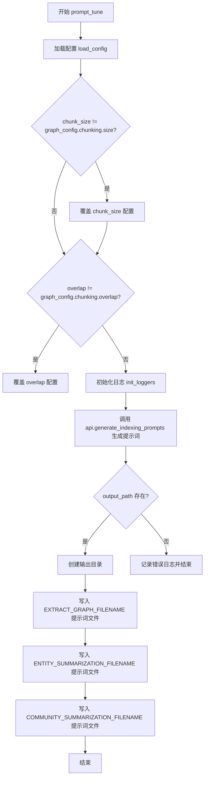
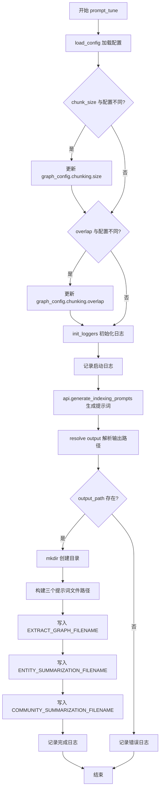
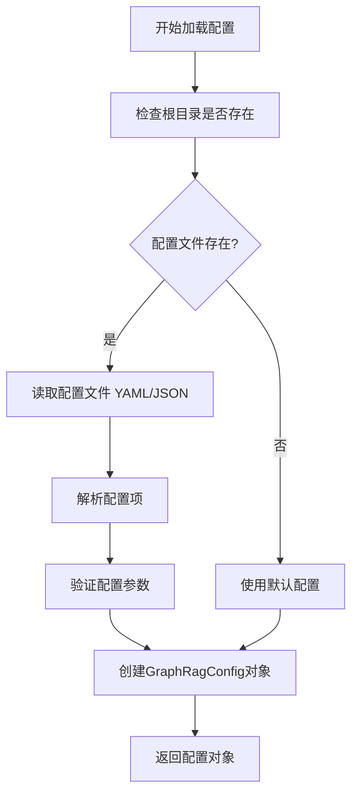
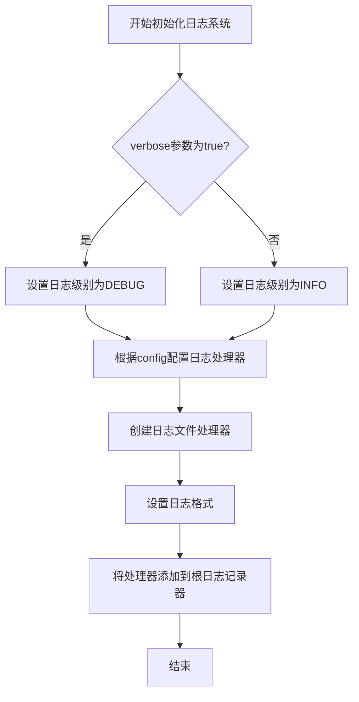
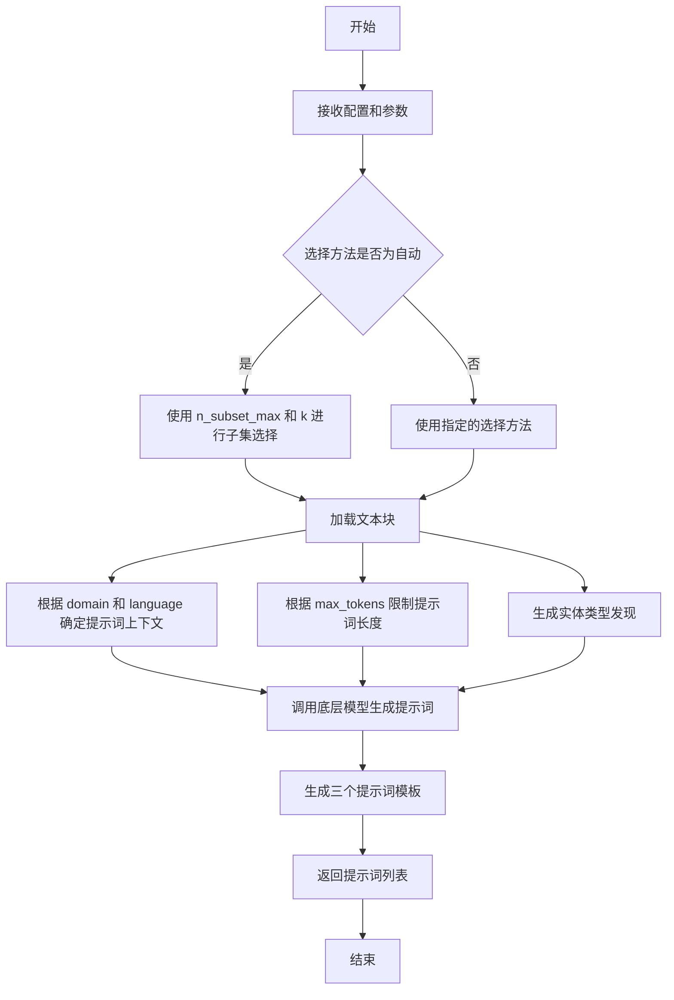
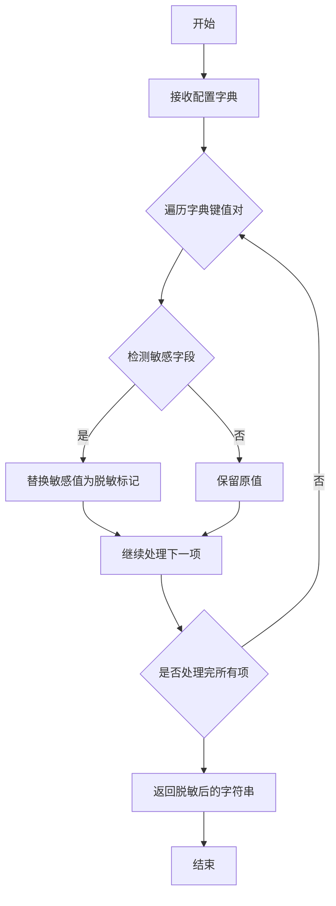

# `graphrag\packages\graphrag\graphrag\cli\prompt_tune.py` 详细设计文档

这是一个CLI命令实现，用于根据输入文档和配置生成prompt调优所需的提示词，包括提取图、实体摘要和社区摘要提示，并将其写入指定输出目录。

## 整体流程



## 类结构

```
模块: prompt_tune (CLI命令模块)
└── 函数: prompt_tune (异步主函数)
```

## 全局变量及字段


### `logger`
    
模块级日志记录器，用于输出prompt-tuning过程中的信息和错误日志

类型：`logging.Logger`
    


    

## 全局函数及方法


### `prompt_tune`

异步主函数，负责生成prompt调优提示词并将其写入指定的输出目录。该函数加载配置、初始化日志、调用API生成索引提示词，最后将生成的提示词（实体提取、实体摘要、社区摘要）写入文件。

参数：

- `root`：`Path`，项目根目录，用于加载配置
- `domain`：`str | None`，要映射输入文档的领域（可选）
- `verbose`：`bool`，是否启用详细日志记录
- `selection_method`：`api.DocSelectionType`，用于选择文档块的方法
- `limit`：`int`，加载的文档块数量限制
- `max_tokens`：`int`，实体提取提示中使用的最大token数
- `chunk_size`：`int`，文本分块的token大小
- `overlap`：`int`，分块之间的重叠token数
- `language`：`str | None`，提示词使用的语言（可选）
- `discover_entity_types`：`bool`，是否生成实体类型
- `output`：`Path`，存储生成的提示词的输出目录
- `n_subset_max`：`int`，使用自动选择方法时嵌入的文本块最大数量
- `k`：`int`，使用自动选择方法时选择的文档数量
- `min_examples_required`：`int`，实体提取提示所需的最少示例数量

返回值：`None`，该异步函数不返回任何值，结果直接写入文件系统

#### 流程图



#### 带注释源码

```python
async def prompt_tune(
    root: Path,                    # 项目根目录路径
    domain: str | None,            # 领域名称，用于映射文档
    verbose: bool,                 # 是否启用详细日志
    selection_method: api.DocSelectionType,  # 文档选择方法类型
    limit: int,                    # 加载的块数量限制
    max_tokens: int,               # 最大token数限制
    chunk_size: int,               # 块大小（token）
    overlap: int,                  # 块重叠大小（token）
    language: str | None,         # 提示词语言
    discover_entity_types: bool,   # 是否发现实体类型
    output: Path,                 # 输出目录路径
    n_subset_max: int,             # 自动选择时的最大子集数
    k: int,                        # 自动选择时选取的文档数
    min_examples_required: int,   # 最少需要的示例数
):
    """Prompt tune the model.

    Parameters
    ----------
    - root: The root directory.
    - domain: The domain to map the input documents to.
    - verbose: Enable verbose logging.
    - selection_method: The chunk selection method.
    - limit: The limit of chunks to load.
    - max_tokens: The maximum number of tokens to use on entity extraction prompts.
    - chunk_size: The chunk token size to use.
    - language: The language to use for the prompts.
    - discover_entity_types: Generate entity types.
    - output: The output folder to store the prompts.
    - n_subset_max: The number of text chunks to embed when using auto selection method.
    - k: The number of documents to select when using auto selection method.
    - min_examples_required: The minimum number of examples required for entity extraction prompts.
    """
    # 从根目录加载图配置
    graph_config = load_config(
        root_dir=root,
    )

    # 覆盖配置中的分块参数
    if chunk_size != graph_config.chunking.size:
        graph_config.chunking.size = chunk_size

    if overlap != graph_config.chunking.overlap:
        graph_config.chunking.overlap = overlap

    # 导入日志初始化模块
    from graphrag.logger.standard_logging import init_loggers

    # 使用配置初始化日志记录器
    init_loggers(config=graph_config, verbose=verbose, filename="prompt-tuning.log")

    logger.info("Starting prompt tune.")
    logger.info(
        "Using default configuration: %s",
        redact(graph_config.model_dump()),
    )

    # 异步调用API生成索引提示词
    prompts = await api.generate_indexing_prompts(
        config=graph_config,
        limit=limit,
        selection_method=selection_method,
        domain=domain,
        language=language,
        max_tokens=max_tokens,
        discover_entity_types=discover_entity_types,
        min_examples_required=min_examples_required,
        n_subset_max=n_subset_max,
        k=k,
        verbose=verbose,
    )

    # 解析输出路径为绝对路径
    output_path = output.resolve()
    if output_path:  # 如果输出路径有效
        logger.info("Writing prompts to %s", output_path)
        # 创建输出目录（如果不存在）
        output_path.mkdir(parents=True, exist_ok=True)
        
        # 构建三个提示词文件的完整路径
        extract_graph_prompt_path = output_path / EXTRACT_GRAPH_FILENAME
        entity_summarization_prompt_path = output_path / ENTITY_SUMMARIZATION_FILENAME
        community_summarization_prompt_path = (
            output_path / COMMUNITY_SUMMARIZATION_FILENAME
        )
        
        # 将生成的提示词写入文件（UTF-8编码）
        with extract_graph_prompt_path.open("wb") as file:
            file.write(prompts[0].encode(encoding="utf-8", errors="strict"))
        with entity_summarization_prompt_path.open("wb") as file:
            file.write(prompts[1].encode(encoding="utf-8", errors="strict"))
        with community_summarization_prompt_path.open("wb") as file:
            file.write(prompts[2].encode(encoding="utf-8", errors="strict"))
        
        logger.info("Prompts written to %s", output_path)
    else:
        # 输出路径无效时记录错误
        logger.error("No output path provided. Skipping writing prompts.")
```


### `load_config`

加载图谱配置文件，解析根目录下的配置文件并返回完整的图谱配置对象。

参数：

-  `root_dir`：`Path`，图谱项目的根目录路径

返回值：`GraphRagConfig`（图谱配置对象），包含所有图谱相关的配置信息

#### 流程图



#### 带注释源码

```python
# 注意：以下为基于代码调用推断的函数签名
# 实际定义在 graphrag/config/load_config.py 中

async def load_config(
    root_dir: Path,
) -> GraphRagConfig:
    """加载图谱配置。
    
    Parameters
    ----------
    - root_dir: 图谱项目的根目录路径，用于定位配置文件位置
    
    Returns
    -------
    GraphRagConfig: 包含所有图谱相关配置的完整配置对象
    
    Notes
    -----
    该函数通常会:
    1. 查找 root_dir 下的配置文件 (如 config.yaml, settings.json 等)
    2. 解析配置内容
    3. 应用默认配置值
    4. 验证配置的有效性
    5. 返回配置对象供后续使用
    """
    # 从代码中的调用示例:
    graph_config = load_config(
        root_dir=root,  # root 是 Path 类型，传入 prompt_tune 函数
    )
    
    # 加载后的配置对象包含多个子配置:
    # - graph_config.chunking.size: 分块大小
    # - graph_config.chunking.overlap: 重叠大小
    # - graph_config 模型配置等
```


# 分析结果

根据提供的代码，我可以从调用点提取 `init_loggers` 的信息，但该函数的实际定义不在当前代码片段中。以下是从调用点提取的信息：

### `init_loggers`

初始化日志系统，配置根日志记录器并设置日志输出格式和级别。

参数：

-  `config`：`graph_config` 类型（GraphRag 配置对象），包含图谱配置信息，用于初始化日志系统
-  `verbose`：`bool`，控制是否启用详细日志输出
-  `filename`：`str`，指定日志文件的名称（示例中为 "prompt-tuning.log"）

返回值：`None`（无返回值，直接修改全局日志配置）

#### 流程图



#### 带注释源码

```python
# 从graphrag.logger.standard_logging模块导入init_loggers函数
from graphrag.logger.standard_logging import init_loggers

# 初始化日志系统
# 参数说明：
#   - config: graph_config配置对象，包含图谱配置信息
#   - verbose: 布尔值，控制日志详细程度
#   - filename: 日志文件名，此处为"prompt-tuning.log"
init_loggers(config=graph_config, verbose=verbose, filename="prompt-tuning.log")
```

---

**注意**：由于提供的代码片段中未包含 `init_loggers` 函数的实际定义（位于 `graphrag.logger.standard_logging` 模块中），以上信息是基于函数调用点的推断。如需完整的函数实现源码，请提供 `graphrag/logger/standard_logging.py` 文件的内容。


### `api.generate_indexing_prompts`

生成索引提示词函数，用于根据配置和参数生成图提取、实体摘要和社区摘要的提示词模板。

参数：

- `config`：`graph_config`，图配置对象，包含 chunking、模型等配置信息
- `limit`：`int`，限制加载的文本块数量
- `selection_method`：`api.DocSelectionType`，文档块选择方法
- `domain`：`str | None`，领域名称，用于映射输入文档
- `language`：`str | None`，提示词使用的语言
- `max_tokens`：`int`，实体提取提示词使用的最大 token 数
- `discover_entity_types`：`bool`，是否生成实体类型
- `min_examples_required`：`int`，实体提取提示词所需的最少示例数
- `n_subset_max`：`int`，使用自动选择方法时嵌入的文本块数量
- `k`：`int`，使用自动选择方法时选择的文档数量
- `verbose`：`bool`，是否启用详细日志

返回值：`List[str]`（推断），包含三个提示词字符串的列表，分别对应图提取提示词、实体摘要提示词和社区摘要提示词

#### 流程图



#### 带注释源码

```python
# 推断的函数签名（基于调用处的参数）
async def generate_indexing_prompts(
    config: "GraphConfig",  # 图配置对象，包含 chunking、model 等配置
    limit: int,             # 限制加载的文本块数量
    selection_method: "DocSelectionType",  # 文档块选择方法
    domain: str | None,     # 领域名称
    language: str | None,   # 提示词语言
    max_tokens: int,        # 最大 token 数
    discover_entity_types: bool,  # 是否发现实体类型
    min_examples_required: int,    # 最少示例数
    n_subset_max: int,      # 自动选择时的最大子集数
    k: int,                 # 自动选择时的文档数
    verbose: bool,          # 详细日志标志
) -> List[str]:
    """生成索引提示词。
    
    根据提供的配置和参数，生成用于图提取、实体摘要和社区摘要的提示词模板。
    
    Parameters
    ----------
    config : GraphConfig
        包含 chunking、model 等配置的图配置对象
    limit : int
        限制加载的文本块数量
    selection_method : DocSelectionType
        文档块选择方法（如 random、auto 等）
    domain : str | None
        领域名称，用于映射输入文档到特定领域
    language : str | None
        提示词使用的语言
    max_tokens : int
        实体提取提示词使用的最大 token 数
    discover_entity_types : bool
        是否生成实体类型
    min_examples_required : int
        实体提取提示词所需的最少示例数
    n_subset_max : int
        使用自动选择方法时嵌入的文本块数量
    k : int
        使用自动选择方法时选择的文档数量
    verbose : bool
        是否启用详细日志输出
    
    Returns
    -------
    List[str]
        包含三个提示词字符串的列表：
        - prompts[0]: 图提取提示词 (EXTRACT_GRAPH_FILENAME)
        - prompts[1]: 实体摘要提示词 (ENTITY_SUMMARIZATION_FILENAME)
        - prompts[2]: 社区摘要提示词 (COMMUNITY_SUMMARIZATION_FILENAME)
    """
    # 函数体需要查看 graphrag/api 模块的实际实现
    # 基于调用处的使用方式，推断返回值为字符串列表
    pass
```


### `redact`

敏感信息脱敏函数，用于从配置字典中移除或替换敏感信息（如密码、API密钥等），防止在日志输出中泄露机密数据。

参数：

-  `data`：`dict`，输入的配置字典，通常来自配置对象的 `model_dump()` 方法

返回值：`str`，脱敏处理后的字符串表示，可安全用于日志输出

#### 流程图



#### 带注释源码

```python
# 注意：由于源代码未在此文件中提供，以下为基于导入和使用的推断
# 实际源码位于 graphrag/utils/cli.py 模块中

# 导入语句（来自主文件）
from graphrag.utils.cli import redact

# 在 prompt_tune 函数中的使用示例
logger.info(
    "Using default configuration: %s",
    redact(graph_config.model_dump())  # 对配置字典进行脱敏处理后输出到日志
)

# 推断的函数签名（基于 pydantic 的 model_dump() 返回类型）
# def redact(data: dict) -> str:
#     """Remove or redact sensitive information from a configuration dictionary.
#     
#     Parameters
#     ----------
#     - data: The configuration dictionary, typically from model_dump()
#     
#     Returns
#     -------
#     A string representation of the dictionary with sensitive values redacted.
#     """
#     ...
```

## 关键组件


### 配置加载与覆盖模块

负责加载 graphrag 配置文件，并允许通过命令行参数动态覆盖 chunking 相关的配置项（chunk_size 和 overlap）。

### 日志系统初始化模块

使用 `init_loggers` 函数根据配置和 verbose 标志初始化日志系统，并将日志输出到 "prompt-tuning.log" 文件。

### 异步提示词生成模块

调用 `api.generate_indexing_prompts()` 异步生成三类提示词：图提取提示词、实体摘要提示词和社区报告摘要提示词。该模块接收多个参数包括 limit、selection_method、domain、language、max_tokens 等。

### 文件输出管理模块

负责将生成的提示词写入指定的输出目录，创建必要的目录结构，并将三个提示词文件（EXTRACT_GRAPH_FILENAME、ENTITY_SUMMARIZATION_FILENAME、COMMUNITY_SUMMARIZATION_FILENAME）以 UTF-8 编码写入磁盘。

### CLI 参数处理模块

处理 prompt-tune 命令的所有命令行参数，包括 root、domain、verbose、selection_method、limit、max_tokens、chunk_size、overlap、language、discover_entity_types、output、n_subset_max、k、min_examples_required 等。

### 错误处理与校验模块

对输出路径进行校验，确保路径有效后再进行文件写入操作，否则记录错误日志并跳过写入。


## 问题及建议


### 已知问题

-   **缺少异常处理**：函数中未对 `load_config()`、`api.generate_indexing_prompts()` 和文件写入操作进行 try-except 包装，异常会直接向上传播导致程序崩溃。
-   **路径判断逻辑错误**：`output_path = output.resolve()` 后使用 `if output_path:` 判断，但 Path 对象调用 resolve() 后始终为真值，无法有效检测无效路径。
-   **文件写入方式冗余**：使用 `open("wb")` 配合 `encode()` 与直接使用 `open("w")` 文本模式相比是多余的，增加了复杂度。
-   **内部导入（Import inside function）**：`init_loggers` 的导入放在函数内部，虽可能为避免循环依赖，但不符合标准 Python 风格。
-   **魔法数字**：使用 `prompts[0]`、`prompts[1]`、`prompts[2]` 访问返回值，缺乏语义化命名，可读性差。
-   **配置对象直接修改**：直接修改 `graph_config.chunking.size` 和 `graph_config.chunking.overlap`，若同一 config 对象被其他地方引用会产生副作用。
-   **日志初始化时机**：`init_loggers` 在函数内部调用修改全局 root logger，可能影响其他模块的日志行为。

### 优化建议

-   添加完整的异常处理机制，捕获并记录可能的错误，必要时给出用户友好的错误提示。
-   使用 `if output_path.exists() and output_path.is_dir()` 或显式检查路径有效性替代当前的条件判断。
-   改用文本模式写入文件：`open("w", encoding="utf-8")`。
-   将 `init_loggers` 导入移至文件顶部，或在模块加载时初始化。
-   定义命名常量或使用字典/具名元组替代索引访问，如 `prompts["extract_graph"]`。
-   在修改配置前深拷贝原始配置对象，或使用配置覆盖策略（override pattern）。
-   将日志初始化移至调用者层面，或添加参数控制是否初始化日志。

## 其它


### 设计目标与约束

本模块的设计目标是为GraphRAG框架提供命令行接口的prompt-tuning功能，通过自动化方式生成针对特定领域和语言的索引提示词。核心约束包括：必须支持自定义分块参数（chunk_size和overlap）、支持多种文档选择方法、支持多语言生成，并确保输出路径有效可写。设计时考虑了与graphrag.config模块的深度集成，以及对api.generate_indexing_prompts的异步调用规范。

### 错误处理与异常设计

代码中的错误处理采用分层设计：配置加载失败时load_config会抛出异常；文件写入使用try-except逻辑捕获IO错误；输出路径为None时记录错误日志并跳过写入操作。关键异常场景包括：配置文件不存在或格式错误、输出目录无写权限、磁盘空间不足、编码错误（使用errors="strict"严格模式）。建议增强的错误处理包括：添加重试机制处理临时IO失败、对无效参数值的前置校验、区分可恢复与不可恢复错误的差异化处理策略。

### 数据流与状态机

数据流遵循以下路径：用户输入参数 → load_config加载默认配置 → 参数覆盖（chunk_size/overlap） → init_loggers初始化日志系统 → api.generate_indexing_prompts生成提示 → 文件系统写入。状态转换包括：INITIAL（初始状态）→ CONFIG_LOADED（配置已加载）→ CONFIGURED（参数已覆盖）→ LOGGING_INITIALIZED（日志已初始化）→ PROMPTS_GENERATED（提示已生成）→ COMPLETED（完成）或FAILED（失败）。状态机主要体现在配置对象的生命周期管理和异步任务的完成状态追踪。

### 外部依赖与接口契约

本模块依赖以下核心外部组件：graphrag.api模块的generate_indexing_prompts函数（异步生成提示的入口）；graphrag.config.load_config的load_config函数（配置加载）；graphrag.logger.standard_logging的init_loggers函数（日志初始化）；graphrag.prompt_tune模块下的常量（EXTRACT_GRAPH_FILENAME、ENTITY_SUMMARIZATION_FILENAME、COMMUNITY_SUMMARIZATION_FILENAME）。接口契约方面，generate_indexg_prompts接受config、limit、selection_method、domain、language、max_tokens、discover_entity_types、min_examples_required、n_subset_max、k、verbose等参数，返回包含三个提示内容的列表。

### 性能考虑与优化空间

当前实现的性能特征：配置加载和日志初始化为同步阻塞操作，提示生成为主要异步耗时操作，文件写入为IO密集型操作。优化方向包括：配置加载结果可考虑缓存以避免重复加载；文件写入可考虑使用aiofiles实现异步IO；可添加进度回调机制支持长时间运行任务的进度展示；输出多个文件时可考虑并行写入。当前n_subset_max和k参数影响嵌入计算量，需根据实际性能需求调整。

### 安全性考虑

代码中的安全考量包括：输出路径使用resolve()进行规范化处理防止路径遍历攻击；文件写入使用二进制模式（"wb"）配合utf-8编码；敏感信息处理通过redact函数对配置日志进行脱敏。潜在安全风险：输出目录未做权限校验、用户传入的domain参数未做校验、生成的提示内容未做安全过滤。建议增加：输出路径的父目录存在性校验、特殊字符过滤、生成内容的合规性检查。

### 配置管理机制

配置管理采用覆盖式设计：load_config加载默认配置后，允许通过命令行参数覆盖chunk_size和overlap配置。配置对象graph_config采用Pydantic模型（通过model_dump()方法可知），支持层级配置。设计模式为配置优先策略：先加载完整配置，再用运行时参数覆盖特定字段。这种设计兼顾了配置的完整性和运行时灵活性。进一步扩展可考虑：支持环境变量覆盖、支持配置文件的热重载、支持配置差异的对比和展示。

### 并发与异步处理设计

本模块为async函数，采用asyncio事件循环执行。并发特性体现在：api.generate_indexing_prompts为异步调用，内部可能包含并行处理；文件写入操作当前为同步，建议改为异步以避免阻塞事件循环。异步错误处理通过try-except捕获，异常会向上传播。需注意：调用方必须使用await执行此函数；异步上下文管理器（async with）可进一步优化资源管理；多文件写入可使用asyncio.gather实现并行化。

### 可测试性设计

当前代码的可测试性分析：函数签名清晰，参数明确，适合单元测试；异步函数便于使用pytest-asyncio进行测试；日志输出可通过mock logger进行验证；文件写入可通过临时目录和mock进行测试。测试策略建议：使用pytest的fixture模拟graph_config对象；使用pytest-mock模拟api.generate_indexing_prompts返回值；使用tmp_path fixture测试文件写入逻辑；使用caplog捕获日志输出进行断言。

### 日志与监控设计

日志系统通过init_loggers初始化，使用标准logging模块。日志级别由verbose参数控制（True时为DEBUG，False时为INFO）。关键日志节点包括：启动提示、配置信息脱敏输出、输出路径确认、写入完成提示、错误场景记录。日志文件命名为"prompt-tuning.log"。建议增强：添加结构化日志便于分析；添加性能指标日志（开始时间、结束时间、耗时）；添加操作审计日志；考虑集成APM工具进行生产监控。

### 版本兼容性考虑

代码使用了Python 3.10+的类型联合语法（str | None），需确保运行时Python版本不低于3.10。依赖的graphrag包需保持版本兼容。load_config的API稳定性、api.generate_indexer_prompts的返回格式、EXTRACT_GRAPH_FILENAME等常量定义都属于接口契约，需在版本迭代中保持向后兼容。建议在文档中明确标注支持的Python版本范围和graphrag核心库版本要求。


    