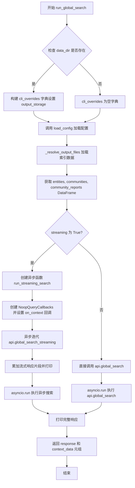
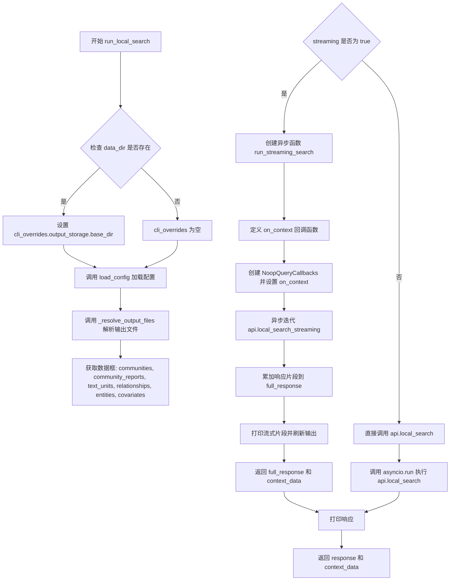
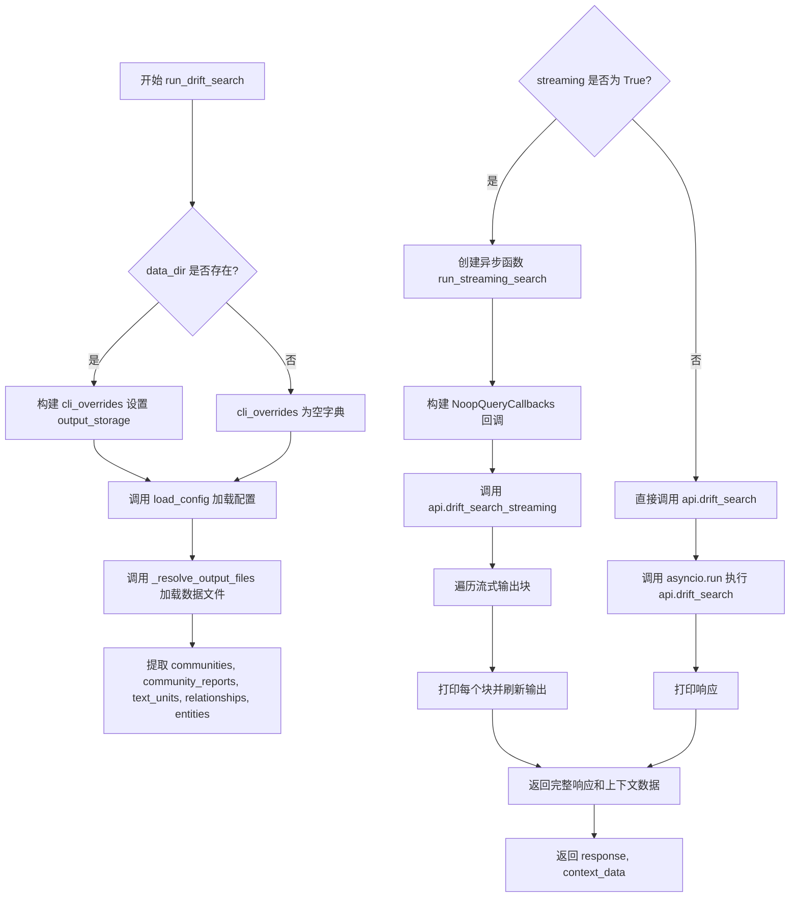
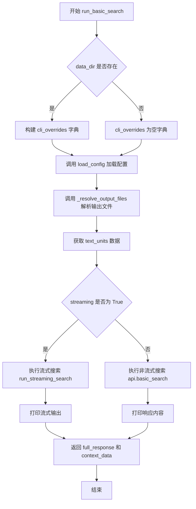

# `graphrag\packages\graphrag\graphrag\cli\query.py` 详细设计文档

该文件是 GraphRAG 系统的 CLI 查询接口实现，封装了四种搜索模式（全局、本地、漂移、基础）的执行逻辑。核心流程包括加载配置、读取索引数据文件、根据是否开启流式传输调用相应的异步 API，并将查询结果输出到控制台。

## 整体流程

```mermaid
graph TD
    Start([开始]) --> ConfigLoad[load_config: 加载配置]
    ConfigLoad --> ResolveFiles[_resolve_output_files: 读取索引文件为 DataFrame]
    ResolveFiles --> IsStreaming{streaming 参数}
    IsStreaming -- Yes --> AsyncDef[定义异步函数 run_streaming_search]
    AsyncDef --> CallStreamAPI[调用 api.*_streaming (如 global_search_streaming)]
    CallStreamAPI --> IterateStream[async for 遍历流式数据]
    IterateStream --> PrintChunk[print 片段并 sys.stdout.flush]
    IterateStream --> AsyncRun[asyncio.run 返回结果]
    IsStreaming -- No --> SyncCall[调用 api.* (如 global_search)]
    SyncCall --> PrintResult[print 打印完整响应]
    PrintChunk --> End[返回 response, context_data]
    PrintResult --> End
```

## 类结构

```
query (CLI 查询模块)
├── run_global_search (全局搜索实现)
├── run_local_search (本地搜索实现)
├── run_drift_search (漂移搜索实现)
├── run_basic_search (基础搜索实现)
└── _resolve_output_files (数据解析辅助函数)
```

## 全局变量及字段


    

## 全局函数及方法


### `run_global_search`

执行带有给定查询的全局搜索。加载全局搜索所需的索引文件（实体、社区、社区报告），根据是否启用流式输出调用相应的API方法，并返回响应文本和上下文数据。

参数：

-  `data_dir`：`Path | None`，可选的数据输出目录覆盖，用于指定索引文件的读取位置
-  `root_dir`：`Path`，项目根目录，用于加载配置文件
-  `community_level`：`int | None`，社区层级，用于控制社区报告的聚合级别
-  `dynamic_community_selection`：`bool`，是否启用动态社区选择，动态选择最相关的社区
-  `response_type`：`str`，响应类型，指定输出格式（如"Multiple Paragraphs"）
-  `streaming`：`bool`，是否启用流式输出，实时打印搜索结果片段
-  `query`：`str`，搜索查询字符串，用户输入的自然语言查询
-  `verbose`：`bool`，是否启用详细输出模式

返回值：`tuple[str, Any]`，返回元组包含完整响应文本和上下文数据（字典形式）

#### 流程图



#### 带注释源码

```python
def run_global_search(
    data_dir: Path | None,
    root_dir: Path,
    community_level: int | None,
    dynamic_community_selection: bool,
    response_type: str,
    streaming: bool,
    query: str,
    verbose: bool,
):
    """Perform a global search with a given query.

    Loads index files required for global search and calls the Query API.
    """
    # 初始化 CLI 覆盖配置字典，用于动态修改配置
    cli_overrides: dict[str, Any] = {}
    # 如果指定了数据目录，则覆盖输出存储的基础目录
    if data_dir:
        cli_overrides["output_storage"] = {"base_dir": str(data_dir)}
    
    # 加载完整配置，合并 CLI 覆盖参数
    config = load_config(
        root_dir=root_dir,
        cli_overrides=cli_overrides,
    )

    # 从配置指定的输出目录解析所需的索引文件
    dataframe_dict = _resolve_output_files(
        config=config,
        output_list=[
            "entities",           # 实体数据
            "communities",        # 社区数据
            "community_reports",  # 社区报告数据
        ],
        optional_list=[],  # 全局搜索无可选文件
    )

    # 从字典中提取各 DataFrame
    entities: pd.DataFrame = dataframe_dict["entities"]
    communities: pd.DataFrame = dataframe_dict["communities"]
    community_reports: pd.DataFrame = dataframe_dict["community_reports"]

    # 根据 streaming 标志选择不同执行路径
    if streaming:

        async def run_streaming_search():
            """异步流式搜索内部函数"""
            full_response = ""      # 累积完整响应
            context_data = {}       # 存储上下文数据

            # 定义上下文回调函数，用于捕获搜索上下文
            def on_context(context: Any) -> None:
                nonlocal context_data
                context_data = context

            # 创建查询回调对象并绑定上下文处理函数
            callbacks = NoopQueryCallbacks()
            callbacks.on_context = on_context

            # 异步迭代流式响应，每次获取一个片段
            async for stream_chunk in api.global_search_streaming(
                config=config,
                entities=entities,
                communities=communities,
                community_reports=community_reports,
                community_level=community_level,
                dynamic_community_selection=dynamic_community_selection,
                response_type=response_type,
                query=query,
                callbacks=[callbacks],
                verbose=verbose,
            ):
                full_response += stream_chunk
                print(stream_chunk, end="")  # 实时打印片段
                sys.stdout.flush()            # 强制刷新输出缓冲
            print()  # 打印换行分隔符
            return full_response, context_data

        # 运行异步流式搜索并返回结果
        return asyncio.run(run_streaming_search())
    
    # 非流式模式：直接执行异步搜索
    response, context_data = asyncio.run(
        api.global_search(
            config=config,
            entities=entities,
            communities=communities,
            community_reports=community_reports,
            community_level=community_level,
            dynamic_community_selection=dynamic_community_selection,
            response_type=response_type,
            query=query,
            verbose=verbose,
        )
    )
    print(response)  # 打印完整响应

    return response, context_data  # 返回响应文本和上下文数据
```


### `run_local_search`

执行本地搜索功能，根据传入的查询字符串加载本地搜索所需的索引文件（社区、社区报告、文本单元、关系、实体及可选的协变量），并根据是否启用流式输出调用相应的本地搜索API，最终返回搜索响应和上下文数据。

**参数：**

- `data_dir`：`Path | None`，可选的数据目录路径，用于指定输出存储的基础目录
- `root_dir`：`Path`，项目根目录路径，用于加载配置
- `community_level`：`int`，社区级别，用于控制搜索的社区层次
- `response_type`：`str`，响应类型，指定返回结果的格式或类型
- `streaming`：`bool`，是否使用流式输出，true 时使用流式 API
- `query`：`str`，用户查询字符串，执行搜索的输入
- `verbose`：`bool`，是否输出详细日志信息

**返回值：** `tuple[str, dict[str, Any]]`，返回搜索响应字符串和上下文数据字典

#### 流程图



#### 带注释源码

```python
def run_local_search(
    data_dir: Path | None,
    root_dir: Path,
    community_level: int,
    response_type: str,
    streaming: bool,
    query: str,
    verbose: bool,
):
    """Perform a local search with a given query.

    Loads index files required for local search and calls the Query API.
    """
    # 初始化 CLI 覆盖配置字典
    cli_overrides: dict[str, Any] = {}
    # 如果提供了数据目录，则设置输出存储的基础目录
    if data_dir:
        cli_overrides["output_storage"] = {"base_dir": str(data_dir)}
    
    # 加载配置：合并根目录配置和 CLI 覆盖参数
    config = load_config(
        root_dir=root_dir,
        cli_overrides=cli_overrides,
    )

    # 解析输出文件：将索引输出文件读取为数据框字典
    # 必需文件：communities, community_reports, text_units, relationships, entities
    # 可选文件：covariates
    dataframe_dict = _resolve_output_files(
        config=config,
        output_list=[
            "communities",
            "community_reports",
            "text_units",
            "relationships",
            "entities",
        ],
        optional_list=[
            "covariates",
        ],
    )

    # 从数据框字典中提取各个数据帧
    communities: pd.DataFrame = dataframe_dict["communities"]
    community_reports: pd.DataFrame = dataframe_dict["community_reports"]
    text_units: pd.DataFrame = dataframe_dict["text_units"]
    relationships: pd.DataFrame = dataframe_dict["relationships"]
    entities: pd.DataFrame = dataframe_dict["entities"]
    covariates: pd.DataFrame | None = dataframe_dict["covariates"]

    # 根据 streaming 标志决定使用流式或非流式搜索
    if streaming:
        # 定义异步流式搜索函数
        async def run_streaming_search():
            full_response = ""  # 完整响应字符串
            context_data = {}  # 上下文数据字典

            # 定义上下文回调函数，用于收集搜索过程中的上下文信息
            def on_context(context: Any) -> None:
                nonlocal context_data
                context_data = context

            # 创建查询回调对象，并设置上下文回调
            callbacks = NoopQueryCallbacks()
            callbacks.on_context = on_context

            # 异步迭代流式响应片段
            async for stream_chunk in api.local_search_streaming(
                config=config,
                entities=entities,
                communities=communities,
                community_reports=community_reports,
                text_units=text_units,
                relationships=relationships,
                covariates=covariates,
                community_level=community_level,
                response_type=response_type,
                query=query,
                callbacks=[callbacks],
                verbose=verbose,
            ):
                # 累加响应片段
                full_response += stream_chunk
                # 实时打印流式片段
                print(stream_chunk, end="")
                sys.stdout.flush()
            # 打印换行符
            print()
            # 返回完整响应和上下文数据
            return full_response, context_data

        # 运行异步流式搜索并返回结果
        return asyncio.run(run_streaming_search())
    
    # 非流式搜索：直接调用同步 API
    response, context_data = asyncio.run(
        api.local_search(
            config=config,
            entities=entities,
            communities=communities,
            community_reports=community_reports,
            text_units=text_units,
            relationships=relationships,
            covariates=covariates,
            community_level=community_level,
            response_type=response_type,
            query=query,
            verbose=verbose,
        )
    )
    # 打印最终响应
    print(response)

    # 返回响应和上下文数据
    return response, context_data
```


### `run_drift_search`

执行 Drift 搜索功能，加载索引所需的数据文件（社区、社区报告、文本单元、关系和实体），并根据 streaming 参数选择调用流式或非流式 Drift Search API，最终返回搜索响应和上下文数据。

参数：

- `data_dir`：`Path | None`，可选参数，指定数据输出目录，若提供则覆盖配置的输出存储路径
- `root_dir`：`Path`，必填参数，GraphRAG 项目的根目录，用于加载配置文件
- `community_level`：`int`，必填参数，社区级别，用于控制搜索的社区层次深度
- `response_type`：`str`，必填参数，响应类型，指定返回结果的格式或风格
- `streaming`：`bool`，必填参数，是否启用流式输出模式
- `query`：`str`，必填参数，用户输入的搜索查询字符串
- `verbose`：`bool`，必填参数，是否输出详细日志信息

返回值：`tuple[str, Any]`，返回两个元素：第一个是搜索响应的字符串内容，第二个是包含搜索上下文数据的字典

#### 流程图



#### 带注释源码

```python
def run_drift_search(
    data_dir: Path | None,
    root_dir: Path,
    community_level: int,
    response_type: str,
    streaming: bool,
    query: str,
    verbose: bool,
):
    """Perform a local search with a given query.

    Loads index files required for local search and calls the Query API.
    """
    # 初始化 CLI 覆盖配置字典
    cli_overrides: dict[str, Any] = {}
    # 如果提供了数据目录，则覆盖输出存储的基础目录
    if data_dir:
        cli_overrides["output_storage"] = {"base_dir": str(data_dir)}
    
    # 加载 GraphRAG 配置，合并 CLI 参数覆盖
    config = load_config(
        root_dir=root_dir,
        cli_overrides=cli_overrides,
    )

    # 解析并加载所需的输出文件（索引数据）
    dataframe_dict = _resolve_output_files(
        config=config,
        output_list=[
            "communities",          # 社区数据
            "community_reports",   # 社区报告
            "text_units",          # 文本单元
            "relationships",       # 关系数据
            "entities",            # 实体数据
        ],
    )

    # 从数据字典中提取各个 DataFrame
    communities: pd.DataFrame = dataframe_dict["communities"]
    community_reports: pd.DataFrame = dataframe_dict["community_reports"]
    text_units: pd.DataFrame = dataframe_dict["text_units"]
    relationships: pd.DataFrame = dataframe_dict["relationships"]
    entities: pd.DataFrame = dataframe_dict["entities"]

    # 根据 streaming 标志选择不同的执行路径
    if streaming:

        async def run_streaming_search():
            """定义异步流式搜索函数"""
            full_response = ""      # 累积完整响应
            context_data = {}        # 存储上下文数据

            # 定义上下文回调函数，用于捕获搜索过程中的上下文信息
            def on_context(context: Any) -> None:
                nonlocal context_data
                context_data = context

            # 创建 Noop 查询回调对象，并设置上下文回调
            callbacks = NoopQueryCallbacks()
            callbacks.on_context = on_context

            # 异步迭代流式响应块
            async for stream_chunk in api.drift_search_streaming(
                config=config,
                entities=entities,
                communities=communities,
                community_reports=community_reports,
                text_units=text_units,
                relationships=relationships,
                community_level=community_level,
                response_type=response_type,
                query=query,
                callbacks=[callbacks],
                verbose=verbose,
            ):
                # 累积完整响应
                full_response += stream_chunk
                # 实时打印流式内容
                print(stream_chunk, end="")
                sys.stdout.flush()  # 立即刷新输出缓冲区
            
            print()  # 打印换行符
            # 返回完整响应和上下文数据
            return full_response, context_data

        # 在新事件循环中运行异步流式搜索
        return asyncio.run(run_streaming_search())

    # 非流式执行路径：直接调用同步 API
    response, context_data = asyncio.run(
        api.drift_search(
            config=config,
            entities=entities,
            communities=communities,
            community_reports=community_reports,
            text_units=text_units,
            relationships=relationships,
            community_level=community_level,
            response_type=response_type,
            query=query,
            verbose=verbose,
        )
    )
    # 打印搜索响应
    print(response)

    # 返回响应和上下文数据
    return response, context_data
```


### `run_basic_search`

执行基础搜索操作，根据查询字符串从索引文件中加载文本单元数据，并通过调用查询 API 返回搜索结果。支持流式和非流式两种模式。

参数：

- `data_dir`：`Path | None`，可选参数，指定输出数据目录路径，如果提供则覆盖配置的输出存储路径
- `root_dir`：`Path`，必需参数，指定项目根目录，用于加载配置文件
- `response_type`：`str`，必需参数，指定响应类型（如 "list"、"table" 等）
- `streaming`：`bool`，必需参数，指定是否使用流式输出模式
- `query`：`str`，必需参数，指定搜索查询字符串
- `verbose`：`bool`，必需参数，指定是否输出详细日志信息

返回值：`tuple[Any, Any]`，返回搜索响应内容和上下文数据组成的元组

#### 流程图



#### 带注释源码

```python
def run_basic_search(
    data_dir: Path | None,
    root_dir: Path,
    response_type: str,
    streaming: bool,
    query: str,
    verbose: bool,
):
    """Perform a basics search with a given query.

    Loads index files required for basic search and calls the Query API.
    """
    # 初始化 CLI 覆盖配置字典
    cli_overrides: dict[str, Any] = {}
    # 如果提供了 data_dir，则覆盖输出存储路径
    if data_dir:
        cli_overrides["output_storage"] = {"base_dir": str(data_dir)}
    
    # 加载 GraphRAG 配置
    config = load_config(
        root_dir=root_dir,
        cli_overrides=cli_overrides,
    )

    # 解析输出文件，获取 DataFrame 字典
    dataframe_dict = _resolve_output_files(
        config=config,
        output_list=[
            "text_units",  # 仅需要文本单元数据
        ],
    )

    # 从字典中提取 text_units DataFrame
    text_units: pd.DataFrame = dataframe_dict["text_units"]

    # 根据 streaming 标志选择不同的搜索方式
    if streaming:
        # 定义异步流式搜索函数
        async def run_streaming_search():
            full_response = ""  # 累积完整响应
            context_data = {}    # 存储上下文数据

            # 定义上下文回调函数
            def on_context(context: Any) -> None:
                nonlocal context_data
                context_data = context

            # 创建查询回调对象
            callbacks = NoopQueryCallbacks()
            callbacks.on_context = on_context

            # 异步迭代流式搜索结果
            async for stream_chunk in api.basic_search_streaming(
                config=config,
                text_units=text_units,
                response_type=response_type,
                query=query,
                callbacks=[callbacks],
                verbose=verbose,
            ):
                full_response += stream_chunk
                print(stream_chunk, end="")  # 实时打印流式输出
                sys.stdout.flush()  # 刷新输出缓冲
            print()
            return full_response, context_data

        # 运行异步流式搜索并返回结果
        return asyncio.run(run_streaming_search())
    
    # 非流式搜索模式
    # 调用同步 API 执行基础搜索
    response, context_data = asyncio.run(
        api.basic_search(
            config=config,
            text_units=text_units,
            response_type=response_type,
            query=query,
            verbose=verbose,
        )
    )
    print(response)  # 打印搜索响应

    # 返回响应内容和上下文数据
    return response, context_data
```


### `_resolve_output_files`

该函数是一个私有函数，用于根据配置读取索引输出文件（如 entities、communities 等），并将其转换为包含文件名作为键、pandas DataFrame 作为值的字典。对于可选列表中的文件，如果文件不存在则返回 None 而非抛出错误。

参数：

- `config`：`GraphRagConfig`，GraphRAG 配置文件对象，包含输出存储和表提供者等配置信息
- `output_list`：`list[str]`，必需的输出文件名称列表，如 ["entities", "communities", "community_reports"]
- `optional_list`：`list[str] | None`，可选的输出文件名称列表，默认为 None，这些文件在不存在时会被设置为 None

返回值：`dict[str, Any]`，键为文件名（字符串），值为对应的 pandas DataFrame 对象或 None

#### 流程图

```mermaid
flowchart TD
    A[开始 _resolve_output_files] --> B[创建空字典 dataframe_dict]
    B --> C[使用 config.output_storage 创建存储对象 storage_obj]
    C --> D[使用 table_provider 和 storage_obj 创建表提供者]
    D --> E[使用表提供者创建数据读取器 reader]
    E --> F{遍历 output_list 中的每个文件名}
    F -->|对于每个 name| G[调用 asyncio.run(reader.name)]
    G --> H[将 DataFrame 存入 dataframe_dict[name]]
    H --> F
    F --> I{optional_list 是否存在}
    I -->|是| J{遍历 optional_list 中的每个文件名}
    I -->|否| K[返回 dataframe_dict]
    J --> L[检查表提供者中该文件是否存在]
    L -->|存在| M[调用 asyncio.run(reader.optional_file) 读取数据]
    L -->|不存在| N[设置 dataframe_dict[optional_file] = None]
    M --> O[将 DataFrame 存入字典]
    N --> O
    O --> J
    J --> K
```

#### 带注释源码

```python
def _resolve_output_files(
    config: GraphRagConfig,
    output_list: list[str],
    optional_list: list[str] | None = None,
) -> dict[str, Any]:
    """Read indexing output files to a dataframe dict, with correct column types.
    
    根据配置读取索引输出文件，并将其转换为包含正确列类型的 DataFrame 字典。
    
    参数:
        config: GraphRAG 配置对象，包含存储和表提供者配置
        output_list: 必需的文件名列表，这些文件必须存在
        optional_list: 可选的文件名列表，如果不存在则设为 None
    
    返回:
        包含文件名到 DataFrame 映射的字典
    """
    # 初始化用于存储结果的数据框字典
    dataframe_dict = {}
    
    # 使用配置中的输出存储设置创建存储对象
    # storage_obj 负责底层文件的读写操作
    storage_obj = create_storage(config.output_storage)
    
    # 创建表提供者，用于访问不同格式的表格数据（如 parquet、csv 等）
    table_provider = create_table_provider(config.table_provider, storage=storage_obj)
    
    # 创建数据读取器，封装了读取各种数据实体的逻辑
    reader = DataReader(table_provider)
    
    # 遍历所有必需的输出文件列表
    for name in output_list:
        # 使用 asyncio.run 同步调用异步读取方法
        # getattr(reader, name) 获取名为 name 的方法（如 entities()、communities() 等）
        # 然后调用该方法获取对应的 DataFrame
        df_value = asyncio.run(getattr(reader, name)())
        
        # 将读取到的 DataFrame 存入字典，键为文件名
        dataframe_dict[name] = df_value

    # 处理可选输出文件列表（如果提供）
    if optional_list:
        # 遍历每个可选文件名
        for optional_file in optional_list:
            # 检查表提供者中该文件是否已存在
            file_exists = asyncio.run(table_provider.has(optional_file))
            
            if file_exists:
                # 文件存在时正常读取数据
                df_value = asyncio.run(getattr(reader, optional_file)())
                dataframe_dict[optional_file] = df_value
            else:
                # 文件不存在时设置为空值，而非抛出异常
                dataframe_dict[optional_file] = None
    
    # 返回包含所有数据的字典
    return dataframe_dict
```

## 关键组件


### run_global_search

执行全局搜索的CLI函数，加载全局搜索所需的索引文件（entities、communities、community_reports），并调用Query API支持流式和非流式两种模式。

### run_local_search

执行本地搜索的CLI函数，加载本地搜索所需的索引文件（包括communities、community_reports、text_units、relationships、entities及可选的covariates），并调用Query API支持流式和非流式两种模式。

### run_drift_search

执行漂移搜索的CLI函数，加载漂移搜索所需的索引文件（communities、community_reports、text_units、relationships、entities），并调用Query API支持流式和非流式两种模式。

### run_basic_search

执行基础搜索的CLI函数，加载基础搜索所需的索引文件（text_units），并调用Query API支持流式和非流式两种模式。

### _resolve_output_files

读取索引输出文件到DataFrame字典的辅助函数，使用DataReader和table_provider加载必需和可选的输出文件，支持可选文件的空值处理。

### 流式搜索包装器

嵌入在各个搜索函数中的异步函数，用于处理流式响应，通过NoopQueryCallbacks捕获上下文数据并将流式块实时打印到标准输出。

### 配置加载与CLI覆盖

每个搜索函数都包含的配置加载逻辑，通过load_config函数加载配置并支持通过cli_overrides参数覆盖output_storage设置。

### 异步执行入口

使用asyncio.run()在同步函数中执行异步搜索调用，桥接同步CLI接口与异步API实现。

## 问题及建议


### 已知问题

- **严重的代码重复**：四个搜索函数（`run_global_search`、`run_local_search`、`run_drift_search`、`run_basic_search`）的结构几乎完全相同，包含大量重复的流式/非流式逻辑、配置加载逻辑和数据解析逻辑，违反 DRY 原则。
- **`_resolve_output_files` 中多次调用 `asyncio.run()`**：在循环中对每个文件调用 `asyncio.run()`，每次都会创建新的事件循环，性能低下且不符合最佳实践，应使用 `asyncio.gather()` 或单次事件循环。
- **回调机制形同虚设**：虽然使用了 `NoopQueryCallbacks` 并设置了 `on_context` 回调，但实际上是硬编码使用，无法让 CLI 调用者传入自定义回调，限制了扩展性。
- **缺少参数校验**：如 `community_level` 参数在某些函数中传入 `int | None`，但函数内部未做校验，可能导致下游 API 调用出错。
- **stdout 直接打印**：流式输出直接使用 `print()` 和 `sys.stdout.flush()`，未将结果返回给调用者或提供输出回调，限制了 CLI 的灵活性。
- **配置加载重复**：每个函数都重复执行 `load_config` 和创建 `cli_overrides` 字典，可提取公共逻辑。

### 优化建议

- **提取公共搜索逻辑**：将流式/非流式处理、配置加载、数据解析封装为通用函数或类，四个搜索函数只需传入特定参数（如数据文件列表、API 函数引用）。
- **重构 `_resolve_output_files`**：使用 `asyncio.run(asyncio.gather(*[...]))` 一次性读取所有文件，或使用 `asyncio.create_task` 批量处理。
- **添加回调参数**：为四个搜索函数增加可选的 `callbacks` 参数，允许调用者自定义回调行为。
- **增加参数校验**：在函数入口处对关键参数（如 `community_level`、`query`）进行校验，提供清晰的错误信息。
- **统一输出机制**：将 `print` 行为改为返回值或通过回调输出，便于单元测试和集成。
- **提取配置加载逻辑**：创建一个工厂函数统一处理 `cli_overrides` 构建和配置加载。

## 其它


### 设计目标与约束

本CLI工具的核心设计目标是提供一个统一的命令行接口，使用户能够通过不同的搜索模式（global、local、drift、basic）对图谱数据进行查询。设计约束包括：1）必须支持流式和非流式两种响应模式；2）需要从配置中动态加载索引文件；3）所有搜索操作必须通过异步方式执行以提高性能；4）CLI参数应与底层API保持一致。

### 错误处理与异常设计

代码中错误处理较为简单，主要依赖Python内置异常机制。关键风险点：1）在`_resolve_output_files`中使用`asyncio.run()`可能产生嵌套事件循环问题；2）文件读取失败时未提供具体错误信息；3）配置加载失败会导致整个程序崩溃。建议增加：a) 对文件不存在的情况进行友好提示；b) 添加超时机制防止长时间阻塞；c) 对API返回的异常进行捕获并格式化输出。

### 数据流与状态机

整体数据流为：CLI参数输入 → 配置加载(覆盖CLI参数) → 索引文件解析 → DataReader读取 → 调用对应Search API → 输出响应。状态转换：非流式模式为同步调用直接返回结果；流式模式通过回调函数收集context数据，实时打印流式输出。

### 外部依赖与接口契约

主要依赖：1）graphrag.api模块提供global_search/local_search/drift_search/basic_search及其流式版本；2）graphrag_storage提供存储抽象；3）table_provider_factory创建表提供者；4）DataReader负责数据读取；5）NoopQueryCallbacks用于回调处理。所有外部调用均通过配置对象GraphRagConfig传递参数。

### 性能考虑

1. 异步执行：使用asyncio.run()包装异步调用，但存在嵌套事件循环风险；2. 流式输出：通过sys.stdout.flush()实现即时输出；3. 文件读取：串行读取所有索引文件，可考虑并行化；4. 内存使用：全量加载DataFrame到内存，大规模数据可能出现OOM。

### 安全性考虑

代码本身为CLI工具，安全性考量有限，但需注意：1）query参数可能包含用户输入，需防止注入风险（虽然主要由下游API处理）；2）data_dir和root_dir路径参数需验证防止路径遍历；3）配置文件可能包含敏感信息，需注意权限控制。

### 可扩展性设计

1. 搜索类型扩展：新增搜索模式只需添加对应run_xxx_search函数；2. 输出格式扩展：当前仅支持打印到stdout，可添加JSON/CSV等输出格式选项；3. 回调机制：基于NoopQueryCallbacks的回调设计便于扩展日志、监控等功能。

### 配置管理

通过load_config加载配置，支持cli_overrides覆盖。配置结构由GraphRagConfig模型定义，主要包括output_storage、table_provider等。CLI参数中data_dir会被转换为output_storage.base_dir覆盖项。

### Logging和监控

当前代码仅使用print输出结果和sys.stdout.flush()强制刷新，缺少结构化日志。建议添加：1) 使用Python logging模块替代print；2) 添加操作耗时统计；3) 集成回调收集的context_data用于调试；4) 对文件加载失败等关键操作记录警告。

### 测试策略

建议补充单元测试：1) 测试_resolve_output_files的文件解析逻辑；2) 测试各搜索函数的参数传递正确性；3) Mock DataReader和API进行集成测试；4) 测试流式与非流式两种模式的输出格式。

### 部署相关

本模块为graphrag包的CLI组件，依赖项包括：graphrag_storage、pandas、asyncio标准库。部署时需确保：1) Python 3.10+环境；2) 图谱索引文件已正确生成；3) 配置文件已初始化。

### 许可证和合规性

代码头部声明：Copyright (c) 2024 Microsoft Corporation, Licensed under the MIT License。


    