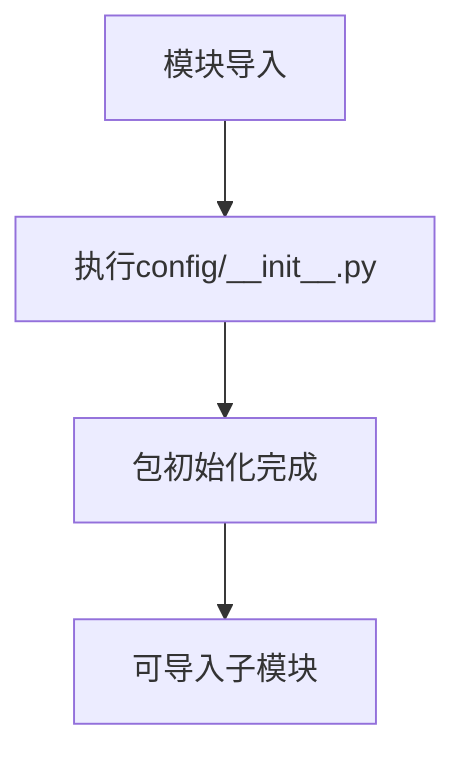

# `graphrag\packages\graphrag\graphrag\config\__init__.py` 详细设计文档

这是配置包的根初始化文件，用于将config目录标记为Python包，并提供包级别的文档说明。

## 整体流程



## 类结构

```
config (包根目录)
└── __init__.py (包初始化文件)
```

## 全局变量及字段


    

## 全局函数及方法


## 关键组件


### Config Package Root（配置包根模块）

该文件是配置包的根模块，主要用于标识配置目录为Python包，并声明版权和许可证信息，无实际功能实现。

### 版权与许可证声明

声明了代码的版权归属（Microsoft Corporation）和MIT许可证，确保代码的法律合规性。


## 问题及建议


### 已知问题

-   **空包实现**：该包仅包含版权声明和文档字符串，没有任何实际功能代码或模块导出，属于空包（empty package）
-   **文档信息不足**：包文档字符串"The config package root"过于简略，未说明配置的具体用途、支持的配置格式、加载机制等关键信息
-   **缺少模块结构**：未定义任何子模块或导出任何配置相关的类、函数、变量， 无法提供配置管理功能

### 优化建议

-   **完善包文档**：扩展 `__doc__` 字符串，详细描述配置包的功能定位、支持的文件格式（如 JSON、YAML、TOML）、加载策略（如环境变量覆盖、优先级机制）等
-   **实现核心功能**：根据项目需求添加配置加载、解析、验证、合并等核心功能，例如：
    -   定义配置模型类（使用 Pydantic 或 dataclass）
    -   实现配置文件读取器
    -   提供环境变量覆盖能力
    -   添加配置验证逻辑
-   **导出公共接口**：在 `__init__.py` 中明确导出配置加载器、配置模型等公共 API，便于外部调用
-   **添加类型注解**：为所有函数和类添加完整的类型注解，提高代码可维护性和 IDE 支持


## 其它


### 1. 一段话描述

这是一个配置包（config package）的根模块文件，作为包的初始化入口，仅包含版权声明和包的基本元信息，用于标识该包的身份和许可协议。

### 2. 文件的整体运行流程

该文件作为Python包的入口点，在包首次被导入时执行。由于代码仅包含文档字符串和注释，不执行任何实际逻辑，仅将config包注册到Python的模块系统中，使其可被其他模块导入使用。

### 3. 类的详细信息

（该文件不包含任何类定义）

### 4. 全局变量和全局函数

（该文件不包含任何全局变量或全局函数）

### 5. 关键组件信息

- **config包**：项目配置管理模块的根包，用于集中管理和提供应用程序的配置信息

### 6. 潜在的技术债务或优化空间

- 该包目前为空白占位符，缺少实际的配置管理功能实现
- 建议根据实际需求实现配置加载、验证、访问控制等功能
- 建议添加配置 schema 定义和类型提示
- 建议添加配置变更监听和热更新机制
- 建议添加配置单元测试和集成测试

### 7. 设计目标与约束

- **设计目标**：提供统一的配置管理解决方案，支持多环境配置、配置验证、配置热更新等特性
- **设计约束**：遵循MIT开源许可协议，与Microsoft生态系统兼容

### 8. 错误处理与异常设计

- 由于代码无实际逻辑，暂无错误处理机制
- 建议定义配置相关的自定义异常类，如ConfigurationNotFoundError、ConfigurationValidationError、ConfigurationLoadError等

### 9. 数据流与状态机

- 由于代码无实际逻辑，暂无数据流定义
- 建议定义配置数据的加载流程：源读取 → 解析 → 验证 → 缓存 → 访问

### 10. 外部依赖与接口契约

- 建议依赖：pydantic（配置验证）、python-dotenv（环境变量支持）、PyYAML/TOML（配置文件解析）
- 建议提供统一的配置访问接口，如get_config()、set_config()、reload_config()等

### 11. 安全性考虑

- 建议添加敏感配置（如密钥、密码）的加密存储和访问控制
- 建议配置文件的访问权限管理

### 12. 版本和兼容性

- 当前版本：基于2024年MIT License
- 建议使用语义化版本号（SemVer）管理包版本
- 建议明确Python版本兼容性要求

    