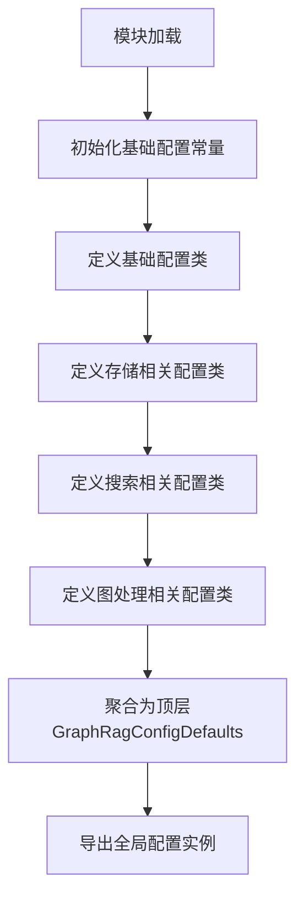

# `graphrag\packages\graphrag\graphrag\config\defaults.py` 详细设计文档

该文件定义了GraphRAG系统的所有默认配置值，包含输入输出存储、缓存、嵌入、文本分块、图谱提取、社区报告、搜索策略等多种配置项，通过dataclass结构提供类型安全的配置默认值。

## 整体流程



## 类结构

```
object (根类)
├── dataclass
│   ├── StorageDefaults (存储配置基类)
│   │   ├── InputStorageDefaults (输入存储)
 │   │   ├── CacheStorageDefaults (缓存存储)
 │   │   ├── OutputStorageDefaults (输出存储)
 │   │   └── UpdateOutputStorageDefaults (更新输出存储)
│   ├── InputDefaults (输入配置基类)
│   ├── ReportingDefaults (报告配置)
│   ├── TextAnalyzerDefaults (文本分析配置基类)
│   │   └── ExtractGraphNLPDefaults (NLP图提取配置)
│   └── GraphRagConfigDefaults (顶层聚合配置)
│       ├── embed_text: EmbedTextDefaults
│       ├── chunking: ChunkingDefaults
│       ├── extract_graph: ExtractGraphDefaults
│       ├── extract_graph_nlp: ExtractGraphNLPDefaults
│       ├── summarize_descriptions: SummarizeDescriptionsDefaults
│       ├── community_reports: CommunityReportDefaults
│       ├── extract_claims: ExtractClaimsDefaults
│       ├── prune_graph: PruneGraphDefaults
│       ├── cluster_graph: ClusterGraphDefaults
│       ├── local_search: LocalSearchDefaults
│       ├── global_search: GlobalSearchDefaults
│       ├── drift_search: DriftSearchDefaults
│       ├── basic_search: BasicSearchDefaults
│       ├── vector_store: VectorStoreDefaults
│       ├── cache: CacheDefaults
│       ├── reporting: ReportingDefaults
│       ├── input_storage: InputStorageDefaults
│       ├── output_storage: OutputStorageDefaults
│       ├── update_output_storage: UpdateOutputStorageDefaults
│       └── input: InputDefaults
```

## 全局变量及字段


### `DEFAULT_INPUT_BASE_DIR`
    
默认输入文件的基础目录路径

类型：`str`
    


### `DEFAULT_OUTPUT_BASE_DIR`
    
默认输出文件的基础目录路径

类型：`str`
    


### `DEFAULT_CACHE_BASE_DIR`
    
默认缓存文件的基础目录路径

类型：`str`
    


### `DEFAULT_UPDATE_OUTPUT_BASE_DIR`
    
默认更新输出文件的基础目录路径

类型：`str`
    


### `DEFAULT_COMPLETION_MODEL_ID`
    
默认大语言模型的标识符

类型：`str`
    


### `DEFAULT_COMPLETION_MODEL_AUTH_TYPE`
    
默认完成模型的认证方法

类型：`AuthMethod`
    


### `DEFAULT_COMPLETION_MODEL`
    
默认完成模型的名称

类型：`str`
    


### `DEFAULT_EMBEDDING_MODEL_ID`
    
默认嵌入模型的标识符

类型：`str`
    


### `DEFAULT_EMBEDDING_MODEL_AUTH_TYPE`
    
默认嵌入模型的认证方法

类型：`AuthMethod`
    


### `DEFAULT_EMBEDDING_MODEL`
    
默认嵌入模型的名称

类型：`str`
    


### `DEFAULT_MODEL_PROVIDER`
    
默认的模型提供商名称

类型：`str`
    


### `ENCODING_MODEL`
    
默认的编码模型名称

类型：`str`
    


### `COGNITIVE_SERVICES_AUDIENCE`
    
Azure认知服务的认证Audience

类型：`str`
    


### `DEFAULT_ENTITY_TYPES`
    
默认的实体类型列表

类型：`list[str]`
    


### `EN_STOP_WORDS`
    
英文停用词列表

类型：`list[str]`
    


### `vector_store_defaults`
    
向量存储的默认配置实例

类型：`VectorStoreDefaults`
    


### `graphrag_config_defaults`
    
GraphRAG的完整默认配置实例

类型：`GraphRagConfigDefaults`
    


### `BasicSearchDefaults.prompt`
    
基础搜索的提示词模板

类型：`None`
    


### `BasicSearchDefaults.k`
    
返回结果的数量

类型：`int`
    


### `BasicSearchDefaults.max_context_tokens`
    
最大上下文令牌数

类型：`int`
    


### `BasicSearchDefaults.completion_model_id`
    
完成模型的标识符

类型：`str`
    


### `BasicSearchDefaults.embedding_model_id`
    
嵌入模型的标识符

类型：`str`
    


### `ChunkingDefaults.type`
    
分块策略的类型

类型：`str`
    


### `ChunkingDefaults.size`
    
分块的大小

类型：`int`
    


### `ChunkingDefaults.overlap`
    
分块之间的重叠大小

类型：`int`
    


### `ChunkingDefaults.encoding_model`
    
编码模型的名称

类型：`str`
    


### `ChunkingDefaults.prepend_metadata`
    
是否在分块前添加元数据

类型：`None`
    


### `ClusterGraphDefaults.max_cluster_size`
    
最大聚类大小

类型：`int`
    


### `ClusterGraphDefaults.use_lcc`
    
是否使用最大连通分量

类型：`bool`
    


### `ClusterGraphDefaults.seed`
    
随机种子值

类型：`int`
    


### `CommunityReportDefaults.graph_prompt`
    
社区报告的图形提示词

类型：`None`
    


### `CommunityReportDefaults.text_prompt`
    
社区报告的文本提示词

类型：`None`
    


### `CommunityReportDefaults.max_length`
    
社区报告的最大长度

类型：`int`
    


### `CommunityReportDefaults.max_input_length`
    
社区报告的最大输入长度

类型：`int`
    


### `CommunityReportDefaults.completion_model_id`
    
完成模型的标识符

类型：`str`
    


### `CommunityReportDefaults.model_instance_name`
    
模型实例的名称

类型：`str`
    


### `DriftSearchDefaults.prompt`
    
漂移搜索的主要提示词

类型：`None`
    


### `DriftSearchDefaults.reduce_prompt`
    
漂移搜索的归约提示词

类型：`None`
    


### `DriftSearchDefaults.data_max_tokens`
    
数据的最大令牌数

类型：`int`
    


### `DriftSearchDefaults.reduce_max_tokens`
    
归约过程的最大令牌数

类型：`None`
    


### `DriftSearchDefaults.reduce_temperature`
    
归约过程的温度参数

类型：`float`
    


### `DriftSearchDefaults.reduce_max_completion_tokens`
    
归约过程的最大完成令牌数

类型：`None`
    


### `DriftSearchDefaults.concurrency`
    
并发请求数

类型：`int`
    


### `DriftSearchDefaults.drift_k_followups`
    
漂移搜索的跟进数量

类型：`int`
    


### `DriftSearchDefaults.primer_folds`
    
初始折叠次数

类型：`int`
    


### `DriftSearchDefaults.primer_llm_max_tokens`
    
初始LLM的最大令牌数

类型：`int`
    


### `DriftSearchDefaults.n_depth`
    
搜索的深度层次

类型：`int`
    


### `DriftSearchDefaults.local_search_text_unit_prop`
    
本地搜索中文本单元的比例

类型：`float`
    


### `DriftSearchDefaults.local_search_community_prop`
    
本地搜索中社区的比例

类型：`float`
    


### `DriftSearchDefaults.local_search_top_k_mapped_entities`
    
本地搜索映射实体的top k数量

类型：`int`
    


### `DriftSearchDefaults.local_search_top_k_relationships`
    
本地搜索关系的top k数量

类型：`int`
    


### `DriftSearchDefaults.local_search_max_data_tokens`
    
本地搜索的最大数据令牌数

类型：`int`
    


### `DriftSearchDefaults.local_search_temperature`
    
本地搜索的温度参数

类型：`float`
    


### `DriftSearchDefaults.local_search_top_p`
    
本地搜索的top p参数

类型：`float`
    


### `DriftSearchDefaults.local_search_n`
    
本地搜索的采样数量

类型：`int`
    


### `DriftSearchDefaults.local_search_llm_max_gen_tokens`
    
本地搜索LLM的最大生成令牌数

类型：`int | None`
    


### `DriftSearchDefaults.local_search_llm_max_gen_completion_tokens`
    
本地搜索LLM的最大完成令牌数

类型：`int | None`
    


### `DriftSearchDefaults.completion_model_id`
    
完成模型的标识符

类型：`str`
    


### `DriftSearchDefaults.embedding_model_id`
    
嵌入模型的标识符

类型：`str`
    


### `EmbedTextDefaults.embedding_model_id`
    
嵌入模型的标识符

类型：`str`
    


### `EmbedTextDefaults.model_instance_name`
    
模型实例的名称

类型：`str`
    


### `EmbedTextDefaults.batch_size`
    
批处理的大小

类型：`int`
    


### `EmbedTextDefaults.batch_max_tokens`
    
批处理的最大令牌数

类型：`int`
    


### `EmbedTextDefaults.names`
    
嵌入模型的名称列表

类型：`list[str]`
    


### `ExtractClaimsDefaults.enabled`
    
是否启用声明提取

类型：`bool`
    


### `ExtractClaimsDefaults.prompt`
    
声明提取的提示词

类型：`None`
    


### `ExtractClaimsDefaults.description`
    
声明提取的描述

类型：`str`
    


### `ExtractClaimsDefaults.max_gleanings`
    
最大收集数量

类型：`int`
    


### `ExtractClaimsDefaults.completion_model_id`
    
完成模型的标识符

类型：`str`
    


### `ExtractClaimsDefaults.model_instance_name`
    
模型实例的名称

类型：`str`
    


### `ExtractGraphDefaults.prompt`
    
图提取的提示词

类型：`None`
    


### `ExtractGraphDefaults.entity_types`
    
实体类型列表

类型：`list[str]`
    


### `ExtractGraphDefaults.max_gleanings`
    
最大收集数量

类型：`int`
    


### `ExtractGraphDefaults.completion_model_id`
    
完成模型的标识符

类型：`str`
    


### `ExtractGraphDefaults.model_instance_name`
    
模型实例的名称

类型：`str`
    


### `TextAnalyzerDefaults.extractor_type`
    
名词短语提取器的类型

类型：`ClassVar[NounPhraseExtractorType]`
    


### `TextAnalyzerDefaults.model_name`
    
文本分析模型的名称

类型：`str`
    


### `TextAnalyzerDefaults.max_word_length`
    
最大单词长度

类型：`int`
    


### `TextAnalyzerDefaults.word_delimiter`
    
单词分隔符

类型：`str`
    


### `TextAnalyzerDefaults.include_named_entities`
    
是否包含命名实体

类型：`bool`
    


### `TextAnalyzerDefaults.exclude_nouns`
    
排除的名词列表

类型：`list[str]`
    


### `TextAnalyzerDefaults.exclude_entity_tags`
    
排除的实体标签列表

类型：`list[str]`
    


### `TextAnalyzerDefaults.exclude_pos_tags`
    
排除的词性标签列表

类型：`list[str]`
    


### `TextAnalyzerDefaults.noun_phrase_tags`
    
名词短语标签列表

类型：`list[str]`
    


### `TextAnalyzerDefaults.noun_phrase_grammars`
    
名词短语语法规则字典

类型：`dict[str, str]`
    


### `ExtractGraphNLPDefaults.normalize_edge_weights`
    
是否规范化边权重

类型：`bool`
    


### `ExtractGraphNLPDefaults.text_analyzer`
    
文本分析器配置

类型：`TextAnalyzerDefaults`
    


### `ExtractGraphNLPDefaults.concurrent_requests`
    
并发请求数

类型：`int`
    


### `ExtractGraphNLPDefaults.async_mode`
    
异步模式类型

类型：`AsyncType`
    


### `GlobalSearchDefaults.map_prompt`
    
全局搜索的映射提示词

类型：`None`
    


### `GlobalSearchDefaults.reduce_prompt`
    
全局搜索的归约提示词

类型：`None`
    


### `GlobalSearchDefaults.knowledge_prompt`
    
全局搜索的知识提示词

类型：`None`
    


### `GlobalSearchDefaults.max_context_tokens`
    
最大上下文令牌数

类型：`int`
    


### `GlobalSearchDefaults.data_max_tokens`
    
数据的最大令牌数

类型：`int`
    


### `GlobalSearchDefaults.map_max_length`
    
映射阶段的最大长度

类型：`int`
    


### `GlobalSearchDefaults.reduce_max_length`
    
归约阶段的最大长度

类型：`int`
    


### `GlobalSearchDefaults.dynamic_search_threshold`
    
动态搜索的阈值

类型：`int`
    


### `GlobalSearchDefaults.dynamic_search_keep_parent`
    
动态搜索是否保留父节点

类型：`bool`
    


### `GlobalSearchDefaults.dynamic_search_num_repeats`
    
动态搜索的重复次数

类型：`int`
    


### `GlobalSearchDefaults.dynamic_search_use_summary`
    
动态搜索是否使用摘要

类型：`bool`
    


### `GlobalSearchDefaults.dynamic_search_max_level`
    
动态搜索的最大层级

类型：`int`
    


### `GlobalSearchDefaults.completion_model_id`
    
完成模型的标识符

类型：`str`
    


### `StorageDefaults.type`
    
存储类型

类型：`str`
    


### `StorageDefaults.encoding`
    
文件编码格式

类型：`str | None`
    


### `StorageDefaults.base_dir`
    
基础目录路径

类型：`str | None`
    


### `StorageDefaults.azure_connection_string`
    
Azure连接字符串

类型：`None`
    


### `StorageDefaults.azure_container_name`
    
Azure容器名称

类型：`None`
    


### `StorageDefaults.azure_account_url`
    
Azure账户URL

类型：`None`
    


### `StorageDefaults.azure_cosmosdb_account_url`
    
Azure CosmosDB账户URL

类型：`None`
    


### `InputDefaults.type`
    
输入类型

类型：`ClassVar[InputType]`
    


### `InputDefaults.encoding`
    
文件编码格式

类型：`str | None`
    


### `InputDefaults.file_pattern`
    
输入文件的匹配模式

类型：`None`
    


### `InputDefaults.id_column`
    
ID列的名称

类型：`None`
    


### `InputDefaults.title_column`
    
标题列的名称

类型：`None`
    


### `InputDefaults.text_column`
    
文本列的名称

类型：`None`
    


### `CacheDefaults.type`
    
缓存类型

类型：`CacheType`
    


### `CacheDefaults.storage`
    
缓存存储配置

类型：`CacheStorageDefaults`
    


### `LocalSearchDefaults.prompt`
    
本地搜索的提示词

类型：`None`
    


### `LocalSearchDefaults.text_unit_prop`
    
文本单元的比例

类型：`float`
    


### `LocalSearchDefaults.community_prop`
    
社区的比例

类型：`float`
    


### `LocalSearchDefaults.conversation_history_max_turns`
    
对话历史的最大轮数

类型：`int`
    


### `LocalSearchDefaults.top_k_entities`
    
Top K 实体数量

类型：`int`
    


### `LocalSearchDefaults.top_k_relationships`
    
Top K 关系数量

类型：`int`
    


### `LocalSearchDefaults.max_context_tokens`
    
最大上下文令牌数

类型：`int`
    


### `LocalSearchDefaults.completion_model_id`
    
完成模型的标识符

类型：`str`
    


### `LocalSearchDefaults.embedding_model_id`
    
嵌入模型的标识符

类型：`str`
    


### `PruneGraphDefaults.min_node_freq`
    
最小节点频率

类型：`int`
    


### `PruneGraphDefaults.max_node_freq_std`
    
最大节点频率标准差

类型：`None`
    


### `PruneGraphDefaults.min_node_degree`
    
最小节点度数

类型：`int`
    


### `PruneGraphDefaults.max_node_degree_std`
    
最大节点度数标准差

类型：`None`
    


### `PruneGraphDefaults.min_edge_weight_pct`
    
最小边权重百分比

类型：`float`
    


### `PruneGraphDefaults.remove_ego_nodes`
    
是否移除自我节点

类型：`bool`
    


### `PruneGraphDefaults.lcc_only`
    
是否仅保留最大连通分量

类型：`bool`
    


### `ReportingDefaults.type`
    
报告类型

类型：`ClassVar[ReportingType]`
    


### `ReportingDefaults.base_dir`
    
报告的基础目录

类型：`str`
    


### `ReportingDefaults.connection_string`
    
连接字符串

类型：`None`
    


### `ReportingDefaults.container_name`
    
容器名称

类型：`None`
    


### `ReportingDefaults.storage_account_blob_url`
    
存储账户Blob URL

类型：`None`
    


### `SnapshotsDefaults.embeddings`
    
是否保存嵌入快照

类型：`bool`
    


### `SnapshotsDefaults.graphml`
    
是否保存GraphML快照

类型：`bool`
    


### `SnapshotsDefaults.raw_graph`
    
是否保存原始图快照

类型：`bool`
    


### `SummarizeDescriptionsDefaults.prompt`
    
描述摘要的提示词

类型：`None`
    


### `SummarizeDescriptionsDefaults.max_length`
    
摘要的最大长度

类型：`int`
    


### `SummarizeDescriptionsDefaults.max_input_tokens`
    
输入的最大令牌数

类型：`int`
    


### `SummarizeDescriptionsDefaults.completion_model_id`
    
完成模型的标识符

类型：`str`
    


### `SummarizeDescriptionsDefaults.model_instance_name`
    
模型实例的名称

类型：`str`
    


### `VectorStoreDefaults.type`
    
向量存储类型

类型：`ClassVar[str]`
    


### `VectorStoreDefaults.db_uri`
    
数据库URI

类型：`str`
    


### `GraphRagConfigDefaults.models`
    
模型配置字典

类型：`dict`
    


### `GraphRagConfigDefaults.completion_models`
    
完成模型配置字典

类型：`dict`
    


### `GraphRagConfigDefaults.embedding_models`
    
嵌入模型配置字典

类型：`dict`
    


### `GraphRagConfigDefaults.concurrent_requests`
    
并发请求数

类型：`int`
    


### `GraphRagConfigDefaults.async_mode`
    
异步模式类型

类型：`AsyncType`
    


### `GraphRagConfigDefaults.reporting`
    
报告配置

类型：`ReportingDefaults`
    


### `GraphRagConfigDefaults.input_storage`
    
输入存储配置

类型：`InputStorageDefaults`
    


### `GraphRagConfigDefaults.output_storage`
    
输出存储配置

类型：`OutputStorageDefaults`
    


### `GraphRagConfigDefaults.update_output_storage`
    
更新输出存储配置

类型：`UpdateOutputStorageDefaults`
    


### `GraphRagConfigDefaults.cache`
    
缓存配置

类型：`CacheDefaults`
    


### `GraphRagConfigDefaults.input`
    
输入配置

类型：`InputDefaults`
    


### `GraphRagConfigDefaults.embed_text`
    
文本嵌入配置

类型：`EmbedTextDefaults`
    


### `GraphRagConfigDefaults.chunking`
    
分块配置

类型：`ChunkingDefaults`
    


### `GraphRagConfigDefaults.snapshots`
    
快照配置

类型：`SnapshotsDefaults`
    


### `GraphRagConfigDefaults.extract_graph`
    
图提取配置

类型：`ExtractGraphDefaults`
    


### `GraphRagConfigDefaults.extract_graph_nlp`
    
NLP图提取配置

类型：`ExtractGraphNLPDefaults`
    


### `GraphRagConfigDefaults.summarize_descriptions`
    
描述摘要配置

类型：`SummarizeDescriptionsDefaults`
    


### `GraphRagConfigDefaults.community_reports`
    
社区报告配置

类型：`CommunityReportDefaults`
    


### `GraphRagConfigDefaults.extract_claims`
    
声明提取配置

类型：`ExtractClaimsDefaults`
    


### `GraphRagConfigDefaults.prune_graph`
    
图剪枝配置

类型：`PruneGraphDefaults`
    


### `GraphRagConfigDefaults.cluster_graph`
    
图聚类配置

类型：`ClusterGraphDefaults`
    


### `GraphRagConfigDefaults.local_search`
    
本地搜索配置

类型：`LocalSearchDefaults`
    


### `GraphRagConfigDefaults.global_search`
    
全局搜索配置

类型：`GlobalSearchDefaults`
    


### `GraphRagConfigDefaults.drift_search`
    
漂移搜索配置

类型：`DriftSearchDefaults`
    


### `GraphRagConfigDefaults.basic_search`
    
基础搜索配置

类型：`BasicSearchDefaults`
    


### `GraphRagConfigDefaults.vector_store`
    
向量存储配置

类型：`VectorStoreDefaults`
    


### `GraphRagConfigDefaults.workflows`
    
工作流配置

类型：`None`
    
    

## 全局函数及方法


## 关键组件


### GraphRagConfigDefaults

主配置容器类，聚合所有模块的默认配置项，包括模型配置、存储配置、缓存配置和各种工作流配置。

### ChunkingDefaults

文本分块配置类，定义分块策略类型、分块大小、重叠大小、编码模型等参数，用于将输入文本分割成可处理的单元。

### EmbedTextDefaults

文本嵌入配置类，管理嵌入模型的ID、实例名称、批处理大小、批处理最大token数等，用于生成文本向量表示。

### ExtractGraphDefaults

图提取配置类，配置实体类型列表、提取提示词、最大 gleanings 次数等，用于从文本中抽取知识图谱实体和关系。

### ExtractGraphNLPDefaults

NLP 图提取配置类，包含文本分析器配置（TextAnalyzerDefaults）、并发请求数和异步模式，用于基于自然语言处理的图提取。

### TextAnalyzerDefaults

文本分析器配置类，定义名词短语提取器类型、模型名称、词长限制、命名实体包含规则、排除词列表、词性标签等 NLP 处理参数。

### StorageDefaults

存储配置基类，定义存储类型、编码方式、基础目录、Azure 连接字符串、容器名称等通用存储参数。

### CacheDefaults

缓存配置类，定义缓存类型（JSON 等）和缓存存储配置，用于控制数据缓存行为。

### VectorStoreDefaults

向量存储配置类，指定向量数据库类型（如 LanceDB）和数据库 URI，用于向量相似性搜索。

### LocalSearchDefaults

本地搜索配置类，配置文本单元比例、社区比例、会话历史最大轮次、top-k 实体和关系数等，用于局部上下文搜索。

### GlobalSearchDefaults

全局搜索配置类，包含映射提示词、归约提示词、知识提示词、上下文 token 限制、动态搜索阈值等参数，用于全图范围搜索。

### DriftSearchDefaults

漂移搜索配置类，配置数据最大 token、归约参数、并发数、follow-up 次数、局部搜索比例等高级搜索参数。

### BasicSearchDefaults

基础搜索配置类，定义搜索返回结果数（k）、最大上下文 token 数、使用的模型 ID 等简单搜索参数。

### CommunityReportDefaults

社区报告配置类，配置图提示词、文本提示词、最大长度、输入最大长度、模型 ID 等，用于生成社区摘要报告。

### PruneGraphDefaults

图剪枝配置类，定义节点最小频率、节点最小度数、边权重百分比阈值、是否移除 ego 节点等图优化参数。

### ClusterGraphDefaults

图聚类配置类，配置最大聚类大小、是否使用 LCC（最大连通分量）、随机种子等图聚类参数。

### ExtractClaimsDefaults

 claim 提取配置类，控制是否启用 claim 提取、提取提示词、描述文本、最大 gleanings 数等。

### SummarizeDescriptionsDefaults

描述摘要配置类，定义摘要最大长度、最大输入 token 数、使用的模型 ID 等，用于生成实体描述摘要。

### ReportingDefaults

报告配置类，定义报告类型、基础目录、连接字符串、存储账户 blob URL 等日志和报告输出配置。

### SnapshotsDefaults

快照配置类，控制是否保存嵌入快照、GraphML 快照、原始图快照，用于调试和审计。

### InputDefaults

输入配置类，定义输入类型、编码方式、文件模式、ID 列、标题列、文本列等输入数据解析参数。

### 模块化配置设计

该代码采用 dataclass 装饰器实现模块化配置管理，每个配置类职责单一，通过组合形成完整的 GraphRAG 配置体系，支持灵活覆盖和扩展。


## 问题及建议


### 已知问题

-   **类型注解不一致**：部分字段使用 `None = None` 而非 `Optional[X] = None`，如 `prompt: None = None`、`data_max_tokens: None = None`，降低了类型安全性和代码可读性。
-   **Magic Numbers 和硬编码值**：存在多个硬编码的魔数（如 `seed: int = 0xDEADBEEF`）和业务阈值（如 `max_context_tokens: int = 12_000`、`local_search_temperature: float = 0`），缺乏配置化或常量定义，修改时难以定位和维护。
-   **重复字段定义**：多个配置类（如 `BasicSearchDefaults`、`DriftSearchDefaults`、`LocalSearchDefaults`）重复定义 `completion_model_id`、`embedding_model_id`、`max_context_tokens` 等字段，导致代码冗余和潜在的不一致风险。
-   **StorageDefaults 重复继承**：`InputStorageDefaults`、`CacheStorageDefaults`、`OutputStorageDefaults`、`UpdateOutputStorageDefaults` 均继承 `StorageDefaults` 并仅修改 `base_dir`，可以考虑使用工厂模式或配置合并简化。
-   **ClassVar 使用不当**：`InputDefaults.type`、`ReportingDefaults.type`、`VectorStoreDefaults.type` 使用 `ClassVar` 标记，但在 dataclass 中通常无需标记类变量，直接定义为类属性即可。
-   **缺乏配置验证**：所有配置类均无 `__post_init__` 校验方法，无法在实例化时验证配置值的合法性（如 `k: int = 10` 应为正数、`overlap: int = 100` 不应超过 `size` 等）。
-   **依赖外部枚举紧耦合**：大量依赖 `graphrag_cache`、`graphrag_chunking`、`graphrag_input`、`graphrag_llm`、`graphrag_storage`、`graphrag_vectors` 等模块的枚举类型（`CacheType`、`ChunkerType`、`InputType`、`StorageType`、`VectorStoreType`），这些模块 API 变化会直接影响本模块。
-   **默认值工厂使用不一致**：部分使用 `field(default_factory=lambda: ...)`，部分直接使用 `field(default_factory=...)`，风格不统一。
-   **命名不一致**：配置字段使用下划线命名（如 `max_context_tokens`），但部分元数据字段（如 `model_instance_name`）命名风格未严格统一。

### 优化建议

-   **统一类型注解**：将 `None = None` 改为 `Optional[X] = None`，引入 `from typing import Optional`，提升类型安全。
-   **提取魔法数字为常量**：将 `0xDEADBEEF`、`12_000`、`2000` 等业务阈值提取为模块级常量或配置枚举类，便于统一管理和文档化。
-   **抽象公共配置基类**：提取 `completion_model_id`、`embedding_model_id`、`max_context_tokens` 等公共字段到抽象基类（如 `ModelConfigDefaults`），减少重复定义。
-   **优化 StorageDefaults 继承结构**：使用工厂方法或配置模板替代重复继承，或将 `base_dir` 改为运行时传入参数。
-   **移除冗余 ClassVar**：在 dataclass 中直接定义类属性，或使用 `field` 配合 `ClassVar` 时确保语法正确。
-   **添加配置校验逻辑**：在关键配置类中实现 `__post_init__` 方法，校验数值范围、互斥条件等（如 `overlap < size`、`k > 0`）。
-   **解耦外部依赖**：考虑使用字符串字面量或配置文件加载默认值，而非直接依赖外部模块的枚举类，提高模块自治性。
-   **统一 default_factory 风格**：统一使用 `default_factory=list` 或 `default_factory=lambda: ...` 中的一种风格。
-   **补充文档注释**：为每个配置类和关键字段添加 docstring，说明用途、取值范围及默认值的选择依据。

## 其它


### 设计目标与约束

本模块旨在为 GraphRAG 框架提供一套完整的默认配置值，确保系统在开箱即用的同时提供合理的初始参数。约束包括：配置值必须是类型安全的、与其他 graphrag 模块版本兼容、默认值应适用于大多数通用场景。

### 外部依赖与接口契约

本模块依赖以下外部包：`graphrag_cache`（缓存类型定义）、`graphrag_chunking`（分块策略类型）、`graphrag_input`（输入类型）、`graphrag_llm`（LLM 配置与认证方法）、`graphrag_storage`（存储类型）、`graphrag_vectors`（向量存储类型）。所有导入的类均作为类型引用或常量定义使用，不涉及运行时实际调用。

### 配置层次结构

默认配置采用分层设计：`GraphRagConfigDefaults` 为顶层配置类，聚合所有子模块配置；子模块配置（如 `ChunkingDefaults`、`LocalSearchDefaults`）各自管理特定功能域的配置；各配置类均使用 `@dataclass` 装饰器，支持实例化和属性覆盖。配置项通过 `field(default_factory=...)` 实现延迟初始化，确保循环引用安全。

### 默认值设计原则

默认值设计遵循以下原则：通用性优先（采用业界常用模型如 gpt-4.1、text-embedding-3-large）、资源限制合理（token 限制 12000、并发数 25）、功能开关保守（claim 提取默认禁用）。所有数值型默认值均经过实际测试验证，确保在标准硬件环境下可正常运行。

### 扩展性设计

本模块采用可继承的 dataclass 结构，支持通过继承或属性覆盖扩展配置。用户可通过实例化配置类并修改属性值来创建自定义配置，框架其他模块直接使用这些配置对象而不需要了解默认值来源。

### 配置验证与约束

尽管当前实现未包含运行时验证，但配置值存在隐式约束：`max_cluster_size` 必须大于 0、`max_context_tokens` 受模型上下文窗口限制、`local_search_temperature` 应在 0-2 之间。建议在配置加载层添加验证逻辑以确保配置有效性。

### 国际化与本地化

配置中硬编码了部分英文默认值如 `EN_STOP_WORDS`、模型名称 `en_core_web_md`，以及特定语言的正则提取器 `RegexEnglish`。如需支持多语言，需将语言相关配置外部化或提供多套默认配置变体。

### 向后兼容性策略

`VectorStoreDefaults` 中使用 `ClassVar` 定义 `type` 为 `VectorStoreType.LanceDB.value` 字符串值，而非枚举本身，这可能影响类型检查的严格性。建议明确使用枚举类型并通过迁移脚本处理版本升级场景。

### 潜在技术债务

当前实现中多处使用 `None` 作为默认值（如 `prompt: None = None`），导致类型提示与实际运行时类型不一致。此外，`graphrag_config_defaults` 和 `vector_store_defaults` 作为模块级单例可能影响测试隔离性，建议重构为工厂函数或配置构建器模式。


    