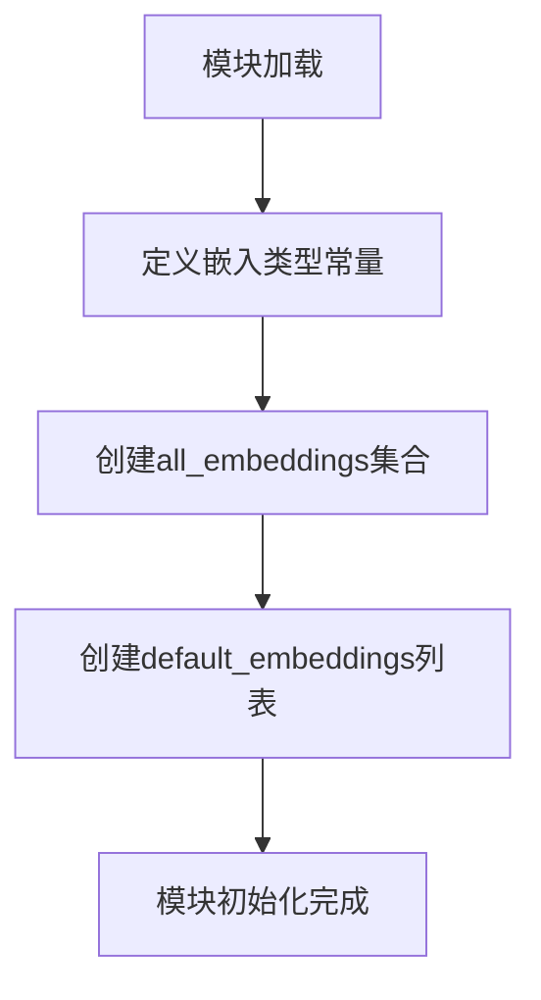

# `graphrag\packages\graphrag\graphrag\config\embeddings.py` 详细设计文档

该模块定义了图谱增强工作流中使用的各种文本嵌入类型的常量标识符，包括实体描述嵌入、社区完整内容嵌入和文本单元文本嵌入，并提供了所有嵌入类型的集合以及默认嵌入类型列表。

## 整体流程



## 类结构

```
该文件为纯配置模块，无类层次结构
```

## 全局变量及字段


### `entity_description_embedding`
    
Embedding type identifier for entity descriptions

类型：`str`
    


### `community_full_content_embedding`
    
Embedding type identifier for community full content

类型：`str`
    


### `text_unit_text_embedding`
    
Embedding type identifier for text unit text

类型：`str`
    


### `all_embeddings`
    
Set containing all available embedding type identifiers

类型：`set[str]`
    


### `default_embeddings`
    
List containing default embedding type identifiers to be used

类型：`list[str]`
    


    

## 全局函数及方法


## 关键组件


### entity_description_embedding

实体描述嵌入的常量标识符，用于在向量数据库中标识实体描述的嵌入向量。

### community_full_content_embedding

社区完整内容嵌入的常量标识符，用于在向量数据库中标识社区完整内容的嵌入向量。

### text_unit_text_embedding

文本单元文本嵌入的常量标识符，用于在向量数据库中标识文本单元文本的嵌入向量。

### all_embeddings

包含所有可用嵌入类型的集合，提供快速的成员资格检查功能。

### default_embeddings

默认使用的嵌入类型列表，按优先级顺序排列，初始化时默认加载这三个嵌入类型。


## 问题及建议


### 已知问题

-   **数据重复定义**：三个嵌入类型名称（entity_description_embedding、community_full_content_embedding、text_unit_text_embedding）被定义了三次，分别在变量名、all_embeddings集合和default_embeddings列表中，增加维护成本和出错风险
-   **类型不一致**：all_embeddings定义为set[str]，default_embeddings定义为list[str]，两者表示相同的数据却使用不同类型，可能导致调用方处理混乱
-   **缺乏文档说明**：模块级没有任何文档字符串（docstring），新开发者无法快速理解该模块的用途和设计意图
-   **无验证机制**：all_embeddings和default_embeddings的内容一致性没有运行时验证，如果修改一个而忘记修改另一个，会导致隐蔽的bug
-   **扩展性差**：新增嵌入类型需要手动在多个地方添加，违反DRY（Don't Repeat Yourself）原则

### 优化建议

-   **消除重复数据**：使用单一数据源生成all_embeddings和default_embeddings，例如：`default_embeddings = [entity_description_embedding, community_full_content_embedding, text_unit_text_embedding]` 然后 `all_embeddings = set(default_embeddings)`
-   **添加模块文档**：在文件开头添加模块级docstring，说明该模块用于定义各种嵌入类型的名称标识
-   **增加一致性验证**：添加运行时检查确保all_embeddings和default_embeddings的内容一致，例如在模块加载时验证
-   **考虑使用枚举**：如果嵌入类型数量较少且固定，可考虑使用Enum类替代字符串常量，提供更强的类型安全和IDE支持
-   **统一类型定义**：如果业务逻辑上all_embeddings必须是集合且default_embeddings必须是列表，保持当前设计但添加注释说明原因


## 其它


### 设计目标与约束

本模块旨在定义和管理GraphRAG系统中使用的各种嵌入类型标识符，提供统一的嵌入常量集合供其他模块引用。设计约束包括：仅存储字符串标识符，不包含实际的嵌入向量数据；保持常量不可变性；确保嵌入类型名称的唯一性。

### 错误处理与异常设计

本模块为纯数据定义模块，不涉及复杂业务逻辑，错误处理主要依赖Python内置的集合类型异常（如尝试修改frozenset时的TypeError）。建议在使用处进行输入验证，确保嵌入名称存在于all_embeddings集合中。

### 数据流与状态机

数据流为单向流动：常量定义 → all_embeddings集合 → default_embeddings列表 → 被其他模块引用。状态机不适用，因该模块无状态管理需求。

### 外部依赖与接口契约

该模块无外部依赖，仅使用Python标准库。接口契约：all_embeddings返回frozenset类型（建议修改为frozenset以确保不可变性），default_embeddings返回list类型。调用方应期望返回字符串集合或列表。

### 配置管理

当前设计将嵌入类型硬编码在模块中。建议扩展：支持通过配置文件或环境变量动态添加自定义嵌入类型，或提供配置类集中管理所有嵌入配置。

### 版本兼容性

该模块遵循MIT许可证，版本随主项目演进。当前版本无API弃用计划。未来若需添加新嵌入类型，建议保持向后兼容，通过增量方式添加而非修改现有常量。

### 性能考虑

all_embeddings和default_embeddings在模块加载时初始化，运行时无性能开销。集合查找操作时间复杂度为O(1)，列表遍历为O(n)。建议将default_embeddings改为frozenset以优化查找性能。

### 安全性考虑

该模块仅包含字符串常量，无敏感数据处理。嵌入标识符为公开元数据，无安全风险。

### 测试策略

建议添加单元测试验证：all_embeddings包含所有预期嵌入类型；default_embeddings长度与all_embeddings一致；所有嵌入名称为非空字符串；集合与列表元素一致性校验。

### 扩展性

当前架构支持轻松添加新嵌入类型：定义新常量 → 添加到all_embeddings → 添加到default_embeddings。扩展建议：考虑使用枚举类（Enum）替代字符串常量，提供类型安全和IDE自动补全；或实现嵌入注册机制支持运行时动态注册。

### 使用示例

```python
from graphrag.embeddings.types import all_embeddings, default_embeddings

# 检查嵌入类型是否存在
if "entity_description" in all_embeddings:
    print("Entity description embedding is available")

# 遍历所有默认嵌入
for embedding in default_embeddings:
    print(f"Using embedding: {embedding}")
```

### 维护建议

技术债务：1) default_embeddings应使用frozenset以保持与all_embeddings的一致性；2) 缺少类型注解（Type Hints）；3) 建议添加__all__显式导出公共接口。优化方向：考虑迁移至枚举类或数据类，提供更强的类型安全性和可维护性。


    