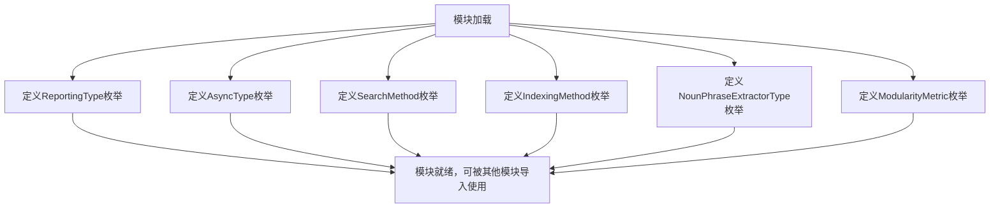
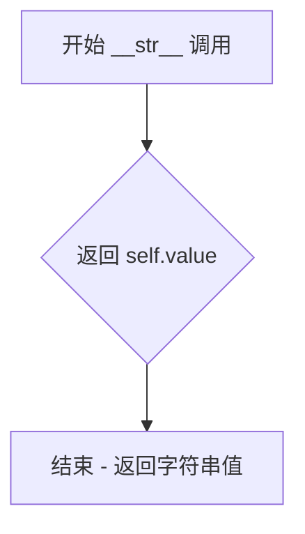

# `graphrag\packages\graphrag\graphrag\config\enums.py` 详细设计文档

这是一个配置枚举模块，定义了GraphRAG管道中使用的各种配置选项，包括报告类型、异步执行方式、搜索方法、索引方法、名词短语提取器和模块性度量等枚举类型。

## 整体流程



## 类结构

```
config_enums.py (模块)
├── ReportingType (str, Enum)
├── AsyncType (str, Enum)
├── SearchMethod (Enum)
├── IndexingMethod (str, Enum)
├── NounPhraseExtractorType (str, Enum)
└── ModularityMetric (str, Enum)
```

## 全局变量及字段


### `ReportingType.ReportingType.file`
    
The file reporting configuration type.

类型：`ReportingType`
    


### `ReportingType.ReportingType.blob`
    
The blob reporting configuration type.

类型：`ReportingType`
    


### `AsyncType.AsyncType.AsyncIO`
    
The asyncio async type.

类型：`AsyncType`
    


### `AsyncType.AsyncType.Threaded`
    
The threaded async type.

类型：`AsyncType`
    


### `SearchMethod.SearchMethod.LOCAL`
    
The local search method.

类型：`SearchMethod`
    


### `SearchMethod.SearchMethod.GLOBAL`
    
The global search method.

类型：`SearchMethod`
    


### `SearchMethod.SearchMethod.DRIFT`
    
The drift search method.

类型：`SearchMethod`
    


### `SearchMethod.SearchMethod.BASIC`
    
The basic search method.

类型：`SearchMethod`
    


### `IndexingMethod.IndexingMethod.Standard`
    
Traditional GraphRAG indexing with all graph construction and summarization performed by a language model.

类型：`IndexingMethod`
    


### `IndexingMethod.IndexingMethod.Fast`
    
Fast indexing using NLP for graph construction and language model for summarization.

类型：`IndexingMethod`
    


### `IndexingMethod.IndexingMethod.StandardUpdate`
    
Incremental update with standard indexing.

类型：`IndexingMethod`
    


### `IndexingMethod.IndexingMethod.FastUpdate`
    
Incremental update with fast indexing.

类型：`IndexingMethod`
    


### `NounPhraseExtractorType.NounPhraseExtractorType.RegexEnglish`
    
Standard extractor using regex, fastest but limited to English.

类型：`NounPhraseExtractorType`
    


### `NounPhraseExtractorType.NounPhraseExtractorType.Syntactic`
    
Noun phrase extractor based on dependency parsing and NER using SpaCy.

类型：`NounPhraseExtractorType`
    


### `NounPhraseExtractorType.NounPhraseExtractorType.CFG`
    
Noun phrase extractor combining CFG-based noun-chunk extraction and NER.

类型：`NounPhraseExtractorType`
    


### `ModularityMetric.ModularityMetric.Graph`
    
Graph modularity metric.

类型：`ModularityMetric`
    


### `ModularityMetric.ModularityMetric.LCC`
    
LCC modularity metric.

类型：`ModularityMetric`
    


### `ModularityMetric.ModularityMetric.WeightedComponents`
    
Weighted components modularity metric.

类型：`ModularityMetric`
    
    

## 全局函数及方法


### `ReportingType.__repr__`

该方法覆盖了枚举的默认 `__repr__` 实现，返回带引号的枚举值字符串表示，用于调试和日志输出。

参数：
- 无显式参数（`self` 为隐式参数，表示枚举实例本身）

返回值：`str`，返回带双引号包裹的枚举值字符串，例如 `"file"` 或 `"blob"`

#### 流程图

```mermaid
flowchart TD
    A[开始 __repr__] --> B[获取 self.value]
    B --> C[格式化为带引号字符串 f"{self.value}"]
    C --> D[返回格式化后的字符串]
```

#### 带注释源码

```python
def __repr__(self):
    """Get a string representation."""
    # self 是枚举实例，self.value 获取枚举成员的值（"file" 或 "blob"）
    # 使用 f-string 将值包裹在双引号中，返回类似 "file" 的字符串
    return f'"{self.value}"'
```


### `SearchMethod.__str__`

返回搜索方法枚举值的字符串表示。当对 `SearchMethod` 枚举成员调用 `str()` 或 `print()` 时，此方法被自动调用，将枚举成员转换为其底层字符串值（如 "local"、"global" 等）。

参数：

- 无显式参数（隐式参数 `self` 为 `SearchMethod` 枚举实例）

返回值：`str`，返回枚举成员的底层字符串值（例如 "local"、"global"、"drift" 或 "basic"）

#### 流程图



#### 带注释源码

```python
def __str__(self):
    """Return the string representation of the enum value."""
    return self.value
```

**注释说明：**

- `def __str__(self):` - 定义 `__str__` 特殊方法，使枚举成员在转换为字符串时使用自定义行为
- `"""Return the string representation of the enum value."""` - 方法文档字符串，说明该方法返回枚举值的字符串表示
- `return self.value` - 返回枚举成员的底层值，由于 `SearchMethod` 继承自 `Enum` 且值均为字符串类型，此处直接返回枚举成员被赋值时的字符串（如 "local"）

## 关键组件


### ReportingType
报告配置类型枚举，定义管道报告输出的目标类型，支持文件(file)和blob两种模式。

### AsyncType
异步执行类型枚举，定义管道使用的异步实现方式，支持Asyncio和Threaded两种模式。

### SearchMethod
搜索方法枚举，定义图搜索算法的类型，支持LOCAL、GLOBAL、DRIFT和BASIC四种搜索策略。

### IndexingMethod
索引方法枚举，定义图索引构建的方式，支持Standard、Fast、StandardUpdate和FastUpdate四种模式，用于平衡索引速度和功能完整性。

### NounPhraseExtractorType
名词短语提取器类型枚举，定义用于从文本中提取名词短语的方法，支持RegexEnglish、Syntactic和CFG三种技术方案。

### ModularityMetric
模块化度量枚举，定义图社区检测的评估指标，支持Graph、LCC和WeightedComponents三种度量方式。


## 问题及建议


### 已知问题

- **枚举继承模式不统一**：`ReportingType`、`AsyncType`、`IndexingMethod`、`NounPhraseExtractorType`、`ModularityMetric` 继承自 `str, Enum`，而 `SearchMethod` 仅继承自 `Enum`，导致行为不一致（str子类的枚举可以直接与字符串比较，但SearchMethod需要通过value访问）
- **文档字符串不完整**：`AsyncType` 枚举类本身没有文档字符串；`SearchMethod` 的成员 `LOCAL`、`GLOBAL`、`DRIFT`、`BASIC` 缺少文档描述；`ModularityMetric` 的 `LCC` 成员缺少文档说明
- **方法实现不一致**：`ReportingType` 实现了 `__repr__`，`SearchMethod` 实现了 `__str__`，其他枚举类没有实现任何魔术方法，这种不一致可能影响调试和序列化体验
- **缺少类型注解**：虽然使用了 `from __future__ import annotations`，但枚举类的成员方法（如 `__repr__`、`__str__`）缺少显式返回类型注解
- **命名规范不一致**：部分枚举值使用全小写（如 `file`、`blob`），部分使用大写（如 `LOCAL`、`GLOBAL`），部分使用驼峰式（如 `AsyncIO`、`Standard`），这种混合风格降低了代码可读性
- **缺少 `__all__` 定义**：模块没有显式导出公共API，不方便静态分析和IDE自动完成

### 优化建议

- **统一枚举基类**：建议将所有需要与字符串互操作的枚举统一使用 `str, Enum` 继承，保持行为一致性
- **补充文档字符串**：为所有枚举类和枚举成员添加 docstring，特别是 `AsyncType`、`SearchMethod` 的成员和 `ModularityMetric.LCC`
- **统一方法实现**：考虑为所有枚举类统一实现 `__str__` 方法（返回 `self.value`），或者都不实现，使用默认行为
- **统一命名风格**：建议采用统一的命名规范，如全部使用大写（符合Python常量约定）或全部使用小写字符串值
- **添加类型注解**：为魔术方法添加明确的返回类型，如 `def __repr__(self) -> str:`
- **添加 `__all__`**：显式声明模块公共接口，如 `__all__ = ["ReportingType", "AsyncType", "SearchMethod", "IndexingMethod", "NounPhraseExtractorType", "ModularityMetric"]`
- **考虑添加枚举验证**：可以添加类方法如 `from_value(cls, value: str)` 来提供更安全的枚举值解析


## 其它


### 设计目标与约束

本模块的设计目标是提供GraphRAG管道配置的枚举类型定义，确立统一的配置选项规范，支持文件/Blob报告类型、异步处理方式、搜索方法、索引策略、名言短语提取和模块化度量等核心配置维度。所有枚举继承str或Enum基类以确保良好的序列化和字符串比较能力，遵循Python 3.10+的类型注解最佳实践。

### 错误处理与异常设计

本模块为纯枚举定义模块，不涉及运行时错误处理逻辑。枚举值在运行时传递时应确保有效性验证由调用方负责。建议在使用处通过try-except捕获Enum中不存在的值，或使用枚举的__str__/__repr__方法进行安全的字符串转换。

### 外部依赖与接口契约

本模块依赖Python标准库enum和__future__模块（用于from __future__ import annotations以支持前瞻类型注解）。无第三方依赖。模块采用开源协议（MIT License），通过枚举类的字符串继承特性支持JSON/YAML等配置文件序列化，与外部配置系统（如pydantic、dataclass）的集成应保持向后兼容性。

### 使用示例与API调用约定

建议通过枚举类直接访问配置值，如SearchMethod.LOCAL.value获取字符串"local"，或使用SearchMethod("local")进行反向转换。AsyncType和IndexingMethod继承str支持直接字符串比较。所有枚举成员应保持小写命名规范以符合配置文件的约定。

### 版本历史与兼容性说明

当前版本为1.0.0，与GraphRAG主版本同步。ReportingType和AsyncType新增字符串混入（str, Enum）以改善序列化兼容性。未来可能的变更包括：新增枚举成员将视为非破坏性变更，移除现有成员将标记为破坏性变更并记录在changelog中。

### 测试策略与验证要点

应覆盖枚举成员完整性验证、字符串序列化/反序列化、__str__和__repr__方法返回值的正确性、以及与配置文件交互的场景。建议使用pytest的parametrize进行穷举式测试，确保枚举成员变更时测试自动失败。

### 配置验证与约束规则

IndexingMethod的"update"后缀变体表示增量模式，与基础模式互斥。SearchMethod.DRIFT适用于需要探索性搜索的场景。NounPhraseExtractorType.Syntactic依赖SpaCy模型，运行时需确保模型可用。ModularityMetric.LCC为简写形式，文档应明确其全称为"Local Cluster Coefficient"。


    