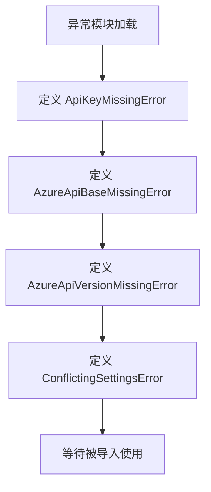
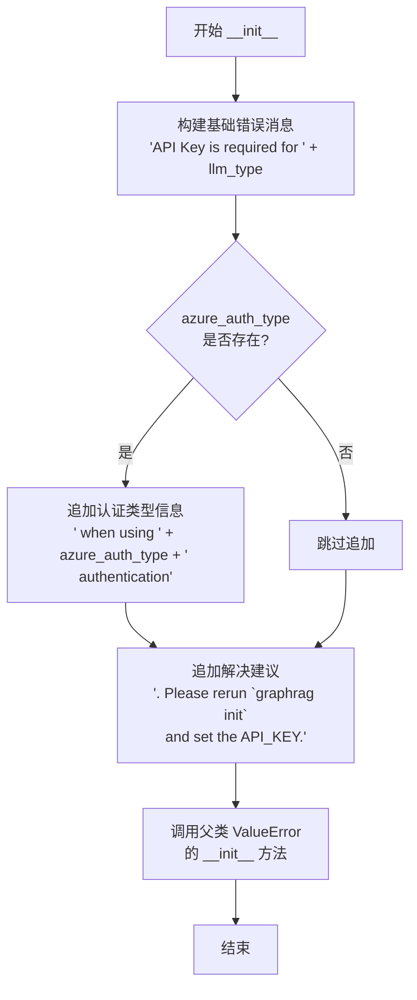

# `graphrag\packages\graphrag\graphrag\config\errors.py` 详细设计文档

该文件定义了 GraphRAG 配置相关的自定义异常类，用于在缺少 API Key、Azure API 配置或存在冲突设置时提供清晰的错误信息。

## 整体流程



## 类结构

```
ValueError (内置异常)
├── ApiKeyMissingError
├── AzureApiBaseMissingError
├── AzureApiVersionMissingError
└── ConflictingSettingsError
```

## 全局变量及字段


### `ApiKeyMissingError.llm_type`
    
The LLM type identifier used in the error message construction

类型：`str`
    


### `ApiKeyMissingError.azure_auth_type`
    
Optional Azure authentication type for contextual error messaging

类型：`str | None`
    


### `AzureApiBaseMissingError.llm_type`
    
The LLM type identifier used in the error message construction

类型：`str`
    


### `AzureApiVersionMissingError.llm_type`
    
The LLM type identifier used in the error message construction

类型：`str`
    


### `ConflictingSettingsError.msg`
    
The custom error message describing the conflicting settings

类型：`str`
    
    

## 全局函数及方法


### `ApiKeyMissingError.__init__`

初始化方法，用于创建 API 密钥缺失错误异常实例。当 LLM 调用缺少必要的 API Key 时抛出此异常，支持根据 LLM 类型和 Azure 认证方式生成详细的错误提示信息。

参数：

- `self`：隐式参数，异常类实例本身
- `llm_type`：`str`，要使用的 LLM 类型（如 "openai"、"azure-openai" 等）
- `azure_auth_type`：`str | None`，可选的 Azure 认证类型（如 "api_key"、"managed_identity" 等），用于提供更精确的错误描述

返回值：`None`，无返回值（`__init__` 方法的返回类型标注为 `None`）

#### 流程图



#### 带注释源码

```python
class ApiKeyMissingError(ValueError):
    """LLM Key missing error."""

    def __init__(self, llm_type: str, azure_auth_type: str | None = None) -> None:
        """Init method definition.
        
        初始化 API 密钥缺失异常，根据传入的 LLM 类型和可选的 Azure 认证类型
        构建友好的错误消息，帮助用户定位问题并提供解决建议。
        
        Args:
            llm_type: LLM 类型标识，用于说明哪个服务缺少 API Key
            azure_auth_type: 可选的 Azure 认证方式，用于提供更精确的错误描述
        
        Returns:
            None: 异常类初始化方法不返回值
        """
        # Step 1: 构建基础错误消息，包含缺少 API Key 的 LLM 类型
        msg = f"API Key is required for {llm_type}"
        
        # Step 2: 如果指定了 Azure 认证类型，追加认证方式说明
        # 这样可以帮助用户理解在特定认证场景下的问题
        if azure_auth_type:
            msg += f" when using {azure_auth_type} authentication"
        
        # Step 3: 追加解决建议，指导用户如何修复问题
        msg += ". Please rerun `graphrag init` and set the API_KEY."
        
        # Step 4: 调用父类 ValueError 的初始化方法，传入格式化后的错误消息
        # 这会使异常对象携带错误信息，并可被 try-except 捕获
        super().__init__(msg)
```


### `AzureApiBaseMissingError.__init__`

该方法是 `AzureApiBaseMissingError` 异常类的初始化方法，用于在缺少 Azure API Base 配置时抛出带有明确提示信息的错误。

参数：

- `llm_type`：`str`，LLM 类型，用于在错误消息中指明需要配置 API Base 的 LLM 类型

返回值：`None`，无返回值（`__init__` 方法）

#### 流程图

```mermaid
flowchart TD
    A[开始 __init__] --> B{接收 llm_type 参数<br/>类型: str}
    B --> C[构造错误消息 msg<br/>格式: "API Base is required for {llm_type}. Please rerun `graphrag init` and set the api_base."]
    C --> D[调用父类构造函数<br/>super().__init__(msg)]
    D --> E[结束]
```

#### 带注释源码

```python
class AzureApiBaseMissingError(ValueError):
    """Azure API Base missing error."""

    def __init__(self, llm_type: str) -> None:
        """Init method definition."""
        # 构造错误消息，包含缺失的 API Base 提示和修复步骤
        msg = f"API Base is required for {llm_type}. Please rerun `graphrag init` and set the api_base."
        # 调用父类 ValueError 的初始化方法，传入错误消息
        super().__init__(msg)
```


### `AzureApiVersionMissingError.__init__`

初始化方法，用于创建 AzureApiVersionMissingError 异常实例，当 Azure API 版本缺失时抛出该错误。

参数：

- `llm_type`：`str`，LLM 类型参数，用于在错误消息中指定需要 API Version 的 LLM 类型

返回值：`None`，无返回值

#### 流程图

```mermaid
flowchart TD
    A[开始 __init__] --> B[接收 llm_type 参数]
    B --> C[构造错误消息 msg]
    C --> D[调用 super().__init__ 传入错误消息]
    D --> E[结束]
```

#### 带注释源码

```python
class AzureApiVersionMissingError(ValueError):
    """Azure API version missing error."""

    def __init__(self, llm_type: str) -> None:
        """Init method definition.
        
        Args:
            llm_type: LLM类型，用于错误消息中说明需要API Version的LLM
        """
        # 构建错误消息，包含LLM类型和修复指引
        msg = f"API Version is required for {llm_type}. Please rerun `graphrag init` and set the api_version."
        # 调用父类ValueError的初始化方法，传入错误消息
        super().__init__(msg)
```


### `ConflictingSettingsError.__init__`

初始化配置冲突错误异常对象。该方法继承自ValueError，用于在发现配置设置冲突时抛出异常，例如当多个配置选项相互矛盾时使用。

参数：

- `msg`：`str`，错误消息，描述具体的配置冲突内容

返回值：`None`，无返回值（`__init__` 方法）

#### 流程图

```mermaid
flowchart TD
    A[开始 __init__] --> B[接收 msg 参数]
    B --> C{验证 msg 是否为字符串}
    C -->|是| D[调用 super().__init__msg 传递消息到父类 ValueError]
    C -->|否| E[Python 类型检查会自然处理]
    D --> F[结束]
    E --> F
    
    style A fill:#f9f,color:#333
    style D fill:#9f9,color:#333
    style F fill:#ff9,color:#333
```

#### 带注释源码

```python
class ConflictingSettingsError(ValueError):
    """Missing model configuration error."""
    # 该异常类用于表示配置冲突错误，继承自 ValueError
    # 当系统中存在相互矛盾的配置设置时抛出此异常

    def __init__(self, msg: str) -> None:
        """Init method definition."""
        # 参数 msg: str - 错误消息字符串，包含具体的冲突配置描述
        # 例如："Cannot use both 'api_key' and 'azure_api_key' at the same time"
        
        # 调用父类 ValueError 的初始化方法，传递错误消息
        # 这会设置异常的消息内容，使其可以通过 str(error) 或 error.args[0] 访问
        super().__init__(msg)
```


## 关键组件


### ApiKeyMissingError

API密钥缺失错误，当使用LLM服务但未配置API Key时抛出此异常，支持Azure认证类型提示。

### AzureApiBaseMissingError

Azure API基础URL缺失错误，当使用Azure LLM服务但未配置api_base时抛出。

### AzureApiVersionMissingError

Azure API版本缺失错误，当使用Azure LLM服务但未配置api_version时抛出。

### ConflictingSettingsError

配置冲突错误，用于处理LLM设置中的冲突情况，接收自定义错误消息。


## 问题及建议


### 已知问题

- 错误消息中硬编码了 `graphrag init` CLI 命令名称，如果项目重命名或CLI工具名称变更，需要修改所有错误类，耦合度较高
- 四个异常类各自独立定义，缺少统一的配置错误基类，不利于统一捕获和处理
- 错误消息采用字符串拼接方式，重复的提示文本（如 "Please rerun `graphrag init` and set the..."）分散在多个类中，维护性差
- `ConflictingSettingsError` 的构造函数与其他三个类风格不一致，其他类接收结构化参数（如 `llm_type`），而该类直接接收完整消息字符串
- 缺少错误码（error code）机制，无法通过程序化方式识别和处理特定错误类型
- 没有为开发者提供调试用的额外上下文信息（如配置路径、当前环境等）
- 缺少异常序列化方法，在分布式日志收集或跨进程传递时可能受限

### 优化建议

- 创建一个统一的配置错误基类（如 `ConfigurationError`），让所有配置相关异常继承，便于统一捕获
- 将重复的错误提示文本提取为常量或枚举类，例如 `CLI_INIT_HELP = "Please rerun `graphrag init` and set the ..."`
- 考虑为每个异常类添加 `error_code` 属性或使用自定义异常基类定义标准化的错误码
- 统一错误构造模式，`ConflictingSettingsError` 可改为与其他类类似的方式接收结构化参数
- 添加可选的 `context` 参数到异常构造函数，用于传递调试所需的额外信息（如配置文件路径、环境变量等）
- 考虑添加 `__repr__` 方法增强调试体验
- 如项目需要多语言支持，可将用户可见的错误消息与内部错误标识分离，引入国际化机制


## 其它


### 设计目标与约束

定义一组统一的配置相关错误异常类，用于在graphrag初始化和配置阶段提供清晰的错误提示。所有异常均继承ValueError，以确保与Python异常处理机制兼容。

### 错误处理与异常设计

本模块定义了4个自定义异常类，均继承自ValueError基类。ApiKeyMissingError支持可选的azure_auth_type参数用于更精确的错误描述；AzureApiBaseMissingError和AzureApiVersionMissingError分别处理Azure特定配置的缺失；ConflictingSettingsError为通用配置冲突异常。异常消息遵循统一格式，包含问题描述和解决建议（提示用户重新运行graphrag init）。

### 外部依赖与接口契约

本模块仅依赖Python标准库，无需外部依赖。异常类实现了标准的__init__方法，接收特定参数并构建人类可读的错误消息。外部调用者可通过except ValueError捕获所有这些异常，或针对特定异常类型进行处理。

### 安全性考虑

异常消息中不包含敏感信息（如实际API密钥值），仅提示缺失配置项名称。错误消息指向用户重新运行初始化命令，不暴露系统内部路径或配置细节。

### 测试策略

应编写单元测试验证：1) 每个异常类可正确实例化；2) 异常消息格式符合预期；3) 异常可被正确捕获和抛出；4) ApiKeyMissingError的azure_auth_type参数可正确追加到错误消息中。

### 使用示例

```python
# 缺少API Key时抛出
raise ApiKeyMissingError("azure_openai", "key")

# 缺少Azure API Base时抛出
raise AzureApiBaseMissingError("azure_openai")

# 缺少Azure API Version时抛出
raise AzureApiVersionMissingError("azure_openai")

# 配置冲突时抛出
raise ConflictingSettingsError("cannot use both local and remote mode")
```

### 版本历史

该模块属于graphrag项目的一部分，当前版本遵循MIT许可证。异常设计反映了graphrag init配置流程的架构需求。

    