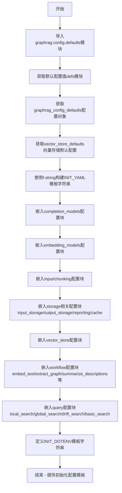

# `graphrag\packages\graphrag\graphrag\config\init_content.py` 详细设计文档

该模块为GraphRAG CLI命令提供初始化配置模板，通过导入graphrag.config.defaults模块中的默认值，生成包含LLM设置、文档处理配置、存储配置、工作流设置和查询配置等完整YAML配置文件模板以及.env环境变量模板。

## 整体流程



## 类结构

```
该文件为配置模板生成模块，无面向对象结构
纯函数式模块 - 仅包含配置字符串定义
```

## 全局变量及字段


### `INIT_YAML`
    
初始化YAML配置文件模板，包含完整GraphRAG配置结构

类型：`str`
    


### `INIT_DOTENV`
    
.env环境变量模板，包含GRAPHRAG_API_KEY占位符

类型：`str`
    


### `defs`
    
graphrag.config.defaults模块引用，包含所有默认配置常量

类型：`module`
    


### `graphrag_config_defaults`
    
默认图谱配置对象，提供input/chunking/storage等默认值

类型：`ConfigDefaults`
    


### `vector_store_defaults`
    
默认向量存储配置对象

类型：`VectorStoreDefaults`
    


    

## 全局函数及方法


## 关键组件


### INIT_YAML 配置模板

用于生成GraphRAG系统的默认YAML配置文件，包含完整的配置结构定义，涵盖LLM模型设置、文档处理、存储配置、工作流设置和查询方法等核心配置项。

### INIT_DOTENV 环境变量模板

定义GraphRAG必需的API密钥环境变量配置，用于存储LLM服务的认证凭证。

### graphrag_config_defaults 导入模块

提供GraphRagConfigDefaults类实例，包含所有配置项的默认值，如输入类型、chunking参数、存储配置、嵌入模型配置、图提取设置、社区报告设置等。

### vector_store_defaults 导入模块

提供向量存储的默认配置，包括数据库类型(db_uri)等向量存储相关设置。

### DEFAULT_COMPLETION_MODEL_ID 常量

定义默认完成模型的标识符，用于LLM调用配置。

### DEFAULT_MODEL_PROVIDER 常量

定义默认的模型提供商，标识使用的LLM服务来源。

### DEFAULT_EMBEDDING_MODEL_AUTH_TYPE 常量

定义默认嵌入模型的认证方式配置。


## 问题及建议


### 已知问题

-   **默认值访问方式不一致**：代码混合使用了直接对象属性访问（如`graphrag_config_defaults.input.type.value`）和导入的常量（如`defs.DEFAULT_COMPLETION_MODEL_ID`），这种不一致的访问方式增加了维护难度。
-   **YAML格式化风险**：`entity_types: [{",".join(graphrag_config_defaults.extract_graph.entity_types)}]` 生成的YAML格式存在潜在问题，中括号可能导致YAML解析器将其视为内联列表而非字符串。
-   **缺乏错误处理**：代码没有对导入的defaults模块进行任何验证，如果所需的属性不存在，程序将直接崩溃并抛出AttributeError。
-   **文档URL硬编码**：文档链接是硬编码的字符串常量（https://microsoft.github.io/graphrag/config/yaml/），缺乏灵活配置机制，且无法支持多版本或自定义文档站点。
-   **路径假设过于刚性**：所有prompt文件路径（如"prompts/extract_graph.txt"）都是硬编码假设，缺乏灵活性，无法适应不同项目结构。
-   **环境变量处理不完善**：直接使用`${{GRAPHRAG_API_KEY}}`语法，但没有验证或提示用户如何设置环境变量，缺乏用户引导。

### 优化建议

-   **统一默认值访问方式**：建议创建统一的配置访问接口，将所有默认值通过一致的API暴露，避免直接访问内部属性和导入常量混用的情况。
-   **改进YAML生成逻辑**：使用专业的YAML库（如PyYAML）来生成配置，而不是依赖字符串f-string格式化，可避免特殊字符转义问题和格式错误。
-   **添加配置验证**：在生成配置前，添加对defaults模块的完整性检查，验证所有必需的键和默认值是否存在，提供有意义的错误信息。
-   **配置化URL和路径**：将文档URL、prompt文件路径等可配置项提取到独立的配置文件中，支持项目自定义。
-   **增强用户引导**：在生成.env文件时添加注释说明如何获取API密钥，或者提供交互式引导流程。
-   **考虑模板拆分**：将过长的INIT_YAML模板拆分为多个逻辑模块（LLM配置、存储配置、工作流配置等），提高可读性和可维护性。
-   **版本控制**：在生成的配置中添加配置版本号，便于后续配置迁移和兼容性处理。


## 其它


### 设计目标与约束

该模块的核心设计目标是为GraphRAG项目生成标准化的默认配置文件（YAML和.env），确保新用户能够快速启动项目。设计约束包括：1）必须从`graphrag.config.defaults`模块导入所有默认值，保证配置的一致性；2）生成的YAML配置必须符合GraphRAG的schema要求；3）敏感信息（如API密钥）必须通过环境变量处理，不能硬编码；4）配置项必须包含所有必需字段和常见可选字段的默认值。

### 错误处理与异常设计

该模块主要涉及静态配置模板的生成，错误处理相对简单。主要潜在错误包括：1）默认值模块导入失败或默认值属性不存在，会抛出`AttributeError`或`ImportError`；2）配置值格式化错误（如f-string语法错误）。错误处理策略：在模块加载时通过Python的导入机制捕获缺失依赖；配置值使用安全的字符串格式化，避免注入风险。

### 数据流与状态机

数据流相对简单：默认值模块(defs) → 配置模板生成(INIT_YAML) → 输出文件。状态机描述：1）初始状态：加载默认值；2）生成状态：将默认值格式化为YAML字符串；3）完成状态：返回配置模板供CLI命令写入文件。无复杂状态转换。

### 外部依赖与接口契约

外部依赖包括：1）`graphrag.config.defaults`模块 - 提供所有配置默认值；2）`graphrag.config.defaults`中的`graphrag_config_defaults`对象 - 包含输入、chunking、存储等配置；3）`graphrag.config.defaults`中的`vector_store_defaults`对象 - 向量存储默认配置。接口契约：调用者通过导入INIT_YAML和INIT_DOTENV常量获取配置模板字符串。

### 安全性考虑

安全性主要涉及敏感信息处理：1）API密钥使用`${{GRAPHRAG_API_KEY}}`占位符，不硬编码实际密钥；2）提示用户将API密钥设置在生成的.env文件中；3）支持多种认证方式（api_key、azure_managed_identity），允许用户选择更安全的认证方案。

### 配置验证与约束

生成的配置包含以下隐式约束：1）completion_models和embedding_models必须指定model_provider、model、auth_method；2）storage类型必须从允许的选项中选择（file、blob、cosmosdb）；3）chunking参数size和overlap必须为正整数；4）社区报告和图聚类参数有最大长度/大小限制。

### 版本管理与兼容性

该配置模板与特定版本的GraphRAG默认值绑定。当GraphRAG版本升级时：1）默认值可能变化，模板需要同步更新；2）通过文档链接指向最新配置文档；3）支持快照选项（graphml、embeddings）允许用户控制输出格式。

### 文档与注释

代码中包含必要的注释说明：1）配置文件的用途说明；2）各配置段的用途注释；3）指向完整配置文档的URL链接；4）认证方式的示例说明。文档链接指向`https://microsoft.github.io/graphrag/config/yaml/`提供完整配置参考。


    