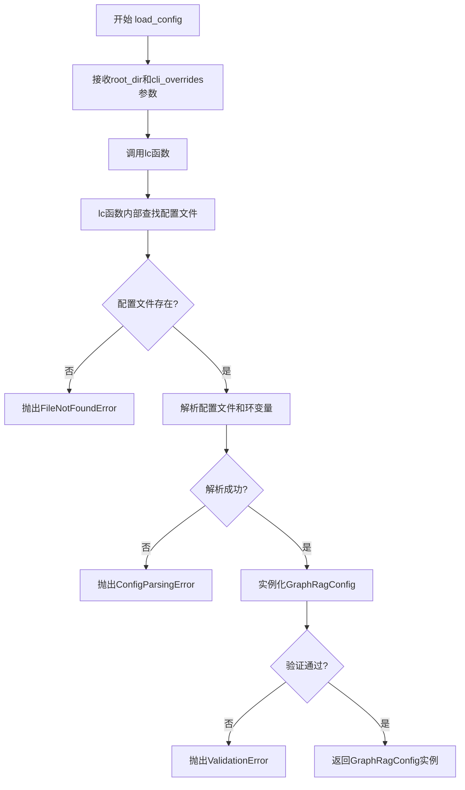
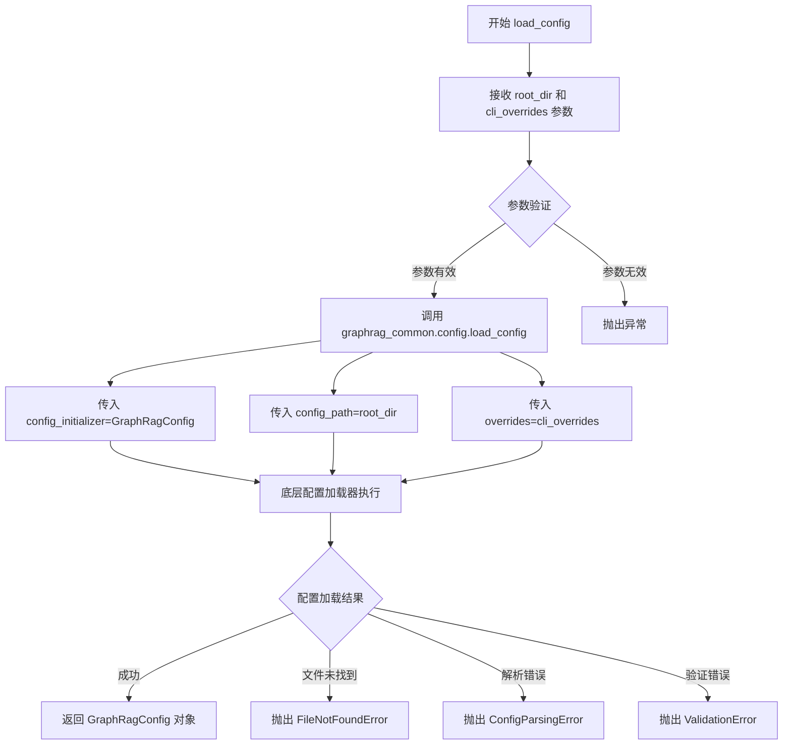

# `graphrag\packages\graphrag\graphrag\config\load_config.py` 详细设计文档

配置加载模块的入口文件，提供load_config函数用于从项目根目录搜索YAML/JSON配置文件并加载GraphRagConfig对象，支持通过cli_overrides参数进行运行时配置覆盖。

## 整体流程



## 类结构

```
该文件为模块入口，不包含类定义
仅包含一个全局函数load_config
依赖外部模块: graphrag_common.config, graphrag.config.models.graph_rag_config
```

## 全局变量及字段


### `lc`
    
graphrag_common模块中的配置加载函数别名，用于底层配置加载逻辑

类型：`function (graphrag_common.config.load_config)`
    


### `Path`
    
来自pathlib模块的类型提示，表示文件系统路径类型

类型：`typing.TypeAlias (pathlib.Path)`
    


### `Any`
    
来自typing模块的类型提示，表示任意类型，用于灵活的类型声明

类型：`typing.TypeAlias (typing.Any)`
    


    

## 全局函数及方法


### `load_config`

加载配置文件的核心函数，用于从指定根目录查找并加载 `settings.[yaml|yml|json]` 配置文件，同时支持通过 CLI 参数覆盖配置项，最终返回解析后的 `GraphRagConfig` 配置对象。

参数：

- `root_dir`：`str | Path`，项目根目录，函数将在此目录下搜索 `settings.yaml`、`settings.yml` 或 `settings.json` 配置文件
- `cli_overrides`：`dict[str, Any] | None`，可选的 CLI 参数覆盖配置，嵌套字典格式，示例：`{'output': {'base_dir': 'override_value'}}`

返回值：`GraphRagConfig`，返回解析并验证后的配置对象

#### 流程图



#### 带注释源码

```python
# Copyright (c) 2024 Microsoft Corporation.
# Licensed under the MIT License

"""Default method for loading config."""

# 导入标准库 Path 用于路径处理
from pathlib import Path
# 导入 Any 类型用于类型注解
from typing import Any

# 从 graphrag_common 包导入底层的 load_config 函数并重命名为 lc
from graphrag_common.config import load_config as lc

# 导入配置模型类 GraphRagConfig
from graphrag.config.models.graph_rag_config import GraphRagConfig


def load_config(
    root_dir: str | Path,
    cli_overrides: dict[str, Any] | None = None,
) -> GraphRagConfig:
    """Load configuration from a file.

    Parameters
    ----------
    root_dir : str | Path
        The root directory of the project.
        Searches for settings.[yaml|yml|json] config files.
    cli_overrides : dict[str, Any] | None
        A nested dictionary of cli overrides.
        Example: {'output': {'base_dir': 'override_value'}}

    Returns
    -------
    GraphRagConfig
        The loaded configuration.

    Raises
    ------
    FileNotFoundError
        If the config file is not found.
    ConfigParsingError
        If there was an error parsing the config file or its environment variables.
    ValidationError
        If there are pydantic validation errors when instantiating the config.
    """
    # 调用底层配置加载函数，传入配置初始化器、配置路径和覆盖参数
    # config_initializer: 指定使用 GraphRagConfig 类来初始化配置
    # config_path: 指定配置文件所在的根目录
    # overrides: 指定 CLI 参数覆盖值，用于动态修改配置
    return lc(
        config_initializer=GraphRagConfig,
        config_path=root_dir,
        overrides=cli_overrides,
    )
```

## 关键组件


### 核心功能概述

该代码模块提供了一个配置加载的统一入口，通过调用 `graphrag_common` 库的 `load_config` 函数，配合 `GraphRagConfig` 配置模型类，实现从指定根目录加载 YAML/JSON 配置文件，并支持 CLI 参数覆盖的灵活配置机制。

### 文件整体运行流程

1. 接收 `root_dir`（项目根目录）和可选的 `cli_overrides`（CLI覆盖参数）
2. 将参数传递给 `graphrag_common.config.load_config` 函数
3. 底层加载器根据 `root_dir` 查找 `settings.yaml|yml|json` 配置文件
4. 应用 `cli_overrides` 对配置进行覆盖
5. 使用 Pydantic 的 `GraphRagConfig` 进行配置验证和模型实例化
6. 返回完整的配置对象

### 关键组件信息

### load_config 函数

配置加载的主入口函数，负责协调配置文件的加载、环境变量解析和 CLI 参数覆盖

### GraphRagConfig

Pydantic 配置模型类，定义 GraphRAG 系统的所有配置项及其验证规则

### cli_overrides 机制

嵌套字典结构的 CLI 参数覆盖机制，允许通过命令行参数覆盖配置文件中的任意嵌套配置项

### 潜在的技术债务或优化空间

1. **错误处理不够细化**：`load_config` 函数直接返回底层函数调用结果，未对可能的异常进行预处理或添加上下文信息
2. **配置缓存机制缺失**：每次调用都会重新加载和解析配置文件，高频调用场景下可能影响性能
3. **类型提示不够完整**：虽然使用了 `str | Path`，但未使用 Python 3.10+ 的 `from __future__ import annotations` 保留延迟求值特性

### 其它项目

#### 设计目标与约束
- 支持多种配置文件格式（YAML、JSON）
- 支持环境变量插值
- 支持 CLI 参数覆盖
- 依赖 Pydantic 进行配置验证

#### 错误处理设计
- `FileNotFoundError`：配置文件未找到
- `ConfigParsingError`：配置文件解析错误或环境变量错误
- `ValidationError`：Pydantic 模型验证错误

#### 外部依赖
- `graphrag_common.config.load_config`：底层配置加载实现
- `graphrag.config.models.graph_rag_config.GraphRagConfig`：配置数据模型
- `pathlib.Path`：路径处理
- `typing.Any`：动态类型支持


## 问题及建议


### 已知问题

-   **异常处理不透明**：函数文档声明了多种异常（FileNotFoundError、ConfigParsingError、ValidationError），但这些异常直接向上抛出，调用者难以精准区分和处理不同类型的配置加载失败
-   **类型安全不足**：`cli_overrides` 参数使用 `dict[str, Any]` 类型，过于宽松，无法在编译期验证覆盖参数的结构合法性
-   **缺少输入验证**：未对 `root_dir` 参数进行存在性检查或类型预验证，可能导致 `lc` 函数调用时出现难以定位的隐式错误
-   **无运行时可见性**：配置加载过程缺乏日志记录，线上问题排查时难以确认是否应用了正确的配置覆盖
-   **过度封装**：核心逻辑完全委托给 `lc` 函数，本函数仅作为薄包装层，存在职责不明的问题

### 优化建议

-   增加 `root_dir` 的预验证逻辑，检查路径是否存在且为目录类型
-   为 `cli_overrides` 参数定义具体的 Pydantic 模型或 TypedDict，增强类型安全
-   添加结构化日志，记录配置加载的关键节点（如配置路径、覆盖参数、加载结果）
-   考虑将异常转换为统一的配置相关异常类型，提供更友好的错误信息和上下文
-   若 `lc` 支持配置回退机制，可在此层添加默认配置路径的支持，提升函数的独立可用性

## 其它


### 设计目标与约束

本模块的设计目标是为GraphRag框架提供统一的配置加载机制，支持从YAML、JSON配置文件加载配置，并允许通过CLI参数覆盖嵌套配置项。约束条件包括：配置文件必须命名为settings.[yaml|yml|json]，且位于root_dir指定的目录下；CLI覆盖仅支持字典形式的嵌套键值对；必须使用GraphRagConfig作为配置初始化器。

### 错误处理与异常设计

模块定义了三种主要的异常类型：FileNotFoundError当配置文件不存在时抛出；ConfigParsingError当配置文件格式错误或环境变量解析失败时抛出；ValidationError当Pydantic验证配置字段失败时抛出。异常设计遵循Python最佳实践，异常信息应包含具体的错误位置和原因，便于开发者定位问题。

### 数据流与状态机

配置加载的数据流如下：1)接收root_dir和cli_overrides参数；2)调用graphragCommon的lc函数；3)lc函数内部查找settings.[yaml|yml|json]文件；4)解析配置文件为字典；5)合并CLI覆盖值；6)使用GraphRagConfig验证并实例化；7)返回配置对象。状态机包含三个状态：INIT(初始化)、LOADING(加载中)、READY(就绪)或ERROR(错误)。

### 外部依赖与接口契约

主要依赖包括：pathlib.Path用于路径处理；typing.Any用于类型提示；graphrag_common.config.load_config作为底层加载函数；graphrag.config.models.graph_rag_config.GraphRagConfig作为配置模型。接口契约要求root_dir必须为str或Path类型，cli_overrides必须为dict[str, Any]或None，返回值必须为GraphRagConfig实例。

### 配置格式与Schema

支持的配置文件格式为YAML、JSON，文件名必须为settings.yaml、settings.yml或settings.json之一。配置结构遵循GraphRagConfig定义的Pydantic模型，包含输出目录、模型参数、索引配置等嵌套字段。CLI覆盖使用点号分隔的键路径，例如{'output': {'base_dir': 'value'}}覆盖output.base_dir配置项。

### 性能考虑

配置加载为同步阻塞操作，对于单次启动场景性能可接受。优化方向包括：1)配置缓存避免重复加载；2)延迟加载非必要配置项；3)配置文件预编译为Python模块。当前实现无缓存机制，每次调用都会重新解析和验证配置。

### 安全性考虑

配置加载涉及文件系统读取，需要确保root_dir路径安全，避免路径遍历攻击。敏感配置（如API密钥）应通过环境变量注入，而非配置文件明文存储。CLI覆盖参数需进行输入验证，防止恶意配置注入。当前实现未对root_dir进行安全校验，存在潜在风险。

### 测试策略

测试应覆盖：1)正常场景-有效配置文件加载；2)异常场景-文件不存在、格式错误、验证失败；3)CLI覆盖-单层和多层嵌套覆盖；4)边界条件-空配置、默认值处理。建议使用pytest框架，配合mock模拟文件系统操作。

### 使用示例

```python
from graphrag.config.default_config import load_config

# 基本用法
config = load_config("/path/to/project")

# 使用CLI覆盖
overrides = {'output': {'base_dir': './custom_output'}}
config = load_config("/path/to/project", cli_overrides=overrides)

# 访问配置
print(config.output.base_dir)
```

### 版本兼容性

本模块依赖graphrag_common包和graphrag.config.models，需要保持版本同步。建议在项目根目录的requirements.txt或pyproject.toml中明确指定兼容版本范围。当前实现兼容Python 3.9+及Pydantic v2版本。

    