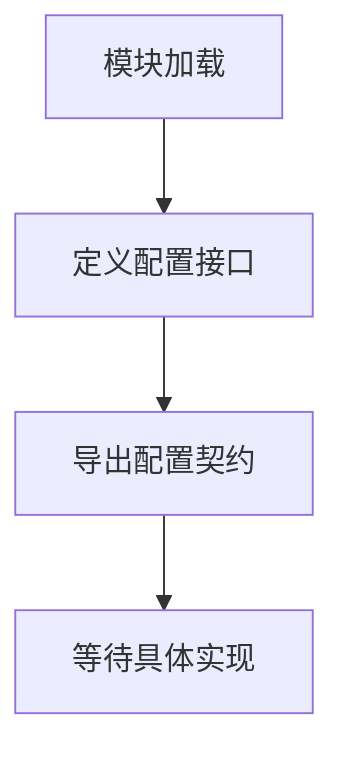

# `graphrag\packages\graphrag\graphrag\config\models\__init__.py` 详细设计文档

这是一个用于默认配置参数化的接口定义文件，属于微软GraphRAG项目的一部分。该文件主要定义了配置相关的接口和契约，用于框架的参数化配置管理。

## 整体流程



## 类结构

```
无类层次结构 - 该文件为纯接口/配置定义模块
```

## 全局变量及字段


    

## 全局函数及方法


## 关键组件


### 一段话描述

该代码文件是一个接口定义文件，用于默认配置的参数化设置，目前仅包含版权信息和模块说明文档，尚未实现具体的功能逻辑。

### 文件的整体运行流程

由于该文件仅包含模块级的文档字符串和版权声明，不包含任何可执行代码，因此不存在实际的运行流程。该文件预计作为配置接口的占位符，后续将填充具体的配置参数化逻辑。

### 类的详细信息

本文件中未定义任何类。

### 全局变量和全局函数

本文件中未定义任何全局变量或全局函数。

### 关键组件信息

由于源代码中未包含具体的实现代码，无法识别出完整的关键组件。以下为基于文件文档字符串推断的预期组件：

**接口定义框架**

- 描述：用于定义和参数化默认配置的接口结构，为后续配置管理提供抽象层

### 潜在的技术债务或优化空间

1. **功能实现缺失**：当前文件仅包含文档字符串，缺少实际的接口定义和实现代码，需要补充配置参数化的核心逻辑
2. **文档不完整**：缺少对预期功能、参数类型、返回值等详细说明
3. **接口契约不明确**：未定义配置参数的具体结构、验证规则和默认值策略

### 其它项目

**设计目标与约束**

- 目标：建立默认配置的参数化接口，支持灵活的配置管理
- 约束：需遵循MIT开源许可证协议

**错误处理与异常设计**

- 当前代码中未实现错误处理机制，需在后续实现中添加

**数据流与状态机**

- 当前代码中未定义数据流或状态机逻辑

**外部依赖与接口契约**

- 当前代码中未声明任何外部依赖或接口契约


## 问题及建议


### 已知问题

-   该文件仅包含版权声明和模块说明文档，缺少实际的接口定义实现内容
-   文件命名与实际功能不匹配：文件名为空但声明为 "Interfaces for Default Config parameterization"，无法验证其声明的接口功能
-   缺少具体的类、函数或接口定义，无法为配置参数化提供任何实际功能

### 优化建议

-   补充完整的接口定义代码，实现 Default Config 参数化的核心接口
-   添加具体的类定义（如 DefaultConfig、ConfigProvider 等）以支持配置参数的设置和获取
-   完善模块文档，增加接口使用示例和参数说明
-   考虑添加类型注解（Type Hints）以提升代码可维护性和 IDE 支持
-   增加错误处理和边界条件检查的逻辑
-   添加单元测试代码以确保接口的正确性和稳定性


## 其它


### 设计目标与约束

本模块旨在为默认配置参数化提供统一的接口抽象层，使得配置管理更加模块化和可扩展。设计约束包括：保持接口简洁明了、遵循微软开源项目代码规范、支持配置的分层覆盖机制、确保配置变更的可追溯性。

### 错误处理与异常设计

由于当前代码仅为接口定义框架，错误处理机制需要在具体实现类中体现。预期异常类型包括：ConfigValidationError（配置验证错误）、ConfigNotFoundError（配置未找到错误）、ConfigPermissionError（配置权限错误）。异常应携带足够的上下文信息以便调试。

### 数据流与状态机

配置参数化的数据流遵循以下路径：配置源（环境变量/配置文件/命令行参数）→ 配置加载器 → 配置验证器 → 配置合并器 → 配置消费者。状态机包括：INITIAL（初始状态）、LOADING（加载中）、VALIDATING（验证中）、READY（就绪）、ERROR（错误状态）。

### 外部依赖与接口契约

本模块作为接口层，不直接依赖外部具体实现。预期依赖包括：Python标准库中的typing模块用于类型注解、可能的第三方配置库（如pyyaml、json5）用于配置解析。接口契约要求所有配置类必须实现统一的加载、验证和获取方法。

### 安全性考虑

配置接口设计应支持敏感信息（如API密钥、数据库凭证）的安全存储和访问。实现类应避免在日志中输出敏感配置值，支持配置加密存储和传输。

### 性能要求

配置加载应在应用启动时完成，配置访问应为O(1)复杂度。对于多层配置覆盖场景，应实现缓存机制避免重复解析。对于大规模配置场景，应支持增量加载和热更新。

### 可扩展性设计

接口设计应支持自定义配置源（支持多种格式如JSON、YAML、TOML）、自定义配置验证器、配置变更监听器。模块应提供插件机制允许第三方扩展配置能力。

### 版本兼容性

本模块版本号应遵循语义化版本规范（SemVer）。接口层应保持向后兼容，不同版本的接口之间应提供迁移路径和弃用警告。

### 测试策略

应包含接口契约测试确保实现类符合规范、单元测试覆盖配置加载和验证逻辑、集成测试验证配置在实际运行场景中的行为、冒烟测试确保基本功能正常工作。

### 部署注意事项

本模块为轻量级接口定义，建议作为依赖项包含在主应用中。部署时应确保配置文件路径正确、配置权限设置合理、敏感配置已正确加密或使用安全存储方案。

### 模块职责定义

本模块（Interfaces for Default Config parameterization）负责定义配置参数化的抽象接口，包括配置加载接口、配置验证接口、配置获取接口等。核心职责是解耦配置管理与具体实现，提供统一的可扩展配置框架。

    